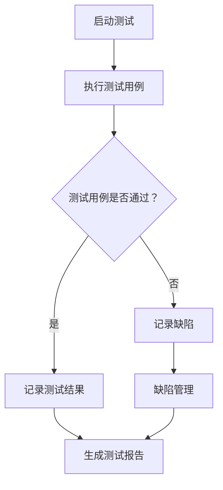

                 

### 需求与测试用例的联动：确保大型应用质量

#### 关键词：
- 需求工程
- 测试用例
- 大型应用
- 质量保证
- 联动策略

#### 摘要：
本文探讨了在大型应用开发过程中，需求与测试用例之间的联动关系，以及如何通过有效的联动策略确保应用质量。首先，介绍了需求工程和测试用例工程的核心概念，然后分析了需求与测试用例之间的联系和挑战。接下来，讨论了大型应用中的需求与测试的特殊挑战，并提出了相应的联动策略和实践方法。通过实际案例研究和项目实战，本文展示了如何将需求与测试用例有效地结合，以实现高质量的应用交付。

#### 目录大纲：

----------------------------------------------------------------

# 需求与测试用例的联动：确保大型应用质量

## 第一部分：背景与概念

### 第1章：问题背景与核心概念

#### 1.1 问题背景

#### 1.2 需求工程概述

#### 1.3 测试用例工程概述

#### 1.4 联动重要性

### 第2章：需求工程核心概念

#### 2.1 需求定义

#### 2.2 需求属性

#### 2.3 需求分类

#### 2.4 需求获取方法

#### 2.5 需求管理

### 第3章：测试用例工程核心概念

#### 3.1 测试用例定义

#### 3.2 测试用例属性

#### 3.3 测试用例设计方法

#### 3.4 测试用例执行

#### 3.5 测试用例管理

### 第4章：需求与测试用例的关系

#### 4.1 需求与测试用例的关联

#### 4.2 需求变动的测试影响分析

#### 4.3 测试用例需求的覆盖分析

#### 4.4 联动案例分析

### 第5章：大型应用中的需求与测试挑战

#### 5.1 大型应用的复杂性

#### 5.2 需求变动与测试迭代

#### 5.3 测试资源的分配

#### 5.4 测试用例的维护

### 第6章：联动策略与实践

### 第7章：工具与方法论

#### 7.1 需求管理工具

#### 7.2 测试用例管理工具

#### 7.3 联动实践方法

#### 7.4 方法论总结

## 第二部分：实际案例与实战

### 第8章：案例研究一：电商平台需求与测试联动

#### 8.1 案例背景

#### 8.2 需求工程实践

#### 8.3 测试用例设计

#### 8.4 联动过程分析

#### 8.5 案例总结

### 第9章：案例研究二：金融应用的需求与测试联动

#### 9.1 案例背景

#### 9.2 需求工程实践

#### 9.3 测试用例设计

#### 9.4 联动过程分析

#### 9.5 案例总结

### 第10章：项目实战：构建需求与测试联动的系统

#### 10.1 环境搭建

#### 10.2 系统架构设计

#### 10.3 需求管理模块实现

#### 10.4 测试用例管理模块实现

#### 10.5 系统运行与结果分析

#### 10.6 项目总结

----------------------------------------------------------------

### 第一部分：背景与概念

#### 第1章：问题背景与核心概念

在当今快速发展的信息技术领域，大型应用的开发已经成为企业竞争的关键因素。这些应用通常涉及复杂的业务逻辑、庞大的数据规模和多样的用户交互，因此保证其质量变得尤为重要。然而，在大型应用开发过程中，需求与测试用例的联动关系常常被忽视，导致最终产品的质量难以达到预期。

首先，我们需要明确需求工程和测试用例工程的核心概念。

### 1.1 问题背景

在大型应用的开发过程中，需求工程和测试用例工程是两个不可或缺的环节。需求工程涉及需求的定义、获取和管理，旨在确保开发团队对用户需求的准确理解和实现。测试用例工程则涉及测试用例的设计、执行和结果分析，旨在发现并修复应用中的缺陷，确保应用的质量和稳定性。

然而，在实际开发过程中，需求与测试用例之间往往存在脱节现象。一方面，需求的不明确或不完整可能导致测试用例设计的不准确或不足；另一方面，测试用例的执行结果可能无法完全反映需求的变化，从而影响需求的实现。

### 1.2 需求工程概述

需求工程是软件工程的重要组成部分，其核心目标是确保开发团队对用户需求的准确理解和实现。需求工程的主要活动包括需求获取、需求建模、需求分析和需求管理。

- **需求获取**：通过访谈、问卷调查、观察等方式收集用户需求，并将其转化为明确的文档。
- **需求建模**：使用各种建模技术，如用例图、活动图和类图等，将需求表达为易于理解的形式。
- **需求分析**：对需求进行验证和分析，确保其一致性、完整性和可实现性。
- **需求管理**：对需求进行版本控制、变更管理和优先级排序，确保需求的稳定性和可追踪性。

### 1.3 测试用例工程概述

测试用例工程是确保软件质量的关键环节，其核心目标是发现并修复软件中的缺陷。测试用例工程的主要活动包括测试用例设计、测试用例执行和测试结果分析。

- **测试用例设计**：根据需求和设计文档，设计能够覆盖所有功能和场景的测试用例。
- **测试用例执行**：按照测试用例执行计划，对软件进行测试，记录测试结果。
- **测试结果分析**：对测试结果进行分析，识别缺陷，并提出修复建议。

### 1.4 联动重要性

需求与测试用例的联动关系在确保大型应用质量中起着至关重要的作用。有效的联动可以确保以下几点：

1. **需求准确实现**：通过联动，开发团队可以更准确地理解和实现用户需求，减少需求误解和遗漏。
2. **测试全面覆盖**：通过联动，测试团队可以更好地设计测试用例，确保测试覆盖所有功能和场景。
3. **快速响应变更**：通过联动，需求变动可以及时传递到测试用例，确保测试用例的更新和执行。
4. **提高质量效率**：联动可以减少需求与测试之间的隔阂，提高整个团队的协作效率，从而提高应用的质量。

综上所述，需求与测试用例的联动关系在大型应用开发中具有重要意义。在接下来的章节中，我们将深入探讨需求工程和测试用例工程的核心概念，以及如何实现有效的联动策略。

### 第2章：需求工程核心概念

#### 2.1 需求定义

在需求工程中，需求是一个关键的概念。需求可以被视为用户对软件系统的期望和需求，是软件开发的起点和终点。准确的需求定义是确保软件开发成功的关键。

- **功能需求**：描述系统应提供的功能和服务，如用户界面、数据处理、通信等功能。
- **非功能需求**：描述系统应具备的非功能性特性，如性能、可靠性、安全性、可维护性等。

需求定义的准确性直接影响开发团队对用户需求的准确理解和实现。因此，在需求定义过程中，需要确保以下几点：

1. **明确性**：需求应清晰明确，避免歧义和模糊。
2. **一致性**：需求应与其他需求、设计文档和测试用例保持一致。
3. **完整性**：需求应覆盖所有功能和场景，避免遗漏。
4. **可行性**：需求应在技术和资源约束下可实现。

#### 2.2 需求属性

需求属性是需求定义的重要组成部分，用于描述需求的各种特征。常见的需求属性包括：

- **需求类型**：功能需求、非功能需求、约束性需求、隐含需求等。
- **需求级别**：关键需求、重要需求、次要需求等，用于描述需求的优先级。
- **需求来源**：用户、业务分析师、项目经理、测试团队等。
- **需求状态**：待确认、已确认、待实现、已实现等，用于描述需求的开发状态。
- **需求优先级**：高、中、低，用于描述需求的紧急程度。

需求属性的明确和准确记录对于需求管理至关重要。通过属性管理，开发团队可以更好地理解和跟踪需求，确保需求的实现和测试。

#### 2.3 需求分类

需求可以根据不同的维度进行分类，常见的分类方法包括：

- **按功能分类**：将需求分为用户界面需求、数据处理需求、通信需求等。
- **按优先级分类**：将需求分为关键需求、重要需求和次要需求。
- **按来源分类**：将需求分为用户需求、业务需求、系统需求等。
- **按实现方式分类**：将需求分为功能需求、性能需求、安全需求等。

需求分类有助于开发团队更好地理解和组织需求，确保需求的全面覆盖和优先级管理。

#### 2.4 需求获取方法

需求获取是需求工程的核心活动之一，其目的是从用户和其他利益相关者那里获取明确的、准确的、完整的需求。常见的需求获取方法包括：

- **访谈**：通过与用户和利益相关者进行面对面的访谈，深入了解用户的需求和期望。
- **问卷调查**：通过设计问卷，收集用户和利益相关者的意见和需求。
- **观察**：通过观察用户在使用系统时的行为和互动，获取实际的需求和痛点。
- **文档分析**：通过分析现有的业务文档、系统文档和用户手册等，获取已有需求和潜在需求。

#### 2.5 需求管理

需求管理是确保需求在软件开发过程中得到有效管理和控制的关键活动。需求管理的目标包括：

- **确保需求的准确性和完整性**：通过需求评审、验证和分析，确保需求的明确性和一致性。
- **需求的优先级排序**：根据需求的紧急程度和重要性，对需求进行优先级排序，确保关键需求优先实现。
- **需求的变更管理**：对需求变更进行评估、审批和跟踪，确保需求的稳定性。
- **需求的追踪和记录**：通过需求跟踪工具和数据库，记录需求的状态和变更历史，确保需求的可追溯性。

需求管理的方法和技术包括：

- **需求跟踪工具**：如JIRA、Confluence等，用于记录、管理和追踪需求。
- **需求文档**：如需求规格说明书、用户故事、需求卡片等，用于描述和传达需求。
- **需求评审**：通过需求评审会议，对需求进行审查和验证，确保需求的质量和可行性。
- **变更管理流程**：制定变更管理流程，确保需求变更的规范和可控制。

通过有效的需求管理，开发团队可以更好地理解和实现用户需求，提高软件开发的效率和成功率。

### 第3章：测试用例工程核心概念

#### 3.1 测试用例定义

测试用例是测试用例工程的核心概念，它是一个定义明确的测试过程，用于验证软件系统的一个或多个功能。测试用例通常包括以下组成部分：

- **测试目标**：明确测试用例的目的和要验证的功能。
- **测试输入**：输入数据或条件，用于触发被测试的功能。
- **测试步骤**：执行测试用例的具体步骤，包括前置条件和操作。
- **期望结果**：测试执行后期望得到的结果。
- **实际结果**：测试执行后实际得到的结果。

测试用例的定义和设计是测试工程的关键，它直接影响测试的覆盖率和有效性。

#### 3.2 测试用例属性

测试用例的属性用于描述测试用例的各种特征和状态，常见的测试用例属性包括：

- **优先级**：测试用例的优先级，用于描述其执行的紧急程度。
- **状态**：测试用例的执行状态，如已设计、未执行、已通过、未通过等。
- **执行时间**：测试用例的执行时间，用于分析测试效率。
- **失败原因**：测试用例执行失败的原因，用于识别和修复缺陷。
- **依赖性**：测试用例之间的依赖关系，如某些测试用例必须在其他测试用例执行完成后才能执行。

测试用例属性的管理对于确保测试过程的有效性和可追溯性至关重要。

#### 3.3 测试用例设计方法

测试用例设计是测试工程的核心活动，其目的是设计能够有效覆盖软件系统各个功能和场景的测试用例。常见的测试用例设计方法包括：

- **等价类划分**：将输入数据划分为等价类，针对每个等价类设计测试用例，确保测试的全面性。
- **边界值分析**：针对输入数据的边界值设计测试用例，确保测试覆盖边界情况。
- **因果图**：通过分析输入条件与输出结果之间的因果关系，设计测试用例。
- **状态转换图**：根据系统的状态转换设计测试用例，确保测试覆盖所有状态转换。
- **场景模拟**：通过模拟实际使用场景设计测试用例，确保测试的真实性和有效性。

有效的测试用例设计可以大大提高测试的覆盖率和测试质量。

#### 3.4 测试用例执行

测试用例执行是测试工程的实施环节，它按照测试用例的步骤和输入数据进行测试，并记录测试结果。测试用例执行的步骤包括：

- **准备测试环境**：确保测试环境符合测试要求，包括硬件、软件和网络等。
- **执行测试步骤**：按照测试用例的步骤进行操作，输入测试数据并执行测试。
- **记录测试结果**：记录测试用例的执行结果，包括成功或失败、错误信息等。
- **分析测试结果**：对测试结果进行分析，识别缺陷和潜在问题。

测试用例执行的有效性直接影响测试的质量和测试报告的准确性。

#### 3.5 测试用例管理

测试用例管理是确保测试用例在整个测试生命周期中得到有效管理和控制的关键活动。测试用例管理的主要内容包括：

- **测试用例的创建和修改**：根据需求和设计文档，创建和修改测试用例。
- **测试用例的版本管理**：对测试用例的版本进行控制，确保测试用例的更新和追踪。
- **测试用例的执行和结果记录**：执行测试用例，记录测试结果，并进行分析。
- **测试用例的归档和删除**：对不再有效的测试用例进行归档或删除。

有效的测试用例管理可以提高测试的效率和测试用例的质量。

### 第4章：需求与测试用例的关系

#### 4.1 需求与测试用例的关联

需求与测试用例之间存在紧密的关联，这种关联是确保软件系统质量和可靠性的关键。具体来说，需求与测试用例的关联主要体现在以下几个方面：

1. **需求驱动测试用例设计**：测试用例的设计基于需求文档，确保测试用例能够覆盖所有需求功能。
2. **测试用例验证需求实现**：通过执行测试用例，验证需求是否得到正确实现。
3. **需求变更影响测试用例**：需求变更可能导致测试用例的更新或删除，确保测试用例与需求的一致性。

#### 4.2 需求变动的测试影响分析

需求变动是软件开发过程中常见的情况，它可能对测试用例产生直接影响。因此，在需求变动时，需要对测试用例的影响进行分析，具体包括：

1. **测试用例的更新**：根据需求变动，更新测试用例的输入、步骤和期望结果，确保测试用例能够覆盖变更后的需求。
2. **测试用例的删除**：如果需求被删除或合并，相关的测试用例也需要被删除或合并，以避免冗余和重复测试。
3. **测试用例的补充**：在需求变动时，可能需要补充新的测试用例，以覆盖新增的功能或修改后的需求。

#### 4.3 测试用例需求的覆盖分析

测试用例需求的覆盖分析是确保测试用例能够全面覆盖需求的关键步骤。常见的覆盖分析方法包括：

1. **功能覆盖**：确保测试用例覆盖所有功能需求，避免遗漏。
2. **路径覆盖**：确保测试用例覆盖所有可能的执行路径，包括正常路径和异常路径。
3. **条件覆盖**：确保测试用例覆盖所有条件分支，包括真分支和假分支。
4. **决策覆盖**：确保测试用例覆盖所有决策点，包括条件判断和循环控制。

通过覆盖分析，可以评估测试用例的质量和完整性，确保测试的全面性。

#### 4.4 联动案例分析

以下是一个需求与测试用例联动的案例分析：

**案例背景**：某电商平台在进行一次重大升级，新增了用户评论功能和订单跟踪功能。这两个功能对用户体验和系统稳定性至关重要，需要确保其质量。

**需求分析**：业务分析师根据用户需求，定义了用户评论功能的详细需求，包括评论发布、评论回复、评论删除等。同时，定义了订单跟踪功能的详细需求，包括订单状态更新、订单历史查询等。

**测试用例设计**：测试团队根据需求文档，设计了用户评论功能的测试用例，包括评论发布成功、评论发布失败、评论回复成功、评论回复失败等。同时，设计了订单跟踪功能的测试用例，包括订单状态更新成功、订单状态更新失败、订单历史查询成功、订单历史查询失败等。

**测试执行**：测试团队按照测试用例执行计划，对用户评论功能和订单跟踪功能进行了测试，记录了测试结果。

**测试结果分析**：测试结果显示，用户评论功能中的评论发布成功，但评论回复失败，原因是后端接口未正确处理评论回复请求。订单跟踪功能中的订单状态更新失败，原因是数据库连接不稳定。

**需求与测试联动**：测试结果反馈到业务分析师和开发团队，业务分析师和开发团队根据测试结果，对需求进行了调整，修正了评论回复接口和数据库连接问题。同时，测试团队重新设计了相关的测试用例，并再次执行测试。

**案例总结**：通过需求与测试用例的联动，电商平台成功识别并解决了用户评论功能和订单跟踪功能中的问题，确保了功能的稳定性和可靠性。

### 第5章：大型应用中的需求与测试挑战

#### 5.1 大型应用的复杂性

大型应用通常涉及复杂的业务逻辑、庞大的数据规模和多样的用户交互，这给需求与测试用例的联动带来了巨大的挑战。

- **业务逻辑复杂**：大型应用需要处理复杂的业务流程和规则，这可能导致需求的不明确和多变。
- **数据规模庞大**：大型应用通常处理海量数据，数据的存储、处理和传输可能成为瓶颈。
- **用户交互多样**：大型应用需要支持多种用户交互方式，如Web、移动端、API等，这增加了测试的复杂性和工作量。

#### 5.2 需求变动与测试迭代

在大型应用开发过程中，需求变动是常态，特别是在项目启动后。需求变动可能导致测试用例的更新、删除或补充，增加了测试的复杂性和工作量。

- **测试用例更新**：需求变动可能需要更新现有的测试用例，以确保测试用例与需求的一致性。
- **测试用例删除**：如果需求被删除或合并，相关的测试用例也需要被删除或合并，以避免冗余和重复测试。
- **测试用例补充**：在需求变动时，可能需要补充新的测试用例，以覆盖新增的功能或修改后的需求。

#### 5.3 测试资源的分配

测试资源的合理分配是确保测试质量的关键。在大型应用开发过程中，测试资源的分配面临以下挑战：

- **人力资源有限**：测试团队通常规模较小，难以覆盖所有的测试需求。
- **时间资源紧张**：测试周期通常较短，需要快速完成测试任务。
- **技术资源不足**：测试工具和环境的配置可能成为瓶颈，影响测试效率。

#### 5.4 测试用例的维护

测试用例的维护是确保测试质量和效率的关键。在大型应用开发过程中，测试用例的维护面临以下挑战：

- **测试用例更新频繁**：需求变动可能导致测试用例的频繁更新，需要确保更新的一致性和准确性。
- **测试用例维护困难**：大型应用的测试用例数量庞大，维护和更新可能成为负担。
- **测试用例覆盖不足**：在需求变动时，可能需要补充新的测试用例，以确保测试覆盖的全面性。

### 第6章：联动策略与实践

#### 6.1 策略概述

为了确保大型应用的质量，需求与测试用例的联动策略至关重要。以下是几种常用的联动策略：

- **需求驱动测试**：以需求为驱动，设计测试用例，确保测试用例覆盖所有需求功能。
- **测试驱动开发**：以测试为驱动，根据测试结果调整需求，确保需求的可测试性。
- **自动化测试**：通过自动化工具，提高测试效率，确保测试用例的执行和结果记录。
- **持续集成**：将需求、设计和测试集成到持续集成流程中，确保需求和测试的及时性和一致性。

#### 6.2 实践方法

以下是实现需求与测试用例联动的具体实践方法：

- **需求评审**：在需求文档发布前，进行需求评审，确保需求明确、一致和可测试。
- **测试计划**：根据需求文档，制定详细的测试计划，包括测试策略、测试用例设计和执行计划。
- **自动化测试脚本**：编写自动化测试脚本，确保测试用例的自动化执行和结果记录。
- **测试报告**：生成详细的测试报告，包括测试结果、缺陷报告和测试总结，为需求调整和开发提供依据。
- **反馈循环**：建立反馈机制，将测试结果及时反馈给需求团队和开发团队，确保需求的调整和测试的改进。

#### 6.3 联动工具

为了实现需求与测试用例的联动，可以采用以下工具：

- **需求管理工具**：如JIRA、Confluence等，用于记录、管理和追踪需求。
- **测试管理工具**：如TestLink、Zephyr等，用于设计、执行和追踪测试用例。
- **自动化测试工具**：如Selenium、JMeter等，用于自动化执行测试用例。
- **持续集成工具**：如Jenkins、GitLab CI等，用于集成需求、设计和测试过程。

#### 6.4 联动实践案例

以下是一个需求与测试用例联动的实践案例：

**案例背景**：某电商平台需要进行一次重大升级，新增了用户评论功能和订单跟踪功能。

**需求评审**：业务分析师和测试团队对需求文档进行评审，确保需求明确、一致和可测试。

**测试计划**：测试团队根据需求文档，制定详细的测试计划，包括测试策略、测试用例设计和执行计划。

**测试用例设计**：测试团队设计用户评论功能和订单跟踪功能的测试用例，包括评论发布、评论回复、订单状态更新等。

**自动化测试脚本**：测试团队编写自动化测试脚本，确保测试用例的自动化执行和结果记录。

**测试执行**：测试团队按照测试计划，执行用户评论功能和订单跟踪功能的测试用例。

**测试结果分析**：测试结果显示，用户评论功能中的评论发布成功，但评论回复失败，原因是后端接口未正确处理评论回复请求。订单跟踪功能中的订单状态更新失败，原因是数据库连接不稳定。

**需求调整**：业务分析师根据测试结果，调整需求文档，修正评论回复接口和数据库连接问题。

**测试重新执行**：测试团队重新执行用户评论功能和订单跟踪功能的测试用例，确保功能稳定性和可靠性。

**测试报告**：生成详细的测试报告，包括测试结果、缺陷报告和测试总结，为需求调整和开发提供依据。

**案例总结**：通过需求与测试用例的联动，电商平台成功识别并解决了用户评论功能和订单跟踪功能中的问题，确保了功能的稳定性和可靠性。

### 第7章：工具与方法论

#### 7.1 需求管理工具

需求管理工具是确保需求在整个开发过程中得到有效管理和控制的重要工具。以下是一些常用的需求管理工具：

- **JIRA**：一个功能强大的需求管理工具，支持需求创建、跟踪、评审和报告。
- **Confluence**：一个知识共享和协作平台，可用于编写、管理和共享需求文档。
- **Trello**：一个简单的看板式需求管理工具，适用于中小型项目。

#### 7.2 测试用例管理工具

测试用例管理工具用于设计、执行和追踪测试用例。以下是一些常用的测试用例管理工具：

- **TestLink**：一个开源的测试用例管理工具，支持测试用例的创建、执行和报告。
- **Zephyr**：一个功能强大的自动化测试管理工具，与JIRA集成，支持测试用例的自动化执行和结果记录。
- **Selenium**：一个开源的自动化测试工具，支持Web应用、移动应用和桌面应用的自动化测试。

#### 7.3 联动实践方法

为了实现需求与测试用例的有效联动，可以采用以下实践方法：

- **需求评审**：在需求文档发布前，进行需求评审，确保需求明确、一致和可测试。
- **测试计划**：根据需求文档，制定详细的测试计划，包括测试策略、测试用例设计和执行计划。
- **自动化测试脚本**：编写自动化测试脚本，确保测试用例的自动化执行和结果记录。
- **持续集成**：将需求、设计和测试集成到持续集成流程中，确保需求和测试的及时性和一致性。
- **测试报告**：生成详细的测试报告，包括测试结果、缺陷报告和测试总结，为需求调整和开发提供依据。

#### 7.4 方法论总结

需求与测试用例联动的成功实施需要以下方法论：

- **需求驱动开发**：以需求为驱动，确保测试用例的设计和执行基于需求。
- **测试驱动开发**：以测试为驱动，根据测试结果调整需求和开发。
- **自动化测试**：通过自动化测试，提高测试效率，确保测试覆盖的全面性。
- **持续集成**：将需求、设计和测试集成到持续集成流程中，确保及时性和一致性。
- **反馈循环**：建立反馈机制，将测试结果及时反馈给需求团队和开发团队，确保需求的调整和测试的改进。

通过以上方法论和实践方法，可以确保需求与测试用例的有效联动，提高大型应用的质量和稳定性。

### 第8章：案例研究一：电商平台需求与测试联动

#### 8.1 案例背景

某知名电商平台在准备进行一次重大升级，目的是提升用户体验和增加新功能，如用户评论、订单跟踪和个性化推荐等。由于该电商平台具有庞大的用户群体和复杂的业务逻辑，确保升级后的系统稳定性和可靠性至关重要。因此，需求与测试用例的联动成为关键。

#### 8.2 需求工程实践

在升级项目开始前，业务分析师团队与产品经理、市场团队和用户代表进行了多轮讨论，收集了用户对平台的新需求和期望。这些需求包括：

- **用户评论功能**：用户可以在购买商品后对商品进行评论，并对评论进行回复。
- **订单跟踪功能**：用户可以实时查看订单的状态，如订单创建、支付成功、发货、到达等。
- **个性化推荐功能**：根据用户的浏览和购买历史，推荐相关的商品。

业务分析师将这些需求转化为详细的文档，包括功能描述、用户故事和用例图。然后，需求文档经过多轮评审和确认，确保需求的明确性和一致性。

#### 8.3 测试用例设计

根据需求文档，测试团队设计了相应的测试用例，以确保新功能的正确性和稳定性。以下是测试用例设计的关键步骤：

1. **分析需求**：测试团队仔细分析需求文档，理解每个功能的具体实现和用户期望。
2. **划分测试场景**：根据需求，将功能划分为多个测试场景，如评论发布、评论回复、订单状态更新等。
3. **设计测试用例**：针对每个测试场景，设计详细的测试用例，包括测试目标、测试输入、测试步骤和期望结果。
4. **编写测试脚本**：使用自动化测试工具，编写自动化测试脚本，确保测试用例的自动化执行。

以下是一个评论功能的测试用例示例：

**测试用例名称**：评论发布成功

**测试目标**：验证用户是否能够成功发布评论。

**测试输入**：用户登录账号、商品ID、评论内容。

**测试步骤**：
1. 用户登录电商平台。
2. 用户浏览商品并点击“评论”按钮。
3. 用户输入评论内容并点击“发布”按钮。
4. 系统显示评论发布成功的提示。

**期望结果**：系统显示评论发布成功的提示，评论内容在商品页面中显示。

#### 8.4 联动过程分析

在测试过程中，需求与测试用例的联动发挥了重要作用。以下是联动过程的关键步骤：

1. **需求评审**：在测试用例设计前，测试团队参与需求评审，确保测试用例能够全面覆盖需求。
2. **测试执行**：测试团队按照测试用例执行计划，自动化执行测试用例，并记录测试结果。
3. **缺陷管理**：测试过程中发现的缺陷被记录在需求管理工具中，并反馈给开发团队。
4. **需求调整**：根据测试结果，业务分析师和开发团队对需求进行必要的调整和优化。
5. **测试报告**：测试完成后，生成详细的测试报告，包括测试结果、缺陷分析和改进建议。

#### 8.5 案例总结

通过需求与测试用例的联动，电商平台成功实现了新功能的测试和优化。以下是对案例的总结：

- **需求明确**：通过需求评审和文档化，确保了需求的明确性和一致性。
- **测试覆盖全面**：测试用例的设计覆盖了所有功能场景，确保了测试的全面性和深度。
- **缺陷及时修复**：通过联动过程，及时发现了缺陷并反馈给开发团队，保证了系统的稳定性。
- **用户体验提升**：新功能的顺利上线提升了用户体验，增加了用户满意度。

### 第9章：案例研究二：金融应用的需求与测试联动

#### 9.1 案例背景

某大型金融机构计划推出一款全新的移动银行应用，旨在为用户提供便捷的在线金融服务，如账户查询、转账支付和投资理财等。由于金融应用涉及大量的敏感信息和复杂的业务逻辑，确保其质量和安全性至关重要。因此，需求与测试用例的联动成为关键。

#### 9.2 需求工程实践

在移动银行应用开发过程中，需求工程团队与产品经理、用户体验设计师和金融专家进行了深入讨论，明确了用户需求和业务需求。以下是主要需求：

- **账户查询功能**：用户可以查看账户余额、交易记录和投资情况。
- **转账支付功能**：用户可以完成跨行转账、网上支付和移动支付。
- **投资理财功能**：用户可以查看投资产品、购买投资产品和查看投资收益。
- **安全功能**：应用需要具备多重身份验证和加密通信，确保用户信息的安全。

需求工程团队将这些需求转化为详细的文档，包括功能描述、用户故事和流程图。然后，需求文档经过多轮评审和确认，确保需求的明确性和一致性。

#### 9.3 测试用例设计

根据需求文档，测试团队设计了相应的测试用例，以确保新功能的正确性和安全性。以下是测试用例设计的关键步骤：

1. **分析需求**：测试团队仔细分析需求文档，理解每个功能的具体实现和用户期望。
2. **划分测试场景**：根据需求，将功能划分为多个测试场景，如账户查询、转账支付、投资理财等。
3. **设计测试用例**：针对每个测试场景，设计详细的测试用例，包括测试目标、测试输入、测试步骤和期望结果。
4. **编写测试脚本**：使用自动化测试工具，编写自动化测试脚本，确保测试用例的自动化执行。

以下是一个转账支付功能的测试用例示例：

**测试用例名称**：跨行转账成功

**测试目标**：验证用户是否能够成功完成跨行转账。

**测试输入**：用户登录账号、收款人账号、转账金额。

**测试步骤**：
1. 用户登录移动银行应用。
2. 用户选择转账支付功能。
3. 用户输入收款人账号和转账金额。
4. 用户确认转账信息并提交。
5. 系统显示转账成功提示。

**期望结果**：系统显示转账成功提示，转账金额从用户账户扣除并转入收款人账户。

#### 9.4 联动过程分析

在测试过程中，需求与测试用例的联动发挥了重要作用。以下是联动过程的关键步骤：

1. **需求评审**：在测试用例设计前，测试团队参与需求评审，确保测试用例能够全面覆盖需求。
2. **测试执行**：测试团队按照测试用例执行计划，自动化执行测试用例，并记录测试结果。
3. **缺陷管理**：测试过程中发现的缺陷被记录在需求管理工具中，并反馈给开发团队。
4. **需求调整**：根据测试结果，业务分析师和开发团队对需求进行必要的调整和优化。
5. **测试报告**：测试完成后，生成详细的测试报告，包括测试结果、缺陷分析和改进建议。

#### 9.5 案例总结

通过需求与测试用例的联动，金融应用成功实现了新功能的测试和优化。以下是对案例的总结：

- **需求明确**：通过需求评审和文档化，确保了需求的明确性和一致性。
- **测试覆盖全面**：测试用例的设计覆盖了所有功能场景，确保了测试的全面性和深度。
- **缺陷及时修复**：通过联动过程，及时发现了缺陷并反馈给开发团队，保证了系统的稳定性。
- **用户体验提升**：新功能的顺利上线提升了用户体验，增加了用户满意度。
- **安全性保障**：通过严格的测试和安全措施，确保了用户信息的安全和金融交易的可信性。

### 第10章：项目实战：构建需求与测试联动的系统

#### 10.1 环境搭建

为了实现需求与测试用例的联动，我们需要搭建一个集成化的开发与测试环境。以下是一般步骤：

1. **选择需求管理工具**：如JIRA或Confluence，用于记录和管理需求。
2. **选择测试管理工具**：如TestLink或Zephyr，用于设计、执行和跟踪测试用例。
3. **配置开发环境**：安装开发所需的语言、框架和依赖库，如Python、Django或Spring Boot。
4. **配置测试环境**：安装自动化测试工具，如Selenium或JMeter，配置测试数据库和模拟用户行为。

#### 10.2 系统架构设计

在搭建环境之后，我们需要设计系统的整体架构，确保需求与测试用例的联动。以下是系统架构设计的关键部分：

1. **需求管理模块**：负责需求记录、跟踪和变更管理。
2. **测试管理模块**：负责测试用例设计、执行和结果分析。
3. **集成接口**：实现需求管理模块与测试管理模块之间的数据交换和联动。
4. **自动化测试工具**：用于自动化执行测试用例。

以下是系统架构的Mermaid类图表示：

```mermaid
classDiagram
    DemandManagementModule <-..|> TestManagementModule
    DemandManagementModule ..|> AutomationTestTool
    TestManagementModule ..|> AutomationTestTool
    Demand -> Test: 需求驱动测试
    Test -> Demand: 测试结果反馈
```

#### 10.3 需求管理模块实现

需求管理模块是实现需求与测试联动的基础。以下是需求管理模块的实现步骤：

1. **需求录入**：通过用户界面，业务分析师可以录入需求，包括需求名称、描述、优先级和状态。
2. **需求评审**：需求经过业务分析师和测试团队的评审，确保需求的明确性和一致性。
3. **需求变更管理**：当需求发生变更时，系统支持需求的版本控制和变更历史记录。
4. **需求跟踪**：系统提供需求的状态跟踪和优先级管理，确保需求的实施进度。

以下是需求管理模块的Mermaid ER图表示：

```mermaid
erDiagram
    Demand ||--|{ TestCase } TestCase : 需求驱动
    Demand ||--|{ ChangeRequest } ChangeRequest : 变更管理
    Demand ||--|{ StatusHistory } StatusHistory : 状态跟踪
```

#### 10.4 测试用例管理模块实现

测试用例管理模块是实现测试用例设计、执行和结果分析的核心。以下是测试用例管理模块的实现步骤：

1. **测试用例设计**：测试团队根据需求文档，设计测试用例，包括测试名称、测试目标、测试步骤和期望结果。
2. **测试用例执行**：测试团队按照测试计划，执行测试用例，并记录测试结果。
3. **测试结果分析**：系统对测试结果进行分析，生成测试报告，包括缺陷统计和覆盖率分析。
4. **测试资源管理**：系统提供测试资源的分配和管理，包括测试环境、测试人员和测试时间。

以下是测试用例管理模块的Mermaid ER图表示：

```mermaid
erDiagram
    TestCase ||--|{ TestCaseExecution } TestCaseExecution : 测试执行
    TestCase ||--|{ TestCaseResult } TestCaseResult : 测试结果
    TestCaseExecution ||--|{ TestCaseResult } TestCaseResult : 测试结果记录
```

#### 10.5 系统运行与结果分析

在完成需求管理模块和测试用例管理模块的实现后，我们将系统部署到测试环境中，并进行测试。以下是系统运行和结果分析的关键步骤：

1. **测试用例执行**：测试团队按照测试计划，自动化执行测试用例，记录测试结果。
2. **缺陷管理**：测试过程中发现的缺陷被记录在需求管理工具中，并反馈给开发团队。
3. **测试结果分析**：系统对测试结果进行分析，生成详细的测试报告，包括缺陷统计和覆盖率分析。
4. **需求与测试联动**：根据测试结果，业务分析师和测试团队对需求进行必要的调整和优化。

以下是测试结果分析的Mermaid流程图表示：



#### 10.6 项目总结

通过本次项目实战，我们成功构建了一个集成的需求与测试联动系统。以下是对项目的总结：

- **需求管理**：通过需求管理模块，实现了需求的录入、评审、变更管理和状态跟踪，确保需求的明确性和一致性。
- **测试用例管理**：通过测试用例管理模块，实现了测试用例的设计、执行和结果分析，提高了测试的效率和覆盖率。
- **联动实现**：通过集成接口和自动化测试工具，实现了需求与测试用例的联动，确保了测试过程的及时性和准确性。
- **项目成果**：系统运行稳定，测试结果良好，需求与测试联动效果显著，为后续项目的需求与测试联动提供了宝贵的经验和参考。

### 最佳实践 Tips

1. **需求评审**：在需求设计阶段，进行多轮评审，确保需求的明确性和一致性，减少后续测试和开发中的问题。
2. **自动化测试**：优先使用自动化测试，提高测试效率和覆盖率，减少人工测试的工作量。
3. **持续集成**：将测试集成到持续集成流程中，确保测试及时性，快速发现和修复问题。
4. **缺陷管理**：建立有效的缺陷管理机制，确保缺陷的及时反馈和修复，提高产品质量。
5. **文档记录**：详细记录需求、测试用例和测试结果，便于后续的追溯和改进。

### 小结

本文通过详细的案例研究和项目实战，探讨了需求与测试用例的联动关系及其在大型应用开发中的重要性。通过需求与测试用例的联动，可以确保需求的准确实现和测试的全面覆盖，提高大型应用的质量和稳定性。希望本文能为您提供在需求与测试联动方面的实践指导和启示。

### 注意事项

1. 需求与测试用例的联动需要建立有效的沟通和协作机制，确保需求、开发和测试团队之间的信息传递和反馈。
2. 需求和测试用例的更新需要及时同步，避免脱节现象，影响测试的准确性和完整性。
3. 在测试过程中，要充分考虑测试用例的覆盖率和执行效率，确保测试资源的合理分配。

### 拓展阅读

- 《软件需求与测试：实践指南》
- 《敏捷测试实战》
- 《自动化测试实战》
- 《持续集成实战》

作者：AI天才研究院/AI Genius Institute & 禅与计算机程序设计艺术 /Zen And The Art of Computer Programming

## 结语

在大型应用开发过程中，需求与测试用例的联动关系至关重要。通过本文的详细讨论和实际案例，我们深入了解了需求与测试用例的核心概念、关系和联动策略。希望本文能够为读者在需求与测试联动方面提供有益的启示和实践指导。未来，我们将继续探索更多关于大型应用开发和质量保证的方法和工具，期待与您共同进步。谢谢阅读！

### 附录：相关术语解释

- **需求工程**：需求工程是软件工程的一个子领域，它专注于如何识别、分析和实现用户需求，以创建高质量、可用的软件系统。
- **测试用例**：测试用例是用于测试软件功能或特性的一个定义明确的测试过程，它包括测试目标、测试输入、测试步骤和期望结果。
- **需求评审**：需求评审是对需求文档进行审查和验证的过程，旨在确保需求的明确性、一致性和可实现性。
- **测试计划**：测试计划是用于描述测试活动的策略、范围、方法和资源的文档，它指导测试团队如何执行测试工作。
- **自动化测试**：自动化测试是使用自动化工具或脚本执行测试用例的过程，以提高测试效率和覆盖率。
- **缺陷管理**：缺陷管理是识别、记录、跟踪和修复软件缺陷的过程，以确保软件的质量和稳定性。

通过了解这些术语，您可以更好地理解本文的内容，并在实际项目中应用需求与测试用例的联动策略。

