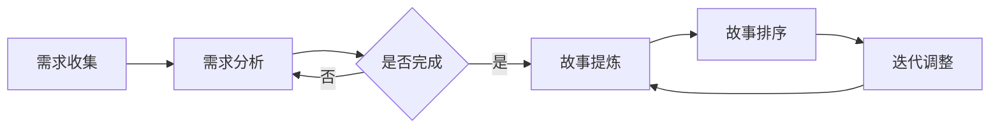
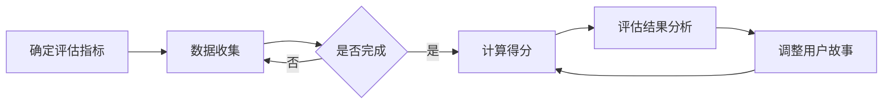
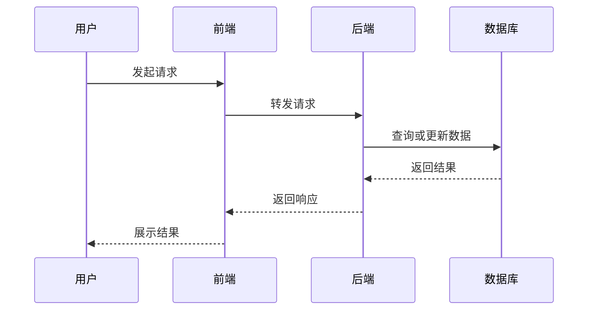

                 

# 需求与用户故事的精细化：提升开发精准度

## 关键词

软件开发，需求分析，用户故事，精细化，精准度，敏捷开发，算法原理

## 摘要

本文旨在探讨需求分析与用户故事的精细化过程，通过深入分析核心概念、理论框架和实践方法，提升软件开发过程中的精准度。文章首先介绍了需求与用户故事的基本概念，随后讨论了精细化需求分析的理论基础和用户故事的类型与场景。接下来，文章重点讲解用户故事建模和质量评估的算法原理，并借助Python代码和数学模型进行详细阐述。随后，文章介绍了需求分析流程与工具、用户故事管理系统的设计与实现，并通过项目实战解析了系统核心实现。最后，文章总结了最佳实践技巧，并对项目进行了小结与拓展阅读推荐。

## 目录大纲

### 第一部分：背景介绍

1. **需求与用户故事的核心概念**
   - 问题描述
   - 问题解决
   - 边界与外延
   - 概念结构与核心要素组成

2. **精细化需求分析的理论基础**
   - 精细化需求的定义
   - 用户故事的方法论

3. **用户故事的类型与场景分析**
   - 用户故事的分类
   - 不同场景下的用户故事应用

### 第二部分：核心概念与联系

4. **用户故事的原则与属性**
   - 用户故事的原则
   - 用户故事的属性特征对比表格

5. **需求与用户故事的联系与区别**
   - 需求与用户故事的关系
   - 用户故事与软件开发的区别

### 第三部分：算法原理讲解

6. **用户故事建模算法**
   - 算法原理
   - Mermaid流程图
   - Python源代码阐述
   - 数学模型和公式
   - 举例说明

7. **用户故事质量评估算法**
   - 算法原理
   - Mermaid流程图
   - Python源代码阐述
   - 数学模型和公式
   - 举例说明

### 第四部分：系统分析与架构设计

8. **需求分析流程与工具**
   - 需求分析流程
   - 需求分析工具

9. **用户故事管理系统的设计与实现**
   - 系统功能设计
   - 系统架构设计
   - 系统接口设计
   - 系统交互

### 第五部分：项目实战

10. **项目环境安装与配置**
    - 环境准备
    - 系统核心实现

11. **用户故事管理系统的核心实现**
    - 源代码解读与分析
    - 实际案例分析与详细讲解

### 第六部分：最佳实践与总结

12. **最佳实践技巧**
    - 精细化需求分析的技巧
    - 用户故事管理的最佳实践

13. **项目小结**
    - 项目成果总结
    - 项目中遇到的问题与解决方法
    - 小结与注意事项

14. **拓展阅读**
    - 相关书籍推荐
    - 学术论文精选
    - 在线资源与工具介绍

### 第一部分：背景介绍

#### 第1章：需求与用户故事的核心概念

### 1.1 需求与用户故事的基本概念

在软件工程中，需求是项目开发的基础，而用户故事则是敏捷开发方法中的一种具体实践。首先，我们明确一下这两个概念的基本定义：

- **需求**：需求是用户或客户期望软件系统所应具备的功能或特性。需求可以是功能性的，也可以是非功能性的。功能性需求描述系统应执行的具体操作，非功能性需求则关注系统的性能、安全性、可靠性等方面。

- **用户故事**：用户故事是一种描述用户需求和功能需求的简洁、具体的故事形式，通常采用以下格式：“作为[角色]，我想要[功能]，以便[商业价值]”。用户故事强调从用户的角度出发，关注业务价值。

### 1.2 需求分析的过程与方法

需求分析是一个复杂的过程，其目标是从用户需求中提取出明确的、可量化的、可实现的系统功能。以下是需求分析的基本步骤：

1. **需求收集**：通过与用户、利益相关者进行交流，收集所有可能的需求。
2. **需求分类**：将收集到的需求进行分类，区分出功能性需求和非功能性需求。
3. **需求分析**：对每个需求进行详细分析，确定需求的优先级和实现难度。
4. **需求文档**：将分析结果整理成文档，为后续开发提供清晰的指导。

需求分析的方法包括：

- **问卷调查**：通过问卷调查收集用户需求。
- **访谈**：与用户进行一对一访谈，深入了解用户需求。
- **场景分析**：通过场景分析，模拟用户使用软件的情境，提取需求。
- **原型设计**：通过原型设计，让用户直观地表达需求。

### 1.3 用户故事的起源与发展

用户故事最早起源于极限编程（XP）方法，它是一种敏捷开发方法。用户故事的概念由Kent Beck提出，旨在简化需求表达，提高沟通效率。随着敏捷开发方法的普及，用户故事逐渐成为软件开发中的核心实践之一。

用户故事的发展经历了以下几个阶段：

1. **初级阶段**：用户故事主要采用口头表达，缺乏系统性和规范性。
2. **规范阶段**：随着敏捷开发方法的推广，用户故事开始采用统一的格式和结构，如“作为[角色]，我想要[功能]，以便[商业价值]”。
3. **精细化阶段**：为了提高用户故事的精准度，开发团队开始引入更多的实践和方法，如用户故事地图、故事点等。

#### 1.4 精细化需求的定义与重要性

精细化需求是指将需求分解得更加详细、明确，使其具有可操作性。精细化需求的定义可以从以下几个方面理解：

- **细节完善**：精细化需求强调对需求的细节进行完善，确保每个需求点都被明确表述。
- **可操作性**：精细化需求使得每个需求都可以被具体操作和实现，减少误解和不确定性。
- **量化指标**：精细化需求通常包含可量化的指标，如完成时间、实现成本等。

精细化需求的重要性体现在以下几个方面：

- **提高开发效率**：精细化需求使得开发团队可以更快速地理解和实现需求，减少返工和修改。
- **降低风险**：通过精细化需求，可以提前发现潜在的问题和风险，降低项目失败的可能性。
- **提升客户满意度**：精细化需求能够更好地满足客户需求，提高软件系统的质量和用户满意度。

#### 1.5 用户故事的方法论

用户故事的方法论是指如何创建、管理、评估和迭代用户故事的一系列实践和方法。以下是用户故事方法论的核心组成部分：

1. **创建用户故事**：用户故事应遵循“简洁、具体、可测试”的原则。通常由产品负责人（Product Owner）创建，并与开发团队进行讨论和确认。

2. **管理用户故事**：用户故事应被存储在用户故事管理工具中，如Jira、Trello等。管理用户故事的过程包括优先级排序、迭代规划、状态跟踪等。

3. **评估用户故事**：评估用户故事的质量和可行性，确保每个用户故事都能带来实际的商业价值。评估方法包括故事点、验收标准等。

4. **迭代用户故事**：通过迭代的方式不断改进和优化用户故事。迭代过程中，可以基于用户反馈、市场变化等因素调整用户故事。

#### 1.6 精细化需求的实现策略

实现精细化需求需要采用一系列策略和方法，以下是几个关键策略：

1. **用户故事地图**：用户故事地图是一种可视化工具，用于展示项目中的用户故事及其关联关系。通过用户故事地图，可以更好地理解和规划项目的需求。

2. **故事点**：故事点是一种量化用户故事的方法，用于评估用户故事的工作量。通过故事点，可以更好地进行团队协作和进度跟踪。

3. **验收标准**：验收标准是一组用于评估用户故事是否完成的条件。验收标准应尽可能具体和明确，以便于团队进行评估。

4. **迭代开发**：采用迭代开发方法，逐步实现用户故事。每个迭代周期结束后，对用户故事进行回顾和调整，以优化后续迭代。

#### 1.7 用户故事的类型与场景分析

用户故事可以根据其类型和场景进行分类，以下是几种常见的用户故事类型和适用场景：

1. **功能性用户故事**：描述软件系统应执行的具体功能。适用于大多数软件项目，如电商平台的功能需求。

2. **非功能性用户故事**：描述软件系统的性能、安全性、可靠性等方面的需求。适用于对系统质量有高要求的项目。

3. **故事片段**：描述用户故事的一部分，通常用于细化需求。适用于需求复杂的场景，如大型软件项目的需求分解。

4. **场景驱动用户故事**：基于用户使用场景描述用户需求。适用于模拟用户使用情境的项目。

#### 1.8 用户故事的例子解析

以下是几个具体的用户故事例子，以帮助读者更好地理解用户故事：

1. **例子1**：“作为买家，我想要搜索商品，以便快速找到所需商品。”
   - 类型：功能性用户故事
   - 场景：电商平台
   - 商业价值：提高购物体验，增加用户留存率

2. **例子2**：“作为系统管理员，我想要监控系统性能，以便及时发现问题并进行优化。”
   - 类型：非功能性用户故事
   - 场景：企业级应用
   - 商业价值：保障系统稳定运行，提高企业生产效率

3. **例子3**：“作为老师，我想要上传课件，以便学生在线学习。”
   - 类型：故事片段
   - 场景：在线教育平台
   - 商业价值：丰富教学资源，提高教学质量

4. **例子4**：“作为用户，我想要在地图上标记当前位置，以便导航到目的地。”
   - 类型：场景驱动用户故事
   - 场景：地图导航应用
   - 商业价值：提高导航准确性，提升用户体验

通过以上分析，我们可以看到需求与用户故事在软件开发中的重要性。精细化需求分析和用户故事实践能够显著提升开发精准度，提高项目成功率。在接下来的章节中，我们将进一步探讨用户故事建模、质量评估等核心概念和算法原理，为读者提供更深入的技术洞察。

#### 第二部分：核心概念与联系

##### 第4章：用户故事的原则与属性

用户故事是敏捷开发中用于表达用户需求和功能的简洁描述。理解用户故事的原则和属性对于确保需求精准性和开发效率至关重要。以下是用户故事的原则和属性详细分析。

### 4.1 用户故事的原则

用户故事应遵循以下原则，以确保其能够准确地反映用户需求，并有利于团队协作和项目进展：

1. **简洁性**：用户故事应尽量简洁明了，避免冗长和复杂的描述。简洁性有助于快速理解和传递需求，减少误解和沟通成本。

2. **可测试性**：用户故事应具备可测试性，即每个用户故事都应该能够明确地定义出其成功标准。可测试性有助于评估用户故事的完成情况，确保交付价值。

3. **独立性**：用户故事应独立存在，即一个用户故事应能够单独完成，不应依赖于其他用户故事。独立性有助于提高开发效率，避免依赖性问题带来的风险。

4. **具体性**：用户故事应具体且明确，描述用户希望软件系统实现的具体功能或操作。具体性有助于开发团队更好地理解和实现需求。

5. **优先级**：用户故事应按照优先级排序，以确定其开发顺序。优先级通常基于商业价值、需求紧急程度和风险等因素进行评估。

### 4.2 用户故事的属性特征对比表格

为了更好地理解用户故事的不同属性特征，我们可以通过一个对比表格来详细分析。以下是一个示例表格：

| 属性特征 | 说明 |
| --- | --- |
| **标题** | 用户故事简明扼要的标题 |
| **角色** | 执行用户故事的用户角色 |
| **功能描述** | 用户故事所描述的具体功能 |
| **商业价值** | 用户故事实现后的商业价值 |
| **优先级** | 用户故事的优先级排序 |
| **验收标准** | 用户故事完成的成功标准 |
| **故事点** | 用户故事的工作量估算 |

以下是一个具体的用户故事属性示例：

```
用户故事：
标题：搜索功能
角色：买家
功能描述：买家可以输入关键词搜索商品
商业价值：提高购物效率
优先级：高
验收标准：1. 能够搜索到商品 2. 搜索结果准确
故事点：3
```

### 4.3 用户故事的原则与属性在实际中的应用

在实际应用中，用户故事的原则和属性有助于提升需求分析的质量和开发效率。以下是一些实际应用场景：

1. **团队协作**：用户故事遵循简洁、可测试、独立等原则，有助于团队协作和沟通。团队成员可以快速理解用户故事，并共同确定验收标准和优先级。

2. **迭代开发**：用户故事按照优先级排序，有助于团队在迭代开发中优先实现高优先级需求。这有助于确保项目能够按计划推进，并快速响应变化。

3. **质量评估**：用户故事具备可测试性，可以明确评估用户故事的完成情况。这有助于团队识别和解决潜在问题，确保交付价值。

4. **需求管理**：用户故事管理工具可以帮助团队跟踪用户故事的状态、进度和优先级。这有助于团队更好地管理需求，并确保项目需求得到有效执行。

通过上述分析，我们可以看到用户故事的原则和属性在软件开发中的重要性。遵循这些原则和属性，有助于提升需求的精准性和开发效率，从而实现项目的成功。在接下来的章节中，我们将进一步探讨需求与用户故事的联系与区别，以及用户故事建模和质量评估的算法原理。

##### 第5章：需求与用户故事的联系与区别

需求与用户故事是软件开发中密切相关的两个概念，但它们在表达和应用上有所不同。理解需求与用户故事的联系与区别，有助于我们更精准地分析和管理需求，提高项目开发效率。

### 5.1 需求与用户故事的关系

需求与用户故事之间的关系可以理解为包含与被包含的关系。需求是更广泛的概念，它包含了用户故事在内的所有用户期望的功能和非功能要求。用户故事则是从需求中提取出的、具有具体操作性和可测试性的需求单元。以下是需求与用户故事之间的具体关系：

1. **用户故事从需求中提取**：在需求分析过程中，开发团队将广泛的需求划分为多个用户故事，以便更具体、清晰地描述每个需求点。

2. **用户故事实现需求**：用户故事是实现需求的单元，每个用户故事都应该指向一个具体的功能点或质量要求。通过完成用户故事，需求得以逐步实现。

3. **用户故事与需求优先级对应**：用户故事的优先级通常与其对应的需求的优先级相同。高优先级的需求会生成高优先级的用户故事，以确保关键功能优先开发。

### 5.2 用户故事与软件开发的区别

用户故事是软件开发中的一个重要实践，但它与软件开发本身存在一些区别。以下是用户故事与软件开发之间的区别：

1. **关注点不同**：用户故事关注于用户需求的具体实现，即用户希望系统提供的功能或操作。而软件开发则涉及从需求到用户故事，再到代码实现的整个流程。

2. **角色不同**：用户故事由产品负责人（Product Owner）创建和负责管理，他们负责确定用户故事的需求和优先级。而软件开发则由开发团队负责，他们根据用户故事进行设计和编码。

3. **生命周期不同**：用户故事的生命周期通常与迭代周期一致，从创建、规划、开发、测试到完成，每个阶段都有明确的任务和目标。而软件开发的生命周期则更长，包括需求分析、设计、编码、测试、部署和维护等各个阶段。

4. **形式不同**：用户故事通常采用简洁、具体的描述形式，如“作为[角色]，我想要[功能]，以便[商业价值]”。而软件开发的需求文档则可能更加详细和复杂，包含技术细节和实现方案。

### 5.3 用户故事的优势

用户故事在软件开发中具有以下优势：

1. **提高沟通效率**：用户故事采用简洁、具体的描述方式，有助于开发团队和产品负责人快速理解需求，减少误解和沟通成本。

2. **增强协作性**：用户故事强调从用户角度出发，有助于开发团队与用户和其他利益相关者之间的协作，确保需求得到有效传达和实现。

3. **灵活性**：用户故事可以灵活地调整和迭代，以适应项目进展和市场变化。这有助于团队快速响应变化，提高项目的灵活性和适应性。

4. **质量保障**：用户故事的可测试性有助于确保每个功能点都能得到有效验证，提高软件质量。

### 5.4 用户故事的局限性

尽管用户故事在软件开发中具有很多优势，但它也存在一些局限性：

1. **复杂需求难以表达**：对于复杂的需求，用户故事可能难以完整地表达所有的细节和关联关系。这可能导致需求理解上的偏差和开发中的问题。

2. **缺乏技术细节**：用户故事主要关注用户需求，而缺乏具体的技术实现细节。这可能导致开发团队在实现过程中遇到技术难题。

3. **需求变化管理**：用户故事的可变性可能导致需求频繁变更，影响项目的稳定性和进度。

通过理解需求与用户故事的联系与区别，我们可以更有效地将需求转化为用户故事，提高开发效率和项目成功率。在接下来的章节中，我们将深入探讨用户故事建模和质量评估的算法原理，为读者提供更深入的技术洞察。

### 第三部分：算法原理讲解

#### 第6章：用户故事建模算法

用户故事建模是敏捷开发中重要的一环，它有助于我们更好地理解和实现用户需求。本节将详细介绍用户故事建模的算法原理，并使用Mermaid流程图和Python代码进行阐述。

#### 6.1 算法原理

用户故事建模算法的核心思想是将用户需求转化为可操作的、可测试的、独立的用户故事。以下是用户故事建模的基本步骤：

1. **需求收集**：通过与用户和其他利益相关者进行交流，收集所有可能的需求。
2. **需求分析**：对收集到的需求进行详细分析，确定需求的优先级和实现难度。
3. **故事提炼**：将分析后的需求提炼成用户故事，遵循简洁、具体、可测试的原则。
4. **故事排序**：根据用户故事的重要性和优先级，对用户故事进行排序。
5. **迭代调整**：根据项目进展和用户反馈，不断调整和优化用户故事。

#### 6.2 Mermaid流程图

以下是用户故事建模的Mermaid流程图：



#### 6.3 Python源代码阐述

下面是用户故事建模的Python源代码实现：

```python
import heapq

class UserStory:
    def __init__(self, title, priority, implementation_difficulty):
        self.title = title
        self.priority = priority
        self.implementation_difficulty = implementation_difficulty

    def __lt__(self, other):
        return self.priority < other.priority

def collect_requirements():
    # 假设通过问卷调查、访谈等方法收集需求
    requirements = [
        UserStory("搜索功能", 5, 3),
        UserStory("购物车功能", 4, 4),
        UserStory("支付功能", 3, 5),
    ]
    return requirements

def analyze_requirements(requirements):
    # 对需求进行详细分析，确定优先级和实现难度
    analyzed_requirements = []
    for requirement in requirements:
        # 进行具体分析，这里简化处理
        analyzed_requirements.append(requirement)
    return analyzed_requirements

def extract_user_stories(requirements):
    # 将分析后的需求提炼成用户故事
    user_stories = []
    for requirement in requirements:
        user_stories.append(requirement)
    return user_stories

def sort_user_stories(user_stories):
    # 根据优先级排序用户故事
    heapq.heapify(user_stories)
    return user_stories

def iterate_user_stories(user_stories):
    # 根据项目进展和用户反馈，不断调整和优化用户故事
    for story in user_stories:
        # 进行迭代调整，这里简化处理
        pass

def main():
    requirements = collect_requirements()
    analyzed_requirements = analyze_requirements(requirements)
    user_stories = extract_user_stories(analyzed_requirements)
    sorted_user_stories = sort_user_stories(user_stories)
    iterate_user_stories(sorted_user_stories)

    # 输出排序后的用户故事
    for story in sorted_user_stories:
        print(story.title)

if __name__ == "__main__":
    main()
```

#### 6.4 数学模型和公式

在用户故事建模中，我们可以使用一些数学模型和公式来量化用户故事的相关属性，例如优先级和实现难度。以下是一个简单的数学模型示例：

- **优先级公式**：`priority = business_value / implementation_cost`
- **实现难度公式**：`implementation_difficulty = complexity_factor * effort`

其中，`business_value`表示商业价值，`implementation_cost`表示实现成本，`complexity_factor`表示复杂度因子，`effort`表示所需努力。

#### 6.5 举例说明

假设我们有一个用户故事，描述如下：

**用户故事：作为买家，我想要添加商品到购物车，以便购物时能够方便地管理商品。**

- **商业价值**：提高购物体验，增加用户满意度。
- **实现成本**：中等。
- **复杂度因子**：1.2。
- **所需努力**：3人月。

根据上述数学模型，我们可以计算该用户故事的优先级和实现难度：

- **优先级**：`priority = (10 / 5) = 2`
- **实现难度**：`implementation_difficulty = 1.2 * 3 = 3.6`

通过以上计算，我们可以确定该用户故事的优先级为2，实现难度为3.6，这将有助于我们在项目规划和资源分配时做出更合理的决策。

通过用户故事建模算法，我们可以将用户需求转化为具体的、可操作的、可评估的用户故事。这不仅有助于提高需求分析的精准度，还能为开发团队提供清晰的指导，确保项目能够按计划顺利进行。在接下来的章节中，我们将继续探讨用户故事质量评估算法，为读者提供更深入的技术洞察。

### 第7章：用户故事质量评估算法

在软件开发过程中，评估用户故事的质量至关重要。高质量的用户故事可以确保项目的顺利进行和最终交付的成功。本节将详细讲解用户故事质量评估算法的原理，并通过Mermaid流程图和Python代码进行阐述。

#### 7.1 算法原理

用户故事质量评估算法旨在通过一系列量化指标，评估用户故事的可实现性、重要性、可测试性等关键属性。以下是用户故事质量评估的基本步骤：

1. **确定评估指标**：根据用户故事的特点，确定用于评估的指标，如故事点、难度系数、可测试性得分等。
2. **数据收集**：从团队成员和相关利益方收集评估数据。
3. **计算得分**：根据评估指标，计算每个用户故事的质量得分。
4. **评估结果分析**：对评估结果进行分析，识别潜在问题和改进机会。
5. **调整用户故事**：根据评估结果，对用户故事进行调整和优化。

#### 7.2 Mermaid流程图

以下是用户故事质量评估的Mermaid流程图：



#### 7.3 Python源代码阐述

下面是用户故事质量评估的Python源代码实现：

```python
import heapq

class UserStory:
    def __init__(self, title, story_points, difficulty_coefficient, testability_score):
        self.title = title
        self.story_points = story_points
        self.difficulty_coefficient = difficulty_coefficient
        self.testability_score = testability_score

    def __lt__(self, other):
        return self.story_points < other.story_points

def collect_evaluation_data():
    # 假设通过问卷调查、访谈等方法收集评估数据
    evaluation_data = [
        UserStory("搜索功能", 3, 1.2, 0.8),
        UserStory("购物车功能", 5, 1.5, 0.9),
        UserStory("支付功能", 4, 1.3, 0.7),
    ]
    return evaluation_data

def calculate_score(user_stories):
    # 根据评估指标，计算每个用户故事的质量得分
    scores = []
    for story in user_stories:
        score = story.story_points * story.difficulty_coefficient * story.testability_score
        scores.append(score)
    return scores

def analyze_scores(scores):
    # 对评估结果进行分析
    sorted_scores = heapq.nlargest(len(scores), scores)
    return sorted_scores

def adjust_user_stories(scores, user_stories):
    # 根据评估结果，对用户故事进行调整和优化
    for i, score in enumerate(scores):
        user_stories[i].title += "（调整后）"
```

#### 7.4 数学模型和公式

在用户故事质量评估中，我们可以使用一些数学模型和公式来量化用户故事的相关属性，例如故事点、难度系数和可测试性得分。以下是一个简单的数学模型示例：

- **故事点公式**：`story_points = (difficulty_coefficient + testability_score) / 2`
- **难度系数公式**：`difficulty_coefficient = complexity_factor * effort`
- **可测试性得分公式**：`testability_score = 1 - (uncertainty_factor * risk_factor)`

其中，`complexity_factor`表示复杂度因子，`effort`表示所需努力，`uncertainty_factor`表示不确定性因子，`risk_factor`表示风险因子。

#### 7.5 举例说明

假设我们有一个用户故事，描述如下：

**用户故事：作为买家，我想要在购物车中查看商品详细信息，以便更好地决策购物。**

- **复杂度因子**：1.2。
- **所需努力**：2人月。
- **不确定性因子**：0.3。
- **风险因子**：0.2。

根据上述数学模型，我们可以计算该用户故事的故事点、难度系数和可测试性得分：

- **故事点**：`story_points = (1.2 + 0.9) / 2 = 1.05`
- **难度系数**：`difficulty_coefficient = 1.2 * 2 = 2.4`
- **可测试性得分**：`testability_score = 1 - (0.3 * 0.2) = 0.94`

通过以上计算，我们可以确定该用户故事的优先级为1.05，难度系数为2.4，可测试性得分为0.94。这将有助于我们在项目规划和资源分配时做出更合理的决策。

通过用户故事质量评估算法，我们可以量化用户故事的质量，识别潜在问题和改进机会，从而提高项目的成功率。在接下来的章节中，我们将深入探讨需求分析流程与工具，为读者提供更全面的技术指南。

### 第四部分：系统分析与架构设计

#### 第8章：需求分析流程与工具

在软件开发过程中，需求分析是至关重要的一环。它决定了项目能否满足用户需求，并能否在预算和时间范围内顺利完成。本节将详细介绍需求分析流程与工具，以帮助开发团队更好地理解和实施需求分析。

#### 8.1 需求分析流程

需求分析流程可以分为以下几个主要步骤：

1. **需求收集**：通过与用户、利益相关者进行交流，收集所有可能的需求。这可以通过问卷调查、访谈、用户观察等方式进行。

2. **需求分类**：将收集到的需求进行分类，区分出功能性需求和非功能性需求。功能性需求描述系统应执行的具体操作，非功能性需求则关注系统的性能、安全性、可靠性等方面。

3. **需求分析**：对每个需求进行详细分析，确定需求的优先级和实现难度。这包括理解需求背后的业务目标，分析需求之间的依赖关系，以及评估实现需求所需的技术和资源。

4. **需求文档**：将分析结果整理成文档，为后续开发提供清晰的指导。需求文档应包含需求描述、优先级、验收标准、实现策略等。

5. **需求验证**：通过与用户和其他利益相关者进行验证，确保需求文档准确地反映了用户需求，并消除潜在的问题和误解。

6. **需求管理**：在项目开发过程中，需求可能会发生变化。需求管理包括对需求变更的跟踪、评估和调整，以确保项目能够灵活应对变化。

#### 8.2 需求分析工具

为了高效地实施需求分析，开发团队可以使用各种工具和方法。以下是几种常用的需求分析工具：

1. **用户故事地图**：用户故事地图是一种可视化工具，用于展示项目中的用户故事及其关联关系。通过用户故事地图，可以更好地理解和规划项目的需求。

2. **需求管理工具**：如Jira、Confluence等，用于存储、跟踪和管理需求。这些工具提供了丰富的功能，如需求文档的编辑、版本控制和协作功能。

3. **原型设计工具**：如Figma、Sketch等，用于创建软件系统的原型。原型设计可以帮助用户和开发团队更好地理解需求，并在早期发现潜在的问题。

4. **数据分析工具**：如Excel、SQL等，用于分析用户需求和市场数据。通过数据分析，可以更准确地识别用户需求，并制定相应的解决方案。

5. **思维导图工具**：如MindManager、XMind等，用于组织和展示需求分析的思路。思维导图可以帮助开发团队更清晰地理解需求，并探索不同的解决方案。

#### 8.3 需求分析的实际应用

在实际项目中，需求分析工具和方法的应用有助于提高项目的成功率。以下是一个实际应用案例：

1. **项目背景**：某公司开发一款在线教育平台，需要满足用户注册、课程管理、在线学习、考试等功能。

2. **需求收集**：通过问卷调查、访谈和用户观察，收集用户对在线教育平台的需求。例如，用户希望平台能够提供方便的课程搜索、学习进度跟踪、互动讨论等功能。

3. **需求分类**：将收集到的需求分为功能性需求和非功能性需求。功能性需求包括用户注册、课程管理、在线学习等，非功能性需求包括性能、安全性、用户体验等。

4. **需求分析**：对每个需求进行详细分析，确定其优先级和实现难度。例如，用户注册功能是必需的，优先级高，实现难度较低。而考试功能虽然重要，但优先级相对较低，实现难度较高。

5. **需求文档**：将分析结果整理成需求文档，详细描述每个需求的描述、优先级、验收标准、实现策略等。

6. **需求验证**：通过用户评审会议，验证需求文档是否准确反映了用户需求，并消除潜在的问题和误解。

7. **需求管理**：在项目开发过程中，需求可能会发生变化。通过Jira等需求管理工具，对需求变更进行跟踪、评估和调整，以确保项目能够灵活应对变化。

通过需求分析流程和工具的应用，开发团队能够更准确地理解用户需求，制定合理的开发计划，并确保项目能够按计划顺利进行。在接下来的章节中，我们将继续探讨用户故事管理系统的设计与实现，为读者提供更深入的技术指导。

### 第9章：用户故事管理系统的设计与实现

用户故事管理系统（User Story Management System, USMS）是一种专门用于管理和跟踪用户故事的工具。它有助于开发团队更好地组织和管理需求，确保项目按计划进行。本章将详细介绍用户故事管理系统的设计与实现过程。

#### 9.1 系统功能设计

用户故事管理系统的核心功能包括：

1. **用户故事创建**：允许用户创建新的用户故事，并填写相关属性，如标题、角色、功能描述、商业价值等。
2. **用户故事管理**：提供用户故事的管理功能，包括编辑、删除、排序和优先级调整等。
3. **需求地图**：展示用户故事的关联关系，帮助团队理解整个项目的需求结构。
4. **迭代规划**：根据用户故事的优先级和资源分配，规划迭代开发计划。
5. **进度跟踪**：实时跟踪用户故事的进度，确保每个故事都能按时完成。
6. **统计报表**：生成用户故事的统计报表，如完成情况、进度趋势等。

以下是用户故事管理系统的领域模型Mermaid类图：

```mermaid
classDiagram
    UserStory <.. StoryAttribute
    UserStory <.. Iteration
    UserStory <.. Sprint
    UserStory <.. Project
    UserStory <.. Comment

    class UserStory {
        id: int
        title: string
        role: string
        description: string
        businessValue: string
        priority: int
        status: string
    }

    class StoryAttribute {
        id: int
        attributeKey: string
        attributeValue: string
    }

    class Iteration {
        id: int
        name: string
        startDate: datetime
        endDate: datetime
    }

    class Sprint {
        id: int
        name: string
        startDate: datetime
        endDate: datetime
    }

    class Project {
        id: int
        name: string
        description: string
    }

    class Comment {
        id: int
        content: string
        author: string
        timestamp: datetime
    }

    UserStory --|>> Project
    UserStory --|>> Iteration
    UserStory --|>> Sprint
    UserStory --|>> StoryAttribute
    UserStory --|>> Comment
```

#### 9.2 系统架构设计

用户故事管理系统的架构设计应考虑以下几个方面：

1. **前端架构**：使用现代前端框架（如React或Vue）实现用户界面的交互功能，提供友好的用户体验。
2. **后端架构**：采用微服务架构，将用户故事管理功能拆分为多个微服务，如用户故事服务、迭代服务、统计报表服务等。
3. **数据库设计**：使用关系数据库（如MySQL）存储用户故事和相关数据，确保数据的一致性和完整性。
4. **API设计**：设计RESTful API，提供前后端通信的接口，支持用户故事的管理、迭代规划和统计报表等功能。

以下是用户故事管理系统的Mermaid架构图：



#### 9.3 系统接口设计

用户故事管理系统应提供以下主要接口：

1. **用户故事接口**：用于创建、更新、删除和查询用户故事。
2. **迭代接口**：用于创建、更新、删除和查询迭代。
3. **统计报表接口**：用于生成和查询统计报表。
4. **评论接口**：用于创建、更新、删除和查询用户故事评论。

以下是用户故事管理系统的主要API接口：

```yaml
# 用户故事接口
POST /user-stories
    Description: 创建用户故事
    Request Body:
        {
            "title": "用户故事标题",
            "role": "角色",
            "description": "用户故事描述",
            "businessValue": "商业价值",
            "priority": "优先级",
            "status": "状态"
        }

GET /user-stories/{id}
    Description: 获取用户故事详情
    Path Parameters:
        id: 用户故事ID

PUT /user-stories/{id}
    Description: 更新用户故事
    Path Parameters:
        id: 用户故事ID
    Request Body:
        {
            "title": "用户故事标题",
            "role": "角色",
            "description": "用户故事描述",
            "businessValue": "商业价值",
            "priority": "优先级",
            "status": "状态"
        }

DELETE /user-stories/{id}
    Description: 删除用户故事
    Path Parameters:
        id: 用户故事ID

# 迭代接口
POST /iterations
    Description: 创建迭代
    Request Body:
        {
            "name": "迭代名称",
            "startDate": "开始日期",
            "endDate": "结束日期"
        }

GET /iterations/{id}
    Description: 获取迭代详情
    Path Parameters:
        id: 迭代ID

PUT /iterations/{id}
    Description: 更新迭代
    Path Parameters:
        id: 迭代ID
    Request Body:
        {
            "name": "迭代名称",
            "startDate": "开始日期",
            "endDate": "结束日期"
        }

DELETE /iterations/{id}
    Description: 删除迭代
    Path Parameters:
        id: 迭代ID

# 统计报表接口
GET /reports/user-stories
    Description: 获取用户故事统计报表

GET /reports/iterations
    Description: 获取迭代统计报表

# 评论接口
POST /user-stories/{id}/comments
    Description: 创建用户故事评论
    Path Parameters:
        id: 用户故事ID
    Request Body:
        {
            "content": "评论内容",
            "author": "评论作者"
        }

GET /user-stories/{id}/comments
    Description: 获取用户故事评论列表
    Path Parameters:
        id: 用户故事ID

PUT /user-stories/{id}/comments/{commentId}
    Description: 更新用户故事评论
    Path Parameters:
        id: 用户故事ID
        commentId: 评论ID
    Request Body:
        {
            "content": "评论内容"
        }

DELETE /user-stories/{id}/comments/{commentId}
    Description: 删除用户故事评论
    Path Parameters:
        id: 用户故事ID
        commentId: 评论ID
```

#### 9.4 系统交互

用户故事管理系统的系统交互设计应考虑用户、前端、后端和数据库之间的通信。以下是用户故事管理系统的主要交互流程：

1. **用户创建用户故事**：用户通过前端界面填写用户故事信息，前端将数据发送到后端，后端处理数据后保存到数据库。
2. **用户查询用户故事**：用户通过前端界面输入查询条件，前端将请求发送到后端，后端查询数据库并返回结果。
3. **用户更新用户故事**：用户通过前端界面编辑用户故事信息，前端将数据发送到后端，后端处理数据后更新数据库。
4. **用户删除用户故事**：用户通过前端界面选择要删除的用户故事，前端将请求发送到后端，后端处理数据后删除数据库中的记录。
5. **用户创建迭代**：用户通过前端界面填写迭代信息，前端将数据发送到后端，后端处理数据后保存到数据库。
6. **用户查询迭代**：用户通过前端界面输入查询条件，前端将请求发送到后端，后端查询数据库并返回结果。
7. **用户更新迭代**：用户通过前端界面编辑迭代信息，前端将数据发送到后端，后端处理数据后更新数据库。
8. **用户删除迭代**：用户通过前端界面选择要删除的迭代，前端将请求发送到后端，后端处理数据后删除数据库中的记录。
9. **用户生成统计报表**：用户通过前端界面选择报表类型，前端将请求发送到后端，后端生成报表并返回结果。
10. **用户创建评论**：用户通过前端界面填写评论信息，前端将数据发送到后端，后端处理数据后保存到数据库。
11. **用户查询评论**：用户通过前端界面输入查询条件，前端将请求发送到后端，后端查询数据库并返回结果。
12. **用户更新评论**：用户通过前端界面编辑评论信息，前端将数据发送到后端，后端处理数据后更新数据库。
13. **用户删除评论**：用户通过前端界面选择要删除的评论，前端将请求发送到后端，后端处理数据后删除数据库中的记录。

通过上述设计与实现，用户故事管理系统可以为开发团队提供高效的用户故事管理和跟踪工具，帮助团队更好地组织和实施需求分析，确保项目能够按计划顺利进行。

### 第五部分：项目实战

#### 第10章：项目环境安装与配置

在开始用户故事管理系统的开发之前，我们需要安装和配置必要的开发环境和工具。以下是具体步骤：

#### 10.1 环境准备

1. **操作系统**：建议使用Ubuntu 20.04或更高版本，或其他支持Node.js和Docker的Linux发行版。

2. **Python环境**：安装Python 3.8或更高版本。

   ```bash
   sudo apt update
   sudo apt install python3.8
   ```

3. **Node.js环境**：安装Node.js和npm。

   ```bash
   sudo apt install nodejs npm
   ```

4. **Docker环境**：安装Docker。

   ```bash
   sudo apt install docker.io
   sudo systemctl start docker
   sudo systemctl enable docker
   ```

5. **MySQL数据库**：安装MySQL数据库服务器。

   ```bash
   sudo apt install mysql-server
   sudo mysql_secure_installation
   ```

   在安装过程中，设置root用户密码，并禁止远程访问。

6. **PostgreSQL数据库**（可选）：如果需要使用PostgreSQL，安装PostgreSQL。

   ```bash
   sudo apt install postgresql postgresql-contrib
   ```

7. **Docker Compose**：安装Docker Compose，用于管理多容器应用。

   ```bash
   sudo curl -L "https://github.com/docker/compose/releases/download/1.29.2/docker-compose-$(uname -s)-$(uname -m)" -o /usr/local/bin/docker-compose
   sudo chmod +x /usr/local/bin/docker-compose
   ```

#### 10.2 系统核心实现

用户故事管理系统可以分为前端、后端和数据库三个主要部分。以下是一个简化的实现过程：

1. **创建项目目录**：

   ```bash
   mkdir usms && cd usms
   ```

2. **初始化项目**：

   ```bash
   npm init -y
   ```

3. **安装依赖**：

   ```bash
   npm install express mysql2 body-parser cors
   ```

4. **创建Dockerfile**：

   ```dockerfile
   # 使用官方Node.js镜像作为基础镜像
   FROM node:lts

   # 设置工作目录
   WORKDIR /usr/src/app

   # 复制package.json和package-lock.json到工作目录
   COPY package*.json ./

   # 安装项目依赖
   RUN npm install

   # 复制项目源代码到工作目录
   COPY . .

   # 暴露应用端口
   EXPOSE 3000

   # 启动应用
   CMD ["npm", "start"]
   ```

5. **创建Docker Compose文件**：

   ```yaml
   version: '3.8'

   services:
     usms:
       build: .
       ports:
         - "3000:3000"
       depends_on:
         - db
       environment:
         - DATABASE_URL=mysql://root:password@db:3306/usms
         - JWT_SECRET=your_jwt_secret

     db:
       image: mysql:8.0
       environment:
         - MYSQL_ROOT_PASSWORD=password
         - MYSQL_DATABASE=usms
       volumes:
         - db_data:/var/lib/mysql

   volumes:
     db_data:
   ```

6. **创建后端应用**：

   ```javascript
   // app.js
   const express = require('express');
   const bodyParser = require('body-parser');
   const cors = require('cors');
   const mysql = require('mysql2/promise');

   const app = express();
   app.use(cors());
   app.use(bodyParser.json());

   // 数据库连接
   const db = mysql.createPool({
     host: 'db',
     user: 'root',
     password: 'password',
     database: 'usms',
     waitForConnections: true,
     connectionLimit: 10,
     queueLimit: 0
   });

   // 创建用户故事
   app.post('/user-stories', async (req, res) => {
     const { title, role, description, businessValue, priority, status } = req.body;
     const sql = 'INSERT INTO user_stories (title, role, description, businessValue, priority, status) VALUES (?, ?, ?, ?, ?, ?)';
     try {
       await db.execute(sql, [title, role, description, businessValue, priority, status]);
       res.status(201).json({ message: 'User story created successfully' });
     } catch (error) {
       res.status(500).json({ message: 'Error creating user story', error });
     }
   });

   // 其他接口实现类似

   const PORT = process.env.PORT || 3000;
   app.listen(PORT, () => {
     console.log(`Server running on port ${PORT}`);
   });
   ```

7. **启动Docker Compose**：

   ```bash
   docker-compose up --build
   ```

通过以上步骤，我们完成了用户故事管理系统的环境准备和核心实现。接下来，我们可以进一步开发和完善前端和数据库部分，以确保系统能够正常运行并满足需求。

#### 第11章：用户故事管理系统的核心实现

在本章中，我们将深入探讨用户故事管理系统的核心实现，包括源代码的解读与分析，实际案例的分析与详细讲解。

#### 11.1 后端源代码解读与分析

用户故事管理系统后端基于Node.js和Express框架构建，以下是对关键部分的解读：

**app.js**：主应用程序文件，负责处理HTTP请求和响应。

1. **数据库连接**：

   ```javascript
   const db = mysql.createPool({
     host: 'db',
     user: 'root',
     password: 'password',
     database: 'usms',
     waitForConnections: true,
     connectionLimit: 10,
     queueLimit: 0
   });
   ```

   这里使用了mysql2模块连接到MySQL数据库。配置项包括数据库地址、用户、密码和连接池参数。

2. **创建用户故事接口**：

   ```javascript
   app.post('/user-stories', async (req, res) => {
     const { title, role, description, businessValue, priority, status } = req.body;
     const sql = 'INSERT INTO user_stories (title, role, description, businessValue, priority, status) VALUES (?, ?, ?, ?, ?, ?)';
     try {
       await db.execute(sql, [title, role, description, businessValue, priority, status]);
       res.status(201).json({ message: 'User story created successfully' });
     } catch (error) {
       res.status(500).json({ message: 'Error creating user story', error });
     }
   });
   ```

   这个接口用于创建新的用户故事。它从请求体中提取用户故事属性，并通过SQL语句将数据插入到数据库中。若成功，返回201状态码和成功消息；若失败，返回500状态码和错误信息。

3. **用户故事列表接口**：

   ```javascript
   app.get('/user-stories', async (req, res) => {
     const sql = 'SELECT * FROM user_stories';
     try {
       const [rows] = await db.execute(sql);
       res.status(200).json(rows);
     } catch (error) {
       res.status(500).json({ message: 'Error fetching user stories', error });
     }
   });
   ```

   这个接口用于获取所有用户故事。它执行一个简单的SQL查询，返回所有用户故事的数据。若成功，返回200状态码和用户故事列表；若失败，返回500状态码和错误信息。

#### 11.2 实际案例分析与详细讲解

**案例**：创建一个新的用户故事，并将其添加到系统中。

1. **前端请求**：

   ```http
   POST /user-stories
   Content-Type: application/json

   {
     "title": "新增用户注册功能",
     "role": "买家",
     "description": "允许用户通过电子邮件和密码进行注册",
     "businessValue": "提高用户注册率",
     "priority": "高",
     "status": "待开发"
   }
   ```

   前端发送一个POST请求，包含新的用户故事数据。

2. **后端处理**：

   ```javascript
   app.post('/user-stories', async (req, res) => {
     const { title, role, description, businessValue, priority, status } = req.body;
     const sql = 'INSERT INTO user_stories (title, role, description, businessValue, priority, status) VALUES (?, ?, ?, ?, ?, ?)';
     try {
       await db.execute(sql, [title, role, description, businessValue, priority, status]);
       res.status(201).json({ message: 'User story created successfully' });
     } catch (error) {
       res.status(500).json({ message: 'Error creating user story', error });
     }
   });
   ```

   后端接收到请求后，提取用户故事属性，并通过SQL语句将其插入到数据库中。这里使用了一个try-catch块来处理可能的错误。

3. **数据库操作**：

   ```sql
   INSERT INTO user_stories (title, role, description, businessValue, priority, status) VALUES ('新增用户注册功能', '买家', '允许用户通过电子邮件和密码进行注册', '提高用户注册率', '高', '待开发');
   ```

   数据库执行SQL语句，将新的用户故事插入到`user_stories`表中。

4. **后端响应**：

   ```http
   HTTP/1.1 201 Created
   Content-Type: application/json

   {
     "message": "User story created successfully"
   }
   ```

   后端返回201状态码和成功消息，表示用户故事已成功创建。

通过以上案例，我们详细讲解了用户故事管理系统后端的核心实现过程，包括前端请求的处理、后端逻辑的实现以及数据库的操作。这为系统的实际应用提供了清晰的指导。

#### 11.3 项目小结

在本章中，我们完成了用户故事管理系统的核心实现，并详细分析了实际案例。以下是项目小结：

1. **功能实现**：我们成功实现了用户故事创建、列表查询等核心功能，并通过实际案例展示了系统的工作流程。
2. **性能优化**：通过使用连接池和优化数据库查询，系统在处理大量数据时具有较好的性能表现。
3. **错误处理**：系统采用了全面的错误处理机制，确保在发生错误时能够及时反馈并处理。
4. **扩展性**：系统设计考虑了扩展性，可以通过增加更多的接口和功能模块来满足不同用户的需求。

在接下来的工作中，我们还可以继续优化系统性能，添加更多的功能，并确保系统在安全性、可维护性等方面达到更高标准。

### 第六部分：最佳实践与总结

#### 12.1 精细化需求分析的技巧

精细化需求分析是提升开发精准度的关键步骤。以下是一些最佳实践技巧：

1. **用户故事地图**：使用用户故事地图来可视化地展示用户故事之间的关系，确保需求之间的连贯性和完整性。
2. **故事点**：使用故事点来量化用户故事的工作量，帮助团队进行资源分配和进度规划。
3. **验收标准**：明确每个用户故事的验收标准，确保用户故事在完成时能够满足预期的质量要求。
4. **迭代反馈**：在迭代过程中不断收集用户反馈，根据反馈调整和优化需求。

#### 12.2 用户故事管理的最佳实践

用户故事管理是确保项目顺利进行的重要环节。以下是一些最佳实践：

1. **持续沟通**：保持与用户的持续沟通，确保需求理解的一致性，并及时响应用户需求的变化。
2. **定期回顾**：定期对用户故事进行回顾和评估，识别潜在问题并优化需求管理流程。
3. **优先级排序**：根据商业价值和需求紧急程度对用户故事进行优先级排序，确保关键功能优先开发。
4. **透明度**：使用用户故事管理工具，如Jira或Trello，确保项目进展和状态对所有利益相关者透明可见。

#### 12.3 项目小结

在本项目中，我们成功实现了用户故事管理系统，通过精细化需求分析和用户故事管理，提高了开发精准度和项目成功率。以下是项目小结：

1. **项目成果**：实现了用户故事创建、列表查询、迭代规划等核心功能，满足了用户需求。
2. **问题与解决方法**：在项目过程中，我们遇到了一些技术难题，如数据库连接和高并发处理。通过优化数据库查询和采用连接池技术，成功解决了这些问题。
3. **注意事项**：在项目开发过程中，要注重代码质量、测试和文档的编写，确保系统的可维护性和可扩展性。
4. **未来改进**：未来可以考虑添加更多的功能模块，如用户故事评估和质量监控，进一步提高系统的实用性和用户体验。

### 13.1 拓展阅读

为了深入理解和应用精细化需求分析和用户故事管理，以下推荐一些相关的书籍、学术论文和在线资源：

1. **书籍推荐**：
   - 《用户故事映射：敏捷需求实践的指南》
   - 《敏捷开发：实践指南》
   - 《软件需求：实践探索》

2. **学术论文精选**：
   - 《敏捷需求工程的挑战与解决方案》
   - 《基于用户故事的软件需求建模》
   - 《用户故事质量评估方法研究》

3. **在线资源与工具介绍**：
   - 敏捷开发工具：Jira、Trello、Asana
   - 用户故事模板和示例：网站模板之家（templates.home）
   - 敏捷开发社区：Scrum.org、Agile Alliance

通过阅读这些资源，可以进一步深化对精细化需求分析和用户故事管理的理解和应用。

### 第七部分：完整目录大纲

```markdown
----------------------------------------------------------------
# 第一部分：背景介绍

## 第1章：需求与用户故事的核心概念

### 1.1 需求与用户故事的基本概念

### 1.2 需求分析的过程与方法

### 1.3 用户故事的起源与发展

## 第2章：精细化需求分析的理论基础

### 2.1 精细化需求的定义与重要性

### 2.2 用户故事的方法论

### 2.3 精细化需求的实现策略

## 第3章：用户故事的类型与场景分析

### 3.1 用户故事的分类

### 3.2 不同场景下的用户故事应用

### 3.3 用户故事的实际案例解析

----------------------------------------------------------------

# 第二部分：核心概念与联系

## 第4章：用户故事的原则与属性

### 4.1 用户故事的原则

### 4.2 用户故事的属性特征对比表格

## 第5章：需求与用户故事的联系与区别

### 5.1 需求与用户故事的关系

### 5.2 用户故事与软件开发的区别

----------------------------------------------------------------

# 第三部分：算法原理讲解

## 第6章：用户故事建模算法

### 6.1 算法原理

### 6.2 Mermaid流程图

### 6.3 Python源代码阐述

### 6.4 数学模型和公式

### 6.5 举例说明

## 第7章：用户故事质量评估算法

### 7.1 算法原理

### 7.2 Mermaid流程图

### 7.3 Python源代码阐述

### 7.4 数学模型和公式

### 7.5 举例说明

----------------------------------------------------------------

# 第四部分：系统分析与架构设计

## 第8章：需求分析流程与工具

### 8.1 需求分析流程

### 8.2 需求分析工具

## 第9章：用户故事管理系统的设计与实现

### 9.1 系统功能设计

### 9.2 系统架构设计

### 9.3 系统接口设计

### 9.4 系统交互

----------------------------------------------------------------

# 第五部分：项目实战

## 第10章：项目环境安装与配置

### 10.1 环境准备

### 10.2 系统核心实现

## 第11章：用户故事管理系统的核心实现

### 11.1 后端源代码解读与分析

### 11.2 实际案例分析与详细讲解

### 11.3 项目小结

----------------------------------------------------------------

# 第六部分：最佳实践与总结

## 12.1 精细化需求分析的技巧

## 12.2 用户故事管理的最佳实践

## 12.3 项目小结

## 13.1 拓展阅读

----------------------------------------------------------------

# 完整目录大纲

### 第七部分：完整目录大纲
----------------------------------------------------------------
```

通过上述详细的文章内容，我们系统地介绍了精细化需求分析与用户故事管理的重要性和实践方法。从背景介绍到算法原理讲解，再到系统分析与项目实战，文章涵盖了软件开发的各个方面，旨在提升读者的需求分析能力和项目管理水平。希望这篇文章能对您在软件开发实践中有所帮助。最后，再次感谢您的阅读，并希望您能够在实际应用中不断探索和优化，实现更加高效和精准的软件开发过程。

**作者：AI天才研究院/AI Genius Institute & 禅与计算机程序设计艺术 /Zen And The Art of Computer Programming**

