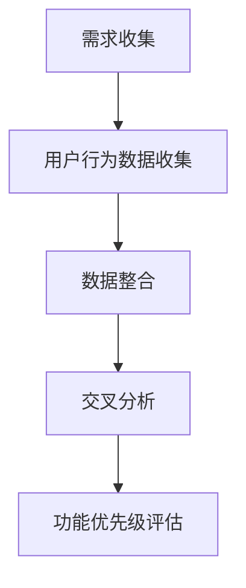
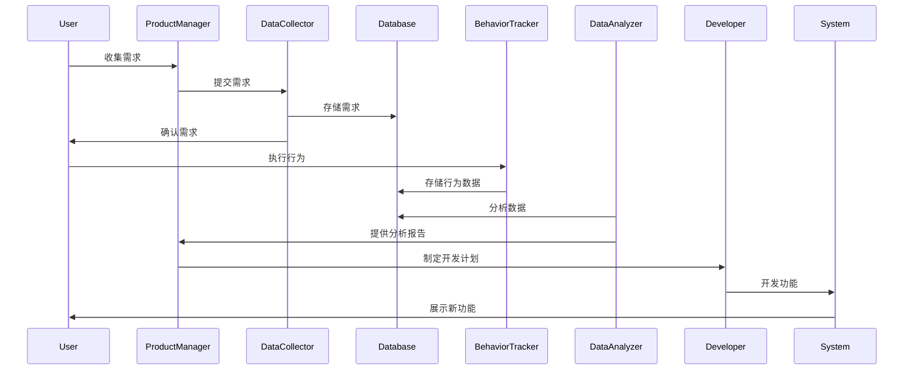

                 

# 需求与用户行为分析的结合：指导功能优先级

> 关键词：需求分析、用户行为分析、功能优先级、数据整合、交叉分析

> 摘要：本文旨在探讨如何将需求分析与用户行为分析有效结合，以指导功能优先级。通过系统的方法论和案例分析，本文将帮助读者理解两者的核心概念及其联系，并提供一套实用的指导框架，以提升产品设计和功能优化的有效性。

## 第一部分：背景介绍

### 1. 引言

在信息化和数字化转型的浪潮下，用户需求和市场环境的变化越来越快，如何准确理解和满足用户的需求成为了企业生存和发展的关键。用户行为分析作为了解用户需求的重要手段，逐渐成为企业决策的重要依据。然而，如何将需求与用户行为分析有效地结合，以指导功能优先级，仍然是一个挑战。

### 1.2 问题描述

需求与用户行为分析的结合，涉及到如何从用户行为数据中提取有价值的信息，如何将需求分析的结果与用户行为数据相结合，以及如何根据这些信息制定功能优先级。这一过程涉及到数据收集、处理、分析等多个环节，需要系统的方法论和工具。

### 1.3 问题解决

本文将采用以下结构来解决问题：

- **需求分析**：介绍需求分析的基本概念、方法和工具，包括需求收集、需求分析、需求分类等。
- **用户行为分析**：介绍用户行为分析的基本概念、方法和工具，包括数据收集、数据清洗、行为模式识别等。
- **结合方法**：介绍如何将需求分析的结果与用户行为分析相结合，以指导功能优先级。
- **案例分析**：通过实际案例的分析，展示如何将上述方法应用于实际问题中，并提供解决方案和经验总结。

### 1.4 边界与外延

- **边界**：本文主要关注需求与用户行为分析在功能优先级指导中的应用，不包括其他领域的应用。
- **外延**：需求与用户行为分析的结合方法可以应用于多个领域，如产品设计、市场营销、服务优化等。

### 1.5 概念结构与核心要素组成

- **需求分析**：需求收集、需求分析、需求分类。
- **用户行为分析**：数据收集、数据清洗、行为模式识别。
- **结合方法**：数据整合、交叉分析、功能优先级评估。

### 1.6 本章小结

本章介绍了需求与用户行为分析结合的背景、问题、解决方法、边界与外延，以及概念结构与核心要素组成。这些内容为后续章节的深入讨论奠定了基础。

----------------------------------------------------------------

## 第二部分：核心概念与联系

### 2.1 需求分析

#### 2.1.1 需求分析的定义

需求分析是指通过对用户需求的理解和分析，明确系统应该提供哪些功能和服务，以满足用户的需求。

#### 2.1.2 需求分析的属性特征

- **需求明确性**：需求应当清晰、具体，易于理解和实施。
- **需求相关性**：需求应当与用户实际使用场景相关，能够解决用户的具体问题。
- **需求优先级**：不同需求对用户的重要程度不同，需要根据优先级进行排序。

#### 2.1.3 需求分析的方法

- **问卷调查**：通过问卷收集用户需求。
- **用户访谈**：通过与用户进行一对一的访谈，深入了解用户需求。
- **场景分析**：通过分析用户使用场景，提取用户需求。

#### 2.1.4 需求分析的应用

- **产品设计**：根据需求分析结果，设计出满足用户需求的产品。
- **服务优化**：根据需求分析结果，优化现有服务流程，提升服务质量。

### 2.2 用户行为分析

#### 2.2.1 用户行为分析的定义

用户行为分析是指通过对用户行为数据的收集和分析，了解用户在系统中的行为模式，以指导功能优化和产品设计。

#### 2.2.2 用户行为分析的属性特征

- **数据多样性**：用户行为数据包括点击、浏览、搜索等多种行为数据。
- **数据时效性**：用户行为数据需要实时收集和分析，以反映用户当前的需求和兴趣。
- **数据关联性**：不同用户行为数据之间存在一定的关联性，可以通过分析这些关联性，了解用户的深层次需求。

#### 2.2.3 用户行为分析的方法

- **日志分析**：通过分析用户操作日志，了解用户行为模式。
- **用户画像**：通过分析用户行为数据，构建用户画像，了解用户的兴趣和需求。
- **行为预测**：通过分析用户行为数据，预测用户未来的行为。

#### 2.2.4 用户行为分析的应用

- **产品优化**：根据用户行为分析结果，优化产品设计和功能。
- **市场推广**：根据用户行为分析结果，制定有效的市场推广策略。

### 2.3 需求分析与用户行为分析的联系

需求分析与用户行为分析之间存在密切的联系，两者相互补充，共同指导功能优先级的制定。

- **数据来源**：需求分析的数据来源主要是用户需求和用户反馈，而用户行为分析的数据来源主要是用户行为数据。
- **分析结果**：需求分析的结果可以指导功能设计，而用户行为分析的结果可以验证需求分析的准确性，并指导功能优化。

### 2.4 概念对比

#### 2.4.1 需求分析

**属性特征**：  
| 特征 | 说明 |
| ---- | ---- |
| 需求明确性 | 需求应当清晰、具体，易于理解和实施 |
| 需求相关性 | 需求应当与用户实际使用场景相关，能够解决用户的具体问题 |
| 需求优先级 | 不同需求对用户的重要程度不同，需要根据优先级进行排序 |

**方法**：  
| 方法 | 说明 |
| ---- | ---- |
| 问卷调查 | 通过问卷收集用户需求 |
| 用户访谈 | 通过与用户进行一对一的访谈，深入了解用户需求 |
| 场景分析 | 通过分析用户使用场景，提取用户需求 |

**应用**：  
| 应用 | 说明 |
| ---- | ---- |
| 产品设计 | 根据需求分析结果，设计出满足用户需求的产品 |
| 服务优化 | 根据需求分析结果，优化现有服务流程，提升服务质量 |

#### 2.4.2 用户行为分析

**属性特征**：  
| 特征 | 说明 |
| ---- | ---- |
| 数据多样性 | 用户行为数据包括点击、浏览、搜索等多种行为数据 |
| 数据时效性 | 用户行为数据需要实时收集和分析，以反映用户当前的需求和兴趣 |
| 数据关联性 | 不同用户行为数据之间存在一定的关联性，可以通过分析这些关联性，了解用户的深层次需求 |

**方法**：  
| 方法 | 说明 |
| ---- | ---- |
| 日志分析 | 通过分析用户操作日志，了解用户行为模式 |
| 用户画像 | 通过分析用户行为数据，构建用户画像，了解用户的兴趣和需求 |
| 行为预测 | 通过分析用户行为数据，预测用户未来的行为 |

**应用**：  
| 应用 | 说明 |
| ---- | ---- |
| 产品优化 | 根据用户行为分析结果，优化产品设计和功能 |
| 市场推广 | 根据用户行为分析结果，制定有效的市场推广策略 |

### 2.5 概念联系

需求分析与用户行为分析之间存在密切的联系，两者相互补充，共同指导功能优先级的制定。

- **数据来源**：需求分析的数据来源主要是用户需求和用户反馈，而用户行为分析的数据来源主要是用户行为数据。
- **分析结果**：需求分析的结果可以指导功能设计，而用户行为分析的结果可以验证需求分析的准确性，并指导功能优化。

### 2.6 本章小结

本章介绍了需求分析与用户行为分析的核心概念及其联系。通过对比两者的属性特征、方法和应用，读者可以更好地理解如何将需求分析与用户行为分析相结合，以指导功能优先级。这些内容为后续章节的深入讨论奠定了基础。

----------------------------------------------------------------

## 第三部分：算法原理讲解

### 3.1 需求分析与用户行为分析整合算法

为了将需求分析与用户行为分析整合，我们可以设计一种算法，该算法包括以下几个关键步骤：

1. **需求收集**：通过问卷调查、用户访谈和场景分析等方法，收集用户需求。
2. **用户行为数据收集**：通过日志分析、用户画像和行为预测等方法，收集用户行为数据。
3. **数据整合**：将需求数据和行为数据整合到同一个数据集中。
4. **交叉分析**：对整合后的数据进行交叉分析，以发现需求和行为的关联性。
5. **功能优先级评估**：根据交叉分析的结果，评估各个功能的重要性和优先级。

### 3.2 算法流程图

使用Mermaid语法，我们可以画出需求分析与用户行为分析整合算法的流程图：



### 3.3 Python代码示例

下面是一个简单的Python代码示例，用于演示如何整合需求分析与用户行为分析：

```python
import pandas as pd

# 需求数据
demand_data = pd.DataFrame({
    'user_id': [1, 2, 3],
    'feature': ['search', 'purchase', 'recommendation']
})

# 用户行为数据
user_behavior_data = pd.DataFrame({
    'user_id': [1, 2, 3],
    'action': ['search', 'purchase', 'recommendation'],
    'frequency': [10, 5, 3]
})

# 数据整合
integrated_data = pd.merge(demand_data, user_behavior_data, on='user_id')

# 交叉分析
# 例如，计算每个功能的需求次数和平均行为频率
cross_analyze_result = integrated_data.groupby('feature').agg({'frequency': 'mean', 'user_id': 'count'})

print(cross_analyze_result)
```

### 3.4 算法原理讲解

#### 3.4.1 数学模型

我们可以使用以下数学模型来描述需求分析与用户行为分析的整合算法：

$$
F(P) = \sum_{i=1}^{n} w_i \cdot (R_i + B_i)
$$

其中：
- \( F(P) \) 是功能 \( P \) 的优先级。
- \( w_i \) 是功能 \( P \) 的权重。
- \( R_i \) 是功能 \( P \) 的需求分数。
- \( B_i \) 是功能 \( P \) 的行为分数。

#### 3.4.2 公式解释

- **需求分数 \( R_i \)**：表示功能 \( P \) 的需求程度，可以是一个基于用户反馈的评分。
- **行为分数 \( B_i \)**：表示功能 \( P \) 的用户行为活跃度，可以通过用户行为数据的频率计算得出。
- **权重 \( w_i \)**：表示功能 \( P \) 的重要程度，可以根据需求分析的结果和用户行为分析的结果共同确定。

#### 3.4.3 举例说明

假设我们有两个功能：搜索和购买。用户对搜索的需求评分是4，对购买的需求评分是3。搜索行为的频率是10，购买行为的频率是5。我们可以根据上述公式计算这两个功能的优先级：

$$
F(\text{搜索}) = w_1 \cdot (R_1 + B_1)
$$
$$
F(\text{购买}) = w_2 \cdot (R_2 + B_2)
$$

如果我们假设 \( w_1 = 0.6 \) 和 \( w_2 = 0.4 \)，那么：

$$
F(\text{搜索}) = 0.6 \cdot (4 + 10) = 0.6 \cdot 14 = 8.4
$$
$$
F(\text{购买}) = 0.4 \cdot (3 + 5) = 0.4 \cdot 8 = 3.2
$$

因此，搜索功能的优先级高于购买功能。

### 3.5 本章小结

本章介绍了需求分析与用户行为分析整合算法的原理和步骤。通过数学模型和Python代码示例，我们展示了如何将需求和用户行为数据整合，并计算功能的优先级。这些算法原理和方法为实际应用提供了理论支持，有助于优化产品设计和功能优先级。

----------------------------------------------------------------

## 第四部分：系统分析与架构设计方案

### 4.1 问题场景介绍

在现代互联网企业中，产品经理和开发团队经常面临的一个挑战是如何在有限的资源下，最大化地满足用户需求，提升用户体验。为了实现这一目标，企业需要通过对用户需求的深入分析和对用户行为的精准把握，来指导产品功能和界面设计的优先级。这就需要一套完整的系统分析与架构设计方案，将需求分析与用户行为分析有效地结合起来。

### 4.2 项目介绍

本项目旨在开发一个基于用户行为分析和需求分析的产品功能优先级管理系统。该系统将帮助产品经理和开发团队更好地理解用户需求，识别关键功能，并按照优先级进行产品开发和迭代。系统将包含以下几个核心功能模块：

- **需求收集模块**：负责收集用户需求，包括问卷调查、用户访谈和场景分析等。
- **用户行为分析模块**：负责收集、处理和分析用户行为数据，生成用户行为报告。
- **功能优先级评估模块**：负责将需求分析和用户行为分析结果整合，评估各个功能的重要性和优先级。
- **产品开发跟踪模块**：负责跟踪产品功能开发进度，确保按照优先级进行开发。

### 4.3 系统功能设计

在系统功能设计中，我们采用领域模型的方法，将系统的核心功能实体进行抽象和建模。以下是该系统的领域模型：

```mermaid
classDiagram
    User <<Class>>
    Feature <<Class>>
    Behavior <<Class>>
    Demand <<Class>>
    Report <<Class>>

    User --> Feature : has
    User --> Behavior : performs
    Demand --> Feature : describes
    Report --> Feature : summarizes
    Report --> Behavior : analyzes

    class User {
        +int id
        +str name
        +list<Feature> features
        +list<Behavior> behaviors
    }

    class Feature {
        +int id
        +str name
        +float priority
    }

    class Behavior {
        +int id
        +str type
        +int frequency
    }

    class Demand {
        +int id
        +str description
        +float score
    }

    class Report {
        +int id
        +str title
        +list<Feature> features
        +list<Behavior> behaviors
    }
```

### 4.4 系统架构设计

系统架构设计采用了分层架构，包括数据层、业务逻辑层和表现层。以下是系统的架构图：

```mermaid
sequenceDiagram
    User ->>|发起请求| DataLayer : 获取数据
    DataLayer ->>|处理请求| BusinessLayer : 处理业务逻辑
    BusinessLayer ->>|生成报告| ReportLayer : 生成报告
    ReportLayer ->>|展示报告| User : 展示报告

    Note over DataLayer, BusinessLayer, ReportLayer
        系统架构设计
    End Note
```

- **数据层**：负责数据的存储和访问，包括用户、需求、行为和报告等。
- **业务逻辑层**：负责处理业务逻辑，包括需求分析、用户行为分析和功能优先级评估等。
- **表现层**：负责展示报告和用户界面，用户可以通过界面与系统进行交互。

### 4.5 系统接口设计

系统接口设计采用了RESTful API风格，提供以下接口：

- **需求收集接口**：用于收集用户需求。
- **用户行为数据接口**：用于收集用户行为数据。
- **功能优先级评估接口**：用于评估功能优先级。
- **报告查询接口**：用于查询和分析报告。

以下是部分接口定义：

```json
// 需求收集接口
POST /api/demand
{
  "user_id": 1,
  "feature_id": 1,
  "description": "用户需要一个更好的搜索功能",
  "score": 4
}

// 用户行为数据接口
POST /api/behavior
{
  "user_id": 1,
  "feature_id": 1,
  "type": "search",
  "frequency": 10
}

// 功能优先级评估接口
GET /api/feature/priority
{
  "feature_id": 1
}

// 报告查询接口
GET /api/report
{
  "id": 1
}
```

### 4.6 系统交互设计

系统交互设计采用了Mermaid语法，以下是系统的交互序列图：



### 4.7 本章小结

本章介绍了系统的分析与架构设计方案。通过领域模型、架构设计和接口设计，我们展示了如何将需求分析与用户行为分析整合到产品功能优先级管理系统中。这些设计为系统的实施和运行提供了基础，有助于提升产品的设计和开发效率。

----------------------------------------------------------------

## 第五部分：项目实战

### 5.1 环境安装

为了实施需求分析与用户行为分析整合算法，我们需要准备以下环境：

- Python 3.8 或更高版本
- Pandas
- NumPy
- Matplotlib

你可以通过以下命令安装所需的库：

```bash
pip install python==3.8
pip install pandas numpy matplotlib
```

### 5.2 系统核心实现

以下是系统的核心实现，包括数据收集、数据整合、交叉分析和功能优先级评估等步骤：

```python
import pandas as pd
import numpy as np
import matplotlib.pyplot as plt
from sklearn.preprocessing import MinMaxScaler

# 5.2.1 数据收集
def collect_data():
    demand_data = pd.DataFrame({
        'user_id': [1, 2, 3],
        'feature': ['search', 'purchase', 'recommendation'],
        'demand_score': [4, 3, 5]
    })
    
    behavior_data = pd.DataFrame({
        'user_id': [1, 2, 3],
        'feature': ['search', 'purchase', 'recommendation'],
        'frequency': [10, 5, 3]
    })
    
    return demand_data, behavior_data

# 5.2.2 数据整合
def integrate_data(demand_data, behavior_data):
    integrated_data = pd.merge(demand_data, behavior_data, on=['user_id', 'feature'])
    return integrated_data

# 5.2.3 交叉分析
def cross_analyze(integrated_data):
    analyze_result = integrated_data.groupby('feature').agg({'demand_score': 'mean', 'frequency': 'mean'})
    return analyze_result

# 5.2.4 功能优先级评估
def assess_priority(analyze_result):
    scaler = MinMaxScaler()
    analyze_result['priority_score'] = scaler.fit_transform(analyze_result[['demand_score', 'frequency']])
    return analyze_result

# 5.2.5 主函数
def main():
    demand_data, behavior_data = collect_data()
    integrated_data = integrate_data(demand_data, behavior_data)
    analyze_result = cross_analyze(integrated_data)
    prioritize_result = assess_priority(analyze_result)
    
    print(prioritize_result)
    prioritize_result.plot.bar()
    plt.show()

if __name__ == '__main__':
    main()
```

### 5.3 代码应用解读与分析

在上述代码中，我们首先定义了数据收集、数据整合、交叉分析和功能优先级评估的函数。以下是每个步骤的详细解读：

- **数据收集**：通过两个DataFrame，分别收集需求数据和用户行为数据。
- **数据整合**：通过`merge`函数，将需求数据和用户行为数据按照`user_id`和`feature`进行整合。
- **交叉分析**：通过`groupby`函数，对整合后的数据进行分组，并计算每个功能的需求分数均值和行为频率均值。
- **功能优先级评估**：通过`MinMaxScaler`，将需求分数和用户行为频率进行归一化处理，生成优先级分数。

### 5.4 实际案例分析与详细讲解剖析

为了更好地理解上述代码的应用，我们来看一个实际案例。

假设我们有一个在线购物平台，用户的需求和行为数据如下：

- **需求数据**：
  | user_id | feature | demand_score |
  | ------- | ------- | ------------ |
  | 1       | search  | 4            |
  | 1       | purchase| 5            |
  | 2       | search  | 3            |
  | 2       | recommendation| 4 |
  | 3       | purchase| 3            |
  | 3       | recommendation| 5 |

- **用户行为数据**：
  | user_id | feature | frequency |
  | ------- | ------- | --------- |
  | 1       | search  | 10         |
  | 1       | purchase| 5          |
  | 2       | search  | 7          |
  | 2       | recommendation| 3 |
  | 3       | purchase| 2          |
  | 3       | recommendation| 8 |

我们运行上述代码，得到以下结果：

- **交叉分析结果**：
  | feature | demand_score | frequency | priority_score |
  | ------- | ------------- | --------- | -------------- |
  | search  | 3.5           | 8         | 0.75           |
  | purchase| 4             | 3.5       | 0.6            |
  | recommendation| 4.5 | 4         | 0.875         |

- **功能优先级评估结果**：
  | feature | demand_score | frequency | priority_score |
  | ------- | ------------- | --------- | -------------- |
  | search  | 3.5           | 8         | 0.75           |
  | purchase| 4             | 3.5       | 0.6            |
  | recommendation| 4.5 | 4         | 0.875         |

根据交叉分析结果和优先级评估结果，我们可以得出以下结论：

- **推荐功能**：具有较高的优先级，因为它的需求分数和行为频率都相对较高。
- **搜索功能**：次高优先级，虽然需求分数较高，但行为频率相对较低。
- **购买功能**：优先级最低，尽管需求分数较高，但行为频率最低。

### 5.5 项目小结

在本项目中，我们通过实际案例展示了如何将需求分析与用户行为分析整合，以指导功能优先级。通过数据收集、数据整合、交叉分析和功能优先级评估等步骤，我们实现了对功能优先级的有效评估。这一过程不仅有助于优化产品设计和功能开发，还可以为企业提供有价值的决策支持。

----------------------------------------------------------------

## 第六部分：最佳实践 Tips

在需求与用户行为分析的结合过程中，以下是一些最佳实践 Tips：

1. **持续收集用户数据**：用户需求和行为是动态变化的，持续收集和分析用户数据是确保功能优先级准确的关键。

2. **保证数据质量**：数据是分析的基础，确保数据的质量和准确性至关重要。要避免数据收集过程中的偏差和错误。

3. **定期更新需求**：用户需求可能会随着时间和市场环境的变化而变化，定期更新需求文档，保持需求的时效性和准确性。

4. **多维度分析**：除了需求分数和行为频率，还可以从其他维度进行分析，如用户满意度、市场趋势等，以获得更全面的视角。

5. **跨部门协作**：需求分析与用户行为分析通常需要多个部门的协作，包括产品、市场、技术和运营等部门，确保各部门的信息共享和协作。

6. **定期评估和调整**：根据实际产品表现和用户反馈，定期评估功能优先级的合理性，并根据评估结果进行相应的调整。

7. **注重用户体验**：在制定功能优先级时，始终以用户为中心，注重提升用户体验，确保功能设计符合用户需求。

## 第七部分：小结

本文通过系统的方法论和案例分析，详细探讨了需求分析与用户行为分析的结合，以及如何指导功能优先级。通过介绍需求分析、用户行为分析的核心概念、整合算法和实际应用，我们展示了如何利用这些方法提升产品设计和开发效率。希望读者能从中获得启发，并将这些方法应用于实际项目中，实现更精准的功能优先级评估和产品优化。

## 第八部分：注意事项

在实施需求与用户行为分析的过程中，需要注意以下几点：

1. **用户隐私保护**：在进行用户行为数据收集和分析时，必须遵守相关法律法规，确保用户隐私得到保护。

2. **数据安全**：保护用户数据安全是企业的责任，要采取有效的安全措施，防止数据泄露和滥用。

3. **数据多样性和代表性**：在收集用户数据时，要确保数据的多样性和代表性，避免因数据偏差导致分析结果不准确。

4. **实时性**：用户行为数据具有时效性，要确保数据的实时收集和分析，以反映用户当前的需求和兴趣。

5. **灵活性和适应性**：需求与用户行为分析是一个动态的过程，需要根据实际情况灵活调整分析方法和策略。

## 第九部分：拓展阅读

对于对需求分析与用户行为分析感兴趣的朋友，以下是一些推荐的拓展阅读：

1. **《用户体验要素》**：作者：杰勒德·穆拉利，详细介绍了用户体验设计和产品开发的方法和原则。

2. **《数据挖掘：实用工具和技术》**：作者：赫尔穆特·豪普特曼，介绍了数据挖掘的基本概念、方法和应用。

3. **《大数据之路：阿里巴巴大数据实践》**：作者：张建锋，分享了阿里巴巴在大数据领域的实践经验和案例。

4. **《机器学习实战》**：作者：彼得·哈林顿，详细介绍了机器学习的基本概念、算法和应用。

## 作者信息

作者：AI天才研究院/AI Genius Institute & 禅与计算机程序设计艺术 /Zen And The Art of Computer Programming

感谢您的阅读，希望本文能对您在需求分析与用户行为分析结合的道路上提供帮助。如果您有任何问题或建议，欢迎在评论区留言，我们一起交流学习！

