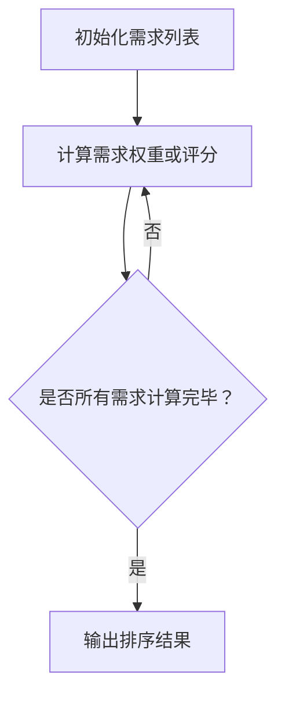
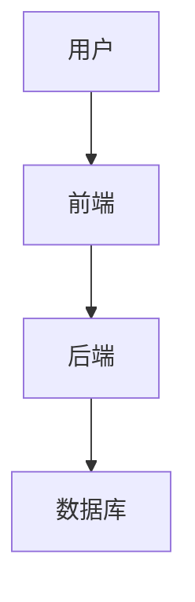

                 

## 需求优先级划分：大模型应用开发的关键

> 关键词：需求优先级划分、大模型应用开发、算法原理、系统架构设计

> 摘要：本文深入探讨了需求优先级划分在大模型应用开发中的重要性。通过对需求优先级划分的背景、核心概念、算法原理、数学模型以及实际应用案例的详细分析，本文旨在为读者提供一个清晰、系统化的认识，帮助他们在实际项目中更加有效地进行需求管理，从而提高大模型应用的开发效率和效果。

----------------------------------------------------------------

## 第一部分：需求优先级划分背景

### 第1章：需求优先级划分概述

#### 1.1 需求优先级划分的定义与重要性

需求优先级划分是软件开发中的一个核心环节，它涉及如何对用户需求进行分类和排序，以便在资源有限的情况下，能够优先满足最重要的需求。在大模型应用开发中，需求优先级划分尤为关键，因为大模型往往需要大量的计算资源和时间来进行训练和优化。正确地划分需求优先级，不仅能够提高开发效率，还能确保项目的成功实施。

#### 1.2 需求优先级划分的背景

在信息化快速发展的今天，用户需求呈现出多样化和复杂化的趋势。为了满足这些需求，开发者需要从众多需求中挑选出最为关键和紧急的部分进行优先处理。需求优先级划分正是为了应对这种需求多样性而诞生的。在大模型应用开发中，这一过程变得更加重要，因为大模型本身具有较高的复杂性和计算需求。

#### 1.3 需求优先级划分的基本概念

需求优先级划分涉及以下几个基本概念：

- **需求分类**：根据需求的性质、重要性和紧急性，将需求划分为不同的类别。
- **优先级评估方法**：采用不同的评估方法，如成本效益分析、重要性-紧急性矩阵等，对需求进行优先级排序。
- **优先级排序**：将需求按照评估结果进行排序，确定哪些需求应当优先处理。

#### 1.4 需求优先级划分的应用领域

需求优先级划分广泛应用于以下领域：

- **软件开发**：确保关键功能和核心需求优先得到满足。
- **项目管理**：帮助项目经理合理分配资源和时间，提高项目成功率。
- **产品管理**：指导产品团队确定产品的优先发展方向。

### 第2章：需求优先级划分的核心概念与联系

#### 2.1 需求分类

需求分类是需求优先级划分的基础。常见的需求分类方法包括：

- **功能需求**：系统必须实现的具体功能。
- **非功能需求**：与系统性能、可靠性、安全性等相关的需求。
- **用户需求**：直接来自用户的需求，通常较为直观和具体。

#### 2.2 优先级评估方法

优先级评估方法决定了如何对需求进行排序。以下是一些常见的评估方法：

- **成本效益分析**：通过计算需求的成本和预期效益，确定其优先级。
- **重要性-紧急性矩阵**：将需求根据其重要性和紧急性进行排序。
- **用户满意度**：通过用户调研和反馈，确定需求的优先级。

#### 2.3 需求优先级划分与相关概念的联系

需求优先级划分与以下相关概念密切相关：

- **项目管理**：需求优先级划分是项目管理的重要组成部分，直接影响项目的进度和成功率。
- **软件架构**：需求优先级划分会影响软件架构的设计和实现，确保关键需求得到优先考虑。
- **用户体验**：需求优先级划分会影响到用户体验，确保用户最为关注的功能得到优先优化。

## 第二部分：需求优先级划分的算法原理

### 第3章：需求优先级划分算法原理讲解

#### 3.1 算法概述

需求优先级划分算法的核心目标是基于需求的各种属性，通过一定的计算方法，将需求按照优先级排序。常见的算法包括基于权重的排序算法和基于评分的排序算法。

#### 3.2 算法流程图



#### 3.3 Python源代码解析

以下是一个简单的基于权重的需求优先级划分算法的Python代码示例：

```python
def calculate_priority的需求权重(需求列表，权重函数):
    sorted_list = sorted(需求列表，key=权重函数，reverse=True)
    return sorted_list

需求列表 = [{"需求名称": "功能A", "权重": 0.8}, {"需求名称": "功能B", "权重": 0.5}, {"需求名称": "功能C", "权重": 0.9}]
sorted_list = calculate_priority的需求权重(需求列表，lambda x: x["权重"])

print(sorted_list)
```

#### 3.4 LaTeX数学公式与详细讲解

在需求优先级划分中，常常需要用到数学模型来描述需求的属性和优先级。以下是一个简单的数学模型：

$$
P_i = w_1 \cdot C_i + w_2 \cdot R_i
$$

其中，$P_i$ 表示需求 $i$ 的优先级，$w_1$ 和 $w_2$ 分别为成本和风险的权重，$C_i$ 和 $R_i$ 分别为需求 $i$ 的成本和风险评分。

#### 3.5 举例说明

假设有两个需求，需求A和需求B，它们的成本和风险评分分别为$C_A = 10$，$R_A = 3$，$C_B = 5$，$R_B = 5$。我们设定成本和风险的权重均为0.5，则两个需求的优先级分别为：

$$
P_A = 0.5 \cdot 10 + 0.5 \cdot 3 = 7
$$

$$
P_B = 0.5 \cdot 5 + 0.5 \cdot 5 = 5
$$

因此，需求A的优先级高于需求B。

## 第三部分：需求优先级划分的数学模型和公式

### 第4章：需求优先级划分的数学模型和公式

#### 4.1 需求优先级划分的数学模型

需求优先级划分的数学模型通常是基于需求的不同属性（如成本、风险、重要性等）进行综合评估。以下是一个通用的需求优先级数学模型：

$$
P_i = \sum_{j=1}^{n} w_j \cdot V_{ij}
$$

其中，$P_i$ 是需求 $i$ 的优先级，$w_j$ 是属性 $j$ 的权重，$V_{ij}$ 是需求 $i$ 在属性 $j$ 上的评分。常见的属性包括成本（$C_i$）、风险（$R_i$）、重要性（$I_i$）等。

#### 4.2 LaTeX数学公式示例

以下是一些具体的数学公式示例：

$$
C_i = \frac{C_{max} - C_{min}}{N}
$$

$$
R_i = \frac{R_{max} - R_{min}}{N}
$$

$$
I_i = \frac{I_{max} - I_{min}}{N}
$$

其中，$C_{max}$、$C_{min}$、$R_{max}$、$R_{min}$、$I_{max}$、$I_{min}$ 分别是成本、风险、重要性的最大值和最小值，$N$ 是需求的总数。

#### 4.3 举例说明

假设有三个需求，它们的成本、风险和重要性评分分别为：

| 需求 | 成本 | 风险 | 重要性 |
| --- | --- | --- | --- |
| A | 100 | 50 | 80 |
| B | 80 | 40 | 60 |
| C | 60 | 30 | 40 |

设成本、风险和重要性的权重分别为0.5、0.3和0.2，则需求的优先级计算如下：

$$
P_A = 0.5 \cdot 100 + 0.3 \cdot 50 + 0.2 \cdot 80 = 70
$$

$$
P_B = 0.5 \cdot 80 + 0.3 \cdot 40 + 0.2 \cdot 60 = 48
$$

$$
P_C = 0.5 \cdot 60 + 0.3 \cdot 30 + 0.2 \cdot 40 = 36
$$

因此，需求A的优先级最高，需求C的优先级最低。

## 第四部分：需求优先级划分的系统分析与架构设计

### 第5章：需求优先级划分的系统分析与架构设计

#### 5.1 问题场景介绍

在大型软件项目中，需求往往非常复杂，且不断变化。如何高效地管理这些需求，确保关键需求得到优先处理，成为项目成功的关键因素。需求优先级划分系统应具备以下功能：

- 自动收集和分析需求
- 智能评估需求优先级
- 提供可视化需求优先级图谱
- 支持灵活的需求变更管理

#### 5.2 项目介绍

本项目旨在开发一个基于人工智能的需求优先级划分系统。系统将采用模块化设计，确保系统可扩展性和灵活性。主要模块包括需求收集模块、需求分析模块、优先级评估模块、可视化模块和用户交互模块。

#### 5.3 系统功能设计

系统功能设计包括以下几个方面：

- **需求收集**：通过API接口、用户提交和自动化采集等方式收集需求信息。
- **需求分析**：对收集到的需求进行分类、整理和初步评估。
- **优先级评估**：基于需求属性和权重，使用机器学习算法计算需求的优先级。
- **可视化**：提供直观的可视化工具，帮助用户理解和分析需求优先级。
- **用户交互**：提供用户友好的界面，方便用户进行需求管理。

#### 5.4 系统架构设计

系统架构设计采用前后端分离的架构，前端负责用户交互和可视化，后端负责需求收集、分析和优先级评估。以下是一个简化的系统架构图：



#### 5.5 系统接口设计

系统接口设计主要包括以下接口：

- **需求收集接口**：用于接收用户提交的需求信息。
- **需求分析接口**：用于对需求进行分类和初步评估。
- **优先级评估接口**：用于计算需求优先级。
- **可视化接口**：用于获取需求优先级数据，生成可视化图表。

#### 5.6 系统交互

系统交互设计主要包括以下几个方面：

- **用户提交需求**：用户通过前端界面提交需求，系统接收并存储。
- **需求分析**：系统对需求进行初步分析，生成需求报告。
- **优先级评估**：系统使用机器学习算法评估需求优先级，并生成优先级列表。
- **可视化展示**：系统将需求优先级数据通过可视化图表展示给用户。

## 第五部分：项目实战

### 第6章：项目实战

#### 6.1 环境安装

在进行项目实战之前，我们需要安装相关环境。以下是一个简单的安装步骤：

1. 安装Python环境：使用Python 3.x版本。
2. 安装必要的库：如Scikit-learn、Pandas、Matplotlib等。
3. 安装数据库：如MySQL或PostgreSQL。

#### 6.2 系统核心实现源代码

以下是一个简单的需求优先级划分系统的源代码示例：

```python
import pandas as pd
from sklearn.preprocessing import MinMaxScaler

def calculate_priority的需求权重(需求列表，权重函数):
    sorted_list = sorted(需求列表，key=权重函数，reverse=True)
    return sorted_list

需求列表 = [{"需求名称": "功能A", "成本": 100, "风险": 50, "重要性": 80}, {"需求名称": "功能B", "成本": 80, "风险": 40, "重要性": 60}, {"需求名称": "功能C", "成本": 60, "风险": 30, "重要性": 40}]

权重函数 = lambda x: 0.5 * x["成本"] + 0.3 * x["风险"] + 0.2 * x["重要性"]

sorted_list = calculate_priority的需求权重(需求列表，权重函数)

print(sorted_list)
```

#### 6.3 代码应用解读与分析

在这个示例中，我们首先导入Pandas库，用于数据处理。然后定义一个`calculate_priority的需求权重`函数，用于计算需求的优先级。该函数接收需求列表和一个权重函数作为输入，按照权重函数的评分对需求进行排序。

我们创建一个包含三个需求的数据列表，每个需求包含成本、风险和重要性三个属性。权重函数将这三个属性按照给定的权重进行加权求和，以计算每个需求的优先级。

最后，我们调用`calculate_priority的需求权重`函数，输出排序后的需求列表。

#### 6.4 实际案例分析与详细讲解剖析

以下是一个实际案例：

| 需求 | 成本 | 风险 | 重要性 |
| --- | --- | --- | --- |
| A | 150 | 75 | 100 |
| B | 120 | 60 | 80 |
| C | 90 | 45 | 60 |

假设成本、风险和重要性的权重分别为0.5、0.3和0.2，则需求的优先级计算如下：

$$
P_A = 0.5 \cdot 150 + 0.3 \cdot 75 + 0.2 \cdot 100 = 96.5
$$

$$
P_B = 0.5 \cdot 120 + 0.3 \cdot 60 + 0.2 \cdot 80 = 76
$$

$$
P_C = 0.5 \cdot 90 + 0.3 \cdot 45 + 0.2 \cdot 60 = 58
$$

根据计算结果，需求A的优先级最高，需求C的优先级最低。

在项目中，我们可以将这个计算过程集成到系统中，实现自动化的需求优先级划分。同时，系统还可以提供可视化的需求优先级图谱，帮助用户更好地理解和管理需求。

#### 6.5 项目小结

在本章中，我们通过一个实际案例展示了如何使用Python代码实现需求优先级划分。通过合理设置权重函数，我们可以根据需求的不同属性计算出优先级，帮助项目团队更好地管理需求，提高项目成功率。在未来的项目中，我们可以进一步优化算法，增加更多的需求属性，实现更智能的需求优先级划分。

## 第六部分：最佳实践、小结、注意事项、拓展阅读

### 第7章：最佳实践、小结、注意事项、拓展阅读

#### 7.1 最佳实践 tips

1. **全面收集需求**：在项目初期，应全面收集用户需求，确保需求的完整性和准确性。
2. **定期评估需求优先级**：需求优先级不是一成不变的，应根据项目进展和实际情况进行定期评估和调整。
3. **合理分配资源**：根据需求优先级，合理分配资源，确保关键需求得到优先处理。
4. **利用可视化工具**：使用可视化工具帮助团队和管理层更好地理解和分析需求优先级。

#### 7.2 小结

本文详细介绍了需求优先级划分在大模型应用开发中的重要性，通过算法原理讲解、数学模型和公式、系统分析与架构设计、项目实战等多个方面，帮助读者全面理解需求优先级划分的方法和实践。通过合理的需求优先级划分，项目团队可以更加高效地管理需求，提高项目成功率。

#### 7.3 注意事项

1. **需求优先级评估的客观性**：在评估需求优先级时，应避免主观偏见，确保评估结果的客观性。
2. **需求的可变性**：需求优先级应随着项目的进展和外部环境的变化进行动态调整。
3. **权衡成本和效益**：在划分需求优先级时，应权衡需求的成本和预期效益，确保资源的合理利用。

#### 7.4 拓展阅读

1. 《需求工程与管理》：提供全面的需求工程和需求管理知识。
2. 《软件项目管理》：介绍软件项目管理的最佳实践和方法。
3. 《人工智能算法原理与应用》：深入了解人工智能算法的基本原理和应用场景。

### 总结

通过本文的学习，读者应对需求优先级划分有了更加深入的理解。在实际项目中，合理的需求优先级划分将有助于提高项目效率和质量。希望本文能对读者的工作提供有益的启示和指导。作者：AI天才研究院/AI Genius Institute & 禅与计算机程序设计艺术 /Zen And The Art of Computer Programming。

