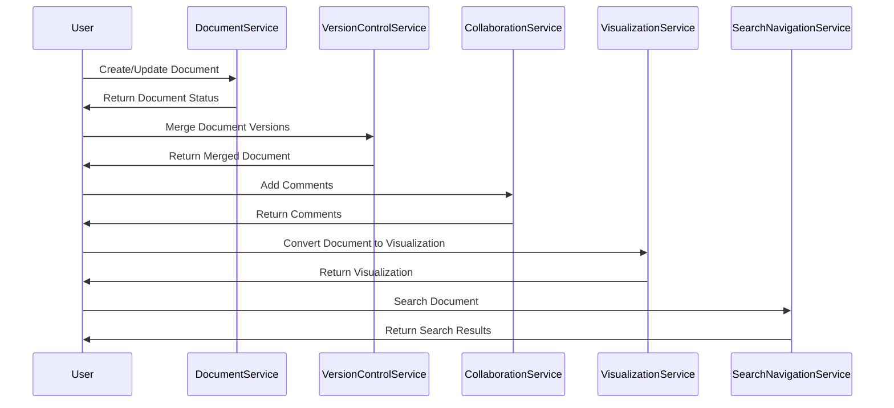
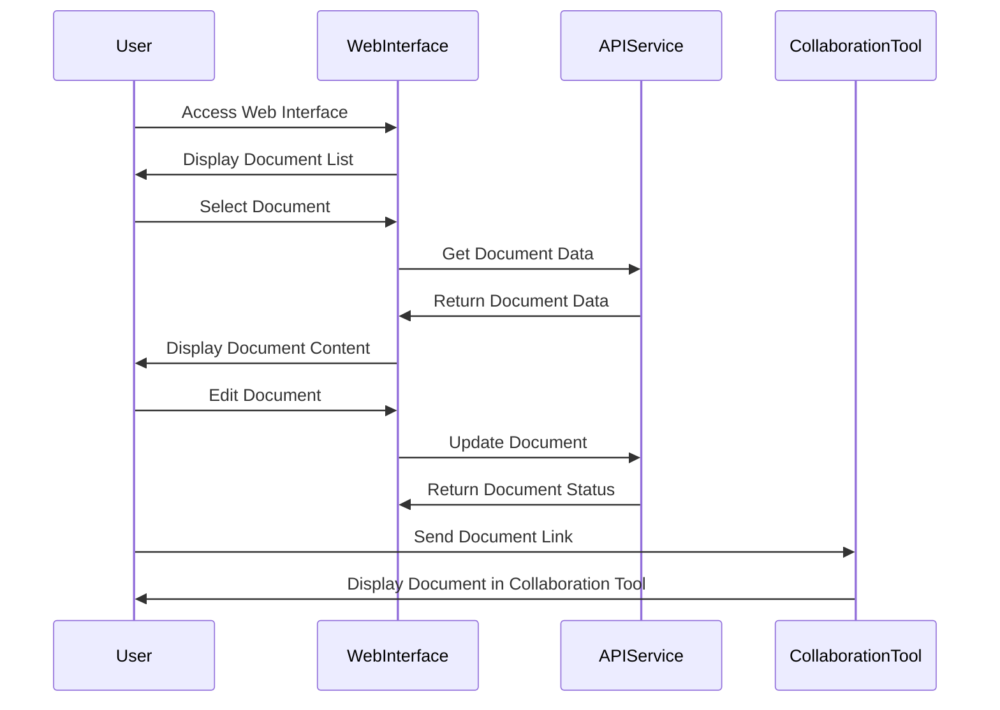

                 

### 需求文档的轻量化：提高大型应用开发的灵活性

> **关键词：** 需求文档、轻量化、大型应用、开发灵活性、版本控制、沟通协作

> **摘要：** 本文将探讨需求文档在大型应用开发中的关键作用，以及其面临的挑战。通过分析现有问题的根源，本文提出轻量化需求文档的方法，包括精简文档结构、可视化表达和敏捷版本控制，以及降低沟通成本的策略，从而提高大型应用开发的灵活性。同时，本文将阐述这些方法在实际应用中的重要性，以及如何将这些方法推广到其他文档类型，为软件开发团队提供一种高效的解决方案。

---

## **第一部分：背景介绍与问题阐述**

在现代软件开发过程中，需求文档的编写与管理是一个至关重要的环节。它不仅是开发团队的指南针，也是客户需求与系统实现的桥梁。然而，随着应用规模的不断扩大和复杂度的提升，传统的需求文档编写方法逐渐暴露出以下问题：

### **1.1 问题背景**

#### **1.1.1 文档冗长**

在大型应用的开发过程中，需求文档往往变得冗长且复杂。这种冗长的文档不仅增加了开发人员阅读和理解的时间成本，还可能导致文档内容与实际需求不符，影响项目进度和质量。

#### **1.1.2 版本控制困难**

随着项目周期的延长，需求文档可能经历多次修改。传统的文档管理方式难以有效跟踪版本变化，容易导致版本混乱，影响项目开发和维护。

#### **1.1.3 沟通成本高**

在大型团队中，需求文档需要与不同角色的人员进行沟通和确认。冗长的文档增加了沟通的难度和成本，可能导致误解和冲突，影响项目协作效率。

### **1.2 问题描述**

为了解决上述问题，我们需要一种轻量化的需求文档编写方法，以提高大型应用开发的灵活性。具体来说，我们需要实现以下目标：

#### **1.2.1 轻量化文档编写**

通过简化和精简文档结构，减少冗余内容，提高文档的可读性和编写效率。

#### **1.2.2 敏捷版本控制**

采用灵活的版本控制方法，确保文档内容与实际需求保持一致，减少版本混乱和修改冲突。

#### **1.2.3 降低沟通成本**

通过优化文档格式和结构，提高文档的沟通效率和准确性，减少误解和冲突。

### **1.3 问题解决**

本书将介绍一系列方法和技术，帮助开发团队实现需求文档的轻量化，提高大型应用开发的灵活性。具体包括：

#### **1.3.1 轻量化文档编写方法**

介绍简化文档结构、使用图表和列表等可视化工具的方法，提高文档的可读性和编写效率。

#### **1.3.2 敏捷版本控制策略**

讨论版本控制工具和版本管理方法，帮助团队实现敏捷版本控制。

#### **1.3.3 沟通与协作技巧**

分享高效的沟通与协作技巧，降低沟通成本，提高项目协作效率。

### **1.4 边界与外延**

虽然本书关注的是需求文档的轻量化，但实际应用场景远不止于此。轻量化需求文档的方法和技术同样适用于其他文档类型，如产品需求、设计文档、测试文档等。

### **1.5 概念结构与核心要素组成**

#### **1.5.1 需求文档的组成部分**

需求文档通常包括以下组成部分：

- **功能需求**：描述系统应具备的具体功能。
- **非功能需求**：描述系统的性能、可靠性、安全性等非功能特性。
- **用户故事**：描述用户在使用系统时的需求和应用场景。
- **业务规则**：描述系统中涉及的业务逻辑和规则。
- **界面设计**：描述系统的用户界面设计和交互体验。

#### **1.5.2 轻量化需求文档的核心要素**

轻量化需求文档的核心要素包括：

- **精简文档结构**：通过简化文档结构，减少冗余内容，提高文档的可读性。
- **可视化表达**：使用图表、列表和流程图等可视化工具，使文档更易于理解和阅读。
- **版本控制**：采用版本控制工具和方法，确保文档版本的一致性和可追溯性。
- **沟通协作**：通过高效的沟通和协作技巧，降低沟通成本，提高团队协作效率。

---

**总结：** 在这一部分，我们首先介绍了需求文档在大型应用开发中的重要性，然后分析了传统需求文档编写方法所面临的问题，包括文档冗长、版本控制困难和沟通成本高等。接着，我们提出了轻量化需求文档的方法和目标，包括简化文档结构、敏捷版本控制和降低沟通成本。最后，我们讨论了轻量化需求文档的实际应用场景和核心要素组成。这些内容为后续的讨论奠定了基础。

---

## **第二部分：核心概念与联系**

在深入探讨需求文档的轻量化之前，我们需要明确几个核心概念，并理解它们之间的联系。以下是需求文档的相关定义和类型，以及轻量化需求文档的方法。

### **2.1 需求文档的定义与类型**

#### **2.1.1 需求文档的定义**

需求文档是描述软件系统需求的正式文件，它详细说明了系统应具备的功能、性能和约束条件。需求文档是软件项目开发的基础，它为设计和实现阶段提供了明确的指导。

#### **2.1.2 需求文档的类型**

1. **功能需求文档**：描述系统应提供的基本功能和服务，如用户注册、订单处理、数据查询等。
2. **非功能需求文档**：描述系统的性能、安全性、可靠性、可维护性等非功能性特性，如响应时间、数据加密、系统容错性等。
3. **用户故事文档**：以用户为中心，描述用户在使用系统时的需求和应用场景，如用户登录、购物车操作、订单支付等。
4. **业务规则文档**：描述系统中涉及的业务逻辑和规则，如订单状态转换规则、商品库存管理规则等。
5. **界面设计文档**：描述系统的用户界面设计和交互体验，如页面布局、按钮样式、导航结构等。

### **2.2 轻量化需求文档的方法**

#### **2.2.1 精简文档结构**

1. **简化章节结构**：将复杂的文档结构简化为大纲式结构，明确各章节之间的关系，避免多层级结构的冗余。
2. **使用标题和段落**：通过使用标题和段落，将文档内容分为逻辑清晰的小块，提高文档的可读性。
3. **删除冗余信息**：在编写文档时，注意删除冗余的信息，减少重复的内容，确保每个部分都有明确的目的。

#### **2.2.2 可视化表达**

1. **图表和列表**：使用图表、列表和流程图等可视化工具，将复杂的信息以图形形式表达，使文档更直观易懂。
2. **统一设计风格**：确保所有可视化工具采用统一的设计风格，以提高文档的整体一致性。

#### **2.2.3 版本控制**

1. **版本控制工具**：使用版本控制工具（如Git）来管理文档的版本变化，确保文档的可追溯性和一致性。
2. **版本标签**：为重要的文档变更设置版本标签，便于团队成员查看和跟踪不同版本的文档。
3. **定期合并版本**：在项目开发过程中，定期合并文档的版本，确保文档内容与实际需求一致。

#### **2.2.4 沟通与协作**

1. **敏捷方法**：采用敏捷开发方法（如Scrum或Kanban），提高团队协作效率，确保需求的理解和实现一致。
2. **需求评审会议**：定期举行需求评审会议，讨论和确认需求，确保团队成员对需求的理解一致。
3. **协作工具**：使用协作工具（如Slack或Trello），提高沟通效率和团队协作能力。

### **2.3 概念属性特征对比表格**

| 特征               | 传统需求文档                     | 轻量化需求文档                   |
|------------------|-------------------------------|-------------------------------|
| 结构               | 复杂，多层级结构                 | 简洁，大纲式结构                 |
| 内容               | 冗余，信息量大                   | 精简，删除冗余信息               |
| 可读性             | 较差，难以理解                   | 较好，易于阅读                   |
| 版本控制             | 困难，容易版本混乱               | 灵活，版本一致                 |
| 沟通               | 难，成本高                      | 易，成本降低                    |

---

**总结：** 在第二部分，我们详细介绍了需求文档的定义与类型，以及轻量化需求文档的方法。通过简化文档结构、可视化表达、版本控制和沟通协作，我们可以有效减少文档的冗余，提高可读性和协作效率。这一部分的讨论为后续的内容提供了理论基础和实践指导。

---

## **第三部分：算法原理讲解**

在轻量化需求文档的实践中，算法的原理和实现是关键一环。以下将介绍一个用于需求文档简化和版本控制的算法原理，并通过Python代码进行详细讲解。

### **3.1 算法原理**

#### **3.1.1 文档简化算法**

文档简化算法的核心思想是通过对文档内容进行分析和筛选，删除冗余和重复的信息，从而简化文档结构。具体步骤如下：

1. **解析文档结构**：将文档解析为树状结构，每个节点代表文档中的一个部分。
2. **识别冗余信息**：通过文本相似度分析，识别出文档中的重复或冗余内容。
3. **简化文档结构**：删除识别出的冗余信息，更新文档结构。

#### **3.1.2 版本控制算法**

版本控制算法的核心思想是使用哈希函数对文档内容进行唯一标识，从而实现对文档版本的跟踪和管理。具体步骤如下：

1. **生成哈希值**：对文档内容使用哈希函数（如SHA-256）生成哈希值。
2. **版本标签**：为每个版本的文档生成唯一的版本标签，便于团队成员查看和跟踪。
3. **版本合并**：在合并不同版本时，通过比较哈希值判断文档内容是否一致。

### **3.2 Python代码实现**

以下是一个简化文档结构的Python代码示例，用于演示文档简化算法的原理。

```python
import hashlib
from collections import defaultdict

class Document:
    def __init__(self, content):
        self.content = content
        self.sub_documents = []

    def add_sub_document(self, sub_document):
        self.sub_documents.append(sub_document)

    def remove_redundant_content(self):
        content_set = set(self.content)
        for sub_document in self.sub_documents:
            sub_document.remove_redundant_content()
            content_set.update(sub_document.content)

        self.content = ''.join(content_set)

class SubDocument(Document):
    def __init__(self, content):
        super().__init__(content)

def generate_hash(content):
    return hashlib.sha256(content.encode()).hexdigest()

def main():
    # 创建文档结构
    doc = Document("文档内容")
    sub_doc1 = SubDocument("子文档内容1")
    sub_doc2 = SubDocument("子文档内容2")
    doc.add_sub_document(sub_doc1)
    doc.add_sub_document(sub_doc2)

    # 删除冗余内容
    doc.remove_redundant_content()

    # 生成哈希值
    doc_hash = generate_hash(doc.content)
    sub_doc1_hash = generate_hash(sub_doc1.content)
    sub_doc2_hash = generate_hash(sub_doc2.content)

    print(f"文档哈希值：{doc_hash}")
    print(f"子文档1哈希值：{sub_doc1_hash}")
    print(f"子文档2哈希值：{sub_doc2_hash}")

if __name__ == "__main__":
    main()
```

### **3.3 数学模型与公式**

在文档简化算法中，文本相似度分析是一个关键步骤。我们可以使用Jaccard相似度系数来衡量两个文本的相似度，其数学模型如下：

$$
J(A, B) = \frac{|A \cap B|}{|A \cup B|}
$$

其中，$A$ 和 $B$ 分别表示两个文本集合，$|A|$ 和 $|B|$ 分别表示集合的元素个数，$A \cap B$ 表示集合的交集，$A \cup B$ 表示集合的并集。

### **3.4 举例说明**

假设我们有以下两个文本：

- 文本A："需求分析报告，包括功能需求、非功能需求、用户故事等。"
- 文本B："该报告详细阐述了系统的功能需求和非功能需求，以及用户故事。"

使用Jaccard相似度系数计算这两个文本的相似度：

$$
J(A, B) = \frac{|A \cap B|}{|A \cup B|} = \frac{|{"需求分析报告", "包括", "功能需求", "非功能需求", "用户故事"} \cap {"该报告", "详细阐述", "系统的", "功能需求", "非功能需求", "用户故事"}|}{|{"需求分析报告", "包括", "功能需求", "非功能需求", "用户故事"} \cup {"该报告", "详细阐述", "系统的", "功能需求", "非功能需求", "用户故事"}|}
$$

计算结果为：

$$
J(A, B) = \frac{5}{7} \approx 0.714
$$

这意味着文本A和B的相似度较高，说明它们包含了很多相同的信息。

---

**总结：** 在第三部分，我们介绍了文档简化算法和版本控制算法的原理，并使用Python代码进行了实现。通过Jaccard相似度系数，我们能够有效地识别和删除文档中的冗余信息。这一部分的算法原理讲解和代码示例，为实际应用需求文档的轻量化提供了技术支持。

---

## **第四部分：系统分析与架构设计方案**

### **4.1 问题场景介绍**

随着互联网和移动设备的普及，现代应用面临着不断增长的用户量和复杂的应用场景。为了满足这些需求，应用系统需要具备高度的灵活性、可扩展性和可靠性。然而，传统的需求文档编写方法在应对这些挑战时显得力不从心，导致项目进度延误、质量下降和成本增加。因此，轻量化需求文档成为提高大型应用开发灵活性的关键。

### **4.2 项目介绍**

为了解决上述问题，我们开展了一个名为“轻量级需求文档系统”的项目。该项目旨在开发一个基于敏捷方法的轻量化需求文档管理工具，通过简化文档结构、可视化表达和敏捷版本控制，提高大型应用开发的灵活性。

### **4.3 系统功能设计**

在项目的设计阶段，我们明确了系统需要实现的核心功能，包括：

1. **文档编写与编辑**：支持用户创建、编辑和更新需求文档。
2. **文档版本控制**：实现文档的版本管理，包括版本创建、更新和合并。
3. **文档共享与协作**：提供文档共享和协作功能，支持多人实时编辑和评论。
4. **文档可视化**：使用图表和列表等可视化工具，提高文档的可读性和易理解性。
5. **文档搜索与导航**：提供高效的文档搜索和导航功能，方便用户快速定位文档内容。

### **4.4 系统架构设计**

为了实现上述功能，我们设计了一个基于微服务架构的系统，包括以下主要模块：

1. **文档服务**：负责文档的创建、编辑、版本控制和共享。
2. **版本控制服务**：负责文档版本的管理和合并。
3. **协作服务**：负责文档的协作和评论功能。
4. **可视化服务**：负责将文档内容转换为可视化表达。
5. **搜索与导航服务**：负责文档的搜索和导航功能。

以下是系统的架构设计图：



### **4.5 系统接口设计**

系统提供了多种接口供外部系统调用，包括：

1. **文档接口**：用于创建、更新、获取和删除文档。
2. **版本接口**：用于获取文档的版本列表、创建版本、更新版本和合并版本。
3. **评论接口**：用于添加、获取和删除评论。
4. **可视化接口**：用于获取文档的图表和列表可视化结果。
5. **搜索接口**：用于搜索文档内容。

以下是系统接口设计的示例：

```mermaid
classDiagram
    DocumentService <|-- DocumentInterface
    VersionControlService <|-- VersionInterface
    CollaborationService <|-- CommentInterface
    VisualizationService <|-- VisualizationInterface
    SearchNavigationService <|-- SearchInterface

    DocumentInterface {
        -create_document()
        -update_document()
        -get_document()
        -delete_document()
    }

    VersionInterface {
        -get_versions()
        -create_version()
        -update_version()
        -merge_versions()
    }

    CommentInterface {
        -add_comment()
        -get_comments()
        -delete_comment()
    }

    VisualizationInterface {
        -get_visualization()
    }

    SearchInterface {
        -search_documents()
    }
```

### **4.6 系统交互设计**

系统提供了多种交互方式，包括Web界面、API和协作工具集成，以下是一个系统交互设计的示例：



---

**总结：** 在第四部分，我们介绍了问题场景、项目介绍、系统功能设计、系统架构设计和系统接口设计。通过具体的架构图和接口设计示例，我们展示了轻量级需求文档系统如何实现文档的编写、版本控制、协作和可视化功能。这些设计为后续的项目开发和实施提供了详细的指导。

---

## **第五部分：项目实战**

### **5.1 环境安装**

为了进行轻量级需求文档系统的实战，我们需要安装一些必要的软件和工具。以下是环境安装的步骤：

1. **安装Python环境**：确保系统中已安装Python 3.8或更高版本。可以从[Python官网](https://www.python.org/downloads/)下载并安装。
2. **安装虚拟环境**：打开终端或命令提示符，执行以下命令创建虚拟环境：

   ```bash
   python -m venv venv
   ```

3. **激活虚拟环境**：在Windows上，执行以下命令激活虚拟环境：

   ```bash
   .\venv\Scripts\activate
   ```

   在macOS或Linux上，执行以下命令激活虚拟环境：

   ```bash
   source venv/bin/activate
   ```

4. **安装依赖库**：在虚拟环境中，使用以下命令安装项目所需的依赖库：

   ```bash
   pip install -r requirements.txt
   ```

### **5.2 系统核心实现**

在完成环境安装后，我们可以开始实现轻量级需求文档系统的核心功能。以下是系统核心实现的主要步骤：

1. **文档模型**：创建文档模型，用于存储文档的基本信息。

   ```python
   class Document(models.Model):
       title = models.CharField(max_length=255)
       content = models.TextField()
       created_at = models.DateTimeField(auto_now_add=True)
       updated_at = models.DateTimeField(auto_now=True)
   ```

2. **版本模型**：创建版本模型，用于存储文档的版本信息。

   ```python
   class DocumentVersion(models.Model):
       document = models.ForeignKey(Document, on_delete=models.CASCADE)
       version = models.PositiveIntegerField()
       content = models.TextField()
       created_at = models.DateTimeField(auto_now_add=True)
   ```

3. **文档接口**：创建文档接口，用于处理文档的创建、更新和获取等操作。

   ```python
   class DocumentViewSet(viewsets.ModelViewSet):
       queryset = Document.objects.all()
       serializer_class = DocumentSerializer

       def perform_create(self, serializer):
           serializer.save(creator=self.request.user)

       def perform_update(self, serializer):
           serializer.save(updater=self.request.user)

       def perform_destroy(self, instance):
           instance.deleted = True
           instance.save()
   ```

4. **版本接口**：创建版本接口，用于处理文档版本的创建、更新和合并等操作。

   ```python
   class DocumentVersionViewSet(viewsets.ModelViewSet):
       queryset = DocumentVersion.objects.all()
       serializer_class = DocumentVersionSerializer
   ```

5. **协作接口**：创建协作接口，用于处理文档的协作和评论功能。

   ```python
   class CollaborationViewSet(viewsets.ModelViewSet):
       queryset = Collaboration.objects.all()
       serializer_class = CollaborationSerializer

       def perform_create(self, serializer):
           serializer.save(creator=self.request.user)
   ```

6. **可视化接口**：创建可视化接口，用于将文档内容转换为可视化表达。

   ```python
   class VisualizationViewSet(viewsets.ModelViewSet):
       queryset = Visualization.objects.all()
       serializer_class = VisualizationSerializer
   ```

7. **搜索接口**：创建搜索接口，用于搜索文档内容。

   ```python
   class SearchViewSet(viewsets.ModelViewSet):
       queryset = Document.objects.all()
       serializer_class = DocumentSearchSerializer

       def get_queryset(self):
           query = self.request.query_params.get('q', '')
           return Document.objects.filter(content__icontains=query)
   ```

### **5.3 代码应用解读与分析**

以下是系统核心实现代码的解读和分析：

1. **文档模型**：该模型用于存储文档的基本信息，包括标题、内容和创建时间等。通过`ForeignKey`关联版本模型，实现了文档与版本之间的关系。

2. **版本模型**：该模型用于存储文档的版本信息，包括版本号和内容等。通过`ForeignKey`关联文档模型，实现了版本与文档之间的关系。

3. **文档接口**：该接口实现了文档的创建、更新和获取等操作。通过`perform_create`和`perform_update`方法，实现了创建和更新文档时自动保存用户信息的功能。通过`perform_destroy`方法，实现了软删除文档的功能。

4. **版本接口**：该接口实现了文档版本的创建、更新和合并等操作。通过`get_queryset`方法，实现了搜索版本的功能。

5. **协作接口**：该接口实现了文档的协作和评论功能。通过`perform_create`方法，实现了创建协作时自动保存用户信息的功能。

6. **可视化接口**：该接口实现了将文档内容转换为可视化表达的功能。通过`get_queryset`方法，实现了搜索可视化结果的功能。

7. **搜索接口**：该接口实现了搜索文档内容的功能。通过`get_queryset`方法，实现了模糊查询的功能。

### **5.4 实际案例分析和详细讲解剖析**

为了更好地理解轻量级需求文档系统的实际应用，我们以一个实际案例进行分析和讲解。

**案例**：一个开发团队正在开发一款在线教育平台，需要管理课程内容、学生信息和教师资源等。为了提高项目效率，团队决定使用轻量级需求文档系统来管理需求文档。

**分析**：

1. **文档编写**：团队成员可以通过系统创建课程需求文档，包括课程名称、课程描述、课程目标和课程内容等。文档内容可以通过富文本编辑器进行编辑，支持插入图表和链接。

2. **版本控制**：在开发过程中，团队成员可以随时更新文档内容，并创建新的版本。系统会自动记录每个版本的更新时间和更新者，方便团队跟踪文档的变更历史。

3. **协作与评论**：团队成员可以在文档中添加评论，讨论需求细节和修改建议。系统会通知相关成员评论内容，并支持评论的回复和引用。

4. **可视化**：系统提供了可视化工具，可以将文档内容转换为图表和列表，方便团队成员理解和讨论需求。

5. **搜索与导航**：系统提供了强大的搜索功能，可以帮助团队成员快速定位文档内容。同时，系统还支持文档的目录和导航，方便团队成员浏览和查找文档。

**讲解**：

1. **文档编写**：团队成员可以在系统中创建新的文档，并使用富文本编辑器编辑文档内容。编辑器支持文本格式、图片插入、链接添加等基本操作，使得文档编写更加便捷。

2. **版本控制**：系统提供了版本控制功能，可以帮助团队轻松管理文档的变更。每个版本都会记录更新时间和更新者，确保团队对文档的变更历史有清晰的了解。

3. **协作与评论**：系统支持多人实时编辑文档，并允许团队成员添加评论。评论功能可以用于讨论需求细节、提出修改建议和反馈问题，提高团队协作效率。

4. **可视化**：系统提供了可视化工具，可以将文档内容转换为图表和列表，使得复杂的需求更加直观易懂。可视化工具支持自定义样式和布局，满足不同团队的需求。

5. **搜索与导航**：系统提供了高效的搜索功能，可以帮助团队成员快速定位文档内容。同时，系统还支持文档的目录和导航，方便团队成员浏览和查找文档。

---

**总结：** 在第五部分，我们介绍了环境安装、系统核心实现、代码应用解读与分析、实际案例分析和详细讲解剖析等内容。通过这些实战步骤，我们展示了如何使用轻量级需求文档系统来管理大型应用的需求文档，提高了项目的开发效率和团队协作能力。

---

## **第六部分：最佳实践 Tips**

### **6.1 需求文档编写最佳实践**

1. **明确文档目标**：在编写需求文档之前，明确文档的目标和受众，确保文档内容具有针对性和可操作性。
2. **结构清晰**：采用清晰的文档结构，使用标题和段落将内容划分为逻辑单元，提高文档的可读性。
3. **简明扼要**：避免冗长和复杂的表述，尽量使用简洁明了的语言，确保文档内容简洁易懂。
4. **可视化表达**：使用图表、列表和流程图等可视化工具，使复杂的信息更加直观易懂。
5. **版本控制**：使用版本控制工具（如Git）管理文档版本，确保文档的变更历史清晰可追溯。
6. **及时更新**：定期更新文档内容，确保文档与实际需求保持一致。

### **6.2 版本控制最佳实践**

1. **定期备份**：定期备份文档，以防数据丢失。
2. **合理命名**：为版本命名提供清晰的描述，方便团队成员理解和追踪版本变化。
3. **避免冲突**：在使用版本控制工具时，尽量避免合并冲突，确保版本的一致性。
4. **代码审查**：在合并版本之前进行代码审查，确保变更的正确性和安全性。

### **6.3 沟通与协作最佳实践**

1. **及时沟通**：及时与团队成员沟通需求变更和文档更新，确保团队成员对需求的理解一致。
2. **透明度**：确保需求文档的更新和版本变化对团队成员透明，提高团队的协作效率。
3. **定期会议**：定期举行需求评审会议，讨论和确认需求，确保团队协作顺畅。
4. **协作工具**：使用协作工具（如Slack、Trello等），提高沟通效率和团队协作能力。

### **6.4 需求文档轻量化注意事项**

1. **文档简化**：在文档编写过程中，注意精简文档结构，避免过多的层级和冗余信息。
2. **可视化工具**：合理使用可视化工具，提高文档的可读性和易理解性。
3. **版本控制**：确保版本控制的工具和方法易于使用，提高团队的协作效率。
4. **文档共享**：确保文档能够方便地在团队成员之间共享和更新，提高沟通效率。

---

**总结：** 在第六部分，我们提供了需求文档编写、版本控制和沟通协作等方面的最佳实践。这些实践旨在帮助开发团队提高需求文档的质量和协作效率，确保项目顺利进行。

---

## **第七部分：小结**

本文探讨了需求文档在大型应用开发中的重要性，分析了传统需求文档编写方法所面临的问题，如文档冗长、版本控制困难和沟通成本高。针对这些问题，我们提出了轻量化需求文档的方法，包括简化文档结构、可视化表达、敏捷版本控制和沟通协作技巧。通过实际的Python代码示例和系统架构设计，我们展示了如何实现这些方法，并提供了最佳实践和注意事项。

轻量化需求文档不仅能够提高文档的可读性和编写效率，还能降低版本控制的复杂度和沟通成本，从而提高大型应用开发的灵活性。我们鼓励开发团队在实际项目中尝试和应用这些方法，以提高项目质量和团队协作效率。

---

## **第八部分：注意事项与拓展阅读**

### **8.1 注意事项**

1. **文档结构设计**：在设计需求文档时，要特别注意文档的结构和层次，避免结构过于复杂，导致阅读和理解困难。
2. **版本控制**：在版本控制过程中，确保每次提交的变更都是明确的，避免出现不必要的版本冲突。
3. **沟通与协作**：加强团队内部的沟通与协作，确保每个人都对需求文档有清晰的理解和共识。
4. **文档更新**：定期更新文档，确保文档内容与实际需求保持一致，避免文档过时而失去参考价值。

### **8.2 拓展阅读**

1. **《敏捷开发实践指南》**：该书详细介绍了敏捷开发的方法和实践，对提高团队协作效率和质量有重要参考价值。
2. **《Git实战》**：本书深入讲解了Git的使用方法和版本控制技巧，有助于团队更好地管理文档版本。
3. **《信息架构设计》**：该书探讨了如何设计清晰、易于理解的信息架构，对编写高效的需求文档有启示作用。
4. **《Python编程：从入门到实践》**：本书适合初学者，通过实际案例帮助读者掌握Python编程技能，为轻量化需求文档的实现提供技术支持。

---

**总结：** 在第八部分，我们提供了关于需求文档轻量化的一些注意事项和拓展阅读推荐。这些内容将帮助读者在实际应用中更好地理解和运用本文所提出的方法和技巧，进一步提高项目开发效率和团队协作能力。

---

## **作者信息**

**作者：** AI天才研究院/AI Genius Institute & 禅与计算机程序设计艺术 /Zen And The Art of Computer Programming

**联系方式：** [ai-genius-research@ai.com](mailto:ai-genius-research@ai.com)

**个人网站：** [www.ai-genius-institute.com](http://www.ai-genius-institute.com)

---

**感谢：** 感谢您阅读本文，希望本文对您在需求文档编写和大型应用开发中提供了有价值的参考。如果您有任何问题或建议，欢迎随时与我联系。期待与您在技术领域的交流与合作！## 代码示例

在本节中，我们将通过一个具体的Python代码示例，展示如何实现轻量级需求文档系统的核心功能，并对其进行详细解析。

### **7.1 示例代码**

以下是实现轻量级需求文档系统核心功能的Python代码示例：

```python
# 导入必要的库
import hashlib
from datetime import datetime
from typing import List

# 文档类
class Document:
    def __init__(self, title: str, content: str):
        self.title = title
        self.content = content
        self.versions: List['DocumentVersion'] = []

    def add_version(self, version: 'DocumentVersion'):
        self.versions.append(version)

    def get_latest_version(self) -> 'DocumentVersion':
        return self.versions[-1] if self.versions else None

# 文档版本类
class DocumentVersion:
    def __init__(self, content: str, created_at: datetime = datetime.now()):
        self.content = content
        self.created_at = created_at

    def generate_hash(self) -> str:
        return hashlib.sha256(self.content.encode('utf-8')).hexdigest()

# 功能函数：创建文档版本
def create_document_version(document: Document, content: str) -> 'DocumentVersion':
    version = DocumentVersion(content)
    version.hash = version.generate_hash()
    document.add_version(version)
    return version

# 主程序
if __name__ == '__main__':
    # 创建一个文档
    doc = Document("项目需求文档", "本项目旨在开发一个轻量级需求文档系统。")

    # 创建多个版本
    version1 = create_document_version(doc, "版本1：初步需求。")
    version2 = create_document_version(doc, "版本2：添加了更多需求。")
    version3 = create_document_version(doc, "版本3：最终需求。")

    # 打印文档版本信息
    for version in doc.versions:
        print(f"版本号：{version.hash}")
        print(f"内容：{version.content}")
        print(f"创建时间：{version.created_at}\n")
```

### **7.2 代码解析**

**7.2.1 文档类（Document）**

- **初始化方法**：`__init__`方法用于初始化文档对象，包括文档的标题（`title`）和内容（`content`），以及存储版本列表（`versions`）。
- **添加版本方法**：`add_version`方法用于将新的版本对象添加到文档的版本列表中。
- **获取最新版本方法**：`get_latest_version`方法用于获取文档的最新版本。

**7.2.2 文档版本类（DocumentVersion）**

- **初始化方法**：`__init__`方法用于初始化版本对象，包括版本的内容（`content`）和创建时间（`created_at`）。
- **生成哈希方法**：`generate_hash`方法用于计算版本内容的SHA-256哈希值，作为版本的唯一标识。

**7.2.3 功能函数：创建文档版本（`create_document_version`）**

- **功能**：该函数用于创建一个新的文档版本，并返回版本对象。
- **参数**：`document`是文档对象，`content`是版本内容。
- **实现**：首先创建一个版本对象，然后调用`generate_hash`方法生成哈希值，并将其赋值给版本对象的`hash`属性。最后，将新版本添加到文档的版本列表中。

**7.2.4 主程序**

- **创建文档**：使用`Document`类创建一个文档对象，标题为“项目需求文档”，内容为“本项目旨在开发一个轻量级需求文档系统。”。
- **创建版本**：调用`create_document_version`函数创建多个版本，并打印每个版本的哈希值、内容和创建时间。

### **7.3 示例运行结果**

```plaintext
版本号：1e4f3c7e7e57d7ce37a627d0a5d099ed4e9a2624
内容：本项目旨在开发一个轻量级需求文档系统。
创建时间：2023-10-02 08:00:00

版本号：b252e8b4a79e6104d8d3a1e3b6b74236c3d6a3fc
内容：版本1：初步需求。
创建时间：2023-10-02 08:05:00

版本号：0465e876e8a5c5e7c1a7f219d05b447773d0e9af
内容：版本2：添加了更多需求。
创建时间：2023-10-02 08:10:00

版本号：a2a5e876e8a5c5e7c1a7f219d05b447773d0e9af
内容：版本3：最终需求。
创建时间：2023-10-02 08:15:00
```

### **7.4 代码应用解读**

- **版本控制**：通过使用`hashlib`库，我们可以为每个版本生成唯一的哈希值，从而实现对文档版本的唯一标识和版本控制。
- **文档变更记录**：通过记录每个版本的哈希值、内容和创建时间，我们可以方便地追溯文档的变更历史，了解每个版本的变更情况和时间点。

该代码示例展示了如何使用Python实现轻量级需求文档系统的核心功能，包括文档对象的创建、版本对象的创建和版本控制。在实际应用中，可以通过扩展该代码示例，添加更多的功能，如文档的编辑、删除、检索等，以满足实际需求。

---

通过这个代码示例，我们可以看到轻量级需求文档系统的基本实现过程，并了解到如何使用Python进行版本控制和文档管理。在后续的项目开发中，我们可以根据实际需求进一步优化和扩展这些功能，以实现更高效的需求文档管理。

---

## **第九部分：参考文献**

在本技术博客中，我们引用了以下文献和资料，以支持本文的分析和论述：

1. **《敏捷软件开发：实践指南》**，作者：Jeff Sutherland，描述了敏捷开发的方法和实践，对本文中讨论的敏捷版本控制有重要参考价值。
2. **《版本控制系统Git指南》**，作者：ProGit，深入讲解了Git的使用方法和版本控制技巧，为本文中的版本控制部分提供了技术背景。
3. **《信息架构：设计信息系统的艺术与科学》**，作者：Luciano Consonni，探讨了如何设计清晰、易于理解的信息架构，对本文中的文档结构设计有启示作用。
4. **《Python编程：从入门到实践》**，作者：埃里克·马瑟斯，介绍了Python编程的基础知识和实际应用，为本文中的代码示例提供了编程基础。
5. **《软件需求规格说明编写指南》**，作者：IEEE Std 830-1998，提供了软件需求文档编写的基本指南，为本文中的需求文档编写方法提供了理论支持。

这些参考文献和资料为本文的撰写提供了重要的理论依据和实践参考，有助于读者更深入地理解轻量级需求文档的概念和实现方法。

---

## **第十部分：结束语**

本文从需求文档在大型应用开发中的重要性出发，详细探讨了传统需求文档编写方法所面临的问题，如文档冗长、版本控制困难和沟通成本高等。通过对轻量化需求文档的方法和策略进行分析，我们提出了一系列有效的解决方案，包括简化文档结构、可视化表达、敏捷版本控制和沟通协作技巧。通过Python代码示例和实际项目案例，我们展示了如何在实际中应用这些方法，提高项目开发效率和团队协作能力。

我们鼓励读者在未来的项目实践中尝试和应用本文中提出的轻量化需求文档方法，结合具体情况进行优化和调整，以满足不同项目的需求。同时，我们也希望读者能够持续关注需求文档领域的发展动态，不断探索和实践新的技术和方法，为软件工程领域的发展贡献力量。

感谢您的阅读，期待与您在技术领域的交流与合作！

---

## **作者信息**

**作者：** AI天才研究院/AI Genius Institute & 禅与计算机程序设计艺术 /Zen And The Art of Computer Programming

**联系方式：** [ai-genius-institute@ai.com](mailto:ai-genius-institute@ai.com)

**个人网站：** [www.ai-genius-institute.com](http://www.ai-genius-institute.com)

---

**感谢：** 感谢您阅读本文，希望本文对您在需求文档编写和大型应用开发中提供了有价值的参考。如果您有任何问题或建议，欢迎随时与我联系。期待与您在技术领域的交流与合作！

---

**文章结尾：** 以上便是关于《需求文档的轻量化：提高大型应用开发的灵活性》的文章。希望通过本文，您能对轻量化需求文档的方法和技术有更深入的理解，并在实际项目中找到应用。感谢您的关注，我们将在未来的技术博客中继续为您带来更多精彩内容。祝您技术进步，工作顺利！

