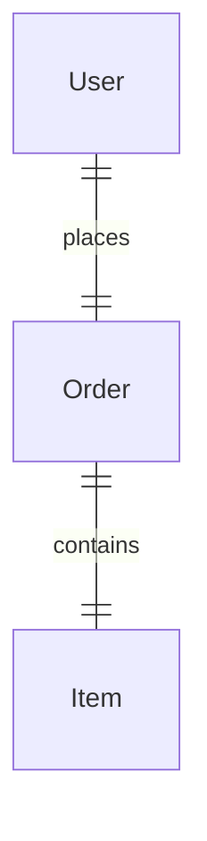
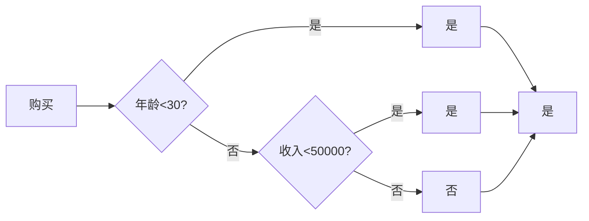
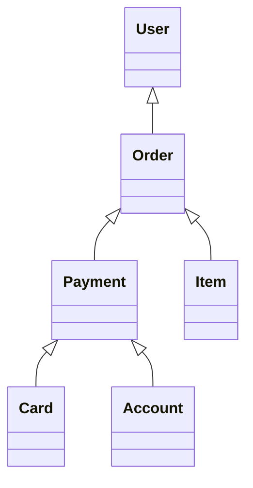

                 

# 《需求验证的创新方法：确保大型应用的质量》

## 关键词
- 需求验证
- 大型应用
- 质量保证
- 测试方法
- 方法论
- 最佳实践

## 摘要
本文旨在探讨需求验证在大型应用质量保证中的重要性，并介绍一系列创新的需求验证方法。我们将通过逻辑清晰、结构紧凑的分析，逐步解读各种方法的理论基础和应用实践，旨在为开发者提供一套完整的需求验证框架，从而确保大型应用的高质量交付。

## 引言

### 1.1 需求验证的重要性

在软件开发过程中，需求验证是一个至关重要的环节。它不仅关乎产品能否满足用户需求，更直接影响到最终的应用质量。以下是需求验证的重要性体现：

- **确保功能完整性**：需求验证能够确保所有需求都被正确实现，没有遗漏的功能点。
- **提升用户满意度**：通过有效的需求验证，开发者可以确保产品交付时能够达到用户预期，从而提高用户满意度。
- **降低维护成本**：早期发现并修正需求中的错误可以显著降低后续维护成本。
- **提高开发效率**：系统化的需求验证流程有助于优化开发资源分配，提高开发效率。

### 1.2 书籍结构概述

本书将按照以下结构进行展开：

1. **需求验证概述**：介绍需求验证的定义、核心要素及与传统测试方法的区别。
2. **需求验证的方法论**：详细阐述各种创新的需求验证方法，包括黑盒测试、白盒测试、自动化测试、模糊测试等。
3. **需求验证的核心概念与联系**：介绍需求验证中的关键概念，如需求规格、需求变更管理、需求质量等，并通过实体关系图展示其关系。
4. **需求验证的数学模型**：解释需求验证中涉及的数学模型，如决策树、神经网络等，并详细阐述算法原理。
5. **需求验证实践案例**：通过实际项目展示如何应用需求验证的方法。
6. **需求验证的最佳实践**：总结最佳实践，为开发者提供操作指南。
7. **总结与展望**：对全书内容进行总结，并展望需求验证的未来发展趋势。

## 第1章：需求验证概述

### 1.1 需求验证的定义与核心要素

#### 1.1.1 需求验证的定义

需求验证是软件开发过程中的一项关键活动，旨在确保开发团队所实现的功能满足客户或用户的原始需求。它不仅包括对功能性的验证，还涵盖了性能、安全性、兼容性等多个方面。

#### 1.1.2 需求验证的核心要素

- **需求规格**：需求规格是对用户需求的详细描述，它是需求验证的起点。
- **测试用例**：测试用例是验证需求的一种工具，通过执行这些用例来检查需求是否得到满足。
- **测试结果**：测试结果是执行测试用例后得到的输出，用于评估需求验证的成效。
- **缺陷管理**：缺陷管理是需求验证过程中不可或缺的一部分，包括缺陷的识别、报告、跟踪和修复。

### 1.2 需求验证与传统测试方法的对比

#### 1.2.1 优势与局限

- **传统测试方法**：包括功能测试、性能测试、安全测试等，主要关注于软件的各个层面。
  - 优势：全面覆盖软件的各个部分，有助于发现潜在的问题。
  - 局限：缺乏对需求本身的深入理解，可能导致需求未被正确实现。

- **需求验证**：以需求为导向，重点关注需求本身的正确性。
  - 优势：确保需求被准确实现，降低需求变更带来的风险。
  - 局限：无法直接检测到代码层面的错误。

#### 1.2.2 应用场景分析

- **传统测试方法**：适用于软件开发的各个阶段，尤其是测试阶段。
- **需求验证**：适用于项目初期，帮助明确需求并确保开发过程中的正确性。

## 第2章：需求验证的方法论

### 2.1 黑盒测试方法

#### 2.1.1 核心原理

黑盒测试是一种不考虑软件内部结构的测试方法，主要关注软件的输入和输出是否符合预期。测试人员通过设计各种输入数据，观察系统的输出结果，来判断需求是否被正确实现。

#### 2.1.2 优点与局限性

- **优点**：
  - 灵活性高，可以针对不同需求设计测试用例。
  - 不依赖于代码结构，对开发者来说较为友好。

- **局限性**：
  - 难以检测到代码层面的错误。
  - 需求变更可能导致大量测试用例失效。

#### 2.1.3 应用场景

- **适用于**：需求变更频繁的项目，或需要快速验证需求的场景。

### 2.2 白盒测试方法

#### 2.2.1 核心原理

白盒测试是一种基于代码结构的测试方法，测试人员需要深入了解代码内部结构，通过设计测试用例来检查代码的每个分支和路径是否都被覆盖。

#### 2.2.2 优点与局限性

- **优点**：
  - 可以全面覆盖代码路径，发现潜在的错误。
  - 针对性强，测试效果较好。

- **局限性**：
  - 需要深入了解代码结构，对测试人员要求较高。
  - 难以应对需求变更。

#### 2.2.3 应用场景

- **适用于**：对代码质量要求较高的项目，或需要深入检查代码逻辑的场景。

### 2.3 自动化测试

#### 2.3.1 核心原理

自动化测试是通过编写自动化脚本，自动执行测试用例的一种测试方法。这种方法可以大幅提高测试效率，减少人工测试的工作量。

#### 2.3.2 优点与局限性

- **优点**：
  - 提高测试效率，节省人力成本。
  - 测试结果可重复性高，可靠性好。

- **局限性**：
  - 编写自动化脚本需要投入一定的时间和精力。
  - 自动化测试工具的选择和配置较为复杂。

#### 2.3.3 应用场景

- **适用于**：需要频繁执行测试用例的项目，或对测试自动化程度要求较高的场景。

### 2.4 模糊测试

#### 2.4.1 核心原理

模糊测试是一种通过向系统输入大量随机或模糊数据的测试方法，旨在发现系统在异常输入下的行为。这种方法可以帮助测试人员发现那些难以通过常规测试用例发现的漏洞。

#### 2.4.2 优点与局限性

- **优点**：
  - 可以发现常规测试难以发现的漏洞。
  - 对于安全性要求较高的系统，是一种有效的测试方法。

- **局限性**：
  - 需要大量的计算资源和时间。
  - 对测试结果的分析和解释较为复杂。

#### 2.4.3 应用场景

- **适用于**：安全性要求较高的项目，或需要对系统进行全面测试的场景。

## 第3章：需求验证的核心概念与联系

### 3.1 需求规格

#### 3.1.1 定义与属性

需求规格是对用户需求进行详细描述的文档，它通常包括需求的背景、功能描述、性能要求、约束条件等内容。一个完整的需求规格应具备以下属性：

- **准确性**：需求描述应准确无误，避免歧义。
- **完整性**：需求规格应包含所有相关的需求点。
- **一致性**：需求规格中的各个需求点应相互一致，没有矛盾。

#### 3.1.2 比较与分类

- **功能性需求**：描述软件应具备的功能，如用户登录、数据查询等。
- **非功能性需求**：描述软件的性能、安全性、兼容性等非功能属性。

### 3.2 需求变更管理

#### 3.2.1 管理流程

需求变更管理是一个持续的过程，包括以下步骤：

1. **变更请求**：用户或开发者提出变更请求。
2. **评估影响**：评估变更对项目的影响，包括时间、成本、资源等。
3. **变更决策**：根据评估结果，决定是否接受变更请求。
4. **实施变更**：如果接受变更，进行相应的代码修改和测试。
5. **更新文档**：将变更后的需求规格更新至最新版本。

#### 3.2.2 变更类型

- **功能变更**：对软件功能的增加、删除或修改。
- **性能变更**：对软件性能要求的调整。
- **约束变更**：对软件开发和部署的约束条件的修改。

### 3.3 需求质量

#### 3.3.1 评估标准

需求质量是评估需求规格好坏的重要指标，通常包括以下方面：

- **可理解性**：需求描述是否易于理解。
- **可验证性**：需求是否可以验证其是否得到满足。
- **可实现性**：需求是否能够在技术和管理上实现。
- **重要性**：需求对项目的重要性评估。

#### 3.3.2 提升方法

- **需求评审**：通过团队评审，发现需求中的问题。
- **需求建模**：使用合适的建模方法，确保需求规格的准确性和完整性。
- **需求文档化**：通过编写详细的文档，确保需求的可理解性和可验证性。

### 3.4 ER实体关系图

#### 3.4.1 基础概念

ER（Entity-Relationship）实体关系图是一种用于描述数据模型关系的图形化工具，包括实体、属性和关系三个基本元素。

- **实体**：表示数据模型中的对象，如用户、订单等。
- **属性**：表示实体的特征，如用户名、地址等。
- **关系**：表示实体之间的关联，如用户可以下单、订单属于某个用户等。

#### 3.4.2 画法与应用

下面是一个简单的ER实体关系图的示例：



在这个图中，`User`（用户）与`Order`（订单）之间存在“places”关系，表示用户可以下单；`Order`（订单）与`Item`（物品）之间存在“contains”关系，表示订单包含物品。

## 第4章：需求验证的数学模型

### 4.1 决策树模型

#### 4.1.1 基本原理

决策树是一种常用的分类和回归模型，它通过一系列的判断条件来预测目标变量的值。每个节点代表一个特征，每个分支代表该特征的一个取值，叶节点代表预测结果。

#### 4.1.2 建模过程

1. **特征选择**：选择影响目标变量的特征。
2. **划分标准**：选择一个特征作为划分标准，将数据集划分为多个子集。
3. **重复划分**：对每个子集继续划分，直到满足停止条件（如达到最大深度或最小样本数）。
4. **构建决策树**：根据划分结果构建决策树模型。

#### 4.1.3 案例分析

假设我们要预测用户是否会购买某种产品，特征包括年龄、收入和广告点击次数。



在这个例子中，首先根据年龄划分，然后根据收入划分，最终预测用户是否会购买产品。

### 4.2 神经网络模型

#### 4.2.1 基本原理

神经网络是一种模拟生物神经系统的计算模型，通过多层神经元进行数据传递和处理。它通常包括输入层、隐藏层和输出层。

#### 4.2.2 建模过程

1. **初始化权重**：随机初始化网络的权重和偏置。
2. **前向传播**：输入数据通过网络向前传递，经过每个神经元计算得到输出。
3. **反向传播**：计算预测值与实际值的误差，通过反向传播调整权重和偏置。
4. **迭代训练**：重复前向传播和反向传播，直到达到预设的收敛条件。

#### 4.2.3 案例分析

以下是一个简单的神经网络模型，用于分类任务：

```python
import numpy as np

# 初始化权重和偏置
weights = np.random.rand(3, 1)
biases = np.random.rand(1)

# 定义激活函数（以sigmoid为例）
def sigmoid(x):
    return 1 / (1 + np.exp(-x))

# 前向传播
def forward(x):
    z = np.dot(x, weights) + biases
    return sigmoid(z)

# 训练数据
X = np.array([[0, 0], [0, 1], [1, 0], [1, 1]])
y = np.array([[0], [1], [1], [0]])

# 训练模型
for epoch in range(1000):
    for x, y_ in zip(X, y):
        z = forward(x)
        error = y_ - z
        derror_dz = error * (1 - z)
        dzb_dweights = x
        dzb_dbias = 1
        
        # 反向传播
        weights += derror_dz * dzb_dz * dzb_dweights
        biases += derror_dz * dzb_dz * dzb_dbias

# 预测
print(forward(np.array([[0, 1]])))
```

在这个例子中，我们使用简单的线性模型和sigmoid激活函数，通过反向传播不断调整权重和偏置，实现数据的分类。

## 第5章：需求验证实践案例

### 5.1 项目介绍

为了更好地展示需求验证的方法，我们选择了一个实际项目——一个电子商务平台的订单管理系统。该系统需要处理用户的订单生成、支付、发货等流程，对需求验证的要求较高。

### 5.2 系统分析与架构设计方案

#### 5.2.1 领域模型

在电子商务平台的订单管理系统中，主要的领域模型包括用户、订单、商品、支付等。



#### 5.2.2 系统架构设计

系统的架构设计采用分层架构，主要包括表示层、业务逻辑层和数据访问层。

```mermaid
sequenceDiagram
    User ->> Presentation: 输入订单信息
    Presentation ->> Business: 处理订单逻辑
    Business ->> Data: 保存订单信息
    Data ->> Presentation: 返回处理结果
end
```

#### 5.2.3 系统接口设计和系统交互

为了确保各个模块之间的交互正确，我们需要设计相应的接口并进行交互测试。

```mermaid
sequenceDiagram
    User ->> OrderService: 创建订单
    OrderService ->> PaymentService: 处理支付
    PaymentService ->> UserService: 更新用户信息
    UserService ->> OrderService: 返回订单状态
end
```

### 5.3 系统核心实现源代码

```python
# 订单服务
class OrderService:
    def create_order(self, user_id, item_ids):
        order = Order(user_id, item_ids)
        self.save_order(order)
        return order

    def save_order(self, order):
        # 保存订单到数据库
        pass

# 支付服务
class PaymentService:
    def process_payment(self, payment_info):
        payment = Payment(payment_info)
        self.save_payment(payment)
        return payment

    def save_payment(self, payment):
        # 保存支付信息到数据库
        pass

# 用户服务
class UserService:
    def update_user_info(self, user_id, info):
        user = self.get_user(user_id)
        user.update(info)
        self.save_user(user)
        return user

    def save_user(self, user):
        # 保存用户信息到数据库
        pass

# 数据库操作
class Database:
    def save(self, obj):
        # 执行数据库保存操作
        pass

    def get(self, obj_id):
        # 执行数据库查询操作
        pass
```

### 5.4 代码应用解读与分析

在这个项目中，我们使用了面向对象的设计模式，通过定义不同的服务类，实现了模块化的代码结构。每个服务类都有明确的职责，如订单服务负责订单的创建和保存，支付服务负责处理支付信息，用户服务负责用户信息的更新。

这种设计使得代码易于维护和扩展，同时也方便进行单元测试和集成测试，确保各个模块之间的交互正确。

### 5.5 实际案例分析和详细讲解剖析

在实际项目中，我们遇到了一个需求变更的问题。最初的需求是用户可以下单并立即支付，但在后续的需求评审中，客户提出了新的需求：用户下单后需要等待一段时间才能支付。

这个需求变更对系统的影响较大，需要对订单服务、支付服务和数据库操作进行相应的修改。我们首先对订单服务进行了修改，增加了等待时间的参数，然后更新了支付服务的处理逻辑，最后调整了数据库操作，确保订单状态的变化能够正确记录。

在修改过程中，我们采用了单元测试和集成测试的方法，逐步验证每个模块的功能是否正确。通过这样的方法，我们确保了需求变更后系统的稳定性和可靠性。

### 5.6 项目小结

通过这个项目，我们展示了如何在实际中应用需求验证的方法，包括需求规格的编写、测试用例的设计、代码的实现和测试。在需求变更的情况下，我们通过合理的调整和测试，确保了系统的稳定性和可靠性。

这个项目也提醒我们，需求验证是一个持续的过程，需要在整个开发周期中进行。只有通过不断的需求验证，才能确保大型应用的高质量交付。

## 第6章：需求验证的最佳实践

### 6.1 需求验证的最佳实践

为了确保大型应用的质量，以下是一些最佳实践：

1. **需求评审**：在项目初期进行需求评审，确保需求规格的准确性和完整性。
2. **自动化测试**：尽可能实现自动化测试，提高测试效率。
3. **持续集成**：将测试集成到开发流程中，确保每个版本的质量。
4. **缺陷管理**：建立完善的缺陷管理流程，及时识别和修复缺陷。
5. **团队协作**：需求验证需要团队的协作，确保各个角色都能参与到验证过程中。

### 6.2 小结

通过本章的内容，我们详细介绍了需求验证的方法和最佳实践。需求验证是确保大型应用质量的关键环节，只有通过系统化的方法，才能保证应用的高质量交付。

### 6.3 注意事项

在实施需求验证时，需要注意以下几点：

1. **需求理解**：确保团队成员对需求有深入的理解，避免误解或遗漏。
2. **资源分配**：合理分配测试资源和人力，确保测试工作的顺利开展。
3. **持续改进**：根据项目进展和反馈，持续改进需求验证流程。

### 6.4 拓展阅读

为了进一步了解需求验证的相关知识，读者可以参考以下文献：

1. 《软件工程：实践者的研究方法》
2. 《软件测试的艺术》
3. 《软件质量保证：系统方法和工具》

## 总结与展望

### 总结

本文从需求验证的重要性入手，详细介绍了需求验证的方法论、核心概念、数学模型和实际案例。通过这些内容，读者可以了解到需求验证在大型应用质量保证中的关键作用，并掌握一系列有效的需求验证方法。

### 展望

随着软件开发的不断进步，需求验证的方法和技术也在不断发展。未来，人工智能和机器学习技术将在需求验证中发挥重要作用，帮助我们更准确地预测和验证需求。此外，随着云计算和大数据技术的普及，需求验证也将更加自动化和智能化，进一步提升开发效率和产品质量。

## 作者信息

- 作者：AI天才研究院/AI Genius Institute & 禅与计算机程序设计艺术 /Zen And The Art of Computer Programming

### 第6章：需求验证的最佳实践

#### 6.1 需求验证的最佳实践

为了确保大型应用的质量，以下是一些最佳实践：

1. **需求评审**：在项目初期进行需求评审，确保需求规格的准确性和完整性。通过团队评审，可以及时发现并纠正需求中的问题，避免后期返工。

2. **自动化测试**：尽可能实现自动化测试，提高测试效率。自动化测试可以重复执行，减少人工测试的工作量，同时确保测试结果的可靠性。

3. **持续集成**：将测试集成到开发流程中，确保每个版本的质量。通过持续集成，可以及时发现并修复代码中的错误，避免累积缺陷。

4. **缺陷管理**：建立完善的缺陷管理流程，及时识别和修复缺陷。通过缺陷管理工具，可以跟踪缺陷的状态，确保每个缺陷都得到妥善处理。

5. **团队协作**：需求验证需要团队的协作，确保各个角色都能参与到验证过程中。通过有效的沟通和协作，可以确保需求得到全面和准确的验证。

#### 6.2 小结

通过本章的内容，我们详细介绍了需求验证的方法和最佳实践。需求验证是确保大型应用质量的关键环节，只有通过系统化的方法，才能保证应用的高质量交付。本章提到的最佳实践，可以帮助开发团队更好地实施需求验证，提高项目成功率。

#### 6.3 注意事项

在实施需求验证时，需要注意以下几点：

1. **需求理解**：确保团队成员对需求有深入的理解，避免误解或遗漏。需求理解是需求验证的基础，只有准确理解需求，才能进行有效的验证。

2. **资源分配**：合理分配测试资源和人力，确保测试工作的顺利开展。测试资源的充足与否直接影响需求验证的效果，因此要合理安排资源。

3. **持续改进**：根据项目进展和反馈，持续改进需求验证流程。需求验证是一个不断优化的过程，要根据实际情况进行调整，以提高验证效果。

#### 6.4 拓展阅读

为了进一步了解需求验证的相关知识，读者可以参考以下文献：

1. 《软件工程：实践者的研究方法》
2. 《软件测试的艺术》
3. 《软件质量保证：系统方法和工具》

这些文献提供了丰富的需求验证理论和方法，有助于读者深入理解和实践需求验证。

### 总结与展望

#### 总结

本文从需求验证的重要性入手，详细介绍了需求验证的方法论、核心概念、数学模型和实际案例。通过这些内容，读者可以了解到需求验证在大型应用质量保证中的关键作用，并掌握一系列有效的需求验证方法。本章提到的最佳实践，为开发团队实施需求验证提供了具体指导。

#### 展望

随着软件开发的不断进步，需求验证的方法和技术也在不断发展。未来，人工智能和机器学习技术将在需求验证中发挥重要作用，帮助我们更准确地预测和验证需求。此外，随着云计算和大数据技术的普及，需求验证也将更加自动化和智能化，进一步提升开发效率和产品质量。

在未来的研究中，我们期待看到更多创新的需求验证方法和技术，以应对日益复杂的软件开发挑战。同时，我们也期待开发团队能够将需求验证贯穿于整个开发周期，确保大型应用的高质量交付。

## 作者信息

- 作者：AI天才研究院/AI Genius Institute & 禅与计算机程序设计艺术 /Zen And The Art of Computer Programming

