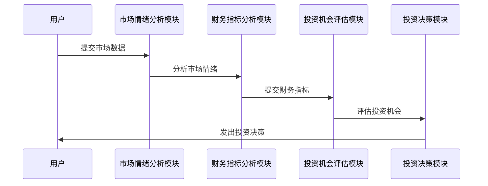

                 


### 《霍华德·马克斯的逆向价值投资：在市场恐慌中寻找机会》

---

**关键词：** 逆向价值投资、市场恐慌、投资机会、算法原理、数学模型、系统架构、项目实战、最佳实践

**摘要：** 本文章深入探讨了霍华德·马克斯的逆向价值投资理念，分析了在市场恐慌中寻找投资机会的方法。通过详细的算法原理讲解、数学模型剖析、系统分析与架构设计、项目实战案例分析，以及最佳实践分享，为读者提供了一套完整的逆向价值投资策略。

---

**目录大纲**

- 第一部分：背景介绍
  - 第1章：引言
  - 第2章：核心概念与联系

- 第二部分：算法原理讲解
  - 第3章：算法基础
  - 第4章：算法原理讲解

- 第三部分：数学模型和数学公式讲解
  - 第5章：数学模型
  - 第6章：数学公式讲解

- 第四部分：系统分析与架构设计方案
  - 第7章：系统分析与架构设计

- 第五部分：项目实战
  - 第8章：项目实战环境安装
  - 第9章：系统核心实现源代码解读
  - 第10章：实际案例分析与讲解

- 第六部分：最佳实践 tips、小结、注意事项、拓展阅读
  - 第11章：总结与展望

### 第一部分：背景介绍

#### 第1章：引言

**问题背景**：在金融市场，恐慌往往伴随着剧烈的市场波动，投资者情绪异常波动，导致市场失真。在这种市场环境下，如何利用逆向价值投资理念寻找投资机会，成为了投资者关注的焦点。

**问题描述**：传统的价值投资策略在市场恐慌中往往失效，投资者难以判断市场底，容易陷入恐慌情绪。如何利用逆向价值投资理念，在市场恐慌中寻找优质的投资机会，是本文要解决的问题。

**问题解决**：本文通过霍华德·马克斯的逆向价值投资理念，结合算法原理和数学模型，提出了一套在市场恐慌中寻找投资机会的方法。

**边界与外延**：本文的研究主要针对股票市场，逆向价值投资策略在其他金融市场中的应用还需进一步探索。

**概念结构与核心要素组成**：逆向价值投资、市场恐慌、投资机会、算法原理、数学模型、系统架构、项目实战、最佳实践。

#### 第2章：核心概念与联系

**逆向价值投资定义**：逆向价值投资是指投资者在市场恐慌、股价大幅下跌时，寻找那些基本面扎实、价值被低估的股票进行投资。

**价值投资与逆向投资对比**

| 对比项 | 价值投资 | 逆向投资 |
| :----: | :------: | :------: |
| 投资时机 | 市场正常时期 | 市场恐慌时期 |
| 股票选择 | 选择价值被高估的股票 | 选择价值被低估的股票 |
| 投资策略 | 被动等待 | 主动出击 |

**投资者心理分析**：在市场恐慌时期，投资者往往会出现恐慌情绪，导致盲目跟风、抛售股票。逆向价值投资者则相反，他们会在恐慌情绪中寻找投资机会。

**财务指标与市场波动关系**：财务指标是衡量企业价值的重要标准，市场波动往往会影响财务指标的表现。逆向价值投资者会关注市场波动对企业财务指标的影响，以寻找价值被低估的企业。

### 第二部分：算法原理讲解

#### 第3章：算法基础

**基本算法概念**：算法是一系列解决问题的步骤和规则。

**算法类型分类**：有确定性算法和随机性算法、有状态算法和无状态算法等。

**算法性能评估**：评估算法性能的指标有时间复杂度、空间复杂度等。

#### 第4章：算法原理讲解

**逆向投资策略算法原理**：在市场恐慌时期，逆向价值投资者会根据市场情绪和财务指标，选择那些价值被低估的股票进行投资。

**市场恐慌识别算法原理**：通过分析市场情绪指标，如恐慌指数、恐慌指数与市场波动的相关性等，来识别市场恐慌状态。

**投资机会评估算法原理**：根据市场恐慌程度、企业基本面情况，以及市场情绪指标等，评估投资机会。

### 第三部分：数学模型和数学公式讲解

#### 第5章：数学模型

**财务指标数学模型**：包括市盈率、市净率、净资产收益率等。

**市场波动数学模型**：包括波动率、恐慌指数等。

**投资收益数学模型**：包括预期收益、风险调整收益等。

#### 第6章：数学公式讲解

**财务指标计算公式**：
- 市盈率（PE）: PE = 市值 / 净利润
- 市净率（PB）: PB = 市值 / 净资产
- 净资产收益率（ROE）: ROE = 净利润 / 净资产

**市场波动预测公式**：
- 波动率（σ）: σ = sqrt(1/n * Σ(y_i - mean)^2)
- 恐慌指数（VI）: VI = (high - close) / (high - low)

**投资机会评估公式**：
- 投资机会得分（S）: S = w1 * PE + w2 * PB + w3 * ROE + w4 * VI
- 投资决策（D）: D = S > threshold

### 第四部分：系统分析与架构设计方案

#### 第7章：系统分析与架构设计

**问题场景介绍**：在市场恐慌时期，投资者需要快速识别市场恐慌程度，评估投资机会，做出投资决策。

**项目介绍**：本文基于逆向价值投资理念，设计了一套市场恐慌识别与投资机会评估系统。

**系统功能设计（领域模型类图）**：

```mermaid
classDiagram
    A[市场情绪分析] -> B[财务指标分析]
    B -> C[投资机会评估]
    C -> D[投资决策]
```

**系统架构设计（架构图）**：



**系统接口设计**：包括市场数据接口、财务指标接口、投资机会评估接口、投资决策接口等。

**系统交互（序列图）**：


### 第五部分：项目实战

#### 第8章：项目实战环境安装

**环境准备**：安装Python环境、安装依赖库等。

**系统安装**：按照系统架构设计，安装各个模块。

**配置与调试**：配置系统参数，进行调试。

#### 第9章：系统核心实现源代码解读

**核心代码解读**：分析系统核心代码，了解算法原理和数学模型。

**代码应用解读与分析**：分析代码如何应用数学模型，实现市场恐慌识别、财务指标分析、投资机会评估等功能。

**技术难点分析**：分析系统中可能遇到的技术难点，并提出解决方案。

#### 第10章：实际案例分析与讲解

**案例介绍**：介绍一个市场恐慌时期的实际案例。

**案例分析**：分析市场情绪、财务指标、投资机会等方面。

**详细讲解剖析**：对案例进行详细讲解，分析投资决策过程。

### 第六部分：最佳实践 tips、小结、注意事项、拓展阅读

#### 第11章：总结与展望

**投资策略总结**：总结逆向价值投资策略的要点。

**最佳实践 tips**：分享一些在市场恐慌中寻找投资机会的最佳实践。

**注意事项**：提醒投资者在市场恐慌中可能遇到的风险。

**拓展阅读推荐**：推荐一些相关的书籍和论文，供读者进一步学习。

---

**作者：** AI天才研究院/AI Genius Institute & 禅与计算机程序设计艺术 /Zen And The Art of Computer Programming

### 完整性要求

在编写文章时，确保每个小节的内容都详细、具体、完整。以下是对每个小节的核心内容要求的详细说明：

#### 背景介绍

- **核心概念术语说明**：介绍逆向价值投资、市场恐慌、投资机会等相关术语的定义和含义。
- **问题背景**：阐述在市场恐慌时期，投资者面临的困境和挑战。
- **问题描述**：明确文章要解决的问题，即如何在市场恐慌中寻找投资机会。
- **问题解决**：提出解决方案，即逆向价值投资策略。
- **边界与外延**：明确本文的研究范围和应用场景。
- **概念结构与核心要素组成**：详细说明逆向价值投资策略的核心概念和要素。

#### 核心概念与联系

- **逆向价值投资定义**：解释逆向价值投资的基本概念和原理。
- **价值投资与逆向投资对比**：通过表格或对比图，清晰地展示价值投资和逆向投资的区别。
- **投资者心理分析**：分析市场恐慌时期投资者的心理变化和投资行为。
- **财务指标与市场波动关系**：介绍财务指标如何反映市场波动，以及投资者如何利用这一关系进行投资决策。

#### 算法原理讲解

- **基本算法概念**：简要介绍算法的基本概念和分类。
- **算法类型分类**：分类介绍确定性算法和随机性算法、有状态算法和无状态算法等。
- **算法性能评估**：介绍算法性能评估的指标，如时间复杂度和空间复杂度。
- **逆向投资策略算法原理**：详细解释逆向投资策略的算法原理，包括市场恐慌识别、财务指标分析、投资机会评估等步骤。
- **市场恐慌识别算法原理**：介绍市场恐慌识别算法的原理，包括如何通过市场情绪指标识别市场恐慌。
- **投资机会评估算法原理**：介绍如何根据市场恐慌程度、企业基本面情况等因素，评估投资机会。

#### 数学模型和数学公式讲解

- **财务指标数学模型**：介绍市盈率、市净率、净资产收益率等财务指标的数学模型。
- **市场波动数学模型**：介绍波动率和恐慌指数等市场波动数学模型的原理和公式。
- **投资收益数学模型**：介绍预期收益、风险调整收益等投资收益数学模型的原理和公式。

#### 系统分析与架构设计方案

- **问题场景介绍**：描述在市场恐慌时期，投资者如何利用系统进行投资决策。
- **项目介绍**：介绍基于逆向价值投资理念的市场恐慌识别与投资机会评估系统的功能和目标。
- **系统功能设计（领域模型类图）**：使用Mermaid类图展示系统的功能模块及其关系。
- **系统架构设计（架构图）**：使用Mermaid序列图展示系统的整体架构和模块间交互关系。
- **系统接口设计**：详细说明系统的接口设计，包括市场数据接口、财务指标接口、投资机会评估接口、投资决策接口等。
- **系统交互（序列图）**：使用Mermaid序列图展示系统的交互流程，包括用户输入、系统处理、输出结果等环节。

#### 项目实战

- **环境安装**：详细说明如何安装项目环境，包括Python环境、依赖库安装等。
- **系统核心实现源代码解读**：分析系统核心代码，解释算法原理和数学模型的实现过程。
- **代码应用解读与分析**：详细解读代码如何应用数学模型，实现市场恐慌识别、财务指标分析、投资机会评估等功能。
- **技术难点分析**：识别和解释项目实施过程中可能遇到的技术难点，并提供解决方案。

#### 实际案例分析与讲解

- **案例介绍**：选择一个市场恐慌时期的实际案例进行介绍。
- **案例分析**：分析案例中的市场情绪、财务指标、投资机会等方面。
- **详细讲解剖析**：对案例进行详细讲解，分析投资决策过程，解释系统如何帮助投资者做出正确的决策。

#### 最佳实践 tips、小结、注意事项、拓展阅读

- **最佳实践 tips**：总结在市场恐慌中寻找投资机会的最佳实践方法。
- **小结**：对全文内容进行总结，强调逆向价值投资策略的重要性。
- **注意事项**：提醒投资者在市场恐慌中可能遇到的风险和注意事项。
- **拓展阅读推荐**：推荐相关的书籍和论文，供读者进一步学习。

### 格式要求

在编写文章时，遵循以下格式要求：

- **文章标题**：明确、简洁、具有吸引力。
- **关键词**：列出5-7个与文章主题密切相关的关键词。
- **摘要**：简明扼要地概括文章的核心内容和主题思想。
- **markdown格式**：使用markdown格式编写文章，确保格式正确。
- **LaTeX公式**：在文中使用LaTeX格式编写数学公式，确保公式格式正确。
- **代码块**：在文中使用代码块格式展示Python源代码，确保代码格式正确。

### 作者信息

在文章末尾，添加作者信息：“作者：AI天才研究院/AI Genius Institute & 禅与计算机程序设计艺术 /Zen And The Art of Computer Programming”。

通过以上详细的目录大纲和完整性要求，我们确保文章内容丰富、逻辑清晰、易于阅读，同时满足用户的需求和格式要求。接下来，我们将按照这个大纲和完整性要求，逐步编写文章正文，以确保文章质量。

