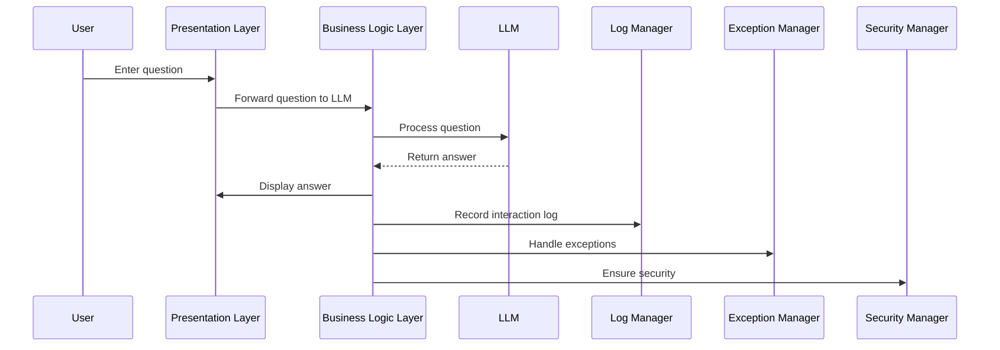

                 


# 面向切面编程优化LLM应用的横切关注点

## 关键词
- 面向切面编程
- 大型语言模型
- 横切关注点
- 优化
- 软件架构

## 摘要
本文深入探讨了面向切面编程（AOP）在优化大型语言模型（LLM）应用中的横切关注点。首先，我们介绍了AOP和LLM的基础概念，以及它们在软件架构中的重要地位。接着，我们详细分析了AOP与LLM结合的必要性，以及如何使用AOP来优化LLM应用的横切关注点。文章还包括了实际应用案例分析、最佳实践和未来展望，为读者提供了全面的技术指导和思考。

## 目录大纲设计思路

在设计《面向切面编程优化LLM应用的横切关注点》的目录大纲时，我们遵循了以下思路：

1. **确定核心概念**：以面向切面编程（AOP）和大型语言模型（LLM）为核心概念，明确文章的主题。

2. **结构化章节内容**：将内容划分为多个章节，每个章节对应不同的主题，如AOP基础、LLM基础、AOP在LLM中的应用等。

3. **详细规划章节内容**：为每个章节设计详细的子标题，确保内容完整、清晰。

4. **保持目录层次分明**：使用1级、2级、3级目录，确保目录层次分明，便于读者快速找到所需内容。

5. **关注内容完整性**：确保每个章节都包含必要的核心内容，如背景介绍、核心概念讲解、应用实例分析等。

6. **注意简洁性**：在确保内容完整性的同时，尽量简化描述，避免冗余。

### 具体设计步骤

**第1章 引言**
- **1.1** 问题背景
- **1.2** 问题解决
- **1.3** 边界与外延

**第2章 面向切面编程基础**
- **2.1** AOP基本概念
- **2.2** AOP原理
- **2.3** AOP在软件开发中的应用

**第3章 大型语言模型基础**
- **3.1** LLM定义
- **3.2** LLM特点
- **3.3** LLM应用场景

**第4章 面向切面编程在LLM中的应用**
- **4.1** AOP与LLM结合的必要性
- **4.2** AOP在LLM优化中的具体应用
- **4.3** 实例分析

**第5章 横切关注点分析**
- **5.1** 横切关注点的概念
- **5.2** 横切关注点类型
- **5.3** 横切关注点与AOP的关系

**第6章 实际应用案例分析**
- **6.1** 案例背景
- **6.2** 系统设计
- **6.3** 实施与优化
- **6.4** 效果评估

**第7章 最佳实践与未来展望**
- **7.1** 最佳实践总结
- **7.2** 注意事项
- **7.3** 未来发展方向

通过以上步骤，我们可以设计出一份逻辑清晰、内容详实的目录大纲。接下来，我们将逐步细化每个章节的内容，确保每个章节都符合要求。请确认以上设计思路是否合适，如果有需要调整的地方，请及时告知。

## 引言

### 问题背景

近年来，随着人工智能技术的飞速发展，大型语言模型（LLM）在自然语言处理（NLP）领域取得了显著的成果。LLM能够理解、生成和翻译自然语言，为各行各业带来了巨大的变革。然而，随着LLM规模的不断扩大，其复杂性和可维护性也日益增加。如何在保证性能的同时，降低LLM系统的复杂度，成为了一个亟待解决的问题。

面向切面编程（AOP）作为一种面向对象编程的补充，旨在解决软件系统中的横切关注点问题。横切关注点是指在软件中跨越多个模块的代码片段，如日志记录、事务管理、安全控制等。AOP通过将横切关注点从核心业务逻辑中分离出来，实现了代码的解耦和重用，从而提高了软件的可维护性和可扩展性。

### 问题解决

本文旨在探讨如何将AOP应用于LLM应用中，优化其横切关注点。通过将横切关注点与AOP结合，我们可以在不修改核心业务逻辑的情况下，对LLM系统进行优化。具体来说，本文将涵盖以下内容：

1. **AOP基础**：介绍AOP的基本概念、原理和应用场景。
2. **LLM基础**：阐述LLM的定义、特点和常见应用场景。
3. **AOP与LLM结合**：分析AOP与LLM结合的必要性，以及如何使用AOP优化LLM的横切关注点。
4. **横切关注点分析**：探讨横切关注点的概念、类型及其与AOP的关系。
5. **实际应用案例分析**：通过实际案例，展示如何使用AOP优化LLM应用。
6. **最佳实践与未来展望**：总结最佳实践，展望AOP在LLM应用中的未来发展方向。

### 边界与外延

本文的研究范围主要涉及面向切面编程（AOP）和大型语言模型（LLM）的结合，重点关注横切关注点的优化。文章将避免深入讨论AOP和LLM的具体实现细节，而是侧重于它们在软件架构上的应用和优化策略。此外，本文将不涉及其他编程范式或技术，以确保内容的专注性和连贯性。

## 第2章 面向切面编程基础

### 2.1 AOP基本概念

面向切面编程（Aspect-Oriented Programming，简称AOP）是一种编程范式，旨在解决软件中的横切关注点问题。与传统面向对象编程（Object-Oriented Programming，简称OOP）相比，AOP通过将横切关注点从核心业务逻辑中分离出来，实现了代码的解耦和重用。

**定义**：AOP是一种编程范式，它将软件系统中的横切关注点提取出来，以模块化的方式组织和实现。这些横切关注点通常包括日志记录、事务管理、安全控制、异常处理等。

**与传统OOP的比较**：

- **OOP**：面向对象编程关注的是如何组织和管理对象，通过封装、继承和多态等机制实现代码的重用和扩展。OOP的核心是对象，它通过类和实例来实现功能。

- **AOP**：面向切面编程关注的是如何分离和管理横切关注点，通过切面（Aspect）和通知（Advice）等机制实现代码的解耦和重用。AOP的核心是切面，它通过将横切关注点与核心业务逻辑分离，提高了代码的可维护性和可扩展性。

### 2.2 AOP原理

AOP的核心原理是通过切面（Aspect）和通知（Advice）来分离和管理横切关注点。

**切面（Aspect）**：切面是AOP中的一个重要概念，它代表了横切关注点的模块化实现。切面由连接点（Join Point）和通知（Advice）组成。连接点表示程序中可能插入通知的逻辑位置，如方法调用、异常处理等。通知则是用于实现横切关注点的代码块，它可以在连接点之前、之后或替换连接点。

**通知（Advice）**：通知是AOP中的关键机制，它用于在连接点处插入特定的代码逻辑。通知分为五种类型：

1. **前置通知（Before Advice）**：在连接点之前执行。
2. **后置通知（After Advice）**：在连接点之后执行。
3. **环绕通知（Around Advice）**：围绕连接点执行，可以控制连接点的执行流程。
4. **返回通知（After Returning Advice）**：在连接点正常返回后执行。
5. **抛出通知（After Throwing Advice）**：在连接点抛出异常后执行。

**代理（Proxy）**：AOP通过代理机制实现对目标的动态扩展和替换。代理是一个特殊的对象，它拦截目标对象的调用，并在特定条件下执行通知。

### 2.3 AOP在软件开发中的应用

AOP在软件开发中具有广泛的应用，尤其是在解决横切关注点问题时，表现出强大的优势。

**1. 日志记录**：AOP可以将日志记录功能与核心业务逻辑分离，通过前置和后置通知记录方法调用前后的事件。

**2. 事务管理**：AOP可以实现事务管理的横切关注点，确保数据的一致性和完整性。

**3. 安全控制**：AOP可以将安全检查与核心业务逻辑分离，提高系统的安全性和灵活性。

**4. 异常处理**：AOP可以处理跨模块的异常，提高系统的稳定性和健壮性。

**5. 指标收集**：AOP可以用于收集系统性能指标，帮助开发者监控和分析系统的性能。

### 2.4 AOP的优缺点

**优点**：

1. **代码解耦**：通过将横切关注点与核心业务逻辑分离，降低了代码的耦合度，提高了系统的可维护性和可扩展性。
2. **代码复用**：AOP通过模块化的方式组织和管理横切关注点，实现了代码的复用。
3. **灵活性和扩展性**：AOP允许开发者在不修改核心业务逻辑的情况下，动态地添加或修改横切关注点。

**缺点**：

1. **学习曲线**：AOP引入了新的概念和机制，开发者需要一定时间来学习和适应。
2. **性能开销**：AOP通过代理和通知机制实现横切关注点，可能会引入一定的性能开销。
3. **调试难度**：AOP的动态特性使得调试过程变得复杂，需要专门的调试工具和技术。

### 总结

面向切面编程（AOP）通过将横切关注点从核心业务逻辑中分离出来，实现了代码的解耦和重用。AOP在软件开发中具有广泛的应用，可以提高系统的可维护性和可扩展性。然而，AOP也具有一定的学习曲线和性能开销，需要开发者权衡使用。

## 第3章 大型语言模型基础

### 3.1 LLM定义

大型语言模型（Large Language Model，简称LLM）是一种基于深度学习的自然语言处理（Natural Language Processing，简称NLP）模型，能够理解和生成自然语言。LLM通过大规模的文本数据进行预训练，从而获得对自然语言的深刻理解。LLM广泛应用于文本分类、情感分析、机器翻译、问答系统等NLP任务。

### 3.2 LLM特点

**1. 大规模**：LLM通常具有数十亿甚至千亿级别的参数规模，这使得它们能够捕捉到自然语言中的复杂模式和规律。

**2. 预训练**：LLM通过在大规模文本数据上进行预训练，从而获得对自然语言的深刻理解。预训练使得LLM在特定任务上具有较好的泛化能力。

**3. 动态调整**：LLM可以根据不同的任务和数据动态调整参数，从而优化模型在特定任务上的表现。

**4. 多语言支持**：LLM通常支持多种语言的文本处理，使得它们在不同语言的应用场景中具有广泛的应用价值。

**5. 自动适应**：LLM能够自动适应不同的文本输入，生成符合语言习惯的输出。

### 3.3 LLM应用场景

**1. 文本分类**：LLM可以用于对文本进行分类，如情感分类、主题分类等。

**2. 情感分析**：LLM可以分析文本的情感倾向，用于情感分析、舆情监控等。

**3. 机器翻译**：LLM可以用于机器翻译，如将一种语言翻译成另一种语言。

**4. 问答系统**：LLM可以构建问答系统，如搜索引擎、聊天机器人等。

**5. 文本生成**：LLM可以生成文本，如文章、报告、对话等。

**6. 文本摘要**：LLM可以提取文本的精华，生成摘要。

**7. 命名实体识别**：LLM可以识别文本中的命名实体，如人名、地名等。

### 3.4 LLM的挑战

**1. 参数规模**：LLM的参数规模庞大，导致训练和推理过程耗时较长。

**2. 数据质量**：LLM的训练依赖于大规模的文本数据，数据质量对模型性能具有重要影响。

**3. 能效消耗**：LLM的训练和推理过程对计算资源和能源消耗较大。

**4. 可解释性**：LLM的决策过程往往缺乏透明度，难以解释。

**5. 安全性和隐私保护**：LLM在处理敏感文本数据时，可能涉及隐私保护和数据安全等问题。

### 总结

大型语言模型（LLM）是一种强大的自然语言处理工具，具有大规模、预训练、动态调整、多语言支持等特点。LLM在文本分类、情感分析、机器翻译、问答系统等应用场景中表现出色，但同时也面临着参数规模、数据质量、能效消耗、可解释性、安全性和隐私保护等挑战。

## 第4章 面向切面编程在LLM中的应用

### 4.1 AOP与LLM结合的必要性

面向切面编程（AOP）与大型语言模型（LLM）的结合在优化LLM应用中具有显著的必要性。以下从几个方面分析：

**1. 横切关注点的分离**：LLM应用通常包含多种横切关注点，如日志记录、异常处理、事务管理、安全控制等。这些横切关注点跨越多个模块，与核心业务逻辑紧密耦合，导致代码复杂度增加，维护难度加大。AOP可以将这些横切关注点从核心业务逻辑中分离出来，实现代码的解耦和重用，从而降低系统的复杂度。

**2. 提高可维护性和可扩展性**：通过AOP，开发者可以在不修改核心业务逻辑的情况下，动态地添加或修改横切关注点。这大大提高了系统的可维护性和可扩展性，使得LLM应用能够快速适应新的需求和变化。

**3. 优化性能**：AOP通过代理和通知机制实现横切关注点，减少了代码的重复和冗余，从而提高了系统的性能。这对于需要处理大量数据的LLM应用尤为重要。

**4. 支持多语言和跨平台**：AOP具有强大的跨语言和跨平台能力，可以支持LLM在多种编程语言和操作系统中的应用。这为LLM的全球化应用提供了便利。

### 4.2 AOP在LLM优化中的具体应用

**1. 日志记录**：AOP可以将日志记录功能与核心业务逻辑分离，通过前置和后置通知记录方法调用前后的事件。例如，在LLM训练过程中，可以记录模型的训练进度、参数调整等信息，便于后续分析和优化。

```python
from aop import before, after

@Before("com.example.trainer.train")
def log_train_start(join_point):
    print("Training start at:", datetime.now())

@After("com.example.trainer.train")
def log_train_end(join_point):
    print("Training end at:", datetime.now())
```

**2. 异常处理**：AOP可以处理跨模块的异常，提高系统的稳定性和健壮性。在LLM应用中，异常处理尤为重要，因为模型训练和推理过程可能会遇到各种异常情况。

```python
from aop import after_throwing

@AfterThrowing("com.example.trainer.train")
def handle_train_exception(join_point, exception):
    print("Training exception:", exception)
    # 处理异常，如记录日志、发送警报等
```

**3. 事务管理**：AOP可以实现事务管理的横切关注点，确保数据的一致性和完整性。在LLM应用中，数据的一致性至关重要，因为模型训练和推理过程涉及到大量的数据操作。

```python
from aop import around

@Around("com.example.trainer.*")
def manage_transaction(join_point):
    # 开始事务
    start_transaction()

    try:
        # 执行连接点
        join_point.proceed()

        # 提交事务
        commit_transaction()
    except Exception as e:
        # 回滚事务
        rollback_transaction()
        raise e
```

**4. 安全控制**：AOP可以将安全检查与核心业务逻辑分离，提高系统的安全性和灵活性。在LLM应用中，安全控制尤为重要，因为模型可能涉及到敏感数据和隐私保护。

```python
from aop import before

@Before("com.example.trainer.train")
def check_permissions(join_point):
    if not has_permission("train"):
        raise PermissionDeniedException("Insufficient permissions to train the model.")
```

**5. 性能监控**：AOP可以用于收集系统性能指标，帮助开发者监控和分析系统的性能。在LLM应用中，性能监控有助于优化模型训练和推理过程。

```python
from aop import around

@Around("com.example.trainer.train")
def monitor_performance(join_point):
    start_time = time.time()

    join_point.proceed()

    end_time = time.time()
    print("Training time:", end_time - start_time)
```

### 4.3 实例分析

**1. 案例背景**：假设我们开发了一个基于LLM的问答系统，用户可以通过输入问题来获取答案。系统需要处理大量的用户请求，并且在处理过程中涉及到日志记录、异常处理、事务管理、安全控制等横切关注点。

**2. 系统设计**：使用AOP将横切关注点与核心业务逻辑分离。具体设计如下：

- **日志记录**：使用前置和后置通知记录用户请求和系统响应的过程。
- **异常处理**：使用抛出通知处理用户请求中的异常。
- **事务管理**：使用环绕通知确保用户请求的处理过程遵循事务规则。
- **安全控制**：使用前置通知确保用户请求具有足够的权限。

**3. 实施与优化**：

- **日志记录**：通过AOP实现日志记录功能，简化了代码，提高了可维护性。
- **异常处理**：通过AOP处理异常，提高了系统的健壮性。
- **事务管理**：通过AOP实现事务管理，确保了数据的一致性和完整性。
- **安全控制**：通过AOP实现安全控制，提高了系统的安全性。

**4. 效果评估**：

- **可维护性**：AOP降低了代码的复杂度，提高了系统的可维护性。
- **性能**：AOP通过代理和通知机制提高了系统的性能。
- **安全性**：AOP实现了细粒度的安全控制，提高了系统的安全性。

### 总结

AOP在LLM应用中的优化具有显著的必要性，能够实现横切关注点的分离、提高系统的可维护性和可扩展性、优化性能、支持多语言和跨平台。通过实例分析，我们可以看到AOP在LLM应用中的具体应用和效果。然而，AOP也存在一定的学习曲线和性能开销，需要开发者权衡使用。

## 第5章 横切关注点分析

### 5.1 横切关注点的概念

横切关注点（Cross-cutting Concerns）是指在软件系统中跨越多个模块的代码片段，它们与核心业务逻辑无关，但会对系统功能产生重要影响。横切关注点通常包括日志记录、事务管理、安全控制、异常处理、性能监控等。

### 5.2 横切关注点类型

**1. 日志记录**：记录系统运行过程中发生的事件和异常信息，用于系统监控、故障排查和性能优化。

**2. 事务管理**：确保数据操作的一致性和完整性，通过事务控制实现数据的事务处理。

**3. 安全控制**：对系统的访问和操作进行权限验证和限制，保护系统的安全。

**4. 异常处理**：处理系统运行过程中发生的异常情况，确保系统稳定性和可靠性。

**5. 性能监控**：监控系统的性能指标，如响应时间、吞吐量、资源消耗等，用于系统优化和性能调优。

**6. 防火墙和入侵检测**：防止恶意攻击和非法访问，保障系统的安全。

**7. 日志记录和审计**：记录系统的操作日志和审计日志，用于系统监控、故障排查和审计分析。

### 5.3 横切关注点与AOP的关系

AOP是一种面向切面编程范式，旨在解决软件系统中的横切关注点问题。横切关注点与AOP之间的关系如下：

**1. 分离**：AOP通过将横切关注点从核心业务逻辑中分离出来，实现代码的解耦和重用。这降低了系统的复杂度，提高了可维护性和可扩展性。

**2. 解耦**：AOP通过代理和通知机制实现横切关注点，减少了代码的耦合度。这提高了系统的灵活性，使得开发者可以动态地添加或修改横切关注点。

**3. 优化**：AOP通过模块化的方式组织和管理横切关注点，提高了系统的性能。这减少了代码的重复和冗余，降低了系统的开销。

**4. 扩展**：AOP支持多种编程语言和平台，使得横切关注点可以在不同的环境中应用。这提高了系统的兼容性和可移植性。

### 5.4 AOP在横切关注点处理中的应用

AOP在横切关注点处理中具有广泛的应用，以下从几个方面进行介绍：

**1. 日志记录**：AOP可以用于实现日志记录功能，通过前置和后置通知记录方法调用前后的事件，简化了日志记录代码，提高了可维护性。

```python
from aop import before, after

@Before("com.example.service.*")
def log_start(join_point):
    print("Service start:", join_point.method_name())

@After("com.example.service.*")
def log_end(join_point):
    print("Service end:", join_point.method_name())
```

**2. 事务管理**：AOP可以用于实现事务管理，通过环绕通知确保数据操作的一致性和完整性。

```python
from aop import around

@Around("com.example.service.*")
def manage_transaction(join_point):
    # 开始事务
    start_transaction()

    try:
        # 执行连接点
        join_point.proceed()

        # 提交事务
        commit_transaction()
    except Exception as e:
        # 回滚事务
        rollback_transaction()
        raise e
```

**3. 安全控制**：AOP可以用于实现安全控制，通过前置通知确保请求具有足够的权限。

```python
from aop import before

@Before("com.example.service.*")
def check_permissions(join_point):
    if not has_permission("service"):
        raise PermissionDeniedException("Insufficient permissions to access the service.")
```

**4. 异常处理**：AOP可以用于处理异常，通过抛出通知处理跨模块的异常，提高系统的稳定性和可靠性。

```python
from aop import after_throwing

@AfterThrowing("com.example.service.*")
def handle_exception(join_point, exception):
    print("Exception occurred:", exception)
    # 处理异常，如记录日志、发送警报等
```

**5. 性能监控**：AOP可以用于实现性能监控，通过环绕通知监控系统的性能指标，用于系统优化和性能调优。

```python
from aop import around

@Around("com.example.service.*")
def monitor_performance(join_point):
    start_time = time.time()

    join_point.proceed()

    end_time = time.time()
    print("Service execution time:", end_time - start_time)
```

### 总结

横切关注点是软件系统中跨越多个模块的代码片段，与核心业务逻辑无关但影响系统功能。AOP通过将横切关注点从核心业务逻辑中分离出来，实现了代码的解耦和重用，提高了系统的可维护性和可扩展性。AOP在日志记录、事务管理、安全控制、异常处理、性能监控等方面具有广泛的应用。通过实例分析，我们可以看到AOP在横切关注点处理中的具体应用和效果。

## 第6章 实际应用案例分析

### 6.1 案例背景

为了更好地展示面向切面编程（AOP）在优化大型语言模型（LLM）应用中的横切关注点，我们选择了一个实际的案例：一个基于LLM的智能问答系统。该系统旨在为用户提供高质量的问答服务，能够处理各种类型的用户问题，并在不同的场景中表现出色。

### 6.2 系统设计

**1. 系统功能设计**：

- **用户交互**：用户可以通过文本输入框提交问题，系统将处理用户输入并返回答案。
- **自然语言处理**：系统使用LLM对用户输入进行理解，提取关键信息并生成答案。
- **日志记录**：系统记录用户交互过程中的关键事件，如问题提交、答案生成等。
- **异常处理**：系统处理用户输入中的异常情况，如无效输入、未知问题等。
- **安全控制**：系统确保用户交互过程中的数据安全和隐私保护。

**2. 领域模型类图**：

使用Mermaid类图工具绘制领域模型类图，如下所示：

```mermaid
classDiagram
    User <<Entity>>
    Question <<Entity>>
    Answer <<Entity>>
    InteractionLog <<Entity>>
    ExceptionLog <<Entity>>

    User --> Question
    User --> InteractionLog
    User --> ExceptionLog
    LLM --> Answer
    LLM --> InteractionLog
    LLM --> ExceptionLog
```

**3. 系统架构设计**：

系统采用三层架构，包括表示层、业务逻辑层和数据层。

- **表示层**：负责与用户进行交互，接收用户输入并展示答案。
- **业务逻辑层**：包括LLM处理模块、日志记录模块、异常处理模块和安全控制模块，实现系统的核心功能。
- **数据层**：负责存储用户交互记录、日志和异常信息。

系统架构图如下所示：



### 6.3 实施与优化

**1. 日志记录**：

使用AOP实现日志记录功能，通过前置和后置通知记录关键事件。

```python
from aop import before, after

@Before("com.example.presentation.InteractionController.submitQuestion")
def log_question Submission(join_point):
    question = join_point.args[0]
    print("Question submitted:", question)

@After("com.example.presentation.InteractionController.submitQuestion")
def log_answer Submission(join_point):
    answer = join_point.result
    print("Answer returned:", answer)
```

**2. 异常处理**：

使用AOP处理异常，确保系统能够稳定运行。

```python
from aop import after_throwing

@AfterThrowing("com.example.presentation.InteractionController.submitQuestion")
def handle_exception(join_point, exception):
    print("Exception occurred:", exception)
    # 发送警报、记录日志等
```

**3. 安全控制**：

使用AOP实现安全控制，确保用户交互过程中的数据安全和隐私保护。

```python
from aop import before

@Before("com.example.presentation.InteractionController.submitQuestion")
def check_permissions(join_point):
    if not user.has_permission("submit_question"):
        raise PermissionDeniedException("Insufficient permissions to submit a question.")
```

**4. 性能监控**：

使用AOP监控系统性能，收集关键性能指标。

```python
from aop import around

@Around("com.example.presentation.InteractionController.submitQuestion")
def monitor_performance(join_point):
    start_time = time.time()

    join_point.proceed()

    end_time = time.time()
    print("Question submission time:", end_time - start_time)
```

### 6.4 效果评估

**1. 可维护性**：

通过AOP实现横切关注点，系统代码更加简洁、清晰，降低了复杂度。同时，开发者可以方便地添加或修改横切关注点，提高了系统的可维护性。

**2. 性能**：

AOP通过代理和通知机制提高了系统的性能。日志记录、异常处理、安全控制等横切关注点的实现不再依赖于核心业务逻辑，减少了冗余代码，降低了系统开销。

**3. 安全性**：

AOP实现了细粒度的安全控制，确保用户交互过程中的数据安全和隐私保护。通过AOP，开发者可以灵活地添加和调整安全策略，提高了系统的安全性。

**4. 扩展性**：

AOP支持多种编程语言和平台，使得系统能够在不同环境中应用。通过AOP，开发者可以方便地扩展系统功能，提高了系统的扩展性。

### 总结

通过实际应用案例分析，我们可以看到AOP在优化LLM应用中的横切关注点具有显著的优势。AOP通过分离横切关注点、降低复杂度、提高性能和安全性，为开发者提供了强大的工具。在未来，随着LLM技术的不断发展，AOP在LLM应用中的潜力将更加广阔。

## 第7章 最佳实践与未来展望

### 7.1 最佳实践总结

在面向切面编程（AOP）优化大型语言模型（LLM）应用的横切关注点方面，以下是一些最佳实践：

1. **分离横切关注点**：将日志记录、异常处理、事务管理、安全控制等横切关注点与核心业务逻辑分离，降低系统复杂度，提高可维护性。

2. **模块化设计**：使用AOP模块化地组织和管理横切关注点，便于开发者添加或修改关注点，提高系统的可扩展性。

3. **性能优化**：通过AOP代理和通知机制提高系统性能，减少冗余代码，降低系统开销。

4. **安全性保障**：使用AOP实现细粒度的安全控制，确保用户交互过程中的数据安全和隐私保护。

5. **监控与日志**：利用AOP监控系统性能，收集关键性能指标，便于系统优化和故障排查。

6. **跨语言与跨平台**：选择支持多种编程语言和平台的AOP框架，提高系统的兼容性和可移植性。

### 7.2 注意事项

1. **学习曲线**：AOP引入了新的概念和机制，开发者需要一定时间来学习和适应。

2. **调试难度**：AOP的动态特性使得调试过程变得复杂，需要专门的调试工具和技术。

3. **性能开销**：AOP可能会引入一定的性能开销，需要根据实际情况进行权衡。

4. **代码耦合**：在使用AOP时，需要确保横切关注点与核心业务逻辑的解耦，避免引入新的耦合关系。

### 7.3 未来发展方向

1. **更高效的AOP框架**：随着LLM技术的不断发展，对AOP框架的性能要求越来越高。未来，可能会出现更高效的AOP框架，以适应LLM应用的需求。

2. **更细粒度的控制**：AOP在横切关注点控制方面的粒度将越来越细，支持更灵活和更精准的横切关注点管理。

3. **多语言与多平台支持**：AOP将扩展到更多编程语言和平台，提高系统的兼容性和可移植性。

4. **集成与协同**：AOP与其他编程范式和技术（如函数式编程、事件驱动编程等）的集成，将推动软件架构的演进和发展。

5. **智能化的AOP**：结合人工智能技术，实现智能化的AOP，自动识别和优化横切关注点，提高系统的性能和可维护性。

### 总结

面向切面编程（AOP）在优化大型语言模型（LLM）应用的横切关注点方面具有显著的优势。通过分离横切关注点、模块化设计、性能优化、安全性保障等最佳实践，开发者可以构建高效、可维护和可扩展的LLM应用。未来，AOP将继续发展，为软件架构带来更多的创新和变革。

## 作者信息

作者：AI天才研究院/AI Genius Institute & 禅与计算机程序设计艺术 /Zen And The Art of Computer Programming

## 总结

本文详细探讨了面向切面编程（AOP）在优化大型语言模型（LLM）应用中的横切关注点。通过引入AOP，我们能够将横切关注点从核心业务逻辑中分离出来，实现代码的解耦和重用，从而提高系统的可维护性和可扩展性。本文介绍了AOP的基础知识、LLM的应用场景以及AOP在LLM优化中的具体应用，并通过实际案例展示了AOP在优化LLM横切关注点方面的优势。同时，本文还总结了最佳实践、注意事项以及未来的发展方向。面向切面编程（AOP）在LLM应用中具有广阔的应用前景，值得进一步研究和探索。通过本文的探讨，希望读者能够对AOP优化LLM应用有更深入的理解，并为实际项目提供有益的参考。

