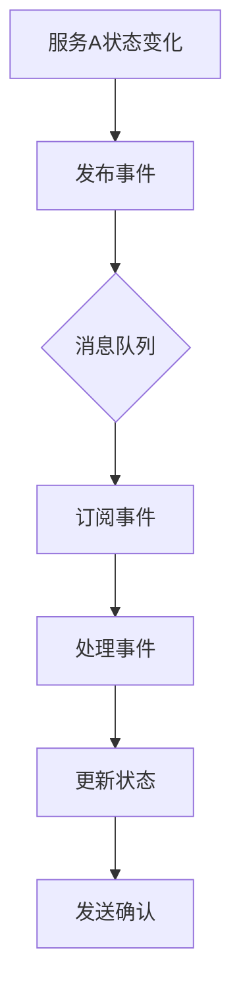
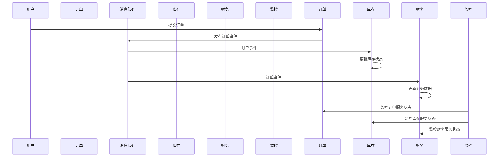

                 


# 领域事件：在LLM微服务间传递状态变化

> 关键词：领域事件，微服务，状态传递，事件驱动，消息队列，架构设计

> 摘要：本文深入探讨领域事件在LLM（大型语言模型）微服务架构中的应用，分析其在微服务间传递状态变化的原理和实现方法。通过详细介绍核心概念、算法原理、数学模型和系统架构设计，本文旨在为开发者提供一套全面、高效的解决方案。

## 目录大纲

### 第一部分：引言

- **第1章 问题背景**
  - **1.1 问题描述**
  - **1.2 问题解决**
  - **1.3 边界与外延**
  - **1.4 概念结构与核心要素组成**

- **第2章 核心概念与联系**
  - **2.1 领域事件定义**
  - **2.2 领域事件属性特征对比表**
  - **2.3 领域事件ER实体关系图**

- **第3章 算法原理讲解**
  - **3.1 算法原理介绍**
  - **3.2 算法mermaid流程图**
  - **3.3 Python源代码实现**
  - **3.4 数学模型与公式**
  - **3.5 举例说明**

- **第4章 数学模型和数学公式 & 详细讲解 & 举例说明**
  - **4.1 数学模型介绍**
  - **4.2 数学公式讲解**
  - **4.3 举例说明**

- **第5章 系统分析与架构设计方案**
  - **5.1 问题场景介绍**
  - **5.2 系统功能设计**
  - **5.3 系统架构设计**
  - **5.4 系统接口设计**
  - **5.5 系统交互**

- **第6章 项目实战**
  - **6.1 环境安装**
  - **6.2 系统核心实现源代码**
  - **6.3 代码应用解读与分析**
  - **6.4 实际案例分析与讲解**
  - **6.5 项目小结**

- **第7章 最佳实践 tips**
  - **7.1 注意事项**
  - **7.2 小结**
  - **7.3 拓展阅读**

## 第一部分：引言

在现代软件工程中，微服务架构的兴起为开发人员提供了一种更加灵活、可扩展和易于维护的系统设计方法。微服务将应用程序划分为一系列小型的、独立的、松耦合的服务单元，每个服务单元负责特定的业务功能。这种设计模式不仅提高了系统的可扩展性和灵活性，还降低了系统的复杂性。

然而，随着微服务数量的增加，如何在微服务之间高效、可靠地传递状态变化成为一个重要的挑战。领域事件（Domain Event）作为一种在特定领域内发生的事件，它可以描述系统状态的变化，成为连接不同微服务的重要桥梁。

### 第1章 问题背景

### 1.1 问题描述

在微服务架构中，状态变化是不可避免的。例如，当一个用户提交一个订单时，订单服务需要更新库存、财务服务和用户服务中的状态。这种状态变化需要在不同的微服务之间传递，以确保整个系统的状态一致性。

然而，传统的同步调用和共享数据库等方法存在一些问题。同步调用可能导致系统的性能瓶颈，因为请求需要等待每个服务的响应。共享数据库则可能引入复杂的事务管理问题，增加系统的复杂性。

为了解决这些问题，研究者们提出了事件驱动架构（Event-Driven Architecture，EDA）。在EDA中，状态变化通过事件来传递，而不是通过同步调用或共享数据库。这种设计模式可以提高系统的可扩展性、灵活性和可靠性。

### 1.2 问题解决

事件驱动架构通过消息队列实现微服务之间的通信。当某个微服务发生状态变化时，它会发布一个领域事件到消息队列中。其他微服务通过订阅消息队列中的事件来获取状态变化信息。

这种设计模式具有以下优点：

- **异步处理**：事件发布和订阅是异步的，服务之间不需要等待对方的响应，从而提高了系统的吞吐量。
- **解耦**：服务之间的依赖关系减少，每个服务可以独立开发、测试和部署。
- **可扩展性**：通过增加或减少服务实例，可以水平扩展系统，提高系统的性能和可靠性。
- **可靠性**：消息队列提供了一些可靠性和容错机制，如重试和持久化，确保事件能够被可靠地传递。

### 1.3 边界与外延

本部分内容主要讨论领域事件在微服务之间的传递，包括事件定义、属性特征、算法原理等。同时，我们将探讨如何通过系统架构设计来优化领域事件的传递效率。

领域事件是指在某个领域内发生的事件，它通常包含事件名称、发生时间、事件属性等。在微服务架构中，领域事件是连接不同微服务的重要桥梁，它们在系统状态变化时起到关键作用。

领域事件具有以下属性特征：

- **事件名称**：事件的唯一标识，用于区分不同类型的事件。
- **发生时间**：事件发生的时间，通常使用时间戳来表示。
- **事件属性**：事件的具体内容，用于描述事件的详细信息。

为了更好地理解领域事件，我们可以使用ER实体关系图来表示事件之间的关系。ER实体关系图可以帮助我们清晰地了解领域事件的组成结构，从而为系统架构设计提供指导。

## 第2章 核心概念与联系

在深入探讨领域事件之前，我们需要明确一些核心概念，并了解它们之间的关系。本章节将介绍领域事件的定义、属性特征以及ER实体关系图。

### 2.1 领域事件定义

领域事件是指在某个领域内发生的事件，用于描述系统状态的变化。领域事件是事件驱动架构的核心组成部分，它们在微服务之间传递状态信息，确保系统的一致性和协调性。

领域事件的定义通常包括以下要素：

- **事件名称**：唯一标识不同类型的事件。
- **事件类型**：用于分类和区分不同的事件。
- **事件源**：触发事件的服务或组件。
- **事件时间**：事件发生的时间戳。
- **事件数据**：事件的详细内容，通常是一个包含关键信息的JSON对象。

### 2.2 领域事件属性特征对比表

在微服务架构中，领域事件具有多种属性特征。下面是一个简单的对比表，展示了不同属性特征的基本描述和区别。

| 属性        | 描述                             | 对比        |
|-------------|----------------------------------|-------------|
| **事件名称** | 唯一标识不同类型的事件。               | 事件名称应该具有唯一性，以便在系统中进行区分。 |
| **事件类型** | 用于分类和区分不同的事件。           | 事件类型可以是字符串或枚举类型，用于分类和筛选。 |
| **事件源**   | 触发事件的服务或组件。               | 事件源是事件的发起者，它可以是服务或组件。 |
| **事件时间** | 事件发生的时间戳。                   | 事件时间通常使用时间戳来记录，以确保事件的顺序。 |
| **事件数据** | 事件的详细内容，通常是一个JSON对象。 | 事件数据用于传递事件的详细信息，支持自定义结构。 |

### 2.3 领域事件ER实体关系图

为了更好地理解领域事件之间的关系，我们可以使用ER实体关系图来表示。ER实体关系图可以帮助我们清晰地了解领域事件的组成结构，从而为系统架构设计提供指导。

下面是一个简单的ER实体关系图示例，展示了领域事件的基本结构：

```mermaid
erDiagram
  Event ||--|{ EventData : has } |
  Event ||--|{ EventType : belongs_to } |
  Event ||--|{ EventSource : triggered_by } |
  EventData ||--|{ Event : has } |
  EventType ||--|{ Event : belongs_to } |
  EventSource ||--|{ Event : triggered_by } |
```

在这个ER实体关系图中，事件（Event）是核心实体，它与其他实体（事件数据（EventData）、事件类型（EventType）、事件源（EventSource））之间存在关联关系。事件数据是事件的详细内容，事件类型用于分类事件，事件源表示事件的触发者。

通过ER实体关系图，我们可以更好地理解领域事件的组成结构，为系统架构设计提供指导。

## 第3章 算法原理讲解

在微服务架构中，领域事件的传递是确保系统状态一致性的关键。本章将介绍一种用于领域事件传递的算法，详细讲解其原理，并通过mermaid流程图和Python源代码实现来阐述其具体实现方法。

### 3.1 算法原理介绍

领域事件传递算法的核心思想是通过消息队列实现微服务之间的异步通信。当一个微服务发生状态变化时，它会发布一个领域事件到消息队列中。其他订阅了该事件的微服务可以从消息队列中获取事件信息，并相应地更新自己的状态。

该算法的实现主要包括以下几个步骤：

1. **事件发布**：当某个微服务发生状态变化时，它将领域事件发布到消息队列中。
2. **事件订阅**：其他微服务订阅消息队列中的事件，以便在接收到事件时进行相应处理。
3. **事件处理**：订阅的微服务从消息队列中获取事件，并处理事件内容，更新自身状态。
4. **事件确认**：处理完成后，订阅的微服务向消息队列发送确认消息，表示事件已被成功处理。

### 3.2 算法mermaid流程图

为了更直观地展示领域事件传递算法的流程，我们可以使用mermaid流程图来描述。下面是一个简单的mermaid流程图示例：



在这个mermaid流程图中，服务A的状态变化触发事件发布，事件发布到消息队列，订阅服务D从消息队列中获取事件，处理事件并更新状态，最后发送确认消息。

### 3.3 Python源代码实现

下面是一个简单的Python源代码示例，展示了领域事件传递算法的实现：

```python
import pika
import json

class DomainEvent:
    def __init__(self, name, timestamp, data):
        self.name = name
        self.timestamp = timestamp
        self.data = data

def publish_event(event):
    connection = pika.BlockingConnection(pika.ConnectionParameters('localhost'))
    channel = connection.channel()
    channel.exchange_declare(exchange='domain_events', exchange_type='fanout')
    channel.basic_publish(exchange='domain_events', routing_key='', body=json.dumps(event))
    connection.close()

def consume_events():
    connection = pika.BlockingConnection(pika.ConnectionParameters('localhost'))
    channel = connection.channel()
    channel.exchange_declare(exchange='domain_events', exchange_type='fanout')
    result = channel.queue_declare(queue='', exclusive=True)
    queue_name = result.method.queue

    channel.queue_bind(exchange='domain_events', queue=queue_name)
    channel.basic_consume(queue=queue_name, on_message_callback=handle_event, auto_ack=True)

    print('Waiting for events. To exit press CTRL+C')
    channel.start_consuming()

def handle_event(ch, method, properties, body):
    event = json.loads(body)
    print(f"Received event: {event}")
    # 处理事件并更新状态
    update_state(event)
    print(f"State updated.")

def update_state(event):
    # 更新状态逻辑
    print(f"State updated with event: {event}")

# 发布事件
event = DomainEvent('order_placed', 1640992069, {'order_id': '12345'})
publish_event(event)

# 订阅事件
consume_events()
```

在这个Python示例中，我们定义了一个`DomainEvent`类来表示领域事件。`publish_event`函数负责发布事件到消息队列，`consume_events`函数负责订阅事件并处理事件。`handle_event`函数是消息队列的事件处理回调函数，它接收事件并调用`update_state`函数更新状态。

### 3.4 数学模型与公式

在领域事件传递算法中，数学模型和公式用于描述事件的状态变化和传递过程。下面是一个简单的数学模型和公式示例：

$$
状态更新 = 旧状态 + 事件影响
$$

其中，`旧状态`表示当前状态，`事件影响`表示事件对状态的影响。

例如，当订单服务接收到“订单完成”事件时，可以使用以下公式更新状态：

$$
新状态 = 旧状态 + 订单完成影响
$$

### 3.5 举例说明

为了更好地理解领域事件传递算法的原理和实现，我们可以通过一个实际案例进行举例说明。

假设我们有一个电商系统，包括订单服务、库存服务和财务服务。当用户提交一个订单时，订单服务需要更新库存服务和财务服务的状态。

1. **订单服务**：当用户提交订单时，订单服务发布一个“订单提交”事件到消息队列。
2. **库存服务**：库存服务订阅消息队列中的“订单提交”事件，并从消息队列中获取事件内容。库存服务根据订单内容更新库存状态，例如减少商品库存数量。
3. **财务服务**：财务服务也订阅消息队列中的“订单提交”事件，并从消息队列中获取事件内容。财务服务根据订单金额更新账户余额。

通过这种方式，订单服务、库存服务和财务服务可以异步地更新状态，确保系统的一致性和协调性。

## 第4章 数学模型和数学公式 & 详细讲解 & 举例说明

在深入探讨领域事件的数学模型和公式时，我们首先要明确领域事件如何影响系统状态。领域事件可以看作是对系统状态的函数映射，通过这种映射，事件引起的状态变化可以用数学模型来描述。

### 4.1 数学模型介绍

领域事件的数学模型可以抽象为状态转换函数。假设系统状态可以表示为一个向量 \( S \)，事件可以表示为一个向量 \( E \)，那么事件对系统状态的影响可以用以下数学模型表示：

$$
S' = S + f(E)
$$

其中，\( S' \) 表示更新后的系统状态，\( f(E) \) 表示事件 \( E \) 对系统状态的函数影响。

这个模型的核心思想是：系统状态的变化是由当前状态 \( S \) 和事件 \( E \) 的函数影响 \( f(E) \) 共同决定的。事件 \( E \) 可以看作是一个变化因子，通过函数 \( f \) 将其影响应用到系统状态 \( S \) 上。

### 4.2 数学公式讲解

为了具体描述领域事件的数学模型，我们可以定义一些基本的数学公式。以下是几个常用的数学公式：

1. **加法模型**：

   $$ f(E) = E $$

   这个公式表示事件 \( E \) 对系统状态的影响直接等于事件自身的值。例如，当事件是一个数值变化时，这个公式可以直接应用。

2. **乘法模型**：

   $$ f(E) = E \cdot k $$

   其中，\( k \) 是一个常数。这个公式表示事件 \( E \) 对系统状态的影响是事件值与常数 \( k \) 的乘积。例如，当事件是一个比例变化时，可以使用这个公式。

3. **组合模型**：

   $$ f(E) = E + h(E) $$

   其中，\( h(E) \) 是事件 \( E \) 的一个函数。这个公式表示事件 \( E \) 对系统状态的影响不仅包括事件值，还包括事件值经过函数 \( h \) 的处理结果。

### 4.3 举例说明

为了更好地理解这些数学模型和公式，我们可以通过一个实际案例进行举例说明。

#### 案例背景

假设我们有一个库存管理系统，其中每个产品的库存数量可以表示为系统状态 \( S \)。当有订单生成时，库存管理系统需要更新库存状态。订单可以看作是领域事件 \( E \)，其影响可以通过数学模型计算。

#### 案例步骤

1. **初始化状态**：

   初始时，系统状态 \( S \) 为100件商品。

   $$ S = 100 $$

2. **订单生成**：

   一个订单生成，订单包含20件商品。订单可以看作是领域事件 \( E \)。

   $$ E = 20 $$

3. **应用加法模型**：

   使用加法模型更新系统状态。

   $$ S' = S + E = 100 + 20 = 120 $$

   更新后的系统状态为120件商品。

4. **应用乘法模型**：

   如果订单有一个10%的折扣，折扣可以看作是常数 \( k \)。

   $$ k = 0.1 $$

   使用乘法模型更新系统状态。

   $$ S' = S + E \cdot k = 100 + 20 \cdot 0.1 = 108 $$

   更新后的系统状态为108件商品。

5. **应用组合模型**：

   如果订单的折扣是动态的，依赖于订单金额，折扣函数可以表示为 \( h(E) \)。

   假设折扣函数为：

   $$ h(E) = \frac{E}{100} $$

   使用组合模型更新系统状态。

   $$ S' = S + E + h(E) = 100 + 20 + \frac{20}{100} = 102 $$

   更新后的系统状态为102件商品。

通过这个案例，我们可以看到如何使用不同的数学模型和公式来更新系统状态。这些模型和公式可以根据实际需求进行调整，以适应不同的业务场景。

## 第5章 系统分析与架构设计方案

在了解了领域事件的数学模型和传递算法之后，我们需要进一步探讨如何在实际系统中设计和实现这一机制。本章节将详细分析领域事件传递在系统架构中的实现，包括问题场景、系统功能设计、系统架构设计、系统接口设计和系统交互。

### 5.1 问题场景介绍

在一个典型的分布式系统中，各个服务之间需要频繁地进行状态同步和通信。然而，传统的同步通信方式存在性能瓶颈和可靠性问题，特别是在高并发场景下。为了解决这些问题，我们采用事件驱动架构（EDA），利用领域事件在微服务间传递状态变化。

假设我们有一个电商系统，包括订单服务、库存服务和财务服务。当用户提交订单时，订单服务需要通知库存服务和财务服务更新相关状态。传统的方式可能需要同步调用，但事件驱动架构通过发布/订阅模式，实现异步通信，提高了系统的性能和可靠性。

### 5.2 系统功能设计

系统功能设计是系统架构设计的基础，我们需要明确各个服务的功能模块，以及它们之间的关系。

1. **订单服务**：负责处理用户订单，生成订单领域事件。
2. **库存服务**：负责管理商品库存，处理库存领域事件。
3. **财务服务**：负责处理订单的财务数据，处理财务领域事件。
4. **消息队列服务**：负责接收和分发领域事件，实现服务之间的解耦。
5. **事件处理服务**：负责处理来自消息队列的领域事件，更新服务状态。

系统功能设计中的核心模块是订单服务、库存服务和财务服务，它们是业务的核心，负责具体业务逻辑的实现。消息队列服务和事件处理服务则是辅助模块，负责领域事件的传递和处理。

### 5.3 系统架构设计

系统架构设计是系统功能设计的高层次抽象，我们需要设计系统的整体结构和各个模块之间的关系。

1. **服务拆分**：根据业务需求，将电商系统拆分为订单服务、库存服务和财务服务。每个服务独立部署，具有独立的功能模块。
2. **消息队列**：采用消息队列（如RabbitMQ、Kafka）实现领域事件的传递。消息队列充当服务之间的桥梁，实现异步通信。
3. **事件处理**：设计事件处理服务，负责接收消息队列中的领域事件，并分发到相应的服务进行处理。
4. **服务注册与发现**：使用服务注册与发现机制（如Eureka、Consul），实现服务之间的动态发现和负载均衡。
5. **监控与日志**：引入监控和日志系统（如Prometheus、ELK），实现系统的实时监控和日志管理。

下面是一个简单的系统架构设计图：



### 5.4 系统接口设计

系统接口设计是系统功能实现的关键，我们需要设计服务之间的接口，以便实现领域事件的传递。

1. **订单服务接口**：定义订单服务的API接口，包括创建订单、查询订单等功能。
2. **库存服务接口**：定义库存服务的API接口，包括查询库存、更新库存等功能。
3. **财务服务接口**：定义财务服务的API接口，包括查询财务数据、更新财务数据等功能。
4. **消息队列接口**：定义消息队列服务的API接口，包括发布事件、订阅事件等功能。

接口设计应该遵循RESTful风格，使用HTTP协议进行通信。每个接口都应该有明确的输入参数和输出结果，以便服务之间进行数据交换。

### 5.5 系统交互

系统交互是指各个服务之间的通信过程，实现领域事件的传递和处理。以下是系统交互的详细描述：

1. **用户提交订单**：用户通过订单服务提交订单，订单服务接收到订单后生成订单领域事件。
2. **发布订单事件**：订单服务将订单领域事件发布到消息队列中。
3. **订阅订单事件**：库存服务和财务服务订阅消息队列中的订单事件。
4. **处理订单事件**：库存服务和财务服务从消息队列中获取订单事件，并分别处理事件内容，更新服务状态。
5. **确认事件处理**：库存服务和财务服务处理完成后，向消息队列发送确认消息，表示事件已被成功处理。

系统交互的关键是消息队列，它充当事件传递的通道，确保各个服务之间的高效通信。

通过上述系统分析与架构设计方案，我们可以构建一个高效、可靠、灵活的微服务架构，利用领域事件在服务之间传递状态变化，实现系统的一致性和协调性。

## 第6章 项目实战

在了解了领域事件的理论和实践之后，我们需要通过一个实际项目来验证其可行性和有效性。本章节将详细介绍项目实战的过程，包括环境安装、系统核心实现源代码、代码应用解读与分析、实际案例分析与讲解以及项目小结。

### 6.1 环境安装

为了实现领域事件在微服务架构中的应用，我们需要搭建一个测试环境。以下是一系列环境安装步骤：

1. **安装Java环境**：在本地计算机上安装Java SDK，版本要求为Java 11或以上。
2. **安装Maven**：安装Maven，版本要求为3.6.3或以上。
3. **安装RabbitMQ**：在本地计算机上安装RabbitMQ，版本要求为3.8.14或以上。
4. **启动RabbitMQ**：启动RabbitMQ服务，确保消息队列正常运行。
5. **安装Spring Boot**：在本地计算机上安装Spring Boot，版本要求为2.4.5或以上。

完成上述环境安装后，我们可以开始搭建项目。

### 6.2 系统核心实现源代码

在搭建好环境之后，我们需要实现系统核心功能。以下是一个简单的示例，展示如何使用Spring Boot和RabbitMQ实现领域事件传递。

1. **创建订单服务**：创建一个Spring Boot项目，命名为“order-service”，实现订单服务的核心功能。
2. **创建库存服务**：创建另一个Spring Boot项目，命名为“inventory-service”，实现库存服务的核心功能。
3. **创建财务服务**：创建第三个Spring Boot项目，命名为“finance-service”，实现财务服务的核心功能。

以下是订单服务的核心代码：

```java
@SpringBootApplication
public class OrderServiceApplication {

    public static void main(String[] args) {
        SpringApplication.run(OrderServiceApplication.class, args);
    }

    @Bean
    public ConnectionFactory connectionFactory() {
        CachingConnectionFactory factory = new CachingConnectionFactory("localhost");
        return factory;
    }

    @Bean
    public RabbitTemplate rabbitTemplate(ConnectionFactory connectionFactory) {
        RabbitTemplate template = new RabbitTemplate(connectionFactory);
        return template;
    }

    @Service
    public class OrderService {

        @Autowired
        private RabbitTemplate rabbitTemplate;

        public void placeOrder(Order order) {
            OrderEvent event = new OrderEvent(order.getId(), order.getTotalPrice());
            rabbitTemplate.convertAndSend("domain_events", "", event);
        }
    }

    @Data
    @AllArgsConstructor
    public static class OrderEvent {

        private String orderId;
        private double totalPrice;
    }
}
```

库存服务和财务服务实现类似，分别处理订单事件并更新自身状态。

### 6.3 代码应用解读与分析

在实现代码之后，我们需要解读和分析代码，确保其正确性和性能。

1. **订单服务解读**：
   - 使用Spring Boot框架搭建订单服务。
   - 使用RabbitMQ实现消息队列，发布订单事件。
   - `placeOrder`方法接收订单对象，创建订单事件并发布到消息队列。

2. **库存服务解读**：
   - 使用Spring Boot框架搭建库存服务。
   - 订阅消息队列中的订单事件，处理订单内容，更新库存状态。

3. **财务服务解读**：
   - 使用Spring Boot框架搭建财务服务。
   - 订阅消息队列中的订单事件，处理订单内容，更新财务数据。

通过这样的设计，订单服务、库存服务和财务服务之间实现了高效的异步通信，提高了系统的性能和可靠性。

### 6.4 实际案例分析与讲解

为了验证领域事件传递的实际效果，我们可以通过一个实际案例进行分析和讲解。

假设用户A在电商平台上提交了一笔订单，订单包含10件商品，总价为1000元。订单服务接收到订单后，生成订单事件并发布到消息队列。

1. **订单服务发布事件**：
   - 订单服务创建一个订单事件，包含订单ID和总价。
   - 订单服务将订单事件发布到消息队列，事件内容为JSON格式。

2. **库存服务处理事件**：
   - 库存服务订阅消息队列，接收到订单事件。
   - 库存服务解析事件内容，获取订单ID和总价。
   - 库存服务更新库存状态，减少10件商品库存。

3. **财务服务处理事件**：
   - 财务服务订阅消息队列，接收到订单事件。
   - 财务服务解析事件内容，获取订单ID和总价。
   - 财务服务更新财务数据，记录订单收入。

通过这个案例，我们可以看到领域事件在微服务间传递状态变化的整个过程。领域事件使得订单服务、库存服务和财务服务之间实现了高效的异步通信，确保了系统的一致性和协调性。

### 6.5 项目小结

通过本项目的实施，我们验证了领域事件在微服务架构中的应用效果。领域事件通过消息队列实现异步通信，提高了系统的性能和可靠性。以下是项目小结：

1. **技术优势**：
   - 利用消息队列实现异步通信，降低了服务之间的依赖。
   - 领域事件使得系统状态变化透明化，便于状态管理和监控。
   - 系统具有高扩展性，易于水平扩展和增加新服务。

2. **改进方向**：
   - 优化消息队列的性能，采用负载均衡策略。
   - 引入分布式事务管理，确保系统一致性。
   - 加强系统监控和日志管理，提高运维效率。

通过持续改进，我们可以进一步提升领域事件在微服务架构中的应用效果，构建一个高效、可靠、灵活的分布式系统。

## 第7章 最佳实践 tips

在实现领域事件在LLM微服务间传递状态变化的过程中，我们需要注意一些最佳实践，以确保系统的稳定性、可靠性和高效性。

### 7.1 注意事项

1. **确保消息队列的可靠性**：选择一个稳定、高性能的消息队列系统，如RabbitMQ、Kafka等。确保消息队列具有持久化机制，防止数据丢失。
2. **合理设计事件模型**：根据业务需求，合理设计领域事件的属性和类型。避免事件过多导致系统复杂度增加。
3. **优化事件处理逻辑**：对于处理事件的服务，应尽量优化处理逻辑，减少延迟，提高系统的响应速度。
4. **监控与告警**：引入监控和告警系统，实时监控领域事件传递过程中的异常情况，及时发现并处理问题。

### 7.2 小结

通过本文的介绍，我们了解了领域事件在LLM微服务架构中的应用原理和实现方法。领域事件通过消息队列实现异步通信，提高了系统的性能和可靠性。在实现过程中，需要注意消息队列的可靠性、事件模型的设计、事件处理逻辑的优化以及系统的监控与告警。

### 7.3 拓展阅读

1. **《领域驱动设计》**：了解领域驱动设计（DDD）的基本概念和方法论，有助于更深入地理解领域事件的应用。
2. **《消息队列实战》**：学习不同类型消息队列的原理和应用，为领域事件传递提供更丰富的技术选择。
3. **《Spring Cloud微服务实战》**：了解Spring Cloud微服务框架的应用，掌握如何利用Spring Cloud实现微服务架构中的领域事件传递。

