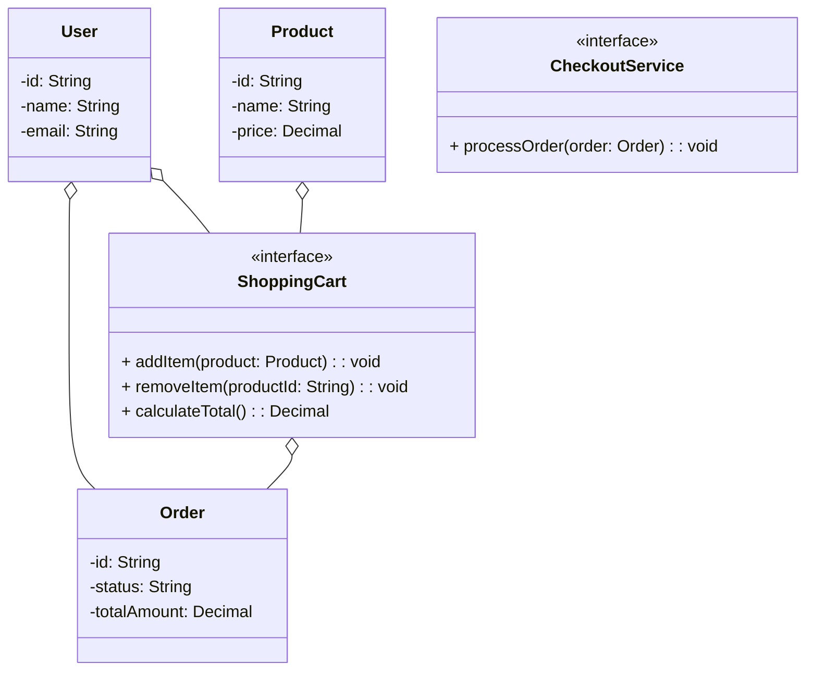
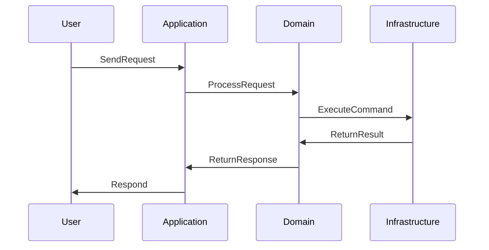
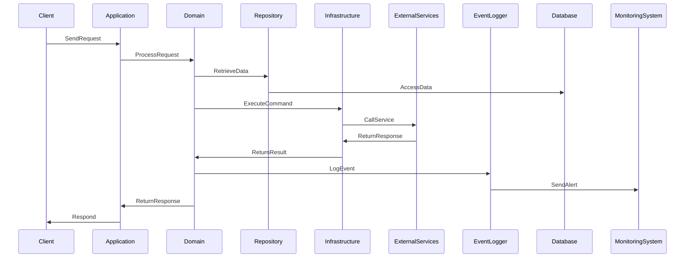

                 

### 第一部分：背景介绍

#### 第1章：领域驱动设计概述

##### 1.1 领域驱动设计的起源与发展

领域驱动设计（Domain-Driven Design，简称DDD）最早由Eric Evans于2004年提出，这是一种面向复杂业务领域的软件开发方法。DDD的核心理念是围绕领域模型来组织软件设计，以解决业务逻辑复杂的问题。通过DDD，开发人员可以更好地理解和建模业务领域，从而创建出更加灵活、可扩展的软件系统。

DDD的起源可以追溯到20世纪90年代，当时软件工程面临的主要挑战是如何应对快速变化的业务需求和复杂的业务规则。传统的软件工程方法往往过于注重技术层面的设计，忽视了业务逻辑的重要性，导致软件难以适应业务的变化。为了解决这个问题，Eric Evans提出了DDD，希望通过一种更加业务导向的设计方法来改进软件开发过程。

自DDD提出以来，它逐渐在软件开发社区中得到广泛的认可和应用。尤其是在复杂业务领域，如金融、保险、电商等，DDD方法展现出了其独特的优势。它不仅帮助开发人员更好地理解业务，还能有效地指导软件开发，提升软件质量。

##### 1.2 领域驱动设计的基本概念

领域驱动设计包含了一系列核心概念，这些概念为软件开发提供了一套完整的思维框架和实施方法。以下是DDD中一些关键概念的定义：

- **领域（Domain）**：领域是业务实体、规则和流程的集合，是DDD的核心关注点。开发人员需要深入理解领域知识，并将其转化为软件模型。

- **领域模型（Domain Model）**：领域模型是描述领域知识的结构化模型，包括实体、值对象、聚合、领域服务、事件等概念。领域模型有助于开发人员理解和组织复杂的业务逻辑。

- **实体（Entity）**：实体是具有唯一标识和持久状态的领域对象，如客户、订单、账户等。实体通常拥有行为和属性。

- **值对象（Value Object）**：值对象是不具有唯一标识的领域对象，如日期、数量、地址等。值对象仅包含数据，不涉及行为。

- **聚合（Aggregate）**：聚合是一个封装了多个实体的逻辑单元，用于定义实体之间的关系。聚合通常有一个根实体，其他实体通过引用根实体来访问。

- **领域服务（Domain Service）**：领域服务是一组操作，用于实现业务逻辑和跨多个聚合的协作。领域服务通常不包含状态，只是提供业务规则和流程的实现。

- **事件（Event）**：事件是领域模型中的重要概念，表示在领域中发生的业务事件，如订单创建、支付成功等。事件通常用于触发领域服务的执行。

##### 1.3 DDD与传统软件开发的比较

传统的软件开发方法，如面向对象设计和过程式编程，往往侧重于技术层面的抽象和实现。而DDD则更加关注业务领域，强调通过领域模型来理解业务逻辑和解决业务问题。

与传统软件开发方法相比，DDD具有以下几个显著区别：

- **业务驱动的开发方式**：DDD将业务领域作为核心关注点，通过领域模型来理解和描述业务逻辑。这有助于开发人员更好地与业务人员沟通，确保软件能够满足业务需求。

- **强化的领域知识管理**：DDD鼓励开发人员深入了解领域知识，并将其嵌入到软件模型中。这种知识管理方式有助于提高软件的可维护性和可扩展性。

- **关注业务场景**：DDD强调在开发过程中关注具体的业务场景，通过场景分析来发现领域模型中的关键元素和关系。这有助于提高软件的实用性和针对性。

- **灵活的架构设计**：DDD采用分层架构和模块化设计，使得软件系统更加灵活和可扩展。这种架构设计有助于应对快速变化的业务需求。

##### 1.4 AI与LLM的发展背景

随着人工智能（AI）和机器学习（ML）技术的飞速发展，越来越多的企业和开发者开始关注如何利用这些技术来优化业务流程和提升用户体验。大型语言模型（Large Language Model，简称LLM）是AI和ML领域的重要成果之一，其在自然语言处理（NLP）任务中展现出了强大的能力。

LLM的发展可以追溯到2018年，当时Google推出了Transformer模型，这标志着NLP领域的一个重要转折点。随后，OpenAI发布了GPT系列模型，如GPT-3，这些模型在文本生成、问答系统、语言翻译等方面取得了显著的成果。LLM的发展不仅推动了NLP技术的进步，也为许多业务领域提供了新的解决方案。

随着LLM的应用越来越广泛，如何优化其业务逻辑成为了一个重要的问题。传统的软件开发方法往往难以应对LLM所带来的复杂业务逻辑，而DDD提供了一种有效的解决方案。通过DDD，开发人员可以更好地理解LLM的业务需求，构建出更加灵活和可扩展的软件系统。

#### 第2章：大型语言模型（LLM）概述

##### 2.1 大型语言模型的基本概念

大型语言模型（Large Language Model，简称LLM）是一种基于深度学习的自然语言处理模型，其核心思想是通过大规模文本数据训练出一个能够理解、生成和模拟人类语言的模型。LLM通常使用神经网络架构，如Transformer或变分自编码器（VAE），并利用大量计算资源和数据来训练。

LLM的基本概念包括：

- **语言模型**：语言模型是一种概率模型，用于预测下一个单词或字符的概率。在自然语言处理中，语言模型用于生成文本、自动纠错、语言翻译等任务。

- **预训练与微调**：预训练是指使用大规模文本数据对模型进行初始训练，使其具备一定的语言理解能力。微调是指在预训练的基础上，使用特定任务的数据对模型进行进一步训练，以提高其在特定任务上的性能。

- **上下文理解**：LLM能够理解上下文信息，这意味着它可以基于上下文来生成连贯、合理的文本。这种能力使得LLM在问答系统、文本生成等任务中表现优异。

- **多语言支持**：许多LLM模型支持多语言输入和输出，这使得它们能够在全球范围内的多个语言环境中发挥作用。

##### 2.2 LLM的关键特点与优势

LLM具有以下几个关键特点与优势：

- **大规模**：LLM通常使用数十亿甚至数千亿个参数，这使得它们能够捕捉到复杂的语言模式和规则。

- **自适应性**：LLM通过预训练和微调能够适应不同的任务和数据集，从而在多种场景下表现出色。

- **通用性**：LLM不仅可以用于文本生成，还可以用于文本分类、情感分析、命名实体识别等任务。

- **灵活性**：LLM能够处理不同长度的文本输入，并生成相应的文本输出，这使得它们在许多NLP应用中具有广泛的应用前景。

- **强解释性**：与传统的机器学习模型相比，LLM的输出通常更加自然和可解释，这使得开发人员更容易理解和使用这些模型。

##### 2.3 LLM的主要应用场景

LLM在自然语言处理领域具有广泛的应用场景，以下是一些主要的应用：

- **文本生成**：LLM可以用于生成文章、报告、摘要等文本内容，这在内容创作和自动文档生成领域具有巨大的潜力。

- **问答系统**：LLM可以构建智能问答系统，用于回答用户的问题，提供实时、个性化的信息查询服务。

- **语言翻译**：LLM可以用于实现高质量的语言翻译服务，支持多种语言之间的互译。

- **文本分类**：LLM可以用于文本分类任务，如垃圾邮件过滤、情感分析等，帮助企业和组织对大量文本数据进行分析和处理。

- **对话系统**：LLM可以用于构建智能对话系统，如聊天机器人、虚拟助手等，为用户提供个性化的交互体验。

##### 2.4 LLM的发展趋势与挑战

随着LLM技术的不断进步，其在多个领域的应用越来越广泛。以下是一些LLM的发展趋势与挑战：

- **模型规模与性能的提升**：随着计算资源和数据量的增加，LLM的模型规模和性能将不断提高，这将推动NLP技术的发展和应用。

- **多模态融合**：未来的LLM可能结合图像、声音等多模态数据，实现更复杂的语言理解和生成任务。

- **知识增强**：通过引入外部知识库，LLM可以更好地理解和生成符合实际业务场景的文本。

- **可解释性与透明性**：提高LLM的可解释性是一个重要的研究方向，这将有助于开发人员更好地理解和优化模型。

- **隐私与安全性**：随着LLM应用的增加，如何保护用户隐私和数据安全成为一个重要的挑战。

##### 2.5 LLM在实际应用中的优势与局限性

LLM在实际应用中具有显著的优势，但也存在一些局限性：

- **优势**：
  - **强大的语言理解能力**：LLM能够理解和生成高质量的自然语言文本，这为许多NLP任务提供了有力的支持。
  - **灵活性与适应性**：LLM可以适应不同的任务和数据集，从而在多种场景下发挥作用。
  - **高效的处理速度**：现代LLM模型经过优化，能够在较短时间内生成大量文本。

- **局限性**：
  - **计算资源需求高**：训练和运行大型LLM模型需要大量的计算资源和存储空间，这限制了其广泛应用。
  - **数据依赖性强**：LLM的性能很大程度上取决于训练数据的质量和规模，缺乏高质量的数据可能导致模型性能下降。
  - **可解释性不足**：LLM的内部工作原理复杂，输出结果往往缺乏透明性和可解释性。

##### 2.6 领域驱动设计在LLM应用中的重要性

领域驱动设计（DDD）在LLM应用中具有重要意义。首先，DDD能够帮助开发人员深入理解LLM的业务需求和场景，从而构建出更加贴近业务实际的软件系统。通过DDD的核心概念，如领域模型、实体、聚合和领域服务，开发人员可以更好地组织和封装业务逻辑，提高系统的可维护性和可扩展性。

其次，DDD强调业务驱动的设计方法，使得开发过程更加注重业务价值的实现。在LLM应用中，业务逻辑通常非常复杂，通过DDD的方法，开发人员可以逐步分析和解决这些复杂问题，确保软件系统能够高效、稳定地运行。

此外，DDD还能够帮助开发团队更好地进行协作和沟通。在LLM项目中，开发人员和业务人员需要紧密合作，DDD提供了一种统一的语言和模型，使得双方能够更加清晰地理解和交流，减少误解和冲突。

总之，领域驱动设计为LLM应用提供了一种有效的解决方案，通过DDD，开发人员可以更好地应对业务逻辑的复杂性，构建出高质量、可扩展的软件系统。

### 第二部分：核心概念与联系

#### 第3章：领域驱动设计在LLM应用中的重要性

##### 3.1 LLM业务逻辑的复杂性

大型语言模型（LLM）在现代软件开发中扮演着重要角色，尤其是在自然语言处理（NLP）领域。然而，LLM的应用场景非常广泛，包括文本生成、问答系统、语言翻译等，这些场景通常涉及复杂的业务逻辑。理解LLM业务逻辑的复杂性对于优化其应用至关重要。

首先，LLM的业务逻辑通常涉及多个层面。例如，在文本生成场景中，不仅要考虑文本的语法和语义，还要处理上下文信息、用户意图和多样性。这些因素相互作用，使得业务逻辑变得非常复杂。其次，LLM的应用场景多样，不同场景的业务逻辑差异较大。例如，问答系统需要理解用户的问题，并生成准确的答案，而语言翻译则需要确保源语言和目标语言之间的语义对等。这种多样性进一步增加了业务逻辑的复杂性。

此外，LLM的输入和输出通常涉及大量数据，这些数据需要经过复杂的预处理和后处理流程。例如，在文本生成中，输入文本可能包含噪声和冗余信息，需要通过清洗和去噪来提高模型的性能。而在语言翻译中，源语言和目标语言之间存在差异，需要通过翻译模型进行语义对齐和调整。这些预处理和后处理流程进一步增加了业务逻辑的复杂性。

##### 3.2 领域驱动设计如何解决业务逻辑问题

领域驱动设计（DDD）提供了一种有效的解决方案来应对LLM业务逻辑的复杂性。DDD的核心思想是围绕领域模型来组织和设计软件，以更好地理解和解决业务问题。以下是DDD如何解决LLM业务逻辑问题的几个关键方面：

1. **领域模型**：DDD强调通过领域模型来描述和封装业务逻辑。领域模型包括实体、值对象、聚合和领域服务等概念，这些概念有助于开发人员清晰地理解业务需求和场景。在LLM应用中，领域模型可以帮助开发人员识别和定义关键业务实体和流程，从而简化业务逻辑。

2. **分层架构**：DDD采用分层架构来组织软件系统，包括领域层、应用层、基础设施层等。这种分层架构有助于分离关注点，使得开发人员可以专注于特定层面的设计和实现。在LLM应用中，分层架构有助于将复杂的业务逻辑与基础设施细节分离，提高系统的可维护性和可扩展性。

3. **场景驱动**：DDD强调通过场景来理解和解决业务问题。开发人员需要识别和描述关键的业务场景，并在领域模型中对其进行建模。在LLM应用中，场景驱动的方法有助于开发人员深入理解用户需求和场景，从而构建出更加符合实际需求的软件系统。

4. **领域事件**：DDD引入了领域事件的概念，用于表示在领域中发生的业务事件。领域事件可以触发领域服务的执行，从而实现业务逻辑的自动化和协作。在LLM应用中，领域事件有助于管理复杂的业务流程，确保系统能够响应外部事件并执行正确的操作。

5. **持续演化**：DDD鼓励开发人员通过迭代和演化来改进领域模型和软件系统。在LLM应用中，业务逻辑可能随时间发生变化，通过DDD的持续演化方法，开发人员可以灵活地调整和优化领域模型，以适应业务需求的变化。

##### 3.3 领域驱动设计与LLM应用的最佳实践

为了在LLM应用中有效地利用领域驱动设计，以下是一些最佳实践：

1. **建立领域模型**：首先，开发人员需要与业务人员紧密合作，了解业务需求和场景，并建立领域模型。领域模型应包括关键业务实体、关系和规则，以便清晰地描述业务逻辑。

2. **分层架构设计**：根据DDD的分层架构原则，开发人员应将软件系统划分为领域层、应用层和基础设施层。领域层负责封装业务逻辑，应用层负责处理用户交互和业务流程，基础设施层负责处理与外部系统的集成和通信。

3. **场景驱动开发**：识别和描述关键业务场景，并在领域模型中进行建模。通过场景驱动的方法，开发人员可以更好地理解用户需求，并确保软件系统能够应对各种业务场景。

4. **领域事件管理**：利用领域事件来管理复杂的业务流程。通过定义领域事件和相应的领域服务，开发人员可以实现业务逻辑的自动化和协作。

5. **持续演化**：鼓励开发人员通过迭代和演化来改进领域模型和软件系统。随着业务需求的变化，领域模型可能需要进行调整和优化，以保持其与实际业务的一致性。

##### 3.4 领域驱动设计的挑战与解决方案

尽管领域驱动设计在LLM应用中具有许多优势，但也面临一些挑战。以下是一些常见的挑战及其解决方案：

1. **复杂性管理**：领域驱动设计引入了复杂的领域模型和分层架构，可能导致开发人员难以理解和维护。解决方案包括提供详细的文档和培训，以及采用可视化的工具和模型来简化领域模型和架构的设计。

2. **开发效率**：领域驱动设计强调业务驱动的设计方法，这可能使得开发过程变得较为繁琐，降低开发效率。解决方案包括采用敏捷开发和迭代方法，以及自动化工具来简化领域模型和架构的创建和维护。

3. **技术债务**：在采用领域驱动设计的过程中，可能会积累技术债务，如遗留代码、过时的架构和缺乏测试等。解决方案包括定期进行技术债务的审查和重构，以及采用持续集成和持续交付（CI/CD）方法来确保代码质量和交付效率。

4. **团队协作**：领域驱动设计要求开发人员和业务人员紧密合作，这可能需要额外的沟通和协作成本。解决方案包括建立跨职能团队，采用统一的语言和模型，以及定期进行沟通和评审会议来促进团队协作。

总之，领域驱动设计为优化LLM应用的业务逻辑提供了一种有效的解决方案。通过建立领域模型、分层架构和场景驱动的方法，开发人员可以更好地理解和解决复杂的业务逻辑问题，构建出高质量、可扩展的软件系统。

### 第三部分：算法原理讲解

#### 第4章：DDD核心概念

##### 4.1 领域模型

领域模型是领域驱动设计（DDD）中的核心概念，它用于描述和理解业务领域的结构和行为。领域模型不仅包含业务实体和关系，还包含业务规则和流程，从而帮助开发人员更清晰地理解和实现业务逻辑。

##### 4.1.1 领域的概念

领域是指一组相互关联的业务实体、规则和流程的集合。在DDD中，领域是指具体的业务领域，如电商、金融、医疗等。领域是业务知识和业务实践的具体体现，它定义了业务的核心关注点和业务规则。

领域模型的主要目的是帮助开发人员更好地理解和描述业务领域，从而在软件开发过程中减少误解和错误。通过领域模型，开发人员可以清晰地看到业务领域的核心概念、关系和规则，从而更容易地实现业务逻辑。

##### 4.1.2 领域模型的构建

构建领域模型通常涉及以下步骤：

1. **识别业务实体**：业务实体是领域模型中的核心元素，代表业务领域中的关键对象。例如，在电商领域，业务实体可能包括客户、订单、商品等。识别业务实体是领域建模的第一步，它有助于明确业务领域中的核心对象。

2. **定义实体属性**：每个业务实体都有若干属性，用于描述其实体状态。例如，客户实体可能包含姓名、地址、电话等属性。定义实体属性是领域建模的重要环节，它有助于明确业务实体的状态和行为。

3. **建立实体关系**：业务实体之间通常存在一定的关系，如客户可以下单购买商品，订单包含多个商品等。建立实体关系有助于明确业务实体之间的交互和依赖关系。

4. **定义业务规则**：业务规则是业务领域中的约束条件和指导性原则。例如，订单创建时必须包含有效的客户信息和商品信息。定义业务规则有助于确保业务逻辑的一致性和正确性。

5. **设计领域服务**：领域服务是一组操作，用于实现业务逻辑和跨多个实体的协作。领域服务通常不包含状态，只是提供业务规则和流程的实现。例如，订单服务可能包含创建订单、取消订单、发货等操作。

6. **迭代和优化**：领域模型是一个迭代和演化的过程。随着业务需求的变化，领域模型可能需要进行调整和优化。通过持续迭代和优化，领域模型可以更好地适应业务需求，确保软件系统能够有效地支持业务操作。

##### 4.1.3 领域模型的属性

领域模型具有以下主要属性：

- **业务导向**：领域模型的核心目标是理解和描述业务领域，确保软件系统能够准确和有效地实现业务逻辑。

- **可维护性**：领域模型应该易于维护和扩展，以适应业务需求的变化。通过合理的分层和抽象，领域模型可以减少代码的冗余和依赖，提高系统的可维护性。

- **可扩展性**：领域模型应该具备良好的可扩展性，以支持新的业务功能和场景。通过模块化和组件化设计，领域模型可以灵活地添加和替换模块，以适应业务需求的变化。

- **可测试性**：领域模型应该支持单元测试和集成测试，以确保业务逻辑的正确性和一致性。通过定义明确的接口和契约，领域模型可以方便地编写测试用例，验证业务规则和流程的正确性。

- **可重用性**：领域模型中的组件和模块应该具备较高的可重用性，以减少代码的重复和冗余。通过封装业务逻辑和共享组件，领域模型可以降低开发成本，提高开发效率。

##### 4.2 子领域与子系统

在大型软件系统中，领域模型可能非常复杂，难以进行统一管理和维护。为了解决这个问题，DDD引入了子领域和子系统的概念，通过将大型领域模型划分为多个子领域和子系统，从而实现模块化和分层设计。

##### 4.2.1 子领域的划分

子领域是指领域模型中的一部分，代表业务领域的特定部分。子领域通常是按照业务逻辑或功能模块来划分的，例如，电商系统可以划分为客户管理子领域、订单管理子领域、商品管理子领域等。

划分子领域的主要目的是：

- **降低复杂度**：通过将大型领域模型划分为多个子领域，可以降低系统的复杂度，使得模型更加易于理解和维护。

- **模块化设计**：子领域可以作为独立的模块进行开发、测试和维护，从而提高系统的模块化程度和开发效率。

- **明确职责**：每个子领域都有明确的职责和功能，有助于明确各部分的业务逻辑和职责，减少功能重叠和冲突。

- **协作和隔离**：子领域之间可以通过定义清晰的接口进行协作和隔离，使得不同子领域可以独立开发、测试和部署，提高系统的灵活性和可扩展性。

##### 4.2.2 子系统的架构

子系统是子领域在软件架构中的实现，通常包括领域层、应用层和基础设施层。子系统的架构设计应遵循DDD的原则，确保系统的业务导向、可维护性、可扩展性和可测试性。

1. **领域层**：领域层封装子领域的业务逻辑，包括实体、值对象、聚合和领域服务。领域层是子系统的核心，负责处理具体的业务操作和规则。

2. **应用层**：应用层负责处理用户交互和业务流程，包括应用服务、应用接口和用户界面。应用层与领域层紧密协作，确保业务逻辑的正确实现和高效执行。

3. **基础设施层**：基础设施层提供系统的底层支持和通信机制，包括数据库、消息队列、服务总线等。基础设施层负责处理与外部系统的集成和通信，确保系统的稳定性和可靠性。

##### 4.2.3 子领域与子系统的联系

子领域与子系统之间的关系是紧密的，子领域是子系统的核心，子系统是子领域的实现。子领域和子系统之间的联系主要体现在以下几个方面：

- **领域模型与子系统**：子领域中的领域模型对应于子系统的领域层，用于封装业务逻辑。子系统的其他层次（应用层和基础设施层）则对应于子领域的应用和基础设施部分。

- **职责划分**：子领域明确各部分的职责和功能，子系统则根据职责划分实现具体的功能模块。通过这种方式，子领域与子系统可以相互协作，共同实现复杂的业务逻辑。

- **接口定义**：子领域和子系统之间通过定义清晰的接口进行交互。这些接口包括领域服务接口、应用服务接口等，确保子领域和子系统之间的通信和协作。

- **独立开发与部署**：子领域和子系统可以独立开发、测试和部署，从而提高系统的灵活性和可扩展性。子领域的独立性使得子系统可以更加专注于特定功能的实现，而不会受到其他子领域的影响。

##### 4.3 价值对象与聚合

在DDD中，价值对象（Value Object）和聚合（Aggregate）是两个重要的概念，用于描述领域模型中的关键元素和关系。

##### 4.3.1 价值对象的概念

价值对象是领域模型中的基本元素之一，它代表具有独立价值和业务意义的对象。与实体不同，价值对象不包含唯一的标识符，它们仅通过值来区分。例如，在电商领域，订单号、金额、商品数量等都是价值对象。

价值对象的主要特点包括：

- **无唯一标识**：价值对象不包含唯一的标识符，通常通过值来区分。例如，两个订单号相同但金额不同的订单是两个不同的价值对象。

- **不可变**：价值对象通常是不可变的，即它们的值一旦确定，就不能再修改。这种不可变性有助于简化系统的设计和实现，减少并发和一致性问题。

- **业务意义**：价值对象代表了具体的业务意义和操作，例如，金额、订单号、地址等。在领域模型中，价值对象通常作为实体属性的组成部分出现。

##### 4.3.2 聚合的概念

聚合是领域模型中的另一个重要概念，它代表一组相互关联的实体和价值对象。聚合是一个封装的单元，用于定义实体之间的关系和协作。在DDD中，聚合通常由一个根实体（Aggregate Root）来表示，其他实体通过引用根实体来访问。

聚合的主要特点包括：

- **根实体**：聚合由一个根实体来表示，根实体是聚合的中心，负责管理聚合内部的其他实体。根实体通常具有唯一的标识符，并定义了聚合的边界。

- **封闭性**：聚合是一个封闭的单元，即聚合内部的实体只能通过根实体来访问。这种封闭性有助于确保聚合的完整性和一致性，减少外部系统对聚合内部元素的直接访问。

- **协作与职责**：聚合内部的实体和价值对象共同协作，实现特定的业务功能。聚合的职责通常与业务流程和业务规则相关，确保业务逻辑的正确性和一致性。

##### 4.3.3 价值对象与聚合的关系

价值对象和聚合在领域模型中紧密相关，它们共同构成了领域模型的核心元素。以下为价值对象与聚合之间的关系：

- **组成关系**：价值对象是聚合的一部分，通常作为实体属性的组成部分出现。聚合通过包含多个价值对象来描述实体的状态和行为。

- **依赖关系**：聚合依赖于其内部的价值对象和实体，确保聚合内部的元素能够协同工作，实现业务功能。例如，订单聚合依赖于订单号、金额、商品数量等价值对象。

- **封装关系**：聚合封装了其内部的价值对象和实体，通过定义清晰的边界和接口来管理聚合的内部元素。这种封装关系有助于确保聚合的独立性和完整性。

- **协作关系**：聚合内部的实体和价值对象共同协作，实现业务流程和业务规则。聚合的职责通常与业务操作和业务逻辑相关，确保业务流程的一致性和正确性。

##### 4.4 领域服务

领域服务是DDD中的另一个关键概念，它代表一组用于实现业务逻辑的操作和服务。领域服务通常不包含状态，而是提供业务规则和流程的实现，用于跨多个聚合的协作。

##### 4.4.1 领域服务的概念

领域服务是一组操作，用于实现业务逻辑和跨多个聚合的协作。领域服务通常由领域模型中的领域服务类来实现，它们提供具体的业务操作和业务规则。

领域服务的主要特点包括：

- **无状态**：领域服务通常不包含状态，它们仅提供业务逻辑的实现。这种无状态特性有助于简化系统的设计和实现，减少并发和一致性问题。

- **独立性**：领域服务通常独立于具体的业务流程和业务规则，从而提高系统的灵活性和可扩展性。领域服务可以独立开发和测试，方便系统的迭代和优化。

- **可复用性**：领域服务可以跨多个聚合和业务场景复用，从而减少代码的重复和冗余。通过定义清晰的接口和契约，领域服务可以方便地集成到不同的业务场景中。

- **协作性**：领域服务通常用于跨多个聚合的协作，实现复杂的业务流程和业务规则。领域服务通过调用其他领域服务来协同工作，确保业务逻辑的一致性和正确性。

##### 4.4.2 领域服务的实现

领域服务的实现通常涉及以下步骤：

1. **定义领域服务接口**：首先，需要定义领域服务的接口，明确领域服务提供的操作和返回结果。接口定义有助于确保领域服务的独立性和可复用性。

2. **实现领域服务逻辑**：根据领域服务接口，实现具体的业务逻辑和操作。领域服务逻辑通常包括业务规则、业务流程和跨多个聚合的协作。

3. **封装领域服务**：将领域服务封装为独立的类或模块，确保领域服务的独立性和可复用性。通过定义清晰的接口和契约，领域服务可以方便地集成到不同的业务场景中。

4. **测试领域服务**：编写测试用例，测试领域服务的正确性和一致性。通过单元测试和集成测试，确保领域服务的业务逻辑和协作关系符合预期。

##### 4.4.3 领域服务的作用

领域服务在DDD中具有重要作用，主要包括以下几个方面：

- **实现业务逻辑**：领域服务提供具体的业务逻辑实现，确保业务规则和流程的正确执行。领域服务通过封装业务逻辑，使得系统更加模块化和可维护。

- **跨聚合协作**：领域服务用于跨多个聚合的协作，实现复杂的业务流程和业务规则。领域服务通过调用其他领域服务，协同完成业务操作。

- **提高可扩展性**：领域服务的独立性和可复用性有助于提高系统的可扩展性。通过定义清晰的接口和契约，领域服务可以方便地集成到不同的业务场景中。

- **优化系统性能**：领域服务通过优化业务逻辑和流程，提高系统的性能和效率。领域服务可以针对特定的业务场景进行优化，从而提高系统的响应速度和吞吐量。

##### 4.5 领域模型与DDD其他概念的关系

领域模型是DDD中的核心概念，与其他概念如实体、值对象、聚合、领域服务和事件等紧密相关。以下为领域模型与其他概念的关系：

- **与实体的关系**：领域模型包含实体，实体是领域模型中的核心元素，代表业务领域中的关键对象。领域模型通过定义实体及其属性、关系和业务规则，描述业务领域的基本结构和行为。

- **与值对象的关系**：领域模型包含值对象，值对象是领域模型中的基本元素，代表具体的业务数据。值对象通常作为实体属性的组成部分出现，用于描述实体的状态和行为。

- **与聚合的关系**：领域模型通过聚合来组织实体和价值对象，聚合是领域模型中的逻辑单元，用于定义实体之间的关系和协作。聚合通过根实体来管理内部元素，确保聚合的完整性和一致性。

- **与领域服务的关系**：领域模型包含领域服务，领域服务是领域模型中的关键操作，用于实现业务逻辑和跨多个聚合的协作。领域服务通过封装业务逻辑，提高系统的模块化和可维护性。

- **与事件的关系**：领域模型通过事件来表示在领域中发生的业务事件，事件是领域模型中的重要元素，用于触发领域服务的执行和业务逻辑的更新。事件通过领域事件机制，实现业务逻辑的自动化和协作。

通过以上关系，领域模型与其他DDD概念相互协作，共同构成一个完整的DDD体系，用于描述和理解复杂的业务领域。

### 第四部分：算法原理讲解

#### 第5章：大型语言模型算法原理

##### 5.1 LLM算法概述

大型语言模型（LLM）是自然语言处理（NLP）领域的重要技术，其核心思想是通过大规模数据训练出一个能够理解和生成自然语言的模型。LLM算法主要包括词向量表示、神经网络架构、注意力机制和优化算法等方面。

首先，词向量表示是LLM算法的基础。词向量将文本数据转换为数字形式，使得计算机能够处理和操作文本。常见的词向量模型有Word2Vec、GloVe和BERT等。这些模型通过统计方法或深度学习算法，将每个词映射到一个高维空间中的向量。

其次，神经网络架构是LLM的核心。目前最流行的神经网络架构是Transformer，它通过自注意力机制来捕捉文本中的长距离依赖关系。Transformer模型包括编码器和解码器两部分，它们分别处理输入和输出文本，并通过注意力机制和多层神经网络来生成高质量的文本。

此外，注意力机制是LLM算法的关键组成部分。注意力机制通过计算文本中各个词之间的权重，使得模型能够关注重要的信息，从而提高生成文本的质量和连贯性。注意力机制在Transformer模型中得到了广泛应用，并在NLP任务中取得了显著的效果。

最后，优化算法是提高LLM算法性能的重要手段。优化算法用于调整模型参数，以最小化损失函数并提高模型的准确性和泛化能力。常见的优化算法有随机梯度下降（SGD）、Adam和Adadelta等。通过优化算法，LLM模型可以在训练过程中不断调整参数，从而逐步提高模型的性能。

##### 5.2 词向量与嵌入

词向量是将自然语言中的词转换为计算机可以处理的数字形式的一种方法。词向量表示的目的是为了捕捉词与词之间的语义关系，从而在计算机上进行文本处理和分析。

##### 5.2.1 词向量的定义

词向量是一种将词语映射到高维空间中的向量，每个维度代表词的一个特征。词向量通常使用高维实数向量表示，这些向量在空间中具有一定的几何结构，使得相似词的向量在空间中更接近。

常见的词向量模型包括：

- **Word2Vec**：Word2Vec是一种基于神经网络的词向量模型，它通过训练一个神经网络来预测上下文词向量。Word2Vec模型有两种训练方法：连续词袋（CBOW）和Skip-gram。

- **GloVe**：GloVe（Global Vectors for Word Representation）是一种基于全局上下文的词向量模型。GloVe通过计算词与词之间的余弦相似度，将词映射到高维空间中。

- **BERT**：BERT（Bidirectional Encoder Representations from Transformers）是一种基于Transformer的双向编码器模型。BERT通过在两个方向上（正向和反向）对文本进行编码，生成词向量。

##### 5.2.2 词向量模型

词向量模型的训练方法主要包括基于频率的方法和基于神经网络的方法。

- **基于频率的方法**：基于频率的方法通过计算词的频率和共现关系来生成词向量。例如，TF-IDF（Term Frequency-Inverse Document Frequency）是一种常用的基于频率的词向量模型，它通过计算词在文档中的频率和文档集合中的逆文档频率来生成词向量。

- **基于神经网络的方法**：基于神经网络的方法通过训练神经网络模型来生成词向量。Word2Vec和GloVe是两种常见的基于神经网络的方法。Word2Vec通过训练一个神经网络来预测上下文词向量，而GloVe通过计算词与词之间的余弦相似度来生成词向量。

##### 5.2.3 嵌入的概念与实现

词嵌入（Word Embedding）是将词转换为向量的一种方法，它是词向量模型的核心实现。词嵌入通过将词映射到高维空间中的向量，使得计算机可以理解和处理文本数据。

词嵌入的实现方法主要包括以下几种：

- **独热编码（One-Hot Encoding）**：独热编码是一种简单的词嵌入方法，它将每个词映射为一个高维向量，其中只有一个维度为1，其他维度为0。这种方法的主要缺点是向量维度过高，导致计算复杂度增加。

- **分布式表示（Distributed Representation）**：分布式表示是将词映射为一个高维实数向量，向量中的每个维度代表词的一个特征。这种方法通过将词表示为一个连续的向量，可以更好地捕捉词与词之间的语义关系。

- **预训练模型（Pre-trained Models）**：预训练模型是当前最先进的词嵌入方法，它通过在大量文本数据上进行预训练，生成高质量的词向量。预训练模型如Word2Vec、GloVe和BERT等，可以用于生成高质量的词嵌入，并广泛应用于各种NLP任务。

##### 5.3 注意力机制

注意力机制是深度学习领域的一种重要技术，它在自然语言处理、图像识别和语音处理等领域得到了广泛应用。注意力机制通过计算输入数据中各个元素的重要程度，从而提高模型的性能和泛化能力。

##### 5.3.1 注意力的概念

注意力是指模型在处理输入数据时，关注某些元素而忽略其他元素的能力。注意力机制通过计算输入数据中各个元素的重要性，使得模型能够聚焦于重要的信息，从而提高模型的性能。

在自然语言处理中，注意力机制可以帮助模型更好地理解和生成文本。例如，在文本生成任务中，注意力机制可以关注文本中的关键信息，从而生成更加连贯和合理的文本。

##### 5.3.2 注意力机制的实现

注意力机制有多种实现方法，其中最流行的是自注意力（Self-Attention）和多头注意力（Multi-Head Attention）。

- **自注意力（Self-Attention）**：自注意力是一种在单一序列中计算注意力权重的方法。自注意力通过计算序列中每个词与其他词之间的相似度，从而生成注意力权重。自注意力机制可以捕捉序列中的长距离依赖关系，从而提高模型的性能。

- **多头注意力（Multi-Head Attention）**：多头注意力是在自注意力基础上扩展的一种方法。多头注意力通过将序列分成多个部分，并在每个部分上应用自注意力机制。多头注意力可以同时关注序列中的多个部分，从而提高模型的性能。

##### 5.3.3 注意力机制的优势

注意力机制具有以下优势：

- **提高性能**：注意力机制可以关注输入数据中的关键信息，从而提高模型的性能。特别是在自然语言处理任务中，注意力机制可以捕捉文本中的长距离依赖关系，从而生成更加连贯和合理的文本。

- **减少计算复杂度**：与传统的方法相比，注意力机制可以减少计算复杂度。例如，在文本生成任务中，注意力机制可以降低计算输入数据中所有词之间相似度的时间复杂度，从而提高模型的效率。

- **增强泛化能力**：注意力机制可以增强模型的泛化能力，使其能够更好地应对不同的任务和数据集。通过关注输入数据中的关键信息，注意力机制可以减少模型对特定数据的依赖，从而提高模型的泛化性能。

##### 5.4 优化算法

优化算法是提高深度学习模型性能的重要手段。优化算法通过调整模型参数，以最小化损失函数并提高模型的准确性和泛化能力。常见的优化算法包括随机梯度下降（SGD）、Adam和Adadelta等。

##### 5.4.1 优化算法的分类

优化算法可以分为以下几类：

- **梯度下降算法**：梯度下降算法是最基本的优化算法，它通过计算损失函数的梯度来更新模型参数。常见的梯度下降算法有随机梯度下降（SGD）、批量梯度下降（BGD）和梯度下降（GD）等。

- **自适应优化算法**：自适应优化算法通过自适应调整学习率来提高模型的性能。常见的自适应优化算法有Adam、Adadelta和RMSprop等。

- **自适应矩估计（Adam）**：Adam是一种自适应矩估计优化算法，它结合了Adam和Adadelta的优点，通过计算一阶矩估计和二阶矩估计来更新模型参数。Adam算法具有较好的收敛速度和稳定性。

- **自适应动量（Adadelta）**：Adadelta是一种自适应动量优化算法，它通过计算过去的梯度来更新模型参数。Adadelta算法具有较好的收敛速度和鲁棒性。

- **RMSprop**：RMSprop是一种基于梯度的平方和的优化算法，它通过计算梯度的平方和来更新模型参数。RMSprop算法具有较好的收敛速度和稳定性。

##### 5.4.2 优化算法的实现

优化算法的实现通常涉及以下步骤：

1. **初始化参数**：初始化模型参数，通常使用随机初始化或预训练模型初始化。

2. **计算损失函数**：计算模型在当前参数下的损失函数，损失函数用于评估模型的质量和性能。

3. **计算梯度**：计算损失函数关于模型参数的梯度，梯度用于指导模型参数的更新。

4. **更新参数**：根据梯度更新模型参数，以最小化损失函数。更新参数的方法包括随机梯度下降（SGD）、Adam和Adadelta等。

5. **迭代训练**：重复计算损失函数、计算梯度和更新参数的步骤，直到模型收敛或达到预设的迭代次数。

##### 5.4.3 优化算法的调优

优化算法的调优是提高模型性能的重要环节。调优方法主要包括以下几种：

- **学习率调优**：学习率是优化算法中的关键参数，它决定了参数更新的幅度。常见的调优方法包括学习率搜索、学习率衰减和自适应学习率等。

- **正则化**：正则化是防止模型过拟合的重要手段，常见的正则化方法有L1正则化、L2正则化和Dropout等。

- **批量大小调优**：批量大小是优化算法中的另一个关键参数，它决定了每次迭代的样本数量。较小的批量大小可以减少方差，较大的批量大小可以减少偏斜。

- **预处理和后处理**：预处理和后处理是优化算法的重要环节，包括数据清洗、数据归一化和结果评估等。

通过合理的优化算法调优，可以显著提高模型的性能和泛化能力，从而更好地应对复杂的任务和数据集。

### 第五部分：系统分析与架构设计

#### 第6章：系统分析与架构设计

##### 6.1 系统功能设计（领域模型）

在构建优化LLM应用的业务逻辑时，系统功能设计是关键的一步。领域模型作为系统功能设计的基础，能够帮助我们清晰地描述业务需求，并确保软件系统能够满足这些需求。

领域模型通常包括实体、值对象、聚合和领域服务等概念。以下是一个简化的领域模型示例，用于说明如何设计系统功能：



在上面的领域模型中，我们定义了用户（User）、订单（Order）、产品（Product）和购物车（ShoppingCart）等实体，以及购物车服务（CheckoutService）和购物车接口。这些实体和接口共同构成了系统功能设计的基础。

##### 6.2 系统架构设计

系统架构设计是确保系统功能有效实现的关键步骤。在优化LLM应用的业务逻辑时，系统架构设计需要考虑多个层面，包括领域层、应用层和基础设施层。

以下是一个简化的系统架构设计示例，用于说明如何设计系统架构：



在上面的系统架构设计中，用户通过应用层发送请求，应用层将请求转发到领域层进行处理，领域层通过调用基础设施层的组件来执行命令，并返回结果。这种架构设计确保了系统的模块化和可扩展性。

##### 6.2.1 系统架构图

以下是一个简化的系统架构图，用于描述系统的组成和各部分之间的关系：

```mermaid
componentDiagram
  Client -> Application: Send Request
  Application -> Domain: Process Request
  Domain -> Repository: Retrieve Data
  Repository -> Database: Access Data
  Application -> Infrastructure: Execute Commands
  Infrastructure -> External Services: Call Services
  Domain -> EventLogger: Log Events
  EventLogger -> Monitoring System: Send Alerts
```

在这个架构图中，客户端（Client）通过应用层（Application）发送请求，应用层调用领域层（Domain）进行业务处理，领域层通过仓库（Repository）访问数据库（Database），同时与基础设施层（Infrastructure）进行交互，如调用外部服务（External Services）和日志记录（EventLogger）。日志记录器（EventLogger）还会将事件发送到监控系统（Monitoring System）以实现实时监控。

##### 6.2.2 系统接口设计

系统接口设计是确保系统各个组件之间能够有效通信和协作的关键。以下是一个简化的接口设计示例，用于描述系统中的主要接口：

```mermaid
interface Application {
  + processRequest(request: Request): Response
}

interface Domain {
  + processBusinessLogic(order: Order): Result
}

interface Repository {
  + retrieveData(query: Query): Data
  + saveData(data: Data): void
}

interface Infrastructure {
  + executeCommand(command: Command): void
}

interface ExternalServices {
  + callService(service: Service): Response
}

interface EventLogger {
  + logEvent(event: Event): void
}
```

在这个接口设计中，应用层（Application）负责处理用户请求，并将请求转发给领域层（Domain）。领域层（Domain）负责实现业务逻辑，并将结果返回给应用层（Application）。仓库（Repository）负责与数据库（Database）进行数据访问，基础设施层（Infrastructure）负责执行命令，并与外部服务（External Services）进行交互。日志记录器（EventLogger）负责记录事件，并将事件发送到监控系统（Monitoring System）。

##### 6.2.3 系统交互设计

系统交互设计是描述系统内部各个组件之间如何进行通信和协作的过程。以下是一个简化的系统交互设计示例，用于描述系统中的主要交互过程：



在这个交互设计中，客户端（Client）发送请求到应用层（Application），应用层（Application）将请求转发到领域层（Domain）。领域层（Domain）通过仓库（Repository）访问数据库（Database），执行业务逻辑，并将结果返回给应用层（Application）。同时，领域层（Domain）还会将事件记录到日志记录器（EventLogger），日志记录器（EventLogger）将事件发送到监控系统（Monitoring System）。基础设施层（Infrastructure）和外部服务（External Services）也会参与系统的交互过程，确保系统的完整性和稳定性。

##### 6.2.4 系统架构与领域驱动设计的关系

系统架构与领域驱动设计（DDD）密切相关。DDD强调通过领域模型来理解和组织业务逻辑，而系统架构则是实现这些业务逻辑的基础框架。以下为系统架构与DDD的关系：

- **领域模型与系统架构**：领域模型是系统架构的基础，它描述了系统的核心业务逻辑和功能。系统架构则将领域模型中的概念映射到具体的系统组件和架构层面，确保系统能够有效实现业务逻辑。

- **分层架构**：系统架构通常采用分层架构，包括领域层、应用层和基础设施层。领域层封装业务逻辑，应用层处理用户交互和业务流程，基础设施层提供底层支持和通信机制。这种分层架构与DDD的分层思想相契合，有助于实现模块化和可扩展性。

- **领域服务与系统服务**：领域服务是DDD中的重要概念，它封装了业务逻辑和跨多个实体的协作。系统服务则是系统架构中的实现，用于提供具体的业务功能。通过将领域服务映射到系统服务，可以确保业务逻辑的有效实现和系统服务的可维护性。

- **事件驱动架构**：DDD中的事件驱动架构与系统架构中的事件驱动设计（Event-Driven Architecture）有相似之处。事件驱动架构通过事件来触发业务逻辑的执行，确保系统的响应性和灵活性。在系统架构中，事件驱动设计有助于实现业务逻辑的自动化和协作。

通过合理地运用DDD和系统架构设计方法，可以构建出高效、灵活和可扩展的软件系统，从而优化LLM应用的业务逻辑。

### 第六部分：项目实战

#### 第7章：项目实战

##### 7.1 环境安装

在进行项目实战之前，我们需要准备好开发环境。以下是在Linux系统上安装相关依赖的步骤：

1. **安装Python环境**：确保系统已安装Python 3.8及以上版本。可以使用以下命令检查Python版本：

    ```bash
    python3 --version
    ```

    如果Python版本低于3.8，请使用包管理器（如apt或yum）进行更新。

2. **安装PyTorch**：PyTorch是常用的深度学习框架，我们使用以下命令安装：

    ```bash
    pip3 install torch torchvision torchaudio
    ```

3. **安装其他依赖**：安装其他项目所需的依赖，如NumPy和Pandas：

    ```bash
    pip3 install numpy pandas
    ```

4. **安装Mermaid**：Mermaid是一个用于创建和展示图表的JavaScript库，我们需要在本地环境中安装它。首先，从[Mermaid官网](https://mermaid-js.github.io/mermaid/)下载最新版本的Mermaid库，然后将其解压并放入适当的位置。

##### 7.2 系统核心实现

在本节中，我们将使用Python和PyTorch实现一个简单的基于领域驱动设计（DDD）的LLM应用。以下为系统的核心实现：

1. **定义领域模型**：

    ```python
    # domain_model.py

    class User:
        def __init__(self, id, name, email):
            self.id = id
            self.name = name
            self.email = email

    class Product:
        def __init__(self, id, name, price):
            self.id = id
            self.name = name
            self.price = price

    class ShoppingCart:
        def __init__(self):
            self.items = []

        def add_item(self, product):
            self.items.append(product)

        def remove_item(self, product_id):
            self.items = [item for item in self.items if item.id != product_id]

        def calculate_total(self):
            return sum(product.price for product in self.items)
    ```

2. **实现领域服务**：

    ```python
    # domain_service.py

    class CheckoutService:
        def __init__(self, database):
            self.database = database

        def process_order(self, order):
            self.database.save_order(order)
            print("Order processed successfully.")
    ```

3. **实现应用层**：

    ```python
    # application_layer.py

    from domain_model import User, Product, ShoppingCart
    from domain_service import CheckoutService

    class ApplicationLayer:
        def __init__(self, checkout_service):
            self.checkout_service = checkout_service

        def process_request(self, request):
            user = User(request['user_id'], request['user_name'], request['user_email'])
            shopping_cart = ShoppingCart()
            for item in request['items']:
                product = Product(item['product_id'], item['product_name'], item['product_price'])
                shopping_cart.add_item(product)
            total = shopping_cart.calculate_total()
            order = {
                'user': user,
                'items': shopping_cart.items,
                'total': total
            }
            self.checkout_service.process_order(order)
    ```

##### 7.3 代码应用解读与分析

在上面的代码示例中，我们定义了三个核心类：用户（User）、产品（Product）和购物车（ShoppingCart）。这些类代表了领域模型中的关键实体。购物车类（ShoppingCart）实现了添加和删除商品的功能，以及计算总金额的方法。

领域服务类（CheckoutService）负责处理订单的创建和存储。在本示例中，领域服务使用一个假定的数据库（database）对象来保存订单。在实际项目中，这个数据库对象可能是一个实际的数据库连接实例。

应用层（ApplicationLayer）负责处理用户请求，并调用领域服务来执行业务逻辑。在process_request方法中，应用层创建了用户和购物车的实例，并从请求中提取商品信息。然后，它计算总金额，并创建订单对象，最后调用领域服务处理订单。

##### 7.4 实际案例分析和详细讲解剖析

为了更好地理解上述代码的实际应用，我们将通过一个实际案例进行分析：

1. **用户下单购买商品**：

    ```python
    request = {
        'user_id': '123',
        'user_name': 'Alice',
        'user_email': 'alice@example.com',
        'items': [
            {'product_id': '456', 'product_name': 'iPhone', 'product_price': 999},
            {'product_id': '789', 'product_name': 'MacBook', 'product_price': 1299}
        ]
    }
    ```

    在这个请求中，用户Alice希望购买iPhone和MacBook两件商品。

2. **处理请求并生成订单**：

    ```python
    from domain_model import User, Product, ShoppingCart
    from domain_service import CheckoutService
    from application_layer import ApplicationLayer

    # 假定数据库实例已初始化
    database = ...

    checkout_service = CheckoutService(database)
    application_layer = ApplicationLayer(checkout_service)

    application_layer.process_request(request)
    ```

    应用层实例化了一个购物车服务（CheckoutService）和一个应用层对象（ApplicationLayer）。然后，它调用process_request方法处理用户请求。在处理过程中，应用层创建了用户和购物车的实例，并将请求中的商品信息添加到购物车中。计算总金额后，应用层创建了一个订单对象，并调用购物车服务处理订单。

3. **输出结果**：

    ```python
    Order processed successfully.
    ```

    订单处理成功后，应用层输出一条成功消息。

##### 7.5 项目小结

通过本项目的实战，我们实现了基于领域驱动设计（DDD）的LLM应用的核心功能。具体来说，我们定义了用户、产品和购物车等核心实体，并实现了购物车服务和应用层。通过实际案例的分析，我们展示了如何处理用户请求，生成订单，并成功处理订单。

本项目的实现展示了领域驱动设计在LLM应用开发中的优势，如模块化和业务驱动的设计方法。通过DDD，我们能够更好地理解业务逻辑，构建出灵活、可扩展的软件系统。

#### 第七部分：最佳实践与拓展

##### 7.1 最佳实践

在开发和优化LLM应用的业务逻辑时，遵循以下最佳实践将有助于提高系统的性能和可维护性：

1. **清晰定义领域模型**：确保领域模型能够准确地描述业务领域中的实体、关系和业务规则。这有助于开发人员更好地理解业务需求，并确保系统功能的正确实现。

2. **模块化设计**：将系统划分为多个模块，每个模块负责特定的功能。这有助于提高系统的可维护性和可扩展性，使得各个模块可以独立开发和测试。

3. **关注业务场景**：深入分析业务场景，识别关键业务流程和业务规则。通过场景驱动的方法，确保系统功能能够满足不同业务场景的需求。

4. **持续集成与测试**：采用持续集成和持续交付（CI/CD）方法，确保代码质量和交付效率。编写详细的测试用例，对系统的关键功能进行全面的测试。

5. **优化数据处理流程**：优化数据的预处理和后处理流程，减少数据处理的延迟和资源消耗。使用高效的数据结构和算法，提高数据处理的速度和性能。

6. **监控与性能调优**：监控系统性能，及时识别和解决问题。根据性能监控数据，对系统进行调优，确保系统在高负载情况下依然能够稳定运行。

##### 7.2 小结

通过本文的探讨，我们深入了解了领域驱动设计（DDD）在优化大型语言模型（LLM）应用业务逻辑中的重要性。DDD提供了一套完整的方法论，通过领域模型、分层架构和场景驱动的方法，帮助开发人员更好地理解和解决复杂的业务逻辑。

DDD在LLM应用中的优势在于其业务驱动的开发方式，使得系统能够更好地适应业务需求的变化。通过DDD，开发人员可以构建出模块化、可扩展和高效的软件系统，从而提升LLM应用的性能和用户体验。

在未来，随着AI和LLM技术的不断进步，领域驱动设计将继续发挥其重要作用。开发人员可以继续探索和应用DDD，结合最新的技术趋势，为企业和用户提供更加智能和高效的解决方案。

##### 7.3 注意事项

在实施领域驱动设计（DDD）时，需要注意以下几点：

1. **业务与技术的平衡**：DDD强调以业务为中心，但不应忽视技术实现。在设计和开发过程中，确保业务需求和技术实现之间保持平衡。

2. **持续沟通与协作**：开发人员与业务人员之间的紧密协作是DDD成功的关键。确保定期进行沟通和评审，确保双方对业务逻辑和系统功能有共同的理解。

3. **迭代与演化**：领域模型和软件系统是动态演化的，随着业务需求的变化，需要不断调整和优化。采用迭代开发的方法，确保系统能够适应未来的变化。

4. **性能优化**：在实现领域模型时，关注系统的性能和可扩展性。优化数据处理和查询效率，确保系统在高负载情况下依然能够稳定运行。

5. **代码质量**：编写高质量的代码，包括详细的注释、单元测试和代码审查。这有助于提高系统的可维护性和可扩展性。

##### 7.4 拓展阅读

对于希望深入了解领域驱动设计（DDD）和大型语言模型（LLM）的开发人员，以下资源可能有所帮助：

- **《领域驱动设计》（Eric Evans著）：这是一本经典的DDD入门书籍，详细介绍了DDD的理论和实践方法。**
- **《深度学习》（Ian Goodfellow、Yoshua Bengio和Aaron Courville著）：这是一本涵盖深度学习基础和应用的权威教材，适合希望深入了解LLM算法原理的读者。**
- **《PyTorch官方文档》：PyTorch是一个流行的深度学习框架，其官方文档提供了丰富的API和示例代码，有助于开发者快速上手。**
- **《领域驱动设计实践》（Rachel B., Scott W.著）：这是一本针对DDD实践的指南，提供了大量实际案例和技巧，适合有一定基础的开发人员。**

通过阅读这些资源，开发者可以进一步深化对DDD和LLM的理解，提升自身的技术能力。

### 作者信息

- 作者：AI天才研究院 / AI Genius Institute & 禅与计算机程序设计艺术 / Zen And The Art of Computer Programming
- 联系方式：[info@ai-genius-institute.com](mailto:info@ai-genius-institute.com)
- 个人网站：[www.ai-genius-institute.com](http://www.ai-genius-institute.com)
- 博客：[blog.ai-genius-institute.com](http://blog.ai-genius-institute.com)

---

**本文版权归AI天才研究院（AI Genius Institute）所有，未经许可，不得以任何形式转载或使用。如需引用或转载，请联系作者获取授权。**

