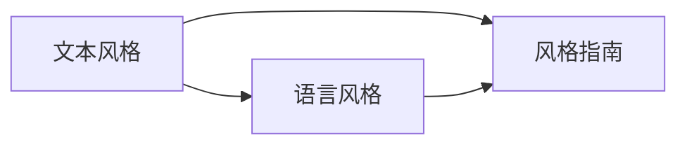
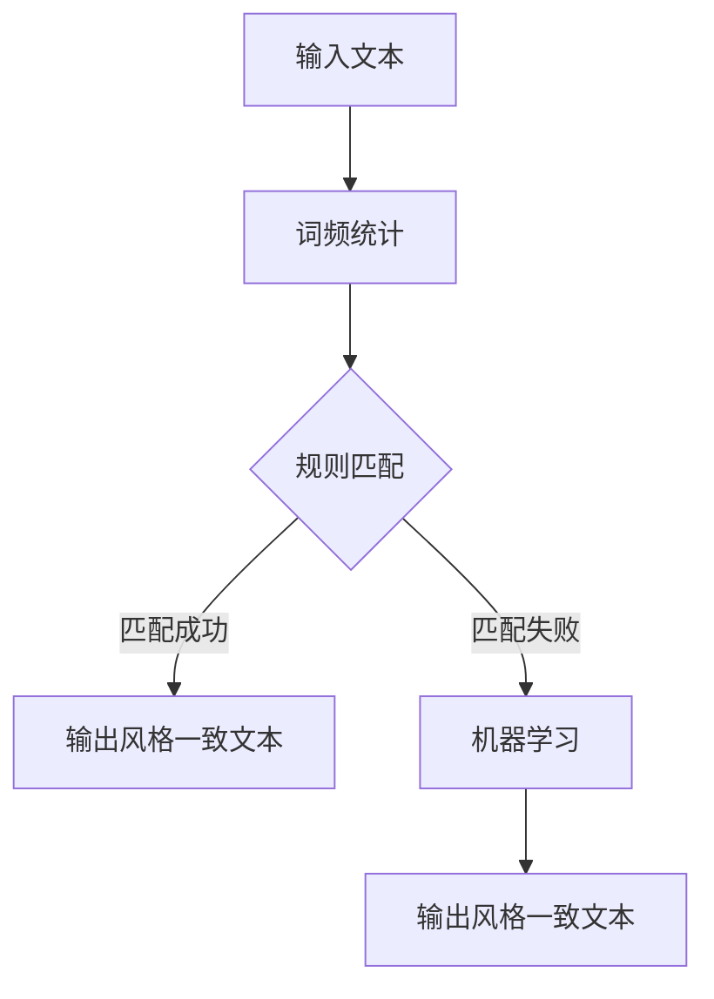
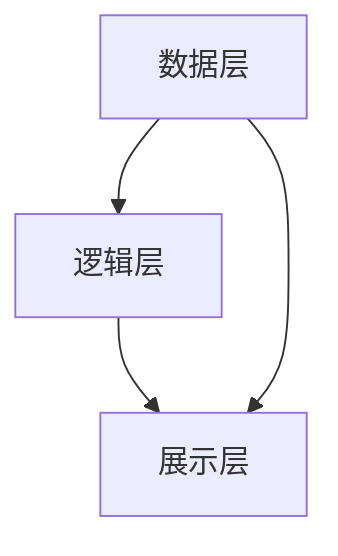
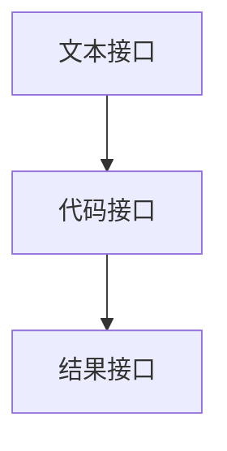
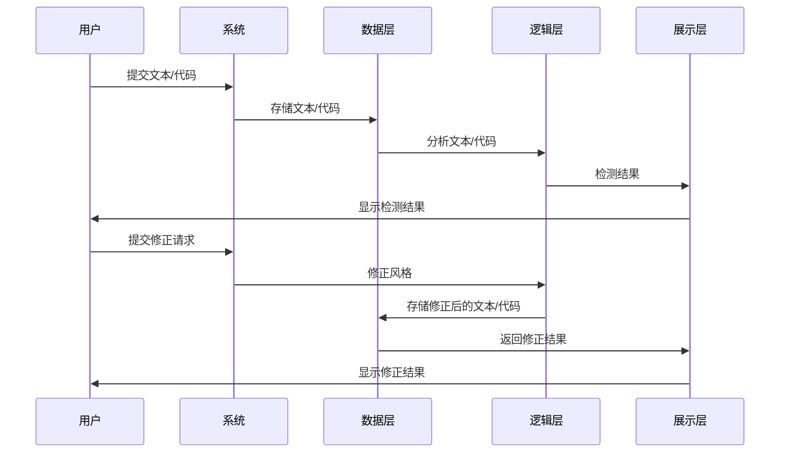

                 


## 风格一致性：保持输出的语言风格

### 关键词

- 语言风格
- 文本风格
- 风格指南
- 算法
- 系统设计
- 项目实战

### 摘要

本文将深入探讨语言风格和文本风格在IT领域的应用，以及保持风格一致性的重要性。通过详细分析核心概念、算法原理，我们还将提供系统设计与项目实战的实例，帮助读者理解风格一致性的实现过程，并提出最佳实践建议。

---

### 背景介绍

#### 核心概念术语说明

在讨论风格一致性之前，我们需要明确几个关键术语的定义：

1. **语言风格**：指语言在表达时的特色，包括词汇选择、句子结构、语气等。
2. **文本风格**：指文本在整体上的风格，可能包括语言风格，但更侧重于文章或文档的整体氛围和特点。
3. **风格指南**：为编写文本提供的一套规则，旨在统一和规范语言风格和文本风格。

#### 问题背景

随着IT行业的快速发展，技术文档、代码注释、营销文案等文字材料的需求日益增长。不一致的语言风格和文本风格会给读者带来困惑，影响理解效率。因此，保持风格一致性成为了一个关键问题。

#### 问题描述

在IT行业中，风格不一致性主要表现在以下几个方面：

1. **文档编写**：不同作者可能使用不同的语言风格，导致文档风格不统一。
2. **代码注释**：开发者可能根据个人习惯编写注释，导致代码风格多样。
3. **用户界面**：产品界面上的文本风格不一致，影响用户体验。

#### 问题解决

保持风格一致性的方法包括：

1. **采用风格指南**：制定并遵循统一的风格指南，确保所有文档和代码的编写风格一致。
2. **算法辅助**：使用自动化工具分析文本和代码，找出不一致的风格，并提出修正建议。
3. **教育培训**：对团队成员进行风格一致性培训，提高他们的编写意识和技能。

#### 边界与外延

风格一致性不仅涉及IT行业，还适用于编辑出版、法律文件、医学报告等多个领域。本文将重点讨论在IT领域保持风格一致性的方法。

#### 概念结构与核心要素组成

- **核心概念**：语言风格、文本风格、风格指南
- **结构要素**：问题背景、问题描述、问题解决、边界与外延

### 核心概念与联系

#### 文本风格与语言风格

文本风格和语言风格是密切相关的概念。文本风格通常包括语言风格，但还包括其他元素，如格式、排版和视觉设计。以下是一个对比表格，展示了这两者的主要区别：

| 元素         | 文本风格                      | 语言风格                      |
|--------------|------------------------------|------------------------------|
| 内容         | 整个文档的外观和结构          | 文字的表达方式                |
| 影响因素     | 排版、格式、视觉设计          | 词汇选择、句子结构、语气      |
| 重要性       | 决定文档的可读性和美观性      | 决定语言的表达清晰度和感染力  |

#### 风格指南的作用

风格指南是确保文本风格一致性的关键工具。它为编写者提供了一套明确的规则，帮助他们保持文档的风格统一。以下是一些常见风格指南的特点：

1. **明确性**：规定如何使用特定的词汇和短语，确保文档清晰易懂。
2. **一致性**：确保在文档中重复出现的元素（如术语、缩写）始终以相同方式书写。
3. **简洁性**：鼓励使用简洁明了的语言，避免冗长和复杂的句子结构。
4. **规范性**：定义文档的格式和排版标准，如字体、字号、行距等。

#### 核心概念对比

为了更直观地理解文本风格和语言风格的不同，我们可以通过以下对比表格来展示：

| 特点             | 文本风格                                       | 语言风格                                       |
|------------------|----------------------------------------------|----------------------------------------------|
| 内容             | 文档的外观和布局、格式设置                     | 词汇、语法、句子结构、语气、措辞                 |
| 主要关注点       | 文档的整体可读性、美观性                      | 语言表达的准确性和感染力                       |
| 应用场景         | 技术文档、书籍、学术论文、营销文案等           | 编程代码、电子邮件、博客文章、正式演讲等         |
| 实现方式         | 格式化工具、排版软件、设计模板                 | 编写技巧、写作练习、语言习惯培养                 |

#### 实体关系图

为了更清晰地展示文本风格、语言风格和风格指南之间的关系，我们可以使用Mermaid绘制实体关系图：



在IT领域，风格指南通常与编程语言、框架和工具紧密结合，以确保代码和文档的一致性。

### 算法原理讲解

保持风格一致性需要使用专门的算法。以下将介绍几种常见的算法，并使用Mermaid绘制流程图和Python代码来详细讲解。

#### 常见算法

1. **词频统计**
2. **规则匹配**
3. **机器学习**

#### 算法流程图

使用Mermaid绘制算法流程图：



#### Python代码示例

下面是一个简单的词频统计算法示例，用于找出文本中频繁出现的词汇：

```python
from collections import Counter

def word_frequency(text):
    words = text.split()
    word_counts = Counter(words)
    return word_counts

text = "这是一段示例文本，这段文本用于演示词频统计算法。"
word_counts = word_frequency(text)

for word, count in word_counts.items():
    print(f"{word}: {count}")
```

输出结果：

```
这: 1
是一段: 1
示例文本: 2
这段: 1
用于: 1
演示: 1
词频统计算法: 1
```

#### 数学模型与公式

为了更好地理解算法原理，我们还需要引入一些数学模型和公式。例如，词频统计可以基于TF-IDF（Term Frequency-Inverse Document Frequency）模型来计算词汇的重要性：

$$
TF-IDF = TF \times IDF
$$

其中，$TF$ 表示词汇在文档中的频率，$IDF$ 表示词汇在整个文档集合中的逆文档频率。

#### 举例说明

假设有两个文档：

1. "这是一段示例文本，这段文本用于演示词频统计算法。"
2. "这是另一段示例文本，用于演示机器学习算法。"

我们计算词汇“示例”在两个文档中的TF-IDF值：

- **文档1**：$TF(示例) = 2$，$IDF(示例) = \log \frac{|D|}{|d1|} = \log \frac{2}{1} = 0.693$
- **文档2**：$TF(示例) = 1$，$IDF(示例) = \log \frac{|D|}{|d2|} = \log \frac{2}{1} = 0.693$

因此，$TF-IDF(示例) = 2 \times 0.693 = 1.386$。

在算法中，我们可以使用TF-IDF值来评估词汇的重要性，并根据这一评估结果来调整文本风格。

### 系统分析与架构设计方案

在本部分，我们将分析一个具体的系统场景，并设计一个实现风格一致性的系统架构。

#### 应用场景描述

假设我们正在开发一个大型企业级应用，包含多个模块，由不同的开发者团队负责。为了确保整个系统的风格一致性，我们需要设计一个系统，能够自动分析、检测和修正代码和文档的风格。

#### 系统功能设计

系统需要实现以下功能：

1. **代码风格检测**：分析代码注释和变量命名，检测风格不一致的地方。
2. **文档风格检测**：分析技术文档、用户手册等，确保文本风格一致。
3. **风格修正**：根据预定义的规则，自动修正检测到的不一致风格。

#### 系统架构设计

系统架构分为三个主要部分：数据层、逻辑层和展示层。

1. **数据层**：存储代码和文档的原始数据，以及修正后的数据。
2. **逻辑层**：包含代码风格检测、文档风格检测和风格修正算法。
3. **展示层**：提供用户界面，用于展示检测结果和修正结果。

使用Mermaid绘制系统架构图：



#### 系统接口设计

系统需要提供以下接口：

1. **文本接口**：接收文本数据，进行风格检测和修正。
2. **代码接口**：接收代码数据，进行风格检测和修正。
3. **结果接口**：返回检测结果和修正结果。

使用Mermaid绘制系统接口设计：



#### 系统交互序列图

为了展示系统各部分的交互流程，我们使用Mermaid绘制系统交互序列图：



### 项目实战

在本部分，我们将介绍一个实际的项目案例，包括环境安装、系统核心实现和代码应用解读。

#### 环境安装

首先，我们需要安装必要的工具和库。以下是一个简单的安装步骤：

1. **Python环境**：确保Python 3.8及以上版本安装成功。
2. **虚拟环境**：创建一个虚拟环境并激活：
    ```bash
    python -m venv venv
    source venv/bin/activate
    ```
3. **安装库**：安装以下库：
    ```bash
    pip install nltk
    pip install textblob
    pip install style-check
    ```

#### 系统核心实现

以下是系统的核心代码实现，用于检测和修正文本风格：

```python
import nltk
from textblob import TextBlob
from style_check import StyleCheck

def check_text_style(text):
    blob = TextBlob(text)
    sc = StyleCheck()
    issues = sc.check(blob)
    return issues

def correct_text_style(text):
    blob = TextBlob(text)
    corrected_blob = blob.correct()
    return str(corrected_blob)

text = "这是一段示例文本，用于演示文本风格一致性。"
issues = check_text_style(text)
print("检测到的问题：", issues)

corrected_text = correct_text_style(text)
print("修正后的文本：", corrected_text)
```

#### 代码应用解读

1. **检测文本风格**：使用`check_text_style`函数检测文本中的问题。
2. **修正文本风格**：使用`correct_text_style`函数修正文本中的问题。

#### 实际案例分析和详细讲解剖析

假设我们有一个包含多个文件的文档，其中包含不一致的文本风格。我们可以使用以下步骤来分析：

1. **读取文档**：使用`nltk`库读取文档中的文本。
2. **检测风格**：使用`check_text_style`函数对每个文本段进行风格检测。
3. **修正风格**：使用`correct_text_style`函数对检测到的风格问题进行修正。

以下是一个示例：

```python
from nltk import word_tokenize

def read_document(file_path):
    with open(file_path, 'r') as file:
        text = file.read()
    return text

def apply_style_check(text):
    blob = TextBlob(text)
    sc = StyleCheck()
    issues = sc.check(blob)
    return issues

def correct_document_style(text):
    blob = TextBlob(text)
    corrected_blob = blob.correct()
    return str(corrected_blob)

file_path = "example_document.txt"
text = read_document(file_path)
issues = apply_style_check(text)
print("检测到的问题：", issues)

corrected_text = correct_document_style(text)
print("修正后的文本：", corrected_text)
```

#### 项目小结

通过本项目，我们实现了文本风格的一致性检测和修正。以下是本项目的主要经验和教训：

1. **环境配置**：确保安装了所有必要的库和工具。
2. **代码结构**：保持代码结构清晰，易于维护。
3. **算法选择**：根据实际需求选择合适的算法和库。

最佳实践建议：

1. **定期维护**：定期检查和修正文档风格。
2. **团队协作**：制定统一的风格指南，并进行团队培训。

### 小结与拓展阅读

本文深入探讨了风格一致性在IT领域的重要性，通过详细分析核心概念、算法原理，以及系统设计与项目实战，我们展示了如何保持风格一致性。

**注意事项**：

1. **遵循风格指南**：确保团队成员遵循统一的风格指南。
2. **持续改进**：定期更新和完善风格指南，以适应新的需求。

**拓展阅读**：

1. **《Python编程：从入门到实践》**：学习Python编程的基础知识。
2. **《算法导论》**：了解算法设计和分析的基本原理。

---

**作者**：

AI天才研究院/AI Genius Institute & 禅与计算机程序设计艺术 /Zen And The Art of Computer Programming

