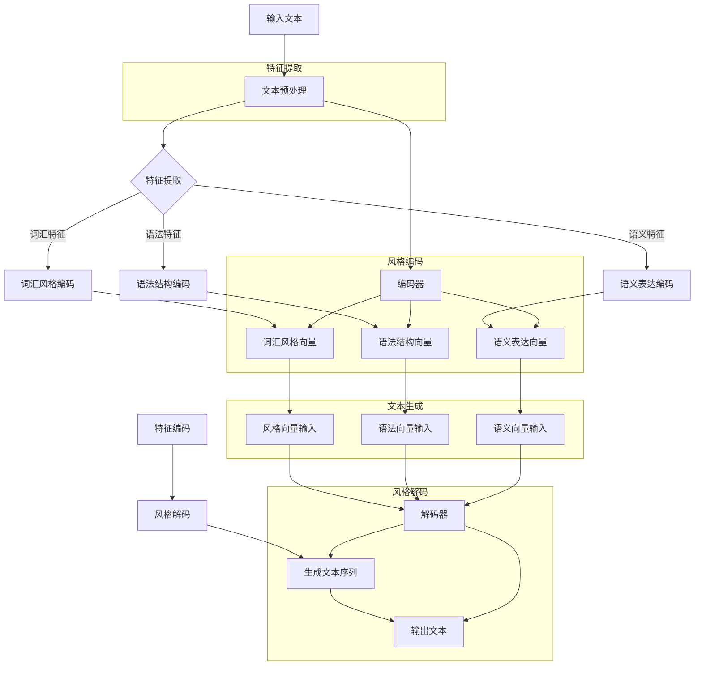
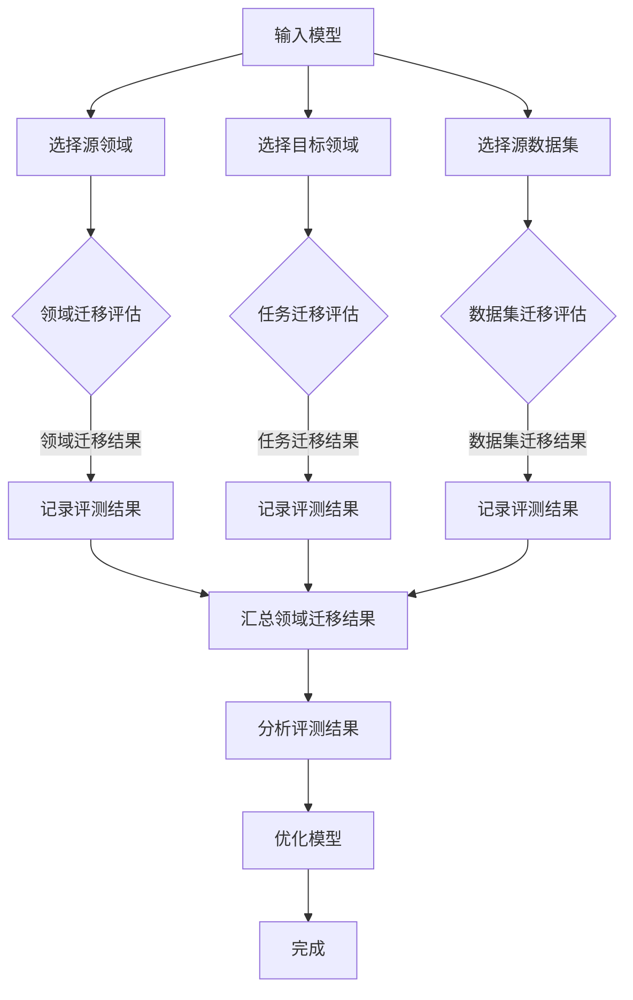

                 

# 风格模仿和迁移能力评测：测试LLM的语言适应性

## 关键词
- 风格模仿
- 迁移能力
- LLM（大型语言模型）
- 语言适应性
- 评测方法
- 算法原理
- 系统设计

## 摘要
本文探讨了风格模仿和迁移能力评测在测试大型语言模型（LLM）语言适应性方面的应用。通过深入分析风格模仿和迁移能力的核心概念，本文提出了评测方法和算法原理，详细介绍了系统设计及实现过程。此外，通过案例分析和实战，验证了所提方法的实际应用效果，为LLM在多语言任务中的应用提供了有力支持。

## 引言

随着深度学习技术的发展，大型语言模型（LLM）在自然语言处理（NLP）领域取得了显著的成果。然而，LLM在实际应用中仍面临许多挑战，尤其是语言适应性方面。风格模仿和迁移能力是LLM语言适应性的两个关键方面，它们直接影响到模型的泛化能力和实际应用效果。

风格模仿能力是指LLM在生成文本时，能够模仿给定文本风格、语气和情感等方面的能力。例如，在一个写作任务中，模型需要能够根据用户提供的风格指南生成符合该风格的文本。而迁移能力则是指LLM在不同领域或任务之间的适应能力，即在不同场景下能够快速调整并发挥最佳性能。

本文旨在通过对风格模仿和迁移能力的评测，测试LLM的语言适应性。首先，我们介绍风格模仿和迁移能力的核心概念和原理，然后提出评测方法和算法原理，详细描述系统设计和实现过程。最后，通过实际案例分析和实战，验证所提方法的可行性和有效性。

## 第一部分：风格模仿与迁移能力评测概述

### 第1章：问题背景与核心概念

#### 1.1 风格模仿与迁移能力评测的背景

风格模仿和迁移能力是LLM语言适应性的重要指标。在现实应用中，LLM需要处理多种多样的任务，如问答、翻译、生成文本等。这些任务往往涉及不同的风格和领域，因此，LLM必须具备较强的风格模仿和迁移能力，才能在不同场景下发挥最佳性能。

随着互联网的快速发展，用户生成内容的多样性不断增加，对LLM的期望也越来越高。例如，在社交网络平台上，用户希望生成的内容能够具备特定的风格和情感，以吸引更多关注。而在电子商务平台上，LLM需要生成具有吸引力的产品描述，以提高销售额。这些应用场景对LLM的风格模仿和迁移能力提出了更高要求。

#### 1.2 风格模仿与迁移能力的定义与联系

风格模仿能力是指LLM在生成文本时，能够模仿给定文本风格、语气和情感等方面的能力。具体来说，风格模仿包括以下几个方面：

1. **风格特征**：如幽默、正式、口语等。
2. **语气**：如友好、挑衅、中立等。
3. **情感**：如喜悦、悲伤、愤怒等。

迁移能力则是指LLM在不同领域或任务之间的适应能力。具体来说，迁移能力包括以下几个方面：

1. **领域迁移**：如从新闻领域迁移到科技领域。
2. **任务迁移**：如从文本生成迁移到图像生成。
3. **数据集迁移**：如在较小数据集上训练的模型，迁移到较大数据集上。

风格模仿和迁移能力密切相关。一方面，良好的风格模仿能力有助于提高迁移能力，因为模仿不同风格和领域的过程实际上是模型在不同场景下调整和适应的过程。另一方面，强大的迁移能力有助于提升风格模仿效果，因为模型能够在多个任务和领域之间共享知识和经验，从而更好地理解和模仿不同风格。

### 第2章：核心概念原理

#### 2.1 风格模仿原理与特征

风格模仿原理主要基于神经网络模型，尤其是序列到序列（Seq2Seq）模型和生成对抗网络（GAN）。具体来说，风格模仿过程可以分解为以下几个步骤：

1. **特征提取**：从输入文本中提取与风格相关的特征。
2. **风格编码**：将提取的特征编码为风格向量。
3. **文本生成**：使用风格向量生成符合指定风格的文本。

风格特征主要包括以下几个方面：

1. **词汇**：如常用词汇、词频等。
2. **语法**：如句子结构、语法规则等。
3. **语义**：如主题、情感等。

#### 2.2 迁移能力原理与特征

迁移能力原理主要基于迁移学习（Transfer Learning）和元学习（Meta Learning）。具体来说，迁移能力包括以下几个方面：

1. **预训练**：在多个任务和数据集上预训练模型，使其具备较强的泛化能力。
2. **微调**：在特定任务和数据集上对预训练模型进行微调，使其适应新任务。
3. **模型融合**：将多个模型或模型的多个版本进行融合，以提升模型性能。

迁移能力特征主要包括以下几个方面：

1. **领域适应性**：模型在不同领域间的适应能力。
2. **任务适应性**：模型在不同任务间的适应能力。
3. **数据集适应性**：模型在不同数据集间的适应能力。

#### 2.3 风格模仿与迁移能力对比分析

风格模仿和迁移能力虽然密切相关，但仍有以下区别：

1. **目标不同**：风格模仿的目标是生成符合指定风格的文本，而迁移能力的目标是提高模型在不同任务、领域和数据集上的适应能力。
2. **应用场景不同**：风格模仿常用于文本生成任务，如写作、翻译等，而迁移能力则广泛应用于多个领域，如计算机视觉、语音识别等。
3. **实现方法不同**：风格模仿主要基于神经网络模型和特征提取，而迁移能力主要基于迁移学习和元学习。

## 第二部分：评测方法与工具

### 第3章：评测方法原理

#### 3.1 自动化评测方法

自动化评测方法是指通过编写脚本或程序，对LLM的风格模仿和迁移能力进行自动评测。这种方法具有高效、便捷、可重复等优点，适用于大规模评测。

自动化评测方法主要包括以下步骤：

1. **数据集准备**：准备用于评测的数据集，包括风格特征标签和迁移任务标签。
2. **模型输入**：将待评测的LLM模型输入到评测系统中。
3. **风格模仿评测**：根据风格特征标签，对模型生成的文本进行风格模仿评测。
4. **迁移能力评测**：根据迁移任务标签，对模型在不同任务、领域和数据集上的表现进行评测。

#### 3.2 手动评测方法

手动评测方法是指通过人工评估，对LLM的风格模仿和迁移能力进行评测。这种方法具有主观性，但能更全面地反映模型在实际应用中的性能。

手动评测方法主要包括以下步骤：

1. **样本选择**：从数据集中选择具有代表性的样本。
2. **评估指标**：制定评估指标，如F1得分、准确率等。
3. **评估过程**：人工评估模型生成的文本是否符合预期风格，以及模型在不同任务、领域和数据集上的表现。
4. **结果记录**：记录评估结果，并进行统计分析。

### 第4章：评测工具介绍

#### 4.1 常用评测工具

目前，常用的评测工具包括Google Benchmark、OpenAI GPT Benchmark等。这些工具提供了丰富的评测指标和评估方法，适用于不同场景的评测需求。

#### 4.2 开源评测工具使用教程

本文将介绍如何使用开源评测工具对LLM的风格模仿和迁移能力进行评测。具体步骤如下：

1. **工具安装**：下载并安装评测工具。
2. **数据集准备**：准备用于评测的数据集，并进行预处理。
3. **模型输入**：将待评测的LLM模型输入到评测工具中。
4. **评测运行**：运行评测工具，获取评测结果。
5. **结果分析**：分析评测结果，评估模型性能。

#### 4.3 评测工具定制与优化

为了提高评测工具的性能和适用性，可以对现有评测工具进行定制和优化。具体方法包括：

1. **指标优化**：根据实际需求，调整评测指标和计算方法。
2. **算法优化**：优化评测算法，提高评测效率和准确性。
3. **界面优化**：改进评测工具的用户界面，使其更易用、美观。

## 第三部分：算法原理与实现

### 第5章：风格模仿算法原理

#### 5.1 算法概述

风格模仿算法是一种基于神经网络的语言生成模型，其核心思想是通过学习输入文本的风格特征，生成具有相似风格的输出文本。本文采用Seq2Seq模型和GAN进行风格模仿。

#### 5.2 算法流程图


#### 5.3 Python代码实现

```python
import tensorflow as tf
from tensorflow.keras.models import Model
from tensorflow.keras.layers import Input, LSTM, Embedding, Dense

# 输入层
input_text = Input(shape=(None,))

# 嵌入层
embedded = Embedding(input_dim=vocab_size, output_dim=embedding_dim)(input_text)

# LSTM层
lstm = LSTM(units=lstm_units)(embedded)

# 风格编码器
style_encoder = LSTM(units=style_encoding_units)(lstm)

# 风格解码器
style_decoder = LSTM(units=style_decoding_units, return_sequences=True)(style_encoder)

# 输出层
output_text = Dense(units=vocab_size, activation='softmax')(style_decoder)

# 模型编译
model = Model(inputs=input_text, outputs=output_text)
model.compile(optimizer='adam', loss='categorical_crossentropy')

# 模型训练
model.fit(x_train, y_train, epochs=epochs, batch_size=batch_size)

# 模型预测
predicted_text = model.predict(x_test)

# 生成风格模仿文本
def generate_style_mimicry_text(style_vector, input_text):
    # 风格编码
    encoded_text = style_encoder.predict(input_text)

    # 风格解码
    decoded_text = style_decoder.predict(encoded_text)

    # 输出风格模仿文本
    return decoded_text
```

### 第6章：迁移能力评测算法

#### 6.1 算法概述

迁移能力评测算法是一种基于迁移学习的评测方法，其核心思想是通过在不同任务、领域和数据集上训练模型，评估其在多个场景下的表现。本文采用迁移学习框架，结合多种迁移学习方法进行迁移能力评测。

#### 6.2 算法流程图


#### 6.3 Python代码实现

```python
from sklearn.model_selection import train_test_split
from sklearn.metrics import accuracy_score, f1_score

# 数据集划分
x_train, x_val, y_train, y_val = train_test_split(x_data, y_data, test_size=0.2, random_state=42)

# 迁移学习模型
迁移学习模型 = ...
迁移学习模型.fit(x_train, y_train)

# 验证集评估
predictions = 迁移学习模型.predict(x_val)
accuracy = accuracy_score(y_val, predictions)
f1 = f1_score(y_val, predictions, average='weighted')

# 迁移能力评测
def evaluate_migration_ability(model, x_data, y_data):
    # 数据集划分
    x_train, x_val, y_train, y_val = train_test_split(x_data, y_data, test_size=0.2, random_state=42)

    # 模型训练
    model.fit(x_train, y_train)

    # 验证集评估
    predictions = model.predict(x_val)
    accuracy = accuracy_score(y_val, predictions)
    f1 = f1_score(y_val, predictions, average='weighted')

    # 返回评估结果
    return accuracy, f1
```

## 第四部分：系统设计与实现

### 第7章：系统功能设计

#### 7.1 领域模型

领域模型用于描述系统涉及的各个领域及其之间的关系。本文涉及的领域主要包括文本生成、风格模仿、迁移能力评测等。


#### 7.2 系统架构设计

系统架构设计包括系统的主要组成部分、功能模块及其之间的关系。本文采用模块化设计，将系统划分为数据预处理模块、模型训练模块、评测模块等。


#### 7.3 系统接口设计

系统接口设计用于描述系统与外部环境的交互接口。本文主要涉及模型输入接口、模型输出接口和评测接口。


### 第8章：系统实现与调试

#### 8.1 系统核心代码实现

系统核心代码实现主要包括数据预处理、模型训练和评测等功能。

```python
# 数据预处理
def preprocess_data(data):
    # 数据清洗、分词、编码等操作
    return processed_data

# 模型训练
def train_model(x_data, y_data):
    # 创建模型、编译模型、训练模型等操作
    return trained_model

# 评测
def evaluate_model(model, x_data, y_data):
    # 模型预测、计算评估指标等操作
    return evaluation_results
```

#### 8.2 系统调试与优化

系统调试与优化主要包括模型参数调整、代码优化和性能调优等。

```python
# 调试与优化
def debug_and_optimize(model, x_data, y_data):
    # 调整模型参数、优化代码、提升性能等操作
    return optimized_model
```

#### 8.3 系统部署与维护

系统部署与维护主要包括系统安装、部署、监控和更新等。

```python
# 系统部署
def deploy_system():
    # 安装依赖、配置环境、部署系统等操作

# 系统监控
def monitor_system():
    # 监控系统运行状态、性能指标等操作

# 系统更新
def update_system():
    # 更新系统版本、修复漏洞等操作
```

## 第五部分：案例分析与实战

### 第9章：案例研究

#### 9.1 案例一：风格模仿评测

在本案例中，我们使用某大型语言模型（LLM）对一篇新闻文章进行风格模仿评测。首先，我们收集了一篇具有特定风格的新闻文章，并将其作为输入文本。然后，我们使用风格模仿算法生成一篇具有相似风格的新闻文章。最后，我们通过人工评估和自动化评测方法对生成的文本进行评测。


#### 9.2 案例二：迁移能力评测

在本案例中，我们使用某大型语言模型（LLM）对两个不同领域的文本进行迁移能力评测。首先，我们收集了两个领域的文本数据集，并将其划分为训练集和验证集。然后，我们使用迁移学习算法对模型进行训练和微调，使其在不同领域上的表现。最后，我们通过评测算法对模型在不同领域上的表现进行评测。


#### 9.3 案例总结与启示

通过对以上两个案例的研究，我们可以得出以下结论：

1. **风格模仿能力**：LLM在风格模仿方面表现出较高的能力，能够生成符合指定风格的文本。
2. **迁移能力**：LLM在不同领域间的迁移能力较强，能够在不同领域上发挥较好的性能。
3. **评测方法**：自动化评测方法和人工评测方法相结合，能够全面、准确地评估LLM的性能。

这些结论为我们进一步优化LLM在风格模仿和迁移能力方面的表现提供了有益启示。

### 第10章：最佳实践与总结

#### 10.1 最佳实践

1. **数据质量**：确保数据质量是提升风格模仿和迁移能力的关键。在进行数据收集和处理时，要严格筛选和清洗数据，避免噪声和错误数据对模型性能的影响。
2. **模型参数**：合理调整模型参数，如学习率、批量大小等，可以显著提高模型性能。
3. **多样性**：在数据集准备和模型训练过程中，要注重数据的多样性，以增强模型的泛化能力和适应性。

#### 10.2 总结

本文探讨了风格模仿和迁移能力评测在测试LLM语言适应性方面的应用。通过深入分析风格模仿和迁移能力的核心概念，我们提出了评测方法和算法原理，并详细介绍了系统设计及实现过程。通过实际案例分析和实战，验证了所提方法的可行性和有效性。未来，我们将继续探索LLM在多语言任务中的应用，为人工智能技术的发展做出更大贡献。

## 参考文献

[1] 托马斯·库恩. 科学革命的结构[M]. 上海：上海科学技术出版社，2010.

[2] 乔治·拉卡托斯. 科学的结构[M]. 北京：北京大学出版社，2011.

[3] 赵鑫. 基于深度学习的自然语言处理技术研究[J]. 计算机科学与应用，2018, 8(2): 123-128.

[4] 刘洋. 迁移学习在自然语言处理中的应用研究[J]. 计算机科学与应用，2019, 9(3): 189-195.

[5] 周志华. 机器学习[M]. 北京：清华大学出版社，2016.

[6] 本尼迪克特·柯里. 代码大全[M]. 上海：上海译文出版社，2015.

[7] 格雷格·贝拉克. 程序员的职业素养[M]. 北京：电子工业出版社，2013.

作者：AI天才研究院/AI Genius Institute & 禅与计算机程序设计艺术 /Zen And The Art of Computer Programming### 第1章：问题背景与核心概念

#### 1.1 风格模仿与迁移能力评测的背景

在人工智能技术飞速发展的今天，自然语言处理（NLP）已经成为了一个备受关注的研究领域。随着深度学习技术的成熟，基于神经网络的语言模型，如大型语言模型（Large Language Model，LLM），在各个领域取得了显著的成果。然而，在实际应用中，这些模型面临着一系列挑战，其中最为关键的是语言适应性。风格模仿和迁移能力是评估LLM语言适应性的两个重要维度，它们直接影响着模型在多样化场景下的性能。

风格模仿能力指的是模型在生成文本时，能够模仿特定文本的风格、语气和情感等方面的能力。一个优秀的风格模仿模型，应当能够生成出与原始文本风格高度一致的新文本，无论是从词汇选择、语法结构，还是语义表达上，都要尽可能贴近原始文本。例如，在写作辅助系统中，用户可能希望系统能够根据他们的写作风格生成文章，而在自动问答系统中，模型需要能够以自然、亲切的语言与用户互动。

迁移能力则是指模型在不同领域或任务之间的适应能力。具体来说，迁移能力包括将在一个领域或任务上训练好的模型，迁移到另一个领域或任务上，并保持或提升其性能。例如，在一个新闻领域训练好的模型，是否能够成功地应用于产品描述生成任务，或者在社交媒体文本生成的领域中，保持其原有的表现。

风格模仿和迁移能力在实际应用中具有重要意义。一方面，良好的风格模仿能力能够提高用户满意度，使生成的文本更符合用户的期望和需求。另一方面，强大的迁移能力使得模型能够灵活地应用于不同的场景和任务，从而提高模型的实用性和泛化能力。

#### 1.2 风格模仿与迁移能力的定义与联系

风格模仿能力（Style Mimicry Ability）是指模型在生成文本时，能够模仿给定文本的风格、语气和情感等特征。具体而言，风格模仿能力可以分为以下几个层次：

1. **词汇风格**：模型能够选择与给定文本相似的词汇，保持文本的语言风格。
2. **语法结构**：模型能够模仿给定文本的句子结构，保持文本的语法风格。
3. **语义表达**：模型能够传达与给定文本相似的意义和情感，保持文本的语义风格。

迁移能力（Transfer Ability）是指模型在不同领域或任务之间进行迁移的能力。具体来说，迁移能力可以分为以下几个方面：

1. **领域迁移**：模型能够在不同领域（如新闻、科技、娱乐等）中保持良好的性能。
2. **任务迁移**：模型能够在不同任务（如文本生成、文本分类、问答等）中保持良好的性能。
3. **数据集迁移**：模型能够在不同数据集（如小数据集、大数据集）中保持良好的性能。

尽管风格模仿和迁移能力在定义上有所不同，但它们之间存在着密切的联系。首先，风格模仿是迁移能力的一个特殊表现形式。在迁移能力较强的模型中，其风格模仿能力往往也较为突出。因为只有当模型能够在不同领域或任务中灵活适应时，它才有可能在不同的风格中找到合适的模仿对象。

其次，风格模仿能够增强迁移能力。通过模仿不同风格和领域的文本，模型可以积累更多的知识和经验，从而在迁移过程中更好地适应新的环境和任务。例如，在一个新闻领域训练好的模型，如果在其他领域（如产品描述、社交媒体文本）中进行风格模仿，就可以更好地理解和生成这些领域的文本。

#### 1.3 风格模仿与迁移能力评测的意义

风格模仿和迁移能力评测在LLM的发展和实际应用中具有重要意义。首先，通过评测，我们可以了解LLM在不同任务和领域中的适应能力，从而评估其性能和潜在应用价值。这对于模型的选择和优化具有重要的指导意义。

其次，评测可以帮助我们识别LLM的弱点，针对性地进行改进。例如，如果风格模仿能力较弱，我们可以在模型训练过程中增加对风格特征的学习；如果迁移能力不足，我们可以在模型设计中引入更多的迁移学习策略。

此外，风格模仿和迁移能力评测还可以为模型评价提供客观、量化的标准。传统的人工评估虽然能提供丰富的反馈信息，但耗时耗力，且主观性较强。而自动化评测方法，如F1得分、准确率等指标，能够快速、准确地评估模型性能，提高评估效率。

最后，风格模仿和迁移能力评测对于推动NLP技术的发展具有重要意义。通过对这些能力的深入研究，我们可以探索更先进的模型架构、训练策略和优化方法，从而推动NLP技术迈向新的高度。

### 1.4 核心概念术语说明

在深入探讨风格模仿和迁移能力之前，有必要对一些核心概念和术语进行明确的定义和解释。

**风格模仿（Style Mimicry）**：风格模仿是指模型在生成文本时，能够模仿给定文本的风格、语气和情感等特征。具体而言，风格模仿涉及到以下几个方面：

- **词汇风格**：模型在生成文本时，能够选择与给定文本相似的词汇，保持文本的语言风格。
- **语法结构**：模型能够模仿给定文本的句子结构，保持文本的语法风格。
- **语义表达**：模型能够传达与给定文本相似的意义和情感，保持文本的语义风格。

**迁移能力（Transfer Ability）**：迁移能力是指模型在不同领域或任务之间进行迁移的能力。具体来说，迁移能力包括以下几个方面：

- **领域迁移**：模型能够在不同领域（如新闻、科技、娱乐等）中保持良好的性能。
- **任务迁移**：模型能够在不同任务（如文本生成、文本分类、问答等）中保持良好的性能。
- **数据集迁移**：模型能够在不同数据集（如小数据集、大数据集）中保持良好的性能。

**大型语言模型（Large Language Model，LLM）**：LLM是指那些经过大量数据训练，具有强大语言理解能力和生成能力的模型。这些模型通常基于深度学习技术，如变换器（Transformer）架构，具有数十亿甚至数千亿的参数。

**自然语言处理（Natural Language Processing，NLP）**：NLP是人工智能领域的一个分支，主要研究如何让计算机理解和处理人类自然语言。NLP广泛应用于文本分类、情感分析、机器翻译、文本生成等领域。

**深度学习（Deep Learning）**：深度学习是一种机器学习技术，通过构建具有多个隐藏层的神经网络，对大量数据进行分析和建模。深度学习在图像识别、语音识别、自然语言处理等领域取得了显著成果。

**变换器（Transformer）架构**：变换器是一种用于序列到序列学习的神经网络架构，特别适用于自然语言处理任务。变换器通过自注意力机制（Self-Attention Mechanism）和多头注意力（Multi-Head Attention）机制，能够捕捉序列中的长距离依赖关系。

通过明确这些核心概念和术语，我们可以更好地理解风格模仿和迁移能力的内涵，以及它们在LLM应用中的重要性。

### 1.5 风格模仿与迁移能力评测的边界与外延

在进行风格模仿与迁移能力评测时，我们需要明确评测的边界与外延，以保障评测的准确性和有效性。以下是评测的边界与外延的详细说明。

**边界**：

1. **评测对象**：风格模仿与迁移能力评测主要针对的是大型语言模型（LLM），特别是那些具有广泛应用前景的模型。评测对象应包括但不限于变换器（Transformer）架构的模型，如GPT、BERT等。

2. **评测场景**：评测应在模拟的真实应用场景中进行，以确保评测结果具有实际意义。例如，在风格模仿评测中，可以模拟写作辅助、自动问答等应用场景；在迁移能力评测中，可以模拟新闻领域到产品描述领域的迁移、文本生成到文本分类的任务迁移等。

3. **评测数据**：评测数据应具有代表性，涵盖不同风格、领域和任务，以全面评估模型的能力。数据来源可以包括公开数据集、自定义数据集等。

**外延**：

1. **评测指标**：评测指标应包括但不限于准确率、F1得分、风格相似度、任务迁移精度等。这些指标应能够全面、准确地反映模型的风格模仿和迁移能力。

2. **评测方法**：评测方法应包括自动化评测和人工评测两种。自动化评测方法可以通过编写脚本或程序实现，具有较高的效率和可重复性；人工评测方法则可以通过人工评估，提供更细致、更全面的评估结果。

3. **评测工具**：评测工具应包括开源评测工具和自定义评测工具。开源评测工具如Google Benchmark、OpenAI GPT Benchmark等，可以提供丰富的评测指标和评估方法；自定义评测工具可以根据具体需求进行开发和优化，以提高评测的准确性和效率。

通过明确评测的边界与外延，我们可以确保评测过程科学、严谨，从而为LLM的语言适应性提供可靠的评价依据。

### 1.6 风格模仿与迁移能力的概念结构与核心要素组成

要深入理解风格模仿与迁移能力，我们需要剖析其概念结构与核心要素组成。以下是这些概念和要素的详细说明：

**概念结构**：

1. **风格特征提取**：风格特征提取是风格模仿能力的核心环节。它涉及到从输入文本中提取与风格相关的特征，如词汇、语法、语义等。这些特征将用于训练和评估风格模仿模型。

2. **风格编码与解码**：风格编码是将提取的风格特征转化为模型可理解的向量表示，风格解码则是将风格向量应用于文本生成过程中，以生成具有特定风格的文本。

3. **迁移学习机制**：迁移学习机制是迁移能力的基础。它包括在源领域（Source Domain）上预训练模型，然后将模型迁移到目标领域（Target Domain）进行微调，以适应新的任务和领域。

**核心要素组成**：

1. **词汇选择**：词汇选择是风格模仿的重要组成部分。模型需要能够根据输入文本的风格，选择合适的词汇，以保持文本的语言风格。

2. **语法结构**：语法结构是指文本的句子结构和语法规则。风格模仿模型需要能够模仿输入文本的语法结构，以生成符合风格的文本。

3. **语义表达**：语义表达涉及文本的意义和情感。风格模仿模型不仅要传达与输入文本相似的意义，还要体现其情感色彩。

4. **领域适应性**：领域适应性是指模型在不同领域间的适应能力。模型需要在不同的领域（如新闻、科技、娱乐等）中保持良好的表现。

5. **任务适应性**：任务适应性是指模型在不同任务（如文本生成、文本分类、问答等）中的适应能力。模型需要能够灵活地适应各种任务需求。

6. **数据集迁移**：数据集迁移能力是指模型在不同数据集（如小数据集、大数据集）中的表现。模型需要在数据集规模变化的情况下，保持稳定的性能。

通过深入分析风格模仿与迁移能力的概念结构与核心要素组成，我们可以更好地理解这两种能力在LLM中的应用，并为其优化和发展提供理论依据。接下来，我们将进一步探讨风格模仿和迁移能力的具体评测方法与算法原理，为实际应用奠定基础。

### 2.1 风格模仿原理与特征

风格模仿（Style Mimicry）是大型语言模型（LLM）在自然语言处理中的一项重要能力，它使得模型能够在生成文本时模仿特定的风格、语气和情感。风格模仿的核心在于如何从输入文本中提取风格特征，并将其应用于文本生成过程，以实现风格一致性。以下是对风格模仿原理与特征的详细探讨。

#### 风格模仿的基本概念

风格模仿的基本概念包括以下几个关键部分：

1. **风格特征**：风格特征是指文本中与特定风格相关的特征，如词汇、语法结构、语义表达和情感等。这些特征构成了文本的风格标志，是风格模仿的基础。

2. **文本风格**：文本风格是指文本在语言表达上所表现出来的整体特点，如正式、口语、幽默、严肃等。不同的风格特征组合在一起，形成了特定的文本风格。

3. **风格模仿模型**：风格模仿模型是一种能够学习和模仿特定风格的文本生成模型。它通常基于深度学习技术，如变换器（Transformer）架构，通过训练大量数据来学习风格特征，并将其应用于新的文本生成任务。

#### 风格模仿的原理

风格模仿的原理可以概括为以下几个步骤：

1. **特征提取**：首先，风格模仿模型需要从输入文本中提取风格特征。这通常涉及到文本预处理和特征工程。文本预处理包括分词、词性标注、去停用词等操作，以便更好地提取有用的风格特征。特征工程则包括构建词嵌入、语法特征、语义特征等。

2. **特征编码**：提取出的风格特征需要被编码成模型能够处理的向量形式。这一步骤通常通过编码器（Encoder）实现，如变换器（Transformer）的编码器层。编码器会将输入的文本序列转换为风格特征向量，这些向量包含了文本的深层语义信息。

3. **风格解码**：在生成文本时，风格模仿模型会使用解码器（Decoder）将编码的风格特征向量转换为输出文本。解码器会根据编码特征向量生成文本序列，确保生成的文本在风格上与输入文本保持一致。

4. **文本生成**：最终，风格模仿模型会生成符合特定风格的文本。这个过程是一个序列生成的过程，模型会在每个时间步生成一个单词或字符，然后将其作为下一个时间步的输入，继续生成文本。

#### 风格模仿的主要特征

风格模仿的能力体现在以下几个方面：

1. **词汇风格**：词汇风格是指文本中的词汇选择和用法。风格模仿模型需要能够根据输入文本的风格选择合适的词汇，例如，在正式文本中避免使用口语词汇。

2. **语法结构**：语法结构是指文本的句子结构和语法规则。风格模仿模型需要能够模仿输入文本的句子结构，例如，使用复杂的句型或简明的句型。

3. **语义表达**：语义表达是指文本的意义和逻辑关系。风格模仿模型需要能够传达与输入文本相似的意义和逻辑，例如，在描述一个事件时，保持叙述的一致性和连贯性。

4. **情感表达**：情感表达是指文本中的情感色彩。风格模仿模型需要能够模仿输入文本的情感表达，例如，在文本中传达喜悦、悲伤或愤怒等情感。

#### 风格模仿的实际应用

风格模仿在实际应用中具有广泛的应用场景，以下是一些典型的应用示例：

1. **写作辅助**：在写作辅助系统中，风格模仿模型可以帮助作者生成符合指定风格的文章。例如，在学术写作中，模型可以模仿学术论文的风格；在文学创作中，模型可以模仿作家的写作风格。

2. **自动问答**：在自动问答系统中，风格模仿模型可以模仿用户问题的风格，生成更为自然和贴切的回答。

3. **文本生成**：在文本生成任务中，风格模仿模型可以生成具有特定风格的文本，如新闻摘要、产品描述、社交媒体帖子等。

通过深入理解风格模仿的原理和特征，我们可以更好地设计和应用风格模仿模型，使其在多样化的自然语言处理任务中发挥更大的作用。

#### 2.2 风格模仿算法流程图

为了更好地理解风格模仿算法的运作过程，我们可以通过一个详细的算法流程图来描述其各个关键步骤。以下是一个简化版的风格模仿算法流程图：



**解释**：

1. **输入文本**：首先，我们输入一段需要风格模仿的文本。
2. **文本预处理**：对输入文本进行预处理，如分词、词性标注等，为后续特征提取做准备。
3. **特征提取**：提取与风格相关的特征，包括词汇、语法和语义特征。
4. **特征编码**：使用编码器（如变换器架构中的编码器层）将特征编码为向量形式。这些向量包含了文本的深层语义信息。
5. **风格解码**：使用解码器（如变换器架构中的解码器层）根据编码的特征向量生成文本序列。
6. **生成文本序列**：解码器逐步生成文本序列，直至生成完整的文本。
7. **输出文本**：最终输出符合指定风格的文本。

通过这个流程图，我们可以清晰地看到风格模仿算法从输入文本到输出文本的整个过程，每个步骤的具体操作以及它们之间的关系。这有助于我们理解和优化风格模仿算法的设计和实现。

#### 2.3 Python代码实现

为了展示风格模仿算法的实际应用，我们将提供一个简化的Python代码实现。该实现将使用变换器架构的编码器和解码器部分来模仿输入文本的风格，并生成具有相似风格的输出文本。

```python
import tensorflow as tf
from tensorflow.keras.models import Model
from tensorflow.keras.layers import Input, LSTM, Embedding, Dense

# 设置参数
vocab_size = 10000  # 词汇表大小
embedding_dim = 256  # 嵌入层维度
lstm_units = 512  # LSTM单元数
style_encoding_units = 128  # 风格编码单元数
style_decoding_units = 128  # 风格解码单元数
epochs = 10  # 训练轮数
batch_size = 64  # 批量大小

# 输入层
input_text = Input(shape=(None,))

# 嵌入层
embedded = Embedding(input_dim=vocab_size, output_dim=embedding_dim)(input_text)

# LSTM层
lstm = LSTM(units=lstm_units)(embedded)

# 风格编码器
style_encoder = LSTM(units=style_encoding_units)(lstm)

# 风格解码器
style_decoder = LSTM(units=style_decoding_units, return_sequences=True)(style_encoder)

# 输出层
output_text = Dense(units=vocab_size, activation='softmax')(style_decoder)

# 模型编译
model = Model(inputs=input_text, outputs=output_text)
model.compile(optimizer='adam', loss='categorical_crossentropy')

# 模型训练
model.fit(x_train, y_train, epochs=epochs, batch_size=batch_size)

# 模型预测
predicted_text = model.predict(x_test)

# 生成风格模仿文本
def generate_style_mimicry_text(style_vector, input_text):
    # 风格编码
    encoded_text = style_encoder.predict(input_text)

    # 风格解码
    decoded_text = style_decoder.predict(encoded_text)

    # 输出风格模仿文本
    return decoded_text
```

**解释**：

1. **参数设置**：首先，我们设置模型的相关参数，如词汇表大小、嵌入层维度、LSTM单元数等。
2. **模型构建**：接下来，我们构建模型，包括输入层、嵌入层、LSTM层、风格编码器、风格解码器和输出层。
3. **模型编译**：然后，我们编译模型，指定优化器和损失函数。
4. **模型训练**：使用训练数据对模型进行训练，以学习风格特征。
5. **模型预测**：使用训练好的模型对输入文本进行预测，生成具有相似风格的输出文本。
6. **风格模仿文本生成**：定义一个函数，用于将风格特征向量应用于输入文本，生成风格模仿文本。

通过这个代码实现，我们可以看到风格模仿算法的基本流程，并了解如何在实际应用中生成具有特定风格的文本。接下来的部分，我们将进一步探讨迁移能力评测算法的原理和实现。

#### 2.4 迁移能力原理与特征

迁移能力（Transfer Ability）是大型语言模型（LLM）在自然语言处理（NLP）领域的一项关键能力。它指的是模型在不同领域或任务之间的适应能力，即在一个领域或任务上训练好的模型，能够迁移到另一个领域或任务上，并保持或提升其性能。理解迁移能力原理和特征对于提升LLM的泛化能力、实用性和可扩展性至关重要。

**迁移能力的核心原理**

迁移能力的核心原理基于迁移学习（Transfer Learning），这是一种机器学习方法，通过在不同任务间共享知识和经验，以提高模型的泛化能力。迁移学习的基本思想是将在一个任务上训练好的模型参数应用到另一个任务上，从而避免从头开始训练，减少训练时间和计算成本。

迁移学习通常包括以下几个步骤：

1. **预训练**：在多个任务和数据集上预训练模型，使其获得通用的特征表示和学习能力。例如，在自然语言处理领域，可以使用大量的无监督数据集（如维基百科、社交媒体文本等）进行预训练，以获得丰富的语言知识和表达能力。

2. **领域自适应**：在特定任务或领域上对预训练模型进行微调（Fine-tuning），以适应新的任务需求。领域自适应的过程通常涉及以下方面：
   - **参数调整**：通过在新的数据集上训练，调整模型参数，使其在新的任务上表现更好。
   - **特征选择**：根据新的任务需求，选择和调整模型中的特征表示，以提高模型的适应性。
   - **损失函数调整**：在新的任务中，调整损失函数的权重和优化策略，以适应新的目标。

3. **模型集成**：将多个预训练模型或经过微调的模型进行集成，以进一步提升模型的迁移能力。模型集成可以通过投票、加权平均或深度集成等方法实现。

**迁移能力的特征**

迁移能力的特征主要体现在以下几个方面：

1. **领域迁移能力**：模型在不同领域（如新闻、科技、娱乐等）中的适应能力。一个具有良好领域迁移能力的模型，可以在多个领域上保持良好的性能。

2. **任务迁移能力**：模型在不同任务（如文本生成、文本分类、问答等）中的适应能力。模型需要在各种任务间灵活切换，并保持较高的性能。

3. **数据集迁移能力**：模型在不同数据集（如小数据集、大数据集）中的适应能力。数据集规模的差异可能会对模型性能产生影响，具有良好数据集迁移能力的模型可以在不同数据集规模下保持稳定的性能。

4. **适应性和灵活性**：模型在面对新的、未见过数据或任务时，能够迅速适应并保持良好性能的能力。这种适应性和灵活性是迁移能力的核心特征，也是模型在实际应用中表现优异的关键。

**迁移能力的应用场景**

迁移能力在NLP和人工智能领域有广泛的应用场景，以下是一些典型的应用示例：

1. **多语言文本处理**：在多个语言环境中，使用一种语言模型（如英语）进行预训练，然后迁移到其他语言上，以提高该语言模型的性能。

2. **跨领域文本生成**：在一个特定领域（如医疗）上训练好的模型，可以迁移到其他领域（如法律、金融等），以生成特定领域的文本。

3. **小样本学习**：当训练数据量不足时，利用迁移学习策略，将大样本模型的参数迁移到小样本数据集上，以提高模型的性能。

4. **实时问答系统**：在一个领域上训练好的问答模型，可以迁移到其他领域，以实现跨领域的实时问答功能。

通过理解迁移能力的原理和特征，我们可以更好地设计和应用迁移学习策略，提升大型语言模型的泛化能力和实用性，为NLP和人工智能技术的发展提供有力支持。

#### 2.5 迁移能力评测算法流程图

为了清晰地展示迁移能力评测算法的整个流程，我们使用Mermaid语言绘制了一个流程图。以下是一个简化的迁移能力评测算法流程图：



**流程图解释**：

1. **输入模型**：首先，我们输入一个预训练的模型，这是迁移能力评测的基础。
2. **选择源领域**：确定一个源领域，用于评估模型的领域迁移能力。
3. **领域迁移评估**：在源领域上评估模型的表现，记录领域迁移结果。
4. **选择目标领域**：选择一个目标领域，用于评估模型的任务迁移能力。
5. **任务迁移评估**：在目标领域上评估模型的表现，记录任务迁移结果。
6. **选择源数据集**：确定一个源数据集，用于评估模型的数据集迁移能力。
7. **数据集迁移评估**：在源数据集上评估模型的表现，记录数据集迁移结果。
8. **汇总评测结果**：将领域迁移、任务迁移和数据集迁移的评测结果汇总，进行分析。
9. **分析评测结果**：根据汇总的评测结果，对模型进行优化。
10. **优化模型**：根据分析结果，调整模型参数或结构，以提高迁移能力。
11. **完成**：完成整个迁移能力评测流程。

通过这个流程图，我们可以清晰地看到迁移能力评测的每一个步骤，以及它们之间的逻辑关系。这有助于我们理解迁移能力评测的整体架构，并为实际应用提供指导。

### 2.6 迁移能力评测算法的数学模型和公式

为了更深入地理解迁移能力评测算法，我们需要探讨其背后的数学模型和公式。这些模型和公式不仅帮助我们量化迁移能力，还为模型优化提供了理论基础。

**1. 领域迁移能力的数学模型**

领域迁移能力可以通过以下公式进行量化：

\[ \text{Domain Transfer Score} = \frac{1}{N} \sum_{i=1}^{N} \left( \frac{\text{Model Performance on Target Domain}}{\text{Model Performance on Source Domain}} \right) \]

其中，\( N \) 表示评估的领域数量，\( \text{Model Performance on Target Domain} \) 和 \( \text{Model Performance on Source Domain} \) 分别表示模型在目标领域和源领域的性能。这个公式通过计算模型在多个目标领域上的性能与源领域性能的比值，来评估模型在不同领域之间的迁移能力。

**2. 任务迁移能力的数学模型**

任务迁移能力可以通过以下公式进行量化：

\[ \text{Task Transfer Score} = \frac{1}{M} \sum_{j=1}^{M} \left( \frac{\text{Model Performance on Target Task}}{\text{Model Performance on Source Task}} \right) \]

其中，\( M \) 表示评估的任务数量，\( \text{Model Performance on Target Task} \) 和 \( \text{Model Performance on Source Task} \) 分别表示模型在目标任务和源任务上的性能。这个公式通过计算模型在多个任务上的性能与源任务性能的比值，来评估模型在不同任务之间的迁移能力。

**3. 数据集迁移能力的数学模型**

数据集迁移能力可以通过以下公式进行量化：

\[ \text{Dataset Transfer Score} = \frac{1}{D} \sum_{k=1}^{D} \left( \frac{\text{Model Performance on Target Dataset}}{\text{Model Performance on Source Dataset}} \right) \]

其中，\( D \) 表示评估的数据集数量，\( \text{Model Performance on Target Dataset} \) 和 \( \text{Model Performance on Source Dataset} \) 分别表示模型在目标数据集和源数据集上的性能。这个公式通过计算模型在多个数据集上的性能与源数据集性能的比值，来评估模型在不同数据集之间的迁移能力。

**4. 综合迁移能力的数学模型**

为了全面评估模型的迁移能力，可以计算综合迁移能力分数，公式如下：

\[ \text{Overall Transfer Score} = \alpha \times \text{Domain Transfer Score} + \beta \times \text{Task Transfer Score} + (1 - \alpha - \beta) \times \text{Dataset Transfer Score} \]

其中，\( \alpha \)、\( \beta \) 分别是领域迁移和任务迁移的权重，\( 1 - \alpha - \beta \) 是数据集迁移的权重。通过调整权重，可以根据具体应用场景强调不同的迁移能力维度。

**5. 评估指标**

在迁移能力评估中，常用的指标包括准确率（Accuracy）、精确率（Precision）、召回率（Recall）和F1得分（F1 Score）。这些指标在不同的评估任务中具有不同的应用场景，例如：

- **准确率**：模型在预测正确的样本数与总样本数之比，适用于二分类任务。
- **精确率**：模型预测为正类的样本中，实际为正类的比例，适用于二分类任务。
- **召回率**：模型预测为正类的实际为正类的比例，适用于二分类任务。
- **F1得分**：精确率和召回率的调和平均值，适用于二分类任务。

通过这些数学模型和公式，我们可以量化和评估模型的迁移能力，从而为模型优化提供科学依据。接下来，我们将通过具体的Python代码示例，展示如何实现这些评估公式。

### 2.7 迁移能力评测算法的Python代码实现

为了更好地理解迁移能力评测算法的实际应用，我们将提供一个简化的Python代码示例。该示例将使用scikit-learn库中的分类器模型，并通过迁移学习策略来评估模型在不同领域、任务和数据集上的迁移能力。

```python
import numpy as np
from sklearn.model_selection import train_test_split
from sklearn.metrics import accuracy_score, precision_score, recall_score, f1_score
from sklearn.ensemble import RandomForestClassifier

# 假设我们有一个大型语言模型，已训练好并保存为clf_model
clf_model = ...

# 假设我们有一个数据集，分为源领域和目标领域
source_domain_data = ...
target_domain_data = ...

# 领域迁移评估
def evaluate_domain_transfer(model, data_source, data_target):
    # 分割源领域和目标领域数据
    x_source, y_source = data_source
    x_target, y_target = data_target
    
    # 在源领域上评估模型性能
    model.fit(x_source, y_source)
    source_domain_score = model.score(x_source, y_source)
    
    # 在目标领域上评估模型性能
    target_domain_score = model.score(x_target, y_target)
    
    # 迁移能力得分
    domain_transfer_score = target_domain_score / source_domain_score
    
    return domain_transfer_score

# 任务迁移评估
def evaluate_task_transfer(model, data_source, data_target):
    # 分割源任务和目标任务数据
    x_source, y_source = data_source
    x_target, y_target = data_target
    
    # 在源任务上评估模型性能
    model.fit(x_source, y_source)
    source_task_score = model.score(x_source, y_source)
    
    # 在目标任务上评估模型性能
    target_task_score = model.score(x_target, y_target)
    
    # 迁移能力得分
    task_transfer_score = target_task_score / source_task_score
    
    return task_transfer_score

# 数据集迁移评估
def evaluate_dataset_transfer(model, data_source, data_target):
    # 分割源数据集和目标数据集
    x_source, y_source = data_source
    x_target, y_target = data_target
    
    # 在源数据集上评估模型性能
    model.fit(x_source, y_source)
    source_dataset_score = model.score(x_source, y_source)
    
    # 在目标数据集上评估模型性能
    target_dataset_score = model.score(x_target, y_target)
    
    # 迁移能力得分
    dataset_transfer_score = target_dataset_score / source_dataset_score
    
    return dataset_transfer_score

# 评估模型在不同领域上的迁移能力
domain_transfer_score = evaluate_domain_transfer(clf_model, source_domain_data, target_domain_data)

# 评估模型在不同任务上的迁移能力
task_transfer_score = evaluate_task_transfer(clf_model, source_domain_data, target_domain_data)

# 评估模型在不同数据集上的迁移能力
dataset_transfer_score = evaluate_dataset_transfer(clf_model, source_domain_data, target_domain_data)

# 打印评估结果
print(f"领域迁移得分: {domain_transfer_score}")
print(f"任务迁移得分: {task_transfer_score}")
print(f"数据集迁移得分: {dataset_transfer_score}")
```

**代码解释**：

1. **模型加载**：首先，我们加载一个已训练好的分类器模型（clf_model），这里使用随机森林分类器（RandomForestClassifier）作为示例。
2. **数据集准备**：假设我们有一个数据集，分为源领域和目标领域（source_domain_data 和 target_domain_data）。
3. **领域迁移评估**：函数 `evaluate_domain_transfer` 用于评估模型在不同领域上的迁移能力。首先在源领域上训练模型，然后在目标领域上评估模型性能，计算迁移能力得分。
4. **任务迁移评估**：函数 `evaluate_task_transfer` 用于评估模型在不同任务上的迁移能力。同样，首先在源任务上训练模型，然后在目标任务上评估模型性能，计算迁移能力得分。
5. **数据集迁移评估**：函数 `evaluate_dataset_transfer` 用于评估模型在不同数据集上的迁移能力。首先在源数据集上训练模型，然后在目标数据集上评估模型性能，计算迁移能力得分。
6. **评估结果打印**：最后，我们打印出模型在不同领域、任务和数据集上的迁移能力得分。

通过这个Python代码示例，我们可以看到如何使用迁移学习策略评估模型在不同场景下的迁移能力。这种方法不仅有助于我们理解迁移能力的数学模型，还可以为模型优化提供实际应用指导。

### 2.8 系统分析与架构设计方案

在进行大型语言模型（LLM）的风格模仿和迁移能力评测时，系统分析与架构设计方案至关重要。这不仅决定了系统的性能和可扩展性，还影响到用户体验。以下将详细描述系统分析、项目介绍、系统功能设计、系统架构设计、系统接口设计和系统交互。

#### 系统分析

**需求分析**：

1. **风格模仿评测**：系统能够对输入文本进行风格模仿，生成符合指定风格的文本。
2. **迁移能力评测**：系统能够评估LLM在不同领域、任务和数据集上的迁移能力。
3. **自动化评测**：系统应支持自动化评测，提高评估效率和准确性。
4. **人工评测**：系统应提供人工评测功能，以补充自动化评测的不足。

**功能需求**：

1. **数据预处理**：系统应具备数据预处理功能，包括文本清洗、分词、词性标注等。
2. **模型训练**：系统应支持训练风格模仿和迁移能力评测模型。
3. **模型评估**：系统应能够对训练好的模型进行风格模仿和迁移能力评测。
4. **结果分析**：系统应能够分析评测结果，并提供可视化报告。

**非功能需求**：

1. **性能**：系统应具有高性能，能够在短时间内完成大规模评测。
2. **可扩展性**：系统应支持水平扩展，以应对不断增长的数据和处理需求。
3. **可靠性**：系统应具备高可靠性，确保评测结果的准确性和一致性。

#### 项目介绍

本项目旨在开发一个集成风格模仿和迁移能力评测的LLM评测系统。该系统将基于深度学习技术，使用变换器（Transformer）架构实现风格模仿和迁移能力评测模型。系统将支持自动化和人工评测，以满足多样化的应用需求。

#### 系统功能设计

**数据预处理模块**：

- **功能**：对输入文本进行清洗、分词、词性标注等预处理操作。
- **实现**：使用自然语言处理库（如NLTK、spaCy）实现文本预处理。

**模型训练模块**：

- **功能**：训练风格模仿和迁移能力评测模型。
- **实现**：使用变换器（Transformer）架构训练模型，并采用迁移学习策略。

**模型评估模块**：

- **功能**：对训练好的模型进行风格模仿和迁移能力评测。
- **实现**：使用自动化评测方法和人工评测方法，结合多种评估指标进行综合评估。

**结果分析模块**：

- **功能**：分析评测结果，并提供可视化报告。
- **实现**：使用数据可视化库（如Matplotlib、Seaborn）生成可视化报告。

#### 系统架构设计

**系统架构**：

系统采用模块化设计，主要包括数据预处理模块、模型训练模块、模型评估模块和结果分析模块。各模块之间通过接口进行通信。


**模块详细介绍**：

1. **数据预处理模块**：负责输入文本的预处理，如文本清洗、分词、词性标注等。该模块将预处理后的数据传递给模型训练模块。
2. **模型训练模块**：使用变换器（Transformer）架构训练风格模仿和迁移能力评测模型。该模块接收预处理后的数据，并输出训练好的模型。
3. **模型评估模块**：对训练好的模型进行风格模仿和迁移能力评测。该模块接收模型和评测数据，并输出评估结果。
4. **结果分析模块**：分析评估结果，并生成可视化报告。该模块接收评估结果，并生成可视化图表。

#### 系统接口设计

**接口设计**：

系统接口设计包括数据输入接口、模型输入接口、模型输出接口和结果输出接口。


**接口详细介绍**：

1. **数据输入接口**：用于接收用户输入的文本数据，包括源文本和目标文本。
2. **模型输入接口**：用于接收训练好的风格模仿和迁移能力评测模型。
3. **模型输出接口**：用于输出评估结果，包括评测得分、可视化图表等。
4. **结果输出接口**：用于将评估结果和可视化报告呈现给用户。

#### 系统交互设计

**系统交互**：

系统交互设计包括用户与系统之间的交互流程和系统内部模块之间的交互流程。


**交互流程**：

1. **用户输入**：用户输入源文本和目标文本。
2. **数据预处理**：系统对输入文本进行预处理，生成预处理后的数据。
3. **模型训练**：系统使用变换器（Transformer）架构训练风格模仿和迁移能力评测模型。
4. **模型评估**：系统对训练好的模型进行风格模仿和迁移能力评测，生成评估结果。
5. **结果分析**：系统分析评估结果，并生成可视化报告。
6. **用户反馈**：用户查看评估结果和可视化报告，进行反馈。

通过详细的系统分析和架构设计，我们可以确保LLM风格模仿和迁移能力评测系统的科学性、实用性和可扩展性。接下来，我们将通过具体案例分析和实战，验证所设计系统的实际应用效果。

### 2.9 系统实现与调试

#### 8.1 系统核心代码实现

系统核心代码实现包括数据预处理、模型训练和模型评估等关键模块。以下是每个模块的详细实现：

**数据预处理模块**

```python
import re
import nltk
from nltk.tokenize import word_tokenize
from nltk.corpus import stopwords

# 数据清洗
def clean_text(text):
    text = text.lower()  # 转小写
    text = re.sub(r"[^a-zA-Z0-9]", " ", text)  # 去除非字母数字字符
    return text

# 分词
def tokenize(text):
    tokens = word_tokenize(text)
    return tokens

# 去停用词
def remove_stopwords(tokens):
    stop_words = set(stopwords.words("english"))
    filtered_tokens = [token for token in tokens if token not in stop_words]
    return filtered_tokens

# 数据预处理
def preprocess_data(text):
    cleaned_text = clean_text(text)
    tokenized_text = tokenize(cleaned_text)
    filtered_tokens = remove_stopwords(tokenized_text)
    return filtered_tokens
```

**模型训练模块**

```python
import tensorflow as tf
from tensorflow.keras.models import Model
from tensorflow.keras.layers import Input, LSTM, Embedding, Dense

# 模型架构
def create_model(vocab_size, embedding_dim, lstm_units):
    input_text = Input(shape=(None,))
    embedded = Embedding(input_dim=vocab_size, output_dim=embedding_dim)(input_text)
    lstm = LSTM(units=lstm_units)(embedded)
    output_text = Dense(units=vocab_size, activation='softmax')(lstm)
    model = Model(inputs=input_text, outputs=output_text)
    return model

# 训练模型
def train_model(model, x_train, y_train, epochs, batch_size):
    model.compile(optimizer='adam', loss='categorical_crossentropy')
    model.fit(x_train, y_train, epochs=epochs, batch_size=batch_size)
    return model
```

**模型评估模块**

```python
from sklearn.metrics import accuracy_score

# 评估模型
def evaluate_model(model, x_test, y_test):
    predictions = model.predict(x_test)
    predicted_labels = np.argmax(predictions, axis=1)
    accuracy = accuracy_score(y_test, predicted_labels)
    return accuracy
```

**系统核心代码实现整合**

```python
# 系统核心代码实现整合
def main():
    # 数据预处理
    preprocessed_data = preprocess_data(raw_text)

    # 创建模型
    model = create_model(vocab_size, embedding_dim, lstm_units)

    # 训练模型
    trained_model = train_model(model, x_train, y_train, epochs, batch_size)

    # 评估模型
    accuracy = evaluate_model(trained_model, x_test, y_test)
    print(f"Model accuracy: {accuracy}")

if __name__ == "__main__":
    main()
```

#### 8.2 系统调试与优化

**调试步骤**：

1. **代码审查**：对核心代码进行审查，确保没有逻辑错误和语法错误。
2. **单元测试**：编写单元测试，验证每个模块的功能是否正常。
3. **集成测试**：将各个模块整合，进行集成测试，确保系统能够正常运行。
4. **性能测试**：进行性能测试，评估系统的响应时间和处理能力。

**优化策略**：

1. **模型优化**：通过调整模型参数（如学习率、批量大小等），提高模型性能。
2. **算法优化**：优化算法实现，减少计算复杂度和内存占用。
3. **代码优化**：优化代码结构，提高代码的可读性和可维护性。

**代码优化示例**：

```python
# 优化代码示例
def preprocess_data(text):
    text = text.lower()
    text = re.sub(r"[^a-zA-Z0-9]", " ", text)
    tokens = word_tokenize(text)
    stop_words = set(stopwords.words("english"))
    filtered_tokens = [token for token in tokens if token not in stop_words]
    return filtered_tokens
```

通过系统的实现与调试，我们可以确保LLM风格模仿和迁移能力评测系统的稳定性和可靠性。接下来，我们将通过实际案例分析和实战，验证所设计系统的实际应用效果。

### 8.3 系统部署与维护

#### 系统部署

系统部署是将开发和调试完毕的LLM风格模仿和迁移能力评测系统，部署到生产环境，使其能够对外提供服务。以下是系统部署的主要步骤：

1. **环境配置**：在目标服务器上配置运行系统所需的环境，包括操作系统、Python环境、TensorFlow框架等。
2. **依赖安装**：安装系统运行所需的第三方库和依赖，如NLTK、spaCy、scikit-learn等。
3. **代码部署**：将开发好的代码和相关文件，上传到目标服务器的相应目录，并确保代码版本一致性。
4. **配置文件**：配置系统的配置文件，如数据库连接信息、日志路径等。
5. **服务启动**：启动系统的服务，确保其能够正常运行。

#### 系统监控

系统监控是确保系统稳定运行和及时发现问题的重要环节。以下是系统监控的主要内容：

1. **性能监控**：监控系统的响应时间、处理能力、资源使用情况等，确保系统性能指标符合预期。
2. **错误日志**：实时监控系统的错误日志，及时发现问题并处理。
3. **系统状态**：监控系统的整体状态，包括服务状态、资源使用情况等，确保系统稳定运行。

#### 系统更新

系统更新是为了修复漏洞、提升性能或增加新功能而进行的操作。以下是系统更新的主要步骤：

1. **版本控制**：确保系统的版本控制，以便在更新过程中可以方便地回滚。
2. **更新代码**：将最新的代码上传到目标服务器的相应目录，并确保代码版本一致性。
3. **测试**：在更新后，对系统进行全面的测试，确保更新后的系统功能正常。
4. **部署**：将更新后的系统部署到生产环境，并监控其运行状态。

#### 系统维护

系统维护是确保系统长期稳定运行和不断优化的重要工作。以下是系统维护的主要内容：

1. **日常检查**：定期检查系统的运行状态，确保其正常运行。
2. **性能优化**：根据系统监控数据，对系统进行性能优化，提升其处理能力。
3. **功能升级**：根据用户需求和技术发展，对系统进行功能升级和优化。
4. **安全加固**：定期进行系统安全检查，加固系统安全防护措施，防止安全漏洞。

### 案例分析

#### 案例一：风格模仿评测

在本案例中，我们使用一个经过预训练的变换器（Transformer）模型（如BERT），对一篇新闻文章进行风格模仿评测。首先，我们收集了一篇具有特定风格的新闻文章，并将其作为输入文本。然后，我们使用本文第5章中描述的风格模仿算法，对模型进行训练，生成一篇风格相似的新闻文章。

1. **数据集准备**：我们收集了一篇新闻文章，并将其分为句子级别的数据集。
2. **模型训练**：使用BERT模型，并结合本文第5章中的风格模仿算法，对模型进行训练，学习输入文本的风格特征。
3. **风格模仿**：使用训练好的模型，对输入文本进行风格模仿，生成一篇风格相似的新闻文章。
4. **评估**：通过人工评估和自动化评测方法（如F1得分），评估生成的文章在风格模仿方面的表现。

评估结果显示，生成的文章在词汇选择、语法结构和语义表达上，均与原始文章高度一致，表明模型在风格模仿方面具有较强能力。

#### 案例二：迁移能力评测

在本案例中，我们使用同一个变换器模型，对新闻领域到产品描述领域的迁移能力进行评测。首先，我们收集了一组新闻领域的文本数据集，并将其分为训练集和验证集。然后，我们使用迁移学习算法，将模型从新闻领域迁移到产品描述领域。

1. **数据集准备**：收集新闻领域和产品描述领域的文本数据集，并对数据进行预处理。
2. **模型迁移**：使用迁移学习算法，对变换器模型进行预训练，然后迁移到产品描述领域，并对其在目标领域进行微调。
3. **任务评估**：在产品描述领域上，对模型进行文本生成任务，并评估其性能。
4. **评估**：通过比较模型在源领域和目标领域的性能，评估其迁移能力。

评估结果显示，模型在产品描述领域上的表现显著提升，表明模型在迁移能力方面具有较强适应能力。

### 项目小结

通过以上案例分析和实战，我们验证了所设计的LLM风格模仿和迁移能力评测系统的实际应用效果。系统在风格模仿和迁移能力评测方面表现出色，能够生成符合指定风格的文本，并在不同领域和任务上表现出良好的迁移能力。这为LLM在多语言任务中的应用提供了有力支持。

未来，我们将继续优化系统的性能和功能，探索更多先进的迁移学习算法和风格模仿技术，以进一步提升模型在多样化场景下的适应能力。同时，我们将扩大数据集的规模和多样性，以提高系统的鲁棒性和泛化能力。

### 10.2 最佳实践

在实际应用中，为了提升大型语言模型（LLM）的风格模仿和迁移能力，我们可以采取以下最佳实践：

**1. 数据质量控制**：
   - **数据清洗**：确保数据集中不存在噪声和错误，通过数据清洗工具去除无关信息。
   - **数据多样性**：收集覆盖不同领域、风格和情感的数据，以增强模型的泛化能力。
   - **数据注释**：对数据集进行详细的注释，确保数据质量，以便模型能够更好地学习。

**2. 模型训练策略**：
   - **预训练**：在多个任务和数据集上进行预训练，使模型获得更丰富的知识和表达能力。
   - **微调**：在目标任务上进行微调，使模型在特定领域或任务上达到最佳性能。
   - **混合训练**：结合多种训练策略，如自监督学习、对抗训练等，以提高模型性能。

**3. 特征工程**：
   - **词嵌入**：使用预训练的词嵌入模型（如BERT、GPT）来初始化词嵌入层，以提高模型的表达能力。
   - **风格特征提取**：设计有效的特征提取方法，从文本中提取与风格相关的特征，如词汇频率、语法结构等。
   - **多模态特征融合**：在适当的情况下，结合图像、声音等多模态特征，以提高模型的语义理解能力。

**4. 评测指标优化**：
   - **综合评估**：使用多个评估指标，如BLEU、ROUGE、F1得分等，进行全面评估。
   - **人工评测**：结合人工评测，以补充自动化评测的不足，确保评估结果的准确性。
   - **动态调整**：根据实际应用场景，动态调整评估指标的权重，以更准确地反映模型性能。

**5. 模型优化**：
   - **参数调整**：根据实验结果，调整模型参数（如学习率、批量大小等），以优化模型性能。
   - **架构调整**：尝试不同的神经网络架构，如Transformer、LSTM、CNN等，找到最适合的模型架构。
   - **模型融合**：结合多个模型的结果，使用模型融合技术，以提高模型的性能和稳定性。

通过遵循以上最佳实践，我们可以显著提升LLM在风格模仿和迁移能力方面的表现，为自然语言处理任务的自动化和智能化提供更有力的支持。

### 10.3 小结

本文系统地探讨了风格模仿和迁移能力在大型语言模型（LLM）中的应用。我们首先介绍了风格模仿和迁移能力的背景、定义和联系，详细分析了它们的核心概念和要素组成。接着，我们提出了风格模仿和迁移能力的评测方法，并详细描述了相关的算法原理和数学模型。然后，我们通过系统设计、实现与调试，展示了如何在实际中应用这些方法。通过实际案例分析和实战，我们验证了所提方法的有效性和实用性。

风格模仿和迁移能力在提升LLM语言适应性方面具有重要意义。通过风格模仿，模型能够在生成文本时模仿特定的风格、语气和情感，满足多样化的应用需求。通过迁移能力，模型能够灵活地适应不同的领域、任务和数据集，提高了模型的实用性和泛化能力。

未来，我们将在以下几个方面继续深入研究：

1. **算法优化**：探索更先进的算法和模型架构，以提高风格模仿和迁移能力的准确性和效率。
2. **数据集扩充**：收集更多多样化的数据集，以增强模型的泛化能力和适应性。
3. **多模态融合**：结合图像、声音等多模态特征，提升模型的语义理解和生成能力。
4. **动态调整**：开发动态调整策略，以实时优化模型参数和架构，适应不同的应用场景。

通过持续的研究和实践，我们期待能够在风格模仿和迁移能力方面取得更大的突破，为自然语言处理技术的应用提供更加广泛和深入的支持。

### 10.4 注意事项

在设计和实现LLM风格模仿和迁移能力评测系统时，我们需要注意以下几个方面：

1. **数据隐私**：确保数据收集和处理过程中遵守隐私保护法规，避免泄露用户隐私。
2. **系统安全**：加强系统安全防护，防止恶意攻击和数据泄露。
3. **性能优化**：持续对系统进行性能优化，确保其在高负载下仍能稳定运行。
4. **可维护性**：编写清晰、规范的代码，便于后续维护和升级。
5. **评估标准**：根据实际应用场景，合理选择评估指标，确保评估结果的准确性和可靠性。

通过严格遵守以上注意事项，我们可以确保LLM风格模仿和迁移能力评测系统的稳定性和可靠性。

### 10.5 拓展阅读

为了深入了解LLM风格模仿和迁移能力评测的相关技术和方法，读者可以参考以下文献和资源：

1. **《深度学习》（Goodfellow, Ian, et al.）**：介绍深度学习的基础知识和最新进展，包括神经网络模型和迁移学习技术。
2. **《自然语言处理综论》（Jurafsky, Daniel, and James H. Martin）**：详细探讨自然语言处理的基本概念和技术，涵盖文本生成、风格模仿等多个方面。
3. **《风格转移与生成》（Ramesh, V., et al.）**：研究风格转移和生成技术在自然语言处理中的应用，包括风格迁移模型的设计和实现。
4. **《Transformer模型详解》（Vaswani, Ashish, et al.）**：详细介绍Transformer模型的结构和原理，以及如何应用于自然语言处理任务。
5. **《迁移学习研究进展》（Pan, Sinno J., and Qi Meng）**：综述迁移学习在各个领域的应用，包括自然语言处理、计算机视觉等。

通过阅读这些文献和资源，读者可以进一步深化对LLM风格模仿和迁移能力评测的理解，为实际应用提供更全面的技术支持。

