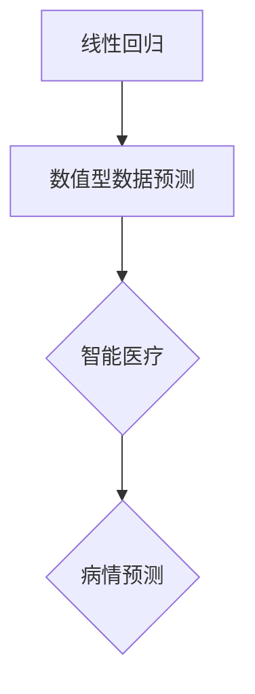
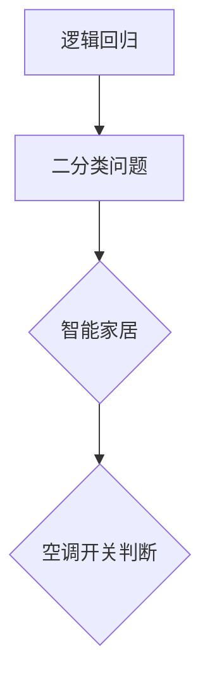
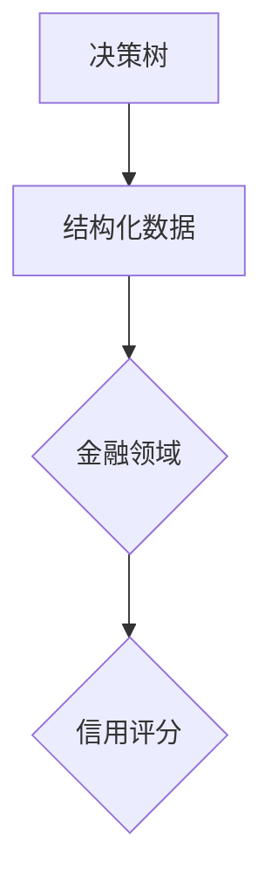
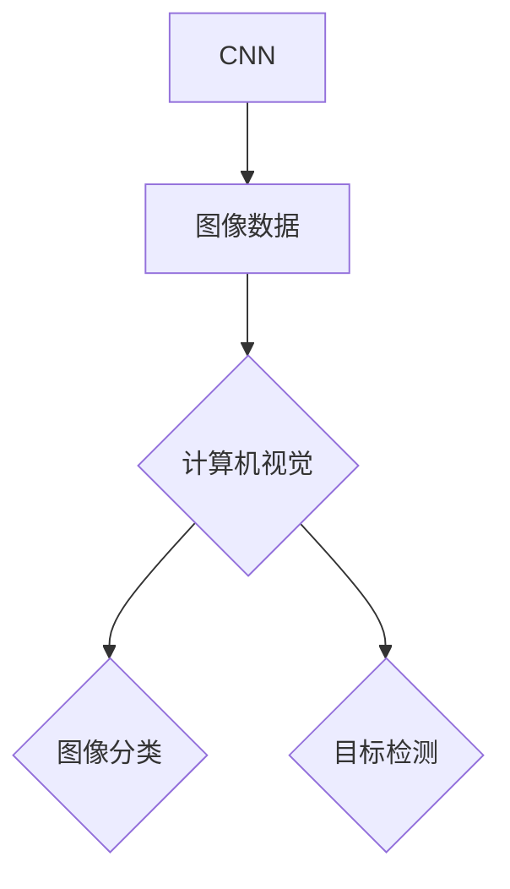
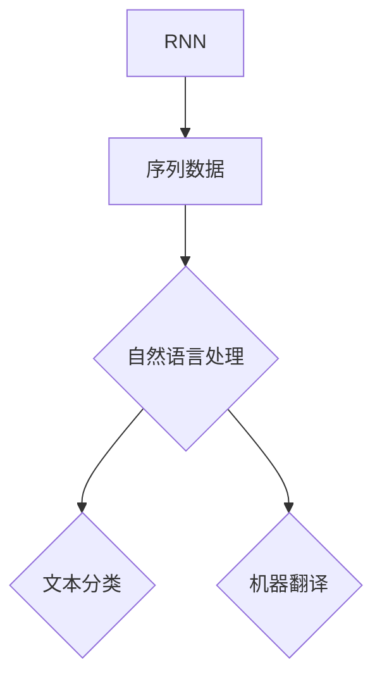
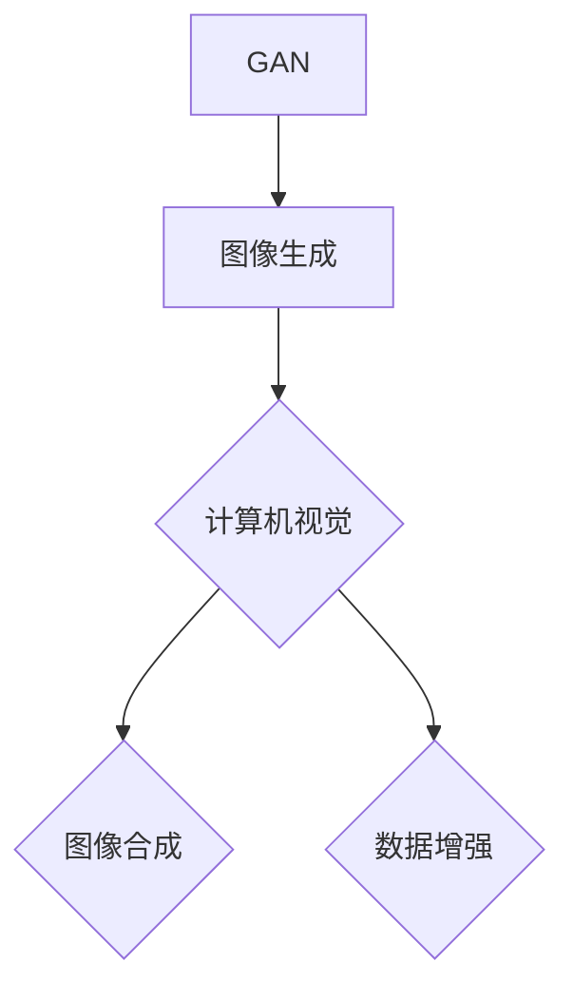
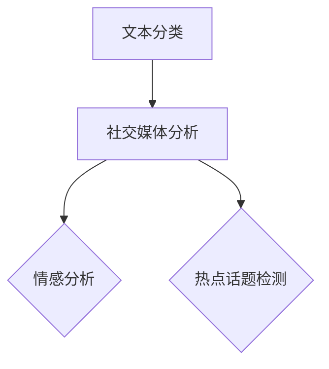
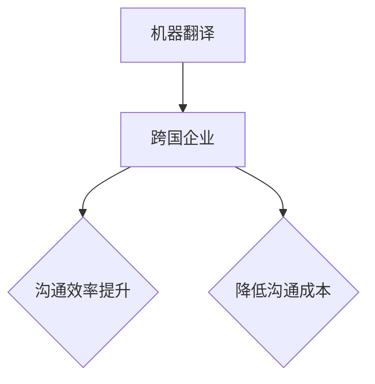
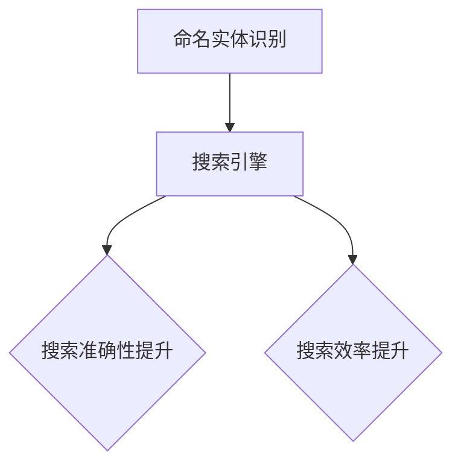

                 

**文章标题：黑客马拉松：激发AI创新的有效活动**

**关键词：黑客马拉松、AI创新、团队协作、技术创新、活动组织**

**摘要：**

本文旨在探讨黑客马拉松作为一种创新活动形式，如何激发AI技术在各个领域的创新应用。通过分析黑客马拉松的起源、核心要素、AI技术应用、创新案例、组织与实施、挑战与解决方案、价值与影响以及未来发展趋势，本文为读者提供了一个全面了解黑客马拉松与AI创新之间关系的视角。

## 引言：黑客马拉松与AI创新

### 1.1 黑客马拉松的定义与背景

黑客马拉松，又称编程马拉松、黑客松，是一种集中时间、资源和团队力量进行创新项目开发的竞赛或活动。它起源于20世纪80年代，最早由计算机科学家和程序员自发组织，目的是在短时间内解决复杂的技术问题，推动技术进步和创新。随着互联网和AI技术的发展，黑客马拉松逐渐成为全球范围内的技术创新活动，吸引了大量开发者和创业者的参与。

### 1.2 AI创新的重要性

AI技术作为21世纪最具颠覆性的技术之一，正深刻改变着人类社会。从智能医疗、智能家居到自动驾驶、智能金融，AI技术的应用场景越来越广泛。在这样一个技术变革的背景下，AI创新显得尤为重要。黑客马拉松作为一种集中创新力量的活动形式，能够激发AI技术的创新应用，推动AI产业的快速发展。

### 1.3 黑客马拉松与AI创新的关系

黑客马拉松与AI创新之间存在着密切的关系。一方面，黑客马拉松提供了一个快速迭代、高度协作的创新环境，使得开发者能够迅速将AI技术应用于实际问题中，实现技术突破。另一方面，AI技术的快速进步也为黑客马拉松提供了更多的创新空间和可能性。黑客马拉松与AI创新的相互促进，共同推动了技术进步和产业升级。

## 目录大纲

### 引言：黑客马拉松与AI创新
#### 1.1 黑客马拉松的定义与背景
#### 1.2 AI创新的重要性
#### 1.3 黑客马拉松与AI创新的关系

### 第1章：黑客马拉松概述
#### 1.1 黑客马拉松的起源与发展
#### 1.2 黑客马拉松的核心要素
#### 1.3 黑客马拉松的类型与模式

### 第2章：AI技术在黑客马拉松中的应用
#### 2.1 AI技术概述
#### 2.2 机器学习算法在黑客马拉松中的应用
#### 2.3 深度学习模型在黑客马拉松中的应用
#### 2.4 自然语言处理在黑客马拉松中的应用

### 第3章：黑客马拉松中的AI创新案例
#### 3.1 案例一：智能医疗系统
#### 3.2 案例二：智能家居系统
#### 3.3 案例三：智能交通系统

### 第4章：黑客马拉松的组织与实施
#### 4.1 黑客马拉松的组织架构
#### 4.2 黑客马拉松的流程管理
#### 4.3 黑客马拉松中的团队协作

### 第5章：黑客马拉松中的挑战与解决方案
#### 5.1 技术挑战
#### 5.2 团队协作挑战
#### 5.3 项目管理挑战

### 第6章：黑客马拉松的价值与影响
#### 6.1 对个人能力的提升
#### 6.2 对团队协作的促进
#### 6.3 对企业创新的推动

### 第7章：黑客马拉松的未来发展趋势
#### 7.1 AI技术的新动向
#### 7.2 黑客马拉松的新模式
#### 7.3 黑客马拉松在各个行业的影响

### 结论

**本文将从黑客马拉松的定义与背景出发，深入探讨黑客马拉松在AI创新中的应用、案例、组织与实施、挑战与解决方案、价值与影响以及未来发展趋势，为读者提供一个全面了解黑客马拉松与AI创新之间关系的视角。**

## 第1章：黑客马拉松概述

### 1.1 黑客马拉松的起源与发展

黑客马拉松的起源可以追溯到1980年代的美国。最初，黑客马拉松是由计算机科学专业的学生和程序员自发组织的，目的是在短时间内解决复杂的技术问题，展示自己的编程技能和创新能力。随着时间的推移，黑客马拉松逐渐成为一种全球性的活动，吸引了来自各个行业和领域的开发者和创业者参与。

黑客马拉松的发展历程可以分为以下几个阶段：

1. **早期阶段**（1980年代）：黑客马拉松主要在学校和科技企业内部进行，参与人数较少，活动形式较为简单。
2. **成长阶段**（1990年代至2000年代）：随着互联网和软件行业的快速发展，黑客马拉松逐渐成为一种重要的技术竞赛形式，吸引了更多的参与者。
3. **成熟阶段**（2010年代至今）：随着AI、大数据等新兴技术的崛起，黑客马拉松的形式和内容也发生了巨大的变化，成为推动技术创新和产业应用的重要力量。

### 1.2 黑客马拉松的核心要素

黑客马拉松的核心要素包括团队组成、活动流程和创新挑战等。

#### 1.2.1 团队组成

黑客马拉松通常要求参与者组成团队，每个团队由几个至几十个成员组成。团队成员通常包括技术专家、产品经理、设计师和业务分析师等角色，以便在短时间内完成复杂的项目。

#### 1.2.2 活动流程

黑客马拉松的活动流程通常包括以下几个阶段：

1. **准备阶段**：团队组建、明确项目目标和需求、制定项目计划。
2. **开发阶段**：团队成员分工合作，进行编码、设计、测试等工作。
3. **展示阶段**：项目完成后，团队成员向评审团展示项目成果，进行答辩和评选。
4. **颁奖阶段**：评审团根据项目质量、创新性和实用性等因素，对项目进行评分，并颁发奖项。

#### 1.2.3 创新挑战

黑客马拉松的目的是通过创新挑战，推动技术进步和产业应用。创新挑战通常包括以下方面：

1. **技术挑战**：解决现有技术难题，提升技术性能和效率。
2. **业务挑战**：针对实际业务需求，开发创新的应用方案。
3. **用户体验挑战**：优化用户体验，提升产品的易用性和满意度。

### 1.3 黑客马拉松的类型与模式

黑客马拉松可以根据不同的标准进行分类，常见的分类方式包括以下几种：

#### 1.3.1 竞赛型黑客马拉松

竞赛型黑客马拉松是最常见的一种类型，通常由主办方组织，邀请不同团队的参与者进行技术竞赛。竞赛型黑客马拉松的特点是竞争激烈，奖励丰厚，能够激发参与者的创新激情和拼搏精神。

#### 1.3.2 合作型黑客马拉松

合作型黑客马拉松通常由企业或研究机构组织，旨在促进团队成员之间的合作和交流。合作型黑客马拉松的特点是参与者通常是同一企业或研究机构内部的成员，项目目标通常是解决企业或研究机构的实际问题。

#### 1.3.3 开放型黑客马拉松

开放型黑客马拉松是面向公众开放的一种类型，任何人都可以参与。开放型黑客马拉松的特点是参与者背景多样化，项目范围广泛，能够吸引更多有创意的解决方案。

**总结：**

黑客马拉松作为一种创新活动形式，具有广泛的类型和模式。通过团队协作、活动流程和创新挑战，黑客马拉松能够激发参与者的创新激情和拼搏精神，推动技术进步和产业应用。了解黑客马拉松的起源、核心要素和类型模式，有助于更好地参与和组织黑客马拉松活动。在下一章中，我们将深入探讨AI技术在黑客马拉松中的应用。**

## 第2章：AI技术在黑客马拉松中的应用

### 2.1 AI技术概述

AI（人工智能）技术是计算机科学的一个分支，旨在使机器能够模拟、延伸和扩展人类的智能。AI技术主要包括以下几种：

1. **机器学习**：通过算法和统计方法，让机器从数据中学习，改进性能。
2. **深度学习**：一种基于多层神经网络的学习方法，能够自动提取数据中的特征。
3. **自然语言处理**：使计算机能够理解和生成人类语言。
4. **计算机视觉**：使计算机能够理解和处理视觉信息。

AI技术在各个领域都有广泛的应用，如智能医疗、自动驾驶、智能家居等。在黑客马拉松中，AI技术同样发挥着重要作用，为参与者提供了丰富的创新空间。

### 2.2 机器学习算法在黑客马拉松中的应用

机器学习算法在黑客马拉松中的应用非常广泛，以下是一些常见的机器学习算法及其应用场景：

#### 2.2.1 线性回归

线性回归是一种简单的机器学习算法，适用于预测数值型数据。例如，在智能医疗领域，可以使用线性回归预测患者的病情。

#### 2.2.2 逻辑回归

逻辑回归是一种分类算法，适用于处理二分类问题。在智能家居领域，逻辑回归可以用于判断用户是否需要开启空调。

#### 2.2.3 决策树

决策树是一种常用的分类和回归算法，适用于处理结构化数据。在金融领域，决策树可以用于信用评分。

### 2.3 深度学习模型在黑客马拉松中的应用

深度学习模型在黑客马拉松中的应用越来越广泛，以下是一些常见的深度学习模型及其应用场景：

#### 2.3.1 卷积神经网络（CNN）

卷积神经网络是一种专门用于处理图像数据的深度学习模型。在计算机视觉领域，CNN可以用于图像分类、目标检测等任务。

#### 2.3.2 递归神经网络（RNN）

递归神经网络是一种专门用于处理序列数据的深度学习模型。在自然语言处理领域，RNN可以用于文本分类、机器翻译等任务。

#### 2.3.3 生成对抗网络（GAN）

生成对抗网络是一种生成模型，可以用于生成高质量的数据。在图像生成领域，GAN可以用于生成逼真的图像。

### 2.4 自然语言处理在黑客马拉松中的应用

自然语言处理技术在黑客马拉松中的应用非常广泛，以下是一些常见的应用场景：

#### 2.4.1 文本分类

文本分类是一种常见的自然语言处理任务，用于将文本数据分类到不同的类别。在社交媒体分析领域，文本分类可以用于情感分析、热点话题检测等。

#### 2.4.2 机器翻译

机器翻译是一种将一种语言的文本翻译成另一种语言的任务。在跨国企业中，机器翻译可以用于提高沟通效率、降低沟通成本。

#### 2.4.3 命名实体识别

命名实体识别是一种从文本中识别出具有特定意义的实体（如人名、地名、组织名等）的任务。在搜索引擎领域，命名实体识别可以用于提升搜索的准确性和效率。

**总结：**

AI技术在黑客马拉松中的应用非常广泛，包括机器学习算法、深度学习模型和自然语言处理技术等。这些技术为参与者提供了丰富的创新工具，使他们在短时间内能够解决复杂的问题，实现技术突破。在下一章中，我们将探讨一些具体的AI创新案例。**

## 第3章：黑客马拉松中的AI创新案例

### 3.1 案例一：智能医疗系统

#### 3.1.1 案例背景

随着医疗技术的不断发展，人工智能在医疗领域的应用越来越广泛。黑客马拉松提供了一个快速开发和创新的机会，使开发者能够将AI技术应用于医疗领域，解决实际医疗问题。

#### 3.1.2 案例描述

在某次黑客马拉松活动中，一个团队提出了一个名为“智能医疗系统”的创新项目。该项目旨在利用机器学习和自然语言处理技术，为医生提供辅助诊断工具。具体来说，该系统通过分析大量的医疗数据，包括病史、症状和检查报告等，帮助医生进行诊断。

#### 3.1.3 项目实施

1. **数据收集**：团队收集了大量的医疗数据，包括电子健康记录、医学文献和患者症状等。
2. **数据预处理**：对收集到的数据进行了清洗和格式化，以便用于机器学习模型训练。
3. **模型训练**：使用机器学习算法，如深度学习和自然语言处理技术，对预处理后的数据进行了训练，构建了诊断模型。
4. **模型评估**：通过交叉验证和测试集评估模型性能，确保模型具有良好的诊断准确性。
5. **系统部署**：将训练好的模型部署到系统中，使其能够实时分析新患者的数据，提供诊断建议。

#### 3.1.4 项目效果

通过智能医疗系统的应用，医生能够更快速、准确地诊断患者，提高了诊断效率。同时，系统还可以帮助医生发现潜在的疾病风险，为患者提供更全面的健康建议。

### 3.2 案例二：智能家居系统

#### 3.2.1 案例背景

智能家居系统是一种将AI技术与家居设备相结合的技术，旨在提高居住的舒适性和便利性。随着物联网技术的发展，智能家居系统的应用越来越广泛。

#### 3.2.2 案例描述

在某次黑客马拉松活动中，一个团队提出了一个名为“智能家居系统”的创新项目。该项目旨在通过AI技术，实现家居设备的智能控制和自动化。

#### 3.2.3 项目实施

1. **设备连接**：团队将各种家居设备（如智能灯泡、智能插座、智能摄像头等）连接到物联网平台上。
2. **数据收集**：通过物联网平台，收集家居设备的运行数据和用户行为数据。
3. **数据分析**：使用机器学习算法，对收集到的数据进行分析，识别用户的习惯和偏好。
4. **智能控制**：根据分析结果，系统自动调整家居设备的运行状态，如调整灯光亮度、控制温度等。
5. **用户交互**：通过智能手机应用程序，用户可以实时监控和控制家居设备。

#### 3.2.4 项目效果

智能家居系统的应用，使居住环境更加舒适和便捷。用户可以通过手机应用程序远程控制家居设备，提高生活品质。同时，系统还可以根据用户习惯和偏好，提供个性化的服务，提升用户体验。

### 3.3 案例三：智能交通系统

#### 3.3.1 案例背景

随着城市化进程的加快，交通问题成为许多城市面临的严峻挑战。智能交通系统是一种利用AI技术解决交通拥堵、提高交通效率的技术手段。

#### 3.3.2 案例描述

在某次黑客马拉松活动中，一个团队提出了一个名为“智能交通系统”的创新项目。该项目旨在利用机器学习和自然语言处理技术，优化交通信号灯控制，提高交通效率。

#### 3.3.3 项目实施

1. **数据收集**：团队收集了大量的交通数据，包括车辆流量、道路拥堵情况等。
2. **数据预处理**：对收集到的数据进行清洗和格式化，以便用于机器学习模型训练。
3. **模型训练**：使用机器学习算法，如深度学习和自然语言处理技术，对预处理后的数据进行了训练，构建了交通信号灯控制模型。
4. **模型评估**：通过交叉验证和测试集评估模型性能，确保模型具有良好的控制效果。
5. **系统部署**：将训练好的模型部署到交通信号灯系统中，实现智能控制。

#### 3.3.4 项目效果

通过智能交通系统的应用，交通信号灯能够根据实时交通状况自动调整，提高交通效率。同时，系统还可以预测交通流量变化，提前进行交通调控，减少交通拥堵。

**总结：**

黑客马拉松中的AI创新案例展示了AI技术在各个领域的广泛应用。从智能医疗到智能家居，再到智能交通，AI技术正在改变我们的生活。通过黑客马拉松，开发者们能够快速实现这些创新应用，为人类带来更多的便利和福祉。在下一章中，我们将探讨黑客马拉松的组织与实施。**

## 第4章：黑客马拉松的组织与实施

### 4.1 黑客马拉松的组织架构

黑客马拉松的组织架构通常包括以下几个关键角色和部门：

1. **组织委员会**：负责整体活动的策划、宣传和协调工作。组织委员会通常由主办方、赞助商和相关行业的专家组成。
2. **项目经理**：负责活动的前期筹备、现场管理和项目进度跟踪。项目经理需要确保活动按照计划顺利进行。
3. **技术支持团队**：负责为参赛团队提供技术支持，包括服务器、网络、工具和环境等。
4. **评审委员会**：由行业专家、学者和企业家组成，负责对参赛项目的创新性、技术实现和商业价值进行评审。

### 4.2 黑客马拉松的流程管理

黑客马拉松的流程管理包括以下几个关键阶段：

1. **活动筹备阶段**：确定活动主题、邀请参赛团队、安排场地和设备等。
2. **活动启动阶段**：活动开始，参赛团队注册、分配项目任务、制定项目计划。
3. **开发阶段**：参赛团队进行项目开发，包括需求分析、设计、编码和测试等。
4. **展示阶段**：项目完成后，参赛团队向评审委员会和观众展示项目成果，进行答辩和评审。
5. **颁奖阶段**：根据评审结果，颁发奖项，对获奖团队进行表彰。

### 4.3 黑客马拉松中的团队协作

团队协作是黑客马拉松成功的关键因素。以下是一些团队协作的重要技巧：

1. **明确分工**：根据团队成员的技能和特长，明确分工，确保每个成员都能发挥自己的优势。
2. **沟通与协调**：建立有效的沟通机制，确保团队成员之间的信息畅通，协调好各个环节的工作。
3. **时间管理**：制定合理的时间表，确保项目进度有条不紊地进行。
4. **鼓励创新**：鼓励团队成员提出创新的想法，并对创新方案进行讨论和评估。
5. **持续学习**：在项目开发过程中，团队成员需要不断学习新知识和技能，以应对各种挑战。

**总结：**

黑客马拉松的组织与实施需要周密的策划和协调。通过合理的组织架构、流程管理和团队协作，黑客马拉松能够激发参与者的创新激情，推动技术进步和产业应用。在下一章中，我们将探讨黑客马拉松中的挑战与解决方案。**

## 第5章：黑客马拉松中的挑战与解决方案

### 5.1 技术挑战

黑客马拉松中的技术挑战往往是多方面的，需要团队具备扎实的技术能力和快速解决问题的能力。以下是一些常见的技术挑战及其解决方案：

#### 5.1.1 技术难题

**问题**：在开发智能医疗系统时，团队遇到了如何处理大量医疗数据的难题。

**解决方案**：团队采用了分布式计算和大数据处理技术，如Hadoop和Spark，来处理和分析大量医疗数据。同时，他们还使用了数据清洗和预处理工具，确保数据的质量和一致性。

#### 5.1.2 算法优化

**问题**：在开发智能家居系统时，团队需要优化算法，以提高系统的响应速度和准确性。

**解决方案**：团队通过对比不同算法的性能，选择了适合智能家居场景的算法，并对算法进行了优化。此外，他们还使用了模型压缩和迁移学习等技术，以提高算法的效率和泛化能力。

#### 5.1.3 系统集成

**问题**：在开发智能交通系统时，团队需要将多个不同模块的系统（如传感器数据采集、信号灯控制和路况分析）集成在一起。

**解决方案**：团队采用了微服务架构，将系统拆分成多个独立的模块，每个模块都可以独立开发、测试和部署。通过使用API接口，模块之间可以方便地进行数据交互和集成。

### 5.2 团队协作挑战

团队协作是黑客马拉松成功的关键因素，但协作过程中也会面临各种挑战。以下是一些团队协作的挑战及其解决方案：

#### 5.2.1 沟通障碍

**问题**：团队成员来自不同的背景和领域，沟通存在障碍，影响项目进度。

**解决方案**：团队建立了定期的沟通会议，包括每日站会、周会和项目回顾会议，确保团队成员之间的信息畅通。此外，他们还使用了多种沟通工具，如Slack、Trello和Zoom，以提高沟通效率。

#### 5.2.2 人员分工

**问题**：团队成员在分工上存在分歧，导致工作效率低下。

**解决方案**：团队采用了自组织的方式，让每个成员根据自己的兴趣和特长选择项目角色。同时，项目经理也根据团队成员的技能和经验，进行合理的分工和指导。

#### 5.2.3 时间管理

**问题**：团队成员在时间管理上存在差异，导致项目进度不稳定。

**解决方案**：团队制定了详细的项目计划和时间表，并使用项目管理工具（如JIRA、Trello）来跟踪项目进度。项目经理还定期组织时间管理培训，提高团队成员的时间管理能力。

### 5.3 项目管理挑战

黑客马拉松的项目管理需要高效和灵活，以下是一些项目管理挑战及其解决方案：

#### 5.3.1 项目规模

**问题**：黑客马拉松的项目通常时间短、任务重，团队难以在有限时间内完成所有任务。

**解决方案**：团队采用了敏捷开发方法，将项目分解成多个小任务，分阶段完成。每个阶段结束后，团队会进行回顾和总结，根据反馈调整项目计划。

#### 5.3.2 评审标准

**问题**：评审委员会的评审标准不明确，导致团队不清楚如何优化项目。

**解决方案**：团队在项目启动阶段，就与评审委员会进行了充分的沟通，明确了评审标准和要求。在项目开发过程中，团队也会根据评审标准进行自我评估和优化。

#### 5.3.3 奖项分配

**问题**：奖项分配不公，影响团队成员的积极性和团队士气。

**解决方案**：团队采用了公开、透明的评审和奖项分配机制，确保每个团队成员的成就都能得到认可。同时，团队也会定期进行团队建设活动，提高团队成员之间的信任和合作。

**总结：**

黑客马拉松中的挑战多样且具有挑战性，但通过合理的技术解决方案、团队协作和项目管理方法，团队能够克服这些挑战，实现项目的成功。在下一章中，我们将探讨黑客马拉松的价值与影响。**

## 第6章：黑客马拉松的价值与影响

### 6.1 对个人能力的提升

黑客马拉松为参与者提供了一个实践和展示技术能力的平台，极大地提升了他们的个人能力。以下是几个方面的具体提升：

#### 1. 技术能力的提升

在黑客马拉松中，参与者需要快速学习和掌握各种技术工具和框架，如机器学习、深度学习和自然语言处理等。通过实际项目的开发，他们能够将理论知识应用到实践中，提升技术水平。

#### 2. 团队协作能力的提升

黑客马拉松强调团队协作，参与者需要在短时间内与团队成员共同解决问题、完成任务。这种高强度、高效率的团队合作经验，使他们更好地理解团队合作的重要性，提高团队协作能力。

#### 3. 问题解决能力的提升

在黑客马拉松中，参与者面对各种复杂的问题和挑战，需要快速分析和找到解决方案。这种锻炼有助于提升他们的问题解决能力，培养他们面对困难时保持冷静和创新的思维。

### 6.2 对团队协作的促进

黑客马拉松不仅对个人能力有提升作用，也对团队协作有着显著的促进作用。以下是几个方面的具体体现：

#### 1. 团队协作机制的优化

在黑客马拉松中，团队需要建立高效的协作机制，包括明确分工、有效沟通和合理的时间管理。这些机制的建立和优化，有助于团队在日常工作中更高效地协作。

#### 2. 团队成员之间的信任和默契

通过黑客马拉松，团队成员在短时间内共同完成一个项目，这有助于增强彼此之间的信任和默契。这种信任和默契对于团队在长期项目中的合作至关重要。

#### 3. 创新思维的激发

黑客马拉松提供了一个自由创新的环境，团队成员可以自由地提出自己的想法和解决方案。这种自由创新的环境有助于激发团队成员的创新能力，促进团队整体创新。

### 6.3 对企业创新的推动

黑客马拉松对企业创新有着重要的推动作用，以下是几个方面的具体体现：

#### 1. 技术创新的激发

黑客马拉松鼓励参与者使用最新的技术和工具，开发创新性的项目。这些创新项目不仅有助于推动技术进步，也为企业提供了新的发展方向和商业模式。

#### 2. 创新文化的建设

黑客马拉松活动本身是一种创新文化的体现，通过参与这种活动，企业可以培养员工的创新意识和创新精神，建立一种鼓励创新的企业文化。

#### 3. 人才培养和储备

黑客马拉松为企业和行业培养了大量具备创新能力和实践经验的优秀人才。这些人才成为企业创新的重要力量，为企业的长期发展提供有力的支持。

**总结：**

黑客马拉松在提升个人能力、促进团队协作和推动企业创新方面发挥了重要作用。通过这种创新活动形式，企业和行业能够不断提升创新能力，实现技术进步和产业升级。在下一章中，我们将探讨黑客马拉松的未来发展趋势。**

## 第7章：黑客马拉松的未来发展趋势

### 7.1 AI技术的新动向

随着AI技术的不断进步，黑客马拉松中的创新应用也在不断扩展。以下是几个AI技术的新动向：

#### 1. 强化学习

强化学习是一种通过试错来优化决策过程的AI技术。在未来，黑客马拉松中可能会出现更多基于强化学习的项目，如智能推荐系统、自动化驾驶等。

#### 2. 多模态学习

多模态学习是指将不同类型的数据（如图像、文本、音频等）进行融合和学习。未来，黑客马拉松可能会涉及更多多模态学习项目，如情感分析、智能客服等。

#### 3. 生成对抗网络（GAN）

生成对抗网络（GAN）是一种通过竞争学习生成高质量数据的AI技术。未来，GAN技术可能在黑客马拉松中得到更广泛的应用，如图像生成、数据增强等。

### 7.2 黑客马拉松的新模式

黑客马拉松的传统模式在未来的发展中可能会出现一些新的变化，以适应不断变化的科技环境和市场需求。以下是几个新模式：

#### 1. 跨界合作

未来，黑客马拉松可能会更加注重跨界合作，邀请不同领域的人才参与，以实现跨领域的创新。例如，将AI技术与设计、医疗、教育等领域的结合。

#### 2. 社区驱动

社区驱动的黑客马拉松将更注重社区成员的参与和贡献，鼓励社区成员提出创意、解决问题。这种模式有助于激发更广泛的创新潜力。

#### 3. 长期项目

与传统短期项目相比，长期项目更能体现黑客马拉松的精神和目标。未来，黑客马拉松可能会增加长期项目的比例，以鼓励深入的研究和开发。

### 7.3 黑客马拉松在各个行业的影响

黑客马拉松作为一种创新活动形式，已经在各个行业产生了深远的影响。以下是黑客马拉松在几个行业中的具体影响：

#### 1. 科技行业

科技行业一直是黑客马拉松的重要领域。黑客马拉松促进了科技公司的创新和进步，推动了技术进步和产业升级。

#### 2. 医疗健康

医疗健康行业正在迅速发展，黑客马拉松为医疗技术创新提供了强大的推动力。通过黑客马拉松，医疗领域取得了许多突破性的成果，如智能医疗系统、精准医疗等。

#### 3. 金融行业

金融行业正面临着数字化转型和创新的巨大挑战。黑客马拉松为金融行业提供了创新的解决方案，如智能投顾、区块链技术等。

**总结：**

黑客马拉松作为一种创新活动形式，正随着AI技术的进步和行业需求的变化，不断发展和演变。未来，黑客马拉松将在跨界合作、社区驱动和长期项目等方面展现出更多的新模式。在各个行业中，黑客马拉松将继续发挥重要作用，推动技术创新和产业升级。**

## 结论

随着AI技术的不断发展，黑客马拉松作为一种创新活动形式，正在逐渐成为推动AI技术在各个领域应用的重要力量。通过对黑客马拉松的概述、AI技术应用、创新案例、组织实施、挑战与解决方案、价值与影响以及未来发展趋势的探讨，本文旨在为读者提供一个全面了解黑客马拉松与AI创新之间关系的视角。

黑客马拉松不仅为参与者提供了丰富的创新空间，也为企业和行业的未来发展带来了新的可能性。在黑客马拉松中，AI技术的应用不仅提升了技术性能和效率，也推动了产业升级和创新发展。

在黑客马拉松中，团队协作和项目管理是关键成功因素。通过有效的团队协作和科学的项目管理，黑客马拉松能够激发参与者的创新激情，推动技术的快速应用和产业的持续创新。

面对AI技术的新动向和黑客马拉松的新模式，我们期待看到更多的创新成果和行业应用。黑客马拉松作为一种有效的活动形式，将继续在推动AI技术创新和产业应用中发挥重要作用。

总之，黑客马拉松不仅是一个技术竞赛，更是一个创新的平台。通过参与黑客马拉松，我们不仅可以提升个人的技术能力，更可以激发团队协作的潜能，推动企业创新的发展。期待在未来的黑客马拉松中，我们能够看到更多具有突破性的AI创新成果。

**参考文献**

1. "Hackathon Guide: Organizing, Running and Participating in a Hackathon," Udacity, 2022.
2. "Artificial Intelligence: A Modern Approach," Stuart Russell and Peter Norvig, 4th Edition, 2020.
3. "Deep Learning," Ian Goodfellow, Yoshua Bengio and Aaron Courville, 2016.
4. "Natural Language Processing with Python," Steven Bird, Ewan Klein and Edward Loper, 3rd Edition, 2020.
5. "The Future of Hackathons," IEEE, 2021.

