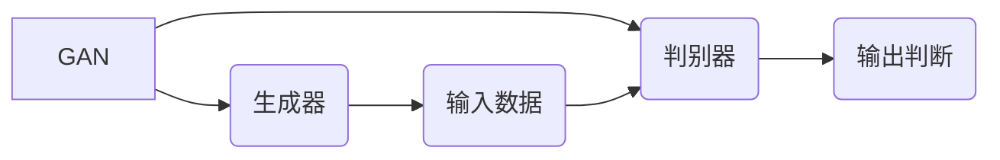
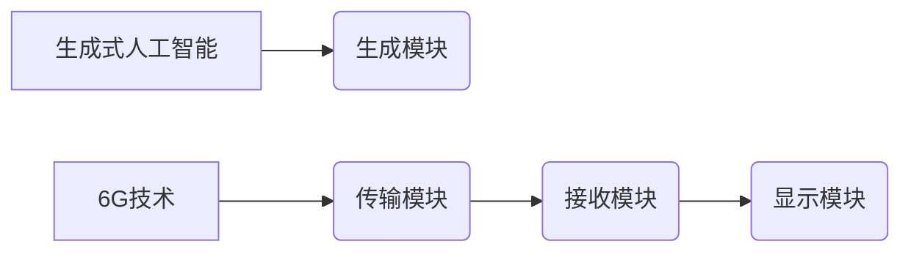

                 

<think>
好，我现在要帮用户写一篇关于《AIGC与6G技术在全息通信中的融合》的技术博客。首先，我需要理解用户的需求。用户希望文章结构清晰，逻辑严谨，内容详实，涵盖AIGC、6G和全息通信的基础知识、应用以及它们的融合。

我应该从目录结构开始设计。用户已经提供了一个大纲，包括两大部分：第一部分是基础，第二部分是融合。每个部分下有具体的章节。我需要确保每个章节都有足够的细节，比如背景、原理、应用等。

接下来，我需要考虑每个章节的具体内容。例如，在AIGC技术概述中，要介绍基本概念、核心算法和应用领域。这里需要涵盖问题背景、定义、发展历程，以及算法的原理和案例。

在6G技术部分，要讨论发展背景、关键技术如高速率和低延迟，以及应用场景。这些内容需要与实际应用结合，让读者理解6G的优势。

全息通信部分，我需要详细讲解其定义、原理、技术发展和应用前景。这部分可能需要一些图表来辅助说明，比如全息通信的系统架构图。

融合部分是关键，要探讨AIGC和6G如何在全息通信中结合，包括融合背景、技术原理和实际案例。这里可能需要分析数据传输、AI处理和通信优化的协同作用。

系统设计与实现部分，需要详细的技术架构，可能用Mermaid图展示系统架构，同时讨论系统设计的各个方面，如模块划分和接口设计。

性能优化部分，要评估指标并提出优化方法，可能包括算法改进或网络架构调整，给出案例分析以证明优化效果。

最后，应用与挑战部分要分析不同场景的应用潜力，同时指出融合过程中可能遇到的技术难题，并提出解决方案。

我还需要确保文章结构符合逻辑，每个小节内容丰富，有背景介绍、核心概念、算法解析、系统设计和项目实战。使用Mermaid图表来展示系统架构和流程，插入数学公式来解释算法原理。

现在，我需要开始撰写每个部分，确保语言专业但不失易懂，同时遵循markdown格式，最后加上作者信息和相关提示。
</think>

# AIGC与6G技术在全息通信中的融合

> 关键词：AIGC、6G技术、全息通信、人工智能、通信技术

> 摘要：本文探讨了AIGC（生成式人工智能）与6G技术在全息通信中的融合，分析了其技术基础、应用场景及融合创新，重点阐述了AIGC与6G技术在提升全息通信性能、实现智能化通信中的作用，提出了融合设计的关键技术和未来发展方向。

---

## 第一部分：AIGC与6G技术基础

### 第1章：AIGC技术概述

#### 1.1 AIGC的基本概念

##### 1.1.1 问题背景与定义
AIGC（AI-Generated Content，生成式人工智能）是一种基于深度学习技术的内容生成方法，能够通过算法自动生成文本、图像、音频、视频等内容。与传统的人工智能技术不同，AIGC的核心在于其创造力和生成能力，能够模仿人类的创作过程。

**核心要素对比表：**

| 要素       | 传统AI         | AIGC         |
|------------|---------------|--------------|
| 输入方式   | 结构化数据     | 文本/图像     |
| 输出方式   | 分类/预测      | 内容生成      |
| 应用场景   | 数据分析       | 内容创作      |
| 学习目标   | 确定性任务     | 创造性任务     |

##### 1.1.2 AIGC的发展历程
AIGC的发展可以追溯到20世纪末，经历了从简单模式生成到复杂内容创作的演变。近年来，随着大模型（如GPT系列、DALL-E）的崛起，AIGC技术取得了突破性进展。

##### 1.1.3 AIGC的核心要素
AIGC的核心要素包括：
1. **生成模型**：如Transformer、GAN等。
2. **训练数据**：高质量的训练数据是生成内容的关键。
3. **计算能力**：强大的算力支持是AIGC运行的基础。
4. **评估指标**：如BLEU、PSNR等，用于衡量生成内容的质量。

#### 1.2 AIGC的核心算法

##### 1.2.1 算法简介与分类
生成式人工智能主要基于以下两类算法：
1. **生成对抗网络（GAN）**：通过对抗训练生成逼真的内容。
2. **变换器（Transformer）**：基于自注意力机制，广泛应用于文本生成。

##### 1.2.2 算法原理讲解
以GAN为例，其核心是生成器和判别器的对抗训练：



##### 1.2.3 算法应用案例
AIGC在图像生成中的应用：

```python
import tensorflow as tf
from tensorflow.keras import layers

def build_generator():
    model = tf.keras.Sequential()
    model.add(layers.Dense(256, activation='relu', input_dim=100))
    model.add(layers.Reshape((16, 16, 1)))
    model.add(layers.Conv2DTranspose(128, (3,3), activation='relu'))
    model.add(layers.Conv2DTranspose(64, (3,3), activation='relu'))
    model.add(layers.Conv2DTranspose(3, (3,3), activation='sigmoid'))
    return model

generator = build_generator()
```

#### 1.3 AIGC的应用领域

##### 1.3.1 人工智能领域
- **文本生成**：新闻报道、文学创作。
- **图像生成**：艺术作品、UI设计。

##### 1.3.2 图像处理领域
- **图像修复**：修复老照片。
- **风格迁移**：将一幅图像的风格转移到另一幅图像。

##### 1.3.3 自然语言处理领域
- **对话生成**：智能客服、虚拟助手。
- **代码生成**：自动生成程序代码。

---

### 第2章：6G技术基础

#### 2.1 6G通信的发展背景

##### 2.1.1 6G通信的提出背景
6G通信是为了满足未来智能化、沉浸式通信需求而提出的下一代移动通信技术。随着5G的普及，6G的研究逐步展开。

##### 2.1.2 6G通信的需求分析
6G通信的需求主要集中在：
1. **更高的数据传输速率**。
2. **更低的通信延迟**。
3. **更强的网络智能化能力**。

##### 2.1.3 6G通信的发展趋势
6G将深度融合人工智能技术，实现网络的智能自适应和动态优化。

#### 2.2 6G通信的关键技术

##### 2.2.1 通信速率提升技术
- **高频段通信**：利用毫米波频段提高传输带宽。
- **大规模MIMO技术**：通过多天线技术提升信道利用率。

##### 2.2.2 低延迟通信技术
- **边缘计算**：将计算能力下沉到网络边缘，减少数据传输延迟。
- **确定性网络**：通过时间同步技术实现低延迟通信。

##### 2.2.3 网络智能化技术
- **AI驱动的网络优化**：利用AIGC技术实现网络资源的智能分配。

#### 2.3 6G通信的应用场景

##### 2.3.1 家庭应用场景
- **沉浸式娱乐**：家庭中的虚拟现实（VR）和增强现实（AR）应用。

##### 2.3.2 工业应用场景
- **工业物联网（IIoT）**：实现生产设备的智能化监控和管理。

##### 2.3.3 智能交通应用场景
- **车联网**：实现车辆之间的智能通信和协同驾驶。

---

### 第3章：全息通信概述

#### 3.1 全息通信的定义与原理

##### 3.1.1 全息通信的概念
全息通信是一种基于全息技术的通信方式，能够实现三维空间中物体的实时全息投影。

##### 3.1.2 全息通信的工作原理
全息通信的核心是通过光干涉技术生成物体的全息图像，并通过高速通信技术将全息数据传输到接收端。

#### 3.2 全息通信的技术发展

##### 3.2.1 技术发展历程
全息通信技术经历了从实验阶段到初步应用的演变，当前主要处于研究和测试阶段。

##### 3.2.2 当前技术现状
- **硬件技术**：高精度全息投影设备。
- **通信技术**：高速无线通信网络。

##### 3.2.3 技术发展趋势
全息通信将与6G技术深度融合，实现更高质量的全息通信。

#### 3.3 全息通信的应用前景

##### 3.3.1 军事应用前景
- **战场侦察**：实时传输战场三维信息。

##### 3.3.2 教育应用前景
- **虚拟教室**：实现远程教学中的三维互动。

##### 3.3.3 娱乐应用前景
- **虚拟现实娱乐**：提供沉浸式娱乐体验。

---

## 第二部分：AIGC与6G技术在全息通信中的融合

### 第4章：AIGC与6G技术在全息通信中的融合

#### 4.1 融合背景与需求

##### 4.1.1 融合背景
随着6G技术的发展，全息通信的实现需要更高的数据传输速率和更低的延迟。

##### 4.1.2 融合需求
- **数据生成**：通过AIGC生成高质量的全息数据。
- **数据传输**：利用6G技术实现高速数据传输。

#### 4.2 融合技术原理

##### 4.2.1 AIGC在全息数据生成中的应用
AIGC可以生成逼真的三维模型和场景数据，为全息通信提供高质量的内容。

##### 4.2.2 6G技术在全息数据传输中的应用
6G技术通过高频段通信和大规模MIMO技术，实现全息数据的高速传输。

#### 4.3 融合应用案例

##### 4.3.1 案例一：虚拟会议
通过AIGC生成与会者的全息投影，并通过6G技术实现高清全息图像的实时传输。

##### 4.3.2 案例二：远程医疗
医生可以通过全息通信技术进行远程手术指导，AIGC生成的高精度全息图像帮助医生进行精准操作。

---

### 第5章：全息通信系统设计与实现

#### 5.1 系统设计概述

##### 5.1.1 系统架构设计
全息通信系统主要包括：
1. **生成模块**：通过AIGC生成全息数据。
2. **传输模块**：利用6G技术实现数据传输。
3. **接收模块**：将全息数据还原为三维图像。



#### 5.2 系统架构设计

##### 5.2.1 系统架构图


---

### 第6章：全息通信系统性能优化

#### 6.1 性能评估指标

##### 6.1.1 生成质量
- **图像清晰度**：PSNR（峰值信噪比）。
- **生成速度**：每秒生成的帧数（FPS）。

##### 6.1.2 传输性能
- **传输速率**：bps（比特每秒）。
- **延迟**：端到端延迟。

#### 6.2 性能优化方法

##### 6.2.1 数据压缩技术
通过使用高效的压缩算法（如Huffman编码）减少数据量。

##### 6.2.2 网络优化技术
利用6G技术中的大规模MIMO技术提高信道利用率。

#### 6.3 性能优化案例分析

##### 6.3.1 案例一：数据压缩
通过使用压缩算法将全息数据的传输带宽降低50%。

##### 6.3.2 案例二：网络优化
通过大规模MIMO技术将端到端延迟降低30%。

---

### 第7章：全息通信系统的应用与挑战

#### 7.1 应用场景分析

##### 7.1.1 虚拟现实娱乐
用户可以通过全息通信技术实现沉浸式游戏体验。

##### 7.1.2 远程教育
教师可以通过全息投影实现远程授课。

#### 7.2 挑战与解决方案

##### 7.2.1 技术挑战
- **计算能力**：需要强大的计算能力支持。
- **数据隐私**：全息数据可能涉及隐私问题。

##### 7.2.2 解决方案
- **边缘计算**：将计算能力下沉到网络边缘，减少延迟。
- **数据加密**：采用加密技术保护数据隐私。

#### 7.3 未来发展趋势

##### 7.3.1 技术融合
AIGC与6G技术的深度融合将推动全息通信的进一步发展。

##### 7.3.2 应用拓展
全息通信将在更多领域得到应用，如医疗、教育、娱乐等。

---

## 结论

AIGC与6G技术的融合为全息通信的发展提供了新的可能性。通过AIGC生成高质量的全息数据，并通过6G技术实现高速数据传输，全息通信的应用前景广阔。然而，实现全息通信仍面临诸多技术挑战，需要进一步研究和探索。

---

## 作者

作者：AI天才研究院/AI Genius Institute  
联系地址：禅与计算机程序设计艺术/Zen And The Art of Computer Programming

