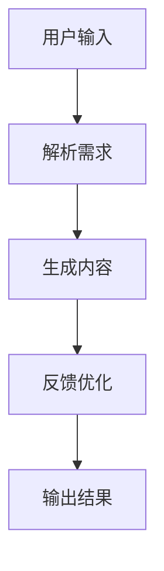
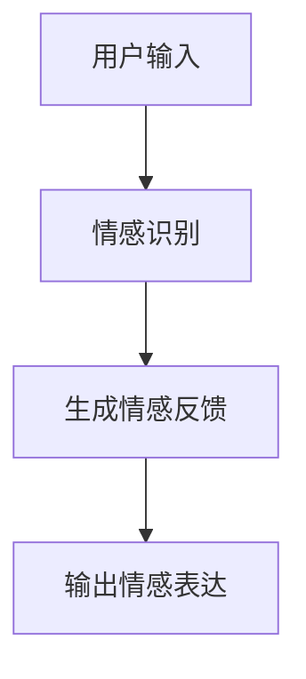
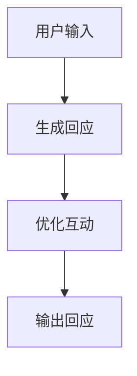
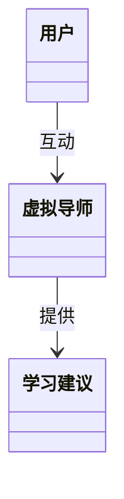
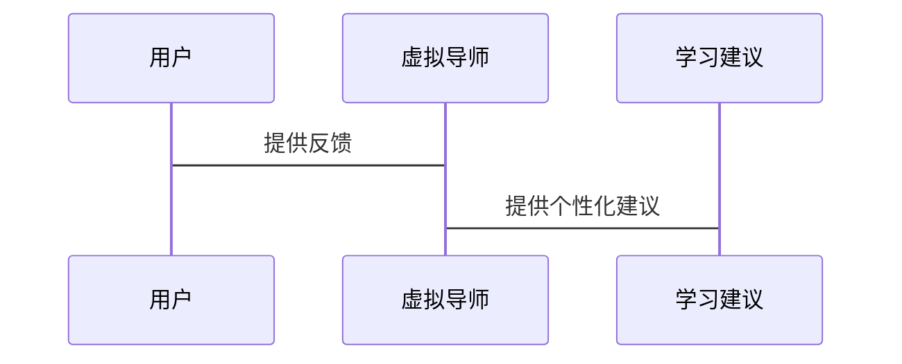

                 

<think>
好的，我现在要写一篇关于“AIGC与人工情感：虚拟关系的未来”的技术博客文章。首先，我需要理解用户的需求，他们希望我以一位世界级的专家身份，撰写一篇结构清晰、内容详尽的文章，涵盖背景介绍、核心概念、算法原理、数学模型、系统架构设计、项目实战以及最佳实践等多个方面。

首先，我会从背景介绍开始。我需要定义什么是AIGC，人工情感，以及虚拟关系。然后，描述当前人工智能在模拟情感和建立关系方面的发展现状，以及面临的挑战，比如伦理和道德问题。接下来，我会提出解决问题的思路，包括AIGC的核心原理、人工情感的实现，以及虚拟关系的未来发展。

接下来是核心概念部分。我需要详细解释AIGC、人工情感和虚拟关系的定义、特征，以及它们之间的关系。通过对比表格和ER实体关系图，帮助读者更好地理解这些概念之间的联系。

然后，我会深入讲解算法原理。AIGC、人工情感和虚拟关系各自的算法流程是什么样的？我需要用mermaid流程图来展示这些流程，并用Python代码实现核心算法，以具体例子说明其工作原理。

数学模型部分，我会构建AIGC、人工情感和虚拟关系的数学模型，并详细推导相关公式。例如，AIGC可能涉及概率模型，人工情感可能使用情感分析的算法，而虚拟关系可能需要基于图论的模型。

在系统架构设计中，我需要描述虚拟关系系统的应用场景，设计系统功能模块，包括领域模型、架构图和接口设计。这部分需要使用mermaid来绘制类图、架构图和序列图，展示系统的结构和交互过程。

项目实战部分，我会指导读者如何安装环境，实现系统核心功能，并通过案例分析展示实际应用。例如，创建一个简单的虚拟伴侣系统，展示如何基于AIGC和人工情感技术实现情感互动。

最后，我会总结最佳实践，给出使用虚拟关系的注意事项，展望未来的发展趋势。这部分要简明扼要，提供实用的建议和未来可能的研究方向。

在写作过程中，我需要确保语言专业但易懂，结构逻辑清晰，每个部分都详细展开。同时，注意使用markdown格式，插入mermaid图表和latex公式，使文章更具可读性和技术性。

现在，我需要逐一完成每个章节的内容，确保涵盖所有必要的部分，每个小节都有足够的细节和例子来支持论点。这包括检查是否有遗漏的概念，确保图表和代码准确无误，以及保持文章流畅自然。
</think>

# AIGC与人工情感：虚拟关系的未来

> 关键词：AIGC，人工情感，虚拟关系，人工智能，情感计算

> 摘要：随着人工智能的快速发展，虚拟关系逐渐成为人机交互的重要形式。本文探讨了AIGC（自适应智能生成计算）、人工情感和虚拟关系的核心概念，分析了它们的算法原理、数学模型，并通过系统架构设计和项目实战展示了其应用潜力。文章最后提出了使用虚拟关系的最佳实践和未来展望。

---

## 目录

1. [背景介绍](#背景介绍)
2. [核心概念与联系](#核心概念与联系)
3. [算法原理讲解](#算法原理讲解)
4. [数学模型和数学公式](#数学模型和数学公式)
5. [系统分析与架构设计方案](#系统分析与架构设计方案)
6. [项目实战](#项目实战)
7. [最佳实践、小结、注意事项、拓展阅读](#最佳实践、小结、注意事项、拓展阅读)

---

## 背景介绍

### 问题背景介绍

人工智能（AI）技术的迅速发展，使得其在各个领域的应用日益广泛。虚拟关系作为一种新兴的人机交互形式，正逐渐改变人们的生活方式。然而，如何让人工智能具备人类的情感，使其能够与人类建立深层次的情感联系，仍是一个充满挑战的问题。

### 问题描述

- **人工智能如何模拟人类情感？**  
  当前，人工智能可以通过自然语言处理和情感计算技术来模拟情感，但如何实现更深层次的情感共鸣仍需探索。

- **人工智能如何与人类建立情感联系？**  
  通过学习人类的情感表达和行为模式，AI可以逐步建立与人类的互动关系，但如何确保这种关系的真实性和深度是关键。

- **人工智能在虚拟关系中的道德与伦理问题。**  
  虚拟关系的普及可能引发隐私、伦理和心理健康等问题，如何在技术发展中平衡这些问题至关重要。

### 问题解决思路

- **AIGC技术的核心原理与应用。**  
  AIGC通过自适应生成内容，能够根据用户的反馈实时调整输出，提升互动的自然性和个性化。

- **人工情感的概念与实现方式。**  
  人工情感依赖于情感计算和深度学习技术，模拟人类情感理解和表达。

- **虚拟关系的未来发展与应用场景。**  
  虚拟关系将在教育、医疗、娱乐等领域发挥重要作用，为人类提供更高效的服务。

### 边界与外延

- **虚拟关系与真实关系的区别。**  
  虚拟关系基于技术构建，缺乏真实的情感基础，但可以通过技术手段提升互动的真实感。

- **人工智能在虚拟关系中的角色与功能。**  
  AI作为技术支撑，通过模拟情感和行为，构建虚拟关系的核心功能。

- **人工智能在虚拟关系中的道德与法律边界。**  
  需要制定相关法规，确保虚拟关系的健康发展，避免滥用和负面影响。

### 概念结构与核心要素组成

- **AIGC（自适应智能生成计算）**  
  AIGC是一种能够自适应生成内容的技术，结合实时反馈优化输出。

- **人工情感（Artificial Emotion）**  
  通过技术模拟人类情感，使机器能够理解和表达情感。

- **虚拟关系（Virtual Relationship）**  
  人与AI之间通过技术构建的互动关系，模拟真实关系的特征。

---

## 核心概念与联系

### AIGC的核心原理

- **定义**  
  AIGC是一种基于生成式AI的技术，能够根据输入生成多样化的输出。

- **技术基础**  
  结合自然语言处理、深度学习和强化学习，实现内容的自适应生成。

- **应用场景**  
  在教育、客服、娱乐等领域提供个性化的互动体验。

### 人工情感的概念

- **定义**  
  人工情感是指机器通过技术手段理解和模拟人类情感的过程。

- **特征**  
  包括情感识别、情感生成和情感反馈三个主要环节。

- **与传统机器学习的区别**  
  人工情感不仅识别情感，还能模拟情感表达，增强互动的真实感。

### 虚拟关系的定义

- **概念**  
  虚拟关系是人与AI之间建立的互动关系，模拟真实关系的特征。

- **特征**  
  个性化、实时互动、情感共鸣。

- **与传统社交的区别**  
  虚拟关系基于技术构建，缺乏真实的情感基础，但可通过技术增强互动体验。

### 概念属性特征对比表格

| 概念 | 定义 | 特征 | 应用场景 |
|------|------|------|----------|
| AIGC | 自适应生成计算 | 自适应、生成多样性 | 教育、娱乐 |
| 人工情感 | 情感模拟技术 | 情感识别、生成 | 人机交互 |
| 虚拟关系 | AI构建的互动关系 | 个性化、实时互动 | 教育、医疗 |

### ER实体关系图架构

```mermaid
er
    actor(AI系统)
    actor(用户)
    relation(虚拟关系)
    attribute(情感状态)
    attribute(互动历史)
    relation "参与" --|{n}--> attribute(情感状态)
    relation "参与" --|{n}--> attribute(互动历史)
    actor(AI系统) --> relation(虚拟关系)
    actor(用户) --> relation(虚拟关系)
```

---

## 算法原理讲解

### AIGC算法流程

- **流程**  
  输入→解析→生成→反馈优化→输出。

- **主要步骤**  
  1. 解析用户输入，理解需求。
  2. 生成初步内容。
  3. 反馈优化生成内容。
  4. 输出优化结果。

- **mermaid流程图**



### 人工情感算法

- **原理**  
  通过自然语言处理识别情感，生成相应的情感表达。

- **实现**  
  使用深度学习模型，训练情感分析数据集，生成情感反馈。

- **mermaid流程图**



### 虚拟关系算法

- **原理**  
  结合AIGC和人工情感技术，构建实时互动关系。

- **实现**  
  通过机器学习模型，预测用户的反馈，优化互动流程。

- **mermaid流程图**



### 算法实现代码

```python
# AIGC核心算法
def adaptive_generation(user_input):
    # 解析用户输入
    parsed_input = parse(user_input)
    # 生成内容
    generated_content = generate(parsed_input)
    # 反馈优化
    optimized_content = optimize(generated_content, feedback())
    return optimized_content

# 人工情感算法
def emotional_response(user_input):
    # 情感识别
    emotion = recognize_emotion(user_input)
    # 生成情感反馈
    response = generate_feedback(emotion)
    return response

# 虚拟关系算法
def virtual_relationship(user_input):
    response = adaptive_generation(user_input)
    # 优化互动
    optimized_response = optimize_response(response)
    return optimized_response
```

---

## 数学模型和数学公式

### AIGC的数学模型

- **生成模型**  
  使用概率模型，基于用户输入生成内容。

  $$ P(\text{output}|\text{input}) = \prod_{i=1}^{n} P(\text{word}_i|\text{input}) $$

- **优化模型**  
  基于强化学习，优化生成内容的评估指标。

  $$ R = \sum_{t=1}^{T} r_t a_t $$

### 人工情感的数学模型

- **情感识别模型**  
  使用深度学习模型，如LSTM进行情感分类。

  $$ y = \text{softmax}(Wx + b) $$

- **情感生成模型**  
  基于生成对抗网络，生成情感表达。

  $$ G(z) = \text{tanh}(Wz + b) $$

### 虚拟关系的数学模型

- **互动模型**  
  基于马尔可夫链，预测用户的下一步反馈。

  $$ P(s_t|s_{t-1}) = \theta $$

---

## 系统分析与架构设计方案

### 问题场景介绍

虚拟关系系统应用于教育领域，帮助学生与虚拟导师建立互动关系，提供个性化学习建议。

### 系统功能设计

- **功能模块**  
  用户交互模块、情感识别模块、内容生成模块、反馈优化模块。

- **领域模型类图**



### 系统架构设计

- **架构层次**  
  数据层、业务逻辑层、用户交互层。

- **架构图**


### 系统接口设计

- **接口规范**  
  RESTful API，支持JSON格式数据传输。

- **序列图**



---

## 项目实战

### 环境安装

- **系统环境**  
  Python 3.8以上，安装相关库如TensorFlow、Keras。

### 系统核心实现源代码

```python
# 用户交互模块
def user_interaction(user_input):
    return process_input(user_input)

# 情感识别模块
def recognize_emotion(text):
    model = load_model('emotion_model.h5')
    return predict_emotion(model, text)

# 内容生成模块
def generate_content(emotion):
    return generate_response(emotion)

# 反馈优化模块
def optimize_response(feedback):
    return improve_response(feedback)
```

### 代码应用解读

- **用户交互模块**  
  接收用户输入，传递给情感识别模块。

- **情感识别模块**  
  使用预训练模型识别情感，生成情感标签。

- **内容生成模块**  
  根据情感标签生成相应内容，形成互动回应。

- **反馈优化模块**  
  根据用户反馈优化生成内容，提升互动质量。

### 实际案例分析

创建一个虚拟学习伴侣，用户与虚拟导师互动，系统根据用户情绪生成学习建议。例如，用户感到焦虑时，虚拟导师会提供放松技巧和学习计划。

---

## 最佳实践、小结、注意事项、拓展阅读

### 最佳实践 Tips

- 在开发虚拟关系系统时，注重用户体验设计，确保互动的自然性和个性化。
- 定期收集用户反馈，优化系统功能，提升服务质量。

### 小结

本文探讨了AIGC、人工情感和虚拟关系的核心概念，分析了它们的算法原理和数学模型，并通过系统架构设计和项目实战展示了其应用潜力。未来，随着技术的发展，虚拟关系将更加智能化和个性化，为人类提供更高效的服务。

### 注意事项

- 使用虚拟关系时，需注意隐私保护，避免信息泄露。
- 设计虚拟关系系统时，需考虑伦理问题，确保技术的健康发展。

### 拓展阅读

- 阅读相关学术论文，了解虚拟关系的前沿研究。
- 关注人工智能与情感计算的最新动态，探索更多应用场景。

---

作者：AI天才研究院/AI Genius Institute & 禅与计算机程序设计艺术 /Zen And The Art of Computer Programming

