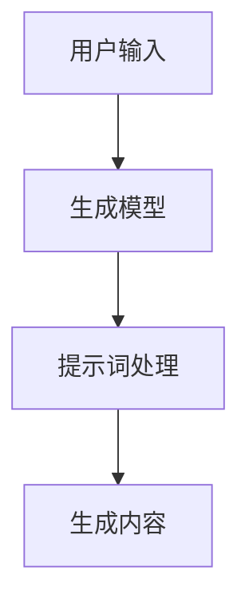
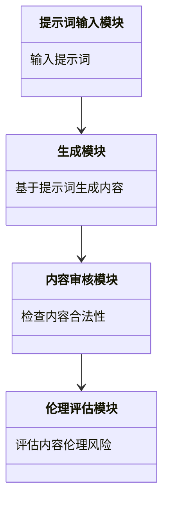
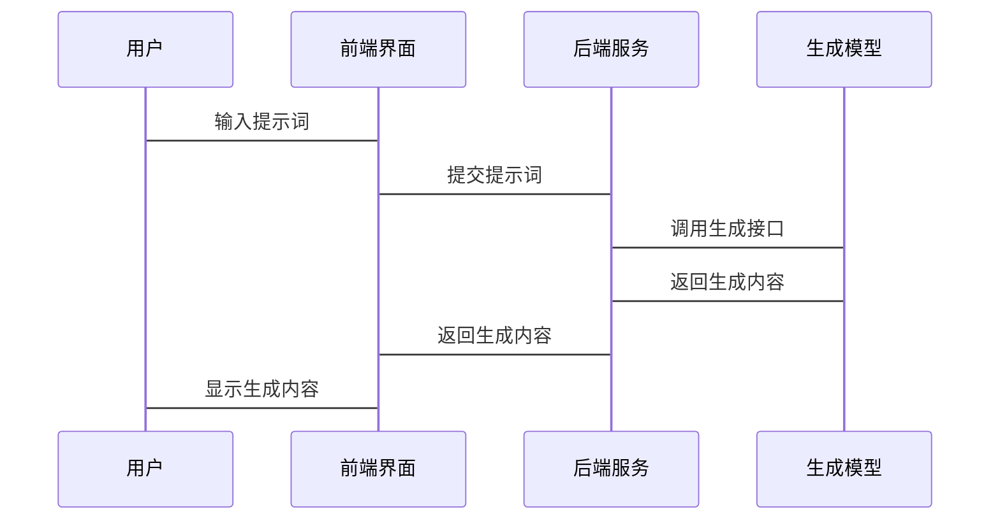

                 

<think>
好，我现在要帮用户完成一个技术博客文章的撰写任务。用户希望文章以《AIGC与人工智能伦理：提示词的重要性》为标题，内容要逻辑清晰、结构紧凑，使用专业且易懂的技术语言，同时需要详细分析和推理。用户还提供了详细的目录大纲，包括各个章节的内容，甚至要求每个部分都有具体的子章节，比如背景介绍、核心概念、算法原理、系统架构设计、项目实战以及最佳实践等。

首先，我需要理解用户的需求。用户希望我以一位技术专家的身份，撰写一篇高质量的技术博客，重点在于AIGC和人工智能伦理，特别是提示词的重要性。用户还强调文章结构要严格按照他们提供的大纲，每个章节都要详细展开，包含具体的技术分析和实例。

接下来，我需要从各个章节开始思考内容。首先是背景介绍，这部分要涵盖AIGC和人工智能伦理的概述，包括问题背景、描述、解决方法，以及边界和概念结构。这部分需要简明扼要地介绍基本概念，为后续章节打下基础。

然后是核心概念与联系，这里需要详细解释AIGC的原理以及它与伦理的联系。这部分可能需要包括AIGC的工作流程、核心算法，以及这些算法如何影响伦理问题。我需要确保这部分内容能够清晰展示技术与伦理之间的关系。

接下来是算法原理讲解，这部分是重点。用户要求详细分析提示词算法，包括基础、分析、流程图、Python代码和数学模型。我需要选择合适的算法进行解释，可能选一些常见的生成模型，如基于提示的生成方法，并详细描述其数学基础，确保读者能够理解。

然后是系统分析与架构设计方案，这部分需要构建系统的各个模块，设计架构，并展示接口和交互流程。我需要使用Mermaid图来展示系统架构和交互过程，这将帮助读者更好地理解系统的整体结构。

项目实战部分，用户要求提供环境安装、核心代码实现、案例分析和项目总结。这部分需要实际操作，可能需要选择一个具体的AIGC项目，展示代码，并分析实际案例，强调提示词在其中的作用。

最后是最佳实践与总结，这部分要给出开发中的实用建议，总结核心观点，并提醒注意事项，以及推荐进一步阅读的资源。

在撰写过程中，我需要确保每个部分都符合用户的要求，使用正确的技术术语，同时保持语言的清晰和易懂。特别是数学公式和代码部分，必须准确无误，并正确使用LaTeX和Python语法。此外，Mermaid图表需要正确嵌入，展示系统的结构和流程。

现在，我开始撰写每个章节的内容，确保逻辑连贯，每个部分都有足够的细节和例子，帮助读者深入理解AIGC和提示词在人工智能伦理中的重要性。在写作过程中，我需要反复检查，确保内容完整，符合用户的字数要求，大约1万到1万2千字左右。

最后，完成所有内容后，我会在文章末尾添加作者信息，符合用户指定的格式。整个思考过程需要一步步来，确保每个部分都详细展开，满足用户的所有要求。
</think>

# AIGC与人工智能伦理：提示词的重要性

## 关键词
人工智能伦理, AIGC, 提示词, 算法原理, 系统架构

## 摘要
人工智能生成内容（AIGC）的快速发展引发了关于人工智能伦理的重要讨论。提示词作为AIGC系统的核心输入，直接影响生成内容的质量、安全性和伦理性。本文从背景介绍、核心概念、算法原理、系统架构设计、项目实战等多个维度深入分析提示词在AIGC中的重要性，并探讨其对人工智能伦理的影响。通过详细的技术分析和实际案例，本文为读者提供了全面理解AIGC与人工智能伦理的框架。

---

## 第一部分：背景介绍

### 第1章：AIGC与人工智能伦理概述

#### 1.1 问题背景
- **人工智能（AI）技术的发展**：AI技术的快速发展推动了AIGC的兴起，使其在内容生成、图像生成等领域广泛应用。
- **AIGC的兴起**：AIGC通过自然语言处理和生成模型，能够生成高质量的文字、图像和视频内容，极大地改变了内容创作的方式。
- **人工智能伦理的重要性**：随着AI技术的广泛应用，伦理问题日益凸显，尤其是在内容生成领域，如何确保生成内容的正确性、合法性和伦理性成为关键问题。

#### 1.2 问题描述
- **人工智能伦理的核心问题**：包括隐私保护、算法偏见、内容真实性等问题。
- **提示词在人工智能系统中的作用**：提示词是AIGC系统的重要输入，决定了生成内容的方向和风格，同时也影响系统的伦理表现。

#### 1.3 问题解决
- **人工智能伦理的基本原则**：包括透明性、可解释性、公平性和伦理性。
- **提示词对AI系统的影响和控制**：通过设计合理的提示词，可以有效控制生成内容的方向，避免伦理风险。

#### 1.4 边界与外延
- **AIGC的应用范围**：包括文本生成、图像生成、视频生成等。
- **人工智能伦理的全球发展趋势**：不同国家和地区对AI伦理的规范和监管存在差异，但总体趋势是趋严。

#### 1.5 概念结构与核心要素组成
- **AIGC的定义与核心要素**：AIGC是指通过AI算法生成的内容，其核心要素包括生成模型、提示词、输入数据和输出结果。
- **人工智能伦理的主要概念**：包括数据隐私、算法公平性、内容真实性等。

---

## 第二部分：核心概念与联系

### 第2章：AIGC原理与伦理联系

#### 2.1 AIGC原理
- **AIGC技术概述**：AIGC基于深度学习模型（如GPT、BERT等），通过输入提示词生成输出内容。
- **AIGC的工作流程**：包括输入提示词、模型推理、生成内容输出。
- **AIGC的核心算法**：基于大语言模型的生成算法，如Transformer架构。

#### 2.2 伦理联系
- **人工智能伦理的基本原则**：包括透明性、可解释性、公平性和伦理性。
- **AIGC中的伦理问题**：包括生成虚假信息、内容侵权、算法偏见等问题。
- **AIGC与伦理的相互影响**：提示词的设计直接影响生成内容的伦理风险，同时伦理问题也反过来影响AIGC系统的开发和使用。

---

## 第三部分：算法原理讲解

### 第3章：提示词算法原理

#### 3.1 提示词算法基础
- **提示词的定义**：提示词是用户输入的文本或指令，用于指导生成模型生成特定内容。
- **提示词的作用**：通过提示词，用户可以控制生成内容的方向、风格和主题。

#### 3.2 提示词算法分析
- **提示词的生成方法**：包括关键词提取、模板生成和情感引导等方法。
- **提示词的优化策略**：包括提示词的长度、复杂度和具体性对生成结果的影响。

#### 3.3 算法Mermaid流程图


#### 3.4 Python源代码实现
```python
def generate_content(prompt):
    # 示例代码：基于提示词生成内容
    import openai
    response = openai.Completion.create(
        model="gpt-3.5-turbo",
        prompt=prompt
    )
    return response.choices[0].message['content']
```

#### 3.5 算法原理的数学模型和公式
- **生成模型的概率分布**：生成模型通过概率分布来预测下一个字符的概率，公式为：
  $$ P(y|x) = \frac{P(x,y)}{P(x)} $$
- **损失函数的优化**：生成模型通过最小化损失函数来优化参数，公式为：
  $$ \text{Loss} = -\sum_{i=1}^{n} \log P(y_i|x_{<i}) $$

---

## 第四部分：系统分析与架构设计方案

### 第4章：AIGC与伦理架构设计

#### 4.1 问题场景介绍
- **AIGC在现实中的应用场景**：包括新闻生成、广告创意、客户服务等领域。
- **伦理问题的场景化表现**：例如生成虚假新闻、误导性广告等。

#### 4.2 系统功能设计
- **系统功能模块的划分**：包括提示词输入模块、生成模块、内容审核模块和伦理评估模块。
- **领域模型Mermaid类图**


#### 4.3 系统架构设计
- **系统的总体架构**：包括前端界面、后端服务和生成模型。
- **系统架构Mermaid图**


#### 4.4 系统接口设计
- **系统各部分的接口**：包括提示词输入接口、生成结果输出接口和伦理评估接口。

#### 4.5 系统交互Mermaid序列图


---

## 第五部分：项目实战

### 第5章：提示词在AIGC中的应用实战

#### 5.1 环境安装
- **必需的环境和工具**：安装Python、OpenAI API、深度学习框架（如TensorFlow或PyTorch）。

#### 5.2 系统核心实现源代码
```python
import openai

def generate_content(prompt):
    response = openai.Completion.create(
        model="gpt-3.5-turbo",
        prompt=prompt
    )
    return response.choices[0].message['content']

# 示例使用
print(generate_content("写一篇关于人工智能的文章"))
```

#### 5.3 代码应用解读与分析
- **代码功能解读**：上述代码通过OpenAI API调用生成模型，根据提示词生成内容。
- **代码实现细节**：包括模型选择、提示词处理和生成结果的返回。

#### 5.4 实际案例分析和详细讲解剖析
- **案例分析**：例如，使用提示词“写一篇关于气候变化的文章”生成内容，并分析生成内容的准确性和伦理风险。
- **详细讲解**：通过具体案例展示提示词对生成内容的影响，以及如何通过提示词控制伦理风险。

#### 5.5 项目小结
- **项目总结**：总结提示词在AIGC中的重要性，以及如何通过提示词设计控制生成内容的伦理风险。
- **项目反思**：反思当前AIGC系统中存在的伦理问题，并提出改进建议。

---

## 第六部分：最佳实践与总结

### 第6章：AIGC与人工智能伦理的最佳实践

#### 6.1 最佳实践 tips
- **AIGC开发的实用技巧**：包括合理设计提示词、加强内容审核、建立伦理评估机制等。
- **提示词设计建议**：明确提示词的范围和目标，避免模糊或歧义的提示词。

#### 6.2 小结
- **AIGC与人工智能伦理的核心观点**：提示词是AIGC系统的关键输入，直接影响生成内容的伦理性和质量。通过合理设计提示词和加强系统架构，可以有效降低伦理风险。

#### 6.3 注意事项
- **开发AIGC时应注意的问题**：包括数据隐私保护、算法公平性、内容真实性等问题。
- **提示词设计中的伦理考量**：避免生成虚假信息、歧视性内容和误导性信息。

#### 6.4 拓展阅读
- **推荐的进一步学习资源**：包括相关学术论文、技术博客和书籍，例如《人工智能伦理与治理》、《生成式AI的原理与应用》等。

---

作者：AI天才研究院/AI Genius Institute & 禅与计算机程序设计艺术 /Zen And The Art of Computer Programming

