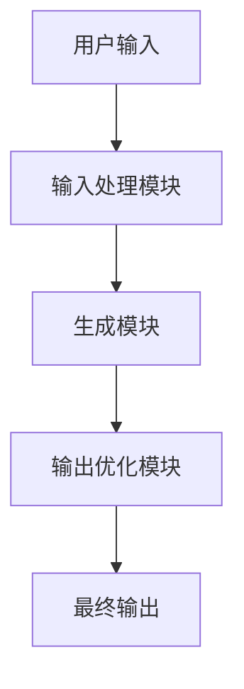
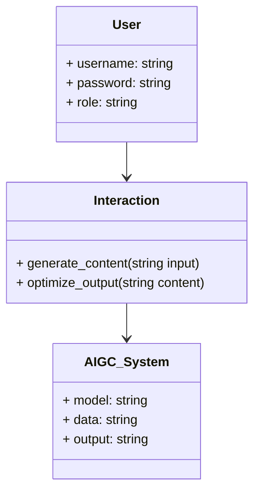
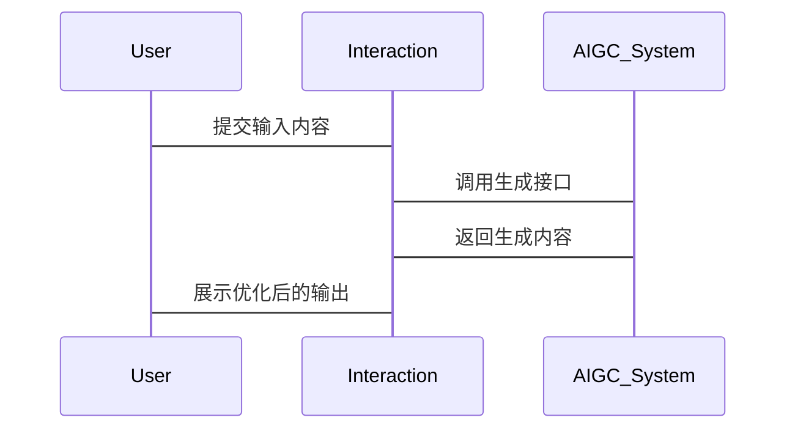

                 

<think>
好的，我现在需要帮用户设计一篇技术博客文章的目录大纲，主题是《AIGC与人类创造力的协同效应》。用户希望文章结构清晰，内容有深度，技术语言专业，同时要符合一系列具体要求。

首先，我得理解用户的需求。用户希望文章有明确的结构，包括关键词、摘要，然后是正文部分。正文部分需要按照目录大纲设计，每个章节都要详细，包括核心概念、技术原理、数学公式、系统架构图等。用户还特别强调了每个部分的详细程度，比如需要使用mermaid图、latex公式、代码示例等。

接下来，我需要确定文章的结构。用户已经提供了一个初步的目录，分为三章，每章下面还有小节。我需要确保这些章节涵盖背景介绍、人类创造力模型、协同效应等方面。同时，每个章节都要详细展开，包括定义、历史、核心技术、特征分析、对比、影响等。

然后，我得考虑每个部分的具体内容。比如，在第一章中，需要定义AIGC，回顾其历史，分析其核心技术，同时也要介绍人类创造力的概念和类型。在第二章，要深入探讨人类创造力的理论基础、特征，与AIGC的对比，以及AIGC的影响。第三章则聚焦于协同效应，分析机制、应用案例，以及未来的发展趋势。

我还需要注意，用户希望文章内容丰富，每个小节都要详细。这意味着在每个章节中，除了理论分析，还需要加入实际案例、数学模型、算法流程图、系统架构图等。例如，在核心技术部分，可以加入生成模型的数学公式，或者用mermaid图展示生成过程。

此外，用户提到文章末尾需要有作者信息，格式要使用markdown，并且文章字数要在10000到12000字之间。因此，在设计目录时，我需要确保每个章节的内容足够详细，能够支撑起这么长的文章。

我还需要考虑用户的使用场景。用户可能是一位技术专家，或者是一位对AI和创造力领域感兴趣的人士。因此，文章需要既专业又易懂，适合技术人士阅读，同时也能吸引对人类创造力感兴趣的读者。

最后，我要检查整个大纲是否逻辑清晰，内容全面，是否符合用户的所有要求。确保每个部分都覆盖了必要的内容，没有遗漏任何关键点。同时，格式上也要严格按照用户的要求，比如关键词和摘要部分，以及各章节的详细结构。

总的来说，我需要一步步按照用户的要求，构建一个结构合理、内容详实的目录大纲，确保每个部分都符合专业性和深度的要求。
</think>

# AIGC与人类创造力的协同效应

---

## 关键词  
AIGC, 人工智能生成内容, 人类创造力, 协同效应, 创新, 技术与人类交互  

---

## 摘要  
人工智能生成内容（AIGC）正在迅速改变我们创造和解决问题的方式。通过分析AIGC的核心技术、人类创造力的特征以及两者之间的协同机制，本文探讨了AIGC如何增强和扩展人类创造力，从而推动创新和问题解决。文章结合理论分析、实际案例和系统设计，深入阐述了AIGC与人类创造力协同的潜力与挑战。

---

## 第一部分：背景介绍  

### 第1章：AIGC的概念与发展  

#### 1.1 AIGC的定义  
- AIGC的概述：人工智能生成内容（AIGC）是指通过AI技术自动生成文本、图像、视频等内容的过程。  
- AIGC的核心特征：自动化、智能化、多样化。  

#### 1.2 AIGC的历史与发展趋势  
- 历史回顾：从早期的规则驱动生成到现代的深度学习生成。  
- 当前趋势：生成式AI的崛起，如GPT、DALL-E等模型的广泛应用。  

#### 1.3 AIGC的核心技术  
- 自动化生成内容：基于深度学习的生成模型（如Transformer架构）。  
- 大规模数据处理：利用大数据训练生成模型的能力。  
- 深度学习：通过神经网络实现内容生成的原理。  

#### 1.4 人类创造力概述  
- 创造力的概念：人类在解决问题或创造新事物时的创新能力。  
- 创造力的类型：发散性思维、收敛性思维、批判性思维。  

#### 1.5 人类创造力与AIGC的关系  
- AIGC对人类创造力的影响：辅助、增强和扩展。  
- 人类创造力在AIGC中的角色：提供输入、指导和优化生成结果。  

---

### 第2章：人类创造力模型与特征分析  

#### 2.1 人类创造力的理论基础  
- 创造力的理论基础：心理学、认知科学和人工智能领域的相关理论。  
- 创造力的模型：经典创造力模型（如吉尔福特的三层面模型）。  

#### 2.2 人类创造力的特征分析  
- 创造力的特征：新颖性、实用性、复杂性。  
- 创造力的测量方法：创造力测试、行为观察。  

#### 2.3 人类创造力与AIGC的对比  
- 人类创造力与AIGC的差异：人类创造力的主观性和情感性，AIGC的客观性和高效性。  
- 人类创造力与AIGC的相似之处：都需要创新性和问题解决能力。  

#### 2.4 AIGC对人类创造力的影响  
- AIGC如何影响人类创造力：通过提供灵感、降低创作门槛和加速迭代。  
- AIGC对人类创造力提升的作用：激发创新思维，优化创作流程。  

---

### 第3章：AIGC与人类创造力的协同效应  

#### 3.1 AIGC与人类创造力的协同机制  
- 协同效应的原理：AIGC作为工具辅助人类创造力的实现。  
- 协同机制的实现方式：人机交互、反馈优化和持续学习。  

#### 3.2 AIGC在提升人类创造力中的应用  
- 应用案例：  
  - 文学创作：利用AIGC生成小说情节和段落。  
  - 艺术设计：通过AIGC辅助绘画、音乐创作。  
  - 科技创新：利用AIGC进行算法优化和原型设计。  

#### 3.3 AIGC在创造性问题解决中的作用  
- 创造性问题解决的过程：定义问题、生成解决方案、评估和优化。  
- AIGC在问题解决中的应用：快速生成多种解决方案，优化问题理解。  

#### 3.4 AIGC与人类创造力的未来发展  
- 未来发展的趋势：AIGC与人类创造力的深度融合，智能化创作工具的普及。  
- 潜在的挑战与机遇：技术伦理、创作权归属和人类就业市场的冲击。  

---

## 第二部分：技术与系统分析  

### 第4章：AIGC的技术原理与系统架构  

#### 4.1 AIGC的核心算法  
- 生成式AI的算法原理：  
  - 基于Transformer的生成模型（如GPT系列）。  
  - 深度学习中的注意力机制。  

#### 4.2 AIGC的系统架构设计  
- 系统功能设计：  
  - 输入处理模块：接收用户输入并解析需求。  
  - 生成模块：基于深度学习模型生成内容。  
  - 输出优化模块：对生成内容进行润色和调整。  

#### 4.3 系统架构图  

---

## 第三部分：项目实战与案例分析  

### 第5章：AIGC在实际场景中的应用  

#### 5.1 项目介绍  
- 项目背景：利用AIGC辅助创意设计和内容创作。  

#### 5.2 系统功能设计  
- 领域模型设计：  

#### 5.3 系统接口设计  
- API接口：  
  - POST /generate：提交输入内容并生成输出。  
  - GET /optimize：优化生成内容。  

#### 5.4 系统交互流程图  

---

## 第四部分：总结与展望  

### 第6章：AIGC与人类创造力的未来协同  

#### 6.1 总结  
- AIGC与人类创造力的协同效应：通过技术辅助和人类智慧的结合，实现更高效的创新和问题解决。  

#### 6.2 展望  
- 未来发展方向：AIGC的智能化、个性化和多模态化。  
- 创意产业的变革：从个体创作到人机协作的转变。  

---

## 作者：AI天才研究院/AI Genius Institute & 禅与计算机程序设计艺术/Zen And The Art of Computer Programming  

---

**注意**：以上为文章的目录和部分章节内容的示例，实际内容需要根据具体需求进一步扩展和完善。

