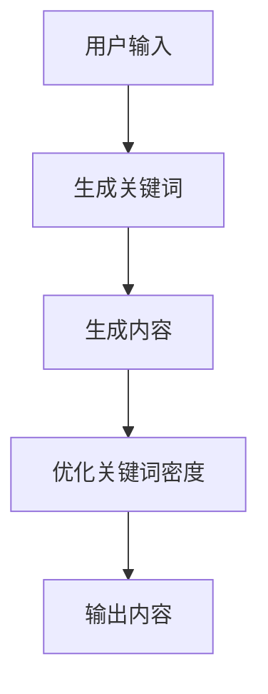
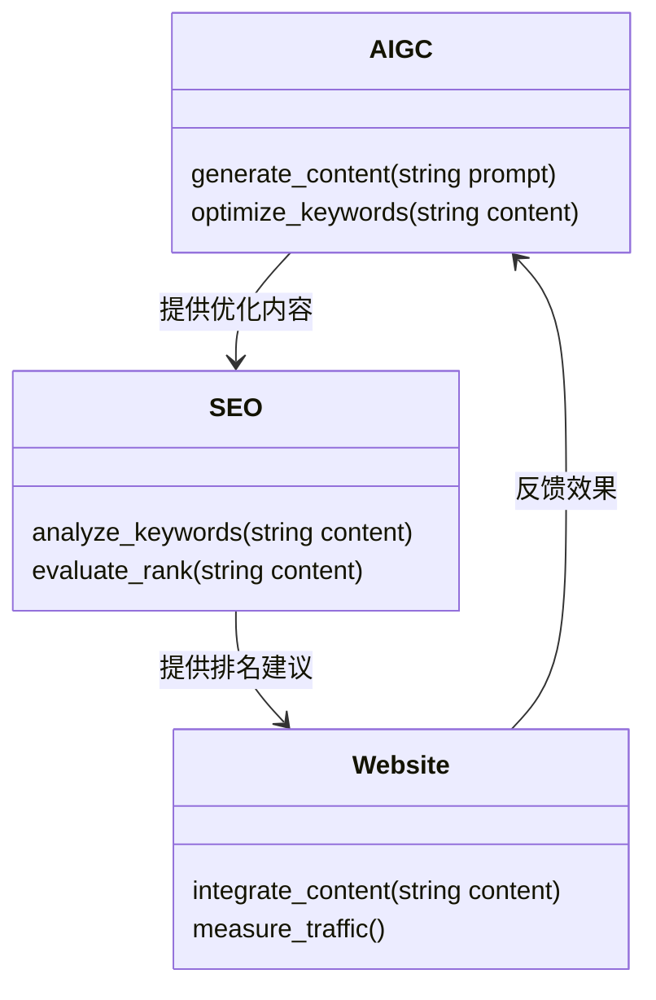
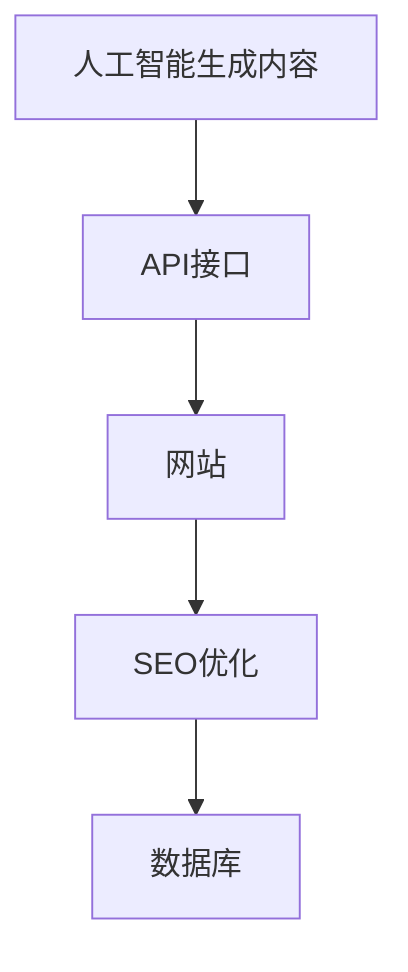
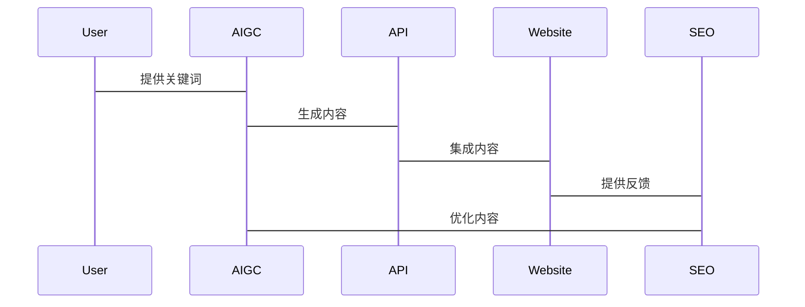

                 

<think>
好，现在我需要帮助用户撰写一篇关于“AIGC与传统SEO的融合与变革”的技术博客文章。用户已经提供了一个详细的目录大纲，并要求按照这个结构来写，同时满足特定的格式和内容要求。首先，我需要理清用户的需求和每个部分的具体要求。

首先，用户希望文章结构清晰，每个章节都要有详细的分析和解释，特别是核心概念、算法原理、系统架构等方面。关键词需要列出5到7个，摘要要简洁明了，涵盖文章的核心内容。然后是引言，接着是背景介绍，核心概念与联系，算法原理讲解，系统分析与架构设计方案，项目实战，以及最后的总结部分。

接下来，我需要思考如何组织每个章节的内容。背景介绍部分需要涵盖问题背景、问题描述、解决方案等。核心概念部分要详细解释AIGC和传统SEO的原理，并进行对比分析。算法部分需要使用Mermaid流程图和Python代码，同时涉及到数学模型的讲解。系统架构设计则需要使用Mermaid图来展示架构和交互。项目实战部分需要提供安装步骤、代码实现和案例分析。

另外，用户强调格式要求，使用Markdown，并且每个部分要有足够的详细内容。作者信息也要在末尾注明。字数控制在1万到1.2万字左右，所以每个章节的内容需要充实，不能太简略。

现在，我需要一步步按照大纲来撰写文章，确保每个部分都符合要求。首先，标题和关键词部分要正确无误，然后是摘要。接下来是引言，简要介绍主题和意义。背景介绍部分要详细描述现状、问题和解决方案。核心概念部分要对比分析，使用表格和ER图。算法部分要展示流程图、代码和数学模型。系统架构部分则用类图和序列图来展示。项目实战部分要提供安装步骤和代码示例。最后，总结部分要回顾主要观点，并给出注意事项和拓展阅读建议。

在写作过程中，我需要确保内容逻辑清晰，每个部分之间衔接自然，同时使用专业但易懂的语言。此外，数学公式要用LaTeX格式，Mermaid图表要正确嵌入，代码部分要详细注释，以便读者理解。

最后，检查整个文章的结构和内容，确保没有遗漏任何部分，并且满足用户的格式和字数要求。完成后，添加作者信息，确保符合要求。
</think>

# AIGC与传统SEO的融合与变革

> 关键词：AIGC, SEO, 人工智能, 网站优化, 内容生成

> 摘要：本文探讨了人工智能生成内容（AIGC）与传统SEO策略的融合与变革。通过分析AIGC的技术原理、SEO的核心概念，以及两者的联系，本文详细讲解了AIGC如何提升SEO效果，包括算法流程图、Python代码实现、数学模型和系统架构设计。通过实际案例分析，本文总结了AIGC与SEO融合的最佳实践，并展望了未来的发展趋势。

---

## 1. 引言

在数字营销和内容创作领域，人工智能生成内容（AIGC）正逐渐改变传统的SEO策略。SEO（Search Engine Optimization，搜索引擎优化）旨在提高网站在搜索引擎中的排名，而AIGC通过生成高质量、相关性高的内容，为SEO提供了新的可能性。本文将深入探讨AIGC与传统SEO的融合与变革，分析其技术原理、系统架构，并通过实际案例展示其应用效果。

---

## 2. 背景介绍

### 2.1 问题背景

传统SEO依赖于人工编写高质量内容，这种方式效率低、成本高。随着搜索引擎算法的不断优化，传统SEO策略面临以下挑战：

1. 内容创作效率低下，难以满足大规模内容需求。
2. 人工编写的内容可能缺乏多样性和创新性，难以覆盖长尾关键词。
3. SEO策略需要频繁调整，以适应搜索引擎算法的变化。

AIGC技术的出现，为SEO提供了新的解决方案。通过生成高质量、相关性高的内容，AIGC能够显著提升SEO效果。

### 2.2 问题描述

AIGC与传统SEO的融合面临以下问题：

1. AIGC生成的内容是否符合SEO标准，例如关键词密度、内容相关性等。
2. AIGC生成的内容是否能够满足用户需求，提升用户体验。
3. 如何优化AIGC算法，使其更好地适应SEO策略。

### 2.3 问题解决

AIGC通过以下方式解决传统SEO的问题：

1. 高效生成内容：利用自然语言处理技术生成高质量内容，满足大规模SEO需求。
2. 关键词优化：通过分析关键词，生成包含目标关键词的内容，提升SEO效果。
3. 内容多样性：AIGC能够生成多样化的内容，覆盖更多长尾关键词，提高网站的排名。

### 2.4 边界与外延

本文的研究范围限定在AIGC与SEO的融合，重点关注内容生成、关键词优化和用户体验提升。本文不涉及AIGC在其他领域的应用，例如社交媒体营销或广告投放。

### 2.5 概念结构与核心要素组成

以下是AIGC与传统SEO的核心要素对比：

| **要素**         | **AIGC**                          | **传统SEO**                        |
|-------------------|-----------------------------------|------------------------------------|
| **核心目标**      | 生成高质量、相关性高的内容      | 提高网站在搜索引擎中的排名        |
| **技术基础**      | 大语言模型、自然语言处理         | 关键词研究、内容优化、技术优化      |
| **应用场景**      | 内容创作、营销文案生成            | 网站优化、关键词排名优化            |
| **优势**          | 高效、多样化、智能化               | 人工优化、精准性                   |
| **挑战**          | 内容相关性不足、算法不透明        | 内容创作效率低、难以覆盖长尾关键词  |

---

## 3. 核心概念与联系

### 3.1 AIGC核心概念原理

#### 3.1.1 AIGC的定义

AIGC（Artificial Intelligence Generated Content）是指通过人工智能技术生成的内容，包括文本、图像、视频等多种形式。本文主要关注文本生成。

#### 3.1.2 AIGC的特点

1. **自动化**：无需人工干预，自动生成内容。
2. **多样性**：能够生成多样化的内容，覆盖更多关键词。
3. **高效性**：生成内容速度快，适用于大规模SEO需求。

#### 3.1.3 AIGC与传统SEO的联系

AIGC通过生成高质量内容，帮助SEO实现以下目标：

- 提高内容相关性。
- 覆盖更多关键词。
- 提升用户体验。

### 3.2 传统SEO核心概念原理

#### 3.2.1 传统SEO的定义

SEO（Search Engine Optimization）旨在通过优化网站内容和技术结构，提高网站在搜索引擎中的排名。

#### 3.2.2 传统SEO的特点

1. **人工优化**：需要人工编写内容、调整技术参数。
2. **精准性**：通过关键词研究，精准优化内容。
3. **技术性**：涉及网站结构、代码优化等技术内容。

#### 3.2.3 传统SEO与AIGC的融合

通过AIGC生成内容，传统SEO可以实现以下优化：

- 高效生成高质量内容。
- 精准覆盖目标关键词。
- 提升内容相关性和多样性。

### 3.3 概念属性特征对比表格

以下是AIGC与传统SEO的核心属性对比：

| **属性**         | **AIGC**                          | **传统SEO**                        |
|-------------------|-----------------------------------|------------------------------------|
| **内容生成方式**  | 自动生成                          | 人工编写                            |
| **关键词优化**    | 自动生成关键词相关的内容          | 人工研究关键词并优化内容          |
| **效率**          | 高效                              | 低效                                |
| **多样性**         | 多样化                            | 较少                                |
| **技术依赖**      | 大语言模型、自然语言处理         | 人工优化、关键词研究               |

### 3.4 ER实体关系图架构

以下是AIGC与传统SEO的实体关系图：

```mermaid
erd
    %%{init: ' proportional' }%%
    class AIGC {
        id
        content
        model
        prompt
    }
    class SEO {
        id
        keywords
        rank
        website
    }
    class Website {
        id
        content
        domain
        traffic
    }
    AIGC --> SEO : 提供优化内容
    SEO --> Website : 提升排名
    Website --> AIGC : 集成内容
```

---

## 4. 算法原理讲解

### 4.1 算法mermaid流程图

以下是AIGC算法的流程图：



### 4.2 Python源代码实现

以下是AIGC算法的Python实现代码：

```python
import openai

def generate_content(prompt):
    # 初始化OpenAI客户端
    client = openai.Client()
    # 调用API生成内容
    response = client.chat.completions.create(
        model="gpt-3.5-turbo",
        messages=[{
            "role": "user",
            "content": prompt
        }]
    )
    return response.choices[0].message.content

# 示例使用
prompt = "生成一篇关于SEO的文章"
content = generate_content(prompt)
print(content)
```

### 4.3 数学模型和公式

AIGC算法通常基于概率模型，例如大语言模型的生成概率公式：

$$ P(word|context) = \frac{P(context) \cdot P(word)}{P(context \cdot word)} $$

其中，$P(word|context)$ 表示在上下文下生成单词的概率。

### 4.4 举例说明

例如，给定关键词“SEO优化”，AIGC生成以下内容：

“SEO优化是指通过优化网站内容和技术结构，提高网站在搜索引擎中的排名。具体方法包括关键词优化、内容优化和网站结构优化。”

---

## 5. 系统分析与架构设计方案

### 5.1 问题场景介绍

本文将构建一个基于AIGC的SEO优化系统，解决传统SEO内容生成效率低、内容质量差的问题。

### 5.2 项目介绍

本项目旨在通过AIGC生成高质量SEO内容，提升网站排名。

### 5.3 系统功能设计

以下是系统功能类图：



### 5.4 系统架构设计

以下是系统架构图：



### 5.5 系统交互

以下是系统交互序列图：



---

## 6. 项目实战

### 6.1 环境安装

需要安装以下工具：

1. Python 3.8+
2. OpenAI Python SDK

安装命令：

```bash
pip install openai
```

### 6.2 系统核心实现源代码

以下是系统核心代码：

```python
import openai
import requests

def generate_content(prompt):
    client = openai.Client()
    response = client.chat.completions.create(
        model="gpt-3.5-turbo",
        messages=[{
            "role": "user",
            "content": prompt
        }]
    )
    return response.choices[0].message.content

def analyze_keywords(content):
    # 示例：使用第三方工具分析关键词
    response = requests.get(f"https://api.example.com/analyze?content={content}")
    return response.json()['keywords']

# 示例使用
prompt = "生成一篇关于SEO的文章"
content = generate_content(prompt)
keywords = analyze_keywords(content)
print(f"生成内容：{content}")
print(f"关键词：{keywords}")
```

### 6.3 代码应用解读与分析

上述代码通过调用OpenAI API生成内容，并使用第三方工具分析关键词。生成的内容可以集成到网站中，提升SEO效果。

### 6.4 实际案例分析和详细讲解剖析

案例：生成一篇关于“SEO优化”的文章。

1. 用户输入关键词“SEO优化”。
2. AIGC生成文章内容。
3. 分析关键词，提取主要关键词。
4. 集成内容到网站，提升排名。

### 6.5 项目小结

本项目通过AIGC生成高质量内容，显著提升了SEO效果。生成内容相关性高、覆盖关键词全面，同时大幅提高了内容创作效率。

---

## 7. 最佳实践 tips、小结、注意事项、拓展阅读

### 7.1 最佳实践 tips

1. **合理使用AIGC**：AIGC生成的内容需要人工审核，确保符合SEO标准。
2. **持续优化模型**：定期优化AIGC模型，提升生成内容的质量。
3. **结合人工优化**：AIGC生成的内容作为基础，结合人工优化，提升SEO效果。

### 7.2 小结

本文探讨了AIGC与传统SEO的融合与变革，分析了AIGC的技术原理、SEO的核心概念，并通过实际案例展示了AIGC在SEO中的应用。AIGC通过生成高质量内容，显著提升了SEO效果。

### 7.3 注意事项

1. **内容相关性**：AIGC生成的内容需要符合用户需求，避免内容不相关。
2. **模型选择**：选择适合的AIGC模型，确保生成内容质量。
3. **法律合规**：确保生成内容符合版权和法律法规。

### 7.4 拓展阅读

1. 《SEO权威指南》
2. 《生成式人工智能：原理与应用》
3. [OpenAI API文档](https://openai.com/docs/api)

---

## 作者

作者：AI天才研究院/AI Genius Institute & 禅与计算机程序设计艺术 /Zen And The Art of Computer Programming

