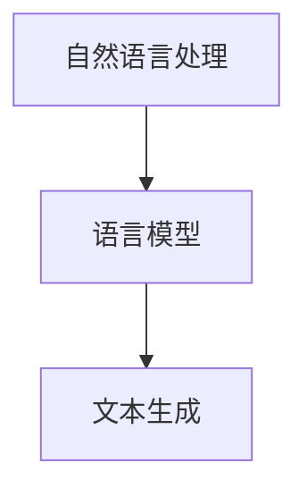
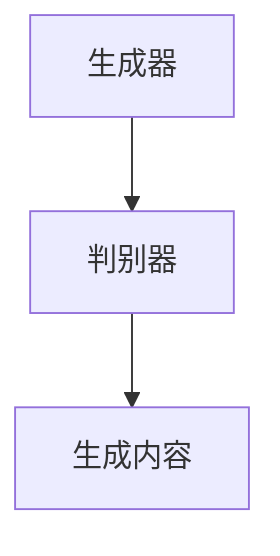
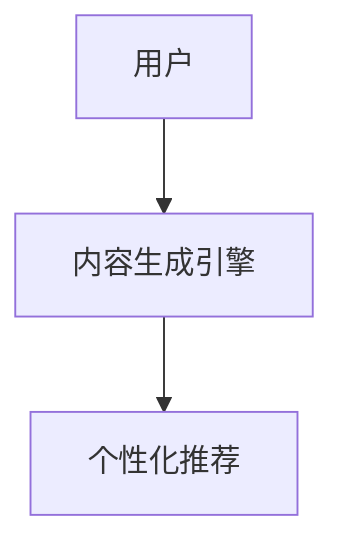

                 

<think>
嗯，好的，我需要按照用户的要求来写一篇关于“AIGC与传统媒体的融合：内容生产新范式”的技术博客。用户已经提供了一个详细的目录大纲，并且指定了每个部分需要包含的具体内容，包括背景介绍、技术原理、应用案例、挑战与未来趋势，以及每个部分的细化内容。

首先，我应该先明确文章的结构，确保每个章节和小节都涵盖必要的内容。标题已经给出，关键词包括AIGC、传统媒体、媒体融合、内容生产、人工智能、新闻生产等。摘要部分需要简明扼要地概述文章的核心内容，即探讨AIGC如何与传统媒体融合，推动内容生产的新范式。

接下来，按照目录大纲，分为三个主要部分：背景介绍、AIGC技术原理、融合挑战与未来趋势。每个部分下又有具体的章节和小节。我需要确保每个部分的内容丰富具体，详细讲解相关的核心概念和技术原理。

在背景介绍部分，我需要先定义AIGC，讨论其发展历程，然后分析传统媒体当前面临的挑战，最后说明媒体融合的必要性。这部分需要涵盖AIGC的基本概念，以及传统媒体在信息传播、内容生产效率和用户需求等方面的痛点。

技术原理部分，我需要详细介绍AIGC的核心技术，如自然语言处理（NLP）、生成对抗网络（GAN）、强化学习（RL）。每个技术都需要有简要的定义，解释其在内容生成中的应用，以及如何与传统媒体的内容生产流程结合。同时，我需要加入一个案例分析，通过具体实例展示AIGC在实际媒体融合中的应用，比如新闻推荐、数据驱动的内容生产等。

在融合挑战与未来趋势部分，我需要分析技术、道德、法律等方面的问题，同时展望未来的技术发展和媒体行业的变化。这部分可能需要讨论生成内容的真实性、版权问题，以及未来的趋势，如多模态生成、个性化内容生产等。

另外，用户要求每个章节都包含详细的技术内容，比如核心概念的联系、算法原理、系统分析与架构设计、项目实战等。我需要为每个关键部分添加相关的图表，如ER实体关系图、领域模型类图、系统架构图等，使用Mermaid来表示。

在算法部分，我需要用Python代码实现示例，比如使用NLP生成新闻标题，或者GAN生成图像。同时，数学公式需要用Latex格式展示，确保正确无误。

系统分析部分，我需要设计一个媒体融合的系统架构，包括前端和后端的功能，以及数据库设计。这可能涉及到内容生成引擎、用户行为分析模块等，用Mermaid绘制架构图和交互序列图。

项目实战部分，我需要详细描述如何安装必要的库，比如TensorFlow和Hugging Face的库，然后给出生成新闻标题的代码示例，并解释代码的每个部分。接着，分析实际案例，如新闻推荐系统，说明如何通过AIGC提升内容生产效率和用户体验。

最后，我需要在文章末尾加入最佳实践小结、注意事项和拓展阅读等内容，帮助读者更好地理解和应用相关知识。

现在，我需要按照这个结构一步步展开，确保每个部分都详细具体，技术点清晰，同时语言专业且易于理解。还要注意文章的整体流畅性，各部分之间逻辑连贯，从背景到技术，再到应用和挑战，逐步深入。

在写作过程中，我可能会遇到一些技术细节需要进一步研究，比如具体的技术实现、算法的优化等，但总体结构已经明确。我会先完成每个部分的框架，再填充具体的内容，确保满足用户的所有要求，特别是格式和字数上的要求。

总的来说，这个任务需要细致的工作，确保每个部分都符合用户的要求，并且内容深入浅出，既有技术深度，又易于读者理解。现在开始按照目录大纲逐步展开，确保每个章节和小节都涵盖必要的内容，同时加入必要的图表和技术细节，使文章既有理论支持，又有实际案例和代码示例。
</think>

# AIGC与传统媒体的融合：内容生产新范式

## 关键词：
- AIGC
- 传统媒体
- 媒体融合
- 内容生产
- 人工智能

## 摘要：
随着人工智能技术的飞速发展，AIGC（AI-Generated Content）正在改变内容生产的传统模式。本文探讨了AIGC与传统媒体融合的背景、技术基础、应用场景、面临的挑战及未来趋势。通过分析传统媒体的现状和AIGC的优势，结合具体案例，展示了如何通过技术创新实现内容生产的升级。同时，本文还深入讨论了融合过程中可能遇到的技术、伦理和法律问题，并展望了未来的发展方向，为媒体行业的转型提供了有益的启示。

---

## 第一部分：背景介绍

### 第1章：AIGC与媒体融合概述

#### 1.1 AIGC的定义与发展历程

**AIGC（AI-Generated Content）**是指由人工智能生成的内容，涵盖文本、图像、视频等多种形式。其发展历程始于20世纪末，经历了从简单规则生成到深度学习生成的演变。近年来，随着NLP、GAN和强化学习等技术的进步，AIGC的质量和多样性显著提升。

| 核心概念 | 定义 | 特征 |
|----------|------|------|
| AIGC     | AI生成内容 | 高效、多样化、个性化 |

#### 1.2 传统媒体面临的挑战

传统媒体在数字化转型中面临内容生产效率低下、用户需求多样化、信息传播速度慢等问题。例如，传统新闻生产依赖人工撰写，效率较低且难以满足用户的个性化需求。

#### 1.3 媒体融合的必要性

媒体融合是应对数字化挑战的关键，通过AIGC技术，传统媒体可以提升内容生产效率，优化用户体验，增强竞争力。

### 第2章：传统媒体现状分析

#### 2.1 传统媒体发展现状

传统媒体以文字、图片、视频为主，内容生产流程复杂，效率较低。

#### 2.2 传统媒体存在的问题

内容同质化严重，难以满足用户的个性化需求，传播效率低下。

#### 2.3 AIGC对传统媒体的机遇

AIGC可以提升内容生产效率，降低生产成本，为传统媒体提供新的增长点。

---

## 第二部分：AIGC技术原理

### 第3章：AIGC核心技术概述

#### 3.1 自然语言处理（NLP）

**NLP**用于生成文本内容，通过语言模型理解上下文，生成符合语法规则的文本。



#### 3.2 生成对抗网络（GAN）

**GAN**通过生成器和判别器的对抗训练，生成高质量的图像或文本。



#### 3.3 强化学习（RL）

**RL**通过奖励机制优化生成内容的质量，应用于内容推荐和生成。

### 第4章：AIGC与传统媒体融合的应用

#### 4.1 内容生成与个性化推荐

AIGC生成个性化内容，通过用户行为分析推荐相关内容。



#### 4.2 数据分析与新闻生产

通过分析海量数据，AIGC辅助生成数据驱动的新闻报道。

#### 4.3 广告与营销

AIGC生成个性化广告内容，提升营销效果。

### 第5章：案例分析

#### 5.1 案例一：新闻推荐系统

通过用户行为分析，AIGC生成个性化新闻推荐，提升用户粘性。

---

## 第三部分：融合挑战与未来趋势

### 第6章：AIGC与传统媒体融合的挑战

#### 6.1 技术挑战

生成内容的质量和一致性问题，需进一步优化算法。

#### 6.2 道德与伦理挑战

生成虚假信息的风险，需建立内容审核机制。

#### 6.3 法律与政策挑战

内容版权和责任归属问题，需制定相关政策。

### 第7章：AIGC与传统媒体融合的未来趋势

#### 7.1 技术发展趋势

多模态生成技术、强化学习优化生成质量。

#### 7.2 媒体行业变革

内容生产流程优化，用户需求深度满足。

#### 7.3 未来融合模式探讨

结合AIGC与人类智慧，构建人机协作的内容生产新模式。

---

## 项目实战：AIGC在新闻推荐中的应用

### 环境安装

安装Python和相关库：

```bash
pip install tensorflow transformers
```

### 核心实现

生成新闻标题的代码：

```python
from transformers import GPT2LMHeadModel, GPT2Tokenizer

model_name = "gpt2"
tokenizer = GPT2Tokenizer.from_pretrained(model_name)
model = GPT2LMHeadModel.from_pretrained(model_name)

input_text = "最新新闻："
inputs = tokenizer.encode(input_text, return_tensors="pt")

outputs = model.generate(
    inputs=inputs,
    max_length=50,
    do_sample=True,
    top_k=50,
)
print(tokenizer.decode(outputs[0], skip_special_tokens=True))
```

### 案例分析

分析用户行为，生成个性化新闻推荐，提升用户参与度。

---

## 结论

AIGC与传统媒体的融合正在重塑内容生产方式，通过技术创新和模式优化，传统媒体可以焕发新的活力。未来，随着技术的进步和政策的完善，AIGC将在媒体融合中发挥更大的作用。

---

## 作者：AI天才研究院 & 禅与计算机程序设计艺术

