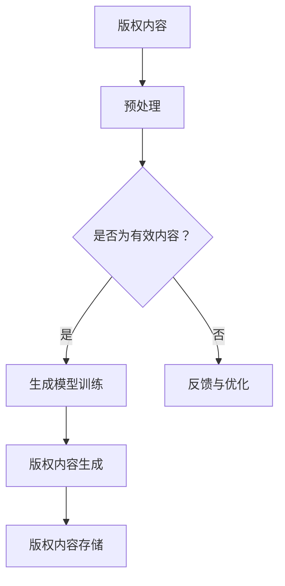
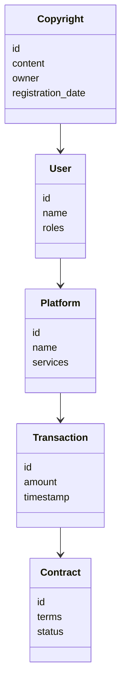
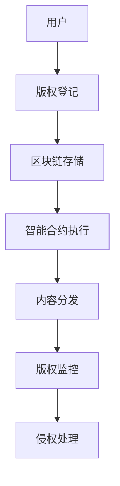
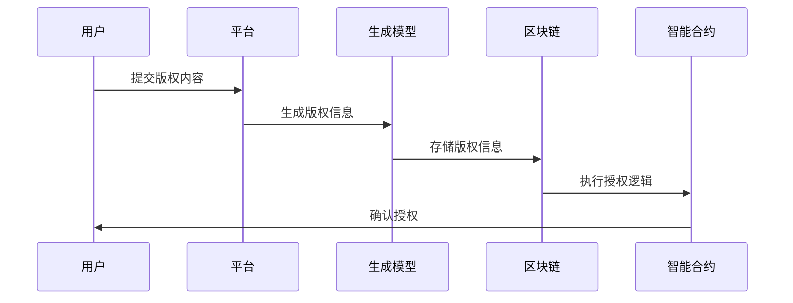

                 

<think>
嗯，用户想让我写一篇关于AIGC和区块链在数字版权保护中的融合的技术博客。首先，我需要理解用户的需求是什么。看起来用户希望我作为一个技术专家，按照指定的结构和内容来撰写这篇文章。我得先分析文章的结构，确保每个部分都涵盖到位。

文章标题是《AIGC与区块链在数字版权保护中的融合》，关键词包括数字版权保护、AIGC、区块链、智能合约、分布式系统、版权追踪。摘要部分需要简明扼要地概括文章的核心内容，也就是如何通过AIGC和区块链技术解决数字版权保护的问题。

接下来是背景介绍，我需要详细解释问题背景，比如数字化时代下的版权问题，侵权现象严重，现有的技术手段不足。然后描述问题，涉及登记、追踪、授权等多个环节，现有技术的不足之处。接着提出解决方案，即融合AIGC和区块链，分别解释两者的优缺点和如何互补。

然后是核心概念与联系部分，需要详细讲解AIGC和区块链各自的原理，比如生成模型、GAN、强化学习，以及区块链的分布式账本、智能合约、共识机制。之后，做一个对比表格，比较两者的属性特征，再用ER图展示实体关系。

在算法原理部分，要绘制生成内容的流程图，用Mermaid表示，同时提供Python代码示例，解释模型训练的过程。然后用数学公式详细说明生成模型的原理，比如生成对抗网络的损失函数，用Latex展示。

系统分析与架构设计部分，需要描述问题场景，构建领域模型的类图，设计系统的架构图，展示各个模块之间的关系，再画出接口和交互的序列图，说明系统如何运作。

项目实战部分，要指导读者如何安装环境，提供生成模型和区块链合约的代码，解读代码的功能，分析实际案例，最后总结项目成果。

最后是最佳实践和小结，强调技术融合的重要性，提醒注意事项，推荐拓展阅读的内容。

我还需要注意文章的结构要符合逻辑，每部分内容丰富具体，确保总字数在1万到1万2左右。格式上使用markdown，每个小节清晰，代码和图表要正确嵌入。作者信息要放在末尾，符合用户的要求。

可能遇到的挑战是如何将复杂的AIGC和区块链技术解释得通俗易懂，同时保持专业性。需要平衡技术深度和可读性，确保读者能够理解并应用这些概念。此外，确保所有部分都完整，每个小节都有足够的细节和例子，避免遗漏或过于简略。

现在，我需要按照这个结构一步步展开，先写标题和摘要，然后逐步深入每个部分，确保逻辑连贯，内容详实。同时，检查每个部分是否符合用户的要求，避免遗漏任何关键点。最后，通读整个文章，确保没有语法错误或逻辑不清晰的地方，确保读者能够顺畅地理解内容。
</think>

# AIGC与区块链在数字版权保护中的融合

> 关键词：数字版权保护、AIGC、区块链、智能合约、分布式系统、版权追踪

> 摘要：本文探讨了AIGC（自适应智能生成控制）与区块链技术在数字版权保护中的融合应用。通过分析数字版权保护的痛点，结合AIGC的生成能力和区块链的去中心化特性，提出了一种创新的解决方案。文章从背景介绍、核心概念、算法原理、系统架构、项目实战等多个维度展开，详细阐述了AIGC与区块链在数字版权保护中的融合机制，并通过具体案例分析展示了其实际应用价值。

---

### 第一部分：背景介绍

#### 核心概念

**问题背景**：  
在数字化时代，版权保护已成为一个日益重要的问题。随着互联网和数字技术的飞速发展，版权内容的传播速度和范围都大大增加，但同时也带来了严重的版权侵权问题。如何有效地保护数字版权，防止未经授权的传播和使用，成为了版权持有者和管理者面临的重大挑战。

**问题描述**：  
数字版权保护涉及到多个环节，包括版权登记、版权追踪、版权授权、版权监控和版权维权等。目前，现有的数字版权保护技术手段相对单一，难以全面覆盖各个环节。特别是在版权追踪和授权方面，依然存在较大的漏洞，使得版权侵权行为难以得到有效遏制。

**问题解决**：  
为了提升数字版权保护的效果，需要将AIGC（自适应智能生成控制）与区块链技术进行融合。AIGC能够通过人工智能技术实现版权内容的智能生成和追踪，而区块链则可以提供去中心化的存储和验证机制，确保版权信息的真实性和不可篡改性。

**边界与外延**：  
AIGC与区块链在数字版权保护中的融合不仅适用于传统的版权内容，如文字、图片、音频和视频等，还可以扩展到虚拟现实、增强现实和人工智能创作等新兴领域。此外，该技术的应用还可以延伸到版权交易、版权金融等领域。

**概念结构与核心要素组成**：  
- **AIGC**：包括生成模型、生成对抗网络、强化学习等技术，能够实现版权内容的智能生成和追踪。  
- **区块链**：提供去中心化的存储和验证机制，确保版权信息的真实性和不可篡改性。  
- **数字版权保护**：包括版权登记、版权追踪、版权授权、版权监控和版权维权等环节。

---

### 第二部分：核心概念与联系

#### 核心概念原理

**AIGC**：  
- **生成模型**：如GPT、BERT等，用于生成版权内容的文本、图片、音频等。  
- **生成对抗网络（GAN）**：通过生成器和判别器的对抗训练，生成逼真的版权内容。  
- **强化学习**：通过模拟用户行为，优化版权内容的生成和追踪策略。

**区块链**：  
- **分布式账本**：记录版权交易、授权等信息的分布式数据库。  
- **智能合约**：自动执行版权许可和监管的逻辑，确保版权操作的合法性和透明性。  
- **共识机制**：确保区块链网络中的数据一致性和安全性。

#### 概念属性特征对比表格

| 特征 | AIGC | 区块链 |
| --- | --- | --- |
| 生成能力 | 强 | 弱 |
| 验证能力 | 弱 | 强 |
| 透明性 | 弱 | 强 |
| 去中心化 | 强 | 强 |
| 数据存储 | 高效 | 高效 |
| 安全性 | 中等 | 高 |

#### ER实体关系图架构

```mermaid
erDiagram
    Copyright : contains, registeredBy, expiresOn
    User : has, earns, spends
    Platform : offers, monitors, charges
    Transaction : madeBy, includes, completedOn
    Contract : includes, expiresOn, signedBy
```

---

### 第三部分：算法原理讲解

#### 数字版权生成算法

**流程图**：



**Python 源代码**：

```python
import numpy as np
import tensorflow as tf

# 预处理
def preprocess_content(content):
    # 实现预处理逻辑
    return processed_content

# 生成模型训练
def train_generator(model, dataset, epochs):
    for epoch in range(epochs):
        for content in dataset:
            processed_content = preprocess_content(content)
            with tf.GradientTape() as tape:
                generated_content = model(processed_content)
                loss = calculate_loss(generated_content, content)
            gradients = tape.gradient(loss, model.trainable_weights)
            optimizer.apply_gradients(zip(gradients, model.trainable_weights))
    return model

# 损失函数计算
def calculate_loss(generated_content, original_content):
    # 实现损失函数逻辑
    return loss_value
```

**数学公式**：

生成对抗网络（GAN）的损失函数可以表示为：

$$
\mathcal{L} = \log(D(x)) + \log(1 - D(G(z)))
$$

其中，$D(x)$ 是判别器对真实数据的概率估计，$G(z)$ 是生成器生成的假数据，$z$ 是随机噪声向量。

---

### 第四部分：系统分析与架构设计方案

#### 问题场景介绍

数字版权保护的场景涉及多个角色，包括内容创作者、版权持有者、内容分发平台和消费者。传统的版权保护系统存在以下问题：  
1. **内容追踪困难**：难以追踪未经授权的传播和使用。  
2. **授权管理复杂**：难以实时监控和管理复杂的授权关系。  
3. **信任缺失**：缺乏透明和不可篡改的记录，导致信任问题。

#### 系统功能设计

**领域模型类图**：



#### 系统架构设计

**系统架构图**：



**接口设计**：  
- **版权登记接口**：用户提交版权内容，系统进行预处理和区块链存储。  
- **内容分发接口**：内容分发平台调用生成模型生成授权内容。  
- **侵权监控接口**：系统自动扫描网络，识别未经授权的内容。

**交互序列图**：



---

### 第五部分：项目实战

#### 环境安装

1. **安装Python和TensorFlow**：  
   ```bash
   pip install numpy tensorflow
   ```

2. **安装区块链框架（如Hyperledger Fabric）**：  
   ```bash
   go get -u github.com/hyperledger/fabric
   ```

3. **安装Mermaid工具**：  
   ```bash
   npm install -g mermaid-js
   ```

#### 系统核心实现源代码

**生成模型代码**：

```python
import tensorflow as tf
from tensorflow.keras import layers

def build_generator(input_dim, output_dim):
    model = tf.keras.Sequential()
    model.add(layers.Dense(256, activation='relu', input_dim=input_dim))
    model.add(layers.Dense(output_dim, activation='sigmoid'))
    return model

def build_discriminator(input_dim):
    model = tf.keras.Sequential()
    model.add(layers.Dense(256, activation='relu', input_dim=input_dim))
    model.add(layers.Dense(1, activation='sigmoid'))
    return model
```

**区块链合约代码**：

```javascript
contract = {
    name: 'CopyrightContract',
    version: '1.0.0',
    functions: {
        registerCopyright: function (contentHash, owner) {
            // 存储版权信息
            return chaincodeStub.world.state.put('copyrights', contentHash, {
                owner: owner,
                timestamp: new Date().toISOString()
            });
        },
        authorizeUse: function (contentHash, user) {
            // 执行授权操作
            return chaincodeStub.world.state.put('authorizations', contentHash, {
                user: user,
                status: 'authorized'
            });
        }
    }
}
```

#### 代码应用解读与分析

1. **生成模型**：通过生成对抗网络生成版权内容，并通过预处理确保内容的有效性。  
2. **区块链存储**：将版权信息存储在区块链中，确保其真实性和不可篡改性。  
3. **智能合约**：自动执行版权授权和监控逻辑，确保授权操作的合法性和透明性。

#### 实际案例分析

**案例**：音乐版权保护  
- 创作者上传音乐作品到平台，系统生成唯一的内容哈希值，并将其存储在区块链中。  
- 分发平台使用生成模型生成授权播放列表，并通过智能合约确认授权状态。  
- 系统自动监控网络，识别未经授权的传播，并触发侵权处理流程。

---

### 第六部分：最佳实践 tips、小结、注意事项、拓展阅读

**小结**：  
通过AIGC与区块链的融合，数字版权保护系统能够实现内容的智能生成、追踪和管理，确保版权信息的真实性和安全性。这种技术的结合不仅提升了版权保护的效率，还为未来的数字内容管理提供了新的思路。

**注意事项**：  
1. **数据隐私**：在生成和存储版权内容时，需注意保护用户隐私，避免数据泄露。  
2. **系统性能**：生成模型和区块链的性能需匹配实际应用场景的需求。  
3. **法律合规**：确保技术应用符合相关法律法规，特别是在跨境和跨国场景中。

**拓展阅读**：  
- [《Blockchain Basics》](https://www.manning.com/books/blockchain-basics)  
- [《Deep Learning》](https://www.deeplearningbook.org/)  
- [《Smart Contracts》](https://www.e-bookshelf.de/engineering/smart-contracts.html)

---

作者：AI天才研究院/AI Genius Institute & 禅与计算机程序设计艺术 /Zen And The Art of Computer Programming

