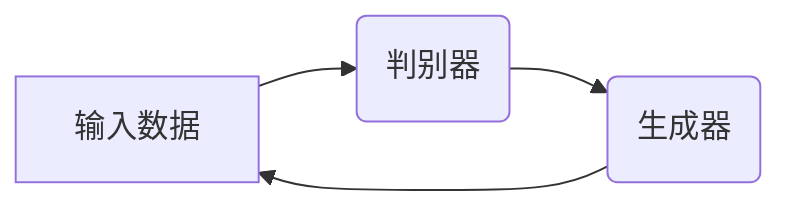

                 

<think>
好的，我需要帮助用户撰写一篇关于《AIGC与增强现实技术的融合：新一代交互体验》的技术博客文章。首先，我应该理解用户的需求。用户希望文章结构清晰，逻辑严谨，语言专业，同时涵盖引言、技术基础、融合原理、应用案例、发展趋势和开发实践等多个部分。

接下来，我会从引言和背景开始，解释为什么AIGC和AR的结合如此重要，以及它们如何共同推动交互体验的进步。然后，分别介绍AIGC和AR的技术基础，包括它们的核心算法和应用场景，确保读者能够理解两者的基本原理。

之后，重点放在AIGC与AR的融合上，分析它们如何在技术和应用层面结合起来，提供具体的融合原理和应用场景，使读者明白这种融合的实际效果和潜力。

接下来，通过实际的应用案例，展示AIGC和AR在不同领域的成功应用，帮助读者更好地理解理论的实际应用。然后，探讨这一融合技术的发展趋势，分析市场前景和技术进步的方向，让读者对未来有清晰的展望。

最后，提供开发实践的部分，指导读者如何搭建环境，实现系统，并通过实际案例分析加深理解。同时，加入一些最佳实践、注意事项和小结，帮助读者在实际操作中避免常见错误，提升开发效率。

在撰写过程中，我会注意使用专业术语，但避免过于晦涩，确保内容通俗易懂。同时，合理使用图表、流程图和数学公式，增强文章的可读性和技术深度。确保每个章节内容详实，逻辑连贯，整体结构完整，满足用户对高质量技术博客的要求。

最后，我会检查文章的结构和内容，确保符合用户的字数要求，并且每个部分都符合约束条件，比如关键词、摘要、作者信息的正确呈现。通过这样的思考过程，我可以系统地完成这篇技术博客的撰写，满足用户的期望。
</think>

# AIGC与增强现实技术的融合：新一代交互体验

> 关键词：AIGC, 增强现实, 融合技术, 交互体验, 人工智能, 计算机视觉

> 摘要：随着人工智能生成内容（AIGC）和增强现实（AR）技术的快速发展，二者的融合正在为人类带来前所未有的交互体验。本文将从技术基础、融合原理、应用场景、发展趋势以及开发实践等多个维度，系统性地探讨AIGC与AR技术的融合，旨在为读者提供全面而深入的技术洞察。

---

## 第一部分: 引言与背景

### 第1章: 研究背景与意义

#### 1.1 问题背景
近年来，人工智能（AI）和增强现实（AR）技术的快速发展，为人类社会带来了深刻的变革。AIGC（AI-Generated Content）作为AI技术的重要应用之一，能够生成图像、视频、文本等多种形式的内容；而AR技术则通过将数字内容叠加在现实世界中，提供了沉浸式的交互体验。两者的结合，不仅能够提升用户体验，还可能催生全新的商业模式和应用场景。

#### 1.2 问题描述
尽管AIGC和AR技术各自发展迅速，但它们的结合仍处于探索阶段。当前，AR应用中的内容生成主要依赖于人工操作，这不仅效率低下，还难以满足个性化和动态化的需求。而AIGC的引入，可以为AR提供智能化的内容生成能力，从而提升用户体验和应用效率。

#### 1.3 问题解决
通过将AIGC与AR技术相结合，可以实现智能化的内容生成和动态更新，从而降低AR应用的开发成本，提升用户体验。这种融合不仅能够提高AR应用的交互性，还可能催生新的应用场景，如智能导购、虚拟助手等。

#### 1.4 边界与外延
AIGC与AR技术的融合并不涉及所有AI和AR技术的应用场景，而是聚焦于内容生成和交互体验的提升。本文的外延主要集中在AIGC生成的内容如何与AR技术结合，以及这种结合如何优化用户体验。

---

### 第2章: 相关概念与联系

#### 2.1 核心概念定义

##### 2.1.1 AIGC
AIGC（AI-Generated Content）是指通过人工智能技术生成的内容，包括文本、图像、视频、音频等多种形式。AIGC的核心技术包括生成对抗网络（GAN）和变分自编码器（VAE）等。

##### 2.1.2 增强现实技术
增强现实（Augmented Reality，AR）是指通过计算机技术将虚拟内容叠加在现实世界中，以提供沉浸式的交互体验。AR的核心技术包括计算机视觉、图形渲染和传感器融合等。

#### 2.2 概念属性特征对比表

| 特性        | AIGC                          | AR                            |
|-------------|-------------------------------|--------------------------------|
| 核心目标     | 生成高质量内容                | 提供沉浸式交互体验              |
| 关键技术     | GAN、VAE                      | 计算机视觉、图形渲染            |
| 应用场景     | 文本生成、图像生成            | 智能导购、虚拟助手              |
| 交互方式     | 单向生成                     | 实时交互                      |

#### 2.3 ER实体关系图

```mermaid
erDiagram
    class AIGC {
        ID
        内容类型
        生成时间
    }
    class AR {
        ID
        应用场景
        交互方式
    }
    class 用户 {
        ID
        用户名
        交互记录
    }
    AIGC --> 用户 : 使用
    AR --> 用户 : 提供体验
    AIGC --> AR : 内容输入
```

---

## 第二部分: AIGC技术基础

### 第3章: AIGC技术原理

#### 3.1 AIGC概述
AIGC是一种基于AI技术生成内容的方法，其核心是通过算法模拟人类的创造力。AIGC的应用场景包括文本生成、图像生成、视频生成等。

#### 3.2 AIGC核心算法原理

##### 3.2.1 生成对抗网络（GAN）



GAN由生成器和判别器组成，生成器的目标是生成能够欺骗判别器的假数据，而判别器的目标是区分真实数据和生成数据。

##### 3.2.2 变分自编码器（VAE）


VAE通过编码器将输入数据映射到潜在空间，再通过解码器将潜在空间的数据映射回原始数据空间。

#### 3.3 AIGC应用场景
- 文本生成：如新闻标题生成、营销文案生成。
- 图像生成：如图像修复、风格迁移。
- 视频生成：如视频摘要生成、虚拟角色生成。

---

### 第4章: 增强现实技术基础

#### 4.1 增强现实技术概述
AR通过将虚拟内容叠加在现实世界中，提供沉浸式的交互体验。AR的核心技术包括计算机视觉、图形渲染和传感器融合。

#### 4.2 增强现实技术原理

##### 4.2.1 计算机视觉
计算机视觉用于识别现实世界中的物体、场景和用户动作，从而实现虚拟内容的定位和叠加。

##### 4.2.2 图形渲染
图形渲染将虚拟内容叠加在现实世界中，确保虚拟内容与现实世界的几何关系和光照条件一致。

##### 4.2.3 传感器融合
传感器融合将来自摄像头、IMU、GPS等多种传感器的数据进行融合，以提高AR系统的定位精度。

#### 4.3 增强现实技术应用
- 智能导购：通过AR技术展示虚拟商品信息。
- 虚拟助手：通过AR技术提供实时的语音和视觉交互。
- 教育培训：通过AR技术提供沉浸式的教学体验。

---

### 第5章: AIGC与AR技术融合原理

#### 5.1 融合原理概述
AIGC与AR技术的融合通过将AIGC生成的内容作为AR的输入，实现智能化的内容生成和动态更新。这种融合可以提高AR应用的交互性和个性化体验。

#### 5.2 融合技术介绍
- 内容生成：AIGC生成虚拟内容，如虚拟物体、动画等。
- 内容叠加：将生成的虚拟内容通过AR技术叠加在现实世界中。
- 实时更新：根据用户反馈和环境变化，实时更新生成内容。

#### 5.3 融合应用场景
- 智能导购：通过AIGC生成虚拟商品信息，通过AR技术展示给用户。
- 虚拟助手：通过AIGC生成个性化的虚拟助手形象，通过AR技术提供实时交互。
- 教育培训：通过AIGC生成教学内容，通过AR技术提供沉浸式的教学体验。

---

### 第6章: AIGC与AR技术应用案例

#### 6.1 典型应用案例介绍
- 智能导购：用户通过AR技术查看虚拟商品信息，AIGC生成个性化的商品推荐。
- 虚拟助手：用户通过AR技术与虚拟助手进行实时交互，AIGC生成个性化的交互内容。
- 教育培训：用户通过AR技术参与沉浸式教学，AIGC生成教学内容和互动环节。

#### 6.2 案例分析
以智能导购为例，AIGC生成虚拟商品信息，包括商品描述、价格、用户评价等。AR技术将这些信息叠加在现实世界中，用户可以通过AR设备查看虚拟商品信息，与虚拟导购进行交互。

#### 6.3 案例启示
AIGC与AR技术的融合可以显著提升用户体验，同时降低AR应用的开发成本。通过AIGC生成内容，AR应用可以更加智能化和个性化。

---

### 第7章: AIGC与AR技术发展趋势

#### 7.1 市场趋势分析
随着AIGC和AR技术的快速发展，二者的融合将逐渐成为市场主流。未来，AIGC生成的内容将更加多样化和个性化，AR技术的定位和渲染能力也将不断提升。

#### 7.2 技术演进方向
- AIGC生成内容的实时性：通过改进算法，提高AIGC生成内容的实时性。
- AR技术的轻量化：通过优化算法和硬件，降低AR技术的计算成本。
- 两者的协同优化：通过协同设计，提高AIGC与AR技术的融合效率。

#### 7.3 未来前景展望
AIGC与AR技术的融合将为人类带来全新的交互体验，应用场景将更加广泛，市场潜力巨大。未来，这种融合将渗透到教育、医疗、娱乐等多个领域，成为数字世界的重要组成部分。

---

### 第8章: AIGC与AR技术开发实践

#### 8.1 开发环境搭建
- 开发工具：推荐使用Unity或Unreal Engine进行AR应用开发，使用Python进行AIGC内容生成。
- 依赖库：安装深度学习框架（如TensorFlow、PyTorch）和AR开发库（如ARKit、ARCore）。

#### 8.2 系统核心实现
##### 8.2.1 AIGC生成内容
以下是一个简单的GAN实现代码（以生成图像为例）：

```python
import tensorflow as tf
from tensorflow.keras import layers

# 定义生成器
def generator():
    model = tf.keras.Sequential()
    model.add(layers.Dense(256, activation='relu', input_shape=(100,)))
    model.add(layers.Reshape((16, 16, 1)))
    model.add(layers.Conv2DTranspose(16, (2,2), padding='same', activation='relu'))
    model.add(layers.Conv2DTranspose(8, (2,2), padding='same', activation='relu'))
    model.add(layers.Conv2DTranspose(1, (2,2), padding='same', activation='sigmoid'))
    return model

# 定义判别器
def discriminator():
    model = tf.keras.Sequential()
    model.add(layers.Conv2D(8, (2,2), padding='same', activation='relu', input_shape=(32,32,1)))
    model.add(layers.Conv2D(16, (2,2), padding='same', activation='relu'))
    model.add(layers.Flatten())
    model.add(layers.Dense(1, activation='sigmoid'))
    return model
```

##### 8.2.2 AR应用实现
以下是一个简单的AR应用实现代码（以图像叠加为例）：

```python
import cv2
import numpy as np

# 读取现实图像
real_image = cv2.imread('real_image.jpg')

# 读取虚拟图像
virtual_image = cv2.imread('virtual_image.png')

# 将虚拟图像叠加到现实图像上
overlay = real_image.copy()
rows, cols, _ = virtual_image.shape
overlay[rows:rows+rows, cols:cols+cols] = virtual_image

cv2.imwrite('result.jpg', overlay)
```

#### 8.3 代码应用解读
以上代码展示了AIGC和AR技术的简单实现。生成器和判别器分别用于生成和识别图像，AR应用实现则展示了如何将虚拟图像叠加到现实图像上。

#### 8.4 实际案例剖析
以智能导购为例，AIGC生成虚拟商品信息，AR技术将这些信息叠加在现实世界中，用户可以通过AR设备查看虚拟商品信息，与虚拟导购进行交互。

#### 8.5 项目小结
通过以上实现，我们可以看到AIGC与AR技术的融合需要结合深度学习算法和计算机视觉技术。未来，随着技术的不断进步，这种融合将更加智能化和个性化。

---

## 总结

AIGC与AR技术的融合正在为人类带来前所未有的交互体验。通过本文的探讨，我们可以看到，AIGC与AR技术的结合不仅可以提升用户体验，还可以催生全新的商业模式和应用场景。未来，随着技术的不断进步，这种融合将更加智能化和个性化，成为数字世界的重要组成部分。

---

## 作者

作者：AI天才研究院/AI Genius Institute & 禅与计算机程序设计艺术 /Zen And The Art of Computer Programming

