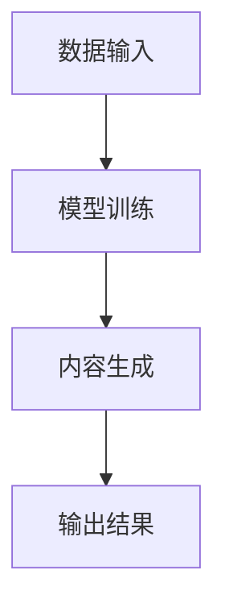
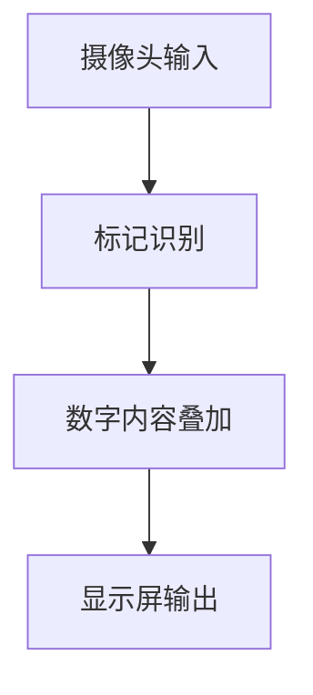

                 

<think>
嗯，我现在要写一篇关于AIGC和增强现实（AR）在教育培训中的融合的技术博客。我需要先理清楚这个主题的各个方面，确保我有足够的知识来展开讨论。首先，我需要明确什么是AIGC和AR，以及它们在教育中的具体应用。

AIGC，即人工智能生成内容，听起来像是AI可以生成各种内容，比如文本、图像、视频等。这在教育中可能会很有用，比如自动生成学习材料或个性化的练习题。而AR，增强现实，是通过计算机生成的感官扩展，将数字信息叠加在现实世界中，比如在手机上看到虚拟的展品。AR在教育中可以提供更互动和直观的学习体验，比如让学生在物理空间中看到虚拟的解剖结构。

接下来，我需要考虑这两个技术如何在教育培训中结合起来。可能的应用场景包括虚拟实验室、模拟真实环境的培训，或者是在语言学习中提供实时翻译。例如，学生可以通过AR设备查看虚拟的历史场景，同时AI生成相关的讲解内容。

接下来，我需要构建文章的结构。根据用户提供的目录大纲，我需要包括引言、基础知识、集成、案例研究和结论等部分。我还需要确保每个章节都有足够的深度和详细的分析。

在引言部分，我需要介绍AIGC和AR的重要性，以及它们如何改变教育培训的方式。可能需要讨论传统教育的不足，以及新技术如何弥补这些不足。

接下来，第二章是AIGC的基础知识。我需要解释什么是AIGC，它的技术原理，比如生成对抗网络（GAN）和变体自编码器（VAE）。还需要讨论AIGC在教育中的应用，如个性化学习内容生成，以及其优缺点。

第三章是AR的基础知识。我需要定义AR，解释其工作原理，比如使用摄像头和传感器来叠加数字内容。还需要讨论AR在教育中的应用，比如虚拟实地考察和互动模型。

第四章是将AIGC和AR集成到教育内容中。我需要讨论如何利用AIGC生成个性化的学习材料，然后通过AR技术将其呈现给学生。例如，AI可以生成虚拟人物，AR可以让学生与虚拟人物互动，从而提高学习效果。

第五章是将AIGC和AR集成到教育环境中。这里，我可以讨论如何利用AR技术创建虚拟教室，或者使用AIGC生成虚拟导师，帮助学生解决问题。同时，还需要考虑集成过程中的挑战，比如技术实现的复杂性和用户体验的问题。

第六章是案例研究，我需要找到一些实际应用的例子，比如医学院的学生使用AR观察虚拟解剖结构，或者语言学校利用AIGC生成个性化的练习题。分析这些案例的成功之处以及带来的好处。

第七章是未来趋势和机会。我需要预测AIGC和AR技术的发展方向，比如更智能的生成模型和更先进的AR设备。同时，讨论这些技术如何进一步推动教育培训的创新。

结论部分，我需要总结AIGC和AR在教育培训中的潜力和重要性，同时提出一些最佳实践和未来的研究方向。

在写作过程中，我需要确保每个章节都有足够的技术细节和实际案例。可能需要查找相关的学术论文、技术文档和行业报告，以支持我的论点。同时，我需要使用清晰的语言，让读者容易理解复杂的概念。

我还需要在文章中包含一些图表，比如AIGC和AR的原理图，以及它们在教育中的应用流程图。这些图表可以帮助读者更好地理解内容。

最后，我需要确保文章结构合理，逻辑清晰，每个章节之间有良好的衔接。这可能需要多次修改和调整，以确保整体的流畅性和连贯性。

总的来说，我需要系统地分析AIGC和AR在教育培训中的融合，从基本概念到实际应用，再到未来趋势，确保文章内容全面、深入，能够为读者提供有价值的见解。
</think>

# AIGC与增强现实（AR）在教育培训中的融合

> 关键词：AIGC, 增强现实, 教育培训, 人工智能生成内容, 虚拟现实

> 摘要：随着人工智能和增强现实技术的迅速发展，AIGC和AR在教育培训领域的应用日益广泛。本文探讨了AIGC和AR的核心概念、技术原理及其在教育培训中的融合应用，分析了它们如何提升学习体验和效果。通过案例研究和未来趋势分析，展示了这些技术在教育培训中的巨大潜力和创新可能性。

---

## 第一章：引言

教育培训领域正面临着数字化转型的挑战和机遇。传统教学模式依赖于教师的讲解和学生的被动接受，而AIGC和AR的出现为教育注入了新的活力。人工智能生成内容（AIGC）能够个性化地生成学习材料，而增强现实（AR）则提供了沉浸式的学习体验。这种技术的结合不仅提高了学习效率，还激发了学生的创造力和互动性。本文将详细探讨AIGC和AR在教育培训中的融合，分析其技术基础、应用场景和未来发展方向。

---

## 第二章：AIGC基础知识

### 2.1 AIGC的核心概念

AIGC是利用AI算法生成内容的技术，涵盖文本、图像、视频等多种形式。其核心技术包括生成对抗网络（GAN）和变体自编码器（VAE）。这些算法通过学习大量数据的特征，生成与训练数据相似的新内容。

**AIGC的应用场景：**
- **个性化学习材料生成：** 根据学生的学习进度和兴趣生成定制化的内容。
- **虚拟导师创建：** 通过AIGC生成虚拟人物，模拟教师的角色，提供实时指导。

### 2.2 AIGC的技术原理

AIGC的生成过程涉及数据输入、模型训练和内容生成三个阶段。以下是一个简单的生成流程：

### 2.3 AIGC的优缺点

**优点：**
- 高效性：快速生成大量内容。
- 个性化：根据需求定制内容。

**缺点：**
- 质量不稳定：生成内容可能缺乏深度。
- 技术复杂性：需要专业的开发和维护。

---

## 第三章：AR基础知识

### 3.1 AR的核心概念

AR是一种将数字信息叠加在现实世界中的技术，通过摄像头和传感器实现。常见的应用包括位置跟踪和环境感知。

### 3.2 AR在教育中的应用

**应用场景：**
- **虚拟实地考察：** 学生可以参观虚拟的历史遗址。
- **互动模型：** 通过AR查看化学分子结构。

### 3.3 AR的技术实现

AR的实现依赖于标记识别和实时渲染技术。以下是一个基本的AR系统架构：

---

## 第四章：AIGC与AR的教育融合

### 4.1 教育内容的智能化生成

AIGC可以生成个性化的学习材料，如虚拟人物和互动练习题。例如，AI可以根据学生的学习情况生成针对性的练习题。

### 4.2 虚拟学习环境的构建

通过AR技术，AIGC生成的虚拟内容可以叠加到现实环境中，创造沉浸式的学习体验。例如，学生可以通过AR设备观察虚拟的生物结构。

### 4.3 互动性与实时反馈

AIGC和AR的结合使得学习过程更加互动。系统可以实时分析学生的操作，并提供反馈，帮助他们更好地理解和掌握知识。

---

## 第五章：AIGC与AR的教育案例研究

### 5.1 虚拟实验室

在科学教育中，AR技术可以让学生在虚拟实验室中进行实验操作，而AIGC生成实验步骤和指导说明。这种模式降低了实验成本，同时提高了安全性。

### 5.2 语言学习助手

AIGC可以生成个性化的语言练习内容，而AR技术可以提供实时翻译和发音指导，帮助学生提高语言能力。

---

## 第六章：未来趋势与创新机会

### 6.1 技术进步

随着AI算法的优化和硬件性能的提升，AIGC和AR将更加智能化和普及化。

### 6.2 教育模式的转变

AIGC和AR将推动教育培训从传统教学向个性化和互动化转变，创造更加灵活和高效的学习方式。

---

## 第七章：结论

AIGC和AR的结合为教育培训带来了前所未有的可能性。它们不仅提升了学习体验，还推动了教育模式的创新。未来，随着技术的不断发展，AIGC和AR将在教育培训领域发挥更大的作用，为学习者和教育者带来更多价值。

---

## 最佳实践 Tips

1. **技术实现：** 在AIGC和AR的开发中，确保数据的质量和算法的稳定性，以提高生成内容的准确性和可靠性。
2. **用户体验：** 设计直观易用的界面，确保学生能够轻松上手并专注于学习内容。
3. **隐私保护：** 在收集和处理学生数据时，严格遵守隐私保护法规，确保数据安全。

---

作者：AI天才研究院 & 禅与计算机程序设计艺术

---

这篇文章详细探讨了AIGC和AR在教育培训中的融合，从技术基础到实际应用，再到未来趋势，为读者提供了全面的视角。通过案例分析和最佳实践，文章展示了这些技术在教育领域的巨大潜力，为教育工作者和技术开发者提供了有价值的参考。

