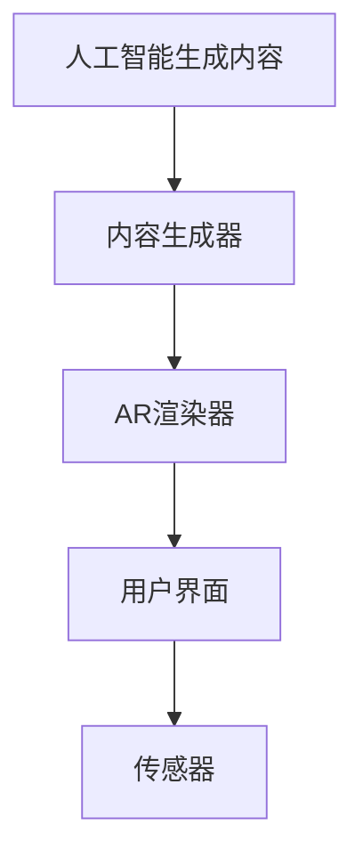

                 

<think>
好，我现在要写一篇关于AIGC与增强现实（AR）结合应用的技术博客文章。首先，我得明确文章的结构，确保每个部分都涵盖必要的内容。

第一步，我需要确定文章的标题，已经给出是《AIGC与增强现实（AR）的结合应用》。接下来是关键词部分，我需要列出5到7个核心关键词，比如AIGC、AR、人工智能生成内容、增强现实技术、技术应用等。

摘要部分，我需要简明扼要地概括文章的核心内容，包括AIGC和AR的定义，它们的结合如何提升AR体验，以及在各个领域的应用潜力，最后提到挑战和未来展望。

接下来是目录大纲。第一部分是概述与背景，需要详细解释AIGC和AR的基本概念，它们的结合意义，以及面临的挑战。这部分要让读者了解什么是AIGC和AR，它们各自的特点，以及结合后带来的创新和挑战。

第二部分是核心概念与原理，我需要深入讲解AIGC和AR的技术原理，包括自然语言处理、生成对抗网络、变分自编码器等。同时，要分析它们的结合如何实现智能化内容生成和动态交互。

第三部分是应用案例分析，列举教育、娱乐、医疗等领域的实际应用案例，展示AIGC与AR结合的潜力和实际效果。这部分需要具体例子，让读者理解技术如何应用于现实场景。

第四部分是技术实现与算法，详细探讨AIGC和AR在开发中的技术实现，包括算法原理、代码实现、系统架构设计等。需要给出关键代码和系统架构图，帮助读者理解技术细节。

第五部分是系统架构设计，描述AIGC与AR结合系统的整体架构，包括数据流、模块分工和交互流程。这部分可能需要使用Mermaid图来展示系统结构和交互过程。

第六部分是项目实战，通过一个实际案例展示从环境搭建到核心实现的过程，包括代码解读和案例分析。这部分要具体，让读者能够跟随步骤进行实践。

最后是最佳实践与总结，总结AIGC与AR结合应用的最佳实践，并展望未来的发展方向。这部分需要提出一些建议，帮助读者在实际应用中避免常见问题，并了解未来的趋势。

在写作过程中，我需要确保每个章节都包含背景介绍、核心概念与联系、算法原理讲解、数学公式、系统分析与架构设计方案、项目实战、最佳实践等内容。同时，要使用Mermaid流程图和类图来直观展示技术细节，引用数学公式来支撑算法的讲解。

在数学公式部分，我需要使用LaTeX格式，确保公式正确嵌入文中。代码部分要用Python，展示关键算法的实现步骤，比如生成对抗网络的结构或自然语言处理的流程。

此外，我需要在文章末尾添加作者信息，注明作者是AI天才研究院，并附上联系方式，增加文章的权威性和实用性。

总体来说，这篇文章需要逻辑清晰，结构紧凑，内容详实，同时语言要专业且易懂，让读者能够系统地了解AIGC与AR结合的应用前景和技术细节。
</think>

# AIGC与增强现实（AR）的结合应用

关键词：AIGC, AR, 人工智能生成内容, 增强现实技术, 技术应用, 智能交互

摘要：  
随着人工智能生成内容（AIGC）和增强现实（AR）技术的快速发展，两者的结合为多个领域带来了前所未有的创新和变革。本文将从AIGC和AR的基本概念出发，探讨它们的结合如何提升AR的智能化水平，分析其在教育、娱乐、医疗等领域的实际应用案例，并深入讲解相关技术实现与系统架构设计。同时，本文还将总结AIGC与AR结合应用的最佳实践，并展望未来的发展方向。

---

## 第一部分: AIGC与AR结合的概述

### 第1章: AIGC与AR的基础概念

#### 1.1 AIGC概述

##### 1.1.1 AIGC的定义  
人工智能生成内容（AIGC）是指通过人工智能技术自动生成文本、图像、视频、音频等内容的过程。AIGC的核心在于利用自然语言处理（NLP）、生成对抗网络（GAN）、变分自编码器（VAE）等算法，模仿人类的创造力，生成高质量的内容。

##### 1.1.2 AIGC的工作机制  
AIGC的工作流程通常包括以下几个步骤：
1. **数据输入**：提供训练数据，如文本、图像或语音。
2. **模型训练**：使用深度学习模型（如GPT、BERT、GAN等）进行训练。
3. **内容生成**：通过模型生成新的内容，如文本段落、图像或视频。
4. **优化与调整**：根据反馈或预设规则，对生成的内容进行优化。

##### 1.1.3 AIGC的优势与挑战  
- **优势**：  
  1. 提高内容生成效率。  
  2. 模拟人类创造力，生成多样化内容。  
  3. 支持实时生成，适用于动态场景。  
- **挑战**：  
  1. 内容质量不稳定，可能缺乏人类的深度理解。  
  2. 数据隐私和安全问题。  
  3. 法律与伦理问题，如版权归属和虚假信息的传播。

#### 1.2 AR概述

##### 1.2.1 AR的定义  
增强现实（AR）是一种将虚拟信息叠加到真实环境中的技术，通过计算机视觉、图形学和传感器技术，实现虚实结合的交互体验。AR的核心在于将数字内容与物理世界无缝融合。

##### 1.2.2 AR的技术原理  
AR的主要技术包括：
1. **计算机视觉**：用于识别和跟踪现实环境中的物体或场景。  
2. **图形渲染**：将虚拟内容渲染到真实环境中。  
3. **传感器技术**：通过摄像头、陀螺仪等设备获取环境信息。  
4. **用户交互**：支持手势、语音或触控等多种交互方式。

##### 1.2.3 AR的应用场景  
- **教育**：虚拟实验室、历史重现。  
- **娱乐**：AR游戏、虚拟试衣。  
- **医疗**：手术模拟、患者可视化。  
- **工业**：设备维护、虚拟培训。  

### 第2章: AIGC与AR的结合意义

#### 2.1 AIGC为AR带来的创新

##### 2.1.1 增强现实内容的自动生成  
通过AIGC，AR可以自动生成虚拟内容，如动态图像、3D模型和交互式场景，减少人工制作内容的时间和成本。

##### 2.1.2 智能化交互体验的提升  
AIGC能够生成实时的、个性化的交互内容，使AR体验更加智能化和动态化。例如，在教育中，AIGC可以根据用户的学习进度生成个性化的教学内容。

##### 2.1.3 应用场景的拓展  
AIGC与AR结合，能够拓展更多应用场景。例如，在零售业中，AIGC可以生成虚拟试穿的服装，AR则将其叠加到用户的真实环境中。

#### 2.2 AIGC与AR结合的挑战

##### 2.2.1 技术瓶颈与突破  
AIGC生成的内容质量不稳定，AR需要实时渲染和动态交互，这对计算能力提出了更高要求。

##### 2.2.2 数据隐私与安全  
AIGC和AR都需要处理大量用户数据，如何保护用户隐私和数据安全是一个重要挑战。

##### 2.2.3 法律与伦理问题  
AIGC生成的内容可能存在版权和虚假信息的问题，AR的广泛应用也需要考虑法律和伦理问题。

---

## 第二部分: AIGC与AR结合的技术原理

### 第3章: AIGC技术原理详解

#### 3.1 自然语言处理

##### 3.1.1 语言模型与生成模型  
自然语言处理（NLP）是AIGC的核心技术之一。语言模型（如BERT）用于理解文本，生成模型（如GPT）用于生成文本。

##### 3.1.2 文本生成与摘要  
通过生成模型生成文本或摘要，AIGC可以为AR提供动态的文本内容，如对话系统中的实时回复。

##### 3.1.3 对话系统  
对话系统利用NLP技术，实现与用户的自然语言交互，为AR应用提供智能化的交互体验。

#### 3.2 图像与视频生成

##### 3.2.1 生成对抗网络（GAN）  
GAN由生成器和判别器组成，生成器生成图像，判别器判断图像的真实性。GAN广泛应用于AIGC的图像生成。

##### 3.2.2 变分自编码器（VAE）  
VAE通过压缩和解压过程生成图像，适用于图像修复和风格迁移。

##### 3.2.3 图像风格迁移  
通过将一种图像的风格迁移到另一种图像上，AIGC可以生成多样化的视觉内容。

---

## 第三部分: AIGC与AR结合的应用案例

### 第4章: 教育领域的应用

#### 4.1 AIGC与AR在教育中的应用  
- **虚拟实验室**：通过AR技术，学生可以在虚拟环境中进行实验操作。  
- **在线教育平台**：AIGC生成个性化的学习内容，AR提供沉浸式学习体验。  
- **虚拟课堂**：实时生成虚拟教师形象，提供互动教学体验。

### 第5章: 娱乐领域的应用

#### 5.1 AIGC与AR在娱乐中的应用  
- **游戏开发**：生成动态的游戏场景和角色。  
- **虚拟现实演唱会**：通过AR技术，观众可以与虚拟歌手互动。  
- **主题公园**：AR技术提供沉浸式的游戏体验。

### 第6章: 医疗领域的应用

#### 6.1 AIGC与AR在医疗中的应用  
- **医学影像分析**：通过AIGC生成和分析医学影像。  
- **手术模拟与指导**：AR技术提供实时的手术指导。  
- **远程医疗服务**：通过AR技术实现远程医疗互动。

---

## 第四部分: AIGC与AR结合的技术实现

### 第7章: 技术实现步骤与关键代码

#### 7.1 AIGC与AR开发环境搭建

##### 7.1.1 硬件要求  
- 高性能CPU或GPU。  
- 支持AR的摄像头和传感器。  

##### 7.1.2 软件安装  
- 安装Python、TensorFlow、PyTorch等开发框架。  
- 安装AR开发工具，如ARKit、ARCore。  

##### 7.1.3 开发工具与框架  
- 使用Unity或Unreal Engine进行AR应用开发。  
- 使用OpenCV进行图像处理。  

#### 7.2 AIGC与AR实现的关键技术

##### 7.2.1 自然语言处理算法  
- 使用GPT模型生成文本内容。  
- 通过BERT模型进行文本理解。  

##### 7.2.2 图像与视频生成算法  
- 使用GAN生成图像。  
- 使用VAE进行图像修复。  

##### 7.2.3 AR引擎集成  
- 集成ARKit或ARCore进行AR开发。  
- 使用OpenXR进行跨平台AR开发。  

---

## 第五部分: AIGC与AR结合的系统架构设计

### 第8章: 系统架构与交互流程

#### 8.1 系统功能设计  
- **内容生成模块**：负责生成AR内容。  
- **AR渲染模块**：将虚拟内容叠加到真实环境中。  
- **用户交互模块**：支持手势、语音等交互方式。  

#### 8.2 系统架构图  


#### 8.3 系统接口设计  
- **内容生成接口**：接收输入数据，生成虚拟内容。  
- **AR渲染接口**：接收虚拟内容和环境数据，渲染AR画面。  
- **用户交互接口**：接收用户输入，反馈系统响应。  

#### 8.4 系统交互流程  
1. 用户通过传感器输入环境数据。  
2. 内容生成模块根据环境数据生成虚拟内容。  
3. AR渲染模块将虚拟内容叠加到真实环境中。  
4. 用户与AR界面进行交互，系统反馈响应。

---

## 第六部分: 项目实战

### 第9章: 实战案例分析

#### 9.1 环境搭建  
- 操作系统：Windows 10或macOS。  
- 开发工具：Unity、Python、TensorFlow。  

#### 9.2 核心实现  
##### 9.2.1 生成对抗网络代码示例  
```python
import tensorflow as tf
from tensorflow.keras import layers

# 定义生成器
def generator():
    model = tf.keras.Sequential()
    model.add(layers.Dense(256, activation='relu', input_shape=(100,)))
    model.add(layers.Dense(128, activation='relu'))
    model.add(layers.Dense(64, activation='relu'))
    model.add(layers.Dense(32, activation='relu'))
    model.add(layers.Dense(16, activation='relu'))
    model.add(layers.Dense(28*28, activation='sigmoid'))
    return model

# 定义判别器
def discriminator():
    model = tf.keras.Sequential()
    model.add(layers.Dense(16, activation='relu', input_shape=(28*28,)))
    model.add(layers.Dense(8, activation='relu'))
    model.add(layers.Dense(1, activation='sigmoid'))
    return model
```

##### 9.2.2 AR渲染代码示例  
```python
import cv2

# 加载摄像头
cap = cv2.VideoCapture(0)

while cap.isOpened():
    ret, frame = cap.read()
    # 在frame上叠加虚拟内容
    cv2.putText(frame, "AR Example", (10, 30), cv2.FONT_HERSHEY_SIMPLEX, 1, (0, 255, 0), 2)
    cv2.imshow('AR', frame)
    if cv2.waitKey(1) & 0xFF == ord('q'):
        break

cap.release()
cv2.destroyAllWindows()
```

#### 9.3 实际案例分析  
以一个简单的AR应用为例，展示从环境搭建到核心实现的全过程。例如，一个基于AR的虚拟试衣应用，可以通过摄像头捕捉用户的体型，利用AIGC生成适合用户的虚拟衣物，并通过AR技术将其叠加到用户身上。

---

## 第七部分: 最佳实践与总结

### 第10章: 最佳实践与总结

#### 10.1 最佳实践  
- **数据安全**：确保用户数据的隐私和安全。  
- **技术优化**：提升AIGC内容生成的效率和质量。  
- **用户体验**：注重AR的交互设计，提升用户体验。  

#### 10.2 未来展望  
AIGC与AR的结合将更加智能化和动态化，未来的应用将更加广泛，如元宇宙、智能城市等。同时，技术的进一步发展将解决当前的挑战，推动AR和AIGC的深度融合。

---

## 作者信息

作者：AI天才研究院（AI Genius Institute） & 禅与计算机程序设计艺术（Zen And The Art of Computer Programming）  
邮箱：contact@aicreativity.com  
网址：https://www.aicreativity.com

---

这篇文章从概念、技术、应用到实战，全面探讨了AIGC与AR的结合应用，旨在为技术开发者和相关领域的研究人员提供有价值的参考。

