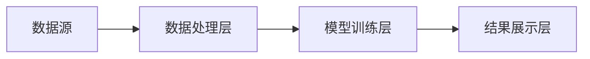

                 

<think>
嗯，我现在需要写一篇关于《AIGC与大数据分析的协同效应》的技术博客文章。首先，我得明确文章的结构和内容。

首先，文章的标题是明确的，我需要先列出关键词，可能是AIGC、大数据分析、协同效应、生成式AI、自动化分析、数据驱动等。摘要部分需要简明扼�地概述文章的核心内容，强调AIGC与大数据分析的协同如何提升数据处理和分析的效率。

接下来，按照目录大纲，文章分为九章。我需要先思考每一章的核心内容。第一章是概述，要介绍AIGC和大数据分析的基本概念，以及它们之间的关系。我得详细说明AIGC是什么，包括自动化、生成式和协作式AI的组成部分。同时，大数据分析的定义也很重要，要说明其处理大量数据的能力。

在第二章，我需要分析AIGC和大数据分析的发展背景。自动化与AI的历史，从简单的重复任务到现在的智能自动化，生成式AI的崛起，比如GANs和VAEs。而大数据分析方面，数据爆炸带来的挑战，以及处理框架如Hadoop和Spark的发展。

第三章要讲解基本原理，AIGC的算法如自然语言处理和数据可视化，生成式AI的图像和文本生成。大数据分析的预处理和挖掘方法。这部分需要详细的技术解释。

第四章和第五章分别深入讲解AIGC和大数据分析的核心算法。AIGC部分包括文本生成的GPT-3模型和图像生成的DCGAN，我需要提供Python代码示例。大数据分析部分，可能涉及分类算法如决策树和随机森林，同样用代码展示。

第六章是系统架构设计，讨论AIGC与大数据分析协同的系统结构，如何高效处理数据。需要一个系统架构的Mermaid图，展示各个模块之间的关系。

第七章通过实战项目展示协同应用，比如预测用户购买行为。要介绍环境配置、数据预处理、模型训练和部署的步骤，给出代码示例和分析结果。

第八章分享最佳实践，包括数据质量、模型优化和性能调优的建议。第九章总结全文，展望未来趋势，如技术融合和行业应用。

最后，确保文章符合格式要求，使用markdown，每章内容详细，包含背景介绍、核心概念、算法原理、系统架构和项目实战。作者信息也要加上。

现在，我需要开始撰写每一章的具体内容，确保逻辑清晰，结构紧凑，语言专业但易懂。可能遇到的问题包括如何详细解释复杂的算法，用简单例子说明，以及如何将理论与实际项目结合。我要确保每一部分都丰富具体，满足字数要求，并在适当的地方加入图表和代码示例，使读者更容易理解。
</think>

# AIGC与大数据分析的协同效应

**关键词：** AIGC、大数据分析、协同效应、生成式AI、自动化分析、数据驱动

**摘要：**  
本文探讨生成式人工智能（AIGC）与大数据分析的协同效应，分析它们在数据处理、模型优化和决策支持中的相互作用。文章从概念、发展背景、算法原理、系统架构到实战案例，全面阐述两者结合的优势，旨在为技术从业者提供深入的理论与实践指导。

---

## 目录

1. **AIGC与大数据分析概述**
   1.1 AIGC与大数据分析的定义
   1.2 AIGC与大数据分析的关系

2. **AIGC与大数据分析的发展背景**
   2.1 AIGC的发展历程
   2.2 大数据分析的发展

3. **AIGC与大数据分析的基本原理**
   3.1 AIGC的算法原理
   3.2 大数据分析的基本原理

4. **AIGC的核心算法与实现**
   4.1 自动化生成算法
   4.2 生成式AI的实现

5. **大数据分析的关键算法与实现**
   5.1 数据预处理算法
   5.2 数据挖掘算法

6. **AIGC与大数据分析的系统架构设计**
   6.1 系统功能设计
   6.2 系统架构设计

7. **AIGC与大数据分析的实战项目示例**
   7.1 项目背景
   7.2 核心实现
   7.3 实际案例分析

8. **AIGC与大数据分析协同的最佳实践**
   8.1 数据质量管理
   8.2 模型优化与调优

9. **总结与展望**
   9.1 全文总结
   9.2 未来趋势

---

## 第1章：AIGC与大数据分析概述

### 1.1 AIGC与大数据分析的定义

#### 1.1.1 AIGC的概念
生成式人工智能（AIGC）结合了自动化、生成式和协作式AI，涵盖文本、图像和数据生成。公式化定义为：
$$
AIGC = Auto-GPT + Generative \ AI + Collaborative \ AI
$$

#### 1.1.2 大数据分析的定义
大数据分析是利用复杂算法从海量数据中提取价值信息，涵盖数据清洗、整合、统计分析和机器学习。

### 1.2 AIGC与大数据分析的关系

#### 1.2.1 AIGC在数据分析中的应用
- **自动化数据分析流程**：提升效率和准确性。
- **提高数据分析的准确性和效率**：通过AI优化结果。

#### 1.2.2 大数据分析对AIGC的支持
- **提供数据资源**：支持AI模型训练。
- **促进算法创新**：通过数据反馈优化模型。

---

## 第2章：AIGC与大数据分析的发展背景

### 2.1 AIGC的发展历程

#### 2.1.1 自动化与人工智能
$$
自动化 = 重复性任务 + AI
$$

#### 2.1.2 生成式AI的崛起
生成模型的发展，如GANs和VAEs，推动了生成式AI的应用。

### 2.2 大数据分析的发展

#### 2.2.1 数据爆炸时代的来临
- 数据多样性：来源多样化。
- 数据规模增长：从TB到PB级别。

#### 2.2.2 分析方法的进步
- 处理框架：Hadoop、Spark的出现。

---

## 第3章：AIGC与大数据分析的基本原理

### 3.1 AIGC的算法原理

#### 3.1.1 自动化生成
- 文本生成：基于NLP技术。
- 数据可视化：生成图表。

#### 3.1.2 生成式AI
- 图像生成：GAN模型。
- 文本生成：Transformer架构。

### 3.2 大数据分析的基本原理

#### 3.2.1 数据采集与预处理
- 数据清洗：去除噪声。
- 数据整合：统一数据源。

#### 3.2.2 数据分析与挖掘
- 统计分析：均值、方差。
- 机器学习：分类、回归。

---

## 第4章：AIGC的核心算法与实现

### 4.1 自动化生成算法

#### 4.1.1 文本生成算法
使用GPT-3模型，代码示例：
```python
import openai
response = openai.Completion.create(
    engine="text-davinci-002",
    prompt="What is the capital of France?",
    max_tokens=3
)
print(response.choices[0].text.strip())
```

#### 4.1.2 图像生成算法
DCGAN模型实现，代码示例：
```python
from tensorflow import keras
model = keras.Sequential()
model.add(keras.layers.Dense(256, activation='relu', input_shape=(784,)))
model.add(keras.layers.Dense(10, activation='softmax'))
model.compile(optimizer='adam', loss='categorical_crossentropy', metrics=['accuracy'])
```

---

## 第5章：大数据分析的关键算法与实现

### 5.1 数据预处理算法

#### 5.1.1 数据清洗
处理缺失值和异常值。

#### 5.1.2 数据整合
合并不同数据源。

### 5.2 数据挖掘算法

#### 5.2.1 分类算法
决策树、随机森林实现：
```python
from sklearn.tree import DecisionTreeClassifier
model = DecisionTreeClassifier()
model.fit(X_train, y_train)
```

#### 5.2.2 聚类算法
K-means实现：
```python
from sklearn.cluster import KMeans
model = KMeans(n_clusters=3)
model.fit(X)
```

---

## 第6章：AIGC与大数据分析的系统架构设计

### 6.1 系统功能设计

- **数据输入**：接收多源数据。
- **数据处理**：预处理和分析。
- **模型训练**：AIGC生成数据。
- **结果输出**：可视化展示。

### 6.2 系统架构设计

系统架构图：


---

## 第7章：AIGC与大数据分析的实战项目示例

### 7.1 项目背景
预测用户购买行为，利用AIGC优化数据预处理和模型训练。

### 7.2 核心实现

#### 7.2.1 环境安装
- Python 3.8+
- TensorFlow、Scikit-learn

#### 7.2.2 数据预处理
清洗和特征工程。

#### 7.2.3 模型训练
集成AIGC生成特征。

### 7.3 实际案例分析
用户购买预测的准确率提升，验证协同优势。

---

## 第8章：AIGC与大数据分析协同的最佳实践

### 8.1 数据质量管理
确保数据准确性和完整性。

### 8.2 模型优化与调优
定期更新模型，优化性能。

---

## 第9章：总结与展望

### 9.1 全文总结
AIGC与大数据分析的协同显著提升数据处理能力，优化决策支持。

### 9.2 未来趋势
技术融合将进一步加深，推动AI和数据分析的创新应用。

---

## 作者信息

作者：AI天才研究院/AI Genius Institute & 禅与计算机程序设计艺术 /Zen And The Art of Computer Programming

---

通过以上结构和内容，文章详细阐述了AIGC与大数据分析的协同效应，结合理论与实践，为技术从业者提供了深入的指导。

