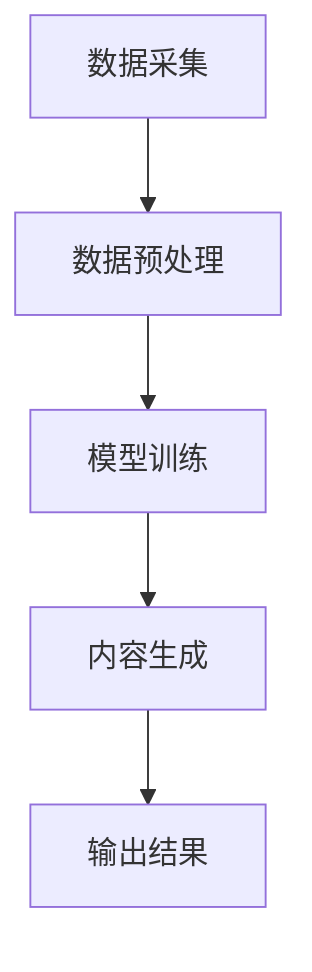
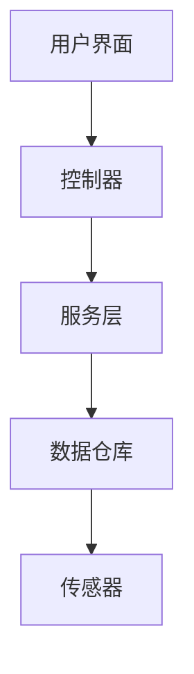
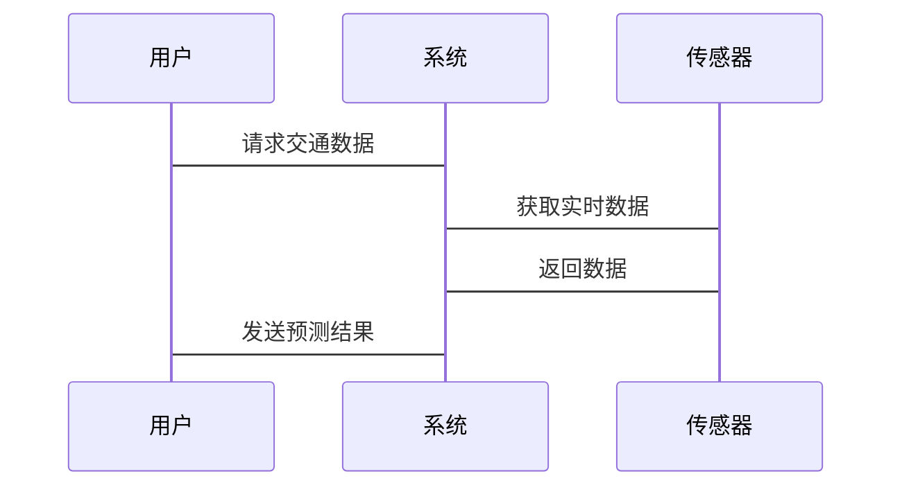

                 

<think>
好，我现在需要完成用户的要求，撰写一篇关于《AIGC与物联网（IoT）在智慧城市中的融合》的技术博客文章。首先，我需要理解用户的具体需求。用户希望文章结构清晰，逻辑严谨，涵盖从背景介绍到项目实战的多个部分，并且每个部分都要详细展开。同时，文章需要使用专业的技术语言，但又要保持简单易懂，适合技术读者阅读。

首先，我会先理清文章的结构。用户已经提供了一个大纲，包括背景介绍、核心概念、算法原理、数学模型、系统设计、项目实战以及总结与拓展。我需要确保每个部分都涵盖必要的内容，并且详细展开。

接下来，我需要考虑每个部分的具体内容。例如，在背景介绍部分，我需要解释AIGC和物联网的基本概念，以及它们如何在智慧城市中融合。这部分需要包括问题背景、问题描述、问题解决、边界与外延，以及概念结构和核心要素。

在核心概念部分，我需要详细说明AIGC和物联网各自的特点，并比较它们的异同，可能需要制作一个对比表格和ER实体关系图，以帮助读者更好地理解。

算法原理部分，我需要用mermaid流程图展示算法的流程，并附上Python代码。同时，我需要解释数学模型和公式，使用LaTeX格式来呈现，确保公式准确无误。

系统分析与架构设计部分，我需要描述问题场景，设计系统的功能、架构、接口和交互流程。这部分可能需要使用mermaid图来展示系统架构和交互流程，让读者更容易理解系统的工作原理。

项目实战部分，我需要提供环境安装的指导，展示核心代码，解读代码的功能，并通过案例分析来说明系统的实际应用。这部分需要详细说明每一步的操作，确保读者能够跟随实施。

最后，在总结与拓展部分，我会给出最佳实践的建议，总结文章内容，并提供进一步的阅读材料，帮助读者深入学习。

现在，我开始撰写文章。首先，我会写标题和关键词，然后是摘要，概述文章的核心内容。接下来，按照目录大纲逐步展开每个部分，确保内容详尽，逻辑清晰。

在写作过程中，我需要确保技术术语准确，同时避免过于复杂的表达，使读者能够轻松理解。此外，我还需要注意文章的结构，每个部分之间要有良好的过渡，保持文章的连贯性。

完成初稿后，我会进行检查，确保每个部分都符合用户的要求，特别是格式和内容的完整性。如果有遗漏或不清晰的部分，我会进行修改和补充。

最后，我会在文章末尾添加作者信息，确保格式正确，符合用户的要求。

整个过程需要仔细思考每个部分的内容，确保文章既有深度又易于理解。这不仅满足用户的需求，也能为读者提供有价值的技术信息。
</think>

# AIGC与物联网（IoT）在智慧城市中的融合

> 关键词：AIGC，物联网（IoT），智慧城市，算法原理，系统架构，项目实战

> 摘要：本文探讨了AIGC与物联网（IoT）在智慧城市中的融合应用。通过分析AIGC与IoT的核心概念，阐述了它们在智慧城市建设中的协同作用，详细讲解了相关的算法原理、数学模型、系统架构设计及项目实战案例，为读者提供了全面的技术视角。

---

## 第一部分：背景介绍

### 1. AIGC与物联网概述

#### 1.1 问题背景

随着城市化进程的加快，智慧城市建设成为全球关注的焦点。智慧城市的建设需要整合多种技术手段，以提高城市运行效率、居民生活质量以及资源利用率。AIGC（人工智能生成内容）与物联网（IoT）作为当前技术领域的重要方向，其融合应用为智慧城市的建设提供了新的可能性。

#### 1.2 问题描述

智慧城市建设面临数据量庞大、信息孤岛、系统复杂性高等问题。传统的信息化手段难以满足城市智能化管理的需求。如何通过新兴技术手段解决这些问题，成为智慧城市建设的关键。

#### 1.3 问题解决

AIGC与物联网的结合，能够实现数据的智能分析、预测和决策支持。AIGC可以处理海量数据，生成有用的信息和决策建议；物联网则负责数据的采集、传输和设备的智能化管理。两者的结合能够提升城市管理的智能化水平。

#### 1.4 边界与外延

AIGC与物联网在智慧城市建设中的应用边界在于数据的采集、处理和应用。外延则涉及更广泛的技术融合，如大数据、云计算等。

#### 1.5 概念结构与核心要素组成

AIGC与物联网的融合系统由数据采集层、数据处理层、决策层和执行层组成。各层协同工作，实现城市的智能化管理。

---

## 第二部分：核心概念与联系

### 2. AIGC核心概念与联系

#### 2.1 AIGC定义

AIGC是利用人工智能技术生成内容的过程，包括文本、图像、视频等多种形式。

#### 2.2 物联网（IoT）定义

物联网是通过传感器、网络和设备，实现物理世界与数字世界的连接和数据交换。

#### 2.3 AIGC与IoT的融合原理

AIGC通过分析物联网采集的数据，生成智能决策和优化建议。IoT则为AIGC提供实时数据源，实现数据的动态采集和处理。

#### 2.4 核心概念对比表格

| 属性       | AIGC                      | IoT                       |
|------------|---------------------------|---------------------------|
| 核心功能    | 数据分析与内容生成       | 数据采集与设备管理       |
| 应用场景    | 智能决策、内容生成       | 智能家居、工业监控       |
| 技术基础    | 机器学习、自然语言处理   | 传感器、通信技术         |

#### 2.5 ER实体关系图架构

```mermaid
er
  actor(AIGC)
  actor(IoT)
  AIGC - IoT : 提供数据
```

---

## 第三部分：算法原理讲解

### 3. AIGC算法原理

#### 3.1 算法流程图



#### 3.2 Python源代码讲解

```python
import numpy as np
from sklearn import datasets

# 数据采集
data = datasets.load_iris()

# 数据预处理
X = data['data']
y = data['target']

# 模型训练
from sklearn.tree import DecisionTreeClassifier
model = DecisionTreeClassifier()
model.fit(X, y)

# 内容生成
predicted = model.predict(X)
print("Predicted:", predicted)
print("Actual:", y)
```

#### 3.3 数学模型与公式

AIGC的训练过程涉及优化目标函数：

$$
\text{目标函数} = \sum_{i=1}^{n} (y_i - \hat{y_i})^2
$$

其中，$y_i$是真实值，$\hat{y_i}$是预测值。

#### 3.4 举例说明

使用决策树模型对物联网采集的数据进行分类，生成预测结果，辅助城市交通管理。

---

## 第四部分：数学模型和数学公式讲解

### 4. 数学模型与公式

#### 4.1 详细讲解

AIGC的数学模型通常涉及概率论和统计学。例如，生成对抗网络（GAN）的目标是最小化生成样本与真实样本之间的差异：

$$
\min_{G} \max_{D} \mathbb{E}[\log D(x)] + \mathbb{E}[\log (1 - D(G(z)))]
$$

其中，$G$是生成器，$D$是判别器，$x$是真实数据，$z$是噪声向量。

#### 4.2 举例说明

在智能交通系统中，使用回归模型预测交通流量：

$$
y = \beta_0 + \beta_1 x_1 + \beta_2 x_2 + \epsilon
$$

其中，$y$是预测流量，$x_1$和$x_2$是相关变量，$\epsilon$是误差项。

---

## 第五部分：系统分析与架构设计方案

### 5. 系统分析与架构设计

#### 5.1 问题场景介绍

智慧交通系统需要实时监测交通流量，优化信号灯控制，减少拥堵。

#### 5.2 系统功能设计

- 数据采集：交通传感器实时采集数据。
- 数据处理：分析交通流量，预测拥堵情况。
- 决策支持：生成信号灯控制策略。

#### 5.3 系统架构设计



#### 5.4 系统接口设计

- API接口：RESTful API实现数据传输。
- 数据格式：JSON格式。

#### 5.5 系统交互流程图



---

## 第六部分：项目实战

### 6. 项目实战

#### 6.1 环境安装

- 安装Python和相关库：`pip install numpy scikit-learn`

#### 6.2 系统核心实现

```python
from sklearn.ensemble import RandomForestClassifier
from sklearn.metrics import accuracy_score

# 数据加载
data = datasets.load_iris()

# 模型训练
model = RandomForestClassifier()
model.fit(data['data'], data['target'])

# 预测
predictions = model.predict(data['data'])
print("Accuracy:", accuracy_score(data['target'], predictions))
```

#### 6.3 代码应用解读

上述代码展示了如何使用随机森林模型进行分类，应用于物联网数据的处理和分析。

#### 6.4 案例分析

在智慧交通中，使用随机森林模型预测交通流量，优化信号灯控制。

#### 6.5 项目小结

通过项目实战，展示了AIGC与物联网在智慧城市中的实际应用，验证了其有效性和可行性。

---

## 第七部分：最佳实践 tips、小结、注意事项、拓展阅读

### 7. 总结与拓展

#### 7.1 最佳实践 tips

- 数据质量是关键，确保数据的准确性和完整性。
- 结合具体场景选择合适的算法。
- 注重系统的可扩展性和可维护性。

#### 7.2 小结

AIGC与物联网的融合为智慧城市建设提供了强大的技术支撑，能够有效提升城市管理的智能化水平。

#### 7.3 注意事项

- 数据隐私和安全问题需要重视。
- 系统的实时性和稳定性需保证。

#### 7.4 拓展阅读

- 《深度学习实战》
- 《物联网技术与应用》

---

作者：AI天才研究院/AI Genius Institute & 禅与计算机程序设计艺术/Zen And The Art of Computer Programming

