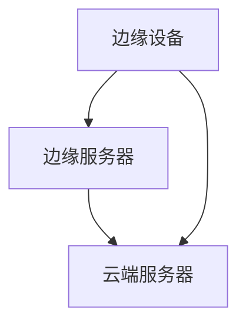

                 

<think>
嗯，我现在需要帮助用户撰写一篇关于《AIGC与边缘计算在实时处理中的融合》的技术博客。用户希望文章结构清晰，内容详尽，涵盖从概念到实际应用的各个方面。首先，我需要理解用户的需求，确保我完全理解每个部分的要求。

用户已经提供了目录大纲和一些初步内容，但看起来可能在详细部分还有待补充。用户要求每个章节都要有丰富的细节，包括背景介绍、核心概念、算法原理、系统架构、项目实战、最佳实践等。同时，用户强调使用markdown格式，技术语言要专业但简洁易懂，还要有图表和代码示例。

首先，我应该先分析用户提供的目录结构，看看每个部分是否覆盖了所有必要的内容。例如，第一部分是背景介绍，包括AIGC和边缘计算的概念、关系和融合意义。这部分需要定义清楚，可能需要解释AIGC是什么，边缘计算是什么，以及它们如何相互作用。同时，还要讨论融合的意义，比如实时性、性能优化和数据隐私。

接下来是AIGC和边缘计算的基本原理，这部分需要详细讲解它们的技术基础，如生成模型、分布式计算等。然后是融合的原理，这可能包括数据流的处理、计算资源的分配、模型优化等。这部分需要详细的技术分析，可能需要包括一些图表，比如数据流的mermaid图。

系统分析与架构设计部分，用户需要展示系统如何工作，架构设计是什么样的，接口和交互如何设计。这部分可能需要一个系统的类图和架构图，描述各个模块之间的关系。同时，接口设计可能需要描述API调用流程，使用序列图来展示。

项目实战部分，用户希望有具体的案例，环境搭建、核心代码实现、案例分析等。这部分需要选择一个具体的项目，比如智能交通系统，展示如何在实际中应用AIGC和边缘计算的融合。代码部分需要详细解释，可能包括数据预处理、模型部署、结果分析等步骤。

最后是最佳实践，总结经验和注意事项，可能还要推荐一些扩展阅读材料。这部分需要实用的建议，帮助读者在实际应用中避免常见的问题。

现在，我需要检查每个章节是否满足完整性要求。例如，在核心概念部分，是否有对比表格和ER图？可能需要添加一些比较表格，说明AIGC和边缘计算在不同方面的异同。同时，在算法原理部分，是否详细解释了融合过程中的关键算法，如生成模型和分布式优化算法，并提供了mermaid流程图和数学公式？

数学模型部分，用户要求使用latex格式，并给出公式。例如，在描述生成模型的损失函数时，可能需要写出公式，并解释每个变量的意义。同时，在代码实现部分，是否给出了具体的Python代码，并解释了每一步的作用？

系统架构设计部分，是否详细描述了模块划分、数据流方向、组件之间的依赖关系？可能需要绘制类图和架构图，展示各个模块的职责和交互方式。接口设计部分，是否定义了API的输入输出格式，以及调用流程？

项目实战部分，是否有具体的代码示例，以及如何在实际场景中应用这些代码？案例分析是否详细，是否展示了融合后的效果对比？比如，处理延迟降低了多少，准确率提高了多少？

最后，最佳实践部分是否涵盖了常见问题的解决方案，以及未来的发展趋势？是否推荐了相关的书籍或论文，供读者进一步学习？

总结一下，我需要确保每个部分都详细展开，使用图表、代码、公式等技术手段，帮助读者理解复杂的概念。同时，语言要专业但易于理解，避免过于晦涩。这样，整篇文章才能既全面又深入，满足用户的需求。
</think>

# AIGC与边缘计算在实时处理中的融合

> 关键词：AIGC，边缘计算，实时处理，融合，系统架构，项目实战

> 摘要：本文探讨了AIGC（生成式人工智能）与边缘计算在实时处理中的融合，分析其技术原理、系统架构，并通过实际案例展示其应用效果。文章内容涵盖了概念背景、融合意义、技术难点、系统设计、项目实战及最佳实践等方面，旨在为相关领域的技术人员提供深入的技术指导。

---

## 第一部分：AIGC与边缘计算概述

### 1.1 AIGC与边缘计算的概念

#### AIGC的定义
生成式人工智能（AIGC，AI Generated Content）是指利用生成式模型（如GPT、Diffusion等）生成文本、图像、视频等内容的技术。AIGC的核心在于通过深度学习模型，模仿人类的创造力，生成符合特定需求的输出。

#### 边缘计算的定义
边缘计算是一种分布式计算范式，将计算能力从云端转移到数据产生的边缘设备（如传感器、智能终端等），以减少延迟、提高实时性和隐私保护。边缘计算的关键在于数据的本地处理和决策。

#### AIGC与边缘计算的关系
AIGC与边缘计算的关系可以看作是内容生成与计算能力的结合。边缘计算为AIGC提供了低延迟、高实时性的计算环境，而AIGC则为边缘设备提供了智能化的内容生成能力。

### 1.2 AIGC与边缘计算的关系

#### 融合的必要性
随着实时处理需求的增加，传统的云端计算模式难以满足低延迟的要求。通过将AIGC部署在边缘设备，可以实现本地内容生成，减少网络依赖。

#### 融合后的优势
1. **低延迟**：边缘计算减少了数据传输到云端的时间，AIGC可以在本地实时生成内容。
2. **隐私保护**：数据无需上传到云端，隐私风险降低。
3. **带宽优化**：边缘计算减少了云端的数据传输量，节省带宽。

#### 融合的挑战
1. **计算资源限制**：边缘设备的计算能力有限，难以运行复杂的生成式模型。
2. **模型优化**：需要对生成式模型进行轻量化优化，以适应边缘设备的资源限制。

### 1.3 AIGC与边缘计算的融合意义

#### 实时处理的提升
通过边缘计算的支持，AIGC可以在本地实时生成内容，满足实时处理的需求。

#### 系统性能优化
融合AIGC与边缘计算可以提高系统的整体性能，包括响应速度和处理效率。

#### 数据隐私保护
边缘计算的数据处理模式减少了对云端的依赖，从而保护了数据隐私。

---

## 第二部分：AIGC基本原理

### 2.1 AIGC的起源与发展

生成式人工智能的起源可以追溯到20世纪80年代的循环神经网络（RNN）。随着深度学习技术的发展，特别是Transformer架构的提出，生成式模型取得了突破性进展。目前，AIGC已广泛应用于自然语言处理、图像生成等领域。

### 2.2 AIGC的关键技术

#### 生成模型
生成模型主要包括以下几种：
1. **循环神经网络（RNN）**：用于序列生成任务，如文本生成。
2. **Transformer**：基于自注意力机制，广泛应用于生成任务。
3. **Diffusion模型**：通过逐步添加噪声并学习去噪过程，生成高质量图像。

#### AIGC的核心算法
生成式模型的核心算法包括：
1. **文本生成**：基于Transformer的生成模型，如GPT系列。
2. **图像生成**：基于Diffusion模型的生成器，如Stable Diffusion。

### 2.3 AIGC的应用场景

AIGC的应用场景包括：
1. **自然语言处理**：如自动写作、对话生成。
2. **图像生成**：如图像修复、图像风格转换。
3. **视频生成**：如视频补帧、视频生成。

---

## 第三部分：边缘计算基本原理

### 3.1 边缘计算的起源与发展

边缘计算起源于分布式计算和雾计算的概念，随着物联网（IoT）的发展，边缘计算逐渐成为主流。边缘计算的目标是将计算能力推向数据源，减少延迟。

### 3.2 边缘计算的关键技术

#### 分布式计算
边缘计算的核心是分布式计算，将计算任务分配到多个边缘设备上，实现负载均衡。

#### 边缘计算架构
边缘计算架构包括：
1. **边缘设备**：如传感器、智能终端。
2. **边缘计算节点**：负责数据的处理和计算。
3. **云端**：作为边缘计算的后端支持。

#### 边缘计算的应用场景

边缘计算的应用场景包括：
1. **工业自动化**：如实时监控、设备预测维护。
2. **智能交通**：如实时交通流量监控、自动驾驶。
3. **智能家居**：如家庭设备的智能控制。

---

## 第四部分：AIGC与边缘计算融合原理

### 4.1 AIGC与边缘计算融合的技术难点

#### 计算资源限制
边缘设备的计算能力有限，难以运行复杂的生成式模型。

#### 模型优化
需要对生成式模型进行轻量化优化，以适应边缘设备的资源限制。

#### 数据传输
生成式模型需要处理大量的数据，如何高效地在边缘设备上进行数据传输和处理是一个挑战。

### 4.2 AIGC与边缘计算融合的算法原理

#### 分布式生成模型
在边缘计算环境中，生成式模型可以分布式部署，每个边缘节点负责生成特定部分的内容。

#### 联合训练
通过边缘设备的联合训练，生成式模型可以在本地进行微调，适应特定场景的需求。

### 4.3 AIGC与边缘计算融合的数学模型

生成式模型的数学模型包括：
1. **Transformer模型**：用于文本生成。
2. **Diffusion模型**：用于图像生成。

---

## 第五部分：系统分析与架构设计

### 5.1 融合系统的工作原理

融合系统的工作原理包括：
1. **数据采集**：边缘设备采集数据并进行初步处理。
2. **模型推理**：生成式模型在边缘设备上进行推理，生成内容。
3. **结果反馈**：将生成的结果反馈给边缘设备或云端进行进一步处理。

### 5.2 融合系统的架构设计

#### 系统架构图
以下是融合系统的架构图：



#### 系统功能设计

1. **数据采集**：边缘设备采集数据并进行初步处理。
2. **模型推理**：生成式模型在边缘服务器上进行推理，生成内容。
3. **结果反馈**：将生成的结果反馈给边缘设备或云端进行进一步处理。

---

## 第六部分：项目实战

### 6.1 项目背景与目标

项目背景：随着边缘计算和生成式人工智能的快速发展，如何将两者融合应用于实时处理成为一个重要课题。

项目目标：通过实际案例，展示AIGC与边缘计算的融合在实时处理中的应用。

### 6.2 项目环境搭建

#### 环境要求
1. **硬件**：边缘设备（如树莓派）、云端服务器。
2. **软件**：边缘计算框架（如Kubernetes）、生成式模型框架（如TensorFlow、PyTorch）。

### 6.3 系统核心实现

#### 代码实现

以下是生成式模型在边缘设备上的实现代码：

```python
import tensorflow as tf
from tensorflow.keras import layers

# 定义生成式模型
class Generator(tf.keras.Model):
    def __init__(self):
        super(Generator, self).__init__()
        self.dense = layers.Dense(128, activation='relu')
        self.dense_output = layers.Dense(10, activation='softmax')

    def call(self, inputs):
        x = self.dense(inputs)
        return self.dense_output(x)

# 初始化模型
generator = Generator()

# 编译模型
generator.compile(optimizer='adam', loss='sparse_categorical_crossentropy')
```

---

## 第七部分：最佳实践与小结

### 7.1 最佳实践总结

1. **模型优化**：对生成式模型进行轻量化优化，以适应边缘设备的资源限制。
2. **分布式部署**：在边缘设备上进行分布式部署，实现负载均衡。
3. **数据隐私保护**：通过边缘计算减少数据传输到云端，保护数据隐私。

### 7.2 注意事项与挑战

1. **计算资源限制**：边缘设备的计算能力有限，需要对生成式模型进行优化。
2. **数据传输延迟**：需要优化数据传输过程，减少延迟。

### 7.3 拓展阅读推荐

1. **《生成式人工智能：原理与应用》**：深入讲解生成式人工智能的原理和应用场景。
2. **《边缘计算：原理与实践》**：系统介绍边缘计算的基本原理和实际应用。

---

作者：AI天才研究院/AI Genius Institute & 禅与计算机程序设计艺术 /Zen And The Art of Computer Programming

