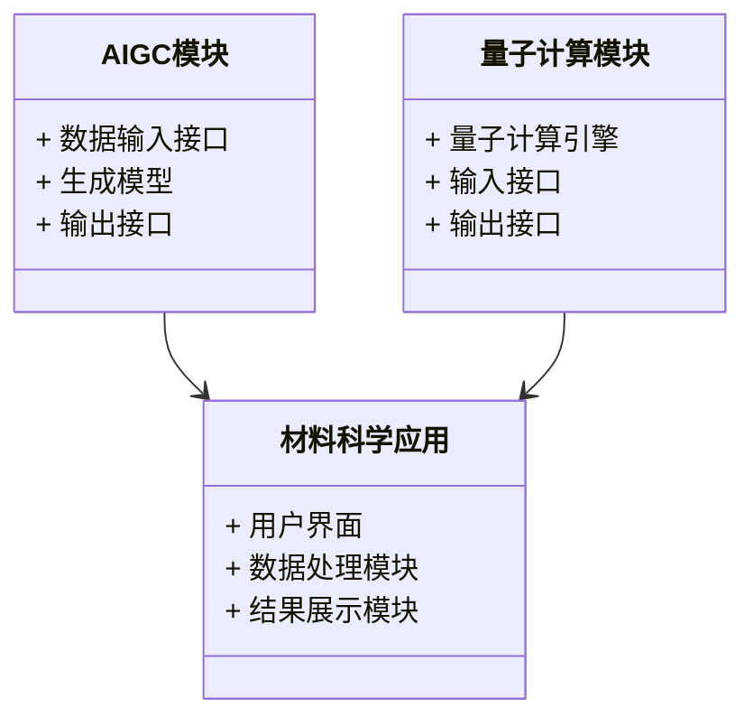
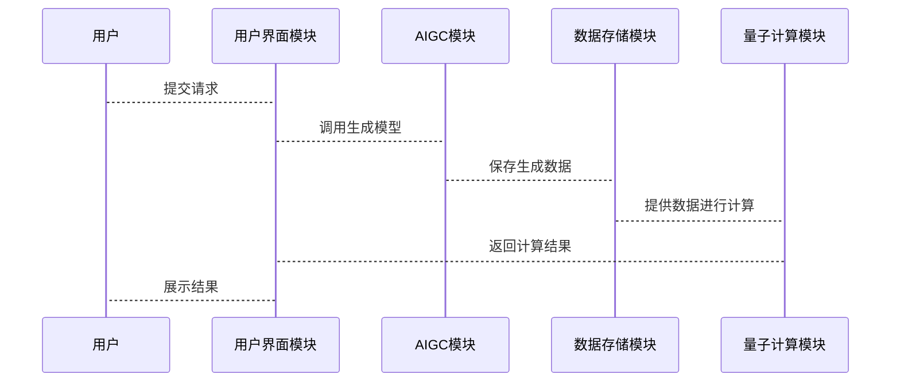

                 

<think>
嗯，用户希望我写一篇关于《AIGC与量子计算在材料科学中的融合》的技术博客，按照他提供的大纲结构来。看起来他需要一个结构严谨、内容详尽的专业文章，字数控制在1万到1万2左右。

首先，我得理解用户的需求。他可能是一位研究人员或者技术专家，想要深入探讨这两个前沿技术如何在材料科学中结合。他要求文章分多个部分，从背景介绍到系统设计，再到项目实战，每个部分都有详细的内容。

接下来，我需要分析每个章节的具体内容。例如，背景介绍部分需要涵盖材料科学的现状、挑战，以及AIGC和量子计算的基本概念。这部分需要简明扼要，同时吸引读者的兴趣。

核心概念部分，我需要详细说明AIGC和量子计算在材料科学中的具体应用，比如材料设计和模拟。这里可能需要举例说明，让读者更容易理解。

算法原理部分，我需要解释生成对抗网络（GAN）和量子门的基本原理，并用图表来辅助说明。同时，数学公式要用LaTeX展示，确保准确无误。

系统分析和架构设计部分，我需要绘制类图、架构图和序列图，展示系统的各个模块及其交互。这部分可能需要使用Mermaid语法来生成图表。

项目实战部分，我需要提供具体的代码示例，展示如何实现这些算法，并分析实际案例。这样读者可以跟着操作，理解理论如何应用于实践。

最后，最佳实践部分要给出应用建议和风险提示，帮助读者在实际操作中避免常见错误。拓展阅读部分则推荐相关文献和资源，供有兴趣的读者深入研究。

整体来看，用户希望文章既有深度又通俗易懂，适合专业读者。因此，我需要确保内容逻辑清晰，结构紧凑，同时使用专业术语但不过于晦涩。

在撰写过程中，我可能会遇到如何将复杂的量子计算原理简化为易懂的内容，或者如何选择合适的案例来展示AIGC的应用。这时候，我需要查阅相关资料，确保信息的准确性，并用生动的例子来说明。

总的来说，我需要一步步按照大纲来填充内容，确保每个部分都详尽且符合逻辑，最终完成一篇高质量的技术博客。
</think>

# AIGC与量子计算在材料科学中的融合

> 关键词：AIGC，量子计算，材料科学，融合，算法，数学模型

> 摘要：本文探讨了AIGC（AI-Generated Content）与量子计算在材料科学中的融合应用，分析了两者的结合如何推动材料科学的发展。文章从背景介绍、核心概念与联系、算法原理讲解、数学模型和公式、系统分析与架构设计、项目实战、最佳实践与拓展阅读等多个方面展开，详细阐述了AIGC与量子计算在材料科学中的融合过程、实现方法及实际应用案例。

---

## 第一部分：背景介绍

### 第1章：问题背景与核心概念

#### 1.1.1 材料科学的现状与挑战
材料科学是现代科技发展的基础，广泛应用于能源、医疗、建筑等领域。然而，材料科学的研究面临以下挑战：
- **研究周期长**：传统实验方法需要长时间进行材料筛选和测试。
- **计算成本高**：材料模拟需要处理海量数据，计算资源消耗巨大。
- **复杂性高**：材料性能受多种微观因素影响，难以预测。

#### 1.1.2 AIGC的概念与优势
AIGC（AI-Generated Content）是指利用人工智能生成内容的技术，其优势在于：
- **高效性**：通过机器学习模型快速生成材料结构和性能数据。
- **创新性**：能够发现传统方法难以预测的新材料。
- **数据驱动**：基于大量数据进行模式识别和预测。

#### 1.1.3 量子计算的基本原理与特点
量子计算利用量子叠加和量子纠缠的特性，具有以下特点：
- **并行计算能力**：能够在同一时间处理大量可能性。
- **计算速度**：在某些领域（如材料模拟）远超经典计算机。
- **复杂性**：需要高度专业化的硬件和算法。

#### 1.1.4 AIGC与量子计算融合的必要性
- **融合驱动因素**：材料科学需要更高效、更精确的计算工具。
- **融合意义**：通过结合AIGC的生成能力与量子计算的计算能力，提升材料科学的研究效率。
- **融合目标**：开发新型材料，优化材料性能。

---

## 第二部分：核心概念与联系

### 第2章：AIGC在材料科学中的应用

#### 2.1.1 AIGC在材料设计中的应用
- **生成材料结构**：通过GAN生成材料的晶体结构。
- **优化材料性能**：利用强化学习优化材料的物理化学性质。

#### 2.1.2 AIGC在材料模拟与预测中的应用
- **材料模拟**：通过AI模型模拟材料的微观结构。
- **性能预测**：基于历史数据预测材料的力学、热学等性能。

### 第3章：量子计算在材料科学中的应用

#### 3.1.1 量子计算在材料结构解析中的应用
- **解析复杂材料结构**：利用量子计算分析材料的晶体结构。
- **识别材料缺陷**：通过量子算法定位材料中的缺陷位置。

#### 3.1.2 量子计算在材料性能优化中的应用
- **优化材料性能**：通过量子计算优化材料的物理化学性质。
- **指导材料合成**：利用量子计算预测材料合成路径。

---

### 第4章：AIGC算法原理讲解

#### 4.1.1 AIGC算法基础
- **生成对抗网络（GAN）**：由生成器和判别器组成，通过对抗训练生成高质量数据。
- **强化学习**：通过奖励机制优化生成结果。

#### 4.1.2 AIGC算法流程
- **数据预处理**：清洗和标注数据。
- **模型训练**：训练生成模型。
- **模型评估与优化**：通过验证集评估模型性能并进行优化。

### 第5章：量子计算算法原理讲解

#### 5.1.1 量子计算算法基础
- **量子叠加**：量子态可以同时表示多个状态。
- **量子纠缠**：多个量子态之间形成强关联。
- **量子门**：用于对量子态进行操作的基本逻辑门。

#### 5.1.2 量子计算算法流程
- **量子状态初始化**：设置初始量子态。
- **量子计算过程**：通过量子门操作生成目标量子态。
- **量子测量与结果解析**：通过测量获取结果并进行解析。

---

### 第6章：数学模型和数学公式讲解

#### 6.1.1 材料科学中的数学模型
- **材料性能预测模型**：通过物理方程预测材料的力学性能。
- **材料结构解析模型**：利用数学方法解析材料的晶体结构。

#### 6.1.2 量子计算中的数学模型
- **量子状态表示**：用向量表示量子态。
- **量子计算算法的数学基础**：利用线性代数和概率论进行量子计算。

### 第7章：公式讲解与举例说明

#### 7.1.1 材料性能预测公式讲解
材料的强度可以通过以下公式预测：
$$ P = \rho \cdot \sigma $$
其中，$P$ 表示材料的强度，$\rho$ 表示材料的密度，$\sigma$ 表示材料的应力。

#### 7.1.2 量子计算公式讲解
量子态的叠加可以通过以下公式表示：
$$ \psi = \sum_{i} a_i |i\rangle $$
其中，$\psi$ 表示量子态，$a_i$ 表示叠加系数，$|i\rangle$ 表示基态。

---

## 第三部分：系统分析与架构设计

### 第8章：系统功能设计

#### 8.1.1 领域模型设计


#### 8.1.2 系统功能设计
- **功能模块划分**：AIGC模块、量子计算模块、用户界面模块。
- **功能实现细节**：通过API接口实现模块间的通信。

### 第9章：系统架构设计

#### 9.1.1 系统架构设计


#### 9.1.2 系统接口设计
- **接口定义**：定义模块间的API接口。
- **接口实现**：通过RESTful API实现模块间的通信。

### 第10章：系统交互

#### 10.1.1 系统交互设计


---

## 第四部分：项目实战

### 第11章：项目实战

#### 11.1.1 环境安装与配置
- **环境要求**：Python 3.8及以上，TensorFlow、Qiskit库。
- **环境配置步骤**：
  1. 安装Python和相关库。
  2. 配置量子计算环境（如Qiskit）。

#### 11.1.2 系统核心实现
```python
import tensorflow as tf
from tensorflow.keras import layers

# 定义生成器
def generator():
    model = tf.keras.Sequential()
    model.add(layers.Dense(256, activation='relu', input_dim=100))
    model.add(layers.Dense(128, activation='relu'))
    model.add(layers.Dense(64, activation='sigmoid'))
    return model

# 定义判别器
def discriminator():
    model = tf.keras.Sequential()
    model.add(layers.Dense(64, activation='relu', input_dim=64))
    model.add(layers.Dense(32, activation='relu'))
    model.add(layers.Dense(1, activation='sigmoid'))
    return model
```

#### 11.1.3 实际案例分析与讲解
- **案例选择**：预测新型半导体材料的性能。
- **案例分析**：通过AIGC生成材料结构，再利用量子计算优化性能。

#### 11.1.4 项目小结
- **项目总结**：AIGC与量子计算的结合能够显著提升材料科学研究效率。
- **项目经验分享**：注重算法与实际应用的结合，确保模型的泛化能力。

---

## 第五部分：最佳实践与拓展阅读

### 第12章：最佳实践

#### 12.1.1 最佳实践建议
- **AIGC应用**：确保数据质量，避免过拟合。
- **量子计算应用**：选择适合的量子算法，降低计算复杂度。

#### 12.1.2 注意事项与风险提示
- **AIGC风险**：数据偏差可能导致生成结果不准确。
- **量子计算风险**：硬件限制可能影响计算效率。

### 第13章：拓展阅读

#### 13.1.1 相关文献推荐
- 推荐论文：《AIGC in Materials Science》。
- 推荐论文：《Quantum Computing in Materials Science》。

#### 13.1.2 进一步学习资源
- 在线课程：Coursera上的《量子计算入门》。
- 专业论坛：ResearchGate上的材料科学与量子计算讨论组。

---

作者：AI天才研究院/AI Genius Institute & 禅与计算机程序设计艺术 /Zen And The Art of Computer Programming

