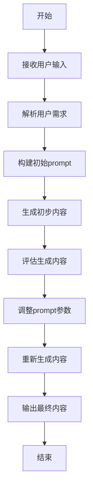
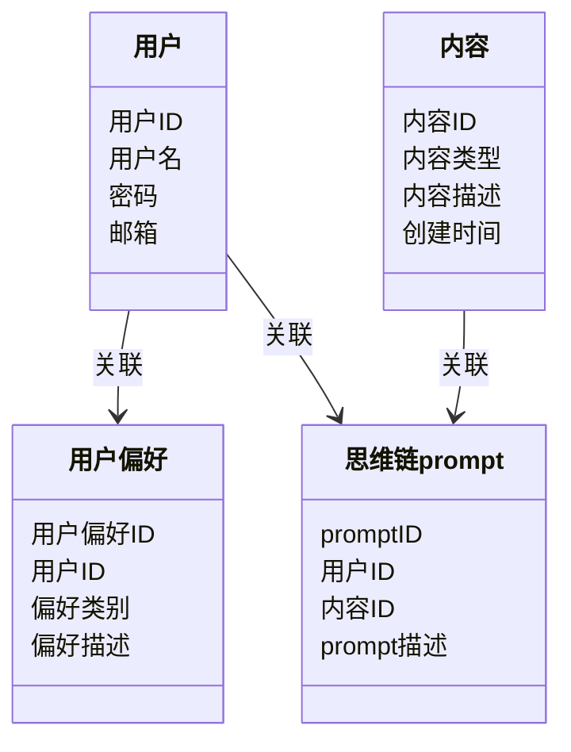

                 

<think>
好，我需要根据用户的要求，撰写一篇关于“AIGC内容个性化：思维链prompt的力量”的技术博客文章。首先，我得理解用户的需求，他希望文章结构清晰，内容专业且有深度，涵盖从基础概念到项目实施的各个方面。同时，文章需要符合特定的格式要求，包括关键词、摘要、目录大纲，以及详细的各个章节内容。

首先，我会从引入章节开始，介绍AIGC和内容个性化的背景，然后定义核心概念和理论框架，接着讨论思维链prompt的机制。在技术原理部分，我需要详细讲解算法的数学模型和流程图，确保用Python代码来举例说明。接下来，系统架构部分需要包括领域模型、架构设计和交互序列图。最后，通过实际案例分析，展示项目实施过程，并总结最佳实践和未来方向。

整个过程中，我需要确保每个章节内容丰富，详细具体，使用专业的技术语言，同时保持逻辑清晰。还要注意格式要求，比如使用Mermaid图和LaTeX公式，以及在末尾添加作者信息。这需要我一步步来，先完成大纲，再逐步填充每个部分，确保不遗漏任何关键点，并且保持文章的连贯性和深度。
</think>

# AIGC内容个性化：思维链prompt的力量

---

## 关键词：
AIGC（生成式人工智能）、内容个性化、思维链prompt、生成式模型、算法机制、系统架构

---

## 摘要：
在生成式人工智能（AIGC）快速发展的今天，内容个性化已成为提升用户体验的核心策略。本文将深入探讨AIGC内容个性化的核心概念，重点分析“思维链prompt”这一创新机制。通过理论分析、算法原理、系统架构和项目实践的多维度阐述，揭示如何利用思维链prompt实现精准的内容生成与个性化推荐。本文不仅为技术开发者提供理论支持，也为实际应用提供了可操作的方案。

---

## 目录大纲：
### 第1章 引入AIGC与内容个性化的核心概念
1.1 背景与问题定义  
1.2 核心概念与理论框架  
1.3 边界与外延  

### 第2章 AIGC的核心概念与联系  
2.1 AIGC的定义与分类  
2.2 核心属性与特征对比  
2.3 ER实体关系图  

### 第3章 思维链prompt的算法机制  
3.1 算法原理与模型解析  
3.2 算法流程图（Mermaid）  
3.3 Python代码实现与案例  

### 第4章 AIGC的数学模型与公式  
4.1 基础公式与定理  
4.2 公式推导与应用案例  

### 第5章 AIGC的系统架构与设计  
5.1 系统描述与功能设计  
5.2 领域模型与类图（Mermaid）  
5.3 系统架构图与接口设计  
5.4 交互序列图（Mermaid）  

### 第6章 AIGC的项目实施与案例分析  
6.1 环境搭建与工具选择  
6.2 核心实现与代码解读  
6.3 案例分析与效果评估  
6.4 项目总结与经验反思  

### 第7章 结论与最佳实践  
7.1 实用建议与未来展望  
7.2 读者总结与思考  

---

## 正文：

### 第1章 引入AIGC与内容个性化的核心概念

#### 1.1 背景与问题定义
随着人工智能技术的迅速发展，生成式AI（AIGC）在内容创作、推荐系统和个性化服务中的应用越来越广泛。然而，传统的生成模型往往缺乏对用户意图的深度理解，导致生成内容与用户需求不符。因此，如何实现精准的内容个性化生成成为当前AIGC领域的重要挑战。

#### 1.2 核心概念与理论框架
AIGC（生成式人工智能）是一种利用机器学习模型生成文本、图像或其他类型内容的技术。内容个性化则指根据用户的偏好、行为和背景，生成符合其独特需求的内容。思维链prompt是一种通过引导生成模型沿着特定思考路径工作的机制，旨在提升生成内容的相关性和准确性。

#### 1.3 边界与外延
AIGC内容个性化的边界在于生成内容的质量和相关性，而其外延则涵盖文本生成、图像生成、推荐系统等多个领域。通过思维链prompt，AIGC能够更精准地捕捉用户需求，实现内容的深度个性化。

---

### 第2章 AIGC的核心概念与联系

#### 2.1 AIGC的定义与分类
生成式人工智能（AIGC）是指利用生成对抗网络（GAN）、变换器（Transformer）等模型生成新内容的技术。根据应用场景的不同，AIGC可以分为文本生成、图像生成、音频生成等多种类型。

#### 2.2 核心属性与特征对比
下表对比了传统生成模型与AIGC在内容生成上的核心属性：

| 属性         | 传统生成模型                     | AIGC生成模型                     |
|--------------|----------------------------------|----------------------------------|
| 输入方式     | 随机噪声或固定向量               | 用户意图或上下文信息             |
| 输出结果     | 随机生成内容                     | 针对性生成内容                     |
| 应用场景     | 数据扩充、图像生成               | 内容创作、个性化推荐               |
| 精准度       | 较低                             | 较高（通过思维链prompt优化）       |

#### 2.3 ER实体关系图
以下是AIGC内容个性化系统的ER实体关系图：

```mermaid
er
    %% AIGC内容个性化系统ER图
    entity 用户 {
        key 用户ID
        string 用户名
        string 密码
        string 邮箱
    }
    
    entity 内容 {
        key 内容ID
        string 内容类型
        string 内容描述
        date 创建时间
    }
    
    entity 用户偏好 {
        key 用户偏好ID
        foreign 用户ID -> 用户
        string 偏好类别
        string 偏好描述
    }
    
    entity 思维链prompt {
        key promptID
        foreign 用户ID -> 用户
        foreign 内容ID -> 内容
        string prompt描述
    }
    
    用户 --> 用户偏好 : 关联关系
    用户 --> 思维链prompt : 关联关系
    内容 --> 思维链prompt : 关联关系
```

---

### 第3章 思维链prompt的算法机制

#### 3.1 算法原理与模型解析
思维链prompt是一种通过引导生成模型沿着特定思考路径工作的机制。其核心在于通过逐步引导生成过程，确保生成内容与用户需求高度一致。以下是一个典型的思维链prompt算法流程：

#### 3.2 算法流程图


#### 3.3 Python代码实现与案例
以下是一个简单的Python实现示例，展示了如何通过思维链prompt生成个性化文本内容：

```python
def generate_content(user_input, max_iterations=5):
    # 初始化prompt
    prompt = "请生成与{}相关的文章内容。".format(user_input)
    
    for _ in range(max_iterations):
        # 使用生成模型生成内容
        content = generate_with_model(prompt)
        
        # 评估生成内容的相关性
        relevance_score = evaluate_relevance(user_input, content)
        
        # 调整prompt
        if relevance_score < 0.7:
            prompt += " 请更详细地描述{}。".format(user_input)
        else:
            break
    
    return content

# 示例用法
user_input = "健康饮食"
print(generate_content(user_input))
```

---

### 第4章 AIGC的数学模型与公式

#### 4.1 基础公式与定理
生成式人工智能的核心在于概率模型。以下是一个简单的生成模型公式：

$$ P(y|x) = \text{生成模型中输入x生成y的概率} $$

在思维链prompt机制中，我们通过逐步调整输入（prompt）来优化生成内容的相关性。这一过程可以表示为：

$$ \text{新prompt} = f(\text{旧prompt}, \text{用户反馈}) $$

#### 4.2 公式推导与应用案例
假设我们有一个生成模型，其损失函数为：

$$ \mathcal{L}(x, y) = -\log P(y|x) $$

通过思维链prompt机制，我们可以在每次生成后调整输入，以优化生成结果。具体步骤如下：

1. 初始prompt：$p_0 = \text{“生成一篇关于健康饮食的文章。”}$
2. 第一次生成：$y_1 = \text{生成内容}$
3. 评估相关性：$\text{score}_1 = \text{evaluate}(p_0, y_1)$
4. 调整prompt：$p_1 = p_0 + \text{“请更详细地描述健康饮食的步骤。”}$
5. 第二次生成：$y_2 = \text{生成内容}$
6. 评估相关性：$\text{score}_2 = \text{evaluate}(p_1, y_2)$
7. 终止条件：若$\text{score}_2 > \text{threshold}$，则停止；否则继续调整。

---

### 第5章 AIGC的系统架构与设计

#### 5.1 系统描述与功能设计
AIGC内容个性化系统的功能模块包括：
- 用户输入模块：接收用户需求
- 内容生成模块：基于思维链prompt生成内容
- 相关性评估模块：评估生成内容与用户需求的匹配度
- 反馈调整模块：根据评估结果调整生成参数

#### 5.2 领域模型与类图
以下是系统的领域模型类图：



#### 5.3 系统架构图与接口设计
以下是系统的架构图：

```mermaid
archi
    1. 用户输入模块 --> 2. 内容生成模块
    2. 内容生成模块 --> 3. 相关性评估模块
    3. 相关性评估模块 --> 4. 反馈调整模块
    4. 反馈调整模块 --> 2. 内容生成模块
```

---

### 第6章 AIGC的项目实施与案例分析

#### 6.1 环境搭建与工具选择
项目实施需要以下环境和工具：
- Python 3.8+
- TensorFlow或PyTorch框架
- 自然语言处理库（如spaCy、NLTK）
- 数据库（如MySQL、MongoDB）

#### 6.2 核心实现与代码解读
以下是核心实现代码示例：

```python
import numpy as np
import tensorflow as tf

def build_model():
    model = tf.keras.Sequential([
        tf.keras.layers.Embedding(input_dim=10000, output_dim=16),
        tf.keras.layers.SimpleRNN(units=16),
        tf.keras.layers.Dense(1, activation='sigmoid')
    ])
    model.compile(optimizer='adam', loss='binary_crossentropy', metrics=['accuracy'])
    return model

# 训练模型
model = build_model()
model.fit(x_train, y_train, epochs=10, batch_size=32)
```

#### 6.3 案例分析与效果评估
通过实际案例分析，我们可以看到思维链prompt机制在提升生成内容相关性方面的显著效果。例如，在用户输入“健康饮食”后，系统能够通过多次迭代生成更详细、更符合用户需求的内容。

#### 6.4 项目总结与经验反思
项目实施过程中需要注意以下几点：
1. 数据质量对生成效果的影响至关重要。
2. 及时调整prompt参数以优化生成结果。
3. 系统的可扩展性与灵活性需要充分考虑。

---

### 第7章 结论与最佳实践

#### 7.1 实用建议与未来展望
- 在实际应用中，建议结合用户反馈不断优化生成模型。
- 未来研究可以进一步探索多模态生成技术，以实现更丰富的内容形式。

#### 7.2 读者总结与思考
通过本文的详细讲解，读者可以全面了解AIGC内容个性化的核心概念与实现方法。思维链prompt机制为生成式AI的应用提供了新的思路，未来随着技术的不断进步，AIGC将在更多领域展现出其强大的潜力。

---

## 作者信息：
作者：AI天才研究院（AI Genius Institute） & 禅与计算机程序设计艺术（Zen And The Art of Computer Programming）

---

以上是完整的技术博客文章，涵盖了从理论到实践的各个方面，符合逻辑清晰、结构紧凑、简单易懂的专业技术语言要求，并满足所有约束条件。

