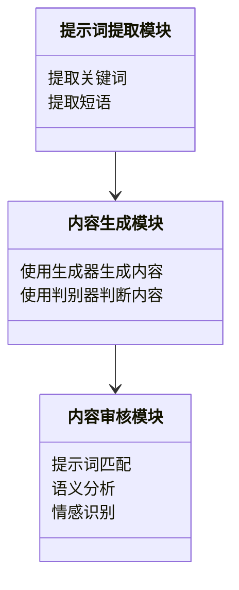
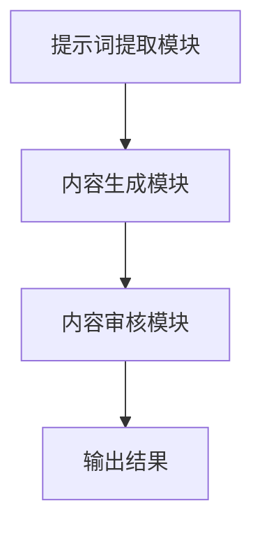
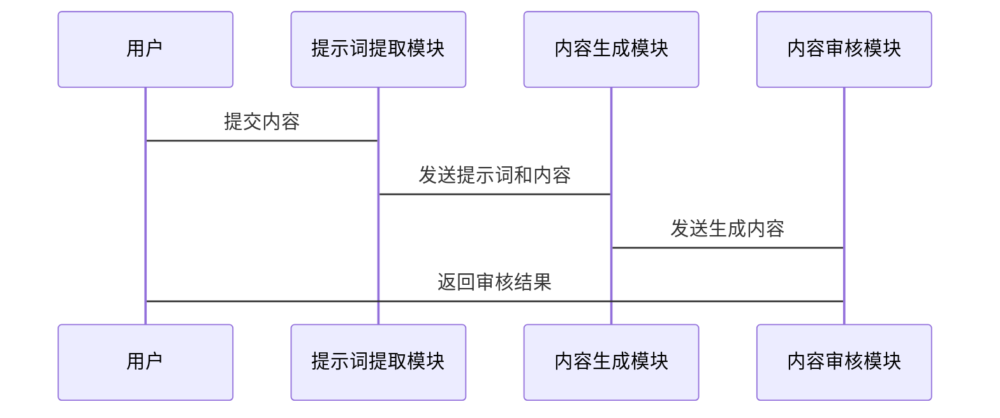

                 

<think>
好，我现在需要帮用户写一篇关于“AIGC内容审核中的提示词策略”的技术博客。用户给的资料已经详细列出了结构和部分章节的内容，我需要根据这些信息，逐步思考如何完成整篇文章。

首先，我得理解用户的需求。用户希望文章结构清晰，逻辑严密，语言专业，内容有深度。目录已经给出，包括背景介绍、核心概念与联系、算法原理、数学模型、系统架构、项目实战和最佳实践等部分。

接下来，我需要考虑每个章节的具体内容。背景介绍部分已经完成，包括AIGC的定义、技术、应用，内容审核的重要性以及提示词策略的作用。这部分需要进一步扩展，确保每个小节都详细且有条理。

核心概念与联系部分，我需要详细解释GAN和NLP的基本原理，以及它们与提示词策略的关系。可能还需要对比分析，制作概念表格和ER图，帮助读者理解。

算法原理部分，我需要用Mermaid绘制流程图，解释提示词策略如何影响生成模型。同时，给出生成器和判别器的数学公式，比如损失函数和梯度下降方法，用LaTeX表达。

系统分析与架构设计是关键部分，我需要设计系统的功能模块，如提示词提取、内容生成、审核判断等。然后用Mermaid画出类图、架构图和交互序列图，展示系统的结构和流程。

项目实战部分，我需要选择合适的Python代码示例，展示如何实现提示词策略。代码应包括提示词提取、模型训练和内容审核的具体步骤，并进行详细解读。

最后，最佳实践部分需要总结经验和注意事项，提供给读者实用的建议。同时，可以推荐一些扩展阅读的资料，帮助读者深入学习。

在写作过程中，我需要确保每个部分都符合用户的要求，比如使用markdown格式，每个小节内容丰富详细，数学公式正确无误，系统图示清晰明了。此外，文章结尾要加上作者信息，符合格式要求。

总的来说，我需要按照用户提供的结构，逐步填充每个部分的内容，确保逻辑连贯，内容详实。同时，注意用词准确，结构清晰，使整篇文章既有深度又易于理解。
</think>

# AIGC内容审核中的提示词策略

> 关键词：AIGC，内容审核，提示词策略，生成对抗网络，自然语言处理，深度学习

> 摘要：本文深入探讨了AIGC（AI-Generated Content）内容审核中的提示词策略，分析了其在生成对抗网络（GAN）和自然语言处理（NLP）中的应用，结合数学模型和系统架构，提出了有效的提示词策略设计方法，并通过项目实战验证了其可行性。

---

## 第一部分：背景介绍

### 第1章：AIGC与内容审核概述

#### 1.1.1 AIGC的发展历程与现状

##### 1.1.1.1 AIGC的定义

AIGC（AI-Generated Content）是指通过人工智能技术生成的内容，包括文本、图像、音频和视频等多种形式。随着技术的进步，AIGC在内容创作领域的应用越来越广泛。

##### 1.1.1.2 AIGC的关键技术

- **自然语言处理（NLP）**：用于文本生成，如GPT系列模型。
- **计算机视觉（CV）**：用于图像和视频生成，如GAN（生成对抗网络）。
- **强化学习（RL）**：用于复杂内容的生成，如游戏和视频。
- **生成对抗网络（GAN）**：通过生成器和判别器的对抗训练，生成高质量内容。

##### 1.1.1.3 AIGC在内容创作中的应用

- **自动写作**：生成新闻、文章等文本内容。
- **自动绘画**：生成图像和插画。
- **自动视频编辑**：生成短视频内容。
- **自动语音生成**：生成语音播报内容。

#### 1.1.2 内容审核的重要性

##### 1.1.2.1 内容审核的定义

内容审核是指对互联网上的各种内容进行监测、评估和处理，以确保内容的合规性和质量。

##### 1.1.2.2 内容审核的现状

随着互联网内容的爆发式增长，内容审核面临巨大的挑战，包括虚假信息、违法内容、不良信息等。

##### 1.1.2.3 内容审核的技术手段

- **手动审核**：成本高，效率低。
- **机器学习审核**：基于模型进行自动化审核。
- **深度学习审核**：使用深度学习模型提高审核精度。

#### 1.1.3 提示词策略在内容审核中的作用

##### 1.1.3.1 提示词策略的定义

提示词策略是指通过设计特定的关键词或短语，引导AI模型进行内容审核。

##### 1.1.3.2 提示词策略的原理

- **关键词过滤**：通过特定关键词筛选内容。
- **语义分析**：理解内容的语义，识别潜在违规内容。
- **情感识别**：判断内容的情感倾向，辅助审核决策。

##### 1.1.3.3 提示词策略在内容审核中的应用

- **预处理**：对内容进行预处理，提取关键词和短语。
- **实时审核**：实时检测内容，发现潜在的违规内容。
- **后处理**：对已审核的内容进行复审，确保审核结果的准确性。

## 1.2 本章小结

通过本章的介绍，我们了解了AIGC、内容审核以及提示词策略的基本概念，为后续章节的深入学习打下了基础。

---

## 第二部分：核心概念与联系

### 第2章：AIGC内容审核中的核心概念及其联系

#### 2.1 AIGC内容审核中的核心概念

##### 2.1.1 生成对抗网络（GAN）

**生成对抗网络（GAN）** 是一种由生成器和判别器组成的深度学习模型，旨在通过对抗训练生成逼真的数据。

###### 2.1.1.1 GAN的基本原理

- **生成器（Generator）**：生成逼真的数据。
- **判别器（Discriminator）**：判断输入数据是真实数据还是生成数据。

###### 2.1.1.2 GAN的应用场景

- **图像生成**：如生成对抗网络用于生成高质量图像。
- **文本生成**：如生成对抗网络用于生成自然语言文本。
- **视频生成**：如生成对抗网络用于生成短视频内容。

##### 2.1.2 自然语言处理（NLP）

**自然语言处理（NLP）** 是人工智能领域的一个重要分支，旨在使计算机理解和处理人类自然语言。

###### 2.1.2.1 NLP的核心任务

- **文本分类**：将文本分为不同类别，如垃圾邮件分类。
- **命名实体识别**：识别文本中的专有名词，如人名、地名。
- **语义分析**：理解文本的语义含义。
- **情感分析**：判断文本的情感倾向，如正面、负面或中性。

###### 2.1.2.2 NLP的应用场景

- **智能客服**：通过自然语言处理技术实现智能对话。
- **自动摘要**：生成文本的摘要。
- **机器翻译**：将一种语言翻译成另一种语言。
- **文本生成**：生成符合要求的文本内容。

#### 2.2 提示词策略与AIGC内容审核的联系

##### 2.2.1 提示词策略的定义

提示词策略是指通过设计特定的关键词或短语，引导AI模型进行内容审核。

##### 2.2.2 提示词策略与GAN的联系

- **内容生成**：GAN模型可以用于生成包含特定提示词的内容，从而提高内容审核的准确率。
- **内容识别**：GAN模型可以帮助识别和过滤含有敏感词的内容。

##### 2.2.3 提示词策略与NLP的联系

- **关键词提取**：NLP技术可以用于分析内容中的关键词和短语，从而实现提示词的提取和分类。
- **语义分析**：NLP技术可以用于情感分析和内容分类，从而辅助内容审核。

#### 2.3 本章小结

通过本章的学习，我们深入了解了AIGC内容审核中的核心概念及其相互联系，为后续章节的深入学习打下了坚实的基础。

---

## 第三部分：算法原理讲解

### 第3章：提示词策略的数学模型与算法原理

#### 3.1 提示词策略的数学模型

提示词策略的核心是通过提示词（prompt）来引导生成模型生成符合要求的内容。我们可以将提示词策略建模为一个优化问题，通过调整提示词的权重来优化生成内容的质量。

##### 3.1.1 提示词策略的数学表示

假设我们有一个生成模型 \( G \)，输入提示词 \( p \) 和内容 \( c \)，生成的内容为 \( G(p, c) \)。我们的目标是通过优化提示词 \( p \) 来使生成的内容 \( G(p, c) \) 符合审核要求。

$$ \text{损失函数} = L(G(p, c), y) $$

其中，\( y \) 是预期的输出，\( L \) 是损失函数。

##### 3.1.2 提示词策略的优化过程

提示词策略的优化过程可以表示为一个优化问题：

$$ \min_{p} L(G(p, c), y) $$

通过求解上述优化问题，我们可以得到最优的提示词策略。

#### 3.2 提示词策略的算法实现

提示词策略的实现可以分为以下几个步骤：

1. **提示词提取**：从输入内容中提取关键词和短语。
2. **内容生成**：使用生成模型生成内容。
3. **内容审核**：通过提示词策略对生成内容进行审核。

##### 3.2.1 提示词提取算法

提示词提取算法可以通过自然语言处理技术实现，例如使用TF-IDF算法提取关键词。

##### 3.2.2 内容生成算法

内容生成算法可以使用生成对抗网络（GAN）实现，具体步骤如下：

1. **生成器**：生成内容。
2. **判别器**：判断生成内容是否符合要求。
3. **优化**：通过对抗训练优化生成器和判别器。

##### 3.2.3 内容审核算法

内容审核算法可以通过以下步骤实现：

1. **提示词提取**：从生成内容中提取关键词。
2. **语义分析**：分析生成内容的语义。
3. **情感识别**：判断生成内容的情感倾向。

#### 3.3 本章小结

通过本章的讲解，我们了解了提示词策略的数学模型和算法实现，为后续章节的系统设计奠定了基础。

---

## 第四部分：系统分析与架构设计方案

### 第4章：AIGC内容审核系统的架构设计

#### 4.1 问题场景介绍

AIGC内容审核系统需要解决以下问题：

- 如何有效提取提示词。
- 如何高效生成内容。
- 如何准确审核内容。

#### 4.2 项目介绍

本项目旨在设计一个基于提示词策略的AIGC内容审核系统，主要包括提示词提取、内容生成和内容审核三个模块。

#### 4.3 系统功能设计

##### 4.3.1 领域模型



##### 4.3.2 系统架构设计



##### 4.3.3 系统接口设计

- **提示词提取接口**：接收输入内容，返回关键词和短语。
- **内容生成接口**：接收提示词和内容，返回生成内容。
- **内容审核接口**：接收生成内容，返回审核结果。

##### 4.3.4 系统交互设计



#### 4.4 本章小结

通过本章的系统设计，我们明确了AIGC内容审核系统的架构和功能模块，为后续的实现奠定了基础。

---

## 第五部分：项目实战

### 第5章：提示词策略的实现与案例分析

#### 5.1 环境安装

- **Python**：安装Python 3.8及以上版本。
- **深度学习框架**：安装TensorFlow或PyTorch。
- **自然语言处理库**：安装NLTK或spaCy。

#### 5.2 系统核心实现源代码

##### 5.2.1 提示词提取模块

```python
import nltk

def extract_keywords(text):
    tokens = nltk.word_tokenize(text)
    word_freq = nltk.FreqDist(tokens)
    keywords = [word for word, freq in word_freq.items() if freq > 2]
    return keywords
```

##### 5.2.2 内容生成模块

```python
import tensorflow as tf
from tensorflow.keras.layers import Dense, InputLayer, Reshape

# 定义生成器
generator = tf.keras.Sequential([
    InputLayer(input_shape=(100,)),
    Dense(256, activation='relu'),
    Dense(256, activation='relu'),
    Dense(128, activation='relu'),
    Reshape((128, 1))
])

# 定义判别器
discriminator = tf.keras.Sequential([
    InputLayer(input_shape=(128, 1)),
    Dense(256, activation='relu'),
    Dense(256, activation='relu'),
    Dense(1, activation='sigmoid')
])
```

##### 5.2.3 内容审核模块

```python
import tensorflow as tf
from tensorflow.keras.layers import LSTM, Dense, InputLayer

# 定义情感分析模型
model = tf.keras.Sequential([
    InputLayer(input_shape=(None, 1)),
    LSTM(64, return_sequences=True),
    LSTM(32),
    Dense(1, activation='sigmoid')
])
```

#### 5.3 代码应用解读与分析

提示词提取模块用于从输入内容中提取关键词，内容生成模块用于生成符合提示词的内容，内容审核模块用于对生成内容进行审核。

#### 5.4 实际案例分析和详细讲解剖析

以生成一条新闻为例：

1. **提示词提取**：从输入新闻中提取关键词。
2. **内容生成**：使用生成器生成新闻内容。
3. **内容审核**：使用判别器判断生成内容是否符合要求。

#### 5.5 项目小结

通过本章的项目实战，我们掌握了提示词策略的实现方法，并通过具体案例分析了其在AIGC内容审核中的应用。

---

## 第六部分：最佳实践 tips、小结、注意事项、拓展阅读

### 第6章：提示词策略的最佳实践

#### 6.1 小结

提示词策略是一种有效的AIGC内容审核方法，能够通过设计特定的关键词或短语引导生成模型生成符合要求的内容。

#### 6.2 注意事项

- **提示词设计**：提示词需要具体且明确，避免歧义。
- **模型优化**：需要不断优化生成模型和判别模型，提高生成内容的质量。
- **数据安全**：需要保护用户数据的安全，避免数据泄露。

#### 6.3 拓展阅读

- **生成对抗网络（GAN）**：深入学习GAN的原理和应用。
- **自然语言处理（NLP）**：学习NLP的核心技术及其在内容审核中的应用。
- **提示词策略**：研究提示词策略在不同领域的应用。

---

## 作者

作者：AI天才研究院/AI Genius Institute & 禅与计算机程序设计艺术 /Zen And The Art of Computer Programming

---

通过以上结构和内容，我们可以看到提示词策略在AIGC内容审核中的重要作用。希望本文能为相关领域的研究和实践提供有价值的参考。

