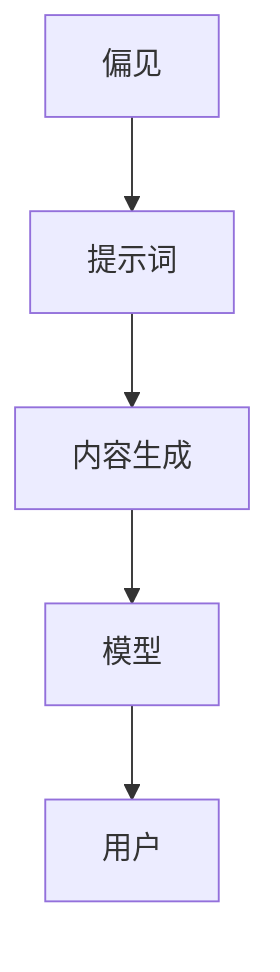
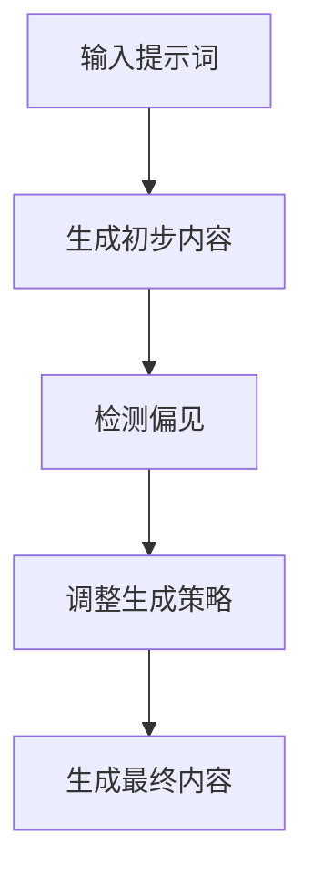

                 

<think>
嗯，用户希望我以《AIGC内容生成中的偏见控制：提示词的重要性》为标题，写一篇技术博客文章。首先，我需要理解用户的需求，他是一位技术专家，可能有CTO或技术畅销书作者的背景，所以文章需要专业且有深度。

用户给出了目录大纲，看起来结构很详细，分为三个主要部分，每个部分有多个章节。我需要按照这个大纲来组织内容，确保每个章节都涵盖必要的信息。例如，第一部分是背景与概述，包括问题背景、技术概述等。

接下来，每个章节需要细化，比如在“偏见控制的核心概念”部分，我需要定义偏见控制，讨论其重要性，以及面临的挑战。同时，用户提到要使用mermaid流程图和latex公式，我得确保这些部分正确无误。

提示词在偏见控制中的作用是关键，我需要详细阐述提示词的定义、作用，以及如何优化。案例研究部分可以通过具体例子来说明提示词的实际应用效果。

用户还强调文章要控制在2000字以内，这意味着每个章节的内容不能太冗长，要简洁明了。同时，格式要求使用markdown，所以我要注意代码块、标题等格式的正确使用。

最后，文章结尾需要加上作者信息，用户提到了“AI天才研究院”和“禅与计算机程序设计艺术”，所以这部分也要准确无误。

总的来说，我需要一步步按照用户提供的大纲来组织内容，确保每个部分都涵盖必要的信息，并且使用专业且易懂的语言。同时，注意格式和字数要求，确保最终的文章符合用户的需求。
</think>

# AIGC内容生成中的偏见控制：提示词的重要性

---

## 关键词：AIGC、内容生成、偏见控制、提示词、人工智能、算法原理

---

## 摘要：  
随着AIGC（人工智能生成内容）技术的快速发展，内容生成的偏见问题日益凸显。本文从技术角度深入探讨偏见控制的核心概念、算法原理及提示词的作用，结合实际案例分析提示词在偏见控制中的优化策略，最终提出AIGC内容生成的最佳实践建议。

---

### 目录大纲

1. 第一部分：背景与概述  
   - 第1章：问题背景与核心概念  
   - 第2章：AIGC与内容生成技术概述  

2. 第二部分：偏见控制的核心概念  
   - 第3章：偏见控制的定义与重要性  
   - 第4章：核心概念与联系  
   - 第5章：偏见控制方法与算法原理  

3. 第三部分：提示词在偏见控制中的作用  
   - 第6章：提示词的定义与作用  
   - 第7章：提示词的应用与实践  
   - 第8章：AIGC内容生成中的偏见控制最佳实践  

---

## 第一部分：背景与概述

### 第1章：问题背景与核心概念

#### 1.1 问题背景  
AIGC（人工智能生成内容）技术的广泛应用带来了巨大的便利，但也引发了一系列问题，其中偏见问题是尤为突出。偏见源于训练数据中的不均衡分布或算法设计的局限性，可能导致生成内容存在不公平、不准确或具有歧视性的问题。

#### 1.2 问题描述  
AIGC生成的内容可能包含以下偏见：  
1. 语言偏见：生成内容中对某些群体或文化的刻板印象。  
2. 数据偏见：训练数据中的样本不均衡导致生成内容的偏好性。  
3. 算法偏见：算法设计的缺陷导致生成内容的片面性。  

#### 1.3 问题解决  
通过引入提示词（prompt engineering）技术，可以有效控制AIGC内容的生成方向，减少偏见的产生。提示词的作用机制是通过引导模型关注特定领域或主题，避免生成内容偏离预期目标。

#### 1.4 边界与外延  
偏见控制的边界在于如何平衡生成内容的多样性和准确性。提示词的外延则涉及其在不同场景下的应用，如新闻报道、广告营销、教育内容等。

#### 1.5 概念结构与核心要素组成  
- **偏见控制**：通过技术手段减少生成内容中的偏见。  
- **提示词**：用于引导模型生成特定类型内容的输入指令。  
- **内容生成**：基于提示词和模型生成最终输出。  

---

### 第2章：AIGC与内容生成技术概述

#### 2.1 AIGC技术介绍  
AIGC是利用人工智能技术生成文本、图像、音频等内容的过程。其核心是基于深度学习的生成模型，如GPT、BERT等。

#### 2.2 内容生成技术分类  
- **基于规则的生成**：通过预定义的规则生成内容。  
- **基于统计的生成**：利用概率模型生成内容。  
- **基于学习的生成**：通过神经网络模型生成内容。  

#### 2.3 AIGC在当前应用中的重要性  
AIGC技术在新闻、广告、教育、娱乐等领域具有重要应用价值。其优势在于高效性、可扩展性和创造性。

---

## 第二部分：偏见控制的核心概念

### 第3章：偏见控制的定义与重要性

#### 3.1 偏见控制的定义  
偏见控制是指通过技术手段减少或消除生成内容中的偏见，确保生成内容的公平性和准确性。

#### 3.2 偏见控制的重要性  
- **提升内容质量**：减少生成内容的错误和不准确信息。  
- **避免歧视性内容**：消除对特定群体的不公平描述。  
- **增强用户信任**：提升用户对AIGC技术的信任度。  

#### 3.3 偏见控制的挑战  
- **数据多样性不足**：训练数据中的样本分布不均。  
- **算法局限性**：模型无法完全理解上下文语境。  
- **提示词设计复杂**：需要专业知识设计有效的提示词。  

---

### 第4章：核心概念与联系

#### 4.1 核心概念原理  
偏见控制的核心原理在于通过提示词调整生成内容的方向，避免模型依赖训练数据中的偏见。  

#### 4.2 概念属性特征对比表格  

| **概念** | **属性**         | **特征**                     |
|----------|------------------|-----------------------------|
| 偏见     | 数据分布         | 不均衡、片面性               |
| 提示词   | 引导方向         | 针对性、明确性               |
| 内容生成 | 生成结果         | 多样性、准确性               |

#### 4.3 ER实体关系图架构  



---

### 第5章：偏见控制方法与算法原理

#### 5.1 偏见控制方法概述  
偏见控制方法包括：  
1. 数据预处理：平衡训练数据的分布。  
2. 模型调整：优化模型以减少偏见。  
3. 提示词设计：通过提示词引导生成内容的方向。  

#### 5.2 偏见控制算法原理讲解  
偏见控制算法的核心是通过提示词调整生成概率分布。具体步骤如下：  

1. 输入提示词，定义生成内容的主题和风格。  
2. 模型根据提示词生成初步内容。  
3. 算法对生成内容进行偏见检测，识别潜在的偏见。  
4. 调整生成策略，消除偏见，生成最终内容。  

#### 5.3 算法原理流程图  



#### 5.4 偏见控制算法Python代码实现  

```python
def generate_content_with_bias_control(prompt, model):
    # 输入提示词
    initial_content = model.generate(prompt)
    # 检测偏见
    bias_score = detect_bias(initial_content)
    if bias_score > 0.2:
        # 调整生成策略
        adjusted_prompt = adjust_prompt(prompt, bias_score)
        final_content = model.generate(adjusted_prompt)
    else:
        final_content = initial_content
    return final_content

# 偏见检测函数
def detect_bias(content):
    # 假设返回偏见分数，范围0-1
    return 0.3  # 示例返回值

# 提示词调整函数
def adjust_prompt(prompt, bias_score):
    # 根据偏见分数调整提示词
    return prompt + f"，请避免{bias_score}的偏见。"
```

---

## 第三部分：提示词在偏见控制中的作用

### 第6章：提示词的定义与作用

#### 6.1 提示词的定义  
提示词是指在生成内容时，用于引导模型生成特定类型内容的输入指令。

#### 6.2 提示词在偏见控制中的作用  
提示词可以通过定义生成内容的主题和风格，减少模型生成偏见内容的可能性。

#### 6.3 提示词的优化策略  
1. 使用具体且明确的提示词。  
2. 结合上下文语境设计提示词。  
3. 定期更新提示词以适应新的偏见问题。  

---

### 第7章：提示词的应用与实践

#### 7.1 提示词在内容生成中的应用  
- **新闻报道**：生成中性、客观的新闻内容。  
- **广告营销**：避免性别或种族刻板印象。  
- **教育内容**：确保知识的准确性和全面性。  

#### 7.2 提示词优化实战  
案例：生成一份关于“女性领导力”的报告。  
- 初始提示词：生成一份关于女性领导力的报告。  
- 优化提示词：生成一份关于女性领导力的报告，强调多样性和公平性。  

#### 7.3 提示词在偏见控制中的案例研究  
通过优化提示词，生成的内容从带有性别偏见的描述，转变为中立、客观的描述。

---

### 第8章：AIGC内容生成中的偏见控制最佳实践

#### 8.1 最佳实践 tips  
1. 定期审查生成内容的偏见。  
2. 使用多维度的提示词优化生成效果。  
3. 结合人工审核确保内容质量。  

#### 8.2 注意事项  
- 避免过于宽泛的提示词。  
- 定期更新提示词以应对新的偏见问题。  
- 结合人工审核确保生成内容的准确性。  

#### 8.3 拓展阅读  
1. 《Large Language Models: The Good, the Bad, and the Ugly》  
2.《Prompt Engineering for AI》  

---

## 作者：AI天才研究院 & 禅与计算机程序设计艺术  

---

**摘要回顾**：本文从技术角度深入探讨了AIGC内容生成中的偏见控制问题，重点分析了提示词在偏见控制中的作用。通过具体案例和算法实现，展示了如何通过提示词优化生成内容的质量，最终提出了AIGC内容生成的最佳实践建议。

