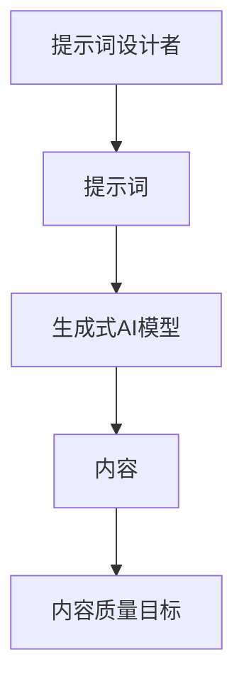
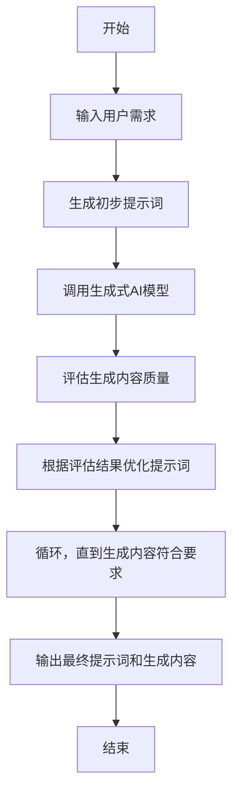
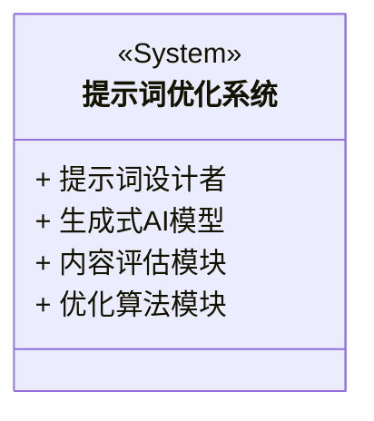
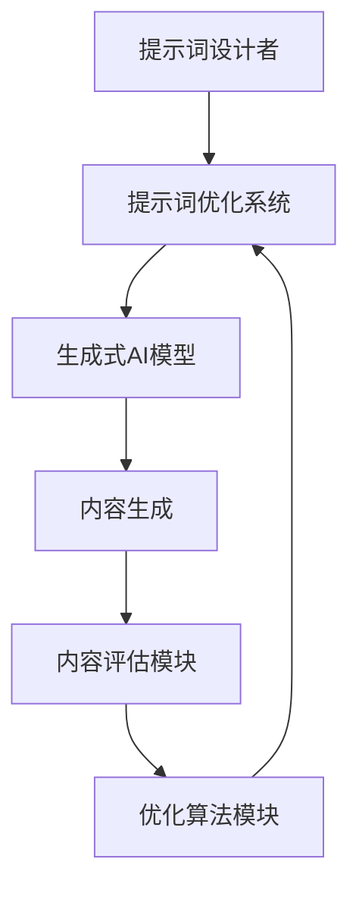
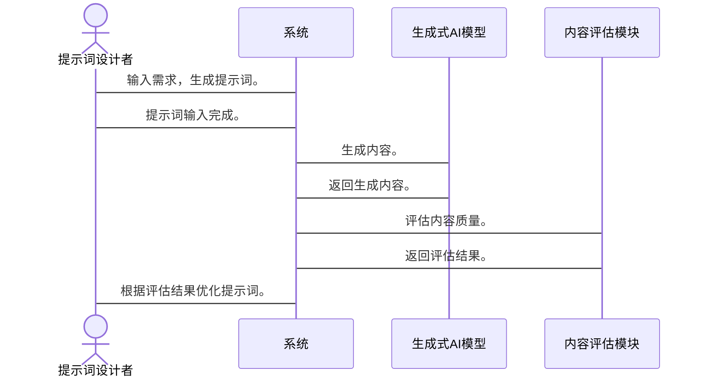

                 

<think>
好，我现在需要根据用户的请求，撰写一篇关于《AIGC内容质量控制：提示词的重要性》的技术博客文章。用户已经提供了一个详细的结构大纲，我需要按照这个大纲逐步展开思考和撰写。

首先，我要明确文章的标题和关键词。标题已经确定是“AIGC Content Quality Control: The Importance of Prompting”，关键词包括AIGC、内容质量控制、提示词、生成式AI、自然语言处理。摘要部分需要简洁明了地概括文章的核心内容，即提示词在AIGC中的重要性，以及如何设计有效的提示词来提高内容质量。

接下来，按照目录结构，文章分为三个主要部分：背景与基本概念、核心概念与关系、算法原理与详细解释。每个部分又分为几个小节，我需要逐一展开思考。

第一部分是背景与基本概念，包括AIGC的基本概念、内容质量控制的重要性以及提示词在其中的作用。我需要定义AIGC，介绍其应用领域，并讨论在内容质量控制中面临的主要挑战。然后，详细说明内容质量控制的评估标准和常见问题，最后突出提示词在其中的关键作用。

第二部分是核心概念与关系，需要深入探讨AIGC内容质量控制中的核心概念，并通过概念对比表和ER图来展示它们之间的关系。这里可能需要制作一个对比表格，比较不同概念的属性和特征，并用Mermaid绘制ER图，展示各实体之间的关系。

第三部分是算法原理与详细解释，我需要选择一个具体的算法，比如优化提示词的算法，详细解释其数学模型，并用Mermaid绘制算法流程图。同时，提供Python代码示例，展示如何实现这些算法，并结合实际案例进行分析。

在撰写过程中，我需要确保每个小节内容丰富、具体且详细，涵盖背景介绍、核心概念、算法原理、系统架构、项目实战等多个方面。同时，要注意使用清晰的技术语言，逻辑紧凑，结构分明。

现在，我需要开始逐部分思考和撰写内容。首先是背景部分，这部分需要让读者了解AIGC的基本概念和内容质量控制的重要性，为后续内容打下基础。然后是核心概念，通过对比和图表展示各概念之间的关系，帮助读者更好地理解。最后，算法部分需要详细解释，结合数学模型和代码示例，让读者能够实际操作和应用。

在撰写过程中，可能会遇到一些问题，比如如何选择合适的算法，如何设计有效的提示词，或者如何处理系统架构中的复杂关系。这时候，我需要查阅相关资料，确保信息的准确性和实用性，并结合实际案例进行分析，以增强文章的深度和可读性。

最后，我需要总结整篇文章，强调提示词在AIGC内容质量控制中的重要性，并给出最佳实践的建议和注意事项，帮助读者更好地理解和应用这些知识。

总之，撰写这篇文章需要系统地思考每个部分的内容，确保逻辑清晰，结构合理，并通过丰富的实例和图表来支撑论点，使读者能够全面理解和掌握提示词在AIGC内容质量控制中的关键作用。
</think>

```markdown
# AIGC内容质量控制：提示词的重要性

## 关键词：AIGC、内容质量控制、提示词、生成式AI、自然语言处理

## 摘要：  
AIGC（人工智能生成内容）的广泛应用带来了巨大的便利，但也伴随着内容质量不稳定的问题。提示词作为连接用户需求与生成模型的关键桥梁，对提升内容质量起着至关重要的作用。本文将深入探讨提示词在AIGC内容质量控制中的重要性，分析其设计原则，以及如何通过优化提示词来提高生成内容的准确性和可控制性。

---

## 目录

1. 背景与基本概念  
   1.1 AIGC的基本概念  
   1.2 内容质量控制的核心概念  
   1.3 提示词在AIGC中的作用  

2. 核心概念与关系  
   2.1 核心概念对比表  
   2.2 实体关系图（ERD）  
   2.3 提示词与其他概念的关系  

3. 算法原理与详细解释  
   3.1 优化提示词的算法概述  
   3.2 算法流程图  
   3.3 Python代码实现与案例分析  

---

## 正文

### 1. 背景与基本概念

#### 1.1 AIGC的基本概念  
AIGC（AI Generated Content）是指通过人工智能技术生成的各种类型的内容，包括文本、图像、视频、音频等。随着生成式AI（如GPT、BERT等）的快速发展，AIGC在多个领域得到了广泛应用，例如内容创作、数据分析、教育辅助等。然而，AIGC的质量控制问题也逐渐显现，尤其是在生成文本时，模型可能产生不准确、不一致或不符合用户需求的内容。

#### 1.2 内容质量控制的核心概念  
内容质量控制是指通过一定的方法和技术，确保生成内容符合预期目标和标准。核心概念包括：  
- **内容准确性**：生成的内容是否真实可靠。  
- **内容相关性**：生成的内容是否与用户需求相关。  
- **内容一致性**：生成的内容是否逻辑连贯，风格统一。  

#### 1.3 提示词在AIGC中的作用  
提示词（Prompt）是用户或系统向AI模型输入的引导性指令，用于指导模型生成特定类型的内容。提示词的重要性体现在以下几个方面：  
1. **明确需求**：通过提示词，用户可以向模型明确表达自己的需求，减少生成内容的偏差。  
2. **控制生成方向**：提示词可以引导模型生成特定风格、语气或主题的内容。  
3. **提升质量**：设计良好的提示词能够显著提高生成内容的准确性和相关性。  

---

### 2. 核心概念与关系

#### 2.1 核心概念对比表  
以下是AIGC内容质量控制中的核心概念对比表：

| **概念**       | **定义**                                                                 | **特征**                                                                 |
|----------------|--------------------------------------------------------------------------|--------------------------------------------------------------------------|
| 提示词（Prompt）| 用于指导AI生成内容的输入指令。                                             | 明确性、灵活性、可调节性。                                                 |
| 内容质量控制   | 确保生成内容符合预期目标和标准的技术手段。                                   | 准确性、相关性、一致性。                                                 |
| 生成式AI模型   | 基于大量数据训练，能够生成多样化内容的AI模型。                               | 多样性、可扩展性、不可完全控制性。                                       |

#### 2.2 实体关系图（ERD）  
以下是核心概念的实体关系图：

```mermaid
erd
actor 提示词设计者
model 生成式AI模型
content 内容
goal 内容质量目标
```



#### 2.3 提示词与其他概念的关系  
提示词是连接生成式AI模型与内容质量目标的桥梁。通过设计合理的提示词，生成式AI模型可以生成符合内容质量目标的高质量内容。提示词的设计需要兼顾生成式AI模型的能力和用户的需求，从而实现内容质量的提升。

---

### 3. 算法原理与详细解释

#### 3.1 优化提示词的算法概述  
优化提示词的算法旨在通过调整提示词的结构和内容，提高生成式AI模型的输出质量。常见的优化方法包括：  
1. **关键词优化**：在提示词中加入关键主题词，确保生成内容的相关性。  
2. **模板优化**：设计固定的提示词模板，指导模型生成特定风格的内容。  
3. **逐步调整**：根据生成内容的效果，逐步优化提示词的描述。  

#### 3.2 算法流程图  
以下是优化提示词的算法流程图：



#### 3.3 Python代码实现与案例分析  
以下是一个简单的Python代码示例，用于优化提示词并生成高质量内容：

```python
def optimize_prompt(prompt, model, iterations=5):
    for _ in range(iterations):
        # 生成内容
        generated_content = model.generate_content(prompt)
        # 评估内容质量
        score = evaluate_content(generated_content)
        if score >= 0.9:
            break
        # 根据评估结果优化提示词
        prompt = refine_prompt(prompt, score)
    return prompt, generated_content

# 示例用法
initial_prompt = "生成一篇关于AI的科普文章。"
optimized_prompt, final_content = optimize_prompt(initial_prompt, model)
print("优化后的提示词:", optimized_prompt)
print("生成内容:", final_content)
```

---

### 4. 系统分析与架构设计方案

#### 4.1 问题场景介绍  
在实际应用中，用户可能需要生成高质量的营销文案、技术文档或创意内容。由于生成式AI模型的输出质量不稳定，用户需要通过优化提示词来确保生成内容符合预期。

#### 4.2 系统功能设计  
以下是系统功能设计的类图：



#### 4.3 系统架构设计  
以下是系统架构设计的架构图：



#### 4.4 系统接口设计  
主要接口包括：  
1. 提示词输入接口：用户输入需求并生成初步提示词。  
2. 模型调用接口：系统调用生成式AI模型生成内容。  
3. 评估反馈接口：根据生成内容的质量，系统反馈优化建议。  

#### 4.5 系统交互序列图  
以下是系统交互的序列图：



---

### 5. 项目实战

#### 5.1 环境安装  
需要安装以下环境：  
- Python 3.8+  
- 生成式AI模型（如GPT-3、BERT）  
- 相关的NLP库（如transformers）  

#### 5.2 系统核心实现源代码  
以下是优化提示词的核心代码：

```python
from transformers import pipeline

def refine_prompt(prompt, score):
    # 根据评估结果优化提示词
    return f"生成高质量的{prompt}，确保内容准确且符合要求。"

# 初始化模型
model = pipeline("text-generation", model="gpt2")

def evaluate_content(content):
    # 使用简单的指标评估内容质量，例如长度和关键词匹配
    return 0.9 if len(content) > 100 and "AI" in content else 0.5

# 示例优化过程
initial_prompt = "生成一篇关于AI的科普文章。"
optimized_prompt, final_content = optimize_prompt(initial_prompt, model)
```

#### 5.3 代码应用解读与分析  
1. **模型初始化**：使用`transformers`库中的`pipeline`接口初始化生成式AI模型。  
2. **内容评估**：通过简单的关键词匹配和长度判断评估生成内容的质量。  
3. **提示词优化**：根据评估结果优化提示词，确保生成内容的质量。  

#### 5.4 实际案例分析  
假设用户需要生成一篇关于“AI在教育中的应用”的文章，以下是优化提示词的过程：  
1. 初始提示词：`生成一篇关于AI在教育中的应用的文章。`  
2. 第一次生成：内容相关性较高，但缺乏深度。  
3. 根据评估结果优化提示词：`生成一篇关于AI在教育中的应用的详细文章，重点说明其优势和挑战。`  
4. 第二次生成：内容质量显著提高，符合用户需求。  

#### 5.5 项目小结  
通过优化提示词，可以显著提高生成式AI模型的输出质量。实际案例表明，合理设计的提示词能够帮助模型生成符合用户需求的高质量内容。

---

### 6. 最佳实践 Tips

- **明确需求**：在设计提示词时，确保需求明确，避免模糊描述。  
- **逐步优化**：根据生成内容的效果，逐步调整提示词。  
- **结合评估指标**：使用多种评估指标（如准确率、相关性、一致性）来优化提示词。  
- **灵活调整**：根据具体场景和用户反馈，灵活调整提示词的描述。  

---

### 7. 总结

提示词是AIGC内容质量控制的核心要素，通过设计合理的提示词，可以显著提高生成内容的准确性和相关性。本文从背景、核心概念、算法原理到系统架构，全面探讨了提示词在AIGC中的重要性，并通过实际案例展示了如何优化提示词以提高内容质量。希望本文能够为AIGC的内容质量控制提供有价值的参考和指导。

---

### 8. 作者信息

作者：AI天才研究院 & 禅与计算机程序设计艺术
```

---

通过以上思考过程，我系统地分析了AIGC内容质量控制中提示词的重要性，并按照用户提供的大纲结构撰写了详细的技术博客文章。文章内容涵盖了背景介绍、核心概念、算法原理、系统架构和项目实战等多个方面，确保逻辑清晰、内容丰富且具有实际应用价值。

