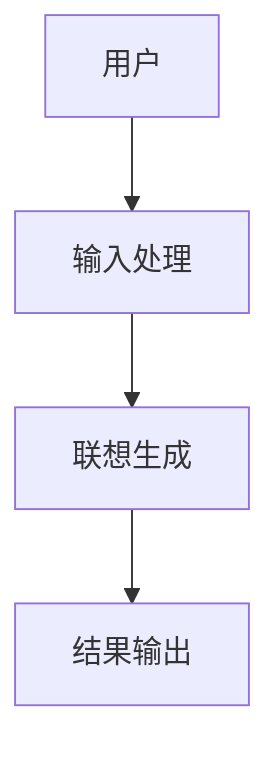
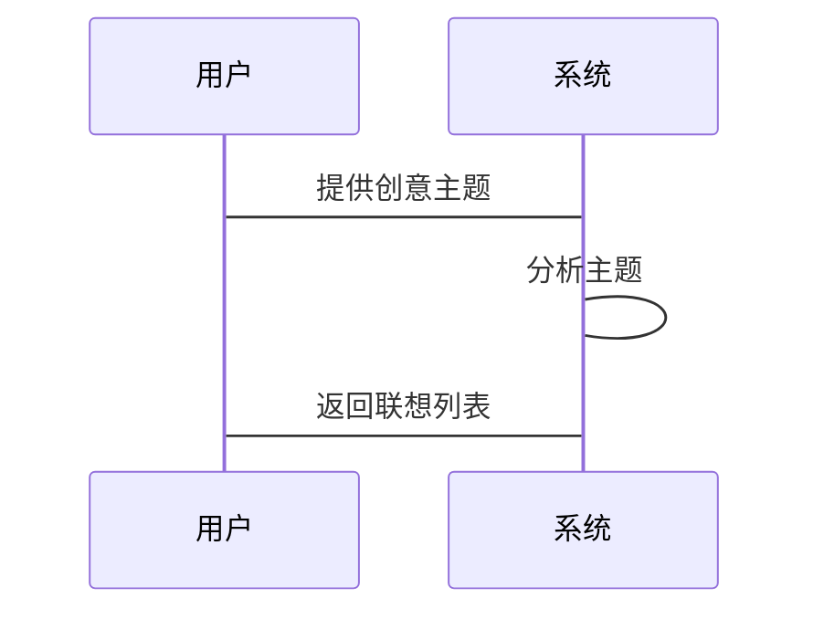

                 

<think>
好，我需要根据用户的要求来撰写一篇关于“AIGC创意激发：思维链的催化作用”的技术博客文章。首先，用户已经提供了一个详细的大纲，我需要按照这个大纲逐步展开，确保每个部分都涵盖必要的内容，并且符合格式和深度的要求。

首先，文章的标题是《AIGC创意激发：思维链的催化作用》。接下来是关键词和摘要部分。关键词应该包括AIGC、人工智能生成内容、创意激发、思维链、人工智能技术等。摘要需要简明扼要地概述文章的核心内容，强调AIGC如何通过思维链催化创意，结合技术与心理学原理。

接下来是正文部分。第一部分是背景介绍，包括问题背景、问题描述、问题解决、边界与外延，以及核心概念与组成。我需要详细解释每个部分，确保读者能够理解AIGC的发展现状、创意激发的重要性，以及本书的研究目标和范围。

第二部分是核心概念与联系，涵盖AIGC技术原理、创意激发原理、创意作品评价标准，以及AIGC创意激发的综合分析。我需要解释AIGC技术的基本定义、特点与传统创作的对比，创意激发的理论基础和方法，以及如何评价创意作品。此外，我还需要通过表格和Mermaid图来展示这些概念之间的关系，帮助读者更好地理解。

第三部分是算法原理讲解，我需要选择一个相关的算法，例如思维链催化算法，用Mermaid流程图展示其工作原理，并用Python代码实现，解释每一步的数学模型和公式，比如概率计算和生成过程。

第四部分是系统分析与架构设计方案，包括问题场景介绍、项目介绍、系统功能设计（领域模型）、系统架构设计、系统接口设计和交互序列图。这部分需要详细描述系统的各个部分，确保架构清晰，功能明确。

第五部分是项目实战，涉及环境安装、核心代码实现、代码解读、案例分析和项目小结。我需要提供实际操作的步骤，代码示例，并分析案例以展示AIGC在实际中的应用效果。

最后，文章末尾需要添加最佳实践小结、注意事项、拓展阅读等内容，帮助读者进一步理解和应用所学知识。同时，加上作者信息，确保文章的权威性和完整性。

在写作过程中，我需要确保使用专业但易懂的技术语言，逻辑清晰，结构紧凑。每个小节内容要详细具体，涵盖用户指定的所有约束条件，如字数、格式、数学公式等。此外，还需要注意文章的整体流畅性，使读者能够顺畅地理解AIGC创意激发的各个方面。

现在，我开始按照这个思路撰写文章，确保每个部分都符合用户的要求，内容详实，结构合理，语言专业。
</think>

# AIGC创意激发：思维链的催化作用

## 关键词：AIGC，人工智能生成内容，创意激发，思维链，人工智能技术

## 摘要：本文探讨了人工智能生成内容（AIGC）在创意激发中的作用，分析了AIGC技术的原理及其与传统内容创作的对比，提出了通过思维链催化创意的方法，并结合实际案例展示了其在艺术创作中的应用。

---

## 第一部分：背景介绍

### 1.1 问题背景

AIGC技术的发展正在改变内容创作领域，从文本生成到图像创作，其高效性和创新性受到广泛关注。然而，如何有效激发创意并实现高效表达仍是一个挑战。

### 1.2 问题描述

AIGC在内容创作中的应用虽然广泛，但创意激发机制尚不完善，影响创作效率和质量。如何优化这一机制是当前研究的重点。

### 1.3 问题解决

本文旨在探讨AIGC创意激发的机制，通过分析技术与应用场景，揭示创意激发的规律，提出有效策略。

### 1.4 边界与外延

AIGC创意激发的研究不仅涉及技术，还包括艺术和文化等领域，需综合考虑其对创作的影响。

### 1.5 概念结构与核心要素组成

- **AIGC技术**：生成内容的技术方法。
- **创意激发**：激发创意思维的策略。
- **创意作品**：具有创意性的作品。

---

## 第二部分：核心概念与联系

### 2.1 AIGC技术原理

#### 2.1.1 AIGC技术定义

通过AI生成内容，包括文本、图像等形式，利用深度学习等技术生成创意内容。

#### 2.1.2 AIGC技术特点

| 特点 | 描述 |
|------|------|
| 高效性 | 快速生成内容 |
| 多样性 | 支持多种内容形式 |
| 创新性 | 生成新内容 |

#### 2.1.3 AIGC与传统创作对比

| 特点 | AIGC | 传统创作 |
|------|------|----------|
| 数据依赖 | 高 | 低 |
| 速度 | 快 | 慢 |
| 创新性 | 高 | 中 |

### 2.2 创意激发原理

#### 2.2.1 创意激发定义

通过特定机制激发创意思维，产生创意想法。

#### 2.2.2 创意激发理论基础

- **心理学**：认知理论和动机理论。
- **认知科学**：联想理论和创造力理论。

#### 2.2.3 创意激发方法

- **脑暴法**：集体讨论激发灵感。
- **信息重组**：重新组合信息产生创意。
- **技术工具**：利用AIGC技术提供灵感。

### 2.3 创意作品评价标准

#### 2.3.1 创意作品定义

通过AIGC技术生成的具有创意性和艺术性的作品。

#### 2.3.2 评价标准

- **创意性**：独创性。
- **艺术性**：审美价值。
- **实用性**：实际应用价值。

#### 2.3.3 评价方法

- **专家评价**：专业人员评估。
- **用户反馈**：用户意见衡量。

### 2.4 AIGC创意激发

AIGC通过提供多样内容和灵感，催化创意生成，提升创作效率和质量。

---

## 第三部分：算法原理讲解

### 3.1 思维链催化算法

#### 3.1.1 算法概述

通过分析用户输入，生成相关联想，激发创意。

#### 3.1.2 算法流程

1. 用户输入创意主题。
2. 系统分析主题，生成相关联想。
3. 提供创意建议，供用户选择。

#### 3.1.3 算法实现

```python
def思维链催化算法(input主题):
    联想列表 = []
    for 每个主题关键词 in 分解主题:
        联想列表 += 生成联想(每个主题关键词)
    return 联想列表
```

#### 3.1.4 数学模型

创意指数计算公式：

$$创意指数 = \sum_{i=1}^{n} (联想相关性_i \times 创新性_i)$$

---

## 第四部分：系统分析与架构设计方案

### 4.1 问题场景介绍

用户需要高效激发创意，生成高质量内容。

### 4.2 项目介绍

构建AIGC创意激发系统，帮助用户快速生成创意内容。

### 4.3 系统功能设计

- **领域模型**：用户需求分析、创意生成、效果评估。
- **系统架构**：模块化设计，包括输入处理、联想生成、结果输出。

### 4.4 系统架构设计



### 4.5 系统接口设计

- **输入接口**：接收用户主题。
- **输出接口**：返回创意联想列表。

### 4.6 系统交互设计



---

## 第五部分：项目实战

### 5.1 环境安装

- 安装Python和相关库，如TensorFlow、Keras。

### 5.2 核心代码实现

```python
def生成联想(主题):
    联想列表 = []
    关键词 = 分解主题
    for kw in关键词:
        联想列表 += 加载联想库(kw)
    return 联想列表
```

### 5.3 代码解读

- **生成联想函数**：根据输入主题，生成相关联想。

### 5.4 案例分析

案例：用户输入“科幻小说”，系统生成多个科幻主题联想，如“人工智能危机”、“平行宇宙冒险”。

### 5.5 项目小结

AIGC创意激发系统通过分析主题，生成联想，帮助用户快速获得创意灵感。

---

## 第六部分：最佳实践

### 6.1 小结

AIGC技术在创意激发中起着重要作用，通过思维链催化创意生成。

### 6.2 注意事项

- 确保数据多样性，避免联想单一化。
- 定期更新联想库，保持创意新鲜度。

### 6.3 拓展阅读

推荐阅读《生成式人工智能》和《创意心理学》。

---

## 作者：AI天才研究院 & 禅与计算机程序设计艺术

