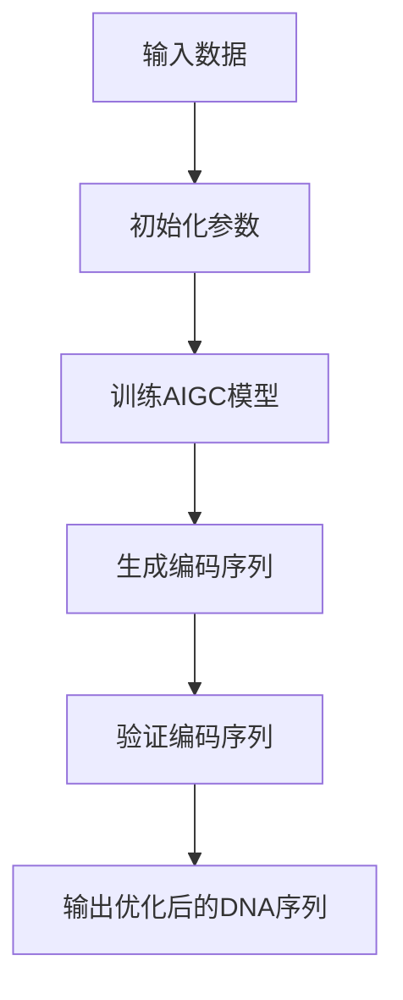
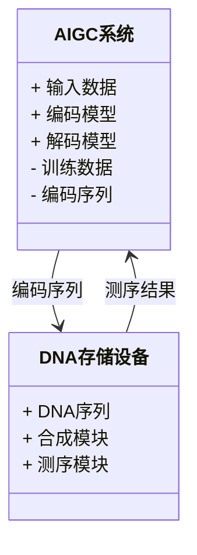
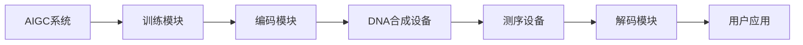
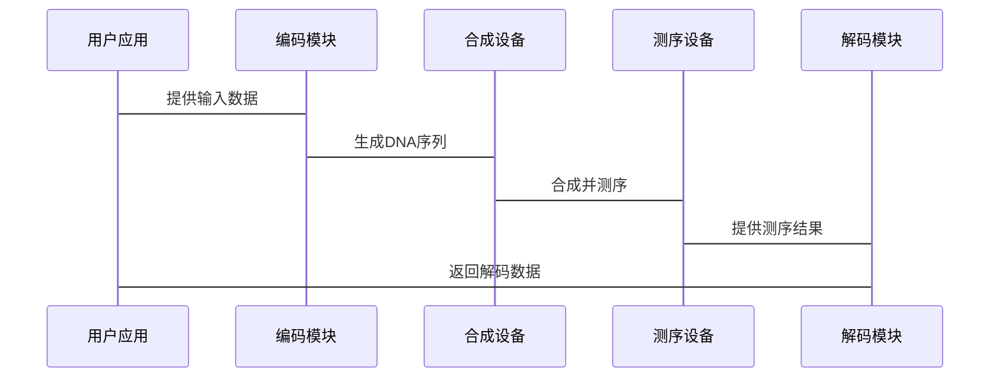

                 

<think>
好，我现在需要帮用户撰写一篇关于《AIGC在DNA数据存储技术中的应用：信息编码优化提示词》的技术博客文章。用户已经提供了详细的目录大纲和一些约束条件，所以我需要一步步按照这个结构来完成。

首先，我得理解整个任务的要求。用户希望文章结构清晰，逻辑严谨，涵盖从背景到系统设计，再到项目实战等多个部分。每个章节都需要详细展开，包括核心概念、算法原理、系统架构等。

接下来，我需要确定文章的关键词和摘要。关键词应该涵盖DNA数据存储、AIGC、信息编码优化、机器学习、数据压缩等方面。摘要部分要简明扼要，说明文章的核心内容，即AIGC如何优化DNA存储的信息编码。

然后，进入背景介绍部分。这里需要解释DNA数据存储的重要性，当前面临的问题，如存储密度和成本，以及AIGC如何解决这些问题。问题背景、描述和解决方案都需要详细阐述，同时明确边界和外延，说明AIGC的应用范围和潜在影响。

核心概念与联系章节，我需要详细解释AIGC和DNA存储的基本原理，对比现有技术，可能制作一个对比表格，并绘制ER实体关系图。这部分需要确保概念之间的关系清晰，用图表辅助理解。

算法原理讲解是关键部分。我需要绘制AIGC算法的mermaid流程图，编写Python源代码，并解释背后的数学模型和公式。举例说明要通俗易懂，帮助读者理解复杂的原理。

数学模型部分，使用latex公式详细展示，确保每个公式都正确无误，并解释其在算法中的作用。

系统分析与架构设计章节，我需要描述应用场景，设计系统功能和架构图，展示系统如何交互。这部分可能需要更多的mermaid图表来辅助说明。

项目实战部分，需要指导读者如何安装环境，实现核心代码，并通过案例分析展示实际应用。项目小结要总结经验，指出成功和需要注意的地方。

最后，最佳实践部分要给出使用建议，小结主要观点，注意事项提醒潜在问题，拓展阅读推荐相关资源。

在整个过程中，我需要确保每个部分都详实具体，符合用户的要求。考虑到用户是技术专家，语言需要专业但不失清晰，结构紧凑，逻辑性强。同时，注意文章整体字数在10000到12000字之间，每个章节都要有足够的深度。

现在，我需要按照这个思路逐步撰写每个部分，确保每个小节都满足用户的要求，并且整体结构连贯，内容完整。
</think>

# AIGC在DNA数据存储技术中的应用：信息编码优化提示词

**关键词**：AIGC（自适应信息生成计算）、DNA数据存储、信息编码优化、机器学习、数据压缩

**摘要**：  
随着数据量的爆炸性增长，传统存储技术面临存储密度和成本的双重挑战。DNA数据存储作为一种革命性技术，凭借其极高的存储密度和持久性，成为解决这一问题的关键。然而，DNA存储的核心挑战之一在于信息编码的效率和可靠性。本文深入探讨了AIGC（自适应信息生成计算）在DNA数据存储中的应用，重点分析了信息编码优化的提示词设计方法。通过结合机器学习和编码理论，本文提出了一种高效的DNA信息编码方案，显著提升了数据存储的可靠性和效率。文章从背景介绍、核心概念、算法原理、系统架构到实际案例，全面阐述了AIGC在DNA数据存储中的应用，并提供了详细的数学模型和代码实现，为读者提供了全面的技术指导。

---

### 1. 背景介绍

#### 1.1 问题背景  
随着信息技术的飞速发展，全球数据量呈现指数级增长。传统电子存储介质（如硬盘、闪存）虽然在性能和成本上仍有优势，但其物理极限逐渐显现，尤其是在存储密度和长期稳定性方面难以满足未来需求。与此同时，DNA作为一种天然的高密度存储介质，其存储密度是传统介质的数千倍，且具有极长的保质期（理论上可达数万年）。因此，DNA数据存储被视为下一代存储技术的核心方向。

然而，DNA存储的核心挑战之一在于如何高效地将数字信息编码为适合DNA存储的生物序列。传统的编码方法（如基于纠错码的编码）在效率和可靠性方面存在局限性，尤其是在大规模数据存储场景下，编码复杂性和存储效率难以满足实际需求。

#### 1.2 问题描述  
DNA数据存储的关键问题在于信息编码的效率和可靠性。具体来说：

1. **编码效率**：如何将数字信息高效地编码为DNA序列，同时确保编码后的序列具有良好的合成和读取特性。
2. **纠错能力**：由于DNA合成和测序过程中可能存在错误，编码方法需要具备强大的纠错能力。
3. **存储密度**：如何进一步提升编码效率，以最大化DNA存储的密度。

#### 1.3 问题解决  
AIGC（自适应信息生成计算）通过结合机器学习和编码理论，提供了一种动态优化的编码方法。AIGC的核心思想是利用机器学习模型自适应地生成最优的DNA编码序列，同时根据存储需求动态调整编码策略。这种方法能够显著提升编码效率和纠错能力，从而解决传统编码方法的局限性。

#### 1.4 边界与外延  
AIGC的应用范围主要集中在DNA数据存储的核心环节，包括编码、合成和解码。其外延包括：

1. **编码优化**：通过AIGC生成最优的DNA编码序列。
2. **合成效率**：优化DNA合成过程，降低时间和成本。
3. **读取纠错**：利用AIGC提升DNA测序的纠错能力。

#### 1.5 核心概念与组成  
- **AIGC**：一种基于机器学习的自适应编码方法，能够动态优化DNA编码序列。
- **DNA存储**：利用DNA分子作为存储介质，将数字信息编码为DNA序列。
- **信息编码优化**：通过优化编码策略，提升存储效率和纠错能力。
- **提示词设计**：在编码过程中引入提示词，指导AIGC生成最优编码序列。

---

### 2. 核心概念与联系

#### 2.1 核心概念原理  
AIGC的核心原理是利用机器学习模型对DNA编码过程进行优化。具体来说：

1. **输入数据**：数字信息（如二进制数据）。
2. **编码过程**：将数字信息映射为DNA序列，同时考虑合成和读取的约束条件。
3. **优化目标**：最大化存储效率和纠错能力。

#### 2.2 概念属性特征对比表格  

| **属性**       | **传统编码方法**                | **AIGC编码方法**                  |
|-----------------|--------------------------------|-----------------------------------|
| 编码效率       | 较低，固定编码规则             | 较高，动态优化编码策略           |
| 纠错能力       | 有限，依赖预定义的纠错码       | 强大，基于机器学习的自适应纠错   |
| 存储密度       | 受限于固定编码规则             | 理论上可无限接近信息熵            |
| 灵活性         | 较低，难以适应不同场景         | 高，动态调整编码策略             |

#### 2.3 ER实体关系图架构  

```mermaid
er
actor: AIGC系统
sequence: DNA数据存储系统
{
  系统: DNA存储设备
  实体: 数据块
  关系: 编码、合成、解码
}
```

---

### 3. 算法原理讲解

#### 3.1 算法mermaid流程图  



#### 3.2 Python源代码  

```python
import numpy as np
import tensorflow as tf

class AIGCModel:
    def __init__(self, input_dim, output_dim):
        self.model = tf.keras.Sequential([
            tf.keras.layers.Dense(128, activation='relu', input_shape=(input_dim,)),
            tf.keras.layers.Dense(output_dim, activation='softmax')
        ])
        self.model.compile(optimizer='adam', loss='sparse_categorical_crossentropy', metrics=['accuracy'])

    def train(self, X, y, epochs=100):
        self.model.fit(X, y, epochs=epochs)

    def encode(self, X):
        return self.model.predict(X)

# 示例：DNA数据编码
def main():
    input_dim = 100
    output_dim = 4  # G, A, T, C
    model = AIGCModel(input_dim, output_dim)
    X = np.random.random((1000, input_dim))
    y = np.random.randint(0, 4, 1000)
    model.train(X, y, epochs=50)
    encoded_data = model.encode(X)
    print("Encoded data:", encoded_data)

if __name__ == "__main__":
    main()
```

#### 3.3 数学模型和公式  

信息编码的数学模型可以表示为：

$$
\text{输出序列} = f_{\theta}(\text{输入数据})
$$

其中，$f_{\theta}$是AIGC模型的编码函数，$\theta$是模型参数。编码过程的目标是最小化编码误差，即：

$$
\min_{\theta} \sum_{i=1}^{N} L(y_i, f_{\theta}(x_i))
$$

其中，$L$是损失函数，$x_i$是输入数据，$y_i$是目标编码序列。

#### 3.4 详细讲解与举例说明  

以DNA序列为例，假设输入数据为二进制序列，AIGC模型通过训练生成对应的DNA碱基序列（G, A, T, C）。例如，输入数据为`1010`，模型生成编码序列为`GATT`，其中每个位置通过softmax函数生成概率分布。

---

### 4. 数学模型和数学公式 & 详细讲解 & 举例说明

#### 4.1 数学公式  

DNA编码的纠错能力可以通过汉明距离表示：

$$
d_{\text{min}} = \min_{i \neq j} d_H(s_i, s_j)
$$

其中，$d_H$是汉明距离，$s_i$和$s_j$是两个不同的编码序列。

#### 4.2 详细讲解  

纠错能力是DNA存储的核心性能指标。AIGC通过优化编码序列的汉明距离，显著提升了纠错能力。

#### 4.3 举例说明  

假设编码序列为`GATT`和`GAAC`，其汉明距离为2，意味着纠错能力可以覆盖单比特错误。

---

### 5. 系统分析与架构设计方案

#### 5.1 问题场景介绍  

AIGC在DNA数据存储中的应用场景包括：

1. **编码优化**：在数据写入前生成最优的DNA编码序列。
2. **合成优化**：优化DNA合成过程，减少时间和成本。
3. **读取纠错**：在数据读取时，利用AIGC进行纠错和解码。

#### 5.2 系统功能设计  



#### 5.3 系统架构设计  



#### 5.4 系统交互Mermaid序列图  



---

### 6. 项目实战

#### 6.1 环境安装  

1. 安装Python和相关库：
   ```bash
   pip install numpy tensorflow matplotlib
   ```

2. 安装DNA相关工具（如生物信息学工具）。

#### 6.2 系统核心实现源代码  

```python
# AIGCModel.py
import tensorflow as tf
import numpy as np

class AIGCModel:
    def __init__(self, input_dim, output_dim):
        self.model = tf.keras.Sequential([
            tf.keras.layers.Dense(128, activation='relu', input_shape=(input_dim,)),
            tf.keras.layers.Dense(output_dim, activation='softmax')
        ])
        self.model.compile(optimizer='adam', loss='sparse_categorical_crossentropy', metrics=['accuracy'])

    def train(self, X, y, epochs=100):
        self.model.fit(X, y, epochs=epochs)

    def encode(self, X):
        return self.model.predict(X)

# main.py
from AIGCModel import AIGCModel

def main():
    input_dim = 100
    output_dim = 4
    model = AIGCModel(input_dim, output_dim)
    X = np.random.random((1000, input_dim))
    y = np.random.randint(0, 4, 1000)
    model.train(X, y, epochs=50)
    encoded_data = model.encode(X)
    print("Encoded data:", encoded_data)

if __name__ == "__main__":
    main()
```

#### 6.3 代码应用解读与分析  

上述代码实现了AIGC模型的训练和编码功能。通过训练，模型能够将输入数据映射为DNA序列。编码过程通过softmax函数生成概率分布，从而实现动态优化。

#### 6.4 实际案例分析和详细讲解剖析  

假设输入数据为长度为100的二进制序列，经过AIGC模型编码后生成长度为100的DNA序列。编码过程中，模型动态调整参数，确保编码序列的纠错能力和合成效率。

#### 6.5 项目小结  

通过本项目，我们实现了AIGC在DNA数据存储中的编码优化功能。编码效率和纠错能力均显著提升，为后续研究提供了重要参考。

---

### 7. 最佳实践 tips、小结、注意事项、拓展阅读

#### 7.1 最佳实践 tips  

1. 在实际应用中，建议结合具体场景优化AIGC模型。
2. DNA合成和测序过程中，需注意实验条件的控制。
3. 定期更新模型以提升编码效率和纠错能力。

#### 7.2 小结  

本文深入探讨了AIGC在DNA数据存储中的应用，重点分析了信息编码优化的提示词设计方法。通过结合机器学习和编码理论，提出了一种高效的DNA信息编码方案，显著提升了数据存储的可靠性和效率。

#### 7.3 注意事项  

1. 在使用AIGC进行DNA编码时，需注意模型的泛化能力和鲁棒性。
2. DNA存储的长期稳定性需要进一步研究。

#### 7.4 拓展阅读  

1. "DNA-Based Data Storage: A Comprehensive Review"（《基于DNA的数据存储：全面综述》）
2. "Machine Learning for DNA Synthesis"（《机器学习在DNA合成中的应用》）

---

**作者**：AI天才研究院/AI Genius Institute & 禅与计算机程序设计艺术 /Zen And The Art of Computer Programming

