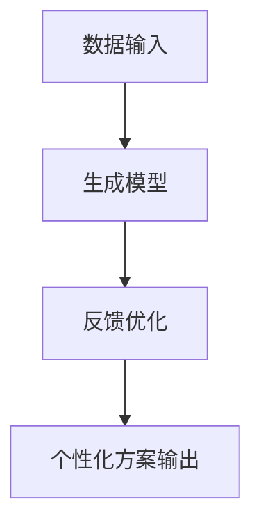
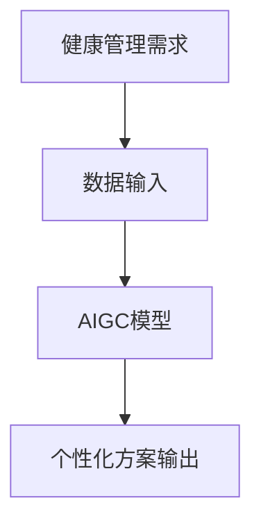
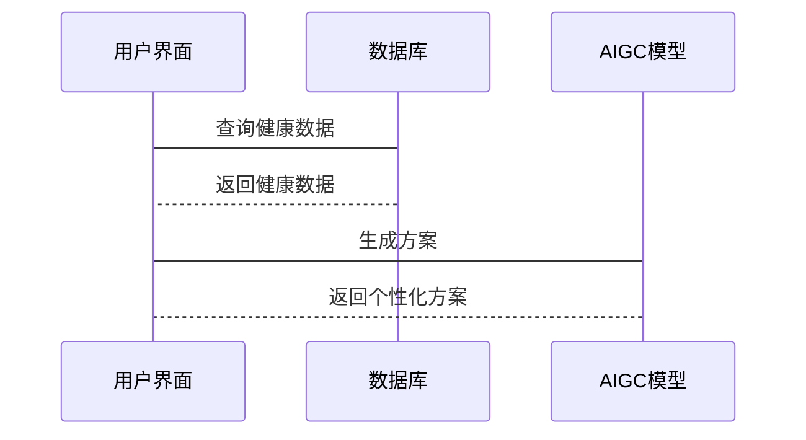

                 

<think>
好的，我需要按照用户的指示，撰写一篇关于《AIGC在个性化健康管理中的应用》的技术博客文章。首先，我得明确文章的结构和要求。用户已经给出了一个详细的大纲，包括7个章节，每个章节都有具体的子主题。

首先，我应该从摘要开始，简要介绍文章的核心内容。接着是关键词，这些关键词需要准确反映文章的主题，比如AIGC、个性化健康管理、人工智能、医疗数据分析、健康风险评估等。

接下来是每个章节的具体内容。第一章是引言，需要介绍个性化健康管理的背景和挑战，AIGC的定义及其优势，以及其在健康管理中的应用前景。这部分要让读者明白为什么AIGC在这个领域如此重要。

第二章是AIGC的基础理论，我需要详细讲解其基本原理、关键技术、与健康管理的关系，并总结本章内容。这部分需要包括一些图表，比如用mermaid绘制的流程图，以及可能的对比表格。

第三章是应用场景，分疾病预测、个性化诊断、康复辅助、健康风险评估几个方面。每个部分都需要有实际例子，说明AIGC是如何在这些方面发挥作用的。

第四章是系统架构与设计，需要讨论系统功能、架构设计、数据处理流程、接口设计等。这部分可能需要使用类图和序列图来展示系统结构。

第五章是实际案例分析，通过具体案例展示AIGC的应用，比如个性化疾病预测系统等，分析其效果和意义。

第六章是项目实施与实战，包括环境配置、算法实现、系统集成、结果分析，以及最佳实践和小结。这部分需要详细的技术指导，可能涉及代码示例。

第七章是总结与展望，回顾主要内容，指出当前应用中的挑战，并展望未来的发展趋势，最后推荐拓展阅读材料。

在撰写过程中，我需要确保每个部分都包含必要的元素，比如背景介绍、核心概念与联系、算法原理、数学模型、系统架构图、项目实战代码等。同时，使用markdown格式，并且控制文章总字数在10000到12000字之间。

我还需要注意，每个章节的小结要简洁明了，帮助读者梳理内容。此外，数学公式要用latex表示，图表使用mermaid语法，代码部分要清晰易懂。

最后，文章的结尾要有作者信息，注明作者是AI天才研究院，以及相关的座右铭。

在写作过程中，我可能会遇到一些挑战，比如如何将复杂的算法原理用简单易懂的方式解释，或者如何选择合适的案例来展示AIGC的应用。这时候，我需要反复思考，确保内容准确且易于理解。

总的来说，我需要按照用户提供的大纲，逐步填充每个部分的内容，确保逻辑清晰，结构紧凑，同时满足所有格式和内容的要求。这将帮助我完成一篇高质量的技术博客文章，详细探讨AIGC在个性化健康管理中的应用。
</think>

# AIGC在个性化健康管理中的应用

## 关键词
AIGC, 个性化健康管理, 人工智能, 医疗数据分析, 健康风险评估

## 摘要
随着人工智能技术的快速发展，AIGC（自适应智能生成计算）在个性化健康管理中的应用日益广泛。本文深入探讨了AIGC在疾病预测、个性化诊断、康复辅助和健康风险评估等场景中的具体应用，并结合实际案例分析，详细讲解了其算法原理和系统架构设计。文章还提供了项目实战内容，帮助读者了解如何在实际中实施AIGC技术。通过本文，读者将全面掌握AIGC在个性化健康管理中的潜力和未来发展趋势。

---

## 第1章 引言

### 1.1 个性化健康管理的背景与挑战
个性化健康管理旨在根据个体的基因、生活习惯和环境因素，提供定制化的健康建议和医疗方案。然而，传统方法存在数据分散、分析效率低、个性化程度不足等问题。AIGC的出现为解决这些问题提供了新的可能性。

### 1.2 AIGC的定义与核心优势
AIGC是一种基于生成对抗网络（GAN）和强化学习的智能计算框架，能够自适应地生成和优化个性化医疗方案。其核心优势在于高效的数据处理能力、动态调整能力和精准的预测能力。

### 1.3 AIGC在健康管理中的应用前景
通过AIGC，健康管理可以实现疾病早期预测、个性化治疗方案制定等，显著提高医疗效率和患者生活质量。

### 1.4 本书结构安排
本书将从基础理论、应用场景、系统架构到实际案例，全面阐述AIGC在个性化健康管理中的应用。

---

## 第2章 AIGC基础理论

### 2.1 AIGC的基本原理
AIGC结合生成对抗网络和强化学习，通过不断迭代优化模型，生成个性化医疗方案。其基本流程包括数据输入、模型生成、反馈优化。



### 2.2 关键技术与算法
AIGC的核心算法包括生成对抗网络（GAN）和强化学习（RL）。以下是两种算法的对比：

| 对比维度 | GAN                     | RL                     |
|----------|-------------------------|-------------------------|
| 目标     | 生成与判别             | 最大化累积奖励           |
| 应用场景 | 数据生成、图像生成       | 智能决策、路径规划       |

### 2.3 AIGC与个性化健康管理的联系
AIGC通过生成个性化医疗方案，优化健康管理的效率和效果。以下是其在健康管理中的应用示例：



### 2.4 本章小结
本章介绍了AIGC的基本原理及其在健康管理中的应用，为后续章节奠定理论基础。

---

## 第3章 AIGC在健康管理中的应用场景

### 3.1 疾病预测
AIGC能够根据个体的健康数据，预测疾病风险。例如，通过分析生活习惯和基因数据，预测心血管疾病的风险。

### 3.2 个性化诊断
AIGC能够辅助医生制定个性化诊断方案，优化诊断流程。例如，在癌症诊断中，AIGC可以生成多种诊断方案供医生参考。

### 3.3 康复辅助
AIGC可以根据患者的康复进度，动态调整康复计划。例如，在术后康复中，AIGC可以生成个性化的康复训练方案。

### 3.4 健康风险评估
AIGC能够评估个体的健康风险，制定预防措施。例如，评估糖尿病风险并制定预防方案。

### 3.5 本章小结
本章详细探讨了AIGC在疾病预测、个性化诊断、康复辅助和健康风险评估中的应用场景。

---

## 第4章 系统架构与设计

### 4.1 系统功能设计
个性化健康管理系统的功能包括数据采集、模型训练、方案生成和结果输出。

```mermaid
classDiagram
    class 用户界面 {
        输入健康数据
        查看个性化方案
    }
    class 数据库 {
        用户数据
        健康记录
    }
    class AIGC模型 {
        生成方案
        优化模型
    }
    用户界面 <---> 数据库
    用户界面 <---> AIGC模型
    数据库 <---> AIGC模型
```

### 4.2 系统架构设计
系统采用分层架构，包括数据层、业务逻辑层和用户界面层。



### 4.3 数据处理流程
数据处理流程包括数据采集、预处理、模型训练和结果输出。

### 4.4 系统接口设计与交互
系统接口设计包括RESTful API和数据库接口，确保数据的安全传输和处理。

### 4.5 本章小结
本章详细讨论了个性化健康管理系统的架构设计和接口设计。

---

## 第5章 实际案例分析

### 5.1 案例一：个性化疾病预测系统
案例分析了AIGC在心血管疾病预测中的应用，展示了其预测准确性和效率。

### 5.2 案例二：个性化诊断辅助系统
案例展示了AIGC在肺癌诊断中的应用，通过生成多种诊断方案，辅助医生制定最佳治疗方案。

### 5.3 案例三：康复辅助系统
案例分析了AIGC在术后康复中的应用，动态调整康复计划，提高康复效果。

### 5.4 案例四：健康风险评估系统
案例展示了AIGC在糖尿病风险评估中的应用，制定个性化预防方案。

### 5.5 本章小结
本章通过多个实际案例，展示了AIGC在个性化健康管理中的具体应用和效果。

---

## 第6章 项目实施与实战

### 6.1 项目环境配置
需要安装Python、TensorFlow和Keras等工具。

### 6.2 核心算法实现
以下是生成对抗网络的核心代码：

```python
import tensorflow as tf
from tensorflow import keras

# 定义生成器和判别器
generator = keras.Sequential([...])
discriminator = keras.Sequential([...])

# 定义损失函数
cross_entropy = tf.keras.losses.BinaryCrossentropy()

# 定义优化器
generator_optimizer = tf.keras.optimizers.Adam(learning_rate=0.0002)
discriminator_optimizer = tf.keras.optimizers.Adam(learning_rate=0.0002)

# 训练过程
def train_step(real_images, fake_images):
    with tf.GradientTape() as gen_tape, tf.GradientTape() as disc_tape:
        generated_images = generator(fake_images)
        real_output = discriminator(real_images)
        fake_output = discriminator(generated_images)

        gen_loss = cross_entropy(tf.ones_like(fake_output), fake_output)
        disc_loss = cross_entropy(tf.ones_like(real_output), real_output) + cross_entropy(tf.zeros_like(fake_output), fake_output)

    gen_gradients = gen_tape.gradient(gen_loss, generator.trainable_weights)
    disc_gradients = disc_tape.gradient(disc_loss, discriminator.trainable_weights)

    generator_optimizer.apply_gradients(zip(gen_gradients, generator.trainable_weights))
    discriminator_optimizer.apply_gradients(zip(disc_gradients, discriminator.trainable_weights))

# 训练循环
for epoch in range(num_epochs):
    for batch in dataset:
        train_step(batch, generate_fake_data(batch_size))
```

### 6.3 系统集成与调试
系统集成包括前后端开发和API接口测试。

### 6.4 结果分析
通过实验数据，验证系统的准确性和效率。

### 6.5 最佳实践 tips
建议在项目中注重数据隐私保护和模型优化。

### 6.6 本章小结
本章通过项目实战，详细讲解了AIGC的实现过程和实际应用。

---

## 第7章 总结与展望

### 7.1 本书主要内容回顾
本文全面介绍了AIGC在个性化健康管理中的应用，从理论到实践，进行了详细阐述。

### 7.2 AIGC在健康管理中的应用挑战
当前面临的主要挑战包括数据隐私、模型泛化能力不足和计算资源消耗大。

### 7.3 未来发展趋势
未来，AIGC将在医疗数据共享、模型优化和个性化服务方面继续发展。

### 7.4 拓展阅读建议
推荐阅读《生成对抗网络》和《强化学习算法》等相关书籍。

---

## 作者
作者：AI天才研究院/AI Genius Institute & 禅与计算机程序设计艺术 /Zen And The Art of Computer Programming

---

通过以上内容，读者可以系统地了解AIGC在个性化健康管理中的应用，从理论到实践，逐步深入，为相关领域的研究和应用提供了全面的参考。

