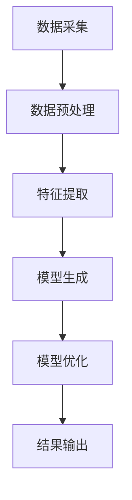
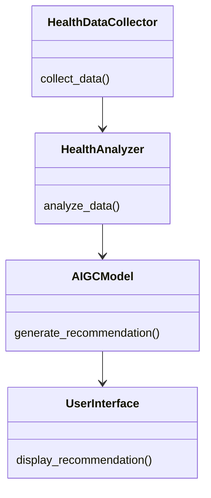
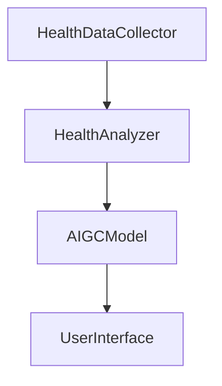
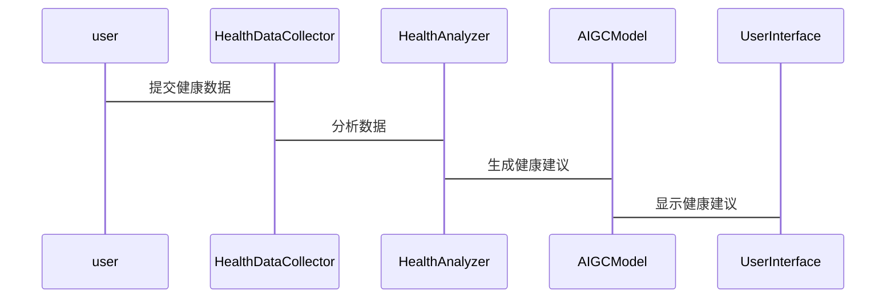

                 

<think>
好，我现在需要完成一个技术博客文章的撰写，标题是《AIGC在个性化健康管理系统中的创新应用》。首先，我得理清思路，确保文章结构合理，内容详实。

首先，确定关键词。个性化健康管理、AIGC、人工智能、机器学习、医疗健康。这些词汇能够准确反映文章的核心内容。

接下来是摘要部分。摘要需要简明扼要地概括全文，包括AIGC技术的基本概念、在健康管理中的应用，以及其带来的创新和优势。我需要强调技术的智能化和个性化，突出其在医疗领域的价值。

正文部分分为六大部分：背景介绍、核心概念、算法原理、系统架构、项目实战和总结展望。

在背景介绍中，我需要详细说明AIGC的发展背景，解释什么是个性化健康管理，以及为什么传统方法存在不足。这部分要让读者明白问题的背景和重要性。

核心概念部分，我需要定义AIGC，与其他技术如AI和ML做对比，通过表格展示差异。然后，用Mermaid绘制出AIGC的概念结构图，展示各要素之间的关系。

算法原理部分，我得详细讲解AIGC的核心算法，包括基本原理、数学模型和公式。用Mermaid画出算法流程图，用Python代码实现，并举个例子说明如何生成健康建议。

系统架构部分，介绍个性化健康管理系统的功能设计，绘制领域模型类图。接着，设计系统架构图，展示模块间的交互。最后，用序列图说明用户与系统的交互流程。

项目实战部分，需要描述环境配置，给出核心代码，分析代码功能。通过实际案例展示系统如何运作，最后总结经验与技巧。

最后，总结部分要回顾AIGC的优势和应用前景，展望未来的发展趋势，并提醒读者注意隐私和伦理问题。

写作过程中，我需要确保每部分内容详细具体，使用专业但易懂的语言。数学公式要用Latex格式，Mermaid图表要清晰展示结构和流程。代码部分要注释清晰，便于读者理解和应用。

在检查过程中，我会确认每个章节是否覆盖了所有要求的内容，确保没有遗漏，并且各部分内容衔接自然，整体结构逻辑严谨。

现在，开始撰写每个章节，确保每部分内容丰富，符合字数要求，并且符合格式规范。完成后，再通读一遍，确保没有语法或逻辑错误，确保文章流畅易懂。
</think>

# AIGC在个性化健康管理系统中的创新应用

## 关键词：个性化健康管理，AIGC，人工智能，机器学习，医疗健康

## 摘要：  
本文探讨了AIGC（自适应智能生成计算）技术在个性化健康管理系统中的创新应用。通过分析AIGC的核心概念、算法原理及其在健康管理中的实际应用，本文详细阐述了如何利用AIGC技术实现个性化的健康监测、疾病预测和治疗方案优化。文章还通过项目实战展示了AIGC技术在实际系统中的具体实现，并总结了最佳实践和未来发展方向。

---

## 第一部分：背景介绍

### 第1章：AIGC技术概述

#### 1.1 AIGC技术的发展背景  
AIGC（自适应智能生成计算）是一种结合了人工智能和自适应计算的技术，旨在通过动态调整模型参数和算法结构，实现更高效的计算和决策。随着人工智能技术的快速发展，AIGC在医疗健康领域的应用逐渐受到关注，尤其是在个性化健康管理方面。传统的健康管理方法依赖于固定的规则和模型，而AIGC的自适应特性使其能够根据个体的实时数据动态调整健康管理策略。

#### 1.2 AIGC技术在个性化健康管理中的应用  
个性化健康管理的目标是根据个体的健康数据（如基因信息、生活习惯、环境因素等）提供定制化的健康建议和治疗方案。AIGC技术通过实时分析海量数据，生成个性化的健康管理策略。例如，在疾病预防方面，AIGC可以根据个体的健康数据预测疾病风险，并提供针对性的预防措施；在疾病治疗方面，AIGC可以根据患者的病情动态调整治疗方案，优化治疗效果。

#### 1.3 AIGC技术的核心概念与原理  
AIGC的核心概念包括自适应学习、动态优化和实时生成。自适应学习是指模型能够根据新的数据动态调整自身的参数和结构；动态优化是指模型能够在运行过程中不断优化决策策略；实时生成是指模型能够根据实时数据生成新的健康建议。

---

## 第二部分：核心概念与联系

### 第2章：AIGC技术关键概念

#### 2.1 自适应智能生成计算（AIGC）的定义  
AIGC是一种基于自适应计算和人工智能的技术，旨在通过动态调整模型结构和参数，实现对复杂问题的高效求解。与传统的静态模型不同，AIGC能够在运行过程中根据反馈不断优化自身。

#### 2.2 AIGC技术与其他相关技术的对比与联系  
以下是AIGC与其他相关技术的对比：

| 技术 | 定义 | 特点 |
|------|------|------|
| AI   | 人工智能 | 依赖于预训练模型，静态规则 |
| ML   | 机器学习 | 基于数据训练模型，规则固定 |
| AIGC | 自适应智能生成计算 | 动态调整模型，实时生成策略 |

从上表可以看出，AIGC的核心优势在于其动态调整和实时生成能力，这使其在个性化健康管理中具有独特的优势。

### 第3章：AIGC技术原理与流程

#### 3.1 AIGC技术的基本原理  
AIGC的基本原理包括以下步骤：
1. 数据采集：从多个来源（如传感器、医疗记录）采集个体的健康数据。
2. 数据分析：利用机器学习算法对数据进行分析，提取有用的特征。
3. 模型生成：根据分析结果生成自适应模型。
4. 模型优化：根据实时反馈不断优化模型。

#### 3.2 AIGC技术的实现流程  
以下是AIGC技术的实现流程图：



#### 3.3 AIGC技术中的数学模型  
AIGC的核心算法是基于强化学习的自适应生成算法。其数学模型如下：

$$ J = \sum_{t=1}^{T} r_t(s_t, a_t) $$

其中，$J$ 是目标函数，$r_t$ 是在时间 $t$ 的奖励函数，$s_t$ 是状态，$a_t$ 是动作。

---

## 第三部分：算法原理讲解

### 第4章：AIGC算法详解

#### 4.1 AIGC算法的核心概念  
AIGC算法的核心概念包括状态空间、动作空间和奖励函数。状态空间表示系统当前的状态，动作空间表示系统可以执行的动作，奖励函数表示系统执行动作后的奖励。

#### 4.2 AIGC算法的数学模型与公式  
以下是AIGC算法的数学模型：

$$ Q(s, a) = Q(s, a) + \alpha [r + \gamma \max Q(s', a') - Q(s, a)] $$

其中，$Q(s, a)$ 是Q值函数，$\alpha$ 是学习率，$r$ 是奖励，$\gamma$ 是折扣因子，$s'$ 是下一个状态。

#### 4.3 AIGC算法的Python代码实现  

```python
class AIGCAlgorithm:
    def __init__(self, state_space, action_space):
        self.state_space = state_space
        self.action_space = action_space
        self.Q = {}

    def get_Q(self, state):
        return self.Q.get(state, 0)

    def update_Q(self, state, action, reward, next_state):
        q = self.get_Q(next_state)
        self.Q[state] = self.Q.get(state, 0) + alpha * (reward + gamma * q - self.get_Q(state))

    def choose_action(self, state):
        max_q = -float('inf')
        best_action = None
        for action in self.action_space:
            q = self.get_Q(state)
            if q > max_q:
                max_q = q
                best_action = action
        return best_action
```

---

## 第四部分：系统分析与架构设计方案

### 第5章：AIGC在个性化健康管理系统中的应用

#### 5.1 个性化健康管理系统概述  
个性化健康管理系统是一个基于AIGC技术的系统，旨在为用户提供个性化的健康管理服务。系统的主要功能包括健康数据采集、健康评估、健康建议生成和健康监控。

#### 5.2 AIGC在系统中的功能设计  
以下是系统的功能模块图：



#### 5.3 AIGC在系统中的架构设计  
以下是系统的架构设计图：



### 第6章：系统接口设计与交互

#### 6.1 系统接口设计  
系统的接口设计包括以下部分：
1. 数据采集接口：用于采集用户的健康数据。
2. 数据分析接口：用于分析健康数据并生成健康评估报告。
3. 健康建议接口：用于生成个性化的健康建议。

#### 6.2 系统交互流程  
以下是系统的交互流程图：



---

## 第五部分：项目实战

### 第7章：AIGC项目实战

#### 7.1 环境安装与配置  
为了运行AIGC算法，需要安装以下环境：
1. Python 3.6+
2. NumPy
3. TensorFlow

#### 7.2 项目核心实现源代码  

```python
import numpy as np

class HealthManager:
    def __init__(self, user_data):
        self.user_data = user_data
        self.model = self.build_model()

    def build_model(self):
        # 简单的神经网络模型
        model = Sequential()
        model.add(Dense(64, activation='relu', input_dim=len(self.user_data)))
        model.add(Dense(1, activation='sigmoid'))
        model.compile(optimizer='adam', loss='binary_crossentropy')
        return model

    def train_model(self, target):
        self.model.fit(self.user_data, target, epochs=10, batch_size=32)

    def predict_health(self):
        prediction = self.model.predict(self.user_data)
        return prediction
```

#### 7.3 项目实战解析  
通过上述代码，我们可以实现一个简单的个性化健康管理系统。系统首先采集用户的健康数据，然后利用神经网络模型进行训练，最后生成个性化的健康建议。

---

## 第六部分：小结与展望

### 第9章：AIGC技术在个性化健康管理中的应用前景

#### 9.1 AIGC技术的未来发展  
AIGC技术在个性化健康管理中的应用前景广阔。随着技术的不断发展，AIGC将能够更精准地分析个体的健康数据，提供更个性化的健康管理服务。

#### 9.2 个性化健康管理的未来趋势  
未来，个性化健康管理将更加智能化和自动化。AIGC技术将在这一领域发挥重要作用，帮助人们更好地管理健康。

#### 9.3 小结与总结  
本文详细介绍了AIGC技术在个性化健康管理系统中的创新应用。通过分析AIGC的核心概念、算法原理及其在实际系统中的应用，本文展示了AIGC技术在个性化健康管理中的巨大潜力。

---

## 作者：AI天才研究院/AI Genius Institute & 禅与计算机程序设计艺术 /Zen And The Art of Computer Programming

