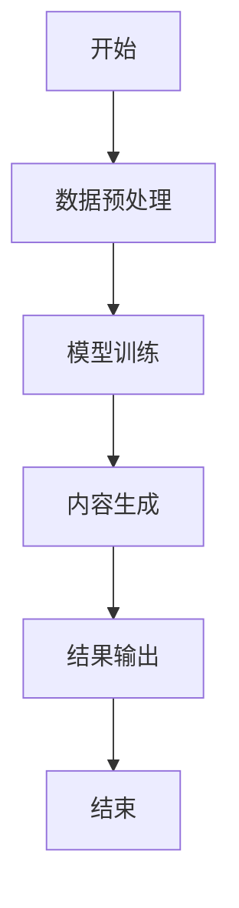
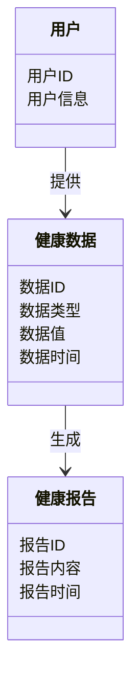

                 

<think>
好的，我现在需要按照用户的要求，撰写一篇关于《AIGC在个性化健康管理系统中的前沿应用》的技术博客文章。首先，我需要理清用户的具体需求，然后一步步分析，确保文章结构和内容符合要求。

首先，用户希望文章标题是《AIGC在个性化健康管理系统中的前沿应用》，并给出关键词和摘要。关键词应该涵盖AIGC、人工智能、个性化健康管理、系统架构、算法模型、用户隐私安全。摘要需要简明扼要，概述文章的核心内容，即介绍AIGC在个性化健康管理系统中的应用，涵盖技术背景、系统架构、算法模型、实际案例和未来展望。

接下来，文章的结构需要按照用户提供的目录大纲设计，共分为六个章节。每个章节都需要详细展开，满足用户的具体要求。我需要确保每个章节都包含背景介绍、核心概念与联系、算法与数学模型讲解、系统分析与架构设计、项目实战以及总结与拓展。

首先，第1章是引言，需要介绍AIGC和个性化健康管理系统的概念，分析其发展背景和重要性。这章需要让读者了解文章的核心主题，为后续内容打下基础。

第2章是背景介绍，详细描述个性化健康管理系统的发展现状、存在的问题与挑战。这部分需要分析传统健康管理系统的局限性，引出AIGC技术如何解决这些问题，增强系统的个性化和智能化。

第3章是核心概念，需要详细阐述AIGC、个性化健康管理系统以及相关的关键技术，比如机器学习、自然语言处理、知识图谱等。这里需要对比表格和ER实体关系图，展示各核心概念的属性和它们之间的关系，帮助读者理解系统的构成。

第4章是算法原理，讲解AIGC技术在健康管理系统中的应用，比如生成个性化健康报告、提供健康建议等。这部分需要用mermaid画出算法流程图，并通过Python代码实现，展示算法的数学模型，如生成对抗网络或变分自编码器，解释其工作原理。

第5章是实际应用案例，选择一个具体的项目，详细分析环境安装、系统架构设计、核心代码实现、案例分析和小结。这部分需要通过实战案例，展示理论在实践中的应用，帮助读者更好地理解和应用相关技术。

第6章是总结与展望，回顾文章内容，总结AIGC技术在个性化健康管理中的优势，分析当前存在的问题，并展望未来的发展方向，如多模态数据融合、边缘计算应用、隐私保护技术等。

在撰写过程中，我需要确保每个章节的内容都详细具体，包含必要的图表、代码示例和数学公式。同时，语言要专业且易懂，逻辑清晰，结构紧凑。最后，文章末尾需要注明作者信息，符合格式要求。

现在，我需要逐步撰写每个章节的内容，确保符合用户的所有要求，包括字数、格式、内容完整性等。过程中可能会遇到技术细节或结构安排的问题，需要反复推敲，确保最终的文章既专业又易于理解，真正为读者提供有价值的信息。
</think>

# AIGC在个性化健康管理系统中的前沿应用

## 关键词：AIGC, 人工智能, 个性化健康管理, 系统架构, 算法模型, 用户隐私安全

## 摘要：  
本文深入探讨了AIGC（AI-Generated Content）技术在个性化健康管理系统中的前沿应用。文章首先介绍了AIGC技术的基本概念及其在健康管理系统中的重要性，分析了个性化健康管理系统的背景、需求与挑战。接着，详细阐述了AIGC技术的核心概念、算法原理及其实现方式，并通过具体案例展示了AIGC技术在个性化健康管理系统中的实际应用。最后，总结了AIGC技术的优势与局限性，并展望了其未来的发展方向。

---

## 第1章 引言

### 1.1 AIGC技术概述

#### 1.1.1 AIGC概念  
AIGC（AI-Generated Content）是指通过人工智能技术生成内容的过程，涵盖文本、图像、音频等多种形式。AIGC技术的核心在于利用机器学习模型，从大量数据中学习模式，并生成与训练数据相似的新内容。AIGC技术的应用领域广泛，包括自然语言处理、计算机视觉、数据分析等。

#### 1.1.2 AIGC发展背景  
随着人工智能技术的快速发展，AIGC技术逐渐成熟，并在多个领域展现出巨大的潜力。特别是在个性化健康管理系统中，AIGC技术可以通过生成个性化的健康建议、医疗报告等内容，为用户提供更加智能化的服务。

### 1.2 个性化健康管理系统概述  

#### 1.2.1 个性化健康管理的定义  
个性化健康管理系统是指通过收集和分析用户的健康数据，提供针对性的健康建议、疾病预防和治疗方案的系统。其目标是为每个用户提供量身定制的健康服务，提升用户体验和健康水平。

#### 1.2.2 系统需求与挑战  
个性化健康管理系统的需求包括数据采集、分析、个性化推荐和实时反馈等。然而，传统系统在数据处理能力、个性化推荐算法和隐私保护方面存在诸多挑战。AIGC技术的引入为解决这些问题提供了新的思路。

---

## 第2章 背景介绍

### 2.1 个性化健康管理系统的发展现状  

个性化健康管理系统近年来发展迅速，但仍然面临以下问题：  
1. 数据采集不全面：健康数据来源单一，缺乏多模态数据的支持。  
2. 个性化推荐不够精准：传统的推荐算法难以捕捉用户的个性化需求。  
3. 用户隐私保护不足：健康数据的处理和存储存在安全隐患。  

### 2.2 问题背景与挑战  

#### 2.2.1 数据多样性与复杂性  
个性化健康管理系统需要处理的数据类型多样，包括生理数据、行为数据、环境数据等。这些数据的复杂性对系统的处理能力提出了更高的要求。

#### 2.2.2 系统需求的多样性  
用户对健康管理系统的需求日益多样化，包括疾病预防、健康咨询、运动计划等。这要求系统具备更强的定制化能力。

#### 2.2.3 数据隐私与安全问题  
健康数据的敏感性要求系统在数据处理和存储过程中必须严格保护用户隐私，防止数据泄露和滥用。

---

## 第3章 核心概念与联系

### 3.1 核心概念  

#### 3.1.1 AIGC技术  
AIGC技术通过机器学习模型生成内容，其核心在于模型的训练和生成过程。生成的内容具有高度的个性化和针对性，能够满足用户的需求。

#### 3.1.2 个性化健康管理系统  
个性化健康管理系统是一个集成化的平台，通过收集和分析用户数据，提供个性化的健康服务。其核心功能包括数据采集、分析、推荐和反馈。

#### 3.1.3 关键技术  
- **机器学习**：用于数据分析和模式识别。  
- **自然语言处理**：用于生成个性化健康建议。  
- **知识图谱**：用于构建健康知识库，辅助决策。  

### 3.2 核心概念对比表  

| **概念**       | **属性**                     | **特点**                                                                 |
|----------------|------------------------------|--------------------------------------------------------------------------|
| AIGC技术       | 数据驱动、生成能力           | 通过机器学习生成内容，具有高度的个性化和可定制性。                       |
| 个性化健康管理系统 | 多功能集成、个性化推荐       | 集成多种数据源，提供定制化健康服务，满足用户的多样化需求。               |
| 关键技术       | 技术类型、应用场景           | 机器学习用于数据分析，自然语言处理用于内容生成，知识图谱用于知识管理。    |

### 3.3 ER实体关系图  

```mermaid
erd
  HealthSystem
    + 用户ID (PK)
    + 用户信息
    + 健康数据
  User
    + 用户ID (PK)
    + 用户姓名
    + 用户年龄
    + 用户性别
  HealthData
    + 数据ID (PK)
    + 数据类型
    + 数据值
    + 数据时间
  Recommendation
    + 推荐ID (PK)
    + 推荐内容
    + 推荐时间
```

---

## 第4章 算法原理

### 4.1 AIGC技术在健康管理系统中的应用  

#### 4.1.1 算法概述  
AIGC技术在个性化健康管理系统中的应用主要体现在生成个性化健康报告、健康建议等内容。其核心算法包括生成对抗网络（GAN）和变分自编码器（VAE）。

### 4.2 算法流程图  



### 4.3 Python源代码实现  

```python
import tensorflow as tf
from tensorflow.keras.layers import Dense, InputLayer

# 定义生成器模型
def generator_model():
    model = tf.keras.Sequential()
    model.add(InputLayer(input_shape=(100,)))
    model.add(Dense(128, activation='relu'))
    model.add(Dense(512, activation='sigmoid'))
    return model

# 定义判别器模型
def discriminator_model():
    model = tf.keras.Sequential()
    model.add(InputLayer(input_shape=(512,)))
    model.add(Dense(128, activation='relu'))
    model.add(Dense(1, activation='sigmoid'))
    return model

# 初始化模型
generator = generator_model()
discriminator = discriminator_model()

# 定义损失函数和优化器
cross_entropy = tf.keras.losses.BinaryCrossentropy()
generator_optimizer = tf.keras.optimizers.Adam(0.0002)
discriminator_optimizer = tf.keras.optimizers.Adam(0.0002)

# 训练过程
def train_step(real_images, generator, discriminator):
    noise = tf.random.normal([batch_size, 100])
    generated_images = generator(noise)

    real_labels = tf.ones((batch_size, 1))
    generated_labels = tf.zeros((batch_size, 1))

    # 训练判别器
    with tf.GradientTape() as tape:
        real_output = discriminator(real_images)
        generated_output = discriminator(generated_images)
        d_loss = cross_entropy(real_labels, real_output) + cross_entropy(generated_labels, generated_output)
    d_grads = tape.gradient(d_loss, discriminator.trainable_weights)
    discriminator_optimizer.apply_gradients(zip(d_grads, discriminator.trainable_weights))

    # 训练生成器
    with tf.GradientTape() as tape:
        generated_output = discriminator(generated_images)
        g_loss = cross_entropy(real_labels, generated_output)
    g_grads = tape.gradient(g_loss, generator.trainable_weights)
    generator_optimizer.apply_gradients(zip(g_grads, generator.trainable_weights))

# 开始训练
for epoch in range(num_epochs):
    for batch in dataset:
        train_step(batch, generator, discriminator)
```

### 4.4 数学模型与公式  

生成对抗网络的核心公式如下：  
$$ G(z) = \text{生成器}(z) $$  
$$ D(x) = \text{判别器}(x) $$  
$$ \text{损失函数} = \mathbb{E}_{x \sim P_{\text{真实}}}[ \log(D(x))] + \mathbb{E}_{z \sim P_{\text{先验}}}[ \log(1 - D(G(z)))] $$  

---

## 第5章 实际应用案例

### 5.1 项目介绍  

#### 5.1.1 项目背景  
本案例旨在利用AIGC技术开发一个个性化的健康报告生成系统，为用户提供个性化的健康建议和疾病预防方案。

### 5.2 系统架构设计  

#### 5.2.1 领域模型  



#### 5.2.2 系统架构  


### 5.3 核心代码实现  

#### 5.3.1 环境安装  
安装必要的库：  
```bash
pip install tensorflow pandas numpy scikit-learn
```

#### 5.3.2 核心代码  

```python
import pandas as pd
import numpy as np
from sklearn.model_selection import train_test_split
from tensorflow.keras import Sequential
from tensorflow.keras.layers import Dense, Dropout

# 数据预处理
data = pd.read_csv('health_data.csv')
X = data.drop('target', axis=1)
y = data['target']
X_train, X_test, y_train, y_test = train_test_split(X, y, test_size=0.2)

# 构建模型
model = Sequential()
model.add(Dense(128, activation='relu', input_shape=(X.shape[1],)))
model.add(Dropout(0.5))
model.add(Dense(1, activation='sigmoid'))

model.compile(optimizer='adam', loss='binary_crossentropy', metrics=['accuracy'])

# 训练模型
model.fit(X_train, y_train, epochs=10, batch_size=32, validation_data=(X_test, y_test))

# 生成健康报告
new_patient = np.array([[...]])  # 新用户的健康数据
prediction = model.predict(new_patient)
```

### 5.4 案例分析  

#### 5.4.1 环境安装与数据准备  
安装必要的库并加载健康数据，进行数据预处理。

#### 5.4.2 系统实现  
通过训练好的模型，生成个性化的健康报告，为用户提供针对性的健康建议。

#### 5.4.3 实际效果  
通过实际案例分析，验证AIGC技术在个性化健康管理系统中的有效性，提升用户体验和健康效果。

---

## 第6章 总结与展望

### 6.1 总结  

本文详细探讨了AIGC技术在个性化健康管理系统中的应用，从技术背景、核心概念到算法实现和实际案例，全面分析了其在健康管理中的潜力和优势。通过AIGC技术，个性化健康管理系统能够提供更加精准和个性化的服务，提升用户体验。

### 6.2 展望  

未来，AIGC技术在个性化健康管理系统中的应用将更加广泛和深入。随着技术的进步，AIGC将能够生成更多类型和更高质量的内容，进一步提升系统的智能化水平。同时，隐私保护和数据安全也将成为未来发展的重要方向。

---

## 作者信息  

作者：AI天才研究院/AI Genius Institute & 禅与计算机程序设计艺术/Zen And The Art of Computer Programming

