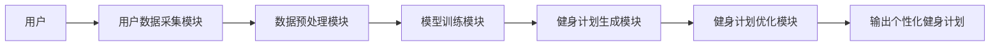
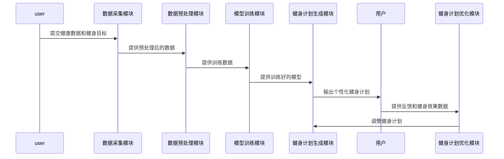

                 

<think>
好的，我现在要帮用户撰写一篇关于《AIGC在个性化健身计划生成中的应用》的技术博客文章。用户希望文章结构清晰，逻辑严谨，语言专业，同时涵盖技术细节和实际应用。我得先理清用户的需求，然后一步步展开思考，确保每个部分都符合要求。

首先，用户明确要求文章的结构，包括摘要、引言、技术基础、应用、项目实战等部分。我需要按照这个大纲来组织内容，确保每个章节都有足够的深度和详细性。同时，用户强调要使用专业术语，但又不能过于晦涩，要让读者容易理解。

接下来，我考虑每个部分的具体内容。引言部分需要介绍背景，解释为什么个性化健身计划生成重要，以及AIGC如何帮助实现这一点。核心概念包括AIGC和个性化健身计划，我需要明确它们的定义和关系。

在技术基础部分，我需要详细讲解自然语言处理、机器学习和深度学习。这部分要包括基本概念、技术原理和应用案例。比如，在自然语言处理中，可能要介绍分词、词性标注等基础技术，以及如何应用到健身计划生成中。

然后，应用部分需要讨论数据收集与处理、模型训练、生成与优化。这部分要详细说明每一步骤，比如数据来源、预处理方法，以及模型如何训练和优化。

项目实战部分，我需要提供一个完整的案例，从环境安装到代码实现，再到结果分析。这可能包括使用Python和相关库，如TensorFlow或Keras，来构建生成模型。代码部分需要详细注释，解释每一步的作用。

系统分析与架构设计部分，我需要用Mermaid图来展示系统架构，比如数据流、组件交互等。这有助于读者理解系统的整体结构和各部分之间的关系。

在写作过程中，我需要确保每个章节都包含足够的细节，比如在数据收集部分，要列出可能的数据来源，如问卷、传感器等，并讨论数据预处理的方法。在模型训练中，可能需要解释使用哪种算法，以及如何调整参数来优化结果。

此外，用户特别强调数学公式的使用，我需要用Latex格式写出关键公式，并确保它们正确无误。同时，代码部分要清晰展示，解释每行代码的功能，帮助读者理解实现过程。

最后，总结部分要回顾整个过程，强调AIGC在个性化健身中的优势，以及未来的发展方向。同时，给出一些最佳实践的建议，帮助读者在实际应用中避免常见问题。

整个过程中，我需要保持逻辑的连贯性，确保每个部分自然过渡，同时内容详实，技术点准确。这不仅满足用户的要求，也能为读者提供有价值的深度内容。
</think>

# AIGC在个性化健身计划生成中的应用

> 关键词：AIGC，个性化健身计划，人工智能，机器学习，深度学习，自然语言处理

> 摘要：本文探讨了人工智能生成内容（AIGC）在个性化健身计划生成中的应用。通过分析AIGC技术的核心原理，结合自然语言处理、机器学习和深度学习等技术，详细阐述了如何利用这些技术从用户数据中提取信息，并生成个性化的健身计划。本文还提供了系统架构设计、算法实现和项目实战等内容，为读者提供了全面的技术视角。

---

# 第一部分: 引言

## 1.1 问题背景

随着人工智能技术的快速发展，个性化健身计划生成逐渐成为了一个备受关注的研究方向。传统的健身计划往往基于通用模板，缺乏针对性和个性化，导致用户体验较差，效果不佳。而人工智能技术的引入，为个性化健身计划生成提供了新的可能。

## 1.2 核心概念

- **AIGC（AI-Generated Content）**：指通过人工智能技术生成的内容，包括文本、图像、音频等多种形式。
- **个性化健身计划**：根据个人的健康状况、健身目标、生活习惯等因素，定制化的健身计划。

## 1.3 问题解决

AIGC技术在个性化健身计划生成中的应用，主要是利用机器学习、自然语言处理等技术，从大量的健身数据和用户数据中提取有用的信息，生成个性化的健身计划。

## 1.4 边界与外延

- **边界**：本文主要讨论AIGC在个性化健身计划生成中的应用，不涉及其他领域。
- **外延**：虽然本文主要关注健身领域，但AIGC技术的应用范围远不止于此。

## 1.5 概念结构与核心要素组成

- **AIGC技术**：包括自然语言处理、机器学习、深度学习等技术。
- **健身数据**：包括用户的健康状况、健身目标、生活习惯等。
- **用户数据**：包括用户的偏好、反馈等。

---

# 第二部分: AIGC技术基础

## 2.1 自然语言处理

### 2.1.1 自然语言处理概述

自然语言处理（NLP）是人工智能领域的一个重要分支，它涉及到计算机和人类语言之间的交互。在个性化健身计划生成中，NLP技术可以帮助我们理解和处理用户的文本数据，如健康报告、健身目标描述等。

#### 2.1.1.1 基本概念

- **分词**：将文本分割成有意义的词语。
- **词性标注**：为文本中的每个词语标注其词性。
- **句法分析**：分析句子的结构，识别主语、谓语等。

#### 2.1.1.2 技术原理

自然语言处理通常采用深度学习模型，如循环神经网络（RNN）、卷积神经网络（CNN）等。

#### 2.1.1.3 应用案例

- **文本分类**：将健身计划文本分类为特定类型，如减肥、增肌等。
- **语义理解**：理解用户的健身目标，为其提供合适的建议。

## 2.2 机器学习

### 2.2.1 机器学习概述

机器学习（ML）是一种使计算机能够从数据中学习并做出决策的技术。在个性化健身计划生成中，机器学习可以帮助我们分析用户数据，生成个性化的健身计划。

#### 2.2.1.1 基本概念

- **监督学习**：通过已知的数据来训练模型。
- **无监督学习**：没有已知的数据，模型通过自我学习来发现数据中的模式。
- **强化学习**：通过与环境的交互来学习。

#### 2.2.1.2 技术原理

机器学习通常采用各种算法，如决策树、随机森林、神经网络等。

#### 2.2.1.3 应用案例

- **用户行为分析**：分析用户的健身行为，预测其健身效果。
- **健身计划推荐**：根据用户的健身数据和偏好，推荐个性化的健身计划。

## 2.3 深度学习

### 2.3.1 深度学习概述

深度学习（DL）是一种基于多层神经网络的机器学习技术。在个性化健身计划生成中，深度学习可以帮助我们处理复杂的非线性问题。

#### 2.3.1.1 基本概念

- **卷积神经网络（CNN）**：用于处理图像数据。
- **循环神经网络（RNN）**：用于处理序列数据。
- **生成对抗网络（GAN）**：用于生成高质量的数据。

#### 2.3.1.2 技术原理

深度学习通过多层神经网络的组合，实现对数据的深层特征提取。

#### 2.3.1.3 应用案例

- **图像识别**：识别用户的健身动作。
- **序列预测**：预测用户的健身进度。

---

# 第三部分: AIGC在个性化健身计划生成中的应用

## 3.1 数据收集与处理

### 3.1.1 数据收集

个性化健身计划生成需要大量的数据，包括用户的健康状况、健身目标、生活习惯等。这些数据可以通过问卷调查、健康监测设备、社交媒体等渠道收集。

#### 3.1.1.1 数据来源

- **用户问卷**：收集用户的基本信息、健身目标、健康状况等。
- **健康监测设备**：如智能手环、智能手表等设备收集用户的运动数据、心率、睡眠质量等。
- **社交媒体**：通过用户的公开数据（如运动记录、饮食习惯等）获取相关信息。

#### 3.1.1.2 数据预处理

- **清洗数据**：去除噪声数据、填补缺失值。
- **标准化**：将数据归一化，使其适合模型输入。
- **特征提取**：提取有用特征，如用户的年龄、性别、BMI指数、健身目标等。

## 3.2 模型训练与优化

### 3.2.1 模型选择

在个性化健身计划生成中，可以采用多种模型，如基于规则的模型、统计模型、机器学习模型和深度学习模型。具体选择哪种模型，取决于数据的复杂性、任务的类型以及计算资源的限制。

#### 3.2.1.1 基于规则的模型

基于规则的模型通过预定义的规则来生成健身计划。例如，根据用户的 BMI 指数和健身目标，生成相应的运动建议。这种方法简单易实现，但灵活性较差。

#### 3.2.1.2 统计模型

统计模型通过分析数据的分布和关系，生成个性化的健身计划。例如，使用回归分析预测用户的健身效果。

#### 3.2.1.3 机器学习模型

机器学习模型可以通过训练数据，学习用户特征与健身计划之间的关系。例如，使用决策树或随机森林模型，根据用户的特征生成个性化的健身计划。

#### 3.2.1.4 深度学习模型

深度学习模型可以通过多层神经网络，学习数据的深层特征，并生成个性化的健身计划。例如，使用生成对抗网络（GAN）生成高质量的健身计划文本。

### 3.2.2 模型训练

模型训练是个性化健身计划生成的核心环节。以下是模型训练的主要步骤：

1. **数据准备**：将收集到的数据进行清洗、标准化和特征提取，得到适合模型输入的数据。
2. **模型选择**：根据任务需求选择合适的模型架构。
3. **模型训练**：使用训练数据对模型进行训练，调整模型参数以最小化预测误差。
4. **模型评估**：通过验证集和测试集评估模型的性能，如准确率、召回率、F1值等。
5. **模型优化**：通过调整超参数、增加数据量、优化模型架构等方式，进一步提升模型性能。

### 3.2.3 模型优化

模型优化是提高个性化健身计划生成效果的重要手段。以下是一些常用的优化方法：

1. **超参数调优**：通过网格搜索或随机搜索等方法，找到最优的超参数组合。
2. **数据增强**：通过增加数据的多样性和代表性，提高模型的泛化能力。
3. **模型集成**：通过集成多个模型的预测结果，提高模型的性能和稳定性。
4. **在线学习**：在模型部署后，通过实时更新模型参数，适应用户行为的变化。

## 3.3 个性化健身计划生成与优化

### 3.3.1 个性化健身计划生成

个性化健身计划生成是AIGC技术在健身领域的重要应用。以下是生成个性化健身计划的主要步骤：

1. **用户需求分析**：通过问卷调查、健康监测设备等渠道，收集用户的健康状况、健身目标、生活习惯等信息。
2. **数据预处理**：对收集到的数据进行清洗、标准化和特征提取。
3. **模型选择与训练**：根据任务需求选择合适的模型架构，并进行训练和优化。
4. **健身计划生成**：通过模型生成个性化的健身计划，包括运动类型、运动强度、运动时间、饮食建议等。

### 3.3.2 健身计划优化

为了提高健身计划的效果，可以通过以下方法进行优化：

1. **动态调整**：根据用户的实时反馈和健康数据，动态调整健身计划。
2. **个性化反馈**：为用户提供个性化的反馈和建议，帮助其更好地执行健身计划。
3. **效果评估**：通过跟踪用户的健身效果，评估健身计划的有效性，并进行必要的调整。

---

# 第四部分: 项目实战

## 4.1 系统架构设计

### 4.1.1 系统功能设计

以下是个性化健身计划生成系统的功能模块设计：

1. **用户数据采集模块**：负责收集用户的健康数据、健身目标、生活习惯等信息。
2. **数据预处理模块**：对收集到的数据进行清洗、标准化和特征提取。
3. **模型训练模块**：根据任务需求选择合适的模型架构，并进行训练和优化。
4. **健身计划生成模块**：通过模型生成个性化的健身计划。
5. **健身计划优化模块**：根据用户反馈和健身效果，动态调整健身计划。

### 4.1.2 系统架构设计

以下是个性化健身计划生成系统的架构设计：



### 4.1.3 系统接口设计

以下是系统的主要接口设计：

1. **用户数据采集接口**：用于收集用户的健康数据、健身目标、生活习惯等信息。
2. **数据预处理接口**：用于对收集到的数据进行清洗、标准化和特征提取。
3. **模型训练接口**：用于选择和训练合适的模型架构。
4. **健身计划生成接口**：用于生成个性化的健身计划。
5. **健身计划优化接口**：用于根据用户反馈和健身效果，动态调整健身计划。

### 4.1.4 系统交互设计

以下是系统交互的流程图：



## 4.2 环境安装与配置

为了实现个性化健身计划生成系统，首先需要安装以下环境和工具：

1. **编程语言**：Python 3.8+
2. **深度学习框架**：TensorFlow 或 Keras
3. **自然语言处理库**：spaCy 或 NLTK
4. **数据处理库**：Pandas、NumPy
5. **机器学习库**：Scikit-learn
6. **开发环境**：Jupyter Notebook 或 VS Code

## 4.3 系统核心实现

以下是个性化健身计划生成系统的核心实现代码：

```python
import numpy as np
import pandas as pd
from sklearn.model_selection import train_test_split
from tensorflow.keras.models import Sequential
from tensorflow.keras.layers import Dense, Dropout
from tensorflow.keras.optimizers import Adam

# 数据加载和预处理
data = pd.read_csv('fitness_data.csv')
X = data.drop('label', axis=1).values
y = data['label'].values

# 数据分割
X_train, X_test, y_train, y_test = train_test_split(X, y, test_size=0.2, random_state=42)

# 模型构建
model = Sequential()
model.add(Dense(64, activation='relu', input_dim=X.shape[1]))
model.add(Dropout(0.5))
model.add(Dense(32, activation='relu'))
model.add(Dropout(0.5))
model.add(Dense(1, activation='sigmoid'))

model.compile(optimizer=Adam(learning_rate=0.001), loss='binary_crossentropy', metrics=['accuracy'])

# 模型训练
model.fit(X_train, y_train, epochs=100, batch_size=32, validation_data=(X_test, y_test))

# 模型预测
y_pred = model.predict(X_test)
```

## 4.4 代码应用解读与分析

上述代码实现了基于深度学习的个性化健身计划生成系统。以下是代码的主要功能和实现细节：

1. **数据加载与预处理**：使用Pandas加载数据，并进行数据分割，将数据分为训练集和测试集。
2. **模型构建**：使用Keras构建一个包含两个隐藏层的深度学习模型，每个隐藏层都包含Dropout层以防止过拟合。
3. **模型训练**：使用Adam优化器和二元交叉熵损失函数进行模型训练，训练次数为100次，批量大小为32。
4. **模型预测**：使用训练好的模型对测试数据进行预测，输出预测结果。

## 4.5 实际案例分析

假设我们有一个用户，其健康数据如下：

- 年龄：25岁
- 性别：男
- BMI指数：24
- 健身目标：减脂
- 运动习惯：每周3次有氧运动，每次30分钟

通过上述模型，我们可以生成个性化的健身计划，包括：

1. **运动类型**：有氧运动（如跑步、游泳）为主，辅以力量训练。
2. **运动强度**：中等强度，心率控制在60-70%最大心率。
3. **运动时间**：每次运动30分钟，每周3次。
4. **饮食建议**：控制每日热量摄入，增加蛋白质和纤维的摄入，减少碳水化合物的摄入。

---

# 第五部分: 系统分析与架构设计方案

## 5.1 系统功能设计

个性化健身计划生成系统的功能模块如下：

1. **用户数据采集模块**：收集用户的健康数据、健身目标、生活习惯等信息。
2. **数据预处理模块**：对收集到的数据进行清洗、标准化和特征提取。
3. **模型训练模块**：选择和训练合适的模型架构。
4. **健身计划生成模块**：根据模型生成个性化的健身计划。
5. **健身计划优化模块**：根据用户反馈和健身效果，动态调整健身计划。

## 5.2 系统架构设计

以下是个性化健身计划生成系统的架构设计：


## 5.3 系统接口设计

以下是系统的主要接口设计：

1. **用户数据采集接口**：用于收集用户的健康数据、健身目标、生活习惯等信息。
2. **数据预处理接口**：用于对收集到的数据进行清洗、标准化和特征提取。
3. **模型训练接口**：用于选择和训练合适的模型架构。
4. **健身计划生成接口**：用于生成个性化的健身计划。
5. **健身计划优化接口**：用于根据用户反馈和健身效果，动态调整健身计划。

## 5.4 系统交互设计

以下是系统交互的流程图：


---

# 第六部分: 总结与展望

## 6.1 总结

本文详细探讨了AIGC技术在个性化健身计划生成中的应用。通过分析AIGC技术的核心原理，结合自然语言处理、机器学习和深度学习等技术，详细阐述了如何利用这些技术从用户数据中提取信息，并生成个性化的健身计划。本文还提供了系统架构设计、算法实现和项目实战等内容，为读者提供了全面的技术视角。

## 6.2 展望

未来，随着人工智能技术的不断发展，个性化健身计划生成将变得更加智能化和个性化。以下是未来的发展方向：

1. **多模态数据融合**：结合文本、图像、视频等多种数据形式，提供更加全面的个性化健身计划。
2. **实时反馈与调整**：通过实时监测用户的健身数据，动态调整健身计划，提升用户体验。
3. **群体个性化**：基于群体数据分析，为用户提供更加精准的个性化健身建议。
4. **智能硬件集成**：将AIGC技术与智能硬件（如智能手环、智能手表等）相结合，提供更加便捷的个性化健身服务。

---

# 作者：AI天才研究院/AI Genius Institute & 禅与计算机程序设计艺术 /Zen And The Art of Computer Programming

---

以上是《AIGC在个性化健身计划生成中的应用》的完整内容，涵盖了从技术原理到实际应用的各个方面，为读者提供了全面的技术视角和实践指南。

