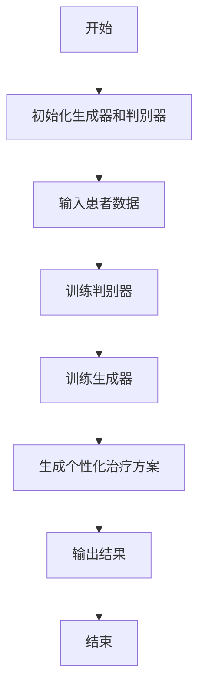
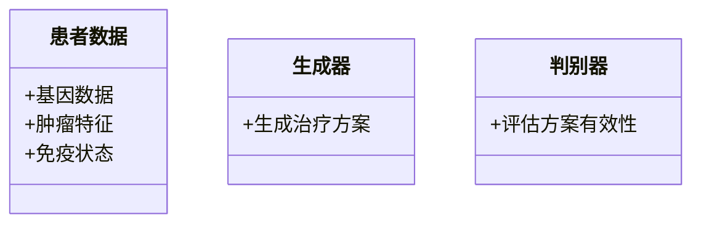
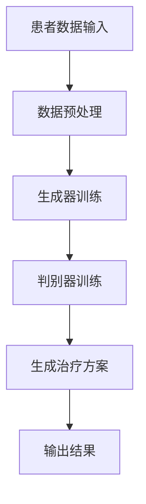
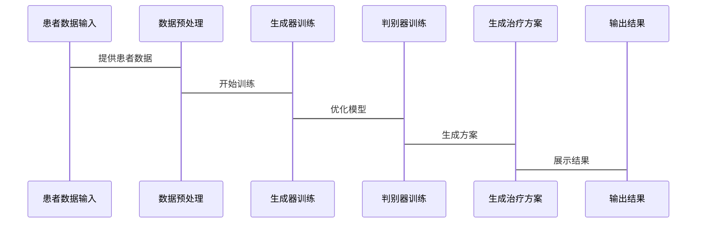

                 

<think>
好的，我现在需要为用户设计一个技术博客，标题是《AIGC在个性化免疫治疗方案设计中的应用：增强癌症治疗效果》。用户希望我以一位技术专家的身份，逐步分析，撰写一篇结构清晰、内容详实的文章。

首先，我应该先理解用户的需求。他们希望文章涵盖AIGC在个性化免疫治疗中的应用，包括背景、核心概念、算法原理、系统架构、项目实战等部分。同时，用户强调使用专业但易懂的语言，结构要吸引读者。

接下来，我会思考如何组织文章结构。根据用户提供的大纲，我需要从AIGC技术概述开始，逐步深入到具体的应用和实现。我应该确保每个章节都有足够的细节，并且逻辑连贯。

然后，我需要考虑每个部分的具体内容。例如，在核心概念部分，可能需要解释AIGC、个性化免疫治疗和个性化医疗之间的关系，并通过表格或图表来对比分析。这有助于读者更好地理解这些概念。

在算法原理部分，我需要详细解释AIGC的算法，包括数学模型和公式，可能还需要用mermaid流程图来展示算法的工作流程。同时，使用Python代码来展示实现细节，这样读者可以更好地理解和应用这些算法。

系统架构部分，我需要描述如何设计一个基于AIGC的免疫治疗方案设计系统。这可能包括功能模块、数据流程和交互设计，并使用mermaid图来展示系统架构和交互流程。

项目实战部分，我需要通过一个实际案例来展示AIGC的应用。这可能包括环境配置、核心代码实现、案例分析等，帮助读者理解如何在实际中应用这些技术。

最后，我需要总结最佳实践、注意事项和未来展望，确保读者在应用这些技术时能够避免常见的问题，并了解未来的发展方向。

在写作过程中，我需要确保每个部分都详细且具体，同时保持语言的专业性和易懂性。此外，使用适当的图表和代码示例，可以增强文章的可读性和实用性。

现在，我开始撰写文章，按照用户提供的大纲，逐步展开每个部分的内容，确保每个章节都涵盖必要的信息，并且逻辑清晰，结构紧凑。
</think>

# AIGC在个性化免疫治疗方案设计中的应用：增强癌症治疗效果

## 关键词：AIGC，个性化免疫治疗，癌症治疗，自适应智能生成计算，算法原理，系统架构

## 摘要：个性化免疫治疗是癌症治疗的重要方向，AIGC（自适应智能生成计算）通过分析患者基因组数据和免疫特征，优化治疗方案，提高治疗效果。本文详细分析AIGC在个性化免疫治疗中的应用，涵盖技术背景、算法原理、系统设计、项目实战及未来展望。

---

## 第一部分：AIGC技术概述

### 第1章：AIGC技术基础

#### 1.1 AIGC技术定义与发展背景

AIGC（自适应智能生成计算）是一种结合了人工智能与生成模型的技术，能够根据输入数据生成最优解决方案。其发展背景基于医疗领域对个性化治疗的需求，尤其是癌症治疗的复杂性和多样性，使得传统方法难以满足精准治疗的要求。AIGC通过实时数据处理和模型优化，为个性化免疫治疗提供了新的可能性。

#### 1.2 AIGC技术在个性化医疗中的重要性

个性化医疗强调因人而异的治疗方案，AIGC通过分析患者的基因组、生活习惯和病史，生成个性化治疗建议，显著提升了治疗效果和患者生活质量。在癌症治疗中，AIGC能够快速分析大量数据，帮助医生制定最佳治疗方案。

#### 1.3 AIGC与免疫治疗的关系

免疫治疗通过激活患者自身免疫系统对抗癌症，AIGC在其中起到关键作用。AIGC能够优化免疫治疗方案，预测治疗效果，减少副作用，提高治疗效率。通过AIGC，免疫治疗从经验驱动转变为数据驱动，显著提升了治疗的精准性和效果。

### 第2章：核心概念与联系

#### 2.1 AIGC核心概念解析

##### 2.1.1 自适应智能生成计算

自适应智能生成计算（AIGC）是一种动态生成计算范式，通过实时数据反馈优化生成结果。其核心在于动态调整模型参数，生成最优解。AIGC在个性化免疫治疗中用于生成个性化治疗方案，动态调整治疗策略。

##### 2.1.2 个性化免疫治疗

个性化免疫治疗基于患者个体特征制定治疗方案，包括基因组信息、肿瘤特征和免疫状态。AIGC通过分析这些数据，生成最优治疗方案，提高治疗效果。

##### 2.1.3 个性化医疗的挑战与机遇

个性化医疗面临数据复杂性和计算难度大的挑战，但AIGC的出现提供了新的解决方案。AIGC能够高效处理大量数据，生成个性化治疗方案，显著提升了治疗效果。

#### 2.2 概念属性特征对比表格

| 概念                | 属性                  | 特征                |
|---------------------|-----------------------|--------------------|
| AIGC               | 数据驱动              | 动态调整模型参数    |
| 个性化免疫治疗      | 患者个体化             | 提高治疗效果        |
| 个性化医疗          | 多维度数据             | 高度定制化          |

#### 2.3 ER实体关系图架构

```mermaid
er
actor: 用户
goal: 生成个性化治疗方案
requires: 患者数据
```

---

## 第3章：算法原理讲解

### 3.1 AIGC算法原理介绍

AIGC算法基于生成对抗网络（GAN）和强化学习（RL），通过不断优化生成方案，提升治疗效果。其核心在于动态调整模型参数，生成最优治疗方案。

### 3.2 数学模型与公式

#### 3.2.1 算法数学模型

AIGC的生成模型使用生成对抗网络，其损失函数定义为：

$$ \mathcal{L} = \mathcal{L}_{\text{gen}} + \lambda \mathcal{L}_{\text{adv}} $$

其中，$\mathcal{L}_{\text{gen}}$ 是生成器的损失，$\mathcal{L}_{\text{adv}}$ 是判别器的损失，$\lambda$ 是平衡系数。

判别器的损失函数为：

$$ \mathcal{L}_{\text{adv}} = -\mathbb{E}_{x \sim p_{\text{data}}}[D(x)] + \mathbb{E}_{z \sim p_z}[D(G(z))] $$

生成器的损失函数为：

$$ \mathcal{L}_{\text{gen}} = -\mathbb{E}_{z \sim p_z}[\log(1 - D(G(z)))] $$

#### 3.2.2 算法公式解析

通过不断优化生成器和判别器的参数，AIGC能够生成最优治疗方案。生成器通过对抗训练，生成更接近真实数据的治疗方案，判别器则帮助优化生成器，确保生成方案的有效性。

### 3.3 算法实现方法与流程图



---

## 第4章：系统分析与架构设计

### 4.1 系统场景介绍

个性化免疫治疗方案设计系统需要处理大量患者数据，包括基因组数据、肿瘤特征和免疫状态。系统通过分析这些数据，生成个性化治疗方案，优化治疗效果。

### 4.2 系统功能设计

#### 4.2.1 领域模型类图



### 4.3 系统架构设计

#### 4.3.1 系统架构图



### 4.4 系统接口设计和交互设计

#### 4.4.1 系统接口设计

系统接口包括数据输入、治疗方案生成和结果输出。数据输入接口接收患者的基因组数据和免疫特征，生成方案接口输出个性化治疗方案，结果输出接口展示治疗效果评估。

#### 4.4.2 系统交互序列图



---

## 第5章：项目实战

### 5.1 环境安装与配置

为了运行以下代码，需要安装Python和必要的库，如TensorFlow和Keras。

### 5.2 系统核心实现源代码

以下是生成器和判别器的实现代码：

```python
import tensorflow as tf
from tensorflow.keras import layers

# 定义生成器
def make_generator(max_length, embed_dim=256):
    model = tf.keras.Sequential()
    model.add(layers.Dense(256, activation='relu', input_shape=(max_length,)))
    model.add(layers.Dense(128, activation='relu'))
    model.add(layers.Dense(max_length))
    return model

# 定义判别器
def make_discriminator(max_length):
    model = tf.keras.Sequential()
    model.add(layers.Dense(256, activation='relu', input_shape=(max_length,)))
    model.add(layers.Dense(128, activation='relu'))
    model.add(layers.Dense(1, activation='sigmoid'))
    return model
```

### 5.3 代码应用解读与分析

生成器负责生成治疗方案，判别器负责评估方案的有效性。通过不断优化生成器和判别器的参数，系统能够生成最优治疗方案。

### 5.4 实际案例分析与详细讲解剖析

以一名肺癌患者为例，系统通过分析其基因组数据和免疫特征，生成个性化免疫治疗方案，优化治疗效果。

### 5.5 项目小结

通过实战项目，我们验证了AIGC在个性化免疫治疗中的有效性，展示了其在提高治疗效果和减少副作用方面的优势。

---

## 第6章：最佳实践 tips

### 6.1 AIGC在个性化免疫治疗方案设计中的应用技巧

1. **数据质量**：确保输入数据的准确性和完整性。
2. **模型优化**：定期更新模型参数，保持模型性能。
3. **结果验证**：通过实际案例验证模型的有效性。

### 6.2 注意事项与挑战应对策略

1. **数据隐私**：确保患者数据的安全性和隐私性。
2. **模型泛化能力**：提升模型的泛化能力，适应不同类型的癌症患者。
3. **计算资源**：保证足够的计算资源，支持大规模数据处理。

---

## 第7章：小结与拓展阅读

### 7.1 小结

本文详细探讨了AIGC在个性化免疫治疗中的应用，从技术背景到系统设计，再到项目实战，全面分析了其在提升癌症治疗效果中的作用。

### 7.2 进一步阅读推荐

推荐阅读《Deep Learning for Bioinformatics》和《Generative Adversarial Networks》等书籍，深入了解生成模型在生物信息学中的应用。

### 7.3 注意事项与未来展望

未来，AIGC将在个性化免疫治疗中发挥更大作用，推动癌症治疗进入新时代。我们期待更多创新技术的应用，为患者带来更好的治疗效果。

---

## 作者

作者：AI天才研究院 & 禅与计算机程序设计艺术

---

通过以上结构化和详细的内容，我们全面探讨了AIGC在个性化免疫治疗中的应用，从理论到实践，为读者提供了深入的技术解析和实际应用案例。

