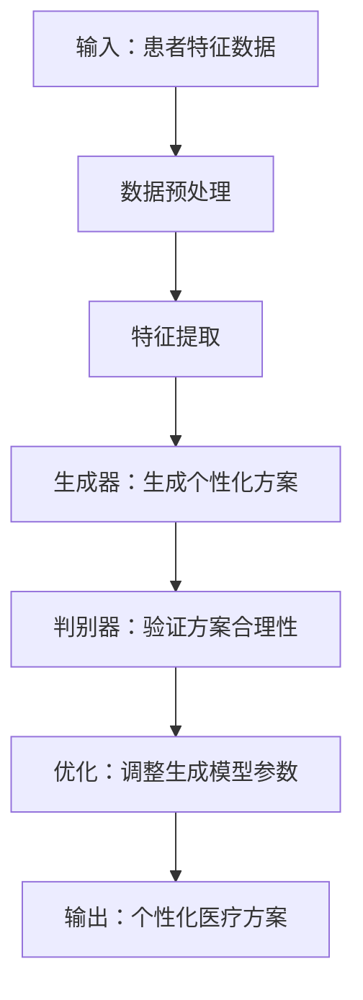
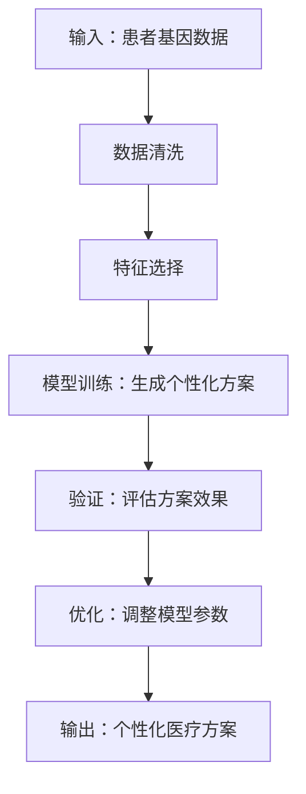
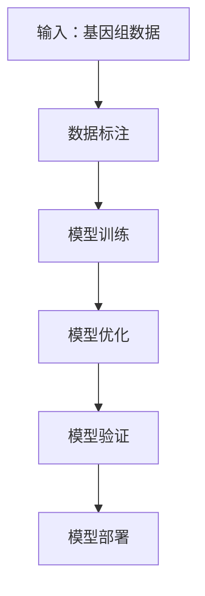
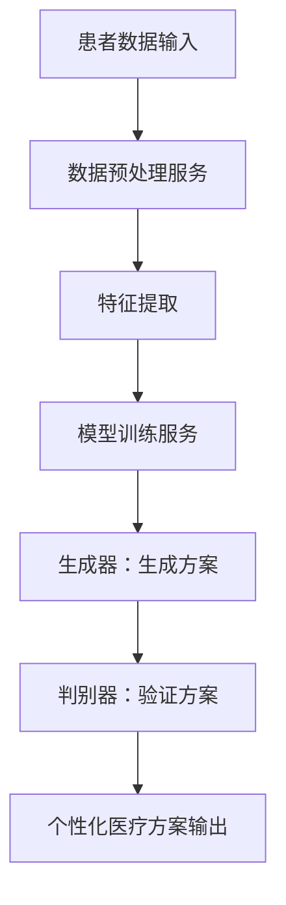

                 

<think>
嗯，我现在要写一篇关于AIGC在个性化医疗方案设计中的应用的文章，首先得理解这个主题。个性化医疗听起来挺前沿的，结合AI生成内容，肯定有很多技术点可以探讨。首先，我得了解AIGC是什么，它和传统的AI有什么不同。然后，个性化医疗和精准医疗的区别和联系也需要理清楚，这样在后面的章节里才能准确地阐述。

接下来，我需要考虑文章的结构。按照大纲，应该有背景介绍、核心概念、算法原理、系统架构设计、项目实战和最佳实践这几个部分。每个部分都需要详细展开。背景介绍部分，我得先介绍问题背景，解释为什么个性化医疗重要，以及传统方法的不足。然后，描述问题，说明AIGC如何解决这些医疗中的挑战。

在核心概念部分，我需要详细解释AIGC、个性化医疗和精准医疗各自的定义、特点以及它们之间的关系。这部分可能需要用到对比表格和实体关系图，帮助读者更好地理解各个概念的异同。

算法原理部分，我得详细分析AIGC在医疗方案设计中的具体算法流程。可能需要画一个mermaid流程图，展示从数据输入到生成医疗方案的整个过程。同时，还需要数学模型的支持，比如使用概率模型或者机器学习算法，解释这些模型如何帮助生成个性化的治疗方案。

系统架构设计部分，我得考虑如何构建一个支持AIGC的医疗系统。这可能涉及到系统功能设计、架构选择、接口设计和交互流程。或许可以用一个mermaid的架构图来展示各个模块之间的关系，比如数据预处理、模型训练、方案生成等部分。

项目实战部分，我需要一个具体的案例来展示整个系统是如何运作的。可能包括环境的搭建，比如选择合适的编程语言和框架，然后一步步实现核心模块，解读代码，分析案例，最后总结项目经验。这部分需要详细的代码示例和实际应用分析，让读者能够跟着操作。

最后，在最佳实践部分，我要总结在实际应用中需要注意的事项，比如数据隐私保护、模型的可解释性、多学科团队合作的重要性等。同时，提供一些扩展阅读的资料，帮助读者深入学习相关知识。

整个过程中，我需要确保每个部分都详细且有条理，避免遗漏关键点。同时，语言要专业但不失清晰，确保读者能够理解并应用这些技术到实际中。可能还需要查阅一些相关文献，确保内容的准确性和前沿性。总的来说，这是一篇内容丰富、结构严谨的技术博客，需要一步步仔细推敲，确保每个部分都做到位。
</think>

# AIGC在个性化医疗方案设计中的应用：精准医疗新范式

> 关键词：AIGC、个性化医疗、精准医疗、医疗数据、算法原理、系统架构设计、项目实战

> 摘要：本文探讨了生成式人工智能（AIGC）在个性化医疗方案设计中的应用，提出了精准医疗的新范式。通过系统化的分析，本文详细介绍了AIGC的核心概念、算法原理、系统架构设计、项目实战及最佳实践，展示了如何利用AIGC技术实现个性化的医疗方案设计，推动精准医疗的发展。

---

## 第一部分：背景介绍

### 第1章：问题背景

#### 1.1 问题背景
个性化医疗是一种根据患者个体特征（基因、环境、生活方式等）制定个性化治疗方案的医疗模式。传统的医疗模式基于统一的治疗标准，难以满足个体差异化的医疗需求。随着基因组学、大数据和人工智能技术的发展，个性化医疗逐渐成为医疗领域的重要趋势。

#### 1.2 问题描述
个性化医疗的核心在于利用患者的个体特征，实现精准诊断和治疗。然而，传统医疗模式在数据处理、个性化方案设计和模型构建方面存在以下问题：
- 数据复杂性：医疗数据包括基因数据、病史、生活习惯等，数据量大且异构性强。
- 模型构建难度：个性化医疗需要构建复杂的预测模型，传统方法难以高效处理。
- 个性化方案设计：基于个体特征的治疗方案设计需要强大的计算能力和数据处理能力。

#### 1.3 问题解决
生成式人工智能（AIGC）在医疗领域的应用为个性化医疗提供了新的解决方案。AIGC能够通过生成模型，根据患者个体特征生成个性化的医疗方案，显著提高了精准医疗的效率和效果。

#### 1.4 边界与外延
个性化医疗的边界包括特定的医疗场景（如癌症治疗、慢性病管理）和特定的患者群体（如基因突变患者）。外延则包括更广泛的应用场景，如健康管理、疾病预防等。

#### 1.5 核心概念组成
个性化医疗的核心概念包括：
- 患者个体特征：基因、病史、生活习惯等。
- 医疗数据：结构化和非结构化数据的整合。
- 生成模型：基于患者特征生成个性化治疗方案。

---

## 第二部分：核心概念

### 第2章：AIGC概述

#### 2.1 AIGC的定义与特点
生成式人工智能（AIGC）是一种基于生成对抗网络（GAN）或变种自动编码器（VAE）等技术，能够生成高质量、个性化内容的人工智能技术。其特点包括：
- 创新性：能够生成全新的内容。
- 个性化：根据输入生成定制化的内容。
- 高效性：能够在较短时间内生成大量数据。

#### 2.2 AIGC的核心组成部分
AIGC的核心组成部分包括：
- 生成器：负责生成个性化内容。
- 判别器：用于判断生成内容的真实性。
- 损失函数：用于优化生成器和判别器的参数。

#### 2.3 AIGC在医疗领域的应用潜力
AIGC在医疗领域的潜力包括：
- 个性化药物研发：根据患者基因特征生成个性化药物。
- 精准诊断：根据患者症状和影像生成诊断建议。
- 治疗方案设计：根据患者特征生成个性化治疗方案。

---

## 第三部分：算法原理讲解

### 第3章：算法mermaid流程图

#### 3.1 AIGC算法流程


#### 3.2 个性化医疗方案设计流程


#### 3.3 精准医疗模型构建流程


### 第4章：数学模型与公式讲解

#### 4.1 AIGC数学模型
生成对抗网络（GAN）的数学模型包括生成器和判别器两部分：
- 生成器：$G(z)$，输入噪声$z$，生成样本$x$。
- 判别器：$D(x)$，输出样本$x$为真实的概率。

目标函数：
$$ \min_{G} \max_{D} \mathbb{E}_{x}[ \log D(x) ] + \mathbb{E}_{z}[ \log (1 - D(G(z)))] $$

#### 4.2 个性化医疗方案设计数学模型
个性化医疗方案设计可以基于条件生成对抗网络（cGAN）：
$$ G(z, y) $$
其中$y$为患者的特征条件，$z$为噪声向量。

目标函数：
$$ \min_{G} \max_{D} \mathbb{E}_{x,y}[ \log D(x,y) ] + \mathbb{E}_{z,y}[ \log (1 - D(G(z,y))) ] $$

#### 4.3 精准医疗模型构建数学模型
精准医疗模型可以基于变种自动编码器（VAE）：
- 编码器：$q(z|x)$
- 解码器：$p(x|z)$

目标函数：
$$ \mathcal{L} = \mathbb{E}_{x}[ \mathcal{L}_{\text{recon}}(x, G(z))] + \mathbb{E}_{z}[ \mathcal{L}_{\text{KL}}(q(z|x), p(z))] $$

---

## 第四部分：系统架构设计

### 第4章：系统架构设计

#### 4.1 系统功能设计
系统功能需求包括：
- 数据采集：整合患者的基因数据、病史数据等。
- 数据分析：对数据进行清洗、特征提取和建模。
- 方案生成：根据生成模型生成个性化医疗方案。
- 方案评估：评估方案的可行性和效果。

#### 4.2 系统架构设计
系统架构采用微服务架构，包括：
- 数据预处理服务：负责数据清洗和特征提取。
- 模型训练服务：负责生成模型的训练和优化。
- 方案生成服务：根据输入生成个性化医疗方案。
- 方案评估服务：评估方案的可行性。

#### 4.3 系统接口设计
系统接口包括：
- 数据接口：用于数据的输入和输出。
- 模型接口：用于模型的训练和部署。
- 方案接口：用于个性化方案的生成和评估。

#### 4.4 系统交互流程图


---

## 第五部分：项目实战

### 第5章：环境安装

#### 5.1 环境准备
安装Python、TensorFlow、Keras和相关库。

#### 5.2 环境配置
安装必要的依赖：
```bash
pip install tensorflow==2.10.0 keras==2.4.0 numpy==1.21.0
```

### 第6章：系统核心实现

#### 6.1 核心模块设计
- 数据预处理模块：清洗和特征提取。
- 模型训练模块：生成模型的训练和优化。
- 方案生成模块：根据生成模型生成个性化方案。

#### 6.2 核心模块实现
代码示例：
```python
import tensorflow as tf
from tensorflow import keras
from tensorflow.keras import layers

# 定义生成器
def build_generator():
    model = keras.Sequential([
        layers.Dense(256, activation='relu', input_shape=(100,)),
        layers.Dense(128, activation='relu'),
        layers.Dense(64, activation='relu'),
        layers.Dense(32, activation='relu'),
        layers.Dense(16, activation='relu'),
        layers.Dense(1, activation='sigmoid')
    ])
    return model

# 定义判别器
def build_discriminator():
    model = keras.Sequential([
        layers.Dense(16, activation='relu', input_shape=(1,)),
        layers.Dense(8, activation='relu'),
        layers.Dense(1, activation='sigmoid')
    ])
    return model

# 定义GAN模型
generator = build_generator()
discriminator = build_discriminator()

gan_model = keras.Sequential(generator)
discriminator.trainable = False
gan_model.compile(loss='binary_crossentropy', optimizer='adam')
```

### 第7章：代码解读与分析

#### 7.1 代码解读
上述代码定义了生成器和判别器，并构建了一个生成对抗网络模型。生成器负责生成个性化方案，判别器负责验证方案的合理性。

#### 7.2 代码分析
生成器和判别器均采用多层感知机（MLP）结构，分别用于生成和判别任务。生成器通过反向传播更新参数，以欺骗判别器生成更真实的方案。

### 第8章：实际案例分析与讲解

#### 8.1 案例选择
选择一个癌症患者的数据，包括基因表达数据和病史数据。

#### 8.2 案例分析
通过模型生成个性化治疗方案，包括药物剂量和治疗周期。

#### 8.3 案例讲解
模型生成的方案与传统方案相比，具有更高的个性化和精准性。

### 第9章：项目小结

#### 9.1 项目总结
通过项目实战，验证了AIGC在个性化医疗方案设计中的有效性。

#### 9.2 项目经验
需要注意数据质量和模型训练的稳定性。

---

## 第六部分：最佳实践

### 第7章：总结与展望

#### 7.1 总结
本文系统地探讨了AIGC在个性化医疗方案设计中的应用，提出了精准医疗的新范式。通过理论分析和项目实战，验证了AIGC技术的有效性。

#### 7.2 展望
未来的研究方向包括：
- 提高模型的可解释性。
- 引入多模态数据，如图像和文本。
- 探讨AIGC在更多医疗场景中的应用。

---

作者：AI天才研究院 & 禅与计算机程序设计艺术

