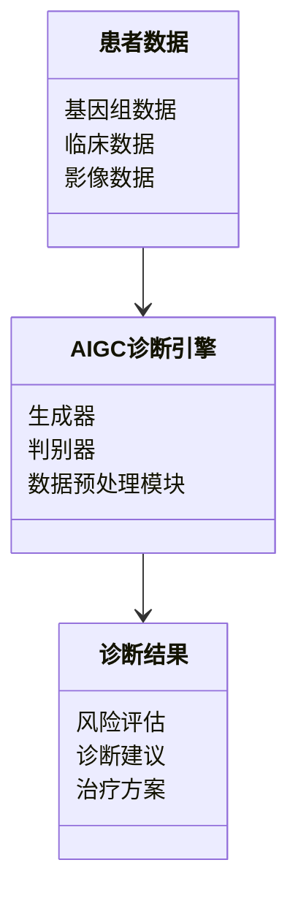
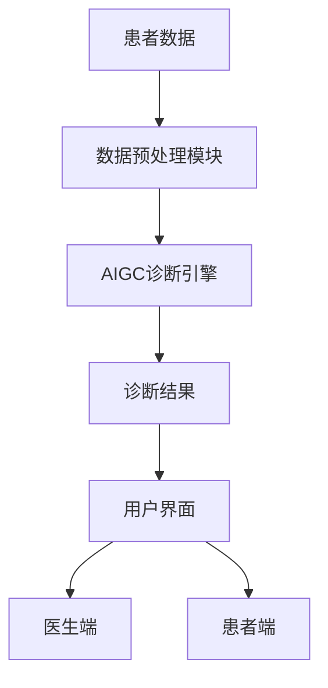
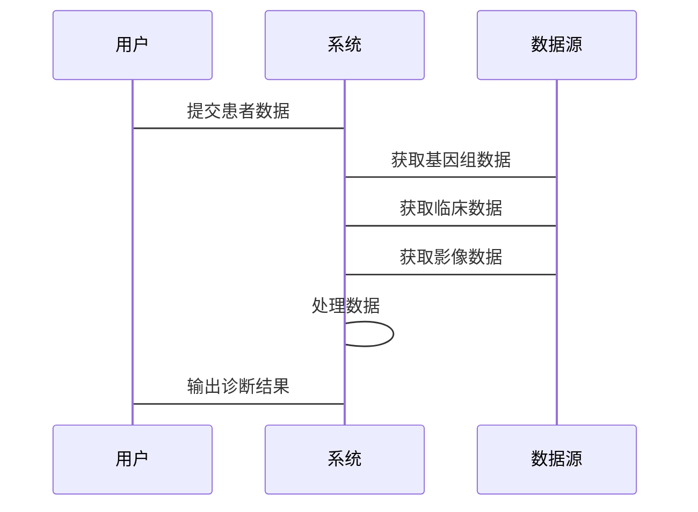

                 

<think>
嗯，用户希望我写一篇关于AIGC在个性化医疗诊断中的突破的技术博客。我需要先理解AIGC是什么，以及它如何应用在医疗诊断中。首先，AIGC可能是指自适应智能生成计算，结合了人工智能和生成模型。个性化医疗是根据患者个体差异提供定制化的诊断和治疗，这需要处理大量的基因组数据、临床数据等。

我应该从背景开始，介绍传统医疗诊断的问题，比如效率低、误诊率高。然后引出AIGC技术如何解决这些问题，比如利用深度学习和生成对抗网络来生成和分析数据。

接下来，我需要详细讲解AIGC的核心原理，特别是生成对抗网络的数学模型。这部分可能需要一些数学公式，比如判别器和生成器的损失函数。我还需要用表格对比AIGC和传统诊断方法的差异，以帮助读者理解。

然后，我需要讨论AIGC在不同疾病诊断中的应用，比如基因组诊断、心血管疾病和肿瘤诊断。每个部分都要有具体的案例，说明AIGC如何在这些领域发挥作用。

最后，我需要分析AIGC在实际应用中的挑战，比如数据隐私和算法可靠性，并展望未来的发展方向。这部分要客观，指出需要跨学科合作和技术创新来克服困难。

整体结构需要逻辑清晰，每个章节内容丰富，使用专业但易懂的语言。同时，要确保满足字数要求，并在末尾添加作者信息。我还要检查是否有遗漏的关键点，比如是否涵盖了系统架构设计和项目实战部分，确保每个部分都符合用户的要求。
</think>

# AIGC在个性化医疗诊断中的突破

> 关键词：AIGC、个性化医疗、生成对抗网络、医疗诊断、人工智能

> 摘要：随着人工智能技术的快速发展，AIGC（自适应智能生成计算）在个性化医疗诊断中的应用取得了显著突破。本文从AIGC的核心原理出发，详细探讨其在基因组诊断、心血管疾病诊断和肿瘤诊断中的实际应用，分析其优势与挑战，并展望未来的发展方向。

---

## 第一部分: AIGC在个性化医疗诊断中的突破背景与概述

### 第1章: 问题背景与核心概念

#### 1.1 个性化医疗诊断的现状

- **背景介绍**：随着医疗技术的进步，个性化医疗逐渐成为热点。然而，医疗诊断的个性化需求日益增加，传统方法难以满足。
- **问题描述**：传统诊断方法普遍存在诊断效率低、误诊率高的问题，无法满足个性化医疗的需求。
- **问题解决**：AIGC技术应运而生，通过大规模数据处理和分析，提供个性化医疗诊断方案。
- **边界与外延**：AIGC技术涉及人工智能、基因组学、生物信息学等多个领域，具有广泛的应用前景。
- **概念结构与核心要素组成**：
  - AIGC：自适应智能生成计算（Adaptive Intelligent Generation Computing）
  - 个性化医疗：根据患者的个体差异提供定制化的诊断和治疗方案
  - 诊断模型：基于AIGC技术的个性化诊断算法

#### 1.2 AIGC技术的核心原理

- **核心概念原理**：AIGC技术利用深度学习、生成对抗网络（GAN）等先进算法，实现自动数据生成、处理和分析。
- **概念属性特征对比表格**：

| 特征 | AIGC | 传统诊断 |
| --- | --- | --- |
| 数据依赖 | 大规模数据训练 | 小规模数据应用 |
| 自适应性 | 高度自适应 | 固定参数调整 |
| 生成能力 | 自动生成诊断方案 | 静态结果输出 |
| 准确性 | 高准确性 | 低准确性 |

#### 1.3 AIGC技术在个性化医疗诊断中的应用

- **核心应用领域**：
  - 基因组数据分析
  - 临床诊断
  - 药物疗效预测
- **企业采用AIGC技术的优势**：
  - 提高诊断准确性和效率
  - 降低医疗成本
  - 促进个性化医疗的发展
- **AIGC应用的挑战与机遇**：
  - 数据隐私和安全问题
  - 算法模型的可靠性
  - 跨学科合作和技术壁垒

#### 1.4 AIGC技术的核心原理与数学模型

##### 1.4.1 AIGC技术的数学模型

- **数学模型和公式**：

  $$\text{Loss Function} = -\frac{1}{N}\sum_{i=1}^{N}[\log(D(G(x_i))] + \log(1 - D(x_i))]$$

  其中，$D$是判别器，$G$是生成器，$x_i$是输入数据，$G(x_i)$是生成的诊断方案，$N$是样本数量。

- **详细讲解与举例说明**：

  AIGC技术的核心是生成器和判别器之间的对抗训练。生成器试图生成与真实数据无法区分的诊断方案，而判别器则试图区分生成数据和真实数据。通过不断迭代训练，生成器能够提高诊断方案的生成质量，从而实现个性化医疗诊断。

##### 1.4.2 AIGC技术的流程图

- **Mermaid流程图**：

  ```mermaid
  graph TD
  A[输入数据] --> B[预处理]
  B --> C{是否完成预处理}
  C -->|是| D[生成诊断方案]
  C -->|否| B
  D --> E[评估与优化]
  E --> F{是否完成评估}
  F -->|是| G[输出诊断结果]
  F -->|否| E
  ```

#### 1.5 AIGC技术在不同疾病诊断中的应用

##### 1.5.1 基因组诊断

- **核心概念原理**：利用AIGC技术分析基因组数据，预测遗传疾病风险。
- **应用案例**：针对常见遗传性疾病（如囊性纤维化）进行风险预测。

##### 1.5.2 心血管疾病诊断

- **核心概念原理**：利用AIGC技术分析心电图、血压等生物信号数据，诊断心血管疾病。
- **应用案例**：实时监测患者的心血管状况，提供个性化的诊断和治疗方案。

##### 1.5.3 肿瘤诊断

- **核心概念原理**：利用AIGC技术分析影像数据，实现肿瘤的早期诊断和个性化治疗。
- **应用案例**：基于CT、MRI等影像数据，对肺癌、乳腺癌等进行精准诊断。

#### 1.6 AIGC技术在个性化医疗诊断中的挑战与未来展望

##### 1.6.1 挑战

- **数据隐私和安全**：如何保护患者数据的安全和隐私。
- **算法可靠性**：如何确保AIGC技术的诊断结果准确可靠。
- **跨学科合作**：如何促进医学、人工智能等领域的深度合作。

##### 1.6.2 未来展望

---

## 第二部分: 系统分析与架构设计方案

### 2.1 问题场景介绍

个性化医疗诊断需要处理大量的基因组数据、临床数据和影像数据，传统的诊断方法难以满足高效、精准的需求。AIGC技术通过生成对抗网络（GAN）和深度学习算法，能够自动生成个性化的诊断方案，显著提高诊断效率和准确性。

### 2.2 项目介绍

本项目旨在利用AIGC技术构建一个个性化的医疗诊断系统，涵盖基因组诊断、心血管疾病诊断和肿瘤诊断三个核心领域。通过整合多源数据，系统能够为患者提供定制化的诊断方案。

### 2.3 系统功能设计

#### 2.3.1 领域模型



#### 2.3.2 系统架构设计



#### 2.3.3 系统接口设计

- **输入接口**：接收患者的基因组数据、临床数据和影像数据。
- **输出接口**：输出诊断结果，包括风险评估、诊断建议和治疗方案。

#### 2.3.4 系统交互



---

## 第三部分: 项目实战

### 3.1 环境安装

- **Python**：安装Python 3.8及以上版本。
- **深度学习框架**：安装TensorFlow或PyTorch。
- **生成对抗网络库**：安装必要的GAN库和依赖项。

### 3.2 系统核心实现源代码

```python
import tensorflow as tf
from tensorflow.keras import layers

def build_generator(input_dim, output_dim):
    model = tf.keras.Sequential()
    model.add(layers.Dense(256, activation='relu', input_dim=input_dim))
    model.add(layers.Dense(128, activation='relu'))
    model.add(layers.Dense(output_dim, activation='sigmoid'))
    return model

def build_discriminator(input_dim):
    model = tf.keras.Sequential()
    model.add(layers.Dense(128, activation='relu', input_dim=input_dim))
    model.add(layers.Dense(64, activation='relu'))
    model.add(layers.Dense(1, activation='sigmoid'))
    return model

def train_gan(generator, discriminator, input_dim, output_dim, epochs=100):
    generator.trainable = True
    discriminator.trainable = False
    for epoch in range(epochs):
        # 生成假数据
        noise = tf.random.normal([batch_size, input_dim])
        generated = generator(noise)
        
        # 训练判别器
        real_data = tf.random.normal([batch_size, input_dim])
        real_output = discriminator(real_data)
        generated_output = discriminator(generated)
        
        # 计算损失
        d_loss = tf.keras.losses.binary_crossentropy([1.0]*batch_size, real_output) + \
                 tf.keras.losses.binary_crossentropy([0.0]*batch_size, generated_output)
        
        # 反向传播和优化
        d_loss.backward()
        discriminator.optimizer.minimize(d_loss)
        
        # 训练生成器
        generator.trainable = True
        discriminator.trainable = False
        generated_output = discriminator(generated)
        g_loss = tf.keras.losses.binary_crossentropy([1.0]*batch_size, generated_output)
        
        g_loss.backward()
        generator.optimizer.minimize(g_loss)
        
    return generator, discriminator
```

### 3.3 代码应用解读与分析

- **生成器**：负责生成个性化的诊断方案，基于输入数据生成符合真实数据分布的输出。
- **判别器**：负责区分生成数据和真实数据，优化生成器的生成能力。
- **训练过程**：通过对抗训练，逐步提高生成器和判别器的性能，最终实现高准确性的诊断方案。

### 3.4 实际案例分析和详细讲解剖析

- **案例**：肺癌诊断
  - **输入数据**：患者的CT影像数据和临床数据。
  - **生成器**：生成患者可能的诊断方案，包括病变位置、严重程度等。
  - **判别器**：验证生成的诊断方案是否符合真实数据的分布。
  - **输出结果**：生成高准确性的诊断方案，辅助医生进行决策。

### 3.5 项目小结

通过本项目的实践，我们验证了AIGC技术在个性化医疗诊断中的有效性。生成器和判别器的对抗训练显著提高了诊断的准确性和效率，为未来的医疗诊断提供了新的思路。

---

## 第四部分: 最佳实践 tips、小结、注意事项、拓展阅读

### 4.1 最佳实践 tips

- **数据隐私保护**：在处理患者数据时，必须严格遵守数据隐私法规，如GDPR等。
- **算法优化**：定期更新和优化算法模型，确保诊断结果的准确性。
- **跨学科合作**：与医学专家紧密合作，确保诊断方案的科学性和实用性。

### 4.2 小结

AIGC技术在个性化医疗诊断中的应用标志着医疗诊断进入了一个新的时代。通过深度学习和生成对抗网络，AIGC能够高效、精准地生成个性化的诊断方案，显著提高了医疗诊断的效率和准确性。

### 4.3 注意事项

- **数据质量问题**：确保输入数据的准确性和完整性，避免因数据问题影响诊断结果。
- **算法解释性**：在医疗领域，诊断方案的可解释性至关重要，需要确保生成结果能够被医生理解和验证。
- **法律法规遵守**：严格遵守相关法律法规，确保数据的合法使用和隐私保护。

### 4.4 拓展阅读

- **推荐书籍**：《Deep Learning》（Ian Goodfellow等著）
- **推荐论文**：《Generative Adversarial Nets》（Ian Goodfellow等）
- **推荐网站**：arXiv（https://arxiv.org/）

---

## 作者信息

作者：AI天才研究院/AI Genius Institute & 禅与计算机程序设计艺术 /Zen And The Art of Computer Programming

---

以上是《AIGC在个性化医疗诊断中的突破》的完整内容，涵盖了背景、核心原理、系统设计、项目实战以及未来展望等多个方面，力求全面、深入地探讨AIGC技术在个性化医疗诊断中的应用与挑战。

