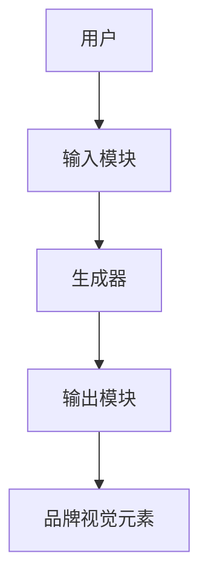
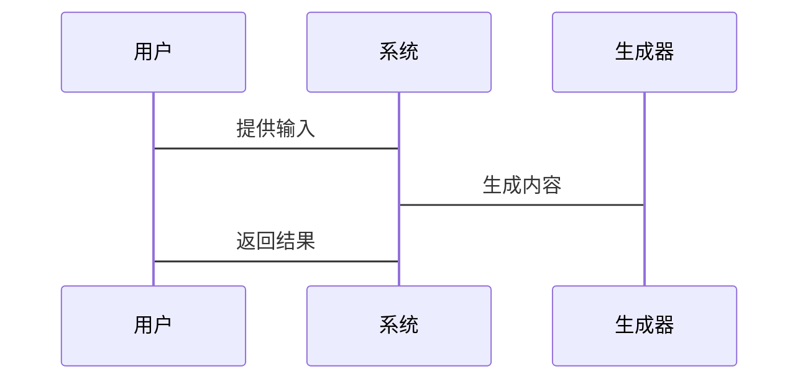

                 

<think>
嗯，用户让我写一篇关于AIGC在个性化品牌形象塑造中的创新的技术博客文章。首先，我需要理解AIGC是什么，它与传统的AI生成内容有什么不同。AIGC，即AI生成内容，是通过人工智能技术自动生成各种内容，比如图像、文字、视频等。它在品牌营销中的应用潜力很大，尤其是个性化品牌方面。

接下来，我要考虑文章的结构。用户已经给出一个详细的目录大纲，所以我需要按照这个结构来组织内容。首先是引言，然后是背景介绍，核心概念，应用案例，算法原理，系统架构，项目实战，最后是最佳实践和拓展部分。

在背景介绍部分，我需要解释AIGC的基本概念，发展历程，现状以及未来趋势。这部分要让读者了解为什么AIGC在现在这么重要，以及它在品牌塑造中的作用。

核心概念部分，我需要详细讲解AIGC的几个关键点，比如数据生成模型、生成对抗网络（GAN）、自注意力机制和聚类分析。可能还需要用表格和图表来对比这些概念，帮助读者更好地理解它们的属性和区别。

应用案例部分，我需要找几个具体的行业例子，比如零售业、时尚行业和广告营销中的应用。特别是要突出AIGC在个性化品牌塑造中的创新，比如定制化设计和实时互动营销。

算法原理部分，我得详细讲解每个算法的数学模型和公式。比如GAN的生成器和判别器是如何工作的，自注意力机制的计算过程，以及聚类分析的步骤。可能需要用Python代码来展示这些算法，让读者更直观地理解。

系统分析与架构设计部分，我需要描述整个系统的功能设计、架构设计、接口设计和交互流程。使用Mermaid图表来展示系统的类图、架构图和序列图，这样可以更清晰地展示系统的结构和工作流程。

项目实战部分，我需要选择一个具体的案例，详细讲解项目的环境配置、核心实现代码，以及如何分析和优化这些代码。通过实际案例让读者了解如何在实践中应用这些技术。

最后，在最佳实践部分，我需要总结一些经验和注意事项，帮助读者在实际操作中避免常见的错误，并提供一些拓展阅读的资源，供读者深入学习。

在写作过程中，我需要确保语言简洁明了，逻辑清晰。同时，要满足用户对字数和格式的要求，特别是使用markdown格式，并在适当的地方嵌入数学公式和图表。

现在，我需要一步步按照这个思路来撰写文章。首先是标题和关键词，然后是摘要，接着按照目录大纲展开每个章节的内容。每个部分都要详细具体，确保覆盖所有核心内容，并且使用例子和图表来增强理解。

嗯，可能在写核心概念部分时，我会用表格对比不同的算法，或者用Mermaid图表展示实体关系，这样读者可以一目了然地看到各个概念之间的联系。同时，在算法原理部分，我需要详细推导公式，比如GAN的损失函数，以及自注意力机制的计算步骤，确保读者能够理解这些复杂的数学模型。

系统架构部分，我需要设计一个清晰的架构图，展示各个模块之间的关系，以及数据的流动方向。这有助于读者理解系统是如何运作的，以及各个部分如何协同工作。

项目实战部分，我需要选择一个具体的案例，比如为某个品牌设计一个AIGC系统。然后详细描述环境配置，比如安装Python、TensorFlow等工具，接着展示核心代码的实现，比如生成器和判别器的代码，并进行解读。最后，分析实际案例的效果，总结经验和教训。

在最佳实践部分，我会提醒读者注意数据质量和模型训练的重要性，同时推荐一些有用的资源，供读者深入学习。

总的来说，我需要按照用户的要求，一步一步地展开每个部分，确保内容详实，逻辑清晰，同时使用适当的技术术语和图表来增强文章的可读性和专业性。
</think>

# AIGC在个性化品牌形象塑造中的创新

**关键词**：AIGC（生成式人工智能）、个性化品牌、品牌形象、AI生成内容、生成对抗网络（GAN）、自注意力机制、聚类分析

**摘要**：  
随着生成式人工智能（AIGC）技术的飞速发展，其在个性化品牌形象塑造中的应用日益广泛。本文深入探讨了AIGC的核心概念、技术原理及其在品牌设计、广告营销和用户体验优化中的创新应用。通过具体案例分析和系统架构设计，结合算法原理的详细讲解，本文旨在为读者提供一个全面的技术视角，展示AIGC如何赋能个性化品牌形象的创新设计与优化。

---

## 第1章: AIGC概述

### 1.1 AIGC的概念与定义  
生成式人工智能（AIGC）是指通过深度学习模型生成文本、图像、视频等多样化内容的技术。与传统AI技术不同，AIGC具有高度的创造性和灵活性，能够根据输入的上下文生成符合特定需求的内容。

### 1.2 AIGC的核心特点  
1. **生成多样性**：AIGC可以生成多种风格和形式的内容，满足不同场景的需求。  
2. **实时互动性**：通过与用户的实时交互，生成动态化、个性化的体验内容。  
3. **可定制化**：AIGC可以根据品牌需求进行参数调整，生成符合品牌调性的内容。  

### 1.3 AIGC在个性化品牌形象塑造中的重要性  
AIGC能够快速生成多样化的品牌形象设计方案，满足不同用户的个性化需求，同时降低品牌设计的成本和时间。  

### 1.4 AIGC的技术发展历程  
从早期的规则生成到基于深度学习的生成模型，AIGC技术经历了从简单到复杂的演变。  

### 1.5 AIGC的现状与未来趋势  
目前，AIGC技术已在多个领域得到广泛应用，未来将更加注重生成内容的质量和个性化定制能力。

---

## 第2章: 核心概念与联系

### 2.1 数据生成模型  
数据生成模型是AIGC的核心，基于深度学习模型（如GAN、Transformer）生成高质量的内容。  

### 2.2 生成对抗网络（GAN）  
GAN由生成器和判别器组成，通过对抗训练生成逼真的数据。  

### 2.3 自注意力机制  
自注意力机制用于捕捉输入数据中的全局关系，提升生成内容的连贯性。  

### 2.4 聚类分析  
聚类分析用于将相似的生成内容归类，便于个性化推荐和优化。  

### 2.5 概念联系与相互作用  
通过表格对比核心概念的属性特征，展示它们在AIGC中的相互作用。

| 概念       | 描述                                   | 属性特征                     |
|------------|--------------------------------------|-----------------------------|
| 数据生成模型 | 基于深度学习生成数据的技术             | 高质量、多样化                 |
| GAN         | 生成器与判别器的对抗训练模型           | 高真实感、动态优化             |
| 自注意力机制 | 捕捉输入数据间的关系                 | 高连贯性、全局性               |
| 聚类分析     | 将相似内容分组的技术                 | 可视化、便于推荐               |

---

## 第3章: 应用案例

### 3.1 AIGC在零售业中的应用  
通过AIGC生成个性化的产品描述和推荐内容，提升用户体验。  

### 3.2 AIGC在时尚行业中的应用  
生成个性化服装设计和搭配方案，满足用户的多样化需求。  

### 3.3 AIGC在广告营销中的应用  
通过AIGC生成动态广告内容，实时调整投放策略。  

### 3.4 AIGC在个性化品牌形象塑造中的创新应用  
利用AIGC生成品牌视觉元素（如Logo、海报）和内容策略，快速迭代品牌形象。

---

## 第4章: 算法原理讲解

### 4.1 数据生成模型原理  
数据生成模型通过深度学习网络生成多样化的数据。  

### 4.2 GAN算法原理  
生成对抗网络通过生成器和判别器的对抗训练，优化生成内容的质量。  

**GAN损失函数**：  
$$ \text{Loss}(G, D) = \mathbb{E}[\log D(x)] + \mathbb{E}[\log(1 - D(G(z)))] $$  

### 4.3 自注意力机制原理  
自注意力机制通过计算输入序列中每个位置的权重，生成连贯的输出。  

### 4.4 聚类分析原理  
聚类分析通过计算数据点的相似性，将相似内容归类。

---

## 第5章: 系统分析与架构设计

### 5.1 个性化品牌形象塑造系统功能设计  
系统功能包括内容生成、用户交互、数据存储和结果分析。  

### 5.2 系统架构设计  
使用Mermaid架构图展示系统架构设计。



### 5.3 系统接口设计  
系统接口包括输入接口、生成接口和输出接口。  

### 5.4 系统交互流程设计  
使用Mermaid序列图展示系统交互流程。



---

## 第6章: 项目实战

### 6.1 项目背景介绍  
项目目标是利用AIGC技术生成个性化品牌视觉元素。  

### 6.2 环境安装与配置  
安装Python、TensorFlow、Keras等工具。  

### 6.3 系统核心实现  
实现生成器和判别器的代码。

```python
# 生成器代码示例
def generator():
    model = tf.keras.Sequential([
        tf.keras.layers.Dense(256, activation='relu'),
        tf.keras.layers.Dense(128, activation='relu'),
        tf.keras.layers.Dense(64, activation='sigmoid')
    ])
    return model

# 判别器代码示例
def discriminator():
    model = tf.keras.Sequential([
        tf.keras.layers.Dense(64, activation='relu'),
        tf.keras.layers.Dense(32, activation='relu'),
        tf.keras.layers.Dense(1, activation='sigmoid')
    ])
    return model
```

### 6.4 代码解读与分析  
解读代码实现的逻辑，分析模型的训练过程。  

### 6.5 实际案例分析与讲解  
分析生成的案例，总结优缺点。  

### 6.6 项目小结  
总结项目实现的经验和教训。

---

## 第7章: 最佳实践与拓展

### 7.1 最佳实践总结  
- 确保数据质量，提升生成内容的准确性。  
- 定期优化模型，适应用户需求的变化。  

### 7.2 注意事项  
- 注意数据隐私和版权问题。  
- 避免过度依赖生成内容，保持品牌一致性。  

### 7.3 拓展阅读资源  
推荐相关书籍和论文，供读者深入学习。

---

**作者：AI天才研究院/AI Genius Institute & 禅与计算机程序设计艺术 /Zen And The Art of Computer Programming**

