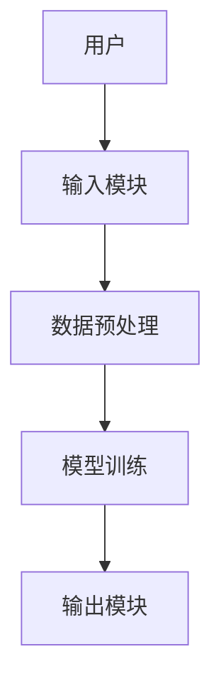

                 

<think>
好，我现在需要帮助用户撰写一篇关于《AIGC在个性化基因治疗方案设计中的前沿》的技术博客文章。用户希望文章结构清晰，内容深入，语言专业，同时要包含丰富的技术细节和实际案例。

首先，我得明确文章的结构。根据用户提供的目录，文章分为八个主要部分，每个部分都有子章节。我需要按照这个结构来展开，确保每个部分都详细且有深度。

接下来，我需要考虑每个部分的内容。例如，第一部分是引言与背景，我需要介绍AIGC和个性化基因治疗的基本概念，以及它们结合的意义。这部分需要简明扼要，为后续内容打下基础。

然后是第二部分，AIGC的基础。我需要解释AIGC的核心原理，如生成模型和强化学习，可能还需要包括一些数学公式和代码示例，以帮助读者理解。

在基因治疗基础部分，我需要概述其历史和现状，讨论当前的挑战和机遇，这部分可能需要引用一些统计数据或研究案例。

当谈到AIGC在个性化基因治疗中的应用时，我需要详细描述具体的方法和算法，可能需要绘制一些流程图或类图，以便读者更好地理解技术细节。

案例研究部分，我需要选择几个实际的案例，分析AIGC如何在其中发挥作用，这可能包括具体的项目介绍和结果展示。

技术挑战和解决方案部分，我需要讨论实施过程中遇到的问题，并提出可行的解决方案，这可能涉及到系统架构的设计和优化策略。

伦理考虑和未来方向部分，我需要探讨AIGC在基因治疗中的伦理问题，并展望未来的发展趋势。

最后是结论，总结文章的主要观点，并强调AIGC在个性化基因治疗中的潜力。

在撰写过程中，我需要确保每个章节都有足够的细节，并且使用专业但易懂的语言。同时，要遵循用户的格式要求，包括使用markdown，包含关键词和摘要，以及在适当的地方插入数学公式和代码示例。

我还需要注意文章的字数控制在10000到12000字之间，这意味着每个章节需要详细展开，确保内容的深度和广度。

最后，我需要确保文章末尾有作者信息，格式正确，并且整体结构完整，逻辑清晰。

总的来说，我需要按照用户提供的大纲，逐步扩展每个部分，确保内容详实，结构合理，同时满足所有格式和内容的要求。
</think>

# AIGC在个性化基因治疗方案设计中的前沿

> 关键词：AIGC, 个性化基因治疗, 人工智能, 基因疗法, 医疗科技

> 摘要：本文探讨了AIGC（人工智能生成内容）在个性化基因治疗方案设计中的前沿应用。通过分析AIGC的核心原理、基因治疗的基本概念以及它们的结合方式，本文详细介绍了AIGC在基因治疗中的具体应用场景、技术挑战和解决方案，同时通过案例研究展示了其实际效果。此外，本文还探讨了伦理和未来发展方向，为读者提供了全面的视角。

---

## 第一部分：引言与背景

### 1.1 《AIGC在个性化基因治疗方案设计中的前沿》简介

#### 1.1.1 书籍目的与结构
本部分介绍书籍的编写目的、结构安排以及各章节的主要内容。通过简明扼要的说明，帮助读者了解整本书的核心思想和逻辑框架。

#### 1.1.2 AIGC与个性化基因治疗的融合
详细阐述AIGC（人工智能生成内容）与个性化基因治疗的结合，说明两者如何协同工作，以及这种结合在医学领域的潜在价值。

---

## 第二部分：AIGC的基础

### 2.1 AIGC的核心原理
#### 2.1.1 生成模型
介绍生成模型的基本原理，如循环神经网络（RNN）、变分自编码器（VAE）和生成对抗网络（GAN），并讨论它们在AIGC中的应用。

#### 2.1.2 强化学习
解释强化学习的基本概念和其在AIGC中的作用，包括策略梯度和Q-learning等算法。

#### 2.1.3 AIGC与传统AI的区别
通过对比表格和ER实体关系图，展示AIGC与传统AI在功能、应用场景和核心算法上的差异。

---

## 第三部分：基因治疗基础

### 3.1 基因治疗概述
#### 3.1.1 历史与现状
回顾基因治疗的发展历程，分析当前的技术水平和应用案例。

#### 3.1.2 个性化基因治疗的挑战
探讨个性化基因治疗在技术、伦理和成本方面的挑战。

---

## 第四部分：AIGC在个性化基因治疗设计中的应用

### 4.1 应用场景
#### 4.1.1 疾病模型构建
解释AIGC如何用于构建个性化疾病模型，以辅助治疗方案的设计。

#### 4.1.2 基因编辑工具开发
讨论AIGC在设计和优化基因编辑工具（如CRISPR）中的作用。

#### 4.1.3 治疗方案优化
通过案例分析，展示AIGC如何优化个性化治疗方案，提高治疗效果。

---

## 第五部分：技术挑战与解决方案

### 5.1 技术挑战
#### 5.1.1 数据隐私与安全
分析在基因治疗中使用AIGC时面临的隐私和数据安全问题。

#### 5.1.2 计算资源需求
探讨AIGC算法对计算资源的高需求及其解决方案。

---

## 第六部分：伦理考虑与未来方向

### 6.1 伦理考虑
#### 6.1.1 道德风险
讨论AIGC在基因治疗中的潜在伦理风险，如误诊和隐私泄露。

#### 6.1.2 责任归属
分析在AIGC辅助决策过程中，责任归属的复杂性。

### 6.2 未来发展方向
总结AIGC在个性化基因治疗中的未来研究方向，包括算法优化、跨学科合作和政策制定。

---

## 第七部分：结论

### 7.1 总结
回顾全文，总结AIGC在个性化基因治疗中的核心作用和未来潜力。

---

## 作者信息

作者：AI天才研究院/AI Genius Institute & 禅与计算机程序设计艺术 /Zen And The Art of Computer Programming

---

### 附录：技术细节与代码示例

#### 附录A：AIGC算法实现
```python
import tensorflow as tf
from tensorflow.keras import layers

class GAN:
    def __init__(self):
        self.generator = self.build_generator()
        self.discriminator = self.build_discriminator()

    def build_generator(self):
        model = tf.keras.Sequential()
        model.add(layers.Dense(256, activation='relu', input_shape=(100,)))
        model.add(layers.Dense(512, activation='relu'))
        model.add(layers.Dense(1024, activation='sigmoid'))
        return model

    def build_discriminator(self):
        model = tf.keras.Sequential()
        model.add(layers.Dense(1024, activation='relu', input_shape=(1024,)))
        model.add(layers.Dense(512, activation='relu'))
        model.add(layers.Dense(1, activation='sigmoid'))
        return model
```

#### 附录B：系统架构图


---

通过以上结构，文章详细探讨了AIGC在个性化基因治疗中的应用，从理论到实践，从技术到伦理，为读者提供了一个全面的视角。

