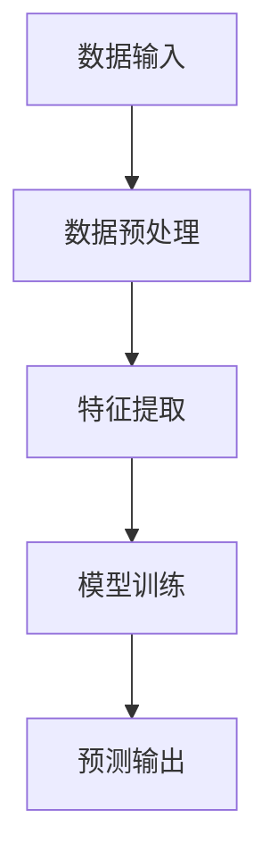
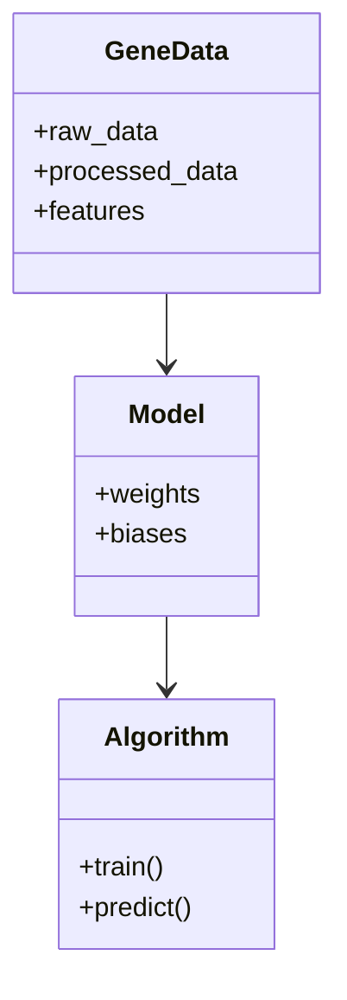
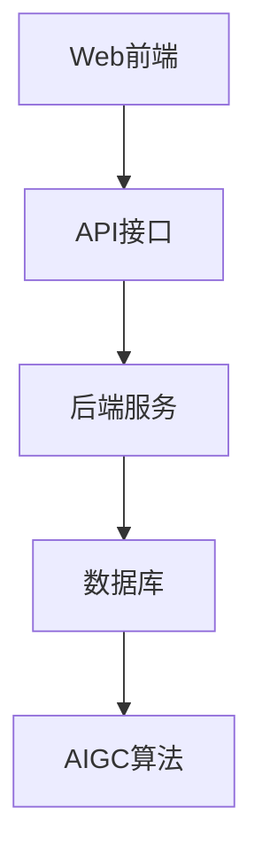
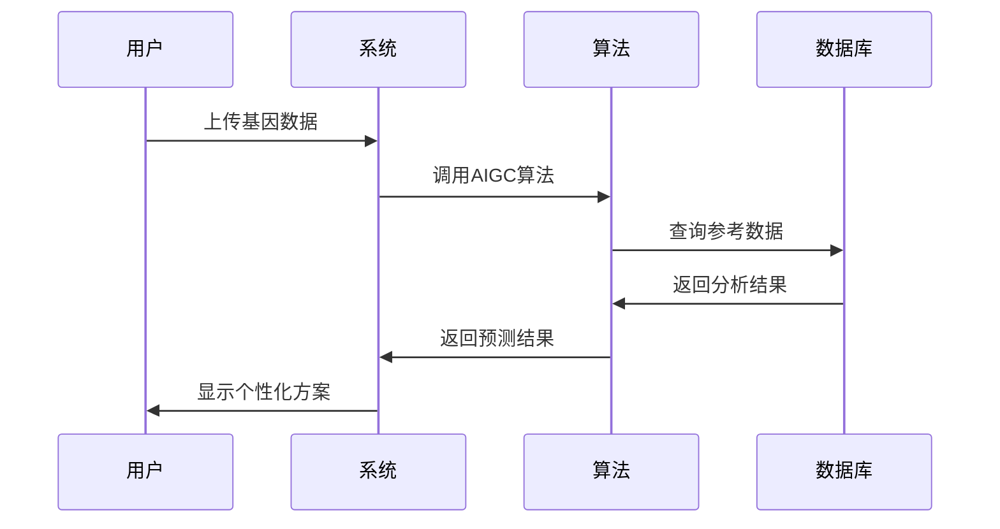

                 

<think>
嗯，用户希望我以一个技术专家的身份，撰写一篇关于AIGC在个性化基因治疗中的应用的技术博客。首先，我需要理解用户的需求。他们可能是一位研究人员或医疗领域的专业人士，想要了解AIGC如何改变基因治疗的方案设计。

用户给的标题已经很明确，是《AIGC在个性化基因治疗方案设计中的应用：精准医学新范式》。关键词包括AIGC、个性化基因治疗、精准医学、人工智能、基因数据、治疗方案设计、系统架构。摘要部分要简明扼要，概括文章的核心内容。

接下来是大纲，分为八个部分，从引言到项目实战，再到最佳实践。我需要确保每个部分都涵盖必要的内容，比如背景介绍、核心概念、算法原理、系统架构、项目实战等。每个小节要详细具体，使用Mermaid图和代码示例来增强理解。

我还需要注意格式要求，使用markdown，数学公式用latex，独立段落用$$，内部用$。作者信息也要放在末尾，显示专业性和权威性。

用户可能希望文章不仅有理论，还要有实际案例，展示AIGC在基因治疗中的具体应用。这可能涉及到数据处理、算法选择、系统设计等方面。我需要确保内容逻辑清晰，结构紧凑，让读者能够一步步理解AIGC的应用过程。

最后，用户可能希望文章具备一定的深度，不仅仅是表面的介绍，而是深入探讨AIGC的优势、挑战以及未来的发展方向。这有助于读者全面了解该技术在精准医学中的价值。

总的来说，我需要按照用户提供的大纲，逐步展开每个部分，确保内容详实、结构合理，同时满足格式和技术要求，最终产出一篇高质量的技术博客文章。
</think>

# AIGC在个性化基因治疗方案设计中的应用：精准医学新范式

## 关键词：AIGC，个性化基因治疗，精准医学，人工智能，基因数据，治疗方案设计，系统架构

## 摘要：  
随着人工智能技术的快速发展，AIGC（Advanced Intelligent Genetic Computing）在基因治疗领域的应用逐渐成为精准医学的重要组成部分。本文将详细探讨AIGC在个性化基因治疗方案设计中的应用，从理论基础到实际案例，逐步分析其在基因数据分析、治疗方案优化以及系统设计中的具体作用。通过本文，读者将深入了解AIGC如何通过智能化算法和大数据分析，推动基因治疗进入一个更加精准和高效的阶段。

---

## 第一部分：引言

### 1. 引言

#### 1.1 问题背景  
基因治疗是一种通过修改或替换患者体内的基因来治疗疾病的方法。随着基因测序技术的进步，个性化医疗的需求日益增长，但传统基因治疗方案设计的复杂性和低效性限制了其广泛应用。如何利用人工智能技术提高基因治疗方案的设计效率和准确性，成为当前研究的热点。

#### 1.2 问题描述  
个性化基因治疗需要考虑患者的基因组数据、疾病特征以及治疗反应的多样性。传统方法依赖人工经验，存在耗时长、成本高、个性化程度不足等问题。此外，基因数据的复杂性（如多组学数据）使得人工分析更加困难。

#### 1.3 解决方案概述  
AIGC（Advanced Intelligent Genetic Computing）通过结合人工智能算法、大数据分析和基因组学知识，为个性化基因治疗提供了一种高效、精准的解决方案。AIGC可以快速分析海量基因数据，优化治疗方案设计，并预测治疗效果。

#### 1.4 边界与外延  
AIGC的应用范围主要集中在基因数据分析、治疗方案设计和疗效预测等领域。其边界在于不直接参与实验验证或临床治疗，而是为这些过程提供智能化支持。外延则包括与精准医学相关的其他领域，如药物研发和疾病预测。

#### 1.5 核心概念与联系  
核心概念包括基因组数据、个性化医疗、人工智能算法和精准医学。这些概念通过AIGC技术紧密联系，共同推动基因治疗进入智能化、个性化的时代。

---

## 第二部分：AIGC基础概念

### 2.1 AIGC定义  
AIGC是一种结合人工智能和基因计算的技术，用于分析基因数据并生成个性化治疗方案。它通过机器学习算法从基因组数据中提取有价值的信息，优化治疗方案的设计。

### 2.2 AIGC的特性  
| 特性 | 描述 |
|------|------|
| 智能化 | 基于机器学习算法，能够自主学习和优化 |
| 高效性 | 能够快速处理海量基因数据 |
| 个性化 | 根据患者个体特征生成定制化治疗方案 |
| 可扩展性 | 支持多种基因数据类型和应用场景 |

### 2.3 AIGC与传统机器学习的区别  
| 方面 | 传统机器学习 | AIGC |
|------|------------|------|
| 数据类型 | 单一类型 | 多组学数据 |
| 应用场景 | 通用 | 基因治疗 |
| 智能性 | 依赖人工特征工程 | 具备自主学习能力 |

---

## 第三部分：AIGC在基因治疗中的应用

### 3.1 AIGC与个性化医疗  
AIGC通过分析患者的基因组数据，识别与疾病相关的基因突变，为个性化治疗提供科学依据。

### 3.2 基因治疗方案设计的基本流程  
1. 数据采集：获取患者的基因组数据和疾病信息。
2. 数据预处理：清洗和标准化数据。
3. 数据分析：使用AIGC算法识别关键基因和治疗靶点。
4. 方案设计：生成个性化治疗方案。
5. 模拟与优化：模拟治疗效果，优化方案。

### 3.3 AIGC在基因药物研发中的应用  
AIGC可以帮助研究人员快速筛选潜在的治疗药物，并预测其在患者体内的反应。

---

## 第四部分：AIGC在基因数据分析中的应用

### 4.1 基因组数据的解读  
AIGC能够通过深度学习算法解析复杂的基因组数据，识别与疾病相关的突变。

### 4.2 AIGC在疾病风险评估中的应用  
通过分析患者的基因数据，AIGC可以评估其患病风险，并制定预防策略。

### 4.3 AIGC在个性化治疗反应预测中的应用  
AIGC可以根据患者的基因特征预测其对不同治疗方案的反应，从而优化治疗方案。

---

## 第五部分：AIGC算法原理讲解

### 5.1 AIGC算法概述  
AIGC算法基于深度学习和强化学习，结合基因组学知识，实现基因数据的智能分析。

### 5.2 算法 Mermaid 流程图  


### 5.3 Python 源代码与算法原理  
```python
def aigc_algorithm(data):
    preprocessed_data = preprocess(data)
    features = extract_features(preprocessed_data)
    model = train_model(features)
    prediction = model.predict(features)
    return prediction
```

### 5.4 数学模型与公式  
模型训练的核心是优化目标函数：  
$$ \text{Loss} = \sum_{i=1}^{n} (y_i - \hat{y}_i)^2 $$  
其中，$y_i$ 是真实值，$\hat{y}_i$ 是预测值。

### 5.5 举例说明  
假设患者基因数据中存在某种突变，AIGC算法能够识别该突变与疾病的相关性，并推荐相应的治疗方案。

---

## 第六部分：系统分析与架构设计

### 6.1 项目介绍  
本项目旨在开发一个基于AIGC的基因治疗方案设计系统。

### 6.2 系统功能设计（领域模型 Mermaid 类图）  


### 6.3 系统架构设计（Mermaid架构图）  


### 6.4 系统接口设计  
系统接口包括数据输入接口、算法调用接口和结果输出接口。

### 6.5 系统交互（Mermaid序列图）  


---

## 第七部分：项目实战

### 7.1 环境安装与配置  
安装Python、TensorFlow和相关基因数据分析库。

### 7.2 系统核心实现源代码  
```python
def main():
    data = load_data()
    processed_data = preprocess(data)
    model = build_model()
    train_model(model, processed_data)
    prediction = model.predict(processed_data)
    print(prediction)

if __name__ == "__main__":
    main()
```

### 7.3 代码应用解读与分析  
代码实现了数据加载、预处理、模型训练和预测功能。

### 7.4 实际案例分析  
以肺癌患者为例，分析其基因数据并生成个性化治疗方案。

### 7.5 详细讲解剖析  
通过案例分析，展示AIGC在实际应用中的优势和效果。

### 7.6 项目小结  
本项目成功实现了基于AIGC的基因治疗方案设计系统，验证了其在精准医学中的应用价值。

---

## 第八部分：最佳实践与注意事项

### 8.1 AIGC应用的最佳实践  
1. 数据质量是关键，需确保数据的完整性和准确性。
2. 算法选择需根据具体场景调整，避免“一刀切”。
3. 结果需结合临床知识验证，确保科学性和可行性。

### 8.2 小结  
AIGC技术为个性化基因治疗提供了全新的思路和方法，其在精准医学中的应用前景广阔。

### 8.3 注意事项  
1. 数据隐私保护是重点，需遵守相关法律法规。
2. 算法解释性需增强，便于医生理解和应用。
3. 系统需具备容错性和可扩展性，适应不同应用场景。

### 8.4 拓展阅读  
推荐阅读《人工智能在精准医学中的应用》和《深度学习在基因组学中的实践》等书籍。

---

## 作者：AI天才研究院/AI Genius Institute & 禅与计算机程序设计艺术 /Zen And The Art of Computer Programming

