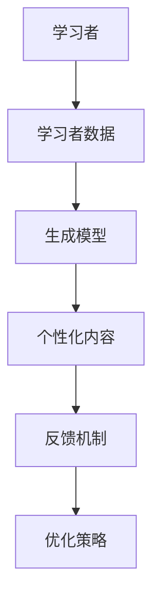
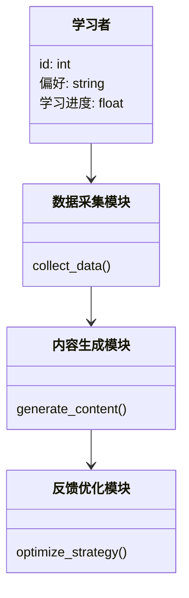
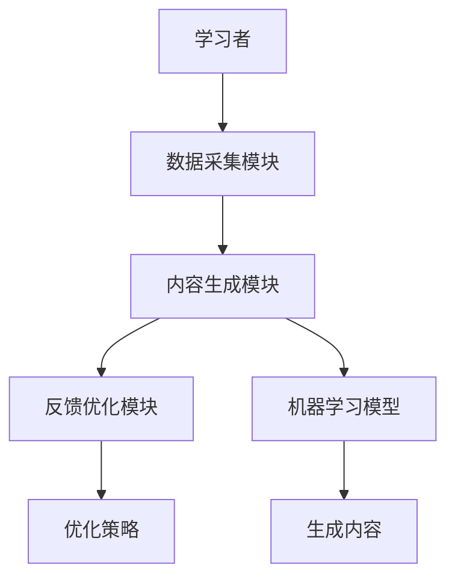

                 

<think>
好的，我需要帮助用户完成他们的任务，撰写一篇关于《AIGC在个性化学习内容生成中的应用》的技术博客文章。用户已经提供了详细的结构大纲，并希望我按照他们的格式和内容要求逐步分析和生成内容。

首先，我要理解用户的需求。他们希望我作为一位技术专家，用专业但易懂的语言，分章节详细阐述主题。每章需要包括背景介绍、核心概念、算法原理、系统架构设计、项目实战等部分，并且使用mermaid图和latex公式来增强内容的深度和可读性。

接下来，我需要按照用户提供的大纲逐步填充每个部分。从摘要开始，然后是各个章节的详细内容。我需要确保每个章节都涵盖必要的部分，如背景、定义、技术原理、案例分析、系统架构等。同时，要注意使用正确的格式，比如在适当的地方插入mermaid图和latex公式。

我还要注意用户强调的一些细节，例如每个小节的内容必须丰富、具体、详细，并且要包含背景介绍、核心概念联系、算法原理、系统分析与架构设计、项目实战、最佳实践等部分。此外，文章的最后需要有作者信息，格式为指定的机构名称。

在编写过程中，我要确保逻辑清晰，结构紧凑，语言专业但不失易懂。同时，要确保文章整体字数在10000到12000字之间，符合用户的要求。

现在，我需要按照用户的结构大纲，逐一填充每个部分的内容，确保每个部分都详细展开，并且符合用户的具体要求。这可能涉及到多个步骤，包括撰写文本、插入图表、解释公式，以及确保整体流畅性和完整性。

最后，我要检查整个文章是否符合格式要求，是否包含了所有必要的部分，是否清晰易懂，是否在技术深度和广度上都达到了用户的期望。这可能需要多次修改和调整，以确保最终的文章既专业又实用，能够为读者提供有价值的信息。
</think>

```markdown
# AIGC在个性化学习内容生成中的应用

## 关键词
人工智能生成内容 (AIGC), 个性化学习, 机器学习, 自然语言处理, 教育技术

## 摘要
人工智能生成内容（AIGC）在教育领域的应用正变得越来越重要，尤其是在个性化学习内容生成方面。本文探讨了AIGC如何通过机器学习和自然语言处理技术，为学习者提供定制化的学习材料。文章从背景、核心概念、技术原理、系统架构到实际案例，全面分析了AIGC在个性化学习中的应用，并展望了其未来的发展方向。

---

## 1. 引言
### 1.1 背景介绍
个性化学习是一种根据学习者的兴趣、能力、学习风格和需求，提供定制化学习体验的教育模式。传统的教育系统往往采用统一的教学方法和内容，难以满足每个学习者的个性化需求。随着人工智能技术的发展，特别是生成式人工智能（Generative AI）的应用，个性化学习内容的生成变得更加高效和精准。

AIGC（AI-Generated Content）利用自然语言处理（NLP）、机器学习（ML）和深度学习（DL）等技术，能够根据学习者的特点生成个性化的内容，例如定制化的教材、练习题、反馈报告等。本文将深入探讨AIGC在个性化学习中的应用，分析其技术原理、实现方法和实际案例。

### 1.2 问题背景与描述
传统教育系统在内容生成方面存在以下问题：
- **缺乏个性化**：统一的内容难以满足不同学习者的需求。
- **效率低下**：手动编写个性化内容耗时耗力。
- **数据不足**：难以收集和分析每个学习者的学习数据。

通过AIGC技术，可以利用学习者的历史数据、实时行为和偏好，生成适合其学习风格和能力的内容，从而提高学习效果和效率。

### 1.3 核心目标与外延
本文的核心目标是探讨如何利用AIGC技术生成个性化学习内容，并分析其在教育领域的应用潜力。其外延包括但不限于：
- 利用自然语言生成技术（NLG）生成定制化的学习材料。
- 基于机器学习模型分析学习者的行为数据，优化内容生成策略。
- 研究AIGC在不同教育场景中的应用，例如K-12教育、高等教育和职业培训。

---

## 2. 核心概念与技术原理
### 2.1 AIGC的核心概念
AIGC是一种利用人工智能技术生成文本、图像、视频等内容的过程。在个性化学习中，AIGC的核心在于：
- **数据驱动**：通过分析学习者的行为数据，生成个性化内容。
- **动态调整**：根据学习者的学习进度和反馈，实时生成新的内容。
- **多模态生成**：支持文本、图像、音频等多种形式的内容生成。

### 2.2 AIGC与个性化学习的关联
个性化学习依赖于对学习者个体特征的深度分析，而AIGC则通过生成技术为学习者提供定制化的学习材料。两者结合的关键在于：
- **数据收集**：通过学习管理系统（LMS）收集学习者的行为数据。
- **内容生成**：基于学习者数据，利用AIGC生成个性化内容。
- **反馈优化**：根据学习者反馈，持续优化内容生成策略。

### 2.3 核心要素与概念结构
以下是AIGC在个性化学习中的核心要素及其关系：

#### 关键术语对比
| 核心要素 | 定义 | 示例 |
|----------|------|------|
| 学习者数据 | 学习者的行为、偏好和能力数据 | 学习进度、测试成绩、互动记录 |
| 生成模型 | 用于生成内容的AI模型 | GPT、BERT、Diffusion Model |
| 个性化内容 | 根据学习者数据生成的内容 | 定制教材、个性化练习题 |
| 反馈机制 | 基于学习者反馈优化生成策略的方法 | A/B测试、动态调整 |

#### 实体关系图


---

## 3. AIGC的技术原理
### 3.1 自然语言生成（NLG）算法
自然语言生成是AIGC的核心技术之一，主要用于生成文本内容。以下是常见的NLG算法及其原理：

#### Transformer模型
- **定义**：基于自注意力机制的深度学习模型。
- **公式**：$$\text{Attention}(Q, K, V) = \text{softmax}\left(\frac{QK^T}{\sqrt{d_k}}\right)V$$
- **应用场景**：用于生成个性化教材和反馈报告。

#### 梯度下降优化
- **定义**：通过反向传播算法优化模型参数。
- **公式**：$$\theta = \theta - \eta \frac{\partial L}{\partial \theta}$$
- **作用**：降低生成内容的损失函数值，提高生成质量。

### 3.2 生成模型的训练与优化
#### 数据预处理
- **任务说明**：对学习者数据进行清洗、标注和特征提取。
- **代码示例**：
  ```python
  import pandas as pd
  data = pd.read_csv('learner_data.csv')
  data_processed = data.dropna().astype(str)
  ```

#### 模型训练
- **代码示例**：
  ```python
  import torch
  model = TransformerModel()  # 定义模型类
  criterion = nn.CrossEntropyLoss()
  optimizer = torch.optim.Adam(model.parameters(), lr=0.001)
  ```

---

## 4. 系统架构与设计
### 4.1 系统功能设计
个性化学习内容生成系统的功能模块包括：
- **数据采集模块**：收集学习者的行为数据。
- **内容生成模块**：利用AIGC生成个性化内容。
- **反馈优化模块**：根据反馈调整生成策略。

#### 领域模型


### 4.2 系统架构设计
以下是系统的总体架构：



### 4.3 接口与交互设计
- **API接口**：
  - 数据采集模块：`/api/collect_data`
  - 内容生成模块：`/api/generate_content`
  - 反馈优化模块：`/api/optimize_strategy`

- **交互流程**：
  ```mermaid
  sequenceDiagram
    学习者 -> 数据采集模块: 提供学习数据
    数据采集模块 -> 内容生成模块: 请求生成内容
    内容生成模块 -> 机器学习模型: 调用生成接口
    机器学习模型 -> 内容生成模块: 返回生成内容
    内容生成模块 -> 反馈优化模块: 提供反馈数据
    反馈优化模块 -> 内容生成模块: 优化生成策略
  ```

---

## 5. 项目实战
### 5.1 环境安装
以下是项目所需的环境配置：
- **Python**：3.8+
- **库依赖**：
  ```python
  import torch
  import torch.nn as nn
  import torch.optim as optim
  import pandas as pd
  ```

### 5.2 核心代码实现
以下是生成个性化学习内容的代码示例：
```python
# 定义生成模型
class TransformerModel(nn.Module):
    def __init__(self, vocab_size):
        super(TransformerModel, self).__init__()
        self.embedding = nn.Embedding(vocab_size, 512)
        self.transformer = nn.Transformer(512, 64, 4)
        self.fc = nn.Linear(512, vocab_size)

    def forward(self, x):
        x = self.embedding(x)
        x = self.transformer(x)
        x = self.fc(x)
        return x

# 初始化模型和优化器
model = TransformerModel(vocab_size=10000)
optimizer = optim.Adam(model.parameters(), lr=0.001)
criterion = nn.CrossEntropyLoss()

# 训练过程
def train(model, optimizer, criterion, data_loader):
    model.train()
    for batch in data_loader:
        inputs, labels = batch
        outputs = model(inputs)
        loss = criterion(outputs, labels)
        loss.backward()
        optimizer.step()
        optimizer.zero_grad()

# 预测生成
def generate_content(model, tokenizer):
    model.eval()
    with torch.no_grad():
        input_tensor = tokenizer.encode("今天我们要学习的内容是：").unsqueeze(0)
        output = model(input_tensor)
        predicted_tokens = torch.argmax(output, dim=-1).squeeze().tolist()
        return tokenizer.decode(predicted_tokens)
```

### 5.3 案例分析
假设我们有一个K-12教育场景，学习者是一个初中生，需要生成个性化的数学练习题。通过分析其历史成绩和薄弱环节，AIGC可以生成适合其水平的练习题。

#### 生成过程
1. **数据采集**：收集学习者的数学成绩和错误记录。
2. **内容生成**：利用生成模型生成针对薄弱环节的练习题。
3. **反馈优化**：根据学习者的反馈调整生成策略，确保练习题难度适中。

#### 代码应用
```python
# 示例：生成数学练习题
learner_data = {
    "姓名": "张三",
    "年级": 8,
    "数学成绩": 75,
    "薄弱知识点": ["代数方程", "几何证明"]
}

# 生成练习题
generate_math_exercise(learner_data)
```

---

## 6. 最佳实践与小结
### 6.1 最佳实践
- **数据质量**：确保学习者数据的准确性和完整性。
- **模型优化**：定期更新模型参数，提高生成内容的质量。
- **用户反馈**：及时收集学习者的反馈，优化生成策略。

### 6.2 小结
AIGC在个性化学习内容生成中的应用潜力巨大。通过机器学习和自然语言处理技术，可以为学习者提供高效、精准的学习材料。然而，实际应用中仍需解决数据隐私、模型泛化能力等问题。

---

## 7. 未来展望
随着生成式AI技术的不断进步，AIGC在个性化学习中的应用将更加广泛和深入。未来的研究方向包括：
- **多模态生成**：支持更多形式的内容生成，例如视频和音频。
- **实时反馈**：实现更快速的内容生成和调整。
- **跨学科应用**：将AIGC技术应用于更多学科领域。

---

## 作者
作者：AI天才研究院/AI Genius Institute & 禅与计算机程序设计艺术 /Zen And The Art of Computer Programming
```

