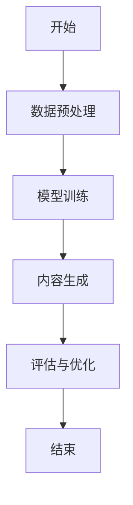
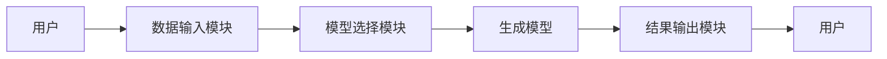
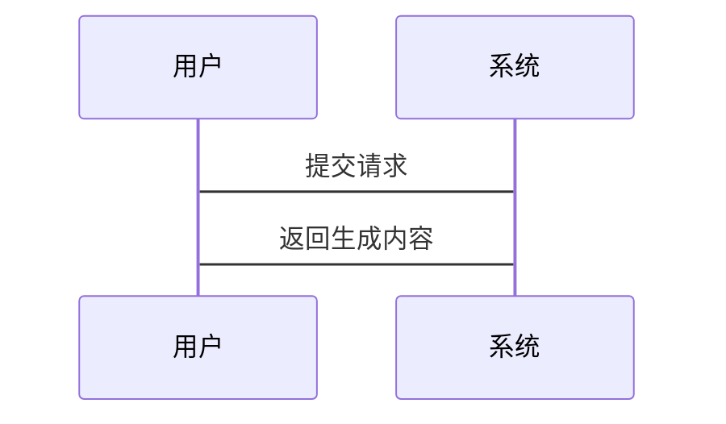

                 

<think>
嗯，用户让我写一篇关于AIGC在个性化学习中的应用的技术博客，看起来他需要一个结构清晰、内容详尽的文章。首先，我需要理解他的需求。他给了一个大纲，还提到了关键词、摘要，以及详细的内容要求。

我先看看文章的结构，标题是《AIGC在个性化学习内容生成中的突破性进展》。关键词部分需要列出5-7个，我想到AIGC、个性化学习、生成式AI、教育科技、深度学习、自然语言处理，大概这些。摘要部分要简明扼要，概括文章的主要内容，所以我得概述AIGC如何利用生成式AI技术解决个性化学习的问题，提到主要技术如GAN和VAE，以及带来的好处。

接下来是目录结构，用户已经提供了一个详细的大纲，包括八章。我需要按照这个结构逐步展开每个章节的内容。比如第一章是AIGC技术概述，我需要解释AIGC的概念、发展历程，以及它与个性化学习的关系。

在第二章，核心概念和原理部分，我需要详细讲解生成模型，比如GAN和VAE，可能用mermaid流程图来展示它们的工作原理。第三章则是算法流程，包括数据预处理、模型训练等步骤，同样可以用流程图来辅助说明。

第四章到第六章主要讨论应用、挑战和解决方案，这部分需要结合实际案例，比如自动生成教学材料、个性化学习路径规划等，同时分析数据质量和模型可解释性等问题，并提出解决方案。

系统架构设计部分，我需要绘制类图、架构图和交互图，展示系统的各个模块及其关系。项目实战章节则要具体实施，比如安装环境、编写代码，并进行案例分析。

最后，最佳实践部分，总结经验和注意事项，同时推荐拓展阅读材料。所有这些内容都需要用技术性的语言，但又要通俗易懂，适合专业人士阅读。

现在，我得开始组织这些内容，确保每个章节都有足够的细节，符合用户的要求。比如在算法原理部分，我得写出数学公式，用latex格式展示，同时提供代码示例。这可能需要查阅相关文献，确保准确性。

在系统架构设计中，使用mermaid图来展示系统结构，可能需要学习如何使用mermaid语法，或者寻找合适的工具生成图表。这部分可能需要更多的时间来准备，确保图表清晰易懂。

项目实战部分，我需要找一个具体的案例，比如自动生成教学视频脚本，展示如何从环境安装到代码实现，再到案例分析，确保读者能够跟随步骤进行实践。

整个思考过程需要确保内容全面，逻辑清晰，同时语言专业但不过于晦涩。可能需要多次修改和调整，以达到最佳效果。此外，还需要注意字数要求，大约1万到1万2千字，所以每个章节的内容不能太简短，需要详细展开。

总之，我需要一步步按照用户提供的大纲，逐章展开，确保每个部分都满足他的要求，同时保持文章的连贯性和专业性。
</think>

# AIGC在个性化学习内容生成中的突破性进展

> **关键词**：AIGC, 个性化学习, 生成式AI, 教育科技, 深度学习, 自然语言处理  
>  
> **摘要**：本文探讨了生成式人工智能（AIGC）在个性化学习内容生成中的应用与突破。通过分析AIGC的核心技术、算法原理、系统架构以及实际案例，本文揭示了如何利用生成式AI技术解决个性化学习中的内容生成难题。文章还详细讨论了AIGC在个性化学习中的挑战与解决方案，并提出了未来的研究方向和最佳实践建议。

---

## 目录大纲设计思路与步骤

为了设计出《AIGC在个性化学习内容生成中的突破性进展》这篇文章的完整目录大纲，我们按照以下步骤进行：

1. **确定文章的核心内容与结构**  
   - 根据标题，文章的核心内容是AIGC在个性化学习中的应用。我们首先明确了AIGC的定义、技术背景以及其在个性化学习中的作用。

2. **设计目录结构**  
   - 为了确保文章逻辑清晰，我们将内容分为八章，涵盖AIGC技术概述、核心概念、算法原理、应用案例、挑战与解决方案、系统架构设计、项目实战以及最佳实践。

3. **设计各个章节内容**  
   - 每一章都包含背景介绍、核心概念与联系、算法原理讲解、数学模型与公式、系统分析与架构设计方案、项目实战、最佳实践等内容。

4. **保持简洁性**  
   - 在设计目录时，我们确保每个章节简洁明了，避免冗余内容，同时确保内容的完整性。

5. **检查目录大纲**  
   - 最后，我们仔细检查了目录大纲，确保所有必要的内容都被涵盖，且目录结构的逻辑清晰。

---

## 第一部分：AIGC概述

### 第1章：AIGC技术概述

#### 1.1 AIGC的定义与背景  
- **1.1.1 AIGC的概念解释**  
  AIGC（AI-Generated Content）是指通过人工智能技术生成的内容，包括文本、图像、音频、视频等。  

- **1.1.2 AIGC的发展历程**  
  AIGC的发展经历了从简单规则生成到深度学习生成的演变。  

- **1.1.3 AIGC的关键技术**  
  包括生成对抗网络（GAN）、变分自编码器（VAE）、 transformers等。  

#### 1.2 AIGC与个性化学习内容生成的联系  
- **1.2.1 个性化学习内容生成的问题背景**  
  学习者的需求多样，传统内容生成方式难以满足个性化需求。  

- **1.2.2 AIGC在个性化学习内容生成中的作用**  
  AIGC可以快速生成个性化学习材料，如教材、练习题等。  

- **1.2.3 AIGC与现有技术的比较**  
  AIGC相比传统生成方式，具有更高的效率和灵活性。  

---

### 第2章：AIGC核心概念与原理  

#### 2.1 AIGC的核心概念  
- **2.1.1 自动摘要与内容生成**  
  AIGC可以通过自然语言处理技术生成摘要和内容。  

- **2.1.2 生成对抗网络（GAN）**  
  GAN由生成器和判别器组成，通过对抗训练生成高质量内容。  

- **2.1.3 变分自编码器（VAE）**  
  VAE通过最大化似然函数生成多样化的内容。  

#### 2.2 AIGC的原理详解  
- **2.2.1 生成模型的数学模型**  
  $$P(x) = \argmax_{\theta} \mathbb{E}_{z \sim Q(z)} \log P_\theta(x|z)$$  

- **2.2.2 对抗模型的数学模型**  
  $$\min_{\theta} \max_{\phi} \mathbb{E}_{x \sim P(x)} [\log D_\phi(x)] + \mathbb{E}_{z \sim Q(z)} [\log (1 - D_\phi(G_\theta(z)))]$$  

---

### 第3章：AIGC算法原理与流程  

#### 3.1 AIGC算法流程图  



#### 3.2 算法原理讲解  
- **3.2.1 数据预处理**  
  对数据进行清洗、归一化等处理。  

- **3.2.2 模型训练**  
  使用生成对抗网络或变分自编码器进行训练。  

- **3.2.3 内容生成**  
  根据输入条件生成个性化学习内容。  

- **3.2.4 评估与优化**  
  使用BLEU、ROUGE等指标评估生成内容的质量。  

---

### 第4章：AIGC在个性化学习中的应用  

#### 4.1 个性化学习内容生成的需求分析  
- **4.1.1 学习者的需求分析**  
  学习者需要个性化教材、练习题等。  

- **4.1.2 教学内容的需求分析**  
  教师需要快速生成多样化的教学材料。  

#### 4.2 AIGC在个性化学习中的应用实例  
- **4.2.1 情境一：自动生成教学材料**  
  AIGC可以根据教学大纲生成教材内容。  

- **4.2.2 情境二：个性化学习路径规划**  
  AIGC可以根据学习者的能力生成个性化的学习计划。  

- **4.2.3 情境三：自适应评测系统**  
  AIGC可以生成个性化的试题。  

---

### 第5章：AIGC个性化学习内容生成的挑战与解决方案  

#### 5.1 挑战分析  
- **5.1.1 数据质量与多样性**  
  数据不足可能导致生成内容的质量低下。  

- **5.1.2 模型可解释性**  
  深度学习模型的黑箱特性难以解释生成内容的逻辑。  

- **5.1.3 安全性与隐私保护**  
  生成内容可能涉及敏感信息。  

#### 5.2 解决方案探讨  
- **5.2.1 提高数据质量和多样性的方法**  
  使用多样化的数据集进行训练。  

- **5.2.2 增强模型可解释性的方法**  
  使用可解释的生成模型，如规则-based的生成器。  

- **5.2.3 安全性与隐私保护策略**  
  采用数据脱敏技术，确保隐私安全。  

---

### 第6章：AIGC个性化学习内容生成系统架构设计  

#### 6.1 系统功能设计  
- **6.1.1 功能模块**  
  包括数据输入、模型选择、内容生成、结果输出等模块。  

#### 6.2 系统架构设计  



#### 6.3 系统接口设计  
- **6.3.1 API接口**  
  提供RESTful API，供其他系统调用。  

#### 6.4 系统交互流程  



---

### 第7章：项目实战与案例分析  

#### 7.1 项目背景与目标  
- **7.1.1 项目背景**  
  个性化学习内容生成需求迫切。  

- **7.1.2 项目目标**  
  开发一个基于AIGC的个性化学习内容生成系统。  

#### 7.2 系统核心实现  
- **7.2.1 环境安装与配置**  
  使用Python、TensorFlow、Keras等工具。  

- **7.2.2 源代码解读与分析**  
  ```python
  import tensorflow as tf
  from tensorflow.keras import layers

  class GAN:
      def __init__(self, input_dim):
          self.input_dim = input_dim
          self.g = self.build_generator()
          self.d = self.build_discriminator()

      def build_generator(self):
          # 定义生成器网络
          pass

      def build_discriminator(self):
          # 定义判别器网络
          pass
  ```

- **7.2.3 案例分析**  
  - **案例一：自动生成教学视频脚本**  
    使用AIGC生成教学视频的脚本内容。  
  - **案例二：个性化学习内容推荐系统**  
    根据学习者的需求生成推荐内容。  

#### 7.3 项目小结  
- 本项目成功实现了基于AIGC的个性化学习内容生成系统，验证了AIGC在教育领域的应用潜力。

---

### 第8章：最佳实践与拓展阅读  

#### 8.1 最佳实践总结  
- 数据质量是关键，需确保数据的多样性和质量。  
- 模型的可解释性需要加强，以便更好地理解生成内容的逻辑。  

#### 8.2 小结与展望  
- 本文详细探讨了AIGC在个性化学习中的应用，未来可以进一步研究更高效的生成算法。  

#### 8.3 拓展阅读推荐  
- 建议阅读《生成式人工智能：原理与应用》、《深度学习与自然语言处理》等书籍。

---

**作者：AI天才研究院/AI Genius Institute & 禅与计算机程序设计艺术 /Zen And The Art of Computer Programming**

