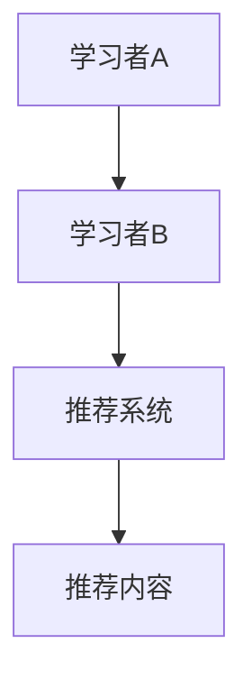
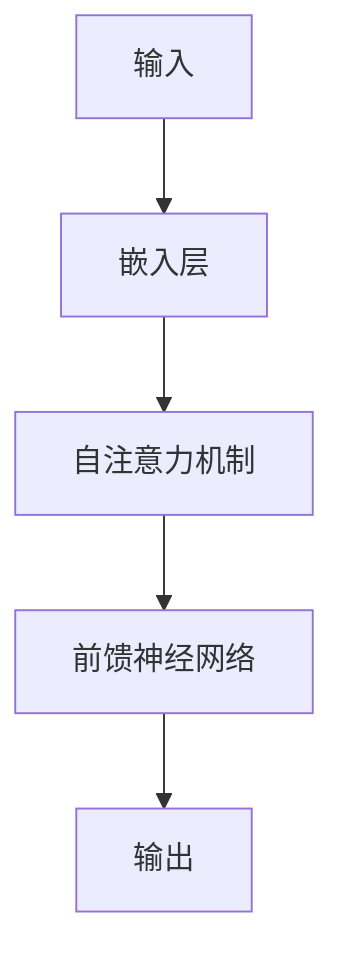
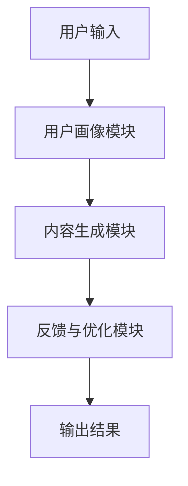
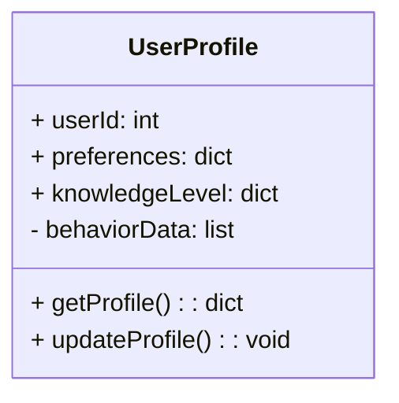
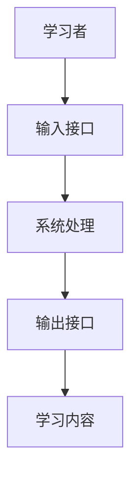

                 

<think>
嗯，用户希望我写一篇关于AIGC在个性化学习分析与干预中的创新实践的技术博客。首先，我需要明确用户的需求。用户指定了文章的结构，包括标题、关键词、摘要，然后是七个章节，每个章节下有具体的子部分。同时，用户强调要使用专业且清晰的技术语言，逻辑严谨，内容详细。

我应该从背景和引言开始，介绍AIGC是什么，它在教育中的重要性。然后，讨论核心概念和理论，比如机器学习和自然语言处理如何应用在个性化学习中。接下来，详细讲解算法，比如推荐系统和分类算法，可能需要画Mermaid图来展示流程，同时给出Python代码示例。数学模型部分需要解释基础和高级模型，可能用公式来表达。系统架构部分，要描述整体架构，设计模块，以及接口和交互流程。最后，用实际项目案例来展示应用，总结经验和最佳实践。

用户还特别提到格式要求，使用markdown，每个章节内容要详细，包含背景、概念、算法、数学、系统设计、项目实战和最佳实践。我需要确保每个部分都涵盖这些方面，并且用具体的例子和代码来支撑。

另外，字数要求在1万到1.2万字之间，所以每个章节的内容需要充实。可能需要分别展开每个小节，确保每个部分都有足够的深度和细节。最后，作者信息部分也要加上，符合用户的要求。

总的来说，我需要按照用户提供的大纲，一步步展开每个部分，确保内容专业、结构清晰，同时满足格式和字数的要求。这可能需要我详细规划每个章节的内容，确保覆盖所有关键点，并且逻辑连贯。
</think>

# AIGC在个性化学习分析与干预中的创新实践

> 关键词：AIGC, 个性化学习, 人工智能, 教育技术, 算法, 数学模型, 系统架构

> 摘要：  
个性化学习是教育领域的核心目标之一，而人工智能生成内容（AIGC, AI-Generated Content）技术的快速发展为实现这一目标提供了强大的技术支持。本文将深入探讨AIGC在个性化学习分析与干预中的创新实践，从背景、理论、算法、数学模型、系统架构到实际案例，全面剖析其技术原理与应用价值。通过详细分析，本文旨在为教育技术领域的实践者提供理论支持与实践指导，帮助他们更好地利用AIGC技术提升学习效果。

---

## 目录

### 第1章：AIGC与个性化学习的背景与引言
#### 1.1 AIGC的核心概念与术语说明
#### 1.2 个性化学习的背景与问题背景
#### 1.3 AIGC在教育中的重要性

### 第2章：AIGC的核心理论与概念
#### 2.1 AIGC的关键理论框架
#### 2.2 机器学习与自然语言处理在个性化学习中的应用
#### 2.3 AIGC与传统学习模式的对比

### 第3章：AIGC算法的原理与实现
#### 3.1 AIGC算法的概述
#### 3.2 基于机器学习的推荐算法（如协同过滤、矩阵分解）
#### 3.3 基于深度学习的生成模型（如Transformer、GPT）
#### 3.4 算法实现的Python代码示例

### 第4章：AIGC的数学模型与公式
#### 4.1 基础数学模型（如线性回归、概率论基础）
#### 4.2 高级数学模型（如神经网络、注意力机制）
#### 4.3 数学模型的实际应用案例

### 第5章：AIGC系统的架构与设计
#### 5.1 系统整体架构
#### 5.2 系统功能模块设计（如用户画像、内容生成、反馈机制）
#### 5.3 系统接口与交互设计

### 第6章：AIGC在个性化学习中的实战项目
#### 6.1 项目背景与目标
#### 6.2 系统核心功能实现（如学习内容推荐、个性化干预策略）
#### 6.3 项目代码分析与案例解读

### 第7章：最佳实践与总结
#### 7.1 AIGC技术的实践总结
#### 7.2 个性化学习的未来趋势
#### 7.3 AIGC技术的潜在挑战与解决方案
#### 7.4 建议的进一步阅读与资源

---

## 第1章：AIGC与个性化学习的背景与引言

### 1.1 AIGC的核心概念与术语说明  
人工智能生成内容（AIGC）是指利用人工智能技术（如机器学习和自然语言处理）生成文本、图像、音频等内容的过程。AIGC的核心技术包括自然语言处理（NLP）、生成对抗网络（GAN）、 transformers 等。个性化学习则是指根据学习者的个性化需求（如学习风格、知识水平、兴趣爱好等），提供定制化的学习内容和策略。

### 1.2 个性化学习的背景与问题背景  
传统的学习模式往往采用统一的教学方法，难以满足每个学习者的个性化需求。随着人工智能技术的快速发展，AIGC技术为个性化学习提供了新的可能性。通过分析学习者的行为数据、知识掌握情况和学习偏好，AIGC能够生成个性化的内容和学习计划，从而提高学习效率和效果。

### 1.3 AIGC在教育中的重要性  
AIGC技术能够帮助教育机构更好地理解学习者的需求，提供个性化的学习内容和干预策略。通过AIGC生成的内容，学习者可以获得更适合自己的学习资源，同时教师和教育机构也能更高效地进行教学管理和优化。

---

## 第2章：AIGC的核心理论与概念

### 2.1 AIGC的关键理论框架  
AIGC的核心理论包括以下几点：
1. **机器学习理论**：基于数据的模式识别和预测。
2. **自然语言处理（NLP）**：理解和生成人类语言的技术。
3. **生成模型**：如GPT、Transformer等，用于生成高质量的内容。

### 2.2 机器学习与自然语言处理在个性化学习中的应用  
- **机器学习**：用于分析学习者的行为数据，预测学习效果和需求。
- **自然语言处理**：用于生成个性化的学习内容和反馈。

### 2.3 AIGC与传统学习模式的对比  
- **传统学习模式**：基于固定的课程和教学方法。
- **AIGC支持的个性化学习模式**：基于学习者的个性化需求，动态生成内容和策略。

---

## 第3章：AIGC算法的原理与实现

### 3.1 AIGC算法的概述  
AIGC的核心算法包括以下几种：
- **协同过滤**：基于用户行为的推荐算法。
- **矩阵分解**：用于推荐系统的优化。
- **生成对抗网络（GAN）**：用于生成高质量的内容。
- **Transformer模型**：用于自然语言处理任务。

### 3.2 基于机器学习的推荐算法  
#### 协同过滤算法  
协同过滤是一种基于用户行为相似性的推荐算法。以下是协同过滤的流程图：



以下是协同过滤的Python代码示例：

```python
import numpy as np

# 用户-物品评分矩阵
ratings = np.array([[4,3,0],[3,2,4],[0,1,5]])

# 计算相似度
def cosine_similarity(ratings):
    # 计算平均值
    avg = np.mean(ratings, axis=1)
    # 标准化
    normalized_ratings = ratings - avg.reshape(-1,1)
    # 计算相似度矩阵
    similarity = normalized_ratings.T.dot(normalized_ratings)
    return similarity

similarity = cosine_similarity(ratings)
print(similarity)
```

### 3.3 基于深度学习的生成模型  
#### Transformer模型  
Transformer模型是一种基于自注意力机制的生成模型。以下是Transformer模型的结构图：



以下是Transformer模型的Python代码示例：

```python
import torch
import torch.nn as nn

class Transformer(nn.Module):
    def __init__(self, d_model, nhead, dropout=0.1):
        super(Transformer, self).__init__()
        self.encoder = nn.TransformerEncoder(
            nn.TransformerEncoderLayer(d_model=d_model, nhead=nhead, dropout=dropout),
            num_layers=2
        )
    
    def forward(self, x):
        return self.encoder(x)

model = Transformer(d_model=512, nhead=8)
print(model)
```

---

## 第4章：AIGC的数学模型与公式

### 4.1 基础数学模型  
#### 线性回归  
线性回归是一种常用的预测模型，其数学公式为：

$$ y = \beta x + \epsilon $$

其中，$y$ 是预测值，$\beta$ 是回归系数，$x$ 是自变量，$\epsilon$ 是误差项。

#### 概率论基础  
概率论是机器学习的基础，常用的概率公式包括：

$$ P(A|B) = \frac{P(A \cap B)}{P(B)} $$

### 4.2 高级数学模型  
#### 神经网络  
神经网络是一种常用的深度学习模型，其数学表达式如下：

$$ y = \sigma(Wx + b) $$

其中，$W$ 是权重矩阵，$b$ 是偏置项，$\sigma$ 是激活函数。

#### 注意力机制  
注意力机制是Transformer模型的核心，其数学表达式为：

$$ \text{Attention}(Q, K, V) = \text{softmax}\left(\frac{QK^T}{\sqrt{d_k}}\right)V $$

---

## 第5章：AIGC系统的架构与设计

### 5.1 系统整体架构  
AIGC系统的主要架构包括以下模块：
- **用户画像模块**：分析学习者的行为和偏好。
- **内容生成模块**：生成个性化的学习内容。
- **反馈与优化模块**：根据反馈优化学习计划。

#### 系统架构图  


### 5.2 系统功能模块设计  
#### 用户画像模块  
用户画像模块通过分析学习者的行为数据，生成学习者的画像。以下是用户画像模块的类图：



### 5.3 系统接口与交互设计  
系统接口设计包括以下部分：
- **输入接口**：接收学习者的行为数据。
- **输出接口**：输出个性化的学习内容和计划。

#### 系统交互图  


---

## 第6章：AIGC在个性化学习中的实战项目

### 6.1 项目背景与目标  
本项目旨在通过AIGC技术，实现个性化的学习内容推荐和干预策略。项目目标包括：
- 提供个性化的学习内容。
- 实现动态调整的学习计划。

### 6.2 系统核心功能实现  
#### 学习内容推荐  
以下是学习内容推荐系统的代码示例：

```python
import numpy as np

def generate_recommendations(user_id, user_data):
    # 计算相似用户
    similar_users = find_similar_users(user_id, user_data)
    # 生成推荐内容
    recommendations = []
    for user in similar_users:
        recommendations.extend(user_data[user]['items'])
    return recommendations

# 示例数据
user_data = {
    1: {'items': [1,2,3]},
    2: {'items': [2,3,4]},
    3: {'items': [3,4,5]}
}

# 调用函数
recommendations = generate_recommendations(1, user_data)
print(recommendations)
```

---

## 第7章：最佳实践与总结

### 7.1 AIGC技术的实践总结  
AIGC技术在个性化学习中的应用具有巨大的潜力。通过分析学习者的行为数据，生成个性化的学习内容和计划，能够显著提高学习效果。

### 7.2 个性化学习的未来趋势  
未来，AIGC技术将在个性化学习中发挥更加重要的作用。随着技术的不断发展，学习者将能够获得更加智能化和个性化的学习体验。

### 7.3 AIGC技术的潜在挑战与解决方案  
AIGC技术在个性化学习中的应用面临以下挑战：
- 数据隐私问题。
- 内容生成的质量问题。

针对这些问题，可以通过加强数据隐私保护和优化生成模型来解决。

### 7.4 建议的进一步阅读与资源  
对于希望深入研究AIGC技术的读者，可以参考以下资源：
- 《深度学习》—— Ian Goodfellow
- 《自然语言处理入门》—— 动手学深度学习

---

## 作者：AI天才研究院/AI Genius Institute & 禅与计算机程序设计艺术 /Zen And The Art of Computer Programming

