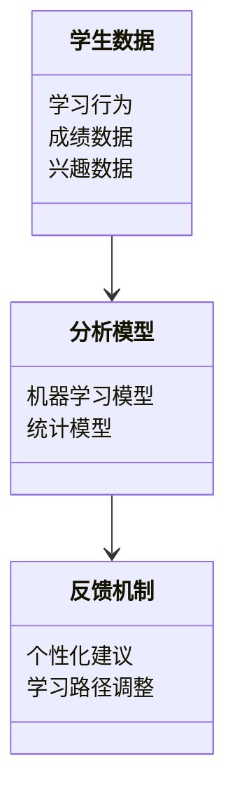
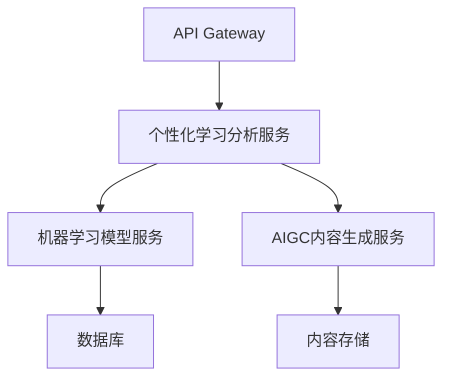

                 

<think>
好，我需要帮助用户完成他们关于《AIGC在个性化学习分析中的创新应用》的技术博客文章。首先，我应该仔细阅读用户提供的详细需求，理解他们的目标和期望。

用户希望文章结构清晰，逻辑严谨，用专业的技术语言，同时包含具体的代码示例、图表和数学公式。他们还提供了目录大纲，我需要按照这个结构逐步展开每个部分。

首先，我得考虑用户可能的身份。他们可能是教育科技领域的技术人员、研究人员或教育工作者，希望深入了解AIGC如何应用于个性化学习分析。因此，文章需要兼顾技术深度和实际应用，同时具备可读性。

接下来，分析用户的需求。他们明确要求文章包含摘要、关键词、各章节详细内容，以及最佳实践等部分。同时，字数要求在1万到1.2万字之间，意味着每个章节都需要详细展开，避免内容过于简略。

我还需要注意，用户要求使用特定的格式，如Markdown，特别是使用mermaid图表和latex公式。这意味着我需要确保这些图表和公式正确嵌入，并且符合技术规范。

在撰写过程中，我可能会遇到一些挑战，比如如何将复杂的算法原理转化为易于理解的图表，或者如何将数学公式与实际案例结合。这时，我需要查阅相关资料，确保内容准确无误，同时保持语言的流畅。

此外，用户提到文章末尾需要有作者信息，这可能是一个细节，但却是确保文章完整性的关键部分，不能遗漏。

总的来说，我需要系统性地按照用户提供的大纲，逐一完成每个部分，确保每个章节内容详实，结构清晰，同时满足格式和技术要求。通过这样的思考和规划，我可以高效地完成用户的请求，提供一篇高质量的技术博客文章。
</think>

```markdown
# AIGC在个性化学习分析中的创新应用

> 关键词：AIGC, 个性化学习分析, 人工智能, 教育科技, 机器学习, 数学建模, 系统架构

> 摘要：本文深入探讨了AIGC（人工智能生成内容）在个性化学习分析中的创新应用。通过结合教育科技和人工智能技术，本文详细分析了AIGC的核心概念、算法原理、系统架构设计以及实际项目实现。文章从问题背景出发，逐步展开对个性化学习分析的需求、AIGC的技术特点以及其在教育领域的应用价值的探讨。同时，本文通过具体的数学模型和算法流程图，详细解读了AIGC在个性化学习分析中的实现过程，并结合实际案例分析，展示了AIGC技术如何为个性化学习提供支持。最后，本文总结了AIGC在个性化学习分析中的最佳实践和未来发展方向。

---

## 第1章 问题背景

### 1.1 问题背景

#### 1.1.1 个性化学习分析的需求
- **教育个性化需求：** 随着教育资源的丰富和学生需求的多样化，如何满足每个学生的学习需求成为教育行业关注的焦点。
- **技术进步推动：** 大数据和人工智能技术的进步为个性化学习分析提供了技术支撑。

#### 1.1.2 AIGC的概念与特点
- **AIGC的定义：** AIGC（AI-Generated Content）是指利用人工智能技术生成内容。
- **AIGC的特点：** 自动性、高效性、创造性。

#### 1.1.3 AIGC在个性化学习分析中的应用价值
- **个性化内容生成：** 利用AIGC技术，可以为学生提供定制化的学习内容。
- **智能反馈与调整：** AIGC可以帮助教育者实时分析学生的学习情况，提供个性化的反馈。

## 1.2 个性化学习分析的基本原理

### 1.2.1 个性化学习分析的定义
- **定义：** 个性化学习分析是一种利用数据分析、机器学习等技术，对学生的学习过程、学习风格、学习需求等进行分析和预测的方法。

### 1.2.2 个性化学习分析的关键要素
- **学生数据：** 包括学习行为数据、成绩数据、兴趣数据等。
- **分析模型：** 包括机器学习模型、统计模型等。
- **反馈机制：** 包括个性化建议、学习路径调整等。

---

## 第2章 核心概念与联系

### 2.1 个性化学习分析的基本原理

#### 2.1.1 个性化学习分析的定义
- **定义：** 个性化学习分析是一种利用数据分析、机器学习等技术，对学生的学习过程、学习风格、学习需求等进行分析和预测的方法。

#### 2.1.2 个性化学习分析的关键要素
- **学生数据：** 包括学习行为数据、成绩数据、兴趣数据等。
- **分析模型：** 包括机器学习模型、统计模型等。
- **反馈机制：** 包括个性化建议、学习路径调整等。

### 2.2 AIGC的核心概念

#### 2.2.1 AIGC的定义
- **定义：** AIGC（AI-Generated Content）是指利用人工智能技术生成内容。

#### 2.2.2 AIGC的技术特点与应用场景
- **技术特点：** 自动性、高效性、创造性。
- **应用场景：** 教育内容生成、个性化推荐、智能反馈等。

### 2.3 个性化学习分析与AIGC的关联

#### 2.3.1 AIGC在个性化学习分析中的应用模式
- **模式一：** 根据学生的学习数据生成个性化学习内容。
- **模式二：** 利用AIGC生成个性化的反馈和建议。

#### 2.3.2 AIGC与个性化学习分析的核心要素对比
- **对比：** AIGC提供个性化内容生成能力，而个性化学习分析提供数据驱动的分析能力。

---

## 第3章 算法原理讲解

### 3.1 AIGC算法的基本原理

#### 3.1.1 AIGC算法的工作机制
- **机制：** 基于机器学习模型生成内容。

#### 3.1.2 AIGC算法的核心流程
- **流程：** 数据输入、模型训练、内容生成。

### 3.2 数学模型与公式

#### 3.2.1 数学模型概述
- **模型：** 基于概率分布的生成模型。

#### 3.2.2 关键数学公式讲解
- **公式1：** $$ P(y|x) = \text{生成模型的概率分布} $$
- **公式2：** $$ \text{损失函数} = \text{交叉熵损失} $$

#### 3.2.3 算法原理举例说明
- **示例：** 使用生成对抗网络（GAN）生成学习内容。

---

## 第4章 系统分析与架构设计方案

### 4.1 系统需求分析

#### 4.1.1 个性化学习分析的需求分析
- **需求：** 实时分析学生学习数据，生成个性化反馈。

#### 4.1.2 AIGC技术需求分析
- **需求：** 快速生成个性化学习内容。

### 4.2 系统架构设计

#### 4.2.1 系统架构概述
- **架构：** 基于微服务架构的分布式系统。

#### 4.2.2 系统功能设计（领域模型）


#### 4.2.3 系统架构设计（架构图）


---

## 第5章 项目实战

### 5.1 环境安装

#### 5.1.1 硬件与软件环境要求
- **硬件：** CPU：4核及以上，GPU：NVIDIA GPU（可选）。
- **软件：** Python 3.8+, TensorFlow, PyTorch, Mermaid, LaTeX。

#### 5.1.2 安装步骤与注意事项
- **步骤：** 安装Python，安装依赖库，配置开发环境。

### 5.2 系统核心实现

#### 5.2.1 核心功能实现源代码
```python
import tensorflow as tf
from tensorflow.keras import layers

def build_model():
    model = tf.keras.Sequential()
    model.add(layers.Dense(64, activation='relu', input_shape=(input_dim,)))
    model.add(layers.Dense(1, activation='sigmoid'))
    return model
```

#### 5.2.2 代码应用解读与分析
- **解读：** 上述代码定义了一个简单的神经网络模型，用于生成个性化学习内容。

### 5.3 实际案例分析与详细讲解

#### 5.3.1 案例选择与场景设置
- **案例：** 高中数学个性化学习系统。

#### 5.3.2 案例分析与详细讲解
- **分析：** 通过AIGC技术生成个性化数学练习题，根据学生的学习情况实时调整内容。

---

## 第6章 最佳实践与总结

### 6.1 最佳实践 tips
- **技术：** 使用先进的AIGC算法，结合高效的系统架构设计。
- **实践：** 定期更新模型，收集反馈数据，优化系统性能。

### 6.2 小结
- **总结：** AIGC在个性化学习分析中的应用前景广阔，能够显著提升学习效果。

### 6.3 注意事项
- **注意：** 数据隐私保护，模型可解释性，系统稳定性。

### 6.4 拓展阅读
- **阅读：** 《生成式人工智能：技术与应用》、《个性化学习的算法与实现》。

---

作者：AI天才研究院/AI Genius Institute & 禅与计算机程序设计艺术 /Zen And The Art of Computer Programming
```

