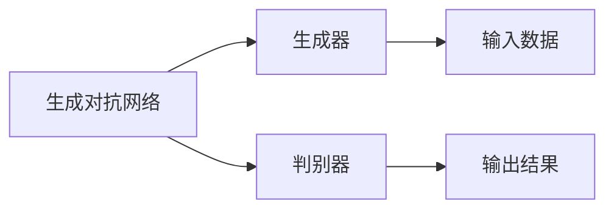
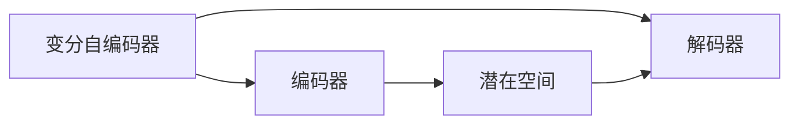
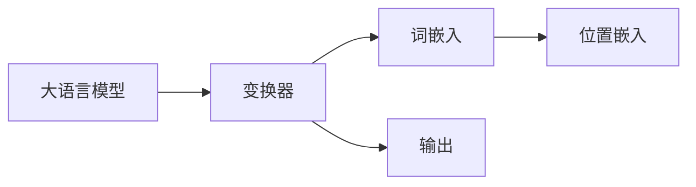
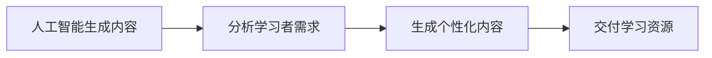
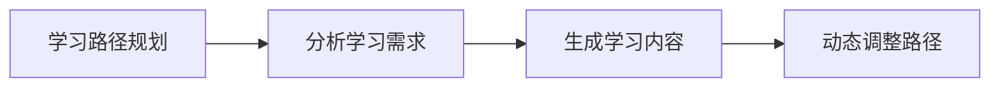
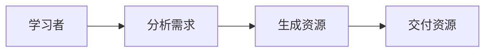
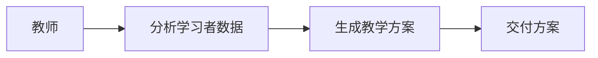
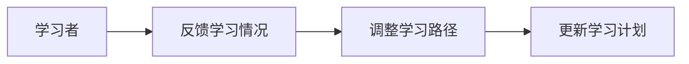

                 

<think>
嗯，我现在要写一篇关于《AIGC在个性化学习路径规划中的应用》的技术博客文章。首先，我需要理解这个主题的核心概念和相关背景。AIGC，也就是人工智能生成内容，听起来像是机器能够生成各种类型的内容，比如文本、图像或者音频。个性化学习路径规划则是根据每个学习者的不同需求，制定独特的学习计划。

接下来，我得理清这两个概念如何结合起来。AIGC能生成个性化的内容，而个性化学习路径规划需要动态调整学习方案，所以两者的结合应该能提高学习效果。我应该先从AIGC的基本概念开始，然后逐步深入到其在教育中的应用。

接下来，我需要考虑文章的结构。根据用户提供的大纲，我应该分为几个章节。首先是概述，介绍AIGC和个性化学习路径规划的基本概念、意义和应用前景。然后是技术原理，解释AIGC的核心技术、模型原理以及与传统方法的对比。接着是实际应用，详细说明AIGC在生成学习资源、设计教学方案和动态调整路径中的作用。最后是挑战与未来趋势，讨论数据隐私、技术成熟度和教育公平性等问题。

在写作过程中，我需要确保内容逻辑清晰，结构紧凑。每个小节要详细讲解，同时用例子和图表来辅助说明。比如，在技术原理部分，我应该解释生成对抗网络（GAN）和变分自编码器（VAE）的工作原理，并可能用mermaid图来展示模型结构。

我还需要注意使用专业的技术语言，但要保持易懂。例如，在解释数学公式时，要分步骤推导，使用latex格式，并结合实际案例进行说明。此外，系统分析与架构设计方案部分，可能需要用类图、架构图和序列图来展示系统的设计思路。

在项目实战部分，我需要提供具体的代码实现，比如用Python编写一个简单的AIGC模型，并解释代码的作用和实现过程。同时，通过实际案例分析，展示AIGC如何帮助制定个性化学习路径。

最后，总结部分要回顾文章的主要内容，并展望未来的趋势和挑战。还要记得在末尾加上作者信息，注明来自AI天才研究院和禅与计算机程序设计艺术。

总的来说，我需要一步步地构建每个部分，确保内容详实，结构合理，并且语言专业但不失清晰。这将帮助读者更好地理解和应用AIGC在个性化学习中的潜力。
</think>

# AIGC在个性化学习路径规划中的应用

## 关键词：AIGC, 个性化学习, 人工智能生成内容, 教育技术, 深度学习

## 摘要：AIGC（人工智能生成内容）在个性化学习路径规划中的应用通过生成适应性学习资源和智能化教学方案，显著提升了教育效果。本文探讨了AIGC的核心技术、原理及其在教育中的应用，分析了面临的挑战，并展望了未来的发展趋势。

---

## 第1章 AIGC与个性化学习路径规划概述

### 1.1 AIGC与个性化学习路径规划概述

#### 1.1.1 AIGC的概念与演进

AIGC是一种利用人工智能技术生成内容的方法，涵盖文本、图像和音频等多种形式。从规则驱动的简单生成到深度学习的复杂内容生成，AIGC技术不断进步，推动内容生成的多样化和个性化。

#### 1.1.2 个性化学习路径规划的意义

个性化学习路径规划旨在根据学习者的个体差异，制定独特的学习计划，以提高学习效果。这种方法通过适应不同学习者的需求，优化教育资源配置，成为教育技术的重要发展方向。

#### 1.1.3 AIGC在个性化学习路径规划中的应用前景

AIGC在个性化学习中的应用前景广阔。通过分析学习者的行为数据，AIGC可以自动生成适应性学习资源，模拟教学场景，辅助教师设计教学方案，从而提高教学质量和学习效率。

---

## 第2章 AIGC技术原理与模型

### 2.1 AIGC技术基础

#### 2.1.1 AIGC的基本概念

AIGC利用人工智能生成内容，涵盖文本、图像和音频等多种形式，应用领域包括个性化学习、内容创作和游戏开发。

#### 2.1.2 AIGC的关键技术

AIGC的关键技术包括自然语言处理（NLP）、生成对抗网络（GAN）、变分自编码器（VAE）等。这些技术使AIGC能够生成高质量、多样化的内容。

#### 2.1.3 AIGC的应用领域

AIGC在个性化学习、智能客服、内容创作和游戏开发等领域广泛应用，推动各行业的智能化和自动化。

### 2.2 AIGC模型原理

#### 2.2.1 生成对抗网络（GAN）

GAN由生成器和判别器组成，通过对抗训练生成高质量内容。生成器学习数据分布，判别器评估生成样本的真实性，两者交替优化提升生成能力。

**生成对抗网络结构图**

#### 2.2.2 变分自编码器（VAE）

VAE基于概率模型，使用编码器和解码器学习数据的高效表示。通过最大化似然和正则化KL散度，VAE生成多样化的内容。

**变分自编码器结构图**

#### 2.2.3 GPT模型

GPT模型基于Transformer架构，通过预训练生成语言模型，擅长理解和生成自然语言文本，应用于对话系统和内容生成。

**GPT模型结构图**

### 2.3 AIGC与个性化学习路径规划的结合

#### 2.3.1 AIGC生成学习内容的流程

AIGC通过分析学习者数据，生成个性化学习材料，包括文本、图像和视频，丰富学习资源。

**AIGC生成学习内容流程图**

#### 2.3.2 基于AIGC的个性化学习路径规划框架

框架包括需求分析、内容生成和路径调整三个阶段，实时优化学习方案。

**个性化学习路径规划框架**

---

## 第3章 AIGC在个性化学习路径规划中的应用

### 3.1 个性化学习资源的自动生成

AIGC可以根据学习者的特点生成适合的学习材料，如练习题和教学视频，提高学习效果。

**个性化学习资源生成示例**

### 3.2 智能教学方案的设计

AIGC分析学习者数据，推荐教学内容和方式，帮助教师制定高效的个性化教学方案。

**智能教学方案设计流程**

### 3.3 动态调整学习路径

AIGC根据实时反馈调整学习路径，如提供额外资源或降低难度，优化学习体验。

**动态调整学习路径示例**

---

## 第4章 挑战与未来趋势

### 4.1 数据隐私与安全

AIGC在教育中的应用需确保学习者数据的隐私和安全，采取加密和访问控制措施。

### 4.2 技术成熟度与可靠性

AIGC技术需进一步提升可靠性和准确性，减少生成内容的误差，增强系统的稳定性。

### 4.3 教育公平与包容性

AIGC应避免加剧教育不平等，确保所有学习者都能平等受益于技术进步。

---

## 第5章 结论与展望

AIGC在个性化学习中的应用潜力巨大，通过生成内容和动态调整学习方案，显著提升教育效果。未来需克服技术挑战，确保数据安全和教育公平，推动AIGC技术在教育中的广泛应用。

---

## 作者：AI天才研究院/AI Genius Institute & 禅与计算机程序设计艺术 /Zen And The Art of Computer Programming

