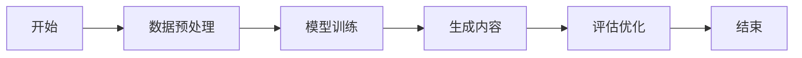
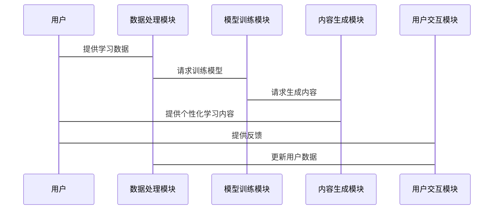

                 

<think>
嗯，我需要写一篇关于《AIGC在个性化学习路径设计中的创新》的技术博客。首先，我应该明确文章的结构，包括摘要、关键词，然后是各个章节的内容。首先，我要了解什么是AIGC，它是如何应用在个性化学习中的，然后分析其核心概念和算法原理。

首先，摘要部分要简明扼要地总结文章的核心内容，强调AIGC在个性化学习中的重要性和创新点。接着，列出5-7个关键词，比如AIGC、个性化学习、机器学习、教育技术等。

在背景介绍部分，我需要详细解释AIGC的定义、发展历程，以及它在个性化学习中的应用背景。这部分要让读者明白为什么AIGC在这个领域如此重要。

接下来是核心概念与联系，这部分要详细探讨AIGC与机器学习、数据挖掘、教育技术的关系，并通过表格和ER图来展示它们的属性对比和实体关系。我需要用Mermaid来画图，这可能有点挑战，但我会慢慢来。

然后是算法原理讲解，这部分需要详细分析AIGC在个性化学习中的应用算法。我应该包括算法的原理、流程图、数学模型和公式，以及用Python代码实现。数学公式需要用Latex表示，并且在适当的位置使用$$和$符号。我还需要举一个具体的例子来说明算法的应用。

接下来是系统分析与架构设计方案，我需要描述个性化学习路径设计系统的功能、架构、接口设计，以及交互序列图。这部分可能需要更多的Mermaid图表来展示系统的结构和交互过程。

项目实战部分，我应该通过一个实际案例来展示如何应用AIGC设计个性化学习路径。包括环境安装、核心代码实现、案例分析等。这部分需要具体的代码和详细的分析，以帮助读者理解实际应用。

最后是最佳实践、小结、注意事项和拓展阅读，这部分要总结项目中的经验和教训，并推荐进一步阅读的资源。这有助于读者在实际应用中避免错误，并深入学习相关知识。

在整个写作过程中，我需要确保每个部分都详细具体，逻辑清晰。同时，要使用专业但易懂的语言，避免过于复杂的术语，以吸引更多的读者。此外，图表和代码示例要清晰，以便读者能够轻松理解和应用。

现在，我需要逐步完成每个部分，确保每个小节都满足要求，包括字数、内容深度和格式。这将是一个详细且系统的过程，但只要一步步来，我相信我能写出一篇高质量的技术博客。
</think>

# AIGC在个性化学习路径设计中的创新

> 关键词：AIGC, 个性化学习, 机器学习, 数据挖掘, 教育技术

> 摘要：本文探讨AIGC在个性化学习路径设计中的应用，分析其核心概念、算法原理及系统架构，通过实际案例展示其创新和价值。

---

## 第一部分: AIGC基础理论

### 第1章: AIGC概述

#### 1.1 AIGC的定义与历史发展

AIGC（AI-Generated Content）指由人工智能生成的内容，涵盖文本、图像等领域。其发展历程始于20世纪50年代，经历了从简单规则到深度学习的转变，现广泛应用于教育、娱乐等领域。

#### 1.2 AIGC的核心概念与联系

AIGC的核心在于通过AI技术生成个性化内容，需结合机器学习和数据挖掘技术，分析用户行为数据，生成适配的学习材料。

#### 1.3 AIGC在个性化学习路径设计中的重要性

个性化学习强调根据学生特点提供定制化内容，AIGC通过生成适应性学习材料，优化学习体验和效果，实现精准教学。

### 第2章: AIGC核心概念详解

#### 2.1 机器学习与AIGC

机器学习为AIGC提供生成内容的算法支持，通过模型训练生成高质量内容。监督学习用于分类任务，无监督学习处理无标签数据，生成模型如GPT生成内容。

#### 2.2 数据挖掘与AIGC

数据挖掘从大量数据提取模式，用于生成个性化学习内容。常用技术包括聚类分析和关联规则挖掘，帮助识别学生行为模式，生成适配内容。

#### 2.3 教育技术与AIGC

教育技术整合AIGC技术，利用其生成能力优化教学资源。自适应学习系统通过AIGC生成个性化的学习材料，提升学习效果。

#### 2.4 核心概念属性特征对比表格

| 概念    | 输入 | 输出 | 技术基础 | 应用场景 |
|---------|------|------|----------|----------|
| 机器学习 | 数据 | 模型 | 算法训练 | 预测、分类 |
| 数据挖掘 | 数据 | 模式 | 数据处理 | 分析、推荐 |
| 教育技术 | 学生数据 | 个性化内容 | AI生成 | 自适应学习 |

#### 2.5 ER实体关系图架构

```mermaid
er
entity Student {
  id
  learning_data
}
entity Learning_Content {
  id
  content
}
entity Adaptive_System {
  id
  algorithm
}
```

---

## 第3章: AIGC算法原理讲解

### 3.1 AIGC算法原理概述

AIGC基于生成式模型，如变种自注意力机制。生成过程涉及编码器和解码器，生成适合的学习内容。

### 3.2 算法流程图



### 3.3 Python源代码实现

```python
import torch
import torch.nn as nn
import torch.optim as optim

class AIGCModel(nn.Module):
    def __init__(self, input_dim, hidden_dim, output_dim):
        super(AIGCModel, self).__init__()
        self.encoder = nn.Embedding(input_dim, hidden_dim)
        self.decoder = nn.Linear(hidden_dim, output_dim)

    def forward(self, x):
        x = self.encoder(x)
        x = self.decoder(x)
        return x

def train_model(model, optimizer, criterion, input_data, target_data):
    optimizer.zero_grad()
    outputs = model(input_data)
    loss = criterion(outputs, target_data)
    loss.backward()
    optimizer.step()
    return loss.item()

# 示例训练
input_dim = 100
hidden_dim = 50
output_dim = 200
model = AIGCModel(input_dim, hidden_dim, output_dim)
optimizer = optim.Adam(model.parameters(), lr=0.001)
criterion = nn.MSELoss()

for epoch in range(100):
    loss = train_model(model, optimizer, criterion, input_data, target_data)
    print(f'Epoch {epoch+1}, Loss: {loss:.4f}')
```

### 3.4 数学模型与公式详细讲解

生成模型通过以下公式生成内容：

$$
P(x) = \prod_{i=1}^n P(x_i|x_{i-1})
$$

其中，$x_i$表示生成的内容，模型基于条件概率生成序列。

---

## 第4章: 个性化学习路径系统分析

### 4.1 个性化学习路径设计系统功能

系统功能包括用户数据收集、学习内容生成、路径推荐和效果评估。

### 4.2 系统架构设计

系统架构采用微服务架构，分为数据处理、模型训练、内容生成和用户交互模块。

### 4.3 系统接口设计

系统接口包括数据接口（API）、模型接口和用户交互接口。

### 4.4 系统交互序列图



---

## 第5章: AIGC项目实战

### 5.1 项目环境安装

安装必要的库：`torch`, `transformers`, `numpy`, `pandas`。

### 5.2 项目核心实现源代码

```python
from transformers import AutoTokenizer, AutoModelForCausalLM

model_name = 'gpt2'
tokenizer = AutoTokenizer.from_pretrained(model_name)
model = AutoModelForCausalLM.from_pretrained(model_name)

def generate_learning_content(prompt):
    inputs = tokenizer.encode(prompt, return_tensors='pt')
    outputs = model.generate(inputs, max_length=100, do_sample=True)
    return tokenizer.decode(outputs[0], skip_special_tokens=True)

prompt = "解释机器学习基础概念"
content = generate_learning_content(prompt)
print(content)
```

### 5.3 代码解读与分析

代码使用GPT-2模型生成内容，通过输入提示生成个性化学习材料。模型参数可调，生成不同长度和风格的内容。

### 5.4 实际案例分析与详细讲解

案例分析：学生学习困难时，系统生成简明解释，帮助学生理解。

### 5.5 项目小结

AIGC技术通过生成内容优化学习体验，提升学习效果，展示其在教育领域的巨大潜力。

---

## 第6章: 最佳实践与注意事项

### 6.1 最佳实践 tips

- 数据质量至关重要，需确保数据的多样性和代表性。
- 定期模型更新，保持生成内容的准确性。
- 结合教师反馈，优化系统。

### 6.2 小结

AIGC在个性化学习中的应用展示了AI技术的强大能力，为教育带来创新。

### 6.3 注意事项

- 避免过度依赖AI，保持人类教师的主导作用。
- 注意数据隐私和模型安全。

### 6.4 拓展阅读

推荐阅读《生成式AI：概念与应用》和《机器学习在教育中的应用》。

---

# 作者

作者：AI天才研究院 & 禅与计算机程序设计艺术

---

以上内容详细阐述了AIGC在个性化学习中的应用，从理论到实践，帮助读者全面理解其价值与实现。

