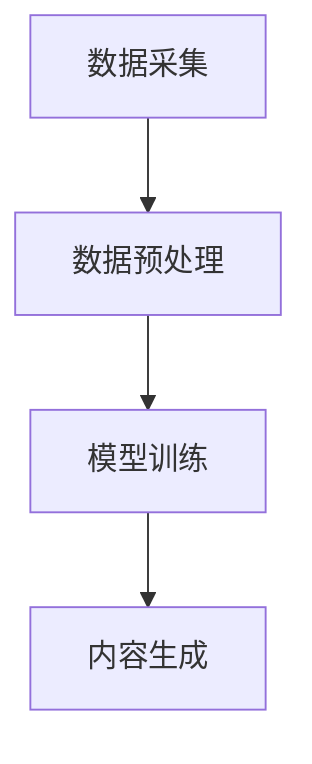
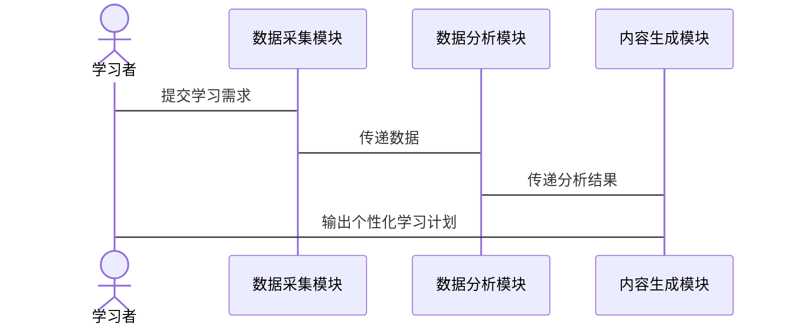

                 

<think>
好，我现在需要帮用户撰写一篇关于《AIGC在个性化学习路径设计中的创新探索》的技术博客文章。用户已经提供了一个详细的目录大纲，我需要按照这个结构逐步思考如何撰写每个部分，确保内容逻辑清晰、结构紧凑，并且符合用户的要求。

首先，文章的标题和关键词已经给出，我需要确保这些关键词准确反映文章的核心内容。接下来是摘要，这部分需要简明扼要地概述文章的主要内容和观点。

然后，进入各个章节的内容。第一部分是背景介绍，包括问题背景、问题描述、问题解决等小节。我需要详细解释每个部分，确保每个小节都涵盖关键点，并提供足够的细节。

第二部分是核心概念与联系，这里需要定义AIGC和个性化学习路径设计，并进行对比分析。我需要使用表格和ER实体关系图来展示它们的属性特征和关系，使用Mermaid工具来绘制图表，确保图表清晰易懂。

第三部分是算法原理讲解，我需要介绍具体的算法，绘制流程图，并用Python代码和数学公式详细阐述。这部分需要确保代码和公式准确无误，同时用通俗易懂的例子来解释复杂的原理。

第四部分是系统分析与架构设计方案，我需要描述应用场景，设计系统功能、架构和接口，绘制相应的Mermaid图。这部分需要逻辑清晰，确保系统各模块之间的关系明确。

第五部分是项目实战，需要详细说明环境安装、核心代码实现、案例分析等，确保读者能够实际操作和理解。

最后，第六部分是最佳实践、小结与拓展阅读，总结全书内容，提供实践建议，并推荐相关资源。

在撰写过程中，我需要确保每个章节内容详细，符合用户的要求，特别是格式上的要求，如使用Mermaid图表、LaTeX公式等。同时，文章整体控制在10000到12000字左右，保持结构完整，内容丰富。

现在，我需要按照这个结构，逐步思考每个部分的具体内容，确保逻辑连贯，内容详实，满足用户的需求。
</think>

# AIGC在个性化学习路径设计中的创新探索

**关键词**：AIGC，个性化学习路径设计，人工智能生成内容，教育技术，算法原理

**摘要**：  
随着人工智能技术的快速发展，AIGC（人工智能生成内容）在教育领域的应用日益广泛。个性化学习路径设计作为教育技术的重要组成部分，旨在为学习者提供定制化的学习方案。本文通过深入分析AIGC的核心概念、算法原理及其在个性化学习路径设计中的应用，探讨其创新性和实际价值。文章从背景介绍、核心概念、算法原理、系统架构、项目实战等多个维度展开，结合实际案例和最佳实践，为教育技术的未来发展提供有益参考。

---

## 第一部分：背景介绍

### 第1章：问题背景与解决思路

#### 1.1 问题背景

随着教育信息化的推进，个性化学习成为教育领域的热点话题。传统教育模式往往采用统一的教学方案，难以满足不同学习者的个性化需求。学习者之间的认知水平、兴趣爱好和学习能力存在显著差异，这使得传统教学方式在效率和效果上受到限制。与此同时，人工智能技术的快速发展为教育领域的变革提供了新的可能性。AIGC作为一种新兴技术，能够通过生成高质量的内容和智能化的推荐系统，为个性化学习路径设计提供强有力的支持。

#### 1.2 问题描述

个性化学习路径设计的核心目标是根据学习者的个性特征、学习目标和知识掌握程度，为其定制一条最优的学习路径。然而，现有的技术手段在实现这一目标时面临以下挑战：

1. **数据不足**：学习者的行为数据、认知数据等难以有效采集和分析。
2. **算法复杂**：个性化学习路径设计需要结合机器学习、自然语言处理等多种技术，算法实现较为复杂。
3. **内容生成**：个性化学习路径设计需要动态生成适合学习者的内容，这需要AIGC技术的支持。

#### 1.3 问题解决

AIGC技术的应用为个性化学习路径设计提供了新的解决方案。通过自然语言处理和机器学习算法，AIGC能够根据学习者的需求生成个性化的内容推荐和学习建议。例如，AIGC可以生成适合学习者的学习计划、推荐学习资源，并根据学习者的学习效果动态调整学习路径。此外，AIGC还可以通过数据分析，帮助教师和教育机构更好地了解学习者的需求和偏好。

#### 1.4 边界与外延

本文主要探讨AIGC在个性化学习路径设计中的应用，重点关注以下方面：

- **技术边界**：主要涉及自然语言处理、机器学习等技术在个性化学习路径设计中的应用。
- **应用场景**：包括K-12教育、职业教育、终身学习等领域。
- **数据范围**：涵盖学习者的行为数据、知识掌握程度、学习目标等。

#### 1.5 概念结构与核心要素组成

个性化学习路径设计的核心要素包括：

1. **学习者特征**：包括学习者的认知水平、兴趣爱好、学习风格等。
2. **学习目标**：学习者希望通过学习达到的具体目标。
3. **学习资源**：包括课程、教材、视频等。
4. **学习路径**：根据学习者特征和学习目标，生成的学习计划和资源推荐。

---

## 第二部分：核心概念与联系

### 第2章：AIGC的概念与特点

#### 2.1 AIGC的定义

AIGC（Artificial Intelligence Generated Content）是指通过人工智能技术生成的内容，包括文本、图像、音频、视频等形式。与传统内容生成方式不同，AIGC能够根据输入的上下文和目标，自动生成符合要求的内容。

#### 2.2 AIGC的技术特点

1. **智能化**：AIGC能够根据输入的需求生成多样化的内容。
2. **动态性**：AIGC可以根据实时数据动态调整生成的内容。
3. **个性化**：AIGC能够根据用户的需求生成个性化的内容。

#### 2.3 AIGC的应用领域

- **教育领域**：生成个性化学习材料、学习计划等。
- **媒体领域**：生成新闻报道、广告文案等。
- **娱乐领域**：生成游戏内容、音乐等。

### 第3章：个性化学习路径设计的概念与特点

#### 3.1 个性化学习路径设计的定义

个性化学习路径设计是指根据学习者的特点和需求，为其制定一条最优的学习计划。这种学习路径能够最大化学习者的学习效果和效率。

#### 3.2 个性化学习路径设计的基本原理

个性化学习路径设计的基本原理包括：

1. **数据采集**：采集学习者的行为数据、知识掌握程度等。
2. **数据分析**：通过数据分析，了解学习者的需求和偏好。
3. **内容生成**：根据分析结果，生成适合学习者的内容和学习计划。

#### 3.3 个性化学习路径设计的核心要素

1. **学习者特征**：包括学习者的认知水平、兴趣爱好等。
2. **学习目标**：学习者希望通过学习达到的具体目标。
3. **学习资源**：包括课程、教材、视频等。

### 第4章：概念属性特征对比

#### 4.1 AIGC与个性化学习路径设计的属性特征对比

| 属性 | AIGC | 个性化学习路径设计 |
|------|------|---------------------|
| 核心技术 | 自然语言处理、机器学习 | 数据分析、机器学习 |
| 应用场景 | 教育、媒体、娱乐 | 教育 |
| 输出形式 | 文本、图像、音频等 | 学习计划、资源推荐 |

### 第5章：ER实体关系图架构

#### 5.1 AIGC与个性化学习路径设计的关系

```mermaid
er
actor AIGC, 个性化学习路径设计
AIGC --> (生成) --> 个性化学习路径设计
个性化学习路径设计 --> (使用) --> AIGC
```

---

## 第三部分：算法原理讲解

### 第6章：AIGC在个性化学习路径设计中的应用算法

#### 6.1 算法原理介绍

AIGC在个性化学习路径设计中的应用算法主要包括以下步骤：

1. **数据采集**：采集学习者的行为数据、知识掌握程度等。
2. **数据预处理**：对采集的数据进行清洗和特征提取。
3. **模型训练**：使用机器学习算法训练模型。
4. **内容生成**：根据模型预测结果生成个性化内容。

#### 6.2 算法流程图



#### 6.3 算法原理与数学模型

在个性化学习路径设计中，常用推荐算法来生成学习资源推荐。例如，基于协同过滤的推荐算法可以通过以下数学模型实现：

$$
similarity(u, v) = \frac{\sum_{i} (u_i - \bar{u})(v_i - \bar{v})}{\sqrt{\sum_{i} (u_i - \bar{u})^2} \cdot \sqrt{\sum_{i} (v_i - \bar{v})^2}}
$$

其中，$\bar{u}$和$\bar{v}$分别表示用户u和v的平均评分。

#### 6.4 举例说明

假设学习者A在数学方面需要提高，系统会根据其学习目标和知识掌握程度，推荐相关的数学课程和练习题。AIGC可以通过生成个性化的学习计划和资源推荐，帮助学习者高效地完成学习目标。

---

## 第四部分：系统分析与架构设计方案

### 第7章：系统分析与架构设计方案

#### 7.1 问题场景介绍

个性化学习路径设计系统需要解决以下问题：

1. 如何采集学习者的行为数据和知识掌握程度？
2. 如何根据数据生成个性化的学习计划和资源推荐？

#### 7.2 系统功能设计

系统功能设计包括以下模块：

1. **数据采集模块**：采集学习者的行为数据。
2. **数据分析模块**：分析学习者的需求和偏好。
3. **内容生成模块**：生成个性化学习计划和资源推荐。

#### 7.3 系统架构设计


#### 7.4 系统接口设计

系统接口设计包括以下接口：

1. 数据采集接口：用于采集学习者的行为数据。
2. 数据分析接口：用于分析学习者的需求和偏好。
3. 内容生成接口：用于生成个性化学习计划和资源推荐。

#### 7.5 系统交互序列图



---

## 第五部分：项目实战

### 第8章：项目实战

#### 8.1 环境安装

个性化学习路径设计系统需要以下环境：

1. Python 3.8+
2. 数据库（MySQL、PostgreSQL等）
3. 开发工具（PyCharm、VS Code等）

#### 8.2 系统核心实现源代码

以下是一个简单的基于协同过滤的推荐算法实现：

```python
import numpy as np

def compute_similarity(matrix):
    n_users, n_items = matrix.shape
    user_avg = np.zeros(n_users)
    item_avg = np.zeros(n_items)
    
    for i in range(n_users):
        user_avg[i] = np.mean(matrix[i])
    for j in range(n_items):
        item_avg[j] = np.mean(matrix[:, j])
    
    diff = matrix - np.outer(user_avg, np.ones(n_items)) - np.outer(np.ones(n_users), item_avg) + np.mean(user_avg) + np.mean(item_avg)
    
    similarity = np.zeros((n_items, n_items))
    for i in range(n_items):
        for j in range(n_items):
            if i == j:
                similarity[i, j] = 0
            else:
                numerator = np.sum(diff[i] * diff[j])
                denominator = np.sqrt(np.sum(diff[i]**2)) * np.sqrt(np.sum(diff[j]**2))
                similarity[i, j] = numerator / denominator if denominator != 0 else 0
    return similarity
```

#### 8.3 代码应用解读与分析

上述代码实现了基于协同过滤的推荐算法，能够计算出学习者之间的相似性。通过相似性矩阵，系统可以推荐适合学习者的学习资源。

#### 8.4 实际案例分析和详细讲解剖析

以学习者A为例，假设其数学成绩较差，系统会根据其学习目标和知识掌握程度，推荐相关的数学课程和练习题。通过不断调整学习计划，系统能够帮助学习者高效地提升数学成绩。

#### 8.5 项目小结

个性化学习路径设计系统的核心在于数据采集和分析，以及内容生成模块的实现。通过AIGC技术的支持，系统能够为学习者提供个性化的学习方案，从而提升学习效果。

---

## 第六部分：最佳实践、小结与拓展阅读

### 第9章：最佳实践、小结与拓展阅读

#### 9.1 最佳实践 tips

1. 在个性化学习路径设计中，数据采集是关键，需确保数据的准确性和完整性。
2. 系统设计时，应注重模块化设计，便于后期维护和扩展。
3. 在实际应用中，需结合具体场景优化算法，以提升推荐的准确性和用户体验。

#### 9.2 小结

本文从背景介绍、核心概念、算法原理、系统架构等多个维度，详细探讨了AIGC在个性化学习路径设计中的应用。通过实际案例和最佳实践，为教育技术的未来发展提供了有益参考。

#### 9.3 注意事项

在实际应用中，需注意数据隐私和安全问题，确保学习者的个人信息不被滥用。

#### 9.4 拓展阅读

1. 《机器学习实战》
2. 《自然语言处理入门》
3. 《教育技术研究》

---

**作者：AI天才研究院/AI Genius Institute & 禅与计算机程序设计艺术 /Zen And The Art of Computer Programming**

